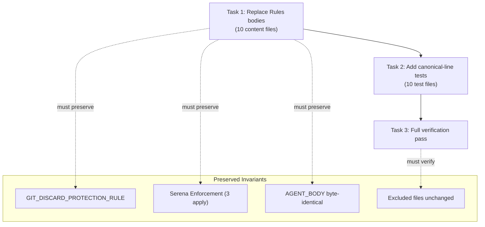

# Tasks: Consolidate Using-Agent-Skills Guidance

## Source

- Spec: consolidate-using-agent-skills spec artifact
- Design: consolidate-using-agent-skills design artifact
- Capabilities affected: developer-team-prompt-canonicalization (modified)

## OQ-002 Blocker Resolution

**Resolved.** All phase-specific Rules bullets across the 10 target files are already captured by one of:

1. **AGENT_BODY Role/Non-Goals sections** — scope exclusions ("Do not implement frontend UI", "Do not write specs"), terminal agent declarations ("Do not delegate further"), exploration constraints ("Do not perform broad exploration").
2. **using-agent-skills Core Operating Behaviors** — "Make minimal changes" (Enforce Simplicity), "Report blockers immediately" (Surface Assumptions), "Preserve uncertainty" (Surface Assumptions), "Run verification" (Verify Don't Assume), "If task cannot be implemented, explain why" (Push Back).
3. **SKILL_BODY methodology sections** — format guidelines ("Use Given/When/Then", "Include Mermer diagram"), domain patterns ("Follow existing backend/frontend patterns").

No additional preservation outside `## Rules` is needed. The canonical line replaces the entire Rules body in all 10 files.

## Task Groups

### Group: Shared / Contracts

#### Task 1: Replace Rules block bodies in 10 content files
**Owner**: General Apply
**Priority**: P0 (blocking)
**Complexity**: Medium
**Parallel**: Yes
**Depends on**: none

**Description**
Replace the `## Rules` block body in each of the 10 target SKILL_BODY template literals with the exact canonical line: `Follow the using-agent-skills skill for operating behaviors and failure mode guidance.`

For each file:
1. Locate the `## Rules` heading inside the `SKILL_BODY` template literal.
2. Replace all content between the `## Rules` heading and the next `## ` section heading (or closing backtick) with a single blank line followed by the canonical line followed by a single blank line.
3. Verify `${GIT_DISCARD_PROTECTION_RULE}` interpolation is still present immediately before `## Rules` — this is a **critical Git safety invariant**.
4. Verify `AGENT_BODY` export is byte-identical to pre-change state (diff against `HEAD`).
5. For the 3 apply agents (`apply-backend`, `apply-frontend`, `apply-general`), verify `## Serena Enforcement` block remains intact immediately after the canonicalized `## Rules` block.
6. Verify no trailing bullet points, duplicate canonical lines, or indentation variants remain in the `## Rules` body.

**Files**
- `packages/core/src/teams/developer/apply-backend-content.ts` — modify (Rules body lines ~229-241)
- `packages/core/src/teams/developer/apply-frontend-content.ts` — modify (Rules body lines ~233-246)
- `packages/core/src/teams/developer/apply-general-content.ts` — modify (Rules body lines ~227-237)
- `packages/core/src/teams/developer/proposal-content.ts` — modify (Rules body lines ~272-284)
- `packages/core/src/teams/developer/spec-content.ts` — modify (Rules body lines ~366-377)
- `packages/core/src/teams/developer/design-content.ts` — modify (Rules body lines ~327-342)
- `packages/core/src/teams/developer/task-content.ts` — modify (Rules body lines ~398-409)
- `packages/core/src/teams/developer/review-content.ts` — modify (Rules body lines ~307-318)
- `packages/core/src/teams/developer/verify-content.ts` — modify (Rules body lines ~276-285)
- `packages/core/src/teams/developer/archive-content.ts` — modify (Rules body lines ~301-310)

**Verification**
- For each of the 10 files: `grep -c "Follow the using-agent-skills skill for operating behaviors and failure mode guidance." <file>` returns exactly 1.
- For each file: no line matching `^\s*- ` appears between `## Rules` and the next `## ` heading.
- `git diff -- packages/core/src/teams/developer/*-content.ts` shows only SKILL_BODY Rules body changes; no AGENT_BODY diffs.
- `grep -r 'GIT_DISCARD_PROTECTION_RULE' packages/core/src/teams/developer/apply-backend-content.ts` (and all 10 files) still returns a match.
- TypeScript compilation: `bunx tsc --noEmit` passes.

#### Task 2: Add canonical-line and structural-preservation tests
**Owner**: General Apply
**Priority**: P0 (blocking)
**Complexity**: Medium
**Parallel**: No — depends on Task 1 content changes being in place
**Depends on**: Task 1

**Description**
Add new additive test cases to each of the 10 `*-content.test.ts` files asserting the canonicalization contract. Do not modify or remove any existing test cases.

**Per-file tests to add (all 10 test files):**

1. **Canonical line present exactly once** — `{NAME}_SKILL_BODY` contains the exact string `Follow the using-agent-skills skill for operating behaviors and failure mode guidance.` and it appears exactly once (no duplicates).
2. **No bullet variants** — `{NAME}_SKILL_BODY` does not contain `- Follow the using-agent-skills` or any bullet-wrapped/indented variant of the canonical line.
3. **AGENT_BODY untouched** — `{NAME}_AGENT_BODY` does NOT contain the canonical line.
4. **## Rules heading preserved** — `{NAME}_SKILL_BODY` still contains `## Rules`.
5. **Git safety preserved** — `{NAME}_SKILL_BODY` contains `GIT_SAFETY_SENTINEL` (or the git-safety import mechanism used by existing tests).

**Additional tests for 3 apply-agent test files (`apply-backend`, `apply-frontend`, `apply-general`):**

6. **Serena Enforcement preserved** — `{NAME}_SKILL_BODY` contains `## Serena Enforcement` heading.

**Exclusion verification (add to one representative test file, e.g., `apply-general-content.test.ts`):**

7. **Excluded files unchanged** — Import `ORCHESTRATOR_AGENT_BODY`/`ORCHESTRATOR_SKILL_BODY` from `orchestrator-content`, `EXPLORER_AGENT_BODY` from `explorer-content`, and assert each still contains its original `## Rules` bullet text (i.e., was NOT canonicalized).

**Files**
- `packages/core/src/teams/developer/apply-backend-content.test.ts` — modify (additive)
- `packages/core/src/teams/developer/apply-frontend-content.test.ts` — modify (additive)
- `packages/core/src/teams/developer/apply-general-content.test.ts` — modify (additive)
- `packages/core/src/teams/developer/proposal-content.test.ts` — modify (additive)
- `packages/core/src/teams/developer/spec-content.test.ts` — modify (additive)
- `packages/core/src/teams/developer/design-content.test.ts` — modify (additive)
- `packages/core/src/teams/developer/task-content.test.ts` — modify (additive)
- `packages/core/src/teams/developer/review-content.test.ts` — modify (additive)
- `packages/core/src/teams/developer/verify-content.test.ts` — modify (additive)
- `packages/core/src/teams/developer/archive-content.test.ts` — modify (additive)

**Verification**
- `bun test packages/core/src/teams/developer/` — all tests pass, including existing `git-safety.test.ts`.
- No existing test fails due to the new additions.
- No test asserts old Rules bullet text or old bullet counts.

#### Task 3: Full verification pass
**Owner**: General Apply
**Priority**: P0 (blocking)
**Complexity**: Low
**Parallel**: No — depends on Task 2 tests passing
**Depends on**: Task 2

**Description**
Run the complete verification suite to confirm all acceptance scenarios from the Spec are satisfied.

1. Run `bun test packages/core/src/teams/developer/` — all tests pass.
2. Run `bunx tsc --noEmit` — TypeScript compilation succeeds with no errors.
3. Verify excluded files are byte-identical to `HEAD`:
   - `packages/core/src/teams/developer/orchestrator-content.ts`
   - `packages/core/src/teams/developer/explorer-content.ts`
   - `packages/core/src/teams/developer/visual-explanations-content.ts`
   - `packages/core/src/skills/external/using-agent-skills/SKILL.md`
4. Verify `packages/core/src/teams/developer/git-safety.ts` is byte-identical to `HEAD`.
5. Spot-check 2-3 files for the canonical line presence and AGENT_BODY non-mutation.

**Files**
- No file modifications — verification only.

**Verification**
- All commands return exit code 0.
- `git diff HEAD -- <excluded files>` shows no changes.
- Canonical line appears exactly once in each of the 10 target SKILL_BODY exports.

## Dependency Graph

```
Task 1 (Replace Rules bodies — 10 content files)
  → Task 2 (Add tests — 10 test files)
    → Task 3 (Full verification pass)
```

## Parallelization Plan

| Phase | Tasks | Can Run in Parallel |
|---|---|---|
| Shared / Contracts | 1, 2, 3 | No — strict sequential dependency chain |

## Responsibility Contracts

| Contract / Boundary | Owner | Consumers | Notes |
|---|---|---|---|
| Canonical line text | Task 1 (General Apply) | Task 2 (tests assert it) | Exact string: `Follow the using-agent-skills skill for operating behaviors and failure mode guidance.` |
| AGENT_BODY immutability | Task 1 (General Apply) | Task 2 (tests assert it) | Byte-identical to HEAD after Rules replacement |
| GIT_DISCARD_PROTECTION_RULE presence | Task 1 (General Apply) | Task 2, git-safety.test.ts | Critical Git safety — must be preserved at original position before ## Rules |
| Serena Enforcement preservation | Task 1 (General Apply) | Task 2 (apply tests assert it) | ## Serena Enforcement block in 3 apply agents must remain unchanged after ## Rules |
| Excluded file immutability | Task 3 (General Apply) | Task 2 (one test asserts it) | orchestrator, explorer, visual-explanations, using-agent-skills SKILL.md must not change |

## Complexity Summary

| Complexity | Count | Task Numbers |
|---|---|---|
| Low | 1 | 3 |
| Medium | 2 | 1, 2 |
| High | 0 | — |

## Flagged for Splitting

None. Task 1 touches 10 files but each edit is mechanically identical (same pattern, same canonical line). Task 2 is additive across 10 test files with repetitive assertion patterns. Neither exceeds session-scale complexity.

## Review Workload Forecast

| Signal | Value |
|---|---|
| Estimated changed lines | 100-400 |
| 400-line budget risk | Low |
| Scope reduction recommended | No |
| Sequential work slices recommended | No |
| Decision needed before Apply | No — OQ-002 resolved above |

**Rationale**: The change removes ~120 lines of Rules bullets across 10 files and replaces them with ~10 lines of canonical text (net reduction ~110 lines). Test additions are ~80-120 lines of repetitive assertions across 10 files. Total net change is modest. The review risk is low because each edit follows an identical mechanical pattern and all invariants have explicit test coverage.

## Open Questions / Blockers

None — tasks are ready for Apply.

- OQ-002 (phase-specific rules preservation): **Resolved.** All phase-specific Rules bullets are already captured by AGENT_BODY Role/Non-Goals sections and using-agent-skills. No additional preservation needed. Routed into Task 1's verification sub-step.
- OQ-001 (AGENT_BODY snapshot vs. targeted test): **Deferred per Design recommendation.** Additive AGENT_BODY test + manual diff against HEAD is sufficient for Phase 3A.
- OQ-003 (full test suite vs. focused tests): **Focused Developer Team tests** (`bun test packages/core/src/teams/developer/`) are the primary verification target. Task 3 also runs TypeScript compilation.

## Mermaid Summary Source


