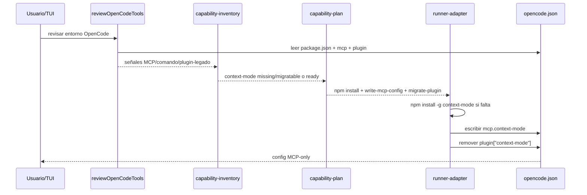
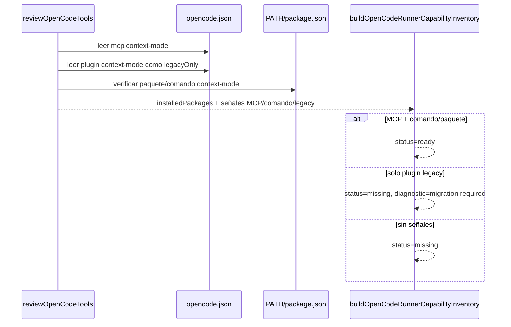
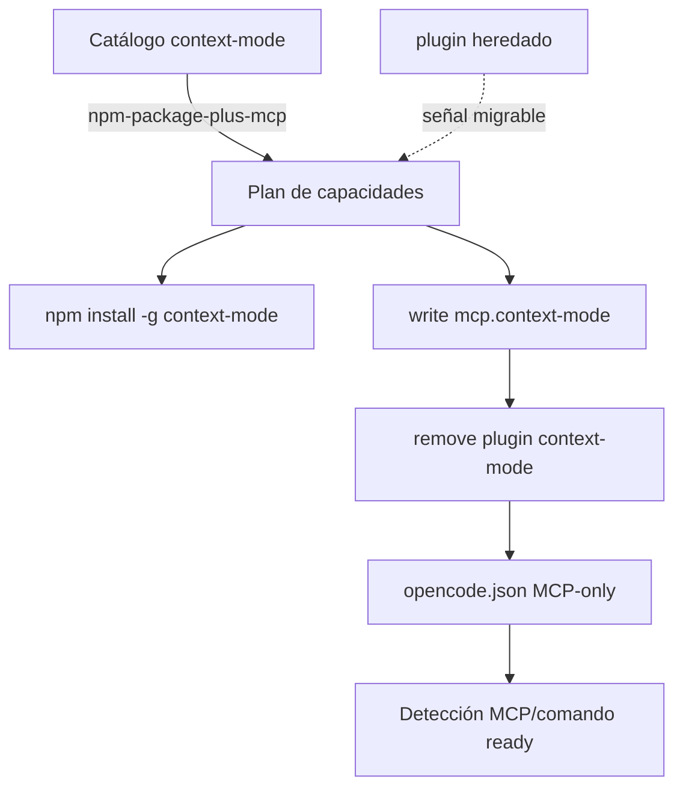

# Design: Adaptador MCP para context-mode en OpenCode

## Source

- Proposal: `context-mode-mcp-adapter` proposal artifact
- Capabilities affected: `opencode-tool-installation`, `opencode-capability-detection`
- Spec status: not yet available
- Modo registry: deferred; no se escribe `state.yaml` ni `events.yaml` en esta fase.

## Current Architecture Context

| Área | Estado actual | Evidencia |
|---|---|---|
| Catálogo | `context-mode` está catalogado como `installKind: "opencode-plugin"` y se detecta por `detector.pluginNames: ["context-mode"]`. | `packages/adapter-opencode/src/capability-catalog.ts` |
| Plan instalable | `OPENCODE_INSTALLABLE_TOOLS` define `context-mode` como módulo `context-mode` con `installKind: "opencode-plugin"`. | `packages/adapter-opencode/src/installation-plan.ts` |
| Plan de acciones | `opencode-plugin` genera acción `install-opencode-plugin`; `mcp-server` solo genera `write-mcp-config`. `shell-script-plus-mcp` ya modela instalación + escritura MCP. | `packages/adapter-opencode/src/capability-plan.ts` |
| Ejecución | `install-opencode-plugin` invoca `installOpenCodeTools()`. `write-mcp-config` delega a `writeMcpConfigFromCapability()`. | `packages/adapter-opencode/src/runner-adapter.ts` |
| Escritura MCP | `writeOpenCodeMcpConfig()` escribe `mcp.<server>` con `{ type, enabled, command/url }`; no migra plugins. | `packages/adapter-opencode/src/opencode-mcp-config.ts` |
| Merge config | `mergeConfig()` hoy elimina `mcp.context-mode` si `plugin` contiene `context-mode`, porque el diseño previo prefería plugin. Esa regla entra en conflicto con MCP-only. | `packages/adapter-opencode/src/config-merge.ts` |
| Detección runtime | `reviewOpenCodeTools()` toma nombres desde `package.json`, `opencode.json.mcp`, `opencode.json.plugin` y comandos conocidos; no distingue MCP canónico vs plugin heredado. | `packages/adapter-opencode/src/required-tools.ts` |

Contexto oficial verificado del paquete npm:

- Paquete npm oficial: `context-mode`.
- Binario expuesto: `context-mode`.
- Config oficial incluida en el paquete para OpenCode: `mcp.context-mode.command = ["context-mode"]`; también incluye `plugin`, pero la decisión de usuario exige migración limpia MCP-only.
- El paquete scoped `@context-mode/context-mode-mcp` no existe en npm al momento de diseño (`npm view` devolvió 404).

## Proposed Architecture

Convertir `context-mode` en una capacidad **npm + MCP local**:

1. Instalar el paquete npm global `context-mode` para disponer del binario local.
2. Escribir/actualizar `opencode.json.mcp["context-mode"]` con servidor local.
3. Remover `"context-mode"` de `opencode.json.plugin` durante la migración.
4. Detectar `context-mode` como instalado solo cuando exista señal MCP/comando válida; el plugin heredado no debe marcar `ready`, sino `missing`/`migratable` mediante diagnóstico y plan de migración.
5. Mantener sin cambios el instruction bundle de `packages/core/.../context-mode.ts`.

### Decisiones de arquitectura

| Decisión | Diseño |
|---|---|
| Kind de instalación | Agregar `npm-package-plus-mcp` a los tipos compartidos de instalación/catálogo, paralelo a `shell-script-plus-mcp`. |
| Paquete/binario | Usar paquete npm `context-mode`; instalar con `npm install -g context-mode`; ejecutar MCP con binario `context-mode`. |
| Nombre MCP canónico | `context-mode`, igual que config oficial y capability ID. |
| Config MCP | Local, habilitada, comando-array `command: ["context-mode"]`; sin args ni env por defecto. |
| Migración | MCP gana sobre plugin: escribir MCP y eliminar solo la entrada `"context-mode"` del arreglo `plugin`, preservando otros plugins. |
| Detección | Sustituir detección plugin-first por detección MCP/comando; plugin heredado produce diagnóstico migrable y no instala soporte dual. |

### Component / Module Boundaries

| Component | Responsibility | Change Type |
|---|---|---|
| `capability-catalog.ts` | Fuente de verdad para install kind, source y detectores de capacidades. | modified |
| `installation-plan.ts` | Lista de herramientas instalables y kind usado por `buildOpenCodeInstallationPlan()`. | modified |
| `capability-plan.ts` | Traduce inventario faltante a acciones: npm install + write MCP + migrate plugin. | modified |
| `runner-adapter.ts` | Ejecuta acciones genéricas y mapea capability → MCP config. | modified |
| `opencode-mcp-config.ts` | Escribe config MCP y debe soportar limpieza idempotente de plugin heredado para `context-mode`. | modified |
| `config-merge.ts` | Merge de `opencode.json` durante instalación del Developer Team; debe dejar de borrar MCP cuando hay plugin y pasar a remover plugin `context-mode`. | modified |
| `capability-inventory.ts` | Construye estado de capacidades desde revisión; debe separar señal MCP/comando de señal plugin heredada. | modified |
| `required-tools.ts` | Lee `opencode.json` y comandos disponibles; debe exponer señales suficientes para MCP vs plugin. | modified |
| Tests en `packages/adapter-opencode/src/*.test.ts` | Validar catálogo, plan, config, migración y detección. | modified |

### Data Flow

#### Flujo de instalación/migración

1. Usuario selecciona `context-mode`.
2. `reviewOpenCodeTools()` lee:
   - `~/.config/opencode/package.json` para paquete `context-mode`.
   - `~/.config/opencode/opencode.json.mcp["context-mode"]`.
   - `~/.config/opencode/opencode.json.plugin` para detectar legado.
   - `PATH` para comando `context-mode`.
3. `buildOpenCodeRunnerCapabilityInventory()` marca:
   - `ready` si MCP existe y el paquete/comando está disponible.
   - `missing` con diagnóstico migrable si solo existe plugin heredado.
4. `buildOpenCodeRunnerReviewPlan()` genera acciones para `npm-package-plus-mcp`:
   - instalación npm si falta binario/paquete.
   - escritura MCP siempre que falte o esté desactualizada.
   - migración/cleanup si `plugin` contiene `context-mode`.
5. `runner-adapter.runAction()` ejecuta instalación npm y luego `writeOpenCodeMcpConfig()`.
6. `writeOpenCodeMcpConfig()` escribe MCP y remueve `plugin: "context-mode"` de forma atómica/idempotente.
7. Próxima detección ve MCP canónico y no plugin heredado.



#### Flujo de detección



### API / Contract Implications

| Endpoint / Interface | Change | Backward Compatible |
|---|---|---|
| `OpenCodeCapabilityInstallKind` | Agregar `"npm-package-plus-mcp"`. | No para tipos internos; requiere actualizar switches/tests. |
| `InstallableOpenCodeTool.installKind` | Aceptar `"npm-package-plus-mcp"`. | Parcial; consumidores deben manejar el nuevo kind. |
| `OpenCodeCapabilityToolMapping.detector` | Para `context-mode`, reemplazar `pluginNames` por `commands` + `mcpServerNames`; opcionalmente añadir metadata legacy/migration si se modela explícitamente. | Parcial. |
| `writeOpenCodeMcpConfig(options)` | Añadir opción opcional de migración, p. ej. `pluginsToRemove?: string[]`, usada por context-mode. | Sí, si opcional. |
| `opencode.json` | De `plugin: ["context-mode"]` a `mcp.context-mode`. | No; migración destructiva controlada de la entrada plugin. |

### MCP config structure

Config objetivo en `opencode.json`:

```json
{
  "mcp": {
    "context-mode": {
      "type": "local",
      "enabled": true,
      "command": ["context-mode"]
    }
  }
}
```

Campos lógicos:

| Campo | Valor |
|---|---|
| serverName | `context-mode` |
| command | `context-mode` |
| args | `[]` |
| env | none / `{}`; no se escribe por defecto |
| OpenCode representation | `command: ["context-mode"]` |

### State / Persistence Implications

- Persistencia afectada: `~/.config/opencode/opencode.json` del usuario.
- No hay cambios de base de datos ni estado de Deck.
- Debe crearse backup donde ya exista flujo de merge/write con backup (`mergeAndWrite()`); `writeOpenCodeMcpConfig()` hoy no hace backup, por lo que el diseño recomienda agregar backup atómico o reutilizar helper de `config-merge.ts` para migración destructiva.

### Migration / Backward Compatibility

Migración limpia requerida por usuario: **solo MCP, sin soporte dual plugin+MCP**.

Reglas:

| Caso inicial | Resultado |
|---|---|
| Sin MCP, sin plugin | Instala npm si falta; escribe MCP. |
| Plugin `context-mode`, sin MCP | Instala npm si falta; escribe MCP; remueve solo `context-mode` de `plugin`. |
| MCP `context-mode`, plugin `context-mode` | Mantiene/normaliza MCP; remueve plugin. |
| MCP `context-mode` válido, sin plugin | Idempotente; no cambia salvo normalización `enabled: true`. |
| Otros plugins | Preservados. Si `plugin` queda vacío, puede conservarse `[]` para minimizar cambios o eliminarse solo si el patrón existente lo permite. |

No se mantiene detección dual como estado final. El plugin heredado solo se usa como señal para generar migración.

## File Impact Estimate

| File / Path | Action | Rationale |
|---|---|---|
| `packages/adapter-opencode/src/capability-catalog.ts` | modify | Cambiar `context-mode` a npm+MCP, `source: "context-mode"`, detectores MCP/comando; quitar `pluginNames`. |
| `packages/adapter-opencode/src/installation-plan.ts` | modify | Cambiar tool instalable a `installKind: "npm-package-plus-mcp"`. |
| `packages/adapter-opencode/src/capability-plan.ts` | modify | Generar acciones de instalación npm + escritura MCP + migración plugin para nuevo kind; agregar config MCP `context-mode`. |
| `packages/adapter-opencode/src/runner-adapter.ts` | modify | Agregar caso `context-mode` en `writeMcpConfigFromCapability()` y asegurar ejecución de install npm para nuevo kind. |
| `packages/adapter-opencode/src/opencode-mcp-config.ts` | modify | Soportar limpieza opcional de plugins heredados y config local `context-mode`. |
| `packages/adapter-opencode/src/config-merge.ts` | modify | Revertir regla previa: no borrar `mcp.context-mode`; remover `plugin.context-mode` durante merge/migración. |
| `packages/adapter-opencode/src/capability-inventory.ts` | modify | Detección MCP/comando; diagnóstico de plugin heredado migrable. |
| `packages/adapter-opencode/src/required-tools.ts` | modify | Exponer/detectar `context-mode` por MCP server y comando; no tratar plugin heredado como ready. |
| `packages/adapter-opencode/src/install-tools.ts` | modify | Añadir soporte npm install para `npm-package-plus-mcp` o reutilizar rama `npm-package` sin plugin fallback. |
| `packages/adapter-opencode/src/*context-mode*` | create only if needed | Evitar si basta centralizar en `opencode-mcp-config.ts`; crear helper solo si reduce duplicación. |
| `packages/adapter-opencode/src/installation-plan.test.ts` | modify | Esperar nuevo kind y paquete. |
| `packages/adapter-opencode/src/capability-catalog.test.ts` | create/modify if exists | Cubrir detectores MCP/comando y ausencia de plugin detector. |
| `packages/adapter-opencode/src/capability-plan.test.ts` | modify | Cubrir secuencia install npm + write MCP + migration cleanup. |
| `packages/adapter-opencode/src/opencode-mcp-config.test.ts` | modify | Cubrir escritura MCP `context-mode` y remoción idempotente de plugin. |
| `packages/adapter-opencode/src/config-merge.test.ts` | modify | Reemplazar tests que preservan plugin sobre MCP por tests MCP-only. |
| `packages/adapter-opencode/src/required-tools.test.ts` | modify | Verificar MCP/comando ready y plugin-only no-ready/migrable. |
| `packages/adapter-opencode/src/install-tools.test.ts` | modify | Quitar expectativa de plugin install para `context-mode`; añadir npm install para nuevo kind. |

## Testing Strategy

- Unit tests con `bun:test`.
- Casos mínimos:
  - catálogo: `context-mode.installKind === "npm-package-plus-mcp"`, detectores `commands/mcpServerNames`, sin `pluginNames`.
  - plan: selección de `context-mode` faltante produce instalación npm + escritura MCP/migración; no produce `install-opencode-plugin`.
  - config: escribir MCP agrega `mcp.context-mode` y elimina solo `plugin: "context-mode"`.
  - detección: MCP+comando ⇒ ready; plugin-only ⇒ missing con diagnóstico migrable; MCP+plugin ⇒ plan cleanup.
  - idempotencia: ejecutar migración dos veces no duplica MCP ni altera otros plugins.
- Comandos de verificación esperados: `bun test packages/adapter-opencode/src` y `tsc --noEmit`.

## Observability / Error Handling

- Diagnósticos deben diferenciar:
  - paquete/binario `context-mode` ausente,
  - MCP ausente/desactualizado,
  - plugin heredado encontrado y removido,
  - fallo al parsear `opencode.json`.
- No exponer rutas temporales o stderr largo salvo error resumido.
- Escritura destructiva de plugin debe ser atómica y, si se reutiliza `mergeAndWrite()`, con backup.

## Security / Performance / Accessibility Considerations

| Dimensión | Consideración |
|---|---|
| Security | Ejecutar `context-mode` como proceso MCP local reduce acoplamiento in-process con OpenCode. La instalación npm global ejecuta scripts del paquete; debe mantener diagnóstico claro y no ejecutar comandos distintos a `npm install -g context-mode`. |
| Performance | MCP como proceso externo puede añadir latencia de arranque, pero mejora aislamiento. Sin plugin hooks, no hay overhead de hooks de plugin. |
| Accessibility | None specific to this change. |

## Tradeoffs

| Decision | Chosen | Rejected Alternative | Rationale |
|---|---|---|---|
| Instalación | `npm install -g context-mode` + MCP command `["context-mode"]` | `npx -y context-mode` en cada arranque | Cumple “install AND configure”; evita descarga en cada sesión y permite detección por comando. |
| Paquete | `context-mode` | `@context-mode/context-mode-mcp` | El paquete scoped no existe en npm; `context-mode` expone binario MCP oficial. |
| Migración | Remover plugin heredado automáticamente al escribir MCP | Mantener plugin+MCP dual | Usuario decidió clean migration: solo MCP; evita conflicto conocido de duplicados. |
| Install kind | Nuevo `npm-package-plus-mcp` | Reusar `mcp-server` | `mcp-server` actual solo escribe config; no instala binario. |
| Config MCP | `command: ["context-mode"]`, sin args/env | `command: ["npx", "-y", "context-mode"]` | Config oficial del paquete usa binario directo; requiere instalación previa explícita. |
| Detección | MCP/comando como ready; plugin-only como migrable | Plugin-only como ready temporal | Sin dual support; plugin heredado no debe ocultar necesidad de migración. |

## Risks

| Risk | Likelihood | Impact | Mitigation |
|---|---|---|---|
| MCP-only pierde hooks que el plugin oficial proveía en OpenCode | Medium | Medium/High | Documentar en diagnóstico/diseño; mantener instrucciones de routing existentes; si el Spec exige hooks, abrir decisión. |
| `npm install -g context-mode` falla por permisos | Medium | Medium | Reportar fallo claro; no escribir plugin fallback; permitir retry/manual install. |
| OpenCode requiere `enabled: true` o formato exacto de command-array | Low | Medium | Reusar `writeOpenCodeMcpConfig()` existente y tests contra JSON generado. |
| Detección con package.json pero sin comando marca falso ready | Medium | Medium | Requerir MCP + (`commandExists("context-mode")` o paquete instalado) para ready; diagnóstico si falta comando. |
| Remoción de plugin sorprende a usuarios existentes | Medium | Medium | Backup/atomic write y mensaje explícito de migración. |

## Open Decisions

- Confirmar con Spec/usuario si la pérdida de hooks de OpenCode plugin es aceptable bajo MCP-only. La decisión del usuario exige MCP-only, pero el README oficial indica que plugin habilita hooks.
- Confirmar si `writeOpenCodeMcpConfig()` debe conservar `plugin: []` vacío o eliminar la clave cuando queda vacía. Diseño recomienda preservar forma existente salvo convención contraria.

## Dependencies

- npm package `context-mode` disponible públicamente.
- OpenCode soporta servidor MCP local con `mcp.<name>.type = "local"` y `command` array.
- Bun test runner y TypeScript strict según `openspec/config.yaml`.

## Next Steps

Ready for Task (`deck-developer-task`) to break this design into implementation tasks, combined with Spec.

## Mermaid Summary Source


