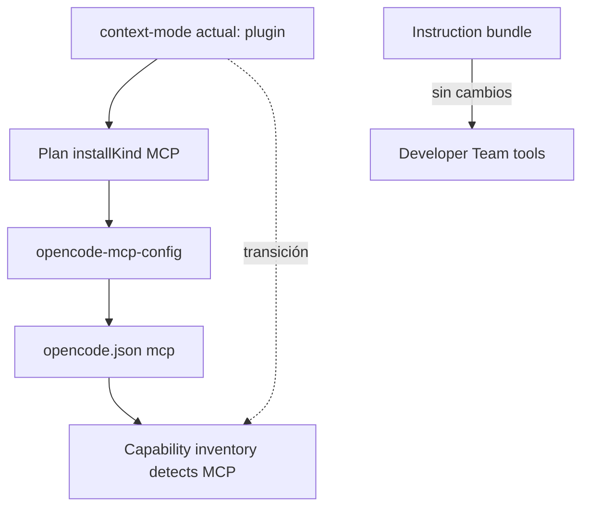

# Proposal: Adaptador MCP para context-mode en OpenCode

## Intent

Migrar la instalación de context-mode en OpenCode desde `plugin` hacia MCP para alinear el adaptador con Serena, codebase-memory y Context7, reducir acoplamiento al mecanismo de plugins de OpenCode y ejecutar context-mode como proceso externo más aislado.

## Goal

OpenCode debe instalar, detectar y configurar context-mode como servidor MCP local sin cambiar las instrucciones de uso ni las capacidades expuestas al Developer Team.

## Scope

### In Scope
- Cambiar el plan de instalación de context-mode de `opencode-plugin` a una variante MCP (`mcp-server` o equivalente).
- Actualizar detección/inventario para reconocer context-mode desde configuración MCP, no desde `plugin`.
- Configurar la entrada MCP apuntando al binario/comando instalado de context-mode.
- Mantener compatibilidad de migración para usuarios que ya tienen `plugin: ["context-mode"]`, al menos durante detección o transición.
- Actualizar pruebas relacionadas con catálogo, inventario, plan de instalación y escritura de MCP.

### Out of Scope
- Cambiar el contenido funcional del instruction bundle de context-mode.
- Rediseñar el protocolo MCP de context-mode.
- Migrar otros paquetes no relacionados.
- Implementar tareas de instalación global fuera del adaptador OpenCode, salvo lo necesario para invocar el servidor MCP.

## Affected Capabilities

### New Capabilities
- Ninguna.

### Modified Capabilities
- `opencode-tool-installation`: context-mode deja de instalarse como plugin y pasa a instalarse/configurarse como servidor MCP.
- `opencode-capability-detection`: la detección de context-mode debe mirar entradas MCP/comandos, con estrategia de transición para plugins existentes.

### Unchanged Capabilities
- `context-mode-instruction-injection`: las instrucciones en `packages/core/src/teams/developer/instruction-bundles/context-mode.ts` siguen describiendo el uso de herramientas context-mode.
- `developer-team-package-selection`: la selección de capacidad sigue representando context-mode como paquete disponible.

## Approach

- En `packages/adapter-opencode/src/installation-plan.ts`, cambiar `installKind: "opencode-plugin"` por una variante MCP coherente con el catálogo existente.
- En `packages/adapter-opencode/src/capability-catalog.ts`, sustituir `pluginNames: ["context-mode"]` por metadatos MCP de detección, idealmente comando/servidor esperado.
- En `packages/adapter-opencode/src/opencode-mcp-config.ts`, agregar/ajustar `getMcpServerConfig()` para context-mode con el comando del servidor MCP instalado.
- En `packages/adapter-opencode/src/install-tools.ts` y rutas de escritura de configuración, asegurar que context-mode se agregue al bloque MCP y no al arreglo `plugin`.
- En `packages/adapter-opencode/src/capability-inventory.ts`, detectar context-mode desde MCP; considerar soporte dual temporal para instalaciones plugin existentes y evitar entradas duplicadas.
- Añadir migración conservadora: no borrar automáticamente `plugin: ["context-mode"]` salvo que el diseño lo apruebe; preferir detectar conflicto y escribir solo la entrada MCP faltante.

## Alternatives and Tradeoffs

| Alternative | Why Considered | Why Not Chosen |
|---|---|---|
| Mantener plugin | Cambio mínimo; usuarios actuales no migran | Mantiene inconsistencia con otros paquetes MCP y más acoplamiento a OpenCode plugins |
| Corte directo a MCP sin soporte plugin | Implementación simple | Riesgo alto de romper detección para usuarios existentes |
| Soporte dual temporal plugin + MCP | Migración segura y menor ruptura | Requiere reglas anti-duplicado y decisión futura para retirar plugin |

## Risks

| Risk | Likelihood | Mitigation |
|---|---|---|
| El comando/binario MCP de context-mode no está confirmado | Medium | Tratarlo como pregunta abierta; Design debe verificar fuente oficial antes de fijar comando |
| Usuarios existentes quedan con plugin y MCP duplicados | Medium | Detección dual y escritura idempotente; no duplicar entradas MCP |
| Inventario marca falsos negativos si solo revisa MCP | Medium | Durante transición, aceptar plugin existente como señal heredada o estado migrable |
| Cambio de `installKind` rompe rutas que asumen plugin | Medium | Actualizar pruebas de plan, catálogo, inventario y escritura config |
| Configuración MCP incompatible con OpenCode | Low/Medium | Reusar patrón existente de Serena/Context7 y validar JSON generado |

## Rollback Plan

- Revertir context-mode a `installKind: "opencode-plugin"` en catálogo/plan.
- Restaurar detección por `pluginNames: ["context-mode"]`.
- Remover o desactivar el caso context-mode en `opencode-mcp-config.ts` y rutas de escritura MCP.
- Si usuarios recibieron entrada MCP, documentar/remover manualmente esa entrada de `~/.config/opencode/opencode.json`; el arreglo `plugin` heredado seguirá funcionando si no fue borrado.

## Dependencies

- Confirmar el comando oficial para ejecutar context-mode como servidor MCP local.
- Patrón existente de configuración MCP en `packages/adapter-opencode/src/opencode-mcp-config.ts`.
- Reglas de OpenCode para `mcp` array y procesos externos.

## Open Questions

- ¿Existe un binario oficial estable para context-mode MCP? La memoria adaptativa menciona `@context-mode/context-mode-mcp`, pero debe verificarse como contexto oficial antes de diseñar/implementar.
- ¿Debe Deck instalar context-mode como paquete MCP (`npx -y ...`) o usar un binario ya instalado?
- ¿La migración debe retirar automáticamente `plugin: ["context-mode"]` o solo añadir MCP y reportar estado heredado?
- ¿Cuál es el nombre canónico de la entrada MCP en OpenCode: `context-mode`, `context_mode` u otro?

## Acceptance Direction

- [ ] La instalación nueva de context-mode escribe una entrada MCP válida y no agrega `"context-mode"` al arreglo `plugin`.
- [ ] El inventario detecta context-mode instalado vía MCP.
- [ ] Instalaciones heredadas con plugin no quedan como rotas sin ruta de migración explícita.
- [ ] Las pruebas de catálogo/plan/configuración cubren idempotencia y ausencia de duplicados.

## Next Steps

Ready for Spec (`deck-developer-spec`) and Design (`deck-developer-design`) in parallel.

## Mermaid Summary Source

