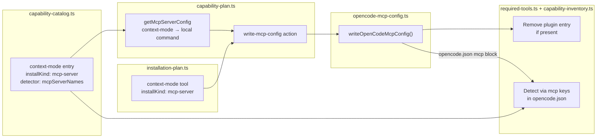

# Spec: Adaptador MCP para context-mode en OpenCode

## Source

- Proposal: `context-mode-mcp-adapter` proposal artifact
- Capabilities affected: `opencode-tool-installation`, `opencode-capability-detection`

## Requirements

### Capability: opencode-tool-installation

**REQ-INST-001**: El plan de instalación de context-mode DEBE usar `installKind: "mcp-server"` en lugar de `"opencode-plugin"`.
  Priority: MUST
  Surface: Integration
  Rationale: Alinear context-mode con Serena, Context7 y codebase-memory que ya usan MCP. Decisión del usuario: solo MCP, sin soporte dual.

**REQ-INST-002**: La instalación de context-mode DEBE generar una acción `write-mcp-config` que escriba la entrada MCP en `opencode.json`.
  Priority: MUST
  Surface: Integration
  Rationale: MCP servers se configuran escribiendo en el bloque `mcp` de opencode.json, no en el arreglo `plugin`.

**REQ-INST-003**: La entrada MCP escrita para context-mode DEBE seguir el formato OpenCode para servidores locales: `{ type: "local", command: [...], enabled: true }`.
  Priority: MUST
  Surface: Integration
  Rationale: Consistencia con el patrón existente de Serena y Context7.

**REQ-INST-004**: La instalación de context-mode NO DEBE agregar `"context-mode"` al arreglo `plugin` de `opencode.json`.
  Priority: MUST
  Surface: Integration
  Rationale: Decisión del usuario: clean migration, solo MCP.

**REQ-INST-005**: El comando MCP para context-mode DEBE ser determinable desde el catálogo de capacidades (source/detector).
  Priority: MUST
  Surface: Integration
  Rationale: `getMcpServerConfig()` en `capability-plan.ts` debe poder resolver context-mode al igual que context7 y serena.

### Capability: opencode-capability-detection

**REQ-DET-001**: La detección de context-mode DEBE basarse en la presencia de una entrada MCP en `opencode.json`, NO en el arreglo `plugin`.
  Priority: MUST
  Surface: Integration
  Rationale: Detección coherente con el nuevo mecanismo de instalación.

**REQ-DET-002**: El detector de context-mode en el catálogo DEBE incluir `mcpServerNames` con el nombre canónico de la entrada MCP.
  Priority: MUST
  Surface: Integration
  Rationale: `isCapabilityInstalled()` en `capability-inventory.ts` usa `detector.mcpServerNames` como candidatos de detección.

**REQ-DET-003**: El detector de context-mode DEBE eliminar `pluginNames` del catálogo — no se detecta vía plugin.
  Priority: MUST
  Surface: Integration
  Rationale: Decisión del usuario: clean migration, sin detección dual.

**REQ-DET-004**: `reviewOpenCodeTools()` en `required-tools.ts` DEBE detectar context-mode desde las claves del bloque `mcp` en `opencode.json`.
  Priority: MUST
  Surface: Integration
  Rationale: `readOpenCodeConfigPackages()` ya lee `Object.keys(parsed.mcp ?? {})`. Si la entrada MCP se llama `"context-mode"`, la detección funciona automáticamente por normalización de nombres.

### Capability: migration-cleanup

**REQ-MIG-001**: Si `opencode.json` contiene `"context-mode"` en el arreglo `plugin`, la instalación MCP DEBE eliminar esa entrada del arreglo `plugin` al escribir la configuración MCP.
  Priority: MUST
  Surface: Integration
  Rationale: Evitar entradas duplicadas (plugin + MCP) y garantizar estado limpio.

**REQ-MIG-002**: La eliminación de la entrada plugin NO DEBE eliminar otras entradas del arreglo `plugin`.
  Priority: MUST
  Surface: Integration
  Rationale: Preservar configuración de otros plugins.

## Acceptance Scenarios

### Capability: opencode-tool-installation

#### Scenario: Instalación nueva de context-mode escribe entrada MCP válida

**Given** un entorno sin context-mode instalado
**And** `opencode.json` existe sin entrada `"context-mode"` en `mcp` ni en `plugin`
**When** el usuario selecciona context-mode y se ejecuta el plan de instalación
**Then** se genera una acción `write-mcp-config` para context-mode
**And** la entrada MCP se escribe en `opencode.json` con `type: "local"`, `command` válido, y `enabled: true`
**And** no se agrega `"context-mode"` al arreglo `plugin`
> Covers: REQ-INST-001, REQ-INST-002, REQ-INST-003, REQ-INST-004

#### Scenario: `getMcpServerConfig` resuelve context-mode con comando MCP válido

**Given** `capability-plan.ts` llama a `getMcpServerConfig("context-mode", source)`
**When** se construye el plan de revisión
**Then** retorna un objeto con `type: "local"` y `command` arreglo no vacío
> Covers: REQ-INST-005

#### Scenario: Idempotencia — re-ejecutar instalación no duplica entrada MCP

**Given** `opencode.json` ya contiene la entrada MCP para context-mode
**When** el inventario evalúa el estado de context-mode
**Then** context-mode se reporta como `installed` con status `ready`
**And** no se genera acción de instalación ni de configuración
> Covers: REQ-INST-002

#### Variant: opencode.json no existe
- Given el directorio `~/.config/opencode/` existe pero `opencode.json` no
- When se ejecuta la escritura de configuración MCP
- Then se crea `opencode.json` con la entrada MCP para context-mode y ningún arreglo `plugin`

### Capability: opencode-capability-detection

#### Scenario: Detección vía MCP en opencode.json

**Given** `opencode.json` contiene `{ "mcp": { "context-mode": { "type": "local", "command": [...], "enabled": true } } }`
**When** `reviewOpenCodeTools()` evalúa las herramientas instaladas
**Then** context-mode se reporta como `installed: true`
> Covers: REQ-DET-001, REQ-DET-004

#### Scenario: Detección vía `mcpServerNames` en inventario de capacidades

**Given** el catálogo de capacidades tiene `detector: { mcpServerNames: ["context-mode"] }` para context-mode
**And** `reviewOpenCodeTools()` retorna `"context-mode"` como paquete instalado
**When** `buildOpenCodeRunnerCapabilityInventory()` construye el inventario
**Then** context-mode tiene `installed: true` y `status: "ready"`
> Covers: REQ-DET-002

#### Scenario: Ausencia de `pluginNames` en detector

**Given** la entrada de catálogo para context-mode
**When** se inspecciona el campo `detector`
**Then** `detector.pluginNames` está ausente o vacío
**And** `detector.mcpServerNames` contiene `"context-mode"`
> Covers: REQ-DET-003

#### Scenario: context-mode no instalado — detección correcta de ausencia

**Given** `opencode.json` no contiene `"context-mode"` en `mcp`
**And** `opencode.json` no contiene `"context-mode"` en `plugin`
**When** `buildOpenCodeRunnerCapabilityInventory()` construye el inventario
**Then** context-mode tiene `installed: false` y `status: "missing"`
> Covers: REQ-DET-001

### Capability: migration-cleanup

#### Scenario: Migración limpia — entrada plugin existente se elimina al instalar MCP

**Given** `opencode.json` contiene `{ "plugin": ["context-mode"], "mcp": {} }`
**When** se ejecuta la escritura de configuración MCP para context-mode
**Then** `opencode.json` resulta con `"context-mode"` en `mcp` (entrada MCP válida)
**And** `opencode.json` NO contiene `"context-mode"` en el arreglo `plugin`
**And** el arreglo `plugin` preserva otras entradas si existían
> Covers: REQ-MIG-001, REQ-MIG-002

#### Variant: plugin array solo contenía context-mode
- Given `opencode.json` contiene `{ "plugin": ["context-mode"] }`
- When se escribe la configuración MCP
- Then el arreglo `plugin` queda vacío `[]` o se elimina si no tiene otras entradas
- And la entrada MCP existe en el bloque `mcp`

#### Variant: plugin array contiene context-mode y otros plugins
- Given `opencode.json` contiene `{ "plugin": ["context-mode", "other-plugin"] }`
- When se escribe la configuración MCP
- Then el arreglo `plugin` es `["other-plugin"]`
- And la entrada MCP existe en el bloque `mcp`

## Validation Rules

| Field / Input | Rule | Error Message | REQ-ID |
|---|---|---|---|
| MCP server name | No vacío, solo `[a-z0-9-]` | `"MCP server name is required."` | REQ-INST-003 |
| MCP command | Arreglo no vacío cuando `type: "local"` | `"Local MCP server requires a command array."` | REQ-INST-003 |
| opencode.json | JSON válido si existe | `"Unable to parse existing opencode.json"` | REQ-INST-002 |

## Error Contracts

| Condition | Error Code | Message | Context |
|---|---|---|---|
| opencode.json con JSON malformado | PARSE_ERROR | `Unable to parse existing opencode.json: {detail}` | writeOpenCodeMcpConfig |
| Sin permisos de escritura en opencode.json | WRITE_ERROR | `Failed to write opencode.json: {detail}` | writeOpenCodeMcpConfig |
| Comando MCP de context-mode no resuelto | NO_MCP_CONFIG | `context-mode no tiene configuración MCP conocida` | getMcpServerConfig |

## Open Questions

- **OQ-001**: ¿Cuál es el comando exacto para ejecutar context-mode como servidor MCP local? (ej: `["npx", "-y", "@context-mode/context-mode-mcp"]` o un binario). La memoria adaptativa sugiere `@context-mode/context-mode-mcp` pero no está verificado como fuente oficial. Design debe confirmar.
- **OQ-002**: ¿Cuál es el nombre canónico de la entrada MCP? ¿`"context-mode"` o `"context_mode"`? Se asume `"context-mode"` por consistencia con el ID de capacidad.

## Compliance Matrix

| REQ-ID | Scenario(s) | Status |
|---|---|---|
| REQ-INST-001 | Instalación nueva escribe entrada MCP válida | Defined |
| REQ-INST-002 | Instalación nueva escribe entrada MCP válida, Idempotencia | Defined |
| REQ-INST-003 | Instalación nueva escribe entrada MCP válida, getMcpServerConfig resuelve | Defined |
| REQ-INST-004 | Instalación nueva escribe entrada MCP válida | Defined |
| REQ-INST-005 | getMcpServerConfig resuelve context-mode | Defined |
| REQ-DET-001 | Detección vía MCP, Ausencia de context-mode | Defined |
| REQ-DET-002 | Detección vía mcpServerNames en inventario | Defined |
| REQ-DET-003 | Ausencia de pluginNames en detector | Defined |
| REQ-DET-004 | Detección vía MCP en opencode.json | Defined |
| REQ-MIG-001 | Migración limpia — plugin existente se elimina | Defined |
| REQ-MIG-002 | Variant: plugin con otras entradas | Defined |

## Mermaid Summary Source

