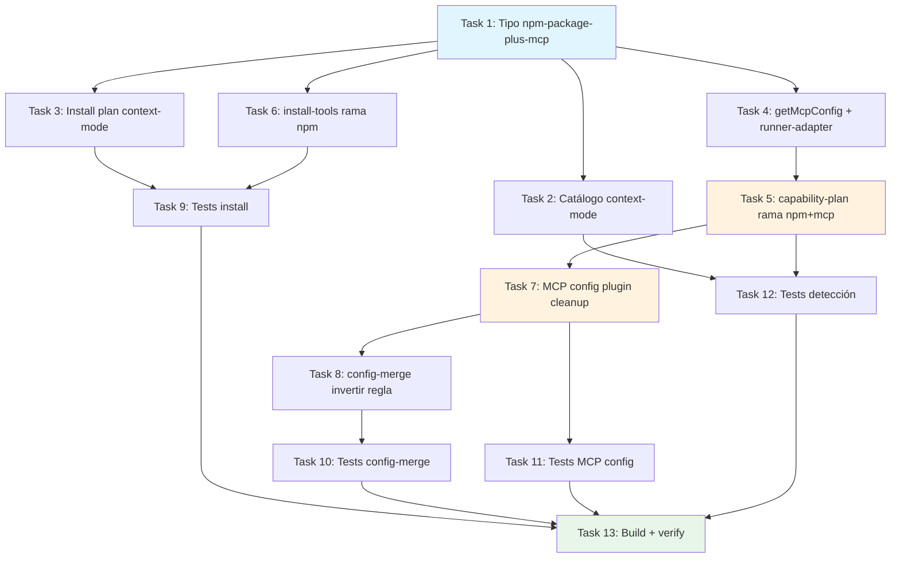

# Tasks: Adaptador MCP para context-mode en OpenCode

## Source

- Spec: `context-mode-mcp-adapter` spec artifact
- Design: `context-mode-mcp-adapter` design artifact
- Capabilities affected: `opencode-tool-installation`, `opencode-capability-detection`, `migration-cleanup`

## Resolved Inputs

- npm package: `context-mode`
- MCP command: `["context-mode"]` (binario global tras `npm install -g context-mode`)
- MCP server name: `context-mode`
- MCP config: `{ type: "local", command: ["context-mode"], enabled: true }`
- installKind: `"npm-package-plus-mcp"` (nuevo tipo)
- Detección: vía `mcpServerNames`, sin `pluginNames`
- **CRITICAL**: Si coexisten `plugin: ["context-mode"]` + `mcp.context-mode`, OpenCode registra ZERO tools. Migration debe eliminar plugin entry.

---

## Task Groups

### Group: Shared / Contracts

#### Task 1: Agregar tipo `npm-package-plus-mcp` al sistema de tipos

**Owner**: General Apply
**Priority**: P0
**Complexity**: Low
**Parallel**: Yes
**Depends on**: none

**Description**
Agregar `"npm-package-plus-mcp"` a la unión `OpenCodeCapabilityInstallKind` en `capability-catalog.ts` y a la unión `installKind` en `installation-plan.ts`. Este tipo paralelo a `"shell-script-plus-mcp"` indica que la herramienta requiere instalación npm global + escritura de config MCP.

**Files**
- `packages/adapter-opencode/src/capability-catalog.ts` — modify (agregar valor al tipo)
- `packages/adapter-opencode/src/installation-plan.ts` — modify (agregar valor al tipo)

**Verification**
- `tsc --noEmit` compila sin errores en `packages/adapter-opencode`
- El string literal `"npm-package-plus-mcp"` es aceptado en ambas uniones de tipos

---

#### Task 2: Actualizar entrada de context-mode en `capability-catalog.ts`

**Owner**: General Apply
**Priority**: P0
**Complexity**: Low
**Parallel**: Yes
**Depends on**: Task 1

**Description**
Cambiar la entrada de `context-mode` en `FULL_OPENCODE_CAPABILITY_CATALOG`:
- `installKind`: `"opencode-plugin"` → `"npm-package-plus-mcp"`
- `detector`: reemplazar `{ pluginNames: ["context-mode"] }` por `{ commands: ["context-mode"], mcpServerNames: ["context-mode"] }`
- Actualizar descripción para reflejar MCP server en lugar de plugin
- Eliminar `pluginNames` completamente del detector de context-mode

**Files**
- `packages/adapter-opencode/src/capability-catalog.ts` — modify

**Verification**
- `tsc --noEmit` sin errores
- `FULL_OPENCODE_CAPABILITY_CATALOG["context-mode"].installKind === "npm-package-plus-mcp"`
- `FULL_OPENCODE_CAPABILITY_CATALOG["context-mode"].detector.pluginNames` es `undefined`
- `FULL_OPENCODE_CAPABILITY_CATALOG["context-mode"].detector.mcpServerNames` contiene `"context-mode"`

---

#### Task 3: Actualizar tool instalable en `installation-plan.ts`

**Owner**: General Apply
**Priority**: P0
**Complexity**: Low
**Parallel**: Yes
**Depends on**: Task 1

**Description**
Cambiar la entrada de `context-mode` en `OPENCODE_INSTALLABLE_TOOLS`:
- `installKind`: `"opencode-plugin"` → `"npm-package-plus-mcp"`
- Mantener `module: "context-mode"` (nombre del paquete npm para `npm install -g`)

**Files**
- `packages/adapter-opencode/src/installation-plan.ts` — modify

**Verification**
- `tsc --noEmit` sin errores
- `OPENCODE_INSTALLABLE_TOOLS.find(t => t.id === "context-mode").installKind === "npm-package-plus-mcp"`

---

### Group: Backend / Config Logic

#### Task 4: Agregar caso `context-mode` en `getMcpServerConfig` y `writeMcpConfigFromCapability`

**Owner**: Backend Apply
**Priority**: P0
**Complexity**: Low
**Parallel**: Yes
**Depends on**: Task 1

**Description**
Agregar resolución MCP para context-mode en dos sitios:

1. **`capability-plan.ts` → `getMcpServerConfig()`**: Agregar caso `"context-mode"` que retorne `{ type: "local", command: ["context-mode"] }`.

2. **`runner-adapter.ts` → `writeMcpConfigFromCapability()`**: Agregar caso `"context-mode"` que llame `writeOpenCodeMcpConfig({ serverName: "context-mode", type: "local", command: ["context-mode"] })`.

**Files**
- `packages/adapter-opencode/src/capability-plan.ts` — modify (agregar case en switch)
- `packages/adapter-opencode/src/runner-adapter.ts` — modify (agregar case en switch)

**Verification**
- `tsc --noEmit` sin errores
- `getMcpServerConfig("context-mode", ...)` retorna `{ type: "local", command: ["context-mode"] }`
- `writeMcpConfigFromCapability("context-mode")` escribe `mcp.context-mode` con `{ type: "local", command: ["context-mode"], enabled: true }`

---

#### Task 5: Agregar soporte `npm-package-plus-mcp` en `capability-plan.ts`

**Owner**: Backend Apply
**Priority**: P0
**Complexity**: Medium
**Parallel**: No — depende de Task 4 (getMcpServerConfig)
**Depends on**: Task 4

**Description**
Agregar rama de acción para `installKind === "npm-package-plus-mcp"` en `addCapabilityActions()` de `capability-plan.ts`. El comportamiento paralela `shell-script-plus-mcp`:
1. Generar acción `install-opencode-plugin` con kind real `npm-install` para ejecutar `npm install -g context-mode`.
2. Generar acción `write-mcp-config` para escribir `mcp.context-mode`.
3. Generar acción de migración/cleanup si el inventario indica plugin legacy presente (diagnóstico `"legacy-plugin-detected"`).

También actualizar la función `isCapabilityInstalled()` en `capability-inventory.ts` para que no trate `pluginNames` como fuente de detección ready cuando el kind es `npm-package-plus-mcp` — solo `mcpServerNames` y `commands` determinan `ready`.

**Files**
- `packages/adapter-opencode/src/capability-plan.ts` — modify (nueva rama en switch if-else)
- `packages/adapter-opencode/src/capability-inventory.ts` — modify (actualizar lógica de detección)

**Verification**
- Seleccionar context-mode faltante produce 2 acciones: install + write-mcp-config
- No se genera acción `install-opencode-plugin` (ese kind ya no aplica)
- `isCapabilityInstalled("context-mode", ...)` solo marca `true` cuando existe entrada MCP o comando `context-mode` en PATH

---

#### Task 6: Agregar rama `npm-package-plus-mcp` en `install-tools.ts`

**Owner**: Backend Apply
**Priority**: P0
**Complexity**: Low
**Parallel**: Yes
**Depends on**: Task 1

**Description**
Agregar rama `npm-package-plus-mcp` en `installOpenCodeTools()` de `install-tools.ts`. Comportamiento:
1. Ejecutar `npm install -g <tool.module>` (idéntico a la rama `npm-package`).
2. Retornar resultado de éxito/fallo.

No escribir config MCP aquí — eso se maneja con acción separada `write-mcp-config`.

**Files**
- `packages/adapter-opencode/src/install-tools.ts` — modify (agregar rama antes del fallback)

**Verification**
- `tsc --noEmit` sin errores
- Tool con `installKind: "npm-package-plus-mcp"` ejecuta `npm install -g context-mode`
- No invoca `opencode plugin` ni escribe en `plugin` array

---

#### Task 7: Agregar limpieza de plugin legacy en `opencode-mcp-config.ts`

**Owner**: Backend Apply
**Priority**: P0
**Complexity**: Medium
**Parallel**: No — necesita diseño coordinado con Task 5
**Depends on**: Task 5

**Description**
Extender `writeOpenCodeMcpConfig()` para aceptar opción `pluginsToRemove?: string[]`. Cuando se proporciona:
1. Lee el config existente.
2. Escribe la entrada MCP como hoy.
3. Si `config.plugin` es array y contiene alguno de los nombres en `pluginsToRemove`, los elimina preservando los demás.
4. Si `config.plugin` queda vacío tras la limpieza, lo deja como `[]` (no elimina la clave).

Esta opción es usada por `runner-adapter.ts` para context-mode con `pluginsToRemove: ["context-mode"]`.

**Files**
- `packages/adapter-opencode/src/opencode-mcp-config.ts` — modify (agregar campo y lógica)

**Verification**
- Escribir MCP para context-mode con `pluginsToRemove: ["context-mode"]` elimina solo esa entrada del array `plugin`
- Otros plugins preservados
- Array vacío se conserva como `[]`
- Sin `pluginsToRemove`, comportamiento idéntico al actual

---

#### Task 8: Revertir regla anti-duplicado en `config-merge.ts`

**Owner**: Backend Apply
**Priority**: P0
**Complexity**: Low
**Parallel**: Yes
**Depends on**: Task 7

**Description**
La lógica actual en `config-merge.ts` (líneas 141-148) elimina `mcp.context-mode` cuando `plugin` contiene `context-mode` — fue diseñada cuando plugin tenía prioridad. Con la migración MCP-only, la regla debe invertirse:

**Nueva lógica**: Si `mcp.context-mode` existe, eliminar `"context-mode"` del array `plugin` (no al revés). Esto asegura que durante `mergeAndWrite()` del Developer Team, la config resultante nunca tenga ambas entradas simultáneamente.

Si MCP no existe pero plugin sí, no hacer nada (la migración formal la maneja `writeOpenCodeMcpConfig` con `pluginsToRemove`).

**Files**
- `packages/adapter-opencode/src/config-merge.ts` — modify (invertir lógica)

**Verification**
- `mergeConfig({ plugin: ["context-mode"], mcp: { "context-mode": {...} } }, {}, [])` → resultado sin `"context-mode"` en `plugin`
- `mergeConfig({ plugin: ["context-mode", "other"], mcp: { "context-mode": {...} } }, {}, [])` → `plugin: ["other"]`
- `mergeConfig({ plugin: ["context-mode"] }, {}, [])` → sin cambios (MCP no existe, no migra aquí)

---

### Group: Tests

#### Task 9: Actualizar tests de `installation-plan.test.ts` e `install-tools.test.ts`

**Owner**: General Apply
**Priority**: P1
**Complexity**: Low
**Parallel**: Yes
**Depends on**: Task 3, Task 6

**Description**
Actualizar tests existentes para reflejar el nuevo installKind:

1. **`installation-plan.test.ts`**: Actualizar si hay assertions sobre `installKind` de context-mode.
2. **`install-tools.test.ts`**:
   - Cambiar el test `"writes opencode-plugin to plugin array"` para context-mode → test npm install global que NO escribe plugin array.
   - Agregar test para `npm-package-plus-mcp` que verifica `npm install -g context-mode` se ejecuta.
   - Eliminar expectativa de `Added 'context-mode' to plugin array`.

**Files**
- `packages/adapter-opencode/src/installation-plan.test.ts` — modify
- `packages/adapter-opencode/src/install-tools.test.ts` — modify

**Verification**
- `bun test packages/adapter-opencode/src/install-tools.test.ts` pasa
- `bun test packages/adapter-opencode/src/installation-plan.test.ts` pasa

---

#### Task 10: Actualizar tests de `config-merge.test.ts` para la nueva lógica invertida

**Owner**: General Apply
**Priority**: P1
**Complexity**: Low
**Parallel**: Yes
**Depends on**: Task 8

**Description**
Actualizar los dos tests existentes sobre context-mode en config-merge:

1. **`"removes stale mcp.context-mode entry when context-mode plugin is present"`**: Invertir — ahora debe verificar que `plugin: ["context-mode"]` se elimina del array cuando `mcp.context-mode` existe. Renombrar test apropiadamente.

2. **`"preserves mcp.context-mode when context-mode plugin is NOT present"`**: Mantener pero actualizar descripción — MCP se preserva siempre; solo plugin se limpia.

**Files**
- `packages/adapter-opencode/src/config-merge.test.ts` — modify

**Verification**
- `bun test packages/adapter-opencode/src/config-merge.test.ts` pasa
- Test verifica que MCP gana sobre plugin y plugin se elimina

---

#### Task 11: Agregar tests de `opencode-mcp-config.test.ts` para migración plugin cleanup

**Owner**: General Apply
**Priority**: P1
**Complexity**: Medium
**Parallel**: Yes
**Depends on**: Task 7

**Description**
Agregar tests para la nueva funcionalidad `pluginsToRemove`:

1. Escribir MCP + eliminar plugin existente → resultado tiene MCP pero no plugin.
2. Otros plugins preservados.
3. Plugin array vacío tras limpieza → se conserva `[]`.
4. Idempotencia: re-ejecutar con plugin ya eliminado no falla.
5. Sin `pluginsToRemove` → comportamiento idempotente normal.

**Files**
- `packages/adapter-opencode/src/opencode-mcp-config.test.ts` — modify (agregar casos)

**Verification**
- `bun test packages/adapter-opencode/src/opencode-mcp-config.test.ts` pasa
- Cubre escenarios REQ-MIG-001 y REQ-MIG-002

---

#### Task 12: Agregar tests de detección en `required-tools.test.ts` y `capability-inventory`

**Owner**: General Apply
**Priority**: P1
**Complexity**: Low
**Parallel**: Yes
**Depends on**: Task 2, Task 5

**Description**
Actualizar/agregar tests de detección:

1. **`required-tools.test.ts`**: El test existente `"detects tools configured in opencode.json MCP and plugin sections"` ya cubre detección vía `mcp.context-mode`. Verificar que funcione correctamente con el nuevo kind. Agregar test donde solo `mcp.context-mode` existe (sin plugin) → `installed: true`.

2. Verificar que `capability-inventory.ts` marca `ready` cuando `mcpServerNames` coincide y `missing` cuando solo hay plugin legacy (sin MCP).

**Files**
- `packages/adapter-opencode/src/required-tools.test.ts` — modify
- Tests implícitos vía inventory si existen test files dedicados

**Verification**
- `bun test packages/adapter-opencode/src/required-tools.test.ts` pasa
- Cubre REQ-DET-001, REQ-DET-002, REQ-DET-004

---

### Group: Verification

#### Task 13: Build y test suite completa

**Owner**: General Apply
**Priority**: P0
**Complexity**: Low
**Parallel**: No — depende de todos los anteriores
**Depends on**: Task 9, Task 10, Task 11, Task 12

**Description**
Ejecutar build completo y suite de tests del paquete adapter-opencode:
1. `tsc --noEmit` en `packages/adapter-opencode`
2. `bun test packages/adapter-opencode/src`
3. Verificar que no hay regresiones en tests de otros módulos
4. Confirmar que `context-mode` ya no aparece como `opencode-plugin` en ningún lugar del código productivo

**Files**
- Sin cambios productivos — solo verificación

**Verification**
- `tsc --noEmit` sin errores
- Todos los tests pasan
- `grep -r "opencode-plugin" packages/adapter-opencode/src/capability-catalog.ts` no contiene `context-mode`
- `grep -r "opencode-plugin" packages/adapter-opencode/src/installation-plan.ts` no contiene `context-mode`

---

## Dependency Graph

```
Task 1 (tipos) ─────────────────────────────────────────┐
  ├── Task 2 (catálogo) ──────────────┐                  │
  ├── Task 3 (install plan) ──────────┤                  │
  ├── Task 4 (getMcpConfig + adapter) ├──→ Task 5 (plan) ├──→ Task 7 (mcp cleanup)
  ├── Task 6 (install-tools) ─────────┘       │              │
  └───────────────────────────────────────────┘              │
                                                              ├──→ Task 8 (config-merge invert)
                                                              │
Task 8 → Task 10 (config-merge tests)
Task 3 + Task 6 → Task 9 (install tests)
Task 7 → Task 11 (mcp-config tests)
Task 2 + Task 5 → Task 12 (detection tests)
Task 9 + 10 + 11 + 12 → Task 13 (full build + verify)
```

## Parallelization Plan

| Phase | Tasks | Can Run in Parallel |
|---|---|---|
| Phase 1: Types | Task 1 | Yes (foundation, rápido) |
| Phase 2: Data changes | Task 2, Task 3, Task 4, Task 6 | Yes (todos independientes tras Task 1) |
| Phase 3: Plan logic | Task 5 | No (depends on Task 4) |
| Phase 3 (parallel): Config merge | Task 8 | Yes (independiente de Task 5) |
| Phase 4: MCP cleanup | Task 7 | No (depends on Task 5) |
| Phase 5: Tests | Task 9, Task 10, Task 11, Task 12 | Yes (todos independientes entre sí) |
| Phase 6: Verify | Task 13 | No (depends on all tests) |

## Responsibility Contracts

| Contract / Boundary | Owner | Consumers | Notes |
|---|---|---|---|
| `npm-package-plus-mcp` installKind | General Apply (Task 1) | Backend Apply (Tasks 4-6), Tests | Tipo compartido; debe existir antes de cualquier consumidor |
| `getMcpServerConfig("context-mode")` | Backend Apply (Task 4) | capability-plan (Task 5), runner-adapter | Contrato MCP: retorna `{ type: "local", command: ["context-mode"] }` |
| `pluginsToRemove` en `writeOpenCodeMcpConfig` | Backend Apply (Task 7) | runner-adapter (Task 4 extiende uso), Tests (Task 11) | Campo opcional; backward compatible si ausente |
| Config merge inversion | Backend Apply (Task 8) | developer-team-install (config-merge), Tests (Task 10) | Regla MCP-wins-over-plugin reemplaza plugin-wins-over-MCP |

## Complexity Summary

| Complexity | Count | Task Numbers |
|---|---|---|
| Low | 9 | 1, 2, 3, 4, 6, 8, 9, 12, 13 |
| Medium | 4 | 5, 7, 10, 11 |
| High | 0 | — |

## Flagged for Splitting

- Ninguno — todas las tareas son Low o Medium y tocan ≤3 archivos cada una.

## Review Workload Forecast

| Signal | Value |
|---|---|
| Estimated changed lines | 200-400 |
| 400-line budget risk | Low |
| Scope reduction recommended | No |
| Sequential work slices recommended | No |
| Decision needed before Apply | No |

**Rationale**: Los cambios son mecánicos y bien acotados: agregar tipo, actualizar datos en catálogo/plan, agregar cases en switches, invertir una regla de merge, y actualizar tests. Las líneas de código productivo son ~150 líneas nuevas/modificadas; tests ~100-150 líneas. El risk principal es la lógica de migración en `writeOpenCodeMcpConfig` (Task 7), pero es Medium complexity y bien especificada.

## Open Questions / Blockers

- **OQ-001** (del Spec): Comando exacto MCP confirmado como `["context-mode"]` por diseño y verificación npm. **Resuelto**.
- **OQ-002** (del Spec): Nombre canónico MCP confirmado como `"context-mode"`. **Resuelto**.
- Ningún blocker pendiente — tasks están listas para Apply.

## Mermaid Summary Source


