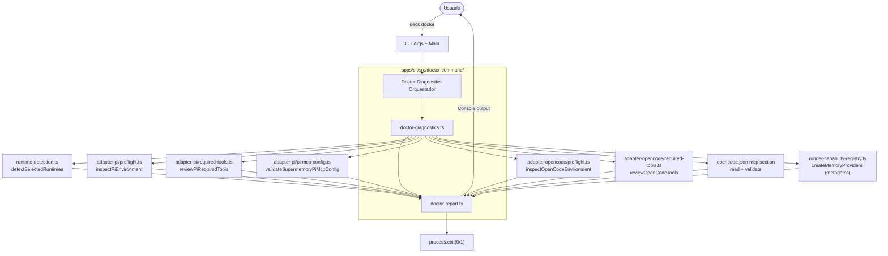

# Design: Comando `deck doctor`

## Source

- Proposal: `deck-doctor-command` proposal artifact
- Capabilities affected: `deck-doctor-command`, `doctor-diagnostics`, `doctor-reporting`, `cli-args`, `cli-main`
- Spec status: not yet available

## Current Architecture Context

La CLI de Deck (`apps/cli`) utiliza un modelo simple de routing basado en `ParsedArgs`:

- **`cli-args.ts`**: Parser de argumentos que retorna un discriminated union `ParsedArgs`. Los comandos conocidos son `tui`, `pi-launch`, `opencode-launch` y `error`.
- **`main.tsx`**: Punto de entrada que ejecuta `parseArgs` y luego ramifica con `if` sobre `parsed.command`. Para `pi-launch` y `opencode-launch`, invoca funciones en `pi-launch-command.ts` y `opencode-launch-command.ts` respectivamente. Si no hay comando reconocido, entra al modo TUI (`DeckApp`).
- **`runtime-detection.ts`**: Expone `detectSelectedRuntimes(environments, options)` que retorna `RuntimeStatus[]` con `installed`, `command` y `environment`. Soporta 4 entornos: `pi-development`, `opencode-development`, `claude-development`, `codex-development`.
- **Adapters** (`packages/adapter-pi`, `packages/adapter-opencode`): Proporcian funciones puras de inspección sin side-effects:
  - `inspectPiEnvironment(command)` → `{ version, configDirectory, existingConfiguration }`
  - `reviewPiRequiredTools(command)` → `{ installedPackages, requiredTools, tools, error? }`
  - `validateSupermemoryPiMcpConfig(options?)` → `{ ok, path, serverName, diagnostics }`
  - `inspectOpenCodeEnvironment(command)` → `{ version, configDirectory, packageManifest, existingConfiguration }`
  - `reviewOpenCodeTools(options?)` → `{ installedPackages, tools, toolStatuses, error? }`
- **Memory providers**: `createMemoryProviders()` en `runner-capability-registry.ts` retorna metadatos y factory functions; instanciar requiere credenciales válidas.
- **Redacción de credenciales**: `pi-mcp-config.ts` tiene `redact(value)` y `redactDiagnostic(diagnostic)` que se deben reutilizar para evitar filtrar tokens en el reporte.

No existe hoy un módulo de diagnóstico consolidado; cada comando (`pi-launch`, `opencode-launch`) maneja su propia verificación y emite diagnósticos de memoria como strings a `stderr`.

## Proposed Architecture

Se introduce un **sub-sistema de diagnóstico** dentro del CLI compuesto por dos nuevos módulos: un **orquestador de diagnóstico** (`doctor-diagnostics.ts`) y un **formateador de reporte** (`doctor-report.ts`). El orquestador consume funciones puras existentes de adapters y runtime-detection; el formateador recibe un objeto estructurado y lo renderiza en consola con indicadores visuales y sugerencias de fix. El routing en `main.tsx` se extiende con una nueva rama `doctor`.

### Component / Module Boundaries

| Component | Responsibility | Change Type |
|---|---|---|
| `apps/cli/src/cli-args.ts` | Agregar parsing de `deck doctor` al tipo `ParsedArgs` y a `parseArgs()` | modified |
| `apps/cli/src/main.tsx` | Agregar branch `doctor` que invoca orquestador y reporte | modified |
| `apps/cli/src/doctor-command/doctor-diagnostics.ts` | Orquesta detección de runtimes, review de paquetes, diagnóstico de memoria y validación MCP; retorna objeto estructurado `DoctorDiagnosticsResult` | new |
| `apps/cli/src/doctor-command/doctor-report.ts` | Recibe `DoctorDiagnosticsResult` y emite salida formateada en consola (TTY/non-TTY) | new |
| `apps/cli/src/doctor-command/index.ts` | Barrel export público del sub-sistema | new |
| `apps/cli/src/runtime-detection.ts` | Consumido sin cambios de contrato | unchanged |
| `packages/adapter-pi/src/preflight.ts` | Consumido como biblioteca pura | unchanged |
| `packages/adapter-pi/src/required-tools.ts` | Consumido como biblioteca pura | unchanged |
| `packages/adapter-pi/src/pi-mcp-config.ts` | Consumido como biblioteca pura; redacción reutilizada | unchanged |
| `packages/adapter-opencode/src/preflight.ts` | Consumido como biblioteca pura | unchanged |
| `packages/adapter-opencode/src/required-tools.ts` | Consumido como biblioteca pura | unchanged |
| `packages/adapter-opencode/src/opencode-mcp-config.ts` | Leído para validación MCP de OpenCode (lectura de `opencode.json`) | unchanged |

### Data Flow

1. **Usuario ejecuta `deck doctor`** → `parseArgs` retorna `{ command: "doctor" }`.
2. **`main.tsx`** invoca `runDoctorDiagnostics()`.
3. **Orquestador (`doctor-diagnostics.ts`)** ejecuta en paralelo (o secuencialmente con try/catch por categoría) los siguientes chequeos:
   - **Runtime detection**: `detectSelectedRuntimes` con los 4 `EnvironmentId` conocidos.
   - **Por cada runtime instalado** (Pi, OpenCode):
     - Invoca `inspect{Pi,OpenCode}Environment` para obtener versión y configuración.
     - Invoca `review{PiRequiredTools,OpenCodeTools}` para obtener paquetes instalados/faltantes.
   - **Memory diagnostics**: Lista providers registrados (`createMemoryProviders`) y verifica disponibilidad de binarios/dependencias sin instanciar (ej. `engram` en PATH, dependencias de `supermemory`).
   - **MCP validation**:
     - Pi: `validateSupermemoryPiMcpConfig()` → retorna `ok` + `diagnostics`.
     - OpenCode: Lee `~/.config/opencode/opencode.json`, parsea sección `mcp`, verifica entrada `supermemory` con `type: "remote"` y `url` correcto.
   - **Claude/Codex**: Solo se reporta si el binario existe (no hay verificación de paquetes porque no hay adapters completos).
4. **Resultado estructurado**: Cada categoría retorna un objeto con `status: "ok" | "warning" | "error"`, `message`, `details[]`, y `suggestion?: string`.
5. **Reporte (`doctor-report.ts`)** itera sobre el resultado y lo imprime:
   - Íconos: `✓` ok, `⚠` warning, `✗` error.
   - Jerarquía por runtime y categoría.
   - Sugerencias de fix textuales cuando aplica.
   - En non-TTY, usa texto plano sin colores/íconos si es necesario.
6. **Exit code**: `0` si no hay errores (`status === "error"`) en ninguna categoría; `1` si hay al menos uno.

### API / Contract Implications

| Interface | Change | Backward Compatible |
|---|---|---|
| `ParsedArgs` (union type) | Agrega variante `{ command: "doctor" }` | yes — solo agrega caso |
| `parseArgs(argv)` | Reconoce `"doctor"` como comando válido | yes |
| `main.tsx` branch logic | Nueva rama `if (parsed.command === "doctor")` | yes — no afecta ramas existentes |
| Adapters (`adapter-pi`, `adapter-opencode`) | Sin cambios de contrato | yes |

### State / Persistence Implications

None. `deck doctor` es de solo lectura; no modifica archivos de configuración ni estado persistente.

### Migration / Backward Compatibility

None. No hay datos de usuario que migrar. El comando es aditivo y no afecta el comportamiento de comandos existentes.

## File Impact Estimate

| File / Path | Action | Rationale |
|---|---|---|
| `apps/cli/src/cli-args.ts` | modify | Agregar `command: "doctor"` al tipo `ParsedArgs`; agregar parsing de `doctor` en `parseArgs()` |
| `apps/cli/src/main.tsx` | modify | Agregar branch `doctor` que invoca `runDoctorDiagnostics()` y `renderDoctorReport()`; maneja exit code |
| `apps/cli/src/doctor-command/doctor-diagnostics.ts` | create | Orquestador de diagnóstico con funciones puras y try/catch por categoría |
| `apps/cli/src/doctor-command/doctor-report.ts` | create | Formateador de salida con íconos, jerarquía y sugerencias |
| `apps/cli/src/doctor-command/index.ts` | create | Barrel export del sub-sistema |
| `apps/cli/src/doctor-command/types.ts` | create | Tipos compartidos: `DoctorDiagnosticsResult`, `DoctorCategoryResult`, etc. |

## Testing Strategy

- **Unit tests** para `doctor-diagnostics.ts` usando inyección de dependencias (mockear `detectSelectedRuntimes`, funciones de adapters, y lectura de archivos). Verificar que cada sub-chequeo aislado retorna estado correcto y que el orquestador nunca lanza excepción no controlada.
- **Unit tests** para `doctor-report.ts` pasando objetos `DoctorDiagnosticsResult` prefabricados y verificando strings de salida (íconos, sugerencias, formato non-TTY).
- **Integration tests** (opcional, MVP): Ejecutar `deck doctor` en un entorno de CI con/sin `pi`/`opencode` instalados y verificar exit codes.

## Observability / Error Handling

- Cada sub-chequeo dentro del orquestador está envuelto en `try/catch`. Si falla un chequeo individual, se reporta como `status: "error"` con mensaje descriptivo (`"Unable to check Pi packages: ${error.message}"`), sin abortar los demás chequeos.
- El orquestador nunca propaga excepciones hacia `main.tsx`; si todo falla catastróficamente, retorna un resultado con estado global de error y mensaje genérico.
- No se loguea a sistema de logs externo; la salida es puramente consola.
- Credenciales nunca se imprimen en raw: se reutilizan `redact()` y `redactDiagnostic()` de `pi-mcp-config.ts` para cualquier string que pueda contener tokens.

## Security / Performance / Accessibility Considerations

- **Security**: Riesgo de exposición de credenciales mitigado mediante reutilización de funciones de redacción existentes. El diagnóstico de MCP nunca imprime valores de `headers` o tokens.
- **Performance**: El comando ejecuta varios procesos externos (`--version`, `pi list`, lectura de archivos). Como son independientes, pueden ejecutarse en paralelo (Promise.all) con un timeout razonable por categoría. El impacto es negligible para una herramienta de diagnóstico manual.
- **Accessibility**: No aplica — es una herramienta CLI sin interfaz gráfica.

## Tradeoffs

| Decision | Chosen | Rejected Alternative | Rationale |
|---|---|---|---|
| Salida de consola directa (strings) en lugar de TUI (`DeckApp`) | Consola con `console.log` | Renderizar via Ink/TUI dentro de `DeckApp` | El TUI actual no tiene un flujo de diagnóstico; salida de consola es más directa, accesible y no requiere dependencia de React/Ink para un comando simple |
| Orquestador retorna objeto estructurado, separado del reporting | `doctor-diagnostics.ts` + `doctor-report.ts` | Un solo módulo que diagnostica e imprime inline | Separa la lógica de negocio (qué se verifica) de la presentación (cómo se muestra), facilitando tests unitarios y futuros formatos de salida (ej. `--json`) |
| Solo lectura / sin auto-fix | Reporta estado y sugerencias textuales | Auto-instalar paquetes o escribir configs | Reduce riesgo de seguridad y complejidad; la definición del producto separa `doctor` de comandos de instalación/sincronización |
| Verificar **todos** los runtimes detectados, no solo el "activo" | Detección global de entornos | Detectar solo el runtime vinculado al workspace actual | Los usuarios pueden tener múltiples runtimes instalados; es útil reportar el estado completo del entorno de desarrollo con IA |
| No instanciar providers de memoria con credenciales faltantes | Verificar binarios/dependencias sin `new` | Intentar crear providers y capturar errores | Evita side-effects y errores de inicialización; la verificación de disponibilidad es suficiente para diagnóstico |
| Crear subdirectorio `doctor-command/` | `apps/cli/src/doctor-command/` | Archivos sueltos en `apps/cli/src/` | Agrupa cohesivamente los 3-4 archivos nuevos; consistente con la convención de `tui/`, `pi-launch-command.ts`, etc. |
| No incluir `--json` ni `--verbose` en MVP | Comando sin flags adicionales | Aceptar `--json` o `--verbose` desde el inicio | El MVP apunta a usuarios humanos en terminal; flags pueden agregarse en iteraciones futuras sin breaking changes |

## Risks

| Risk | Likelihood | Impact | Mitigation |
|---|---|---|---|
| `deck doctor` falla porque falta un paquete del que depende el propio diagnóstico | Medium | Medium | El orquestador usa solo APIs de Node.js/Bun estándar (`fs`, `path`, `child_process` vía `Bun.spawnSync`) y no importa dinámicamente adapters inexistentes. Cada chequeo envuelto en `try/catch` con fallback a `"unable to check"`. |
| Reporte confuso con múltiples runtimes y configuraciones parciales | Medium | Low | Reportar por runtime separado; usar `warning` en lugar de `error` cuando la configuración está incompleta pero no bloqueante (ej. MCP no configurado pero runtime instalado). |
| Falsos negativos en detección de paquetes por normalización de nombres | Low | Low | Reutilizar directamente `reviewPiRequiredTools` y `reviewOpenCodeTools`; no inventar nueva lógica de normalización. |
| Credenciales expuestas en diagnóstico de MCP | Low | High | Aplicar `redact()` y `redactDiagnostic()` de `pi-mcp-config.ts` a cualquier mensaje que incluya paths de configuración MCP. Nunca leer ni imprimir valores de `headers` directamente. |

## Open Decisions

1. **Nivel de detalle por defecto**: ¿Summary-only de runtimes/categorías, o listado completo de todos los paquetes faltantes? Depende de decisión de UX/Product; el diseño soporta ambos porque `DoctorDiagnosticsResult` puede contener `details[]` arbitrarios.
2. **Validación MCP de OpenCode más allá de Supermemory**: ¿Solo validar entrada `supermemory` conocida, o iterar toda la sección `mcp` reportando servidores encontrados? Recomendación: en MVP solo `supermemory` (la única entrada que Deck configura), pero el parser debe ser robusto a presencia de otras entradas.
3. **Diagnóstico de memoria para Supermemory sin credenciales**: Actualmente `createMemoryProviders` requiere `userId` para instanciar Supermemory. El diagnóstico puede verificar solo que el MCP esté configurado (vía MCP validation) como proxy de disponibilidad. ¿Se necesita un chequeo adicional de conectividad de red? — Out of scope según proposal, pero es un candidato claro para `--verbose` futuro.

> **Nota**: Estas decisiones no bloquean la implementación del MVP; el diseño es extensible.

## Dependencies

- `@deck/adapter-pi` — funciones `inspectPiEnvironment`, `reviewPiRequiredTools`, `validateSupermemoryPiMcpConfig`, `redactDiagnostic`.
- `@deck/adapter-opencode` — funciones `inspectOpenCodeEnvironment`, `reviewOpenCodeTools`.
- `@deck/adapter-engram` y `@deck/adapter-supermemory` — conocimiento de requisitos de instalación/binarios (solo lectura de metadatos, no instanciación).

## Next Steps

Ready for Task (`deck-developer-task`) to break this design into implementation tasks, combined with Spec.

## Mermaid Summary Source

