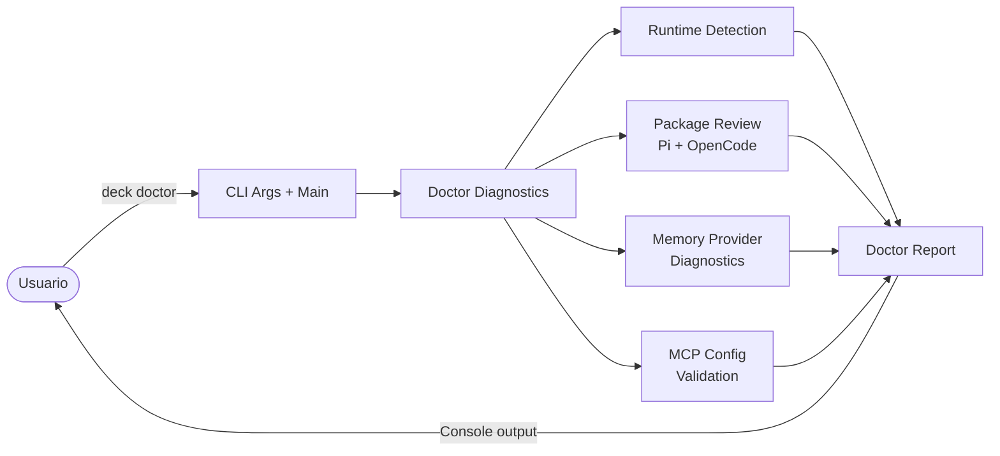

# Proposal: Comando `deck doctor`

## Intent

La definición del producto (`definition.md` §4.2) ya prevé `deck doctor` como parte de la CLI de Deck. Actualmente los usuarios no tienen una forma centralizada de verificar que su entorno de desarrollo con IA está correctamente configurado: runtimes instalados, paquetes requeridos, configuración de memoria, MCPs y credenciales necesarias. Este comando resolverá esa brecha con un diagnóstico claro y accionable.

## Goal

Proveer un comando `deck doctor` que, al ejecutarse en cualquier workspace, detecte el runtime activo, verifique paquetes requeridos, diagnostique proveedores de memoria y MCPs configurados, y reporte el estado con sugerencias de fix sin intentar auto-instalar.

## Scope

### In Scope
- Nuevo comando CLI `deck doctor` parseado en `cli-args.ts` y enrutado en `main.tsx`.
- Detección de runtimes soportados presentes en el sistema (Pi, OpenCode, Claude, Codex — con énfasis en Pi y OpenCode).
- Verificación de paquetes requeridos por cada runtime detectado, reutilizando `reviewPiRequiredTools` y `reviewOpenCodeTools`.
- Diagnóstico de proveedores de memoria (Engram, Supermemory): disponibilidad de binarios/dependencias y credenciales.
- Diagnóstico de MCPs configurados por runtime: presencia del archivo de configuración MCP, validez estructural (JSON), y existencia de entradas de servidor conocidas (ej. Supermemory).
- Reporte de estado con indicadores visuales: ✓ ok, ⚠ warning, ✗ error.
- Sugerencias de fix textuales cuando sea posible (ej. "Instala `pi` con ...", "Configura tu token de Supermemory en ...").

### Out of Scope
- Auto-fix o auto-instalación de paquetes/credenciales en este MVP.
- Modificación de archivos de configuración del usuario.
- Soporte para runtimes no soportados por los adapters existentes (Claude, Codex) más allá de la detección básica de binarios.
- Verificación de conectividad de red a servicios remotos (Supermemory API, etc.).
- Salida en formato JSON o modos verbosos adicionales (pueden agregarse en iteraciones futuras).

## Affected Capabilities

### New Capabilities
- `deck-doctor-command`: CLI argument parsing y routing para `deck doctor`.
- `doctor-diagnostics`: Módulo de diagnóstico que orquesta runtime detection, package review, memory diagnostics y MCP validation.
- `doctor-reporting`: Formateo de salida del diagnóstico con estados y sugerencias de fix.

### Modified Capabilities
- `cli-args`: Agregar parsing de `deck doctor` al tipo `ParsedArgs` y a `parseArgs()`.
- `cli-main`: Agregar branch `doctor` en `main.tsx` para invocar el módulo de diagnóstico.

### Unchanged Capabilities
- `pi-launch-command`: Requisitos no cambian; se reutiliza su lógica de memory diagnostics.
- `opencode-launch-command`: Requisitos no cambian; se reutiliza su lógica de memory diagnostics.
- `runtime-detection`: Se reutiliza `detectSelectedRuntimes` sin modificaciones a su contrato.
- `adapter-pi/required-tools` y `adapter-opencode/required-tools`: Se consumen como bibliotecas; sus contratos no cambian.
- `adapter-pi/preflight` y `adapter-opencode/preflight`: Se consumen como bibliotecas; sus contratos no cambian.
- `pi-mcp-config` y `opencode-mcp-config`: Se consumen funciones de validación existentes (`validateSupermemoryPiMcpConfig`); no se modifica su contrato.

## Approach

1. **Extender CLI args (`cli-args.ts`)**: Agregar `doctor` como `command: "doctor"` en `ParsedArgs`. El comando no recibe flags adicionales en el MVP.
2. **Enrutar en `main.tsx`**: Agregar un `if (parsed.command === "doctor")` que invoque el nuevo módulo de diagnóstico y renderice el reporte.
3. **Crear módulo de diagnóstico (`doctor-diagnostics.ts`)**: Orquestador que:
   - Llama a `detectSelectedRuntimes` con todos los `EnvironmentId` conocidos.
   - Para cada runtime instalado, invoca `inspectPiEnvironment` / `inspectOpenCodeEnvironment` (preflight) y `reviewPiRequiredTools` / `reviewOpenCodeTools`.
   - Evalúa proveedores de memoria registrados (`createMemoryProviders`) verificando binarios/dependencias (sin instanciar providers que requieran credenciales faltantes).
   - Valida configuración MCP con `validateSupermemoryPiMcpConfig` (para Pi) y lee/inspecciona `opencode.json` mcp section (para OpenCode).
   - Retorna un objeto de resultados estructurados (no texto).
4. **Crear módulo de reporting (`doctor-report.ts`)**: Toma los resultados estructurados y los formatea en consola con íconos de estado y sugerencias. Debe funcionar en TTY y non-TTY.
5. **Manejo de errores**: El diagnóstico nunca debe lanzar excepciones no controladas; cada sub-chequeo debe retornar estado de error con mensaje descriptivo.

## Alternatives and Tradeoffs

| Alternative | Why Considered | Why Not Chosen |
|---|---|---|
| Incluir auto-fix (instalación automática de paquetes) | Reduce fricción del usuario | Aumenta complejidad y riesgo de seguridad; la definición del producto separa `doctor` de `install`/`sync`. Se posterga. |
| Solo diagnosticar el runtime "activo" del workspace en lugar de todos los runtimes | Más conciso | Los usuarios pueden tener múltiples runtimes instalados y es útil reportar todos. Se mantiene la detección global. |
| Output JSON estructurado en lugar de texto humano | Facilita integración CI | El MVP apunta a usuarios humanos en terminal. JSON puede agregarse como flag `--json` futuro. |
| Integrar el diagnóstico en la TUI (`DeckApp`) en lugar de salida de consola | Experiencia visual unificada | El TUI actual no tiene un flujo de diagnóstico. La salida de consola es más directa y accesible. |

## Risks

| Risk | Likelihood | Mitigation |
|---|---|---|
| `deck doctor` falla porque falta un paquete del que depende el propio diagnóstico | Medium | El módulo de diagnóstico debe usar solo APIs de Node.js/Bun estándar y no importar dinámicamente adapters inexistentes. Cada chequeo envuelto en try/catch con fallback a "unable to check". |
| Reporte confuso cuando hay múltiples runtimes con configuraciones parciales | Medium | Reportar por runtime separado; usar warnings en lugar de errors cuando la configuración está incompleta pero no bloqueante. |
| Falsos negativos en detección de paquetes por diferencias de nombre normalizado | Low | Reutilizar la lógica de normalización existente en `required-tools.ts` de cada adapter. No inventar nueva normalización. |
| Credenciales expuestas en diagnósticos de MCP | Low | Reutilizar funciones de redacción existentes (`redact`, `redactDiagnostic`) de `pi-mcp-config.ts`. Nunca imprimir valores de tokens/headers. |

## Rollback Plan

- Revertir los commits que agregan `doctor` a `cli-args.ts`, `main.tsx`, y los nuevos módulos.
- Si se publicó, el comando simplemente deja de existir; no hay mutación de datos de usuario.
- Los adapters y su lógica de diagnóstico interna quedan intactos porque no se modifican.

## Dependencies

- `@deck/adapter-pi` — funciones `inspectPiEnvironment`, `reviewPiRequiredTools`, `validateSupermemoryPiMcpConfig`.
- `@deck/adapter-opencode` — funciones `inspectOpenCodeEnvironment`, `reviewOpenCodeTools`.
- `@deck/adapter-engram` y `@deck/adapter-supermemory` — solo para conocer los requisitos de instalación/binarios (no para instanciar providers con credenciales inválidas).

## Open Questions

- ¿Se incluye Claude y Codex en el diagnóstico aunque no tengan adapters completos, o solo se detectan como "presentes" sin verificación de paquetes?
- ¿Nivel de detalle por defecto: summary-only o listado completo de todos los paquetes? ¿Se agrega `--verbose` en este MVP?
- ¿Se acepta un flag `--fix` o `--json` aunque no hagan nada, para reservar la interfaz?
- ¿La validación de MCPs debe incluir lectura de la sección `mcp` de `opencode.json` más allá de Supermemory, o solo servidores conocidos?

> Estas preguntas deben resolverse en la fase de Spec antes de que Design produzca el plan técnico.

## Acceptance Direction

- [ ] Ejecutar `deck doctor` en un workspace sin runtime instalado muestra todos los runtimes como no instalados con sugerencias de instalación.
- [ ] Ejecutar `deck doctor` con Pi instalado pero faltando paquetes requeridos muestra los paquetes faltantes con estado ✗ y sugerencia de fix.
- [ ] Ejecutar `deck doctor` con todo instalado y configurado muestra únicamente estados ✓.
- [ ] Ejecutar `deck doctor` con credenciales de Supermemory ausentes muestra warning ⚠ sin exponer el valor del token.
- [ ] El comando nunca lanza excepción no controlada ni requiere interacción del usuario.
- [ ] El comando finaliza con exit code `0` si no hay errores críticos, y `1` si hay errores que impiden el uso de Deck.

## Next Steps

Ready for Spec (`deck-developer-spec`) and Design (`deck-developer-design`) in parallel.

## Mermaid Summary Source

