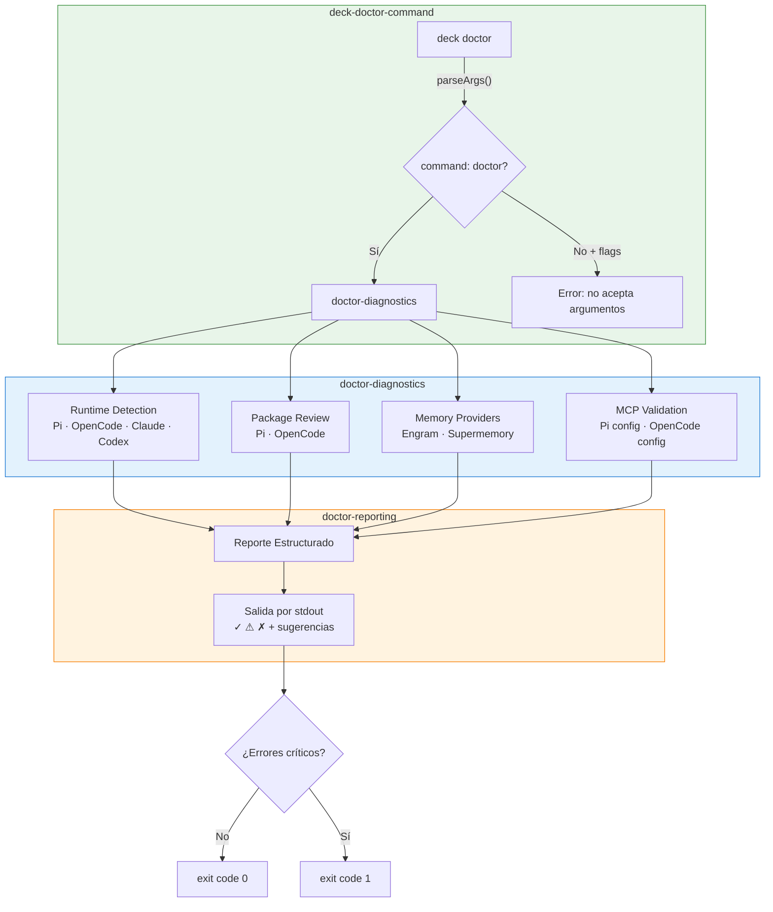
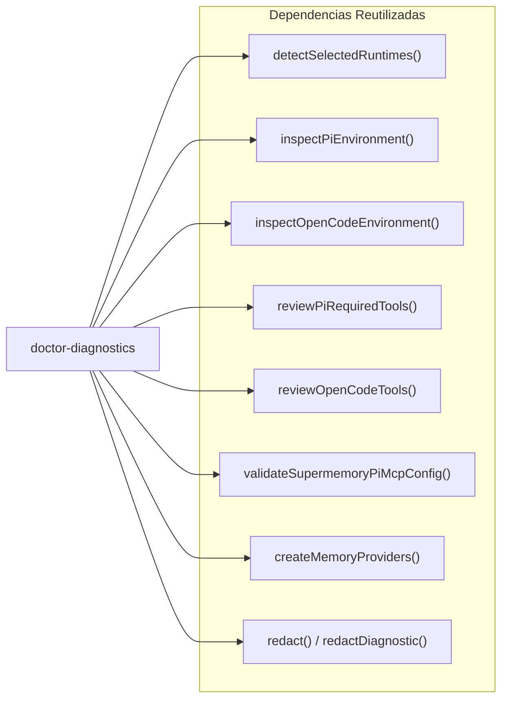

# Spec: Comando `deck doctor`

## Source

- Proposal: `deck-doctor-command` proposal artifact
- Capabilities afectadas:
  - **Nuevas**: `deck-doctor-command`, `doctor-diagnostics`, `doctor-reporting`
  - **Modificadas**: `cli-args`, `cli-main`
  - **No modificadas (reutilizadas)**: `runtime-detection`, `adapter-pi/required-tools`, `adapter-opencode/required-tools`, `adapter-pi/preflight`, `adapter-opencode/preflight`, `pi-mcp-config`, `opencode-mcp-config`, `runner-capability-registry`

---

## Resolución de Open Questions del Proposal

Las siguientes preguntas del proposal se resuelven en esta spec:

| Pregunta | Resolución | Justificación |
|---|---|---|
| ¿Claude y Codex en diagnóstico sin adapters completos? | **Sí, solo detección de presencia.** Se reportan como "detectado" o "no detectado" sin verificación de paquetes. | Útil para el usuario saber qué runtimes tiene; la verificación profunda se agrega cuando existan adapters. |
| ¿Nivel de detalle por defecto? | **Resumen agrupado por sección** (runtimes, paquetes, memoria, MCPs). Cada ítem tiene su propio estado. | Equilibrio entre información completa y legibilidad. |
| ¿Se reservan flags `--fix` / `--json`? | **No en este MVP.** Solo `deck doctor` sin argumentos adicionales. | Evitar interfaz muerta; se agregan cuando la funcionalidad exista. |
| ¿Validación MCPs solo servidores conocidos? | **Solo servidores conocidos** (Supermemory, codebase-memory-mcp). | Los servidores desconocidos se listan como "presentes" sin validación de credenciales. |

---

## Requirements

### Capability: `deck-doctor-command` (CLI Parsing + Routing)

REQ-CLI-001: El argumento `doctor` DEBE ser reconocido como un comando válido por `parseArgs()`, produciendo `{ command: "doctor" }` en el tipo `ParsedArgs`.
  Priority: MUST
  Surface: CLI
  Rationale: Sin parsing correcto, el comando no existe.

REQ-CLI-002: Cuando `parsed.command === "doctor"`, el flujo principal (`main.tsx`) DEBE invocar el módulo de diagnóstico y renderizar el reporte a stdout, sin iniciar la TUI ni lanzar runtimes.
  Priority: MUST
  Surface: CLI
  Rationale: El diagnóstico es un subcomando no-interactivo que debe ejecutarse y terminar.

REQ-CLI-003: Flags o argumentos adicionales después de `doctor` (ej. `deck doctor --fix`) DEBEN producir un error descriptivo indicando que el comando no acepta argumentos adicionales.
  Priority: MUST
  Surface: CLI
  Rationale: Evitar que flags no implementados sean ignorados silenciosamente.

REQ-CLI-004: El comando `deck doctor` DEBE funcionar sin requerir un workspace válido (sin `project-root`), ya que el diagnóstico es a nivel de entorno del usuario, no de proyecto.
  Priority: MUST
  Surface: CLI
  Rationale: El usuario puede querer diagnosticar su entorno antes de tener un workspace.

### Capability: `doctor-diagnostics` (Orquestador de Diagnóstico)

REQ-DIAG-001: El diagnóstico DEBE detectar todos los runtimes soportados (`pi`, `opencode`, `claude`, `codex`) e indicar para cada uno si están instalados o no.
  Priority: MUST
  Surface: General
  Rationale: El usuario necesita visibilidad completa de su entorno de runtimes.

REQ-DIAG-002: Para cada runtime **con adapter completo** (`pi`, `opencode`) que esté instalado, el diagnóstico DEBE invocar las funciones de preflight y required-tools existentes para verificar paquetes requeridos.
  Priority: MUST
  Surface: General
  Rationale: Reutiliza la lógica ya existente de verificación de paquetes.

REQ-DIAG-003: Para runtimes **sin adapter completo** (`claude`, `codex`) que estén instalados, el diagnóstico DEBE reportar "runtime detectado" sin verificar paquetes ni configuración.
  Priority: MUST
  Surface: General
  Rationale: No existen adapters para estos runtimes; reportar solo presencia.

REQ-DIAG-004: El diagnóstico DEBE evaluar la disponibilidad de cada proveedor de memoria registrado (Engram, Supermemory) verificando la existencia del binario/comando correspondiente sin instanciar providers que requieran credenciales.
  Priority: MUST
  Surface: General
  Rationale: Verificar disponibilidad sin exponer errores de autenticación.

REQ-DIAG-005: Para Pi, el diagnóstico DEBE validar la configuración MCP usando `validateSupermemoryPiMcpConfig` y reportar estado de servidores conocidos (Supermemory, codebase-memory-mcp).
  Priority: MUST
  Surface: General
  Rationale: La configuración MCP es crítica para el funcionamiento de Pi.

REQ-DIAG-006: Para OpenCode, el diagnóstico DEBE leer la sección `mcp` de `opencode.json` y reportar la presencia y validez estructural de servidores MCP conocidos (Supermemory, codebase-memory-mcp).
  Priority: SHOULD
  Surface: General
  Rationale: Extiende la validación MCP al runtime OpenCode.

REQ-DIAG-007: Cada sub-chequeo del diagnóstico DEBE ejecutarse de forma aislada: un error en un chequeo NO DEBE impedir que los demás se ejecuten y reporten sus resultados.
  Priority: MUST
  Surface: General
  Rationale: Un diagnóstico parcial es más valioso que un diagnóstico que falla completamente.

REQ-DIAG-008: El módulo de diagnóstico DEBE retornar un objeto estructurado (no texto formateado), permitiendo que el reporting sea independiente de la recolección.
  Priority: MUST
  Surface: General
  Rationale: Separación de responsabilidades entre diagnóstico y presentación.

REQ-DIAG-009: El diagnóstico NO DEBE exponer valores de tokens, credenciales ni headers en ningún resultado. DEBE usar las funciones de redacción existentes (`redact`, `redactDiagnostic`).
  Priority: MUST
  Surface: Security
  Rationale: Proteger información sensible del usuario.

### Capability: `doctor-reporting` (Formateo de Salida)

REQ-RPT-001: El reporte DEBE mostrar cada ítem de diagnóstico con un indicador visual de estado: `✓` para OK, `⚠` para warning, `✗` para error.
  Priority: MUST
  Surface: UI
  Rationale: Interpretación inmediata del estado del entorno.

REQ-RPT-002: Para cada ítem con estado `⚠` o `✗`, el reporte DEBE incluir una sugerencia de fix textual accionable (ej. "Instala `pi` con...", "Configura tu token de Supermemory en...").
  Priority: MUST
  Surface: UI
  Rationale: El diagnóstico sin sugerencias de solución tiene valor limitado.

REQ-RPT-003: El reporte DEBE estar organizado en secciones claras: Runtimes, Paquetes (por runtime), Proveedores de Memoria, Configuración MCP.
  Priority: MUST
  Surface: UI
  Rationale: Facilita la lectura rápida por categoría.

REQ-RPT-004: La salida DEBE funcionar correctamente tanto en TTY como en non-TTY (pipes, redirección a archivo).
  Priority: MUST
  Surface: UI
  Rationale: Permite uso en scripts y CI.

REQ-RPT-005: El reporte NO DEBE usar colores ANSI cuando la salida no es un TTY.
  Priority: SHOULD
  Surface: UI
  Rationale: Evitar caracteres de escape en archivos y pipes.

### Non-Functional Requirements

REQ-NF-001: El comando DEBE completar el diagnóstico en menos de 10 segundos en un entorno típico.
  Priority: SHOULD
  Surface: Performance
  Rationale: Experiencia de usuario; el diagnóstico debe sentirse instantáneo.

REQ-NF-002: El comando DEBE finalizar con exit code `0` cuando no hay errores críticos (aunque haya warnings), y exit code `1` cuando hay errores que impiden el uso de Deck.
  Priority: MUST
  Surface: CLI
  Rationale: Permite uso en scripts y CI para detectar entornos rotos.

REQ-NF-003: El comando NUNCA DEBE lanzar excepciones no controladas. Todo error interno DEBE convertirse en un ítem de diagnóstico con estado `✗` y mensaje descriptivo.
  Priority: MUST
  Surface: General
  Rationale: Un comando de diagnóstico que falla sin mensaje contradice su propósito.

REQ-NF-004: El comando NO DEBE requerer interacción del usuario (no prompts, no stdin).
  Priority: MUST
  Surface: CLI
  Rationale: Debe ser ejecutable en CI/CD y scripts automatizados.

REQ-NF-005: El diagnóstico DEBE usar solo APIs estándar de Node.js/Bun y funciones de los adapters existentes, sin importar dinámicamente módulos que podrían no existir.
  Priority: MUST
  Surface: General
  Rationale: Evitar que el propio diagnóstico falle por dependencias faltantes.

---

## Acceptance Scenarios

### Capability: `deck-doctor-command`

#### Scenario: Comando reconocido correctamente
**Given** un usuario ejecuta `deck doctor` desde la terminal
**When** `parseArgs()` recibe `["doctor"]`
**Then** retorna `{ command: "doctor" }` sin error
> Covers: REQ-CLI-001

#### Scenario: Flags no soportados producen error
**Given** un usuario ejecuta `deck doctor --fix`
**When** `parseArgs()` recibe `["doctor", "--fix"]`
**Then** retorna `{ command: "error", message: "...no acepta argumentos adicionales..." }`
> Covers: REQ-CLI-003

#### Scenario: Ejecución sin workspace válido
**Given** el usuario ejecuta `deck doctor` en un directorio que no es un workspace Deck
**When** el comando se ejecuta
**Then** el diagnóstico se ejecuta y muestra resultados sin error relacionado al workspace
> Covers: REQ-CLI-004

#### Scenario: No inicia TUI ni lanza runtimes
**Given** el usuario ejecuta `deck doctor` en una TTY interactiva
**When** el comando se ejecuta
**Then** la TUI no se inicia, no se lanza ningún runtime, y el proceso termina después de mostrar el reporte
> Covers: REQ-CLI-002

### Capability: `doctor-diagnostics`

#### Scenario: Workspace sin ningún runtime instalado
**Given** ningún runtime (`pi`, `opencode`, `claude`, `codex`) está instalado en el sistema
**When** el usuario ejecuta `deck doctor`
**Then** todos los runtimes se reportan como "no instalados" con sugerencia de instalación
> Covers: REQ-DIAG-001, REQ-DIAG-003

#### Scenario: Pi instalado con todos los paquetes requeridos
**Given** Pi está instalado y todos los paquetes requeridos por `REQUIRED_TOOLS` están presentes
**When** el usuario ejecuta `deck doctor`
**Then** la sección de Pi muestra `✓` para el runtime y `✓` para cada paquete requerido
> Covers: REQ-DIAG-002

#### Scenario: Pi instalado pero faltando paquetes requeridos
**Given** Pi está instalado pero faltan uno o más paquetes requeridos
**When** el usuario ejecuta `deck doctor`
**Then** los paquetes faltantes se muestran con `✗` y una sugerencia de instalación
> Covers: REQ-DIAG-002

#### Scenario: Claude detectado sin verificación de paquetes
**Given** el comando `claude` existe en el PATH
**When** el usuario ejecuta `deck doctor`
**Then** Claude se reporta como "detectado" sin verificación de paquetes ni configuración
> Covers: REQ-DIAG-003

#### Scenario: Codex no instalado
**Given** el comando `codex` no existe en el PATH
**When** el usuario ejecuta `deck doctor`
**Then** Codex se reporta como "no detectado" con sugerencia de instalación
> Covers: REQ-DIAG-003

#### Scenario: Proveedor de memoria Engram disponible
**Given** el comando `engram` existe en el PATH
**When** el usuario ejecuta `deck doctor`
**Then** Engram se reporta con estado OK `✓` en la sección de proveedores de memoria
> Covers: REQ-DIAG-004

#### Scenario: Proveedor de memoria Supermemory sin credenciales
**Given** el comando `supermemory` no existe o las credenciales no están configuradas
**When** el usuario ejecuta `deck doctor`
**Then** Supermemory se reporta con estado `⚠` o `✗` indicando credenciales faltantes, sin exponer valores de tokens
> Covers: REQ-DIAG-004, REQ-DIAG-009

#### Scenario: MCP de Pi configurado correctamente
**Given** Pi está instalado y `validateSupermemoryPiMcpConfig` retorna sin errores
**When** el usuario ejecuta `deck doctor`
**Then** la sección MCP de Pi muestra `✓` para los servidores conocidos
> Covers: REQ-DIAG-005

#### Scenario: MCP de Pi con configuración inválida
**Given** Pi está instalado pero la configuración MCP de Supermemory tiene errores
**When** el usuario ejecuta `deck doctor`
**Then** la sección MCP de Pi muestra `✗` con el error reportado (sin exponer credenciales) y sugerencia de fix
> Covers: REQ-DIAG-005, REQ-DIAG-009

#### Scenario: MCP de OpenCode con servidores conocidos
**Given** OpenCode está instalado y `opencode.json` contiene la sección `mcp` con Supermemory y/o codebase-memory-mcp
**When** el usuario ejecuta `deck doctor`
**Then** la sección MCP de OpenCode muestra el estado de cada servidor conocido
> Covers: REQ-DIAG-006

#### Scenario: Error en un sub-chequeo no bloquea los demás
**Given** la verificación de paquetes de Pi lanza una excepción interna
**When** el usuario ejecuta `deck doctor`
**Then** el reporte muestra `✗` para la sección de paquetes de Pi con el mensaje de error, y continúa reportando runtimes, memoria, y MCPs normalmente
> Covers: REQ-DIAG-007

#### Scenario: Resultado estructurado
**Given** el módulo de diagnóstico se ejecuta
**When** retorna sus resultados
**Then** el resultado es un objeto estructurado (no un string formateado) que contiene secciones para runtimes, paquetes, memoria y MCPs
> Covers: REQ-DIAG-008

### Capability: `doctor-reporting`

#### Scenario: Reporte con todos los estados OK
**Given** todos los runtimes, paquetes, proveedores de memoria y MCPs están correctamente configurados
**When** el usuario ejecuta `deck doctor`
**Then** la salida muestra únicamente indicadores `✓` en todas las secciones, sin sugerencias de fix
> Covers: REQ-RPT-001, REQ-RPT-003

#### Scenario: Reporte con warnings y errores
**Given** hay al menos un warning y un error en el diagnóstico
**When** el usuario ejecuta `deck doctor`
**Then** cada ítem con `⚠` o `✗` incluye una sugerencia de fix textual accionable
> Covers: REQ-RPT-001, REQ-RPT-002

#### Scenario: Salida en non-TTY (pipe)
**Given** el usuario ejecuta `deck doctor | tee reporte.txt`
**When** la salida se redirige
**Then** el reporte se muestra correctamente sin caracteres de control ANSI, con indicadores de estado legibles
> Covers: REQ-RPT-004, REQ-RPT-005

#### Scenario: Salida en TTY interactiva
**Given** el usuario ejecuta `deck doctor` en una terminal TTY
**When** la salida se muestra
**Then** el reporte es legible y los indicadores de estado son visibles
> Covers: REQ-RPT-001, REQ-RPT-003

### Non-Functional Scenarios

#### Scenario: Exit code 0 sin errores críticos
**Given** el diagnóstico muestra solo warnings (ej. credenciales faltantes) pero ningún error que impida usar Deck
**When** el comando termina
**Then** el exit code es `0`
> Covers: REQ-NF-002

#### Scenario: Exit code 1 con errores críticos
**Given** el diagnóstico muestra errores que impiden el uso de Deck (ej. ningún runtime instalado, o runtime principal sin paquetes críticos)
**When** el comando termina
**Then** el exit code es `1`
> Covers: REQ-NF-002

#### Scenario: Sin excepciones no controladas
**Given** un sub-chequeo del diagnóstico lanza una excepción inesperada
**When** el comando se ejecuta
**Then** la excepción se captura, se convierte en un ítem `✗` con mensaje descriptivo, y el comando termina normalmente
> Covers: REQ-NF-003

#### Scenario: Sin interacción del usuario
**Given** el usuario ejecuta `deck doctor`
**When** el comando se ejecuta
**Then** no se presenta ningún prompt ni se lee de stdin; el comando se ejecuta de inicio a fin sin interacción
> Covers: REQ-NF-004

---

## Validation Rules

| Campo / Input | Regla | Mensaje de Error | REQ-ID |
|---|---|---|---|
| Primer argumento después de `deck` | Debe ser un comando conocido (`pi`, `opencode`, `doctor`) o vacío (TUI) | "Comando desconocido: `{arg}`" | REQ-CLI-001 |
| Argumentos adicionales a `deck doctor` | No se permiten flags ni argumentos extras en el MVP | "El comando `deck doctor` no acepta argumentos adicionales." | REQ-CLI-003 |

---

## Error Contracts

| Condición | Código | Mensaje | Exit Code |
|---|---|---|---|
| Flags no soportados en `deck doctor` | `CLI_INVALID_ARGS` | "El comando `deck doctor` no acepta argumentos adicionales." | 1 |
| Excepción en sub-chequeo de diagnóstico | `DIAG_CHECK_ERROR` | "{nombre del chequeo}: No se pudo verificar — {mensaje del error}" | 0 (si no es crítico) / 1 (si es crítico) |
| No se encontró ningún runtime | `NO_RUNTIMES` | "No se detectó ningún runtime soportado. Instala al menos uno de: Pi, OpenCode, Claude, Codex." | 1 |

---

## States and Transitions

Este comando no tiene ciclo de vida con estados. Es un comando fire-and-forget: se ejecuta, diagnostica, reporta y termina.

---

## Open Questions

Ninguna pendiente — todas las preguntas del proposal fueron resueltas en esta spec.

---

## Compliance Matrix

| REQ-ID | Scenario(s) | Status |
|---|---|---|
| REQ-CLI-001 | Comando reconocido correctamente | Defined |
| REQ-CLI-002 | No inicia TUI ni lanza runtimes | Defined |
| REQ-CLI-003 | Flags no soportados producen error | Defined |
| REQ-CLI-004 | Ejecución sin workspace válido | Defined |
| REQ-DIAG-001 | Workspace sin ningún runtime instalado | Defined |
| REQ-DIAG-002 | Pi instalado con todos los paquetes / Pi instalado pero faltando paquetes | Defined |
| REQ-DIAG-003 | Claude detectado sin verificación / Codex no instalado | Defined |
| REQ-DIAG-004 | Proveedor de memoria Engram disponible / Supermemory sin credenciales | Defined |
| REQ-DIAG-005 | MCP de Pi configurado correctamente / MCP de Pi con configuración inválida | Defined |
| REQ-DIAG-006 | MCP de OpenCode con servidores conocidos | Defined |
| REQ-DIAG-007 | Error en un sub-chequeo no bloquea los demás | Defined |
| REQ-DIAG-008 | Resultado estructurado | Defined |
| REQ-DIAG-009 | Supermemory sin credenciales / MCP de Pi con configuración inválida | Defined |
| REQ-RPT-001 | Reporte con todos los estados OK / Reporte con warnings y errores | Defined |
| REQ-RPT-002 | Reporte con warnings y errores | Defined |
| REQ-RPT-003 | Reporte con todos los estados OK / Salida en TTY interactiva | Defined |
| REQ-RPT-004 | Salida en non-TTY (pipe) | Defined |
| REQ-RPT-005 | Salida en non-TTY (pipe) | Defined |
| REQ-NF-001 | (Medible en runtime, no scenario explícito) | Defined |
| REQ-NF-002 | Exit code 0 sin errores críticos / Exit code 1 con errores críticos | Defined |
| REQ-NF-003 | Sin excepciones no controladas | Defined |
| REQ-NF-004 | Sin interacción del usuario | Defined |
| REQ-NF-005 | (Restricción de implementación, verificable por code review) | Defined |

---

## Mermaid Summary Source

