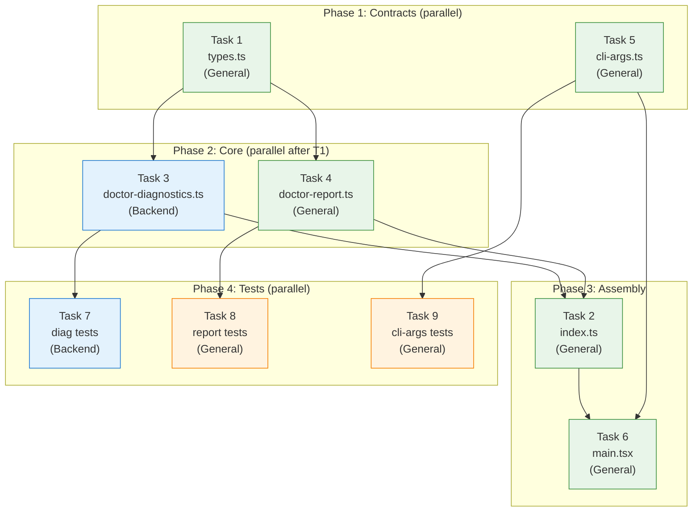

# Tasks: Comando `deck doctor`

## Source

- Spec: `deck-doctor-command` spec artifact
- Design: `deck-doctor-command` design artifact
- Capabilities affected: `deck-doctor-command`, `doctor-diagnostics`, `doctor-reporting`, `cli-args`, `cli-main`

---

## Task Groups

### Group: Shared / Contracts

#### Task 1: Create shared types for doctor diagnostics

**Owner**: General Apply
**Priority**: P0
**Complexity**: Low
**Parallel**: Yes
**Depends on**: none

**Description**
Create `apps/cli/src/doctor-command/types.ts` with the structured result types that `doctor-diagnostics.ts` produces and `doctor-report.ts` consumes. Types include: `DoctorStatus` (`"ok" | "warning" | "error"`), `DoctorCheckItem` (status, message, suggestion?), `DoctorCategoryResult` (category name, status, items[]), `DoctorRuntimeResult` (runtime id, name, installed, version?, checks[]), `DoctorDiagnosticsResult` (runtimes[], memory[], mcp[], hasCriticalErrors). This is the contract boundary between Backend (diagnostics) and General (reporting).

**Files**
- `apps/cli/src/doctor-command/types.ts` — create

**Verification**
- File exists and exports all types listed above.
- `tsc --noEmit` passes without errors.

---

#### Task 2: Create barrel export for doctor-command module

**Owner**: General Apply
**Priority**: P0
**Complexity**: Low
**Parallel**: No — depends on Task 1 (needs types), Task 3 (needs diagnostics), Task 4 (needs report)
**Depends on**: Task 1, Task 3, Task 4

**Description**
Create `apps/cli/src/doctor-command/index.ts` re-exporting the public API of the doctor sub-system: `runDoctorDiagnostics` from `doctor-diagnostics.ts`, `renderDoctorReport` from `doctor-report.ts`, and all types from `types.ts`. This must be created last since it depends on the other files existing.

**Files**
- `apps/cli/src/doctor-command/index.ts` — create

**Verification**
- `import { runDoctorDiagnostics, renderDoctorReport, DoctorDiagnosticsResult } from "./doctor-command"` resolves without error.
- `tsc --noEmit` passes.

---

### Group: Backend

#### Task 3: Create doctor diagnostics orchestrator

**Owner**: Backend Apply
**Priority**: P0
**Complexity**: High
**Parallel**: No — depends on Task 1 (types)
**Depends on**: Task 1

**Description**
Create `apps/cli/src/doctor-command/doctor-diagnostics.ts` implementing `runDoctorDiagnostics(): Promise<DoctorDiagnosticsResult>`. The orchestrator:
- Calls `detectSelectedRuntimes` with all 4 `EnvironmentId` values.
- For each installed runtime with full adapter (Pi, OpenCode): invokes `inspect{Pi,OpenCode}Environment` + `review{PiRequiredTools,OpenCodeTools}`.
- For runtimes without full adapter (Claude, Codex): reports detected/not-detected only.
- Evaluates memory providers by checking binary/command availability (not instantiating with credentials).
- Validates MCP config: Pi via `validateSupermemoryPiMcpConfig`; OpenCode by reading `opencode.json` mcp section and checking known server entries.
- Each sub-check is wrapped in try/catch returning `{ status: "error", message }` on failure — REQ-DIAG-007.
- Uses `redact` / `redactDiagnostic` from `pi-mcp-config.ts` when constructing messages involving MCP diagnostics — REQ-DIAG-009.
- Returns structured `DoctorDiagnosticsResult` (never throws) — REQ-DIAG-008.

**Files**
- `apps/cli/src/doctor-command/doctor-diagnostics.ts` — create

**Verification**
- `tsc --noEmit` passes.
- Function `runDoctorDiagnostics` is exported and returns `Promise<DoctorDiagnosticsResult>`.
- Manual smoke test: `node -e "import('./doctor-command/doctor-diagnostics').then(m => m.runDoctorDiagnostics().then(console.log))"` completes without throwing.

---

### Group: General (CLI + Reporting)

#### Task 4: Create doctor report formatter

**Owner**: General Apply
**Priority**: P0
**Complexity**: Medium
**Parallel**: Yes — only depends on Task 1 (types)
**Depends on**: Task 1

**Description**
Create `apps/cli/src/doctor-command/doctor-report.ts` implementing `renderDoctorReport(result: DoctorDiagnosticsResult): void` and `shouldExitWithError(result: DoctorDiagnosticsResult): boolean`. The formatter:
- Prints output organized in sections: Runtimes, Packages (grouped by runtime), Memory Providers, MCP Configuration — REQ-RPT-003.
- Uses `✓` for ok, `⚠` for warning, `✗` for error — REQ-RPT-001.
- Includes actionable fix suggestions for each warning/error item — REQ-RPT-002.
- Detects TTY vs non-TTY via `process.stdout.isTTY`; suppresses ANSI colors in non-TTY — REQ-RPT-004, REQ-RPT-005.
- `shouldExitWithError` returns `true` when `hasCriticalErrors` is true — REQ-NF-002.

**Files**
- `apps/cli/src/doctor-command/doctor-report.ts` — create

**Verification**
- `tsc --noEmit` passes.
- Function `renderDoctorReport` and `shouldExitWithError` are exported.
- Manual test: pass a fabricated `DoctorDiagnosticsResult` and verify console output has sections, icons, and suggestions.

---

#### Task 5: Extend CLI argument parsing for `doctor`

**Owner**: General Apply
**Priority**: P0
**Complexity**: Low
**Parallel**: Yes — independent of Tasks 1-4
**Depends on**: none

**Description**
Modify `apps/cli/src/cli-args.ts`:
- Add `{ command: "doctor" }` as a variant to the `ParsedArgs` discriminated union type — REQ-CLI-001.
- Add parsing logic in `parseArgs()`: when first argument is `"doctor"`, check that no additional arguments follow; if extra args are present, return `{ command: "error", message: "El comando \`deck doctor\` no acepta argumentos adicionales." }` — REQ-CLI-003.
- When `doctor` is parsed cleanly, return `{ command: "doctor" }`.

**Files**
- `apps/cli/src/cli-args.ts` — modify

**Verification**
- `parseArgs(["doctor"])` returns `{ command: "doctor" }`.
- `parseArgs(["doctor", "--fix"])` returns `{ command: "error", message: /no acepta argumentos/ }`.
- Existing tests continue to pass.
- `tsc --noEmit` passes.

---

#### Task 6: Route `doctor` command in main entry point

**Owner**: General Apply
**Priority**: P0
**Complexity**: Low
**Parallel**: No — depends on Task 2, Task 4, Task 5
**Depends on**: Task 2, Task 4, Task 5

**Description**
Modify `apps/cli/src/main.tsx` to add a new branch:
- `if (parsed.command === "doctor")` — REQ-CLI-002.
- Calls `runDoctorDiagnostics()` from `./doctor-command`.
- Calls `renderDoctorReport(result)`.
- Calls `process.exit(shouldExitWithError(result) ? 1 : 0)` — REQ-NF-002.
- Does NOT enter TUI mode or launch any runtime.
- The entire branch must be wrapped in a top-level try/catch that prints a user-friendly error and exits with code 1 if something unexpected happens — REQ-NF-003.

**Files**
- `apps/cli/src/main.tsx` — modify

**Verification**
- `deck doctor` runs the diagnostics and prints report, then exits.
- TUI is not started.
- Exit code is 0 when no critical errors, 1 when critical errors exist.
- `tsc --noEmit` passes.

---

### Group: Tests

#### Task 7: Create unit tests for doctor diagnostics

**Owner**: Backend Apply
**Priority**: P1
**Complexity**: Medium
**Parallel**: No — depends on Task 3
**Depends on**: Task 3

**Description**
Create `apps/cli/src/__tests__/doctor-diagnostics.test.ts` with unit tests covering key scenarios:
- All runtimes absent → all reported as not installed.
- Pi installed with all packages OK → all `✓`.
- Pi installed with missing packages → missing packages show `✗`.
- Claude detected but no package verification → only "detected" status.
- Memory provider (Engram) available → `✓`.
- Memory provider (Supermemory) without credentials → `⚠` without token exposure.
- MCP for Pi configured correctly → `✓`.
- MCP for Pi with errors → `✗` with redacted diagnostics.
- OpenCode MCP section with known servers → validated.
- Sub-check exception does not abort other checks → REQ-DIAG-007.
- Result is structured object (not string) → REQ-DIAG-008.
- No credentials exposed in any result → REQ-DIAG-009.

Use dependency injection or module mocking for external functions (`detectSelectedRuntimes`, adapter functions, file reads).

**Files**
- `apps/cli/src/__tests__/doctor-diagnostics.test.ts` — create

**Verification**
- All test cases pass: `bun test apps/cli/src/__tests__/doctor-diagnostics.test.ts`.
- Coverage of `doctor-diagnostics.ts` > 80%.

---

#### Task 8: Create unit tests for doctor report

**Owner**: General Apply
**Priority**: P1
**Complexity**: Low
**Parallel**: No — depends on Task 4
**Depends on**: Task 4

**Description**
Create `apps/cli/src/__tests__/doctor-report.test.ts` with unit tests covering:
- All-OK result → output contains only `✓`, no suggestions.
- Mixed warnings/errors → each non-OK item has a suggestion.
- Output organized by sections (Runtimes, Packages, Memory, MCP) → REQ-RPT-003.
- Non-TTY mode → no ANSI escape codes in output → REQ-RPT-005.
- `shouldExitWithError` returns `true` for results with critical errors, `false` for warnings-only.

**Files**
- `apps/cli/src/__tests__/doctor-report.test.ts` — create

**Verification**
- All test cases pass: `bun test apps/cli/src/__tests__/doctor-report.test.ts`.

---

#### Task 9: Update CLI args tests for `doctor` command

**Owner**: General Apply
**Priority**: P1
**Complexity**: Low
**Parallel**: No — depends on Task 5
**Depends on**: Task 5

**Description**
Update `apps/cli/src/cli-args.test.ts` to add test cases for the `doctor` command:
- `parseArgs(["doctor"])` → `{ command: "doctor" }`.
- `parseArgs(["doctor", "--fix"])` → error with message about no extra args.
- `parseArgs(["doctor", "extra"])` → error with message about no extra args.
- Existing test cases continue to pass.

**Files**
- `apps/cli/src/cli-args.test.ts` — modify

**Verification**
- All test cases pass: `bun test apps/cli/src/cli-args.test.ts`.
- New test cases cover REQ-CLI-001 and REQ-CLI-003.

---

## Dependency Graph

```
Task 1 (types.ts) ─────────────────────────────────────────┐
  ├─→ Task 3 (doctor-diagnostics.ts) ──→ Task 7 (diag tests)
  ├─→ Task 4 (doctor-report.ts) ──→ Task 8 (report tests)  │
  └─→ Task 2 (index.ts) ←─ depends on Tasks 1,3,4         │
                                                            │
Task 5 (cli-args.ts) ──→ Task 9 (cli-args tests)           │
  │                                                         │
  └─→ Task 6 (main.tsx) ←─ depends on Tasks 2,4,5 ────────┘
```

## Parallelization Plan

| Phase | Tasks | Can Run in Parallel |
|---|---|---|
| Shared contracts | Task 1 (types), Task 5 (cli-args) | Yes — independent |
| Core implementation | Task 3 (diagnostics), Task 4 (report) | Yes — both depend only on Task 1 |
| Assembly | Task 2 (index), Task 6 (main.tsx) | No — Task 2 blocks Task 6 |
| Tests | Task 7, Task 8, Task 9 | Yes — independent after their implementation tasks |

## Responsibility Contracts

| Contract / Boundary | Owner | Consumers | Notes |
|---|---|---|---|
| `DoctorDiagnosticsResult` and related types (`types.ts`) | General Apply | Backend Apply (Task 3), General Apply (Task 4) | Shared contract; must exist before diagnostics and report implementation |
| `runDoctorDiagnostics()` return shape | Backend Apply (Task 3) | General Apply (Task 4, Task 6) | Must conform exactly to `DoctorDiagnosticsResult` from types.ts |
| `renderDoctorReport()` + `shouldExitWithError()` signature | General Apply (Task 4) | General Apply (Task 6) | Takes `DoctorDiagnosticsResult`, produces stdout output and exit-code decision |
| `ParsedArgs` union type with `"doctor"` variant | General Apply (Task 5) | General Apply (Task 6) | Backward-compatible addition; existing variants unchanged |

## Complexity Summary

| Complexity | Count | Task Numbers |
|---|---|---|
| Low | 5 | 1, 2, 5, 6, 8, 9 |
| Medium | 2 | 4, 7 |
| High | 1 | 3 |

> Note: Low count is 6 (Tasks 1, 2, 5, 6, 8, 9), Medium is 2 (Tasks 4, 7), High is 1 (Task 3).

## Flagged for Splitting

- Task 3 (doctor-diagnostics.ts): High complexity, touches 5+ adapter imports and 4 diagnostic categories (runtime, packages, memory, MCP). If the orchestrator grows beyond ~300 lines during implementation, consider splitting into separate check functions (one per category) that the orchestrator calls. The types (Task 1) already support this because each category has its own result type.

## Review Workload Forecast

| Signal | Value |
|---|---|
| Estimated changed lines | 400-800 |
| 400-line budget risk | Medium |
| Scope reduction recommended | No |
| Sequential work slices recommended | Yes — Tasks 1+5 → Tasks 3+4 → Tasks 2+6 → Tests |
| Decision needed before Apply | No |

**Rationale**: The change introduces 4 new files (~400-600 lines total) and modifies 2 existing files (~20-30 lines of changes). The main risk is Task 3 (diagnostics orchestrator) which integrates with 5+ existing modules. The two implementation phases (contracts → core) should be reviewed before moving to assembly and tests. No decisions are pending — all open questions from the proposal were resolved in the spec.

## Open Questions / Blockers

None — tasks are ready for Apply. All open questions from the proposal were resolved in the spec, and the design provides sufficient technical detail for implementation.

---

## Mermaid Summary Source


