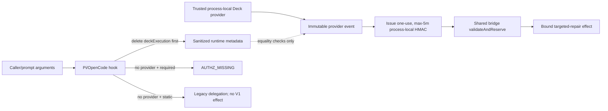

# Design Replan: Installed-Runner Authority Boundary

## Immutable PhaseResult

| Field | Value |
|---|---|
| Role | `design` |
| Instance provenance | Automatic-SDD Design specialist using `openai/gpt-5.6-sol`; fresh architecture judgment distinct from the prior Apply, Verify, Review, Spec, Design, and Task instances; no subagent used |
| Change ID | `deterministic-apply-verify-review-flow` |
| Trigger | `REVIEW-G2-G6-PI-B1-CALLER-SUPPLIED-AUTHORITY` (`critical`, root cause `architecture`, destination `replan_design`) |
| User authority | the user's exact “Procede” response after the coordinator requested authority to replan the shared authority boundary and Pi/OpenCode adapters; Design only |
| Authorized writes | update `design.md`; add this change-local Design replan artifact |
| Artifacts modified | `openspec/changes/deterministic-apply-verify-review-flow/design.md` |
| Artifacts written | `openspec/changes/deterministic-apply-verify-review-flow/design-replan-runner-authority.md` |
| Status | `completed` — the blocking finding is resolved at the architecture/HOW level |
| Action | `task_replan_handoff` — reconcile exact Tasks; do not Apply |
| Security lane | **CRITICAL** |
| Design blockers | none |
| Implementation blocker | the caller-supplied fallback remains in current OpenCode source and in uncommitted Pi worktree evidence until a separately authorized Apply removes it |
| Required future batch | `deterministic-apply-verify-review-flow-runner-authority-g2-g6` |
| Apply authority | **BLOCKED** — this Design and the prior “Procede” do not authorize Apply; after Tasks, the user must authorize the exact future batch name in a new message |
| FailureManifestV1 | present below; no new Design finding |
| Ordered RegistryIntentV1 values | `[]` |

## Context authority and write boundary

- **Official context:** `proposal.md`, `spec.md`, current `design.md`, prior Design/Spec/Task replans, current `tasks.md`, the delegated immutable Review finding, current source/tests, generated asset/install paths, and worktree evidence.
- **Adaptive context:** loaded and used only as advisory corroboration. OpenSpec, delegated phase authority, source, tests, and worktree evidence controlled this Design.
- **Write boundary honored:** no source, test, generated asset, registry file, `state.yaml`, `events.yaml`, other change, or `runner-capability-standardization` file was modified.
- **Worktree ownership:** the pre-existing modified Pi canonical source, generated asset, and reachability test were inspected only. Their self-consistency and prior test results are runtime evidence, not accepted authority or pre-approval for future Apply.
- **No Apply:** no implementation, source regeneration, install, test, build, registry commit, or destructive Git operation was performed.

## Immutable evidence bindings

| Binding | Digest / value |
|---|---|
| Repository HEAD | `15804c48584fc2b4e936a71c88608e9523011d79` |
| `proposal.md` | `sha256:2b3c63a2bceaa06a8449c68d7ac080eee5724793a4060a9e5c4380a8a01e1ba1` |
| `spec.md` | `sha256:374a8fb1a155830624083829aa8ccbbe609032e6a1b4c8064169372b4bfb8d7f` |
| `tasks.md` consumed | `sha256:56c3cfebaaadf98e685bfd25f9fd14f0a4259483739b3257f1f1ba259b2cecd9` |
| `design.md` before this replan | `sha256:a2873999c3a1164393d57060db2032f2cf6aa8f9ca40f46c56e6911d9319d8fe` |
| `design.md` after this replan | `sha256:9850e208e6f364232c4418481e6cc99eb063a68a1afdf77db52ae703ca2e9bc1` |
| OpenCode canonical plugin | `sha256:0ec0684d24afcbaf5c4a7ba43abd1b8dde4c9aa8c47580f21c735ef5faf6a26f` |
| OpenCode generated plugin | `sha256:f08ef142d20c568dccf8c714554134c5a3c9ace790313e4bc7d8f85097d98cae` |
| Pi canonical extension (uncommitted worktree evidence) | `sha256:e24e50d2cc867a11cb2e9000f1c132efbeb387f255d79966fc780f1e7c1544eb` |
| Pi generated extension (uncommitted worktree evidence) | `sha256:d6d39cb14cfd8244cdd4e8d60ffda3629fe92e31cd694f0b5b1dfa81b8335aeb` |
| Invocation authorization service | `sha256:b732e2881ebe9d459efc59aeaa773202a0fd1396583b033c2c5c62b3063a8eb1` |
| Shared runner-host bridge | `sha256:737967176ee2537f14ff82bc34fe0607ad498332609bd4ac367e5718bf1038cc` |

The delegated Review finding is not duplicated as a repository Review artifact by this Design. Its fingerprint is corroborated directly by both adapters deriving claims from `input.deckExecution`/`args.deckExecution` and then calling `authorizationService.issue`. The digest of this report is returned externally because embedding its own digest would be circular.

## Problem confirmation

Current OpenCode and the uncommitted Pi comparator:

1. recognize a nested `deterministic-targeted-repair-authority-v1` schema marker in caller-controlled `deckExecution`;
2. treat the complete caller object as the execution event when no resolver exists;
3. derive batch, task, role, action, target, blocked targets, and receipt claims from that object; and
4. mint a valid process-local HMAC envelope that the shared bridge accepts.

The HMAC proves only that the same process re-signed those derived claims. It does not prove that a trusted host authorized the source event. Likewise, deterministic repair hashes prove byte integrity, not provenance. This violates `REQ-DAVR-SAF-03` because missing authorization can become modifying authority in Automatic mode, and `REQ-DAVR-IEV-01` because ambiguous caller evidence reaches effect instead of failing closed.

## Chosen architecture: trusted process-local provider only

### Trust boundary and ownership

The sole V1 modifying-authority source is a trusted process-local Deck host provider:

- trusted host code registers a provider through the adapter factory option or the established `Symbol.for("deck.developer-team.execution-context.v1")` slot before any user-controlled hook executes;
- the adapter captures, validates, and freezes the selected provider/resolver and mode at initialization; it does not reread or switch provider because of event content;
- factory options outrank the global provider; a factory resolver and its mode are treated as one trusted construction boundary rather than mixed with caller data;
- the provider owns an immutable, already-authorized execution event in process memory and may use sanitized runtime metadata only for equality checks;
- the provider must never construct authoritative claims from prompt text, tool arguments, `deckExecution`, schema markers, or caller-supplied digests.

The adapter-created `InvocationAuthorizationServiceV1` owns a random 32-byte HMAC key in a private `KeyObject` closure. Only the service instance and the bridge created with that same instance can issue/verify the local envelope. The key is never serialized, installed, logged, returned to the provider, or accepted from the caller in the default installed path. Test dependency injection is a trusted construction seam, not a runtime caller interface.

This path is sufficient for a distributed Deck installation: the generated OpenCode/Pi assets bundle the shared runtime, and the trusted Deck host supplies the authorized event in memory. No runtime source import, repository checkout, OpenSpec file, `process.cwd()` lookup, or `/home/kevinlb/deck` path is required. Without a trusted provider, the installed runner remains usable in legacy/static-compatible mode but deterministic V1 modifying effects are unavailable. Safety takes precedence over fallback convenience.

### Why no grant path is invented

This replan does not introduce `InvocationBoundGrantV1`, persistent key material, a trust store, or a verifier. A caller-labelled grant without an independently pinned verifier would repeat the same defect. An asymmetric or other independently verifiable grant remains a valid future architecture only if a separate approved change specifies trusted host key ownership, issuance from non-caller authority, trust-anchor distribution, invocation binding, durable replay control, expiry, rotation, and revocation.

For this change, the verifiable-grant precedence slot is explicitly **unavailable**. Any grant-shaped object in `deckExecution` remains caller payload and has zero authority.

## Adapter boundary and data flow

### `deckExecution` consumption and removal

The canonical OpenCode plugin and Pi extension own this boundary before the shared bridge:

1. On every delegate/subagent hook whose argument is an object, delete `deckExecution` immediately, before checking whether the requested role is Apply.
2. Do not parse, hash, preserve, log, emit, copy, or pass its value to provider selection, mode selection, the provider, the authorization service, the bridge, telemetry, or the delegated specialist.
3. If the role is not an Apply role, return after stripping. This prevents the control object from leaking into non-modifying specialists.
4. If the role is Apply, use only the provider captured at initialization. A caller marker cannot cause a provider lookup, choose a mode, alter fail-closed behavior, or activate the bridge.
5. Parse the provider event and derive claims through a private `authorizationInputFromTrustedEvent`-style boundary. No equivalent helper may accept the removed caller object.
6. Issue the process-local envelope only after provider resolution and exact structural/binding checks succeed.
7. Pass only the reconstructed provider event plus local envelope to `DeveloperTeamRunnerHostBridgeV1`.

The shared bridge remains unchanged and owns final effect verification. It derives its expectation from the parsed event/dossier, calls `validateAndReserve` before an active targeted repair, and then enforces deterministic authority, capability, target, blocked-target, Git-safety, and effect binding.

### Authorization lifecycle

| Property | Required behavior |
|---|---|
| Issuer | adapter-local `InvocationAuthorizationServiceV1`, invoked only from a trusted provider resolution |
| Secret owner | private adapter/bridge service closure; neither caller nor provider |
| Invocation binding | actual OpenCode `callID` or Pi `toolCallId`; exact-match at bridge validation |
| Turn binding | current `chat.message`/Pi input receipt digest; contextual equality binding only, never authorization provenance |
| Claims binding | exact change, batch ID/digest, owner role, task artifact digest, sole `targeted_repair` action, exact selected target, blocked targets, and receipt digest |
| Expiry | no more than 300,000 ms; future skew no more than 30,000 ms |
| Replay | `maxUses: 1`; active effect must call `validateAndReserve`; reused nonce returns `AUTHZ_REPLAYED` |
| Restart | ephemeral key mismatch returns `AUTHZ_RESTARTED` |
| Tamper/mismatch | stable `AUTHZ_*` denial; no bridge effect |
| Provider missing | `AUTHZ_MISSING` in required mode; no V1 bridge call in static-compatible mode |
| Provider malformed/failure | redacted `invalid-evidence` when fail-closed; no secret/error detail crosses the hook |

The live prompt receipt cannot elevate authority. It only prevents a trusted provider authorization from being detached from the current turn.

## Exact event and mode precedence

Provider/resolver precedence is fixed at initialization:

1. trusted factory resolver and trusted factory mode;
2. otherwise trusted process-local provider resolver, with trusted factory mode override if explicitly supplied, then provider mode;
3. otherwise no resolver, with trusted factory mode if supplied, then default `static-compatible`.

`deckExecution`, nested schema markers, event `mode`, and prompt text are not mode/provider inputs.

| Provider state | Caller/grant-shaped payload | Effective mode | Bridge/effect behavior |
|---|---|---|---|
| valid trusted provider event | any | `invocation-required` | caller payload ignored; provider `active` may reach an effect after local authorization and bridge validation; provider `shadow` is non-effecting |
| trusted provider fails or returns malformed/conflicting evidence | any | `invocation-required` | fail closed with redacted `invalid-evidence`; no local authorization/effect |
| provider absent | absent or present | `invocation-required` | strip payload; `modification-not-authorized:AUTHZ_MISSING`; no issue/bridge/effect |
| provider `shadow` | any | `static-compatible` | caller payload ignored; shadow may reach bridge observation; no effect |
| provider `active` or `legacy` | any | `static-compatible` | caller payload ignored; V1 bridge not activated; preserve underlying legacy delegation |
| provider fails or is absent | absent or present | `static-compatible` | strip payload; preserve underlying legacy delegation; no V1 bridge/effect |

A caller marker can never promote provider V1, convert `shadow` to `active`, turn static-compatible into required mode, or force the adapter to mint local authority. If both a provider and a caller-labelled grant are present, the grant is deleted and ignored. If only a caller-labelled grant is present, it is not a verifiable grant in this design and follows the provider-absent row.

## Pi/OpenCode parity

| Concern | OpenCode | Pi | Required parity |
|---|---|---|---|
| Hook | `tool.execute.before` | `tool_call` | strip before role selection |
| Invocation ID | `callID` | `toolCallId` | exact HMAC claim binding |
| Turn receipt | per-`sessionID` chat receipt | latest input receipt | contextual binding, not provenance |
| Trusted provider | factory resolver / `resolveOpenCode` | factory resolver / `resolvePi` | captured before user hooks |
| Required-mode failure | throw safe stable error | return `{ block: true, reason }` | same semantic code, no bridge/effect |
| Static mode | return without blocking legacy delegation | return `undefined` | same no-V1-effect behavior |
| Generated install | plugin copied into OpenCode config | extension copied into Pi team profile | bundled, source-hash marked, no checkout path |

Adapter-native return shapes may differ, but provider selection, stripping, mode semantics, denial codes, bridge calls, and effect counts must be semantically identical.

## V1 compatibility and migration

1. Preserve `DeveloperTeamHostExecutionEventV1`, `InvocationAuthorizationEnvelopeV1`, `InvocationAuthorizationClaimsV1`, authorization references, deterministic repair envelopes, dossier/history records, and all existing IDs/digests.
2. Keep the process-local HMAC service and shared bridge contract unchanged. The correction is at the adapter provenance boundary.
3. Preserve existing trusted `resolveExecutionEvent`, `resolveOpenCode`, and `resolvePi` construction seams. Provider capture may be internal and additive; no caller-facing serialized field is added.
4. Preserve `static-compatible` legacy behavior and provider-shadow observation. Remove only caller-origin activation and local re-signing.
5. Update canonical orchestrator guidance so prompts never instruct an agent to manufacture or attach modifying authority in `deckExecution`; host/provider authority is out-of-band.
6. Require no persisted-data migration, OpenSpec lookup, registry backfill, or installed trust-store migration.

## Exact candidate Task allowlist

Tasks should use the following **exact eight-file ceiling**. A Task replan may narrow it but must not add files without returning to Design.

| Boundary | Exact target | Why required |
|---|---|---|
| Core prompt source | `packages/core/src/teams/developer/orchestrator-content.ts` | remove caller-authority instructions; document out-of-band trusted provider |
| Core prompt oracle | `packages/core/src/teams/developer/orchestrator-content.test.ts` | prevent prompt/runtime authority drift |
| OpenCode canonical adapter | `packages/adapter-opencode/assets/opencode/plugins/developer-team-execution.ts` | strip first, pin provider, remove caller fallback |
| OpenCode generated effect | `packages/adapter-opencode/assets/opencode/plugins/developer-team-execution.generated.js` | canonical generator output installed in distributed runner |
| OpenCode installed reachability | `packages/adapter-opencode/src/developer-team-execution-reachability.test.ts` | provenance, mode, install, no-checkout, and effect-count oracles |
| Pi canonical adapter | `packages/adapter-pi/assets/pi/extensions/developer-team-execution.ts` | safely reconcile uncommitted comparator; strip first, pin provider, remove fallback |
| Pi generated effect | `packages/adapter-pi/assets/pi/extensions/developer-team-execution.generated.js` | canonical generator output installed in distributed runner |
| Pi installed reachability | `packages/adapter-pi/src/developer-team-execution-reachability.test.ts` | parity, provenance, mode, install, no-checkout, and effect-count oracles |

### Explicitly read-only / excluded from candidate implementation

- `packages/sdd-runtime/src/execution/invocation-authorization-service.ts` and its tests: current secret, expiry, nonce, restart, replay, invocation, and claims behavior already supplies the required local mechanism.
- `packages/sdd-runtime/src/execution/developer-team-runner-host-bridge.ts`, adapter bridge wrappers, and bridge tests: retain final validation/effect ownership; run as regression evidence.
- `scripts/generate-runner-execution-assets.ts`: run it; do not change it. The two generated outputs are generator-owned, never hand-edited.
- OpenCode `developer-team-install.ts` and Pi `pi-team-profile.ts`: current `import.meta.url` asset copy/materialization is sufficient; reachability tests already exercise installation, so installer source edits are unjustified.
- Any source/test/config under `runner-capability-standardization`, any other OpenSpec change, registry YAML, `state.yaml`, `events.yaml`, generated files outside the two named assets, and unrelated work.

The three existing Pi modifications overlap the future ceiling but remain unaccepted worktree evidence. A future authorized Apply must inspect and reconcile them in place, preserve unrelated work, and never use reset/restore/checkout/clean or any other discard operation without the separate exact-command confirmation protocol.

## Task-ready test oracles

Tasks must require RED-first tests, then implementation, for both adapters:

1. a complete, self-consistent caller `deckExecution` with no provider produces zero HMAC issuance, zero bridge calls, and zero effects;
2. caller-labelled grant, marker-only authority, tampered authority, and caller-selected capability all have the same non-authoritative provenance result;
3. `invocation-required` plus missing provider returns `AUTHZ_MISSING`, even in Automatic mode;
4. `static-compatible` plus missing/failing provider preserves legacy delegation and never activates V1;
5. conflicting caller and provider events use only provider authority; the caller cannot alter batch, target, role, action, mode, or receipt;
6. caller marker cannot promote a provider `active` event in static-compatible mode;
7. `deckExecution` is removed for Apply and non-Apply delegation before any provider or specialist sees it;
8. provider failure details are redacted and no secret-shaped value appears in output/telemetry;
9. process-local authorization still rejects expiry, future time, restart, replay, invocation/role/change/batch/task/receipt/action/target/blocked-target mismatch;
10. OpenCode and Pi outcome/effect-count matrices are identical;
11. generated assets match canonical sources after `scripts/generate-runner-execution-assets.ts`, include source digests, load from temporary installed locations, and contain no checkout/current-working-directory/`/home/kevinlb/deck` dependency;
12. current V1 replay, bridge, deterministic authority, Git-safety, and static-compatible suites remain green.

Verification order after an authorized Apply: focused prompt plus two reachability suites; shared authorization/bridge regressions; both adapter suites; generated-source parity and installed-temp probes; TypeScript; affected-area checks; fresh independent Review; only then required broad verification. Apply, Verify, and Review identities/judgments remain separate.

## Rollout and rollback

### Rollout

- Ship the core prompt correction, both canonical adapter corrections, and both regenerated assets as one coherent release.
- Installation continues through existing OpenCode and Pi materialization paths. A runner restart/reload picks up the regenerated asset.
- Do not introduce rollout cohorts, telemetry windows, static caller fallback, repository path fallback, or hidden compatibility promotion.
- Active deterministic execution is available only when a trusted process-local provider was installed before hooks. Otherwise static-compatible legacy behavior continues or required mode blocks.

### Rollback

- On regression, stop/disable deterministic active execution and preserve static-compatible legacy behavior while forward-fixing or applying an auditable coherent revert.
- Never roll back to caller-derived authority, self-consistency promotion, or local re-signing of caller claims.
- Preserve generated/source pairing, V1 evidence/history, worktree changes, and all authorization/Git-safety floors. No history rewrite or worktree discard is part of rollback.

## Decisions, alternatives, tradeoffs, and risks

### Accepted decisions

- Provider provenance is established by trusted process construction, then narrowed by local HMAC and bridge validation.
- `deckExecution` is an untrusted control transport that is always removed; it is not a compatibility authority source.
- Existing V1 serialization and shared bridge stay stable; both adapters change together.

### Rejected alternatives

- **Re-sign caller claims locally:** reproduces the critical finding; HMAC self-consistency is not provenance.
- **Trust deterministic repair hashes or schema markers:** proves only content integrity/shape.
- **Bundle a shared secret in generated assets:** every installed caller could mint authority.
- **Accept a caller-supplied public key or self-signed grant:** lets the caller choose the trust anchor.
- **Add a partial asymmetric grant in this batch:** key provisioning, durable replay, rotation, and revocation are not specified and would widen scope.
- **Read OpenSpec or repository source from installed plugins:** violates distributed installation and checkout independence.

### Tradeoffs and risks

| Risk/tradeoff | Level | Mitigation |
|---|---|---|
| Installed runner without provider cannot use deterministic V1 effects | High availability tradeoff | preserve static-compatible legacy delegation; fail closed in required mode |
| Mutable global provider could be swapped mid-session | Critical | capture/validate/freeze provider before user hooks; factory option wins |
| Provider implementation derives authority from sanitized args | Critical | provider contract forbids derivation; adapter treats args as equality checks only; conformance tests use conflicting inputs |
| Prompt still instructs caller authority | High | core prompt source/test are in the exact coherent slice |
| Pi/OpenCode drift | Critical | shared behavior table, mirrored RED tests, same generator invocation |
| Generated/runtime checkout dependency | High | temp-install reachability, source digest parity, absolute-path/current-working-directory negative assertions |
| Worktree Pi changes treated as approved | Critical | bind future Tasks/Apply to fresh hashes and named batch; reconcile, never discard |
| Security rollback reintroduces bypass | Critical | rollback may disable active mode, never restore caller fallback |

## Blockers and exact next action

- **Design blockers:** none. Provider provenance, secret ownership, issuance, verification, replay, expiry, invocation/claims binding, fail-closed behavior, precedence, consumption, parity, compatibility, no-checkout operation, tests, rollout, rollback, and exact file ceiling are resolved.
- **Implementation blocker:** `REVIEW-G2-G6-PI-B1-CALLER-SUPPLIED-AUTHORITY` remains open in runtime source/worktree until future Apply is completed and independently verified/reviewed.
- **Governance blocker:** Tasks must reconcile to `design.md` digest `sha256:9850e208e6f364232c4418481e6cc99eb063a68a1afdf77db52ae703ca2e9bc1` and this report. Task completion still does not authorize Apply.
- **Exact next action:** create a bounded Task replan for the eight-file ceiling, then stop and request a new user message explicitly authorizing `deterministic-apply-verify-review-flow-runner-authority-g2-g6` before any modifying command.

## Mermaid summary



## FailureManifestV1

```json
{
  "schema": "failure-manifest-v1",
  "changeId": "deterministic-apply-verify-review-flow",
  "findings": []
}
```

This Design phase found no new Design blocker. The inherited critical finding is architecture-resolved but remains an implementation and governance blocker; it is referenced rather than duplicated with a new identity.

## RegistryIntentV1

```json
[]
```

Centralized registry state is unchanged. This specialist emits no commit-ready intent and did not write shared YAML.
