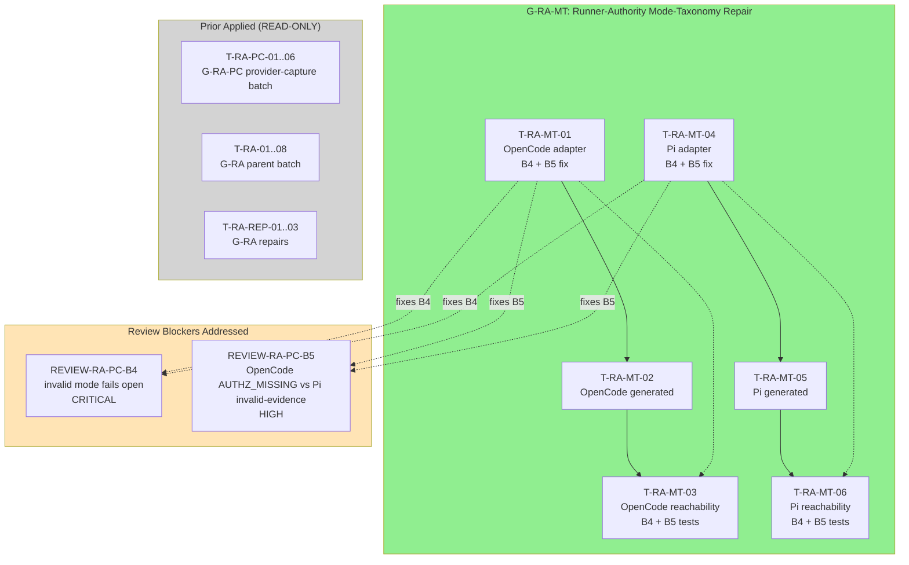

# Tasks Replan: Runner-Authority Mode-Taxonomy Repair

## Immutable PhaseResult

| Field | Value |
|---|---|
| Role | `task` |
| Instance provenance | Automatic-SDD Task specialist; non-source Task replan after Review returned REQUEST_CHANGES with two new blockers |
| Change ID | `deterministic-apply-verify-review-flow` |
| Trigger | Independent final Review returned two new blockers after provider-capture repair batch: REVIEW-RA-PC-B4 (invalid mode fails open), REVIEW-RA-PC-B5 (OpenCode AUTHZ_MISSING vs Pi invalid-evidence taxonomy mismatch) |
| Spec digest (authoritative) | `sha256:374a8fb1a155830624083829aa8ccbbe609032e6a1b4c8064169372b4bfb8d7f` |
| Design digest (authoritative) | `sha256:9850e208e6f364232c4418481e6cc99eb063a68a1afdf77db52ae703ca2e9bc1` |
| Design-replan digest | `sha256:7d389a846ca00c71c356ada41d78af4ffd0f140aa2acba431d1871611cb8306a` |
| User authority | Coordinator directive for new exact batch identity |
| Authorized writes | update `tasks.md`; update `preconditions.md`; add `tasks-replan-runner-authority-mode-taxonomy-repair.md` |
| Status | `task_replan_handoff` — Task replan complete; Apply not yet authorized |
| Action | `task_replan_handoff` — reconcile exact Tasks; do not Apply |
| Security lane | **CRITICAL** |
| Design blockers | none — Spec/Design already require fail-closed two-mode boundary and taxonomy parity |
| Required future batch | `deterministic-apply-verify-review-flow-runner-authority-mode-taxonomy-repair` |
| Apply authority | **BLOCKED** — this Task replan does not authorize Apply; a new exact user message authorizing batch identity `deterministic-apply-verify-review-flow-runner-authority-mode-taxonomy-repair` is mandatory before any modifying attempt |
| FailureManifestV1 | present below; no new findings beyond inherited Review findings B4 and B5 |
| Ordered RegistryIntentV1 values | `[]` |

## Context authority and write boundary

- **Official context:** `spec.md` (SHA-256 `374a8fb1...`), `design.md` (SHA-256 `9850e208...`), `design-replan-runner-authority.md` (SHA-256 `7d389a84...`), current `tasks.md`, current `preconditions.md`, current source/tests for both adapters, generated assets, and worktree evidence.
- **Adaptive context:** loaded and used only as advisory corroboration. OpenSpec, delegated phase authority, source, tests, and worktree evidence controlled this Task replan.
- **Write boundary honored:** no registry file, no `state.yaml`, no `events.yaml`, no other OpenSpec change, and no `runner-capability-standardization` file was modified by this Task replan.
- **No Apply:** no implementation, no regeneration, no install, no registry commit, or destructive Git operation was performed.
- **Non-source Task replan:** source files remain READ-ONLY evidence; tests are the TDD entry point.

## Official Review Blockers

### REVIEW-RA-PC-B4 — Critical: invalid mode fails open with valid provider effect

- **Severity:** Critical
- **Root cause:** `implementation`
- **Evidence:** Both OpenCode and Pi adapters do not validate that `mode` is exactly `"invocation-required"` or `"static-compatible"`. When mode is unknown, null, a random string like "unknown", an object, or any other invalid value, the adapters do not fail closed. Instead they fall through to legacy/passthrough behavior with a valid provider present, allowing effects to proceed when they should be denied.
- **Required boundary:** Mode must be validated as exactly `"invocation-required"` or `"static-compatible"` at initialization capture and after any post-init options mutation. Invalid mode (unknown, null, string other than the two valid values, object, etc.) must deny with `invalid-evidence` and zero resolver calls, zero bridge calls, zero effects. The fail-closed behavior is mandatory for both runners.
- **Owner:** `apply-backend`

### REVIEW-RA-PC-B5 — High: OpenCode/Pi taxonomy mismatch — missing receipt AUTHZ_MISSING vs invalid-evidence

- **Severity:** High
- **Root cause:** `implementation`
- **Evidence:** When a valid resolver is installed and returns a valid-looking event object that is missing required receipt fields (e.g., `receipt` is undefined, null, or missing required properties), OpenCode classifies this as `AUTHZ_MISSING` while Pi correctly returns `invalid-evidence`. This is a taxonomy parity defect: `AUTHZ_MISSING` must only mean "no resolver installed / no provider available" (absent authorization context), not "installed resolver returned malformed/missing receipt evidence".
- **Required boundary:** Installed valid resolver returning event with missing required receipt fields → `invalid-evidence` in BOTH runners. `AUTHZ_MISSING` is reserved for absent resolver (not installed in options AND not available from global). Both runners must have identical taxonomy for this case.
- **Owner:** `apply-backend`

---

## Batch Identity and Ceiling

### New candidate batch identity

`deterministic-apply-verify-review-flow-runner-authority-mode-taxonomy-repair`

### Exact 6-file ceiling

| # | File | Role | Owner |
|---|---|---|---|
| 1 | `packages/adapter-opencode/assets/opencode/plugins/developer-team-execution.ts` | OpenCode canonical adapter TS (source) | `apply-backend` |
| 2 | `packages/adapter-opencode/assets/opencode/plugins/developer-team-execution.generated.js` | OpenCode generated JS (generated) | `apply-general` |
| 3 | `packages/adapter-opencode/src/developer-team-execution-reachability.test.ts` | OpenCode reachability test (test) | `apply-backend` |
| 4 | `packages/adapter-pi/assets/pi/extensions/developer-team-execution.ts` | Pi canonical adapter TS (source) | `apply-backend` |
| 5 | `packages/adapter-pi/assets/pi/extensions/developer-team-execution.generated.js` | Pi generated JS (generated) | `apply-general` |
| 6 | `packages/adapter-pi/src/developer-team-execution-reachability.test.ts` | Pi reachability test (test) | `apply-backend` |

**No other file is authorized for this batch.** All prior applied files remain READ-ONLY evidence.

### Batch constraints

- **runner-capability-standardization:** PROHIBITED — never in any target
- **Core prompt/test and prompt-profile.test.ts:** READ-ONLY accepted evidence
- **Shared runtime/bridge/generator sources:** READ-ONLY evidence
- **apply-backend:** owns canonical TS adapter sources (T-RA-MT-01, T-RA-MT-04) and tests (T-RA-MT-03, T-RA-MT-06)
- **apply-general:** owns canonical generator invocation for both generated assets (T-RA-MT-02, T-RA-MT-05)
- **TDD rule:** new tests must RED before source changes; existing tests must remain GREEN
- **B1-B3 tests from G-RA-PC:** must remain GREEN (not modified by this batch)

---

## Task Definitions

### T-RA-MT-01: OpenCode adapter — mode validation and receipt taxonomy fix

| Field | Value |
|---|---|
| **Owner** | `apply-backend` |
| **Priority** | P0 |
| **Complexity** | C3 |
| **Parallel** | sequential (G-RA-MT) |
| **Depends on** | none |
| **Files (allowlist — source)** | `packages/adapter-opencode/assets/opencode/plugins/developer-team-execution.ts` |
| **Files (blocked** | Any other file; generated files; test files |
| **Verification** | RED: invalid-mode-at-init test fails (valid provider present but mode is unknown → should deny invalid-evidence but fails open); mutable-invalid-mode test fails; missing-receipt-from-installed-resolver test fails (AUTHZ_MISSING instead of invalid-evidence); GREEN: all three test categories pass; zero resolver/bridge/effect for invalid mode; both runners return identical taxonomy |
| **Completion evidence** | TypeScript compiles; new B4/B5 tests added to reachability file (T-RA-MT-03) |
| **Risk lane** | **CRITICAL** |
| **Rollback** | Revert to pre-T-RA-MT-01 source state |

#### B4 Fix: Mode validation — fail closed on invalid mode

The mode must be validated at capture time and after any post-init mutation. Valid values are exactly `"invocation-required"` and `"static-compatible"`. Any other value (undefined, null, random string, object, number, etc.) must deny with `invalid-evidence`.

```ts
// At factory/initialization capture — add mode validation:
const VALID_MODES = ["invocation-required", "static-compatible"];

export function createOpenCodeDeveloperTeamExecutionPluginV1(options: ...) {
  // Validate mode at capture time
  const capturedMode = options.invocationAuthorization;
  if (capturedMode !== undefined && !VALID_MODES.includes(capturedMode)) {
    // B4: invalid mode at init — fail closed
    // This plugin will deny all invocations with invalid-evidence
    return async function DeveloperTeamExecutionPlugin() {
      return {
        "tool.execute.before": async (input, output) => {
          const args = output.args;
          if (!args || typeof args !== "object") return;
          delete args.deckExecution;
          if (!applyAgent(args)) return;
          // B4: deny with invalid-evidence, zero resolver/bridge/effect
          throw new Error("invalid-evidence");
        }
      };
    };
  }

  const capturedResolveExecutionEvent = options.resolveExecutionEvent;

  return async function DeveloperTeamExecutionPlugin() {
    return {
      "tool.execute.before": async (input, output) => {
        const args = output.args;
        if (!args || typeof args !== "object") return;
        delete args.deckExecution;
        if (!applyAgent(args)) return;

        const provider = (globalThis)[HOST_CONTEXT] as ...;
        const mode = capturedMode ?? provider?.invocationAuthorization ?? "static-compatible";

        // B4: Validate mode at every invocation (handles post-init mutation)
        if (!VALID_MODES.includes(mode)) {
          throw new Error("invalid-evidence");  // deny with zero resolver/bridge/effect
        }

        // ... rest of implementation
      }
    };
  };
}
```

#### B5 Fix: Missing receipt from installed resolver → invalid-evidence (not AUTHZ_MISSING)

When a resolver IS installed (not absent) but returns an event missing required receipt fields, this is malformed evidence — not absent authorization. Both cases must currently use `invalid-evidence`:

```ts
// After resolver returns event — check for required receipt fields
if (!rawEvent || typeof rawEvent !== "object") {
  // B2/B5: installed resolver returned malformed output (null/non-object)
  if (failClosed) throw new Error("invalid-evidence");
  return;
}

// B5: Check for required receipt fields
const event = rawEvent as Record<string, unknown>;
if (typeof event.receipt !== "object" || event.receipt === null) {
  // B5: installed resolver returned event missing required receipt
  // This is invalid-evidence, NOT AUTHZ_MISSING
  if (failClosed) throw new Error("invalid-evidence");
  return;
}
```

---

### T-RA-MT-02: OpenCode generated asset — regenerate from fixed canonical source

| Field | Value |
|---|---|
| **Owner** | `apply-general` |
| **Priority** | P0 |
| **Complexity** | C1 |
| **Parallel** | sequential (G-RA-MT, after T-RA-MT-01) |
| **Depends on** | T-RA-MT-01 |
| **Files (allowlist — generated)** | `packages/adapter-opencode/assets/opencode/plugins/developer-team-execution.generated.js` |
| **Files (blocked)** | Any other file; any source file |
| **Verification** | RED: SHA-256 differs from pre-fix value; GREEN: generator exit code 0; no checkout/cwd/deck path; source digest comment updated |
| **Completion evidence** | Generated file exists at correct path; byte parity with canonical after `bun run scripts/generate-runner-execution-assets.ts` |
| **Risk lane** | **CRITICAL** |
| **Rollback** | Restore pre-T-RA-MT-02 generated file from git |

#### Generator invocation

```bash
bun run scripts/generate-runner-execution-assets.ts
```

---

### T-RA-MT-03: OpenCode reachability — B4/B5 TDD tests (RED before source)

| Field | Value |
|---|---|
| **Owner** | `apply-backend` |
| **Priority** | P0 |
| **Complexity** | C3 |
| **Parallel** | sequential (G-RA-MT, after T-RA-MT-02) |
| **Depends on** | T-RA-MT-02 |
| **Files (allowlist — test)** | `packages/adapter-opencode/src/developer-team-execution-reachability.test.ts` |
| **Files (blocked)** | Any other file; any source file |
| **Verification** | RED: new tests fail before B4/B5 source fixes; GREEN: new tests pass after fixes; all existing tests remain GREEN |
| **Completion evidence** | `bun test packages/adapter-opencode/src/developer-team-execution-reachability.test.ts` 100% pass |
| **Risk lane** | **CRITICAL** |
| **Rollback** | Revert reachability test to pre-T-RA-MT-03 state |

#### Required new tests (RED before source fix, GREEN after):

**B4 Tests — Invalid mode must deny with invalid-evidence:**

```ts
test("D-REACH-28 OpenCode unknown mode at init with valid provider denies invalid-evidence", async () => {
  // 1. Create plugin with mode: "unknown" (invalid) and valid resolver installed
  // 2. Call hook with Apply args
  // 3. Expect: invalid-evidence (NOT AUTHZ_MISSING, NOT effect)
  // 4. Verify bridgeCalls === 0, resolverCalls === 0, effects === 0
});

test("D-REACH-29 OpenCode null mode at init with valid provider denies invalid-evidence", async () => {
  // 1. Create plugin with mode: null (invalid) and valid resolver installed
  // 2. Call hook — expect: invalid-evidence
  // 3. Verify zero resolver/bridge/effect
});

test("D-REACH-30 OpenCode random string mode at init denies invalid-evidence", async () => {
  // 1. Create plugin with mode: "some-random-mode" (invalid string)
  // 2. Call hook — expect: invalid-evidence
  // 3. Verify zero resolver/bridge/effect
});

test("D-REACH-31 OpenCode object mode at init denies invalid-evidence", async () => {
  // 1. Create plugin with mode: { value: "invocation-required" } (invalid object)
  // 2. Call hook — expect: invalid-evidence
  // 3. Verify zero resolver/bridge/effect
});

test("D-REACH-32 OpenCode post-init mode mutation to invalid value denies invalid-evidence", async () => {
  // 1. Create plugin with valid mode: "static-compatible"
  // 2. Mutate options.invocationAuthorization to invalid value AFTER init
  // 3. Call hook — expect: invalid-evidence
  // 4. Verify zero resolver/bridge/effect
});

test("D-REACH-33 OpenCode invocation-required absent resolver still AUTHZ_MISSING", async () => {
  // 1. Create plugin with mode: "invocation-required" and NO resolver
  // 2. Call hook — expect: AUTHZ_MISSING (not invalid-evidence)
  // 3. Verify this is the ONLY case that yields AUTHZ_MISSING
});
```

**B5 Tests — Missing receipt from installed resolver → invalid-evidence:**

```ts
test("D-REACH-34 OpenCode installed resolver returns event without receipt field → invalid-evidence", async () => {
  // 1. Create plugin with valid resolver installed
  // 2. Resolver returns { executionId: "...", timestamp: "..." } (no receipt field)
  // 3. Call hook — expect: invalid-evidence (NOT AUTHZ_MISSING)
  // 4. Verify bridgeCalls === 0, resolverCalls === 1
});

test("D-REACH-35 OpenCode installed resolver returns event with null receipt → invalid-evidence", async () => {
  // 1. Create plugin with valid resolver installed
  // 2. Resolver returns { executionId: "...", receipt: null }
  // 3. Call hook — expect: invalid-evidence
  // 4. Verify zero effects
});

test("D-REACH-36 OpenCode installed resolver returns event with missing receipt.sig → invalid-evidence", async () => {
  // 1. Create plugin with valid resolver installed
  // 2. Resolver returns { executionId: "...", receipt: { notBefore: "..." } } (missing sig)
  // 3. Call hook — expect: invalid-evidence
  // 4. Verify zero effects
});
```

All existing tests (D-REACH-04..27, EG8-REACH-11..16) including B1-B3 tests from G-RA-PC must remain GREEN.

---

### T-RA-MT-04: Pi adapter — mode validation and receipt taxonomy fix

| Field | Value |
|---|---|
| **Owner** | `apply-backend` |
| **Priority** | P0 |
| **Complexity** | C3 |
| **Parallel** | sequential (G-RA-MT) |
| **Depends on** | none |
| **Files (allowlist — source)** | `packages/adapter-pi/assets/pi/extensions/developer-team-execution.ts` |
| **Files (blocked)** | Any other file; generated files; test files |
| **Verification** | RED: invalid-mode-at-init test fails; mutable-invalid-mode test fails; missing-receipt test fails (AUTHZ_MISSING vs invalid-evidence); GREEN: all three test categories pass; both runners return identical taxonomy |
| **Completion evidence** | TypeScript compiles; new B4/B5 tests added to reachability file (T-RA-MT-06) |
| **Risk lane** | **CRITICAL** |
| **Rollback** | Revert to pre-T-RA-MT-04 source state |

#### B4 Fix: Same pattern as OpenCode — validate mode at capture and invocation

```ts
const VALID_MODES = ["invocation-required", "static-compatible"];

export function createPiDeveloperTeamExecutionExtensionV1(options: PiDeveloperTeamExecutionExtensionOptionsV1 = {}) {
  // B4: Validate mode at capture time
  const capturedMode = options.invocationAuthorization;
  if (capturedMode !== undefined && !VALID_MODES.includes(capturedMode)) {
    // Invalid mode at init — return denying extension
    return function registerDeveloperTeamExecutionExtension(pi: PiExtensionApi) {
      pi.on("tool_call", async (event) => {
        const input = event?.input;
        if (!input || typeof input !== "object") return undefined;
        delete input.deckExecution;
        if (!applyAgent(input)) return undefined;
        // B4: deny with invalid-evidence, zero resolver/bridge/effect
        return { block: true, reason: "invalid-evidence" };
      });
    };
  }

  const capturedResolveExecutionEvent = options.resolveExecutionEvent;

  return function registerDeveloperTeamExecutionExtension(pi: PiExtensionApi) {
    pi.on("tool_call", async (event) => {
      const input = event?.input;
      if (!input || typeof input !== "object") return undefined;
      delete input.deckExecution;
      if (!applyAgent(input)) return undefined;

      const provider = (globalThis)[HOST_CONTEXT] as PiHostProviderV1 | undefined;
      const mode = capturedMode ?? provider?.invocationAuthorization ?? "static-compatible";

      // B4: Validate mode at every invocation (handles post-init mutation)
      if (!VALID_MODES.includes(mode)) {
        return { block: true, reason: "invalid-evidence" };
      }

      // ... rest of implementation
    });
  };
}
```

#### B5 Fix: Same pattern as OpenCode — check for required receipt fields

```ts
// After resolver returns event — check for required receipt fields
if (!rawEvent || typeof rawEvent !== "object") {
  if (failClosed) return { block: true, reason: "invalid-evidence" };
  return undefined;
}

const event = rawEvent as Record<string, unknown>;
// B5: installed resolver returned event missing required receipt
if (typeof event.receipt !== "object" || event.receipt === null) {
  if (failClosed) return { block: true, reason: "invalid-evidence" };
  return undefined;
}
```

---

### T-RA-MT-05: Pi generated asset — regenerate from fixed canonical source

| Field | Value |
|---|---|
| **Owner** | `apply-general` |
| **Priority** | P0 |
| **Complexity** | C1 |
| **Parallel** | sequential (G-RA-MT, after T-RA-MT-04) |
| **Depends on** | T-RA-MT-04 |
| **Files (allowlist — generated)** | `packages/adapter-pi/assets/pi/extensions/developer-team-execution.generated.js` |
| **Files (blocked)** | Any other file; any source file |
| **Verification** | RED: SHA-256 differs from pre-fix value; GREEN: generator exit code 0; no checkout/cwd/deck path; source digest comment updated |
| **Completion evidence** | Generated file exists at correct path; byte parity with canonical after `bun run scripts/generate-runner-execution-assets.ts` |
| **Risk lane** | **CRITICAL** |
| **Rollback** | Restore pre-T-RA-MT-05 generated file from git |

#### Generator invocation

```bash
bun run scripts/generate-runner-execution-assets.ts
```

Both OpenCode and Pi generated assets are produced by the same generator script.

---

### T-RA-MT-06: Pi reachability — B4/B5 TDD tests (RED before source)

| Field | Value |
|---|---|
| **Owner** | `apply-backend` |
| **Priority** | P0 |
| **Complexity** | C3 |
| **Parallel** | sequential (G-RA-MT, after T-RA-MT-05) |
| **Depends on** | T-RA-MT-05 |
| **Files (allowlist — test)** | `packages/adapter-pi/src/developer-team-execution-reachability.test.ts` |
| **Files (blocked)** | Any other file; any source file |
| **Verification** | RED: new tests fail before B4/B5 source fixes; GREEN: new tests pass after fixes; all existing tests remain GREEN |
| **Completion evidence** | `bun test packages/adapter-pi/src/developer-team-execution-reachability.test.ts` 100% pass |
| **Risk lane** | **CRITICAL** |
| **Rollback** | Revert reachability test to pre-T-RA-MT-06 state |

#### Required new tests (mirrored from OpenCode):

**B4 Tests (Pi):**
- D-REACH-28-Pi: Unknown mode at init with valid provider denies invalid-evidence
- D-REACH-29-Pi: Null mode at init denies invalid-evidence
- D-REACH-30-Pi: Random string mode at init denies invalid-evidence
- D-REACH-31-Pi: Object mode at init denies invalid-evidence
- D-REACH-32-Pi: Post-init mode mutation to invalid value denies invalid-evidence
- D-REACH-33-Pi: invocation-required absent resolver still AUTHZ_MISSING

**B5 Tests (Pi):**
- D-REACH-34-Pi: Installed resolver returns event without receipt → invalid-evidence
- D-REACH-35-Pi: Installed resolver returns event with null receipt → invalid-evidence
- D-REACH-36-Pi: Installed resolver returns event missing receipt.sig → invalid-evidence

All existing Pi tests (D-REACH-01..03, D-REACH-10, D-REACH-18..27, EG8-REACH-11..16) including B1-B3 tests from G-RA-PC must remain GREEN.

---

## Dependency Order

```
T-RA-MT-01 ──→ T-RA-MT-02 ──→ T-RA-MT-03 (OpenCode path)
    │
    └──────────────────────────┐
                               │
T-RA-MT-04 ──→ T-RA-MT-05 ──→ T-RA-MT-06 (Pi path)
```

**Parallelism:** T-RA-MT-01 and T-RA-MT-04 can run in parallel (independent adapters). T-RA-MT-02 depends on T-RA-MT-01; T-RA-MT-05 depends on T-RA-MT-04. T-RA-MT-03 and T-RA-MT-06 are sequential after their respective generated assets.

---

## Complexity Summary

| Task | Complexity | Risk |
|------|------------|------|
| T-RA-MT-01 | C3 | CRITICAL |
| T-RA-MT-02 | C1 | CRITICAL |
| T-RA-MT-03 | C3 | CRITICAL |
| T-RA-MT-04 | C3 | CRITICAL |
| T-RA-MT-05 | C1 | CRITICAL |
| T-RA-MT-06 | C3 | CRITICAL |

**G-RA-MT totals: C3×4, C1×2 = C14 across 6 tasks**

---

## RED/GREEN Check Anchors

### T-RA-MT-01 (OpenCode adapter)

| Check | Before Fix | After Fix |
|-------|-----------|-----------|
| D-REACH-28 (unknown mode) | FAIL (fails open) | PASS (invalid-evidence) |
| D-REACH-29 (null mode) | FAIL (fails open) | PASS (invalid-evidence) |
| D-REACH-30 (random string mode) | FAIL (fails open) | PASS (invalid-evidence) |
| D-REACH-31 (object mode) | FAIL (fails open) | PASS (invalid-evidence) |
| D-REACH-32 (mutable invalid mode) | FAIL (fails open) | PASS (invalid-evidence) |
| D-REACH-33 (absent resolver AUTHZ_MISSING) | PASS (existing) | PASS |
| D-REACH-34 (missing receipt) | FAIL (AUTHZ_MISSING) | PASS (invalid-evidence) |
| D-REACH-35 (null receipt) | FAIL (AUTHZ_MISSING) | PASS (invalid-evidence) |
| D-REACH-36 (missing receipt.sig) | FAIL (AUTHZ_MISSING) | PASS (invalid-evidence) |
| Existing tests | PASS | PASS |

### T-RA-MT-04 (Pi adapter)

| Check | Before Fix | After Fix |
|-------|-----------|-----------|
| D-REACH-28-Pi (unknown mode) | FAIL (fails open) | PASS (invalid-evidence) |
| D-REACH-29-Pi (null mode) | FAIL (fails open) | PASS (invalid-evidence) |
| D-REACH-30-Pi (random string mode) | FAIL (fails open) | PASS (invalid-evidence) |
| D-REACH-31-Pi (object mode) | FAIL (fails open) | PASS (invalid-evidence) |
| D-REACH-32-Pi (mutable invalid mode) | FAIL (fails open) | PASS (invalid-evidence) |
| D-REACH-33-Pi (absent resolver AUTHZ_MISSING) | PASS (existing) | PASS |
| D-REACH-34-Pi (missing receipt) | PASS (Pi already correct) | PASS (invalid-evidence) |
| D-REACH-35-Pi (null receipt) | PASS (Pi already correct) | PASS (invalid-evidence) |
| D-REACH-36-Pi (missing receipt.sig) | PASS (Pi already correct) | PASS (invalid-evidence) |
| Existing tests | PASS | PASS |

### T-RA-MT-02, T-RA-MT-05 (Generated assets)

| Check | Before Fix | After Fix |
|-------|-----------|-----------|
| SHA-256 matches pre-fix | N/A | PASS after regeneration |
| Generator exit code | N/A | 0 |
| No checkout/cwd/deck path | N/A | PASS |

### T-RA-MT-03, T-RA-MT-06 (Reachability tests)

| Check | Before Source Fix | After Source Fix |
|-------|-----------------|-----------------|
| D-REACH-28 (unknown mode) | FAIL | PASS |
| D-REACH-29 (null mode) | FAIL | PASS |
| D-REACH-30 (random string mode) | FAIL | PASS |
| D-REACH-31 (object mode) | FAIL | PASS |
| D-REACH-32 (mutable invalid mode) | FAIL | PASS |
| D-REACH-33 (absent resolver AUTHZ_MISSING) | PASS | PASS |
| D-REACH-34 (missing receipt) | FAIL | PASS |
| D-REACH-35 (null receipt) | FAIL | PASS |
| D-REACH-36 (missing receipt.sig) | FAIL | PASS |
| All existing tests | PASS | PASS |

---

## OpenCode/Pi Taxonomy Parity Matrix (After Fix)

| Scenario | OpenCode (B4/B5 fix) | Pi (B4/B5 fix) | Expected |
|---|---|---|---|
| mode = "unknown" (init) | invalid-evidence | invalid-evidence | PARITY |
| mode = null (init) | invalid-evidence | invalid-evidence | PARITY |
| mode = "random-string" (init) | invalid-evidence | invalid-evidence | PARITY |
| mode = {object} (init) | invalid-evidence | invalid-evidence | PARITY |
| mode mutation to invalid | invalid-evidence | invalid-evidence | PARITY |
| invocation-required + no resolver | AUTHZ_MISSING | AUTHZ_MISSING | PARITY |
| resolver returns event without receipt | invalid-evidence | invalid-evidence | PARITY |
| resolver returns event with null receipt | invalid-evidence | invalid-evidence | PARITY |
| resolver returns event missing receipt.sig | invalid-evidence | invalid-evidence | PARITY |

---

## Review Workload Forecast (G-RA-MT)

| Reviewer pool | Tasks requiring independent Review |
|---------------|-------------------------------------|
| `apply-backend` | T-RA-MT-01, T-RA-MT-04, T-RA-MT-03, T-RA-MT-06 — self-review + TDD verification |
| `verify` | All 6 tasks — compliance matrix |
| `review` | All 6 tasks — final acceptance |

**Total G-RA-MT reviews: 3 (apply-backend × 4 tasks, verify × 6, review × 6)**

---

## FailureManifestV1

```json
{
  "schema": "failure-manifest-v1",
  "changeId": "deterministic-apply-verify-review-flow",
  "findings": [
    {
      "findingId": "REVIEW-RA-PC-B4-INVALID-MODE-FAIL-OPEN",
      "status": "open",
      "relationship": "batch_related",
      "rootCause": "implementation",
      "disposition": "blocking",
      "severity": "critical",
      "requirementIds": [],
      "taskIds": ["T-RA-MT-01", "T-RA-MT-04", "T-RA-MT-03", "T-RA-MT-06"],
      "checkIds": [
        "review-ra-pc-b4-unknown-mode-test",
        "review-ra-pc-b4-null-mode-test",
        "review-ra-pc-b4-random-string-mode-test",
        "review-ra-pc-b4-object-mode-test",
        "review-ra-pc-b4-mutable-invalid-mode-test"
      ],
      "locationKeys": [
        "packages/adapter-opencode/assets/opencode/plugins/developer-team-execution.ts",
        "packages/adapter-pi/assets/pi/extensions/developer-team-execution.ts"
      ],
      "destination": "targeted_repair",
      "owner": "apply"
    },
    {
      "findingId": "REVIEW-RA-PC-B5-OPENCODExPI-TAXONOMY-MISMATCH",
      "status": "open",
      "relationship": "batch_related",
      "rootCause": "implementation",
      "disposition": "blocking",
      "severity": "high",
      "requirementIds": [],
      "taskIds": ["T-RA-MT-01", "T-RA-MT-04", "T-RA-MT-03", "T-RA-MT-06"],
      "checkIds": [
        "review-ra-pc-b5-missing-receipt-field-test",
        "review-ra-pc-b5-null-receipt-test",
        "review-ra-pc-b5-missing-receipt-sig-test"
      ],
      "locationKeys": [
        "packages/adapter-opencode/assets/opencode/plugins/developer-team-execution.ts",
        "packages/adapter-pi/assets/pi/extensions/developer-team-execution.ts"
      ],
      "destination": "targeted_repair",
      "owner": "apply"
    }
  ]
}
```

---

## RegistryIntentV1

```json
[]
```

No intent emitted by this bounded Task replan.

---

## Authorization Gate

**Apply is NOT authorized by this Task replan.**

A new **exact user message** authorizing batch identity `deterministic-apply-verify-review-flow-runner-authority-mode-taxonomy-repair` is mandatory before any modifying attempt. The message must contain the exact batch identity string.

---

## Open Questions / Blockers

### Classified as Blockers to Apply (not to Tasks)

- **Missing exact user authorization** for batch identity `deterministic-apply-verify-review-flow-runner-authority-mode-taxonomy-repair`
- **Spec SHA-256 drift** from `374a8fb1...`
- **Design SHA-256 drift** from `9850e208...`
- **Design-replan SHA-256 drift** from `7d389a84...`
- **Worktree state** — must confirm clean before Apply

### Classified as blockers to Apply that are ALSO addressed by this replan

- REVIEW-RA-PC-B4: addressed by T-RA-MT-01, T-RA-MT-04, T-RA-MT-03, T-RA-MT-06
- REVIEW-RA-PC-B5: addressed by T-RA-MT-01, T-RA-MT-04, T-RA-MT-03, T-RA-MT-06

---

## Mermaid Summary



---

## Decisions, Tradeoffs, Alternatives

### Why validate mode at both init capture AND every invocation

The B1 fix (from G-RA-PC) captures resolver and mode at initialization. However, B4 requires that post-init mutation of the options object to an invalid mode value also fails closed. Validating only at capture time would leave a gap where mutable options are changed after plugin creation. Validating at every hook invocation ensures that any post-init mutation is caught.

### Why invalid mode yields invalid-evidence (not AUTHZ_MISSING)

`AUTHZ_MISSING` is reserved for the specific case where no resolver is installed and no provider is available. Invalid mode is a different category: an authorization context exists (a provider is present) but the mode value is malformed. This is evidence malformation, not missing authorization.

### Why B5 fix requires OpenCode change when Pi already returns invalid-evidence

Pi already correctly returns `invalid-evidence` for missing receipt. The B5 finding is that OpenCode incorrectly returns `AUTHZ_MISSING` for this case. The taxonomy mismatch must be fixed in OpenCode to achieve parity. Pi source code is unchanged but benefits from the test coverage confirming correct behavior.

### Why this is not repair-N

This is a new batch addressing new blockers discovered by independent final Review after the provider-capture repair batch. The prior G-RA-PC batch addressed B1, B2, B3. This batch addresses two new findings (B4, B5) from a subsequent independent Review. Using a new batch identity distinguishes this work from the prior G-RA-PC lineage.

### Scope proof

- **Files touched:** exactly 6 (2 canonical TS + 2 generated JS + 2 test files)
- **Source changes:** only the 2 canonical adapter TS files
- **Test changes:** only the 2 reachability test files (additions only; no existing test modified)
- **Generated:** only the 2 generated JS files (regenerated, not edited)
- **No other file touched:** no core prompt, no prompt-profile, no registry YAML, no state/events
- **B1-B3 tests preserved:** all tests from G-RA-PC remain GREEN

---

## Verification Schedule (Fresh after fix)

1. **Targeted**: B4 and B5 tests individually pass for both OpenCode and Pi
2. **Affected-area**: Both reachability test files pass 100%; TypeScript compiles for both adapters
3. **Independent Review**: fresh reviewer validates mode validation logic and taxonomy parity between runners
4. **Broad**: repository-wide TypeScript compile; no regression in any adapter, prompt, or integration tests
