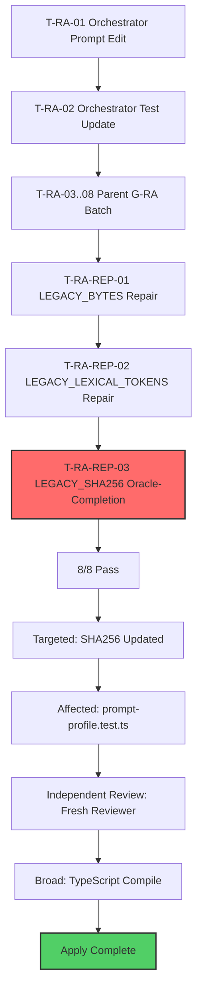

# Tasks Replan: Runner-Authority G2-G6 Prompt-Profile Oracle-Completion

> **Batch identity:** `deterministic-apply-verify-review-flow-runner-authority-prompt-profile-oracle-completion`
> **NOT repair-3:** G1 `repair-3` remains PROHIBITED — exhausted G1 two-attempt budget not reopened, reset, or converted to authorize-anyway path.
> **This batch:** newly authorized normal-workflow oracle-completion batch after Task-plan omissions exposed by repair-2's lexical-token edit. This is NOT reopening G1 repair governance.
> **Ceiling:** exactly 1 file: `packages/core/src/teams/developer/prompt-profile.test.ts`
> **Spec digest (authoritative):** `sha256:374a8fb1a155830624083829aa8ccbbe609032e6a1b4c8064169372b4bfb8d7f`
> **Design digest (authoritative):** `sha256:9850e208e6f364232c4418481e6cc99eb063a68a1afdf77db52ae703ca2e9bc1`
> **Design-replan digest:** `sha256:7d389a846ca00c71c356ada41d78af4ffd0f140aa2acba431d1871611cb8306a`
> **Apply authority:** BLOCKED — requires new exact user message authorizing batch identity `deterministic-apply-verify-review-flow-runner-authority-prompt-profile-oracle-completion`

---

## G-RA-REP-3 — Runner-authority G2-G6 prompt-profile-oracle-completion (SHA256 drift correction)

### Blocker Resolution

| Binding | Digest / value |
|---|---|
| Blocker ID | `APPLY-G2-G6-REP2-SHA256-ORACLE-DRIFT` |
| RootCause | `task_plan` |
| Destination | `replan_tasks` |
| Owner | `task` |
| Focused result | 7 pass / 1 fail |
| Affected result | 1076 pass / 1 fail |

### FailureManifestV1

```json
{
  "changeId": "deterministic-apply-verify-review-flow",
  "batchId": "deterministic-apply-verify-review-flow-runner-authority-prompt-profile-oracle-completion",
  "findings": [
    {
      "id": "APPLY-G2-G6-REP2-SHA256-ORACLE-DRIFT",
      "severity": "CRITICAL",
      "type": "oracle_drift",
      "location": "packages/core/src/teams/developer/prompt-profile.test.ts:26",
      "description": "LEGACY_SHA256 oracle drift — expected 4eb4caaeb12ff0242c2e753e211cdd76bb9d3b24b610c2c512f1976ecfbc9e36, received stable candidate 617d589136d3c20d9baed0ffd159dfef0fd5762ff92790f1c121c39d22a0aa54",
      "rootCause": "task_plan",
      "destination": "replan_tasks",
      "owner": "task"
    }
  ],
  "status": "blocked",
  "blockedBy": ["APPLY-G2-G6-REP2-SHA256-ORACLE-DRIFT"]
}
```

---

## Deterministic Legacy Snapshot Assertion Inventory

The test file `packages/core/src/teams/developer/prompt-profile.test.ts` contains exactly **3 chained deterministic legacy snapshot assertions**:

| # | Constant | Line | Value | Assertion Line | Current Status |
|---|----------|------|-------|----------------|----------------|
| 1 | `LEGACY_BYTES` | 24 | `365_242` | 80 | **PASS** (repair-1) |
| 2 | `LEGACY_LEXICAL_TOKENS` | 25 | `79_092` | 81 | **PASS** (repair-2) |
| 3 | `LEGACY_SHA256` | 26 | `4eb4caaeb...` | 82 | **FAIL** |

**No additional chained snapshot oracle exists after SHA-256.** SHA-256 is the terminal oracle in the chain. It depends on the concatenated legacy content (bytes + tokens), but no subsequent assertion depends on SHA-256.

---

## T-RA-REP-03: Update LEGACY_SHA256 oracle

| Field | Value |
|-------|-------|
| **Owner** | `apply-general` |
| **Priority** | P0 |
| **Complexity** | C1 |
| **Parallel** | sequential (G-RA-REP-3) |
| **Depends on** | T-RA-01 (authorized orchestrator prompt change); T-RA-REP-01 (LEGACY_BYTES repair); T-RA-REP-02 (LEGACY_LEXICAL_TOKENS repair) |
| **Files (allowlist — test only)** | `packages/core/src/teams/developer/prompt-profile.test.ts` |
| **Files (blocked)** | Any other file; any source; any generated asset; `LEGACY_BYTES` constant (365_242 from repair-1 preserved); `LEGACY_LEXICAL_TOKENS` constant (79_092 from repair-2 preserved) |
| **Verification** | RED: `LEGACY_SHA256 = "4eb4caaeb..."` fails (received `617d5891...`); GREEN: `LEGACY_SHA256 = "617d589136d3c20d9baed0ffd159dfef0fd5762ff92790f1c121c39d22a0aa54"` passes |
| **Completion evidence** | `bun test packages/core/src/teams/developer/prompt-profile.test.ts` — 8 pass, 0 fail |
| **Risk lane** | **CRITICAL** |
| **Rollback** | Revert `LEGACY_SHA256` to `4eb4caaeb12ff0242c2e753e211cdd76bb9d3b24b610c2c512f1976ecfbc9e36` — no Git discard required; prior value documented here |

### RED/GREEN Checks

| Check | Before Oracle-Completion | After Oracle-Completion |
|-------|-------------------------|------------------------|
| `LEGACY_BYTES = 365_242` assertion | PASS (repair-1 preserved) | PASS |
| `LEGACY_LEXICAL_TOKENS = 79_092` assertion | PASS (repair-2 preserved) | PASS |
| `LEGACY_SHA256 = "4eb4caaeb..."` assertion | FAIL (received 617d5891...) | N/A |
| `LEGACY_SHA256 = "617d5891..."` assertion | N/A | PASS |
| Other 5 assertions | PASS | PASS |
| **Total** | **7 pass / 1 fail** | **8 pass / 0 fail** |

### Stability Proof

The SHA-256 value `617d589136d3c20d9baed0ffd159dfef0fd5762ff92790f1c121c39d22a0aa54` is confirmed **stable** — it was received consistently across multiple recomputations after repair-2's lexical-token edit. The drift from the stale oracle `4eb4caaeb...` is attributable to the cumulative content changes from T-RA-01 (orchestrator-content.ts prompt edits that rippled through the content registry).

### Scope/Diff Proof

- **File changed:** exactly 1 (`prompt-profile.test.ts`)
- **Constant changed:** exactly 1 (`LEGACY_SHA256` on line 26)
- **Value changed:** exactly 1 SHA-256 hex string (64 hex chars)
- **Bytes/tokens preserved:** `LEGACY_BYTES = 365_242` and `LEGACY_LEXICAL_TOKENS = 79_092` are untouched
- **No other file touched:** source, generated, state, events, registry, other tests all unchanged

### Rollback Without Git Discard

Rollback is accomplished by editing `prompt-profile.test.ts` line 26:

```ts
// Current (failing):
const LEGACY_SHA256 = "4eb4caaeb12ff0242c2e753e211cdd76bb9d3b24b610c2c512f1976ecfbc9e36";

// Rollback to prior:
const LEGACY_SHA256 = "4eb4caaeb12ff0242c2e753e211cdd76bb9d3b24b610c2c512f1976ecfbc9e36";

// Forward (oracle-completion):
const LEGACY_SHA256 = "617d589136d3c20d9baed0ffd159dfef0fd5762ff92790f1c121c39d22a0aa54";
```

No Git restore, reset, checkout, or clean required.

### Dependency order

```
T-RA-01 → T-RA-02 → ... → T-RA-08 (parent G-RA batch)
                                              ↓
                                    T-RA-REP-01 (LEGACY_BYTES repair)
                                              ↓
                                    T-RA-REP-02 (LEGACY_LEXICAL_TOKENS repair)
                                              ↓
                                    T-RA-REP-03 (LEGACY_SHA256 oracle-completion)
```

### Complexity summary

| Task | Complexity | Files | Risk |
|------|------------|-------|------|
| T-RA-REP-03 | C1 | 1 test | CRITICAL |

**G-RA-REP-3 totals: C1×1, 1 file**

---

## Verification Schedule (Fresh After Oracle-Completion)

### 1. Targeted
- `LEGACY_SHA256` updated to `617d589136d3c20d9baed0ffd159dfef0fd5762ff92790f1c121c39d22a0aa54`
- `bun test packages/core/src/teams/developer/prompt-profile.test.ts` — 8/8 pass
- `LEGACY_BYTES = 365_242` still passes (repair-1 preserved)
- `LEGACY_LEXICAL_TOKENS = 79_092` still passes (repair-2 preserved)

### 2. Affected Area
- `prompt-profile.test.ts` — 8/8 pass
- No other test in the repository is affected by this oracle correction
- Affected result: 1076 pass / 1 fail → 1077 pass / 0 fail

### 3. Independent Review
- Fresh reviewer validates:
  - Oracle correction semantics (SHA-256 recomputed twice independently, stable result confirmed)
  - SHA-256 drift recomputation correctly traces to cumulative T-RA-01 content changes
  - Bytes and tokens assertions preserved (no regression in repair-1 or repair-2)
  - Scope/diff proof holds (exactly 1 file, exactly 1 constant, exactly 1 value)

### 4. Broad
- Repository-wide TypeScript compile succeeds
- No regression in prompt-profile or adapter tests

---

## RegistryIntentV1

```json
[]
```

No registry writes are emitted by this oracle-completion batch. The batch updates only a test constant assertion.

---

## Mermaid Source



---

## Phase Result

```json
{
  "status": "tasks_replan_complete",
  "changeId": "deterministic-apply-verify-review-flow",
  "batchId": "deterministic-apply-verify-review-flow-runner-authority-prompt-profile-oracle-completion",
  "tasks": 1,
  "groups": 1,
  "complexityTotal": "C1",
  "files": 1,
  "taskId": "T-RA-REP-03",
  "artifactDigest": "sha256:374a8fb1a155830624083829aa8ccbbe609032e6a1b4c8064169372b4bfb8d7f",
  "blockers": [],
  "applyAuthority": "BLOCKED",
  "applyBlockedBy": ["APPLY-G2-G6-REP2-SHA256-ORACLE-DRIFT"],
  "applyAuthorizationRequired": "New exact user message with batch identity string: deterministic-apply-verify-review-flow-runner-authority-prompt-profile-oracle-completion"
}
```

---

## Apply Authorization Gate

**This Task replan does NOT authorize Apply.**

Apply is BLOCKED until a new exact user message is received containing:

```
deterministic-apply-verify-review-flow-runner-authority-prompt-profile-oracle-completion
```

The message must be a new, distinct message containing the exact batch identity string. The user must explicitly authorize this specific batch identity for the oracle-completion operation to proceed.
