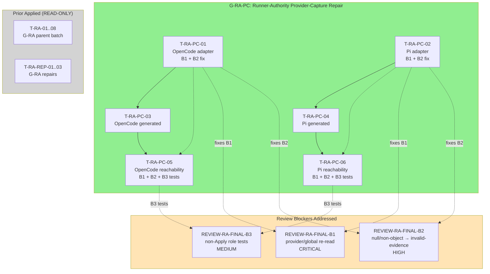

# Tasks Replan: Runner-Authority Provider-Capture Repair

## Immutable PhaseResult

| Field | Value |
|---|---|
| Role | `task` |
| Instance provenance | Automatic-SDD Task specialist; non-source Task replan after Review returned REQUEST_CHANGES |
| Change ID | `deterministic-apply-verify-review-flow` |
| Trigger | Independent final Review returned REQUEST_CHANGES with three blockers: REVIEW-RA-FINAL-B1 (provider/global options reread), REVIEW-RA-FINAL-B2 (installed resolver returning null/non-object), REVIEW-RA-FINAL-B3 (non-Apply role tests missing) |
| Reviewed diff digest | `sha256:381f4d9484617040b24af1701ca39c7b8f5b457e5f02530ecc426b4b8d8ae241` |
| Review decision digest | `sha256:5200c52dae48d371e69b51a6f84fd121293215092c6e1e26af0714678256fba1` |
| Verify evidence digest | `sha256:05f2c489d40ec957090fe32602e522dd0c7b8efabc24c653a151403ba9eabe36` |
| Verify decision digest | `sha256:59b5bb5fefb54696ceaa609305e06c761ef1377297137053ce9d0b1e1bf5a59f` |
| User authority | Coordinator directive for new exact batch identity |
| Authorized writes | update `tasks.md`; update `preconditions.md`; add `tasks-replan-runner-authority-provider-capture-repair.md` |
| Status | `task_replan_handoff` — Task replan complete; Apply not yet authorized |
| Action | `task_replan_handoff` — reconcile exact Tasks; do not Apply |
| Security lane | **CRITICAL** |
| Design blockers | none — Spec/Design already require these boundaries |
| Required future batch | `deterministic-apply-verify-review-flow-runner-authority-provider-capture-repair` |
| Apply authority | **BLOCKED** — this Task replan does not authorize Apply; a new exact user message authorizing batch identity `deterministic-apply-verify-review-flow-runner-authority-provider-capture-repair` is mandatory before any modifying attempt |
| FailureManifestV1 | present below; no new Task finding beyond inherited Review findings |
| Ordered RegistryIntentV1 values | `[]` |

## Context authority and write boundary

- **Official context:** `spec.md` (SHA-256 `374a8fb1...`), `design.md` (SHA-256 `9850e208...`), `design-replan-runner-authority.md` (SHA-256 `7d389a84...`), current `tasks.md`, current `preconditions.md`, current source/tests for both adapters, generated assets, and worktree evidence.
- **Adaptive context:** loaded and used only as advisory corroboration. OpenSpec, delegated phase authority, source, tests, and worktree evidence controlled this Task replan.
- **Write boundary honored:** no registry file, no `state.yaml`, no `events.yaml`, no other OpenSpec change, and no `runner-capability-standardization` file was modified by this Task replan.
- **No Apply:** no implementation, no regeneration, no install, no registry commit, or destructive Git operation was performed.
- **Non-source Task replan:** source files remain READ-ONLY evidence; tests are the TDD entry point.

## Official Review Blockers

### REVIEW-RA-FINAL-B1 — Critical: provider/global options reread during Apply; late provider installation authorizes effects

- **Severity:** Critical
- **Root cause:** `implementation`
- **Evidence:** Both OpenCode and Pi adapters read `provider` from `globalThis[HOST_CONTEXT]` and re-evaluate `options.invocationAuthorization`, `options.resolveExecutionEvent`, and `provider.*` at each hook invocation. Late global installation (after plugin/extension creation) and post-init mutation of options object can alter or authorize mode/effects.
- **Required boundary:** Capture resolver and mode exactly once from trusted factory/global at plugin/extension initialization before hook exposure. Mutation after initialization must have no effect. Late global installation must not authorize or alter mode.
- **Owner:** `apply-backend`

### REVIEW-RA-FINAL-B2 — High: installed resolver returning null/non-object is malformed evidence

- **Severity:** High
- **Root cause:** `implementation`
- **Evidence:** When `resolveExecutionEvent` is installed (via options or global) but returns null/undefined or a non-object value, the current code throws `modification-not-authorized:AUTHZ_MISSING`. This conflates "resolver not installed" with "installed resolver returned malformed output." `AUTHZ_MISSING` must be reserved for absent provider/invocation context only.
- **Required boundary:** Installed resolver returning null/non-object is malformed evidence → `invalid-evidence`. `AUTHZ_MISSING` only when resolver is truly absent (not installed in options AND not available from global).
- **Owner:** `apply-backend`

### REVIEW-RA-FINAL-B3 — Medium: non-Apply role tests proving caller deckExecution is stripped, provider not called, zero bridge/effect

- **Severity:** Medium
- **Root cause:** `task_plan` (oracle gap)
- **Evidence:** No explicit tests verify that for non-Apply roles (verify, review, etc.), caller-supplied `deckExecution` is deleted before role check, provider is not called, bridge count is zero, and zero effects reach downstream. Existing tests cover Apply roles but not non-Apply roles.
- **Required boundary:** Add explicit non-Apply role tests for both OpenCode and Pi runners proving: caller `deckExecution` stripped before any provider/provider lookup, provider never called, zero bridge calls, zero effects, and no specialist leakage.
- **Owner:** `apply-backend`

---

## Batch Identity and Ceiling

### New candidate batch identity

`deterministic-apply-verify-review-flow-runner-authority-provider-capture-repair`

### Exact 6-file ceiling

| # | File | Role | Owner |
|---|---|---|---|
| 1 | `packages/adapter-opencode/assets/opencode/plugins/developer-team-execution.ts` | OpenCode canonical adapter TS (source) | `apply-backend` |
| 2 | `packages/adapter-opencode/assets/opencode/plugins/developer-team-execution.generated.js` | OpenCode generated JS (generated) | `apply-general` |
| 3 | `packages/adapter-opencode/src/developer-team-execution-reachability.test.ts` | OpenCode reachability test (test) | `apply-backend` |
| 4 | `packages/adapter-pi/assets/pi/extensions/developer-team-execution.ts` | Pi canonical adapter TS (source) | `apply-backend` |
| 5 | `packages/adapter-pi/assets/pi/extensions/developer-team-execution.generated.js` | Pi generated JS (generated) | `apply-general` |
| 6 | `packages/adapter-pi/src/developer-team-execution-reachability.test.ts` | Pi reachability test (test) | `apply-backend` |

**No other file is authorized for this batch.** All prior applied files remain READ-ONLY evidence.

### Batch constraints

- **runner-capability-standardization:** PROHIBITED — never in any target
- **Core prompt/test and prompt-profile.test.ts:** READ-ONLY accepted evidence
- **Shared runtime/bridge/generator sources:** READ-ONLY evidence
- **apply-backend:** owns canonical TS adapter sources (T-RA-PC-01, T-RA-PC-04) and mirrored tests (T-RA-PC-03, T-RA-PC-06)
- **apply-general:** owns canonical generator invocation for both generated assets (T-RA-PC-02, T-RA-PC-05)
- **TDD rule:** new tests must RED before source changes; existing tests must remain GREEN

---

## Task Definitions

### T-RA-PC-01: OpenCode adapter — freeze resolver/mode at init, fix invalid-evidence taxonomy

| Field | Value |
|---|---|
| **Owner** | `apply-backend` |
| **Priority** | P0 |
| **Complexity** | C3 |
| **Parallel** | sequential (G-RA-PC) |
| **Depends on** | none |
| **Files (allowlist — source)** | `packages/adapter-opencode/assets/opencode/plugins/developer-team-execution.ts` |
| **Files (blocked)** | Any other file; generated files; test files |
| **Verification** | RED: late-global-provider test fails (provider re-read allows late install to authorize); GREEN: late-global-provider test passes; mutable-options test passes; B2 test passes |
| **Completion evidence** | TypeScript compiles; new B1/B2/B3 tests added to reachability file (T-RA-PC-03) |
| **Risk lane** | **CRITICAL** |
| **Rollback** | Revert to pre-T-RA-PC-01 source state |

#### B1 Fix: Capture resolver and mode at initialization

Move capture from hook execution to factory:

```ts
// CURRENT (re-reads at each hook invocation):
export function createOpenCodeDeveloperTeamExecutionPluginV1(options: ...) {
  return async function DeveloperTeamExecutionPlugin() {
    return {
      "tool.execute.before": async (input, output) => {
        // RE-READ each time - allows late global install
        const provider = (globalThis)[HOST_CONTEXT] as ...;
        const mode = options.invocationAuthorization ?? provider?.invocationAuthorization ?? "static-compatible";
        const resolveExecutionEvent = options.resolveExecutionEvent ?? provider?.resolveOpenCode;
        // ...
      }
    }
  }
}

// FIXED (captured once at init, frozen):
export function createOpenCodeDeveloperTeamExecutionPluginV1(options: ...) {
  // Captured ONCE at factory call — not re-read during hook
   const capturedMode = options.invocationAuthorization;
   const capturedResolveExecutionEvent = options.resolveExecutionEvent;

   return async function DeveloperTeamExecutionPlugin() {

    return {
      "tool.execute.before": async (input, output) => {
        const args = output.args;
        if (!args || typeof args !== "object") return;
        delete args.deckExecution;  // B3: strip BEFORE role check
        if (!applyAgent(args)) return;  // B3: non-Apply returns here
        const provider = (globalThis)[HOST_CONTEXT] as ...;
        // B1: Use captured, not re-read. Global only used as fallback source at init time.
        const mode = capturedMode ?? provider?.invocationAuthorization ?? "static-compatible";
        const resolveExecutionEvent = capturedResolveExecutionEvent ?? provider?.resolveOpenCode;
        // ...
      }
    }
  }
}
```

#### B2 Fix: invalid-evidence for installed resolver returning null/non-object

```ts
// CURRENT (conflates absent-resolver with malformed-result):
if (!resolveExecutionEvent) {
  if (failClosed) throw new Error("modification-not-authorized:AUTHZ_MISSING");
  return;
}
let rawEvent: unknown;
try {
  rawEvent = await resolveExecutionEvent(input, Object.freeze({ ...args }));
} catch {
  if (failClosed) throw new Error("invalid-evidence");  // provider threw
  return;
}
if (!rawEvent || typeof rawEvent !== "object") {  // <-- B2: installed but returned null/non-object
  if (failClosed) throw new Error("modification-not-authorized:AUTHZ_MISSING");  // WRONG: should be invalid-evidence
  return;
}

// FIXED:
if (!resolveExecutionEvent) {
  if (failClosed) throw new Error("modification-not-authorized:AUTHZ_MISSING");
  return;
}
let rawEvent: unknown;
try {
  rawEvent = await resolveExecutionEvent(input, Object.freeze({ ...args }));
} catch {
  if (failClosed) throw new Error("invalid-evidence");
  return;
}
if (!rawEvent || typeof rawEvent !== "object") {
  // B2: resolver was INSTALLED (not absent) but returned malformed output
  if (failClosed) throw new Error("invalid-evidence");  // AUTHZ_MISSING only for absent resolver
  return;
}
```

#### B3 Fix: Non-Apply roles already strip deckExecution — confirmed correct

The current code at lines 91-92 correctly strips and returns early for non-Apply:
```ts
delete args.deckExecution;
if (!applyAgent(args)) return;
```
This is already correct. The gap is missing test coverage (T-RA-PC-03).

---

### T-RA-PC-02: Pi adapter — freeze resolver/mode at init, fix invalid-evidence taxonomy

| Field | Value |
|---|---|
| **Owner** | `apply-backend` |
| **Priority** | P0 |
| **Complexity** | C3 |
| **Parallel** | sequential (G-RA-PC) |
| **Depends on** | none |
| **Files (allowlist — source)** | `packages/adapter-pi/assets/pi/extensions/developer-team-execution.ts` |
| **Files (blocked)** | Any other file; generated files; test files |
| **Verification** | RED: late-global-provider test fails; GREEN: late-global-provider test passes; B2 test passes |
| **Completion evidence** | TypeScript compiles; new B1/B2/B3 tests added to Pi reachability file (T-RA-PC-06) |
| **Risk lane** | **CRITICAL** |
| **Rollback** | Revert to pre-T-RA-PC-02 source state |

#### B1 Fix: Same pattern as OpenCode — capture at init in factory

```ts
export function createPiDeveloperTeamExecutionExtensionV1(options: PiDeveloperTeamExecutionExtensionOptionsV1 = {}) {
  // Captured ONCE at factory call
   const capturedMode = options.invocationAuthorization;
   const capturedResolveExecutionEvent = options.resolveExecutionEvent;

   return function registerDeveloperTeamExecutionExtension(pi: PiExtensionApi) {

    pi.on("tool_call", async (event) => {
      const input = event?.input;
      if (!input || typeof input !== "object") return undefined;
      delete input.deckExecution;  // B3: strip BEFORE role check
      if (!applyAgent(input)) return undefined;  // B3: non-Apply returns here
      const provider = (globalThis)[HOST_CONTEXT] as PiHostProviderV1 | undefined;
      // B1: Use captured values — not re-read
      const mode = capturedMode ?? provider?.invocationAuthorization ?? "static-compatible";
      const resolveExecutionEvent = capturedResolveExecutionEvent ?? provider?.resolveOpenCode;
      // ...
    });
  };
}
```

#### B2 Fix: Same pattern as OpenCode — AUTHZ_MISSING only for absent resolver

```ts
// Current (lines 109-113): conflates absent resolver with malformed result
// Fix: throw invalid-evidence when resolver installed but returns null/non-object
if (!rawEvent || typeof rawEvent !== "object") {
  // B2: installed resolver returned malformed output
  if (failClosed) return { block: true, reason: "invalid-evidence" };  // NOT AUTHZ_MISSING
  return undefined;
}
```

#### B3 Fix: Non-Apply roles already strip deckExecution — confirmed correct

Lines 90-91 in Pi adapter:
```ts
delete input.deckExecution;
if (!applyAgent(input)) return undefined;
```
Already correct. Gap is missing test coverage (T-RA-PC-06).

---

### T-RA-PC-03: OpenCode generated asset — regenerate from fixed canonical source

| Field | Value |
|---|---|
| **Owner** | `apply-general` |
| **Priority** | P0 |
| **Complexity** | C1 |
| **Parallel** | sequential (G-RA-PC, after T-RA-PC-01) |
| **Depends on** | T-RA-PC-01 |
| **Files (allowlist — generated)** | `packages/adapter-opencode/assets/opencode/plugins/developer-team-execution.generated.js` |
| **Files (blocked)** | Any other file; any source file |
| **Verification** | RED: SHA-256 differs from pre-fix value; GREEN: generator exit code 0; no checkout/cwd/deck path; source digest comment updated |
| **Completion evidence** | Generated file exists at correct path; byte parity with canonical after `bun run scripts/generate-runner-execution-assets.ts` |
| **Risk lane** | **CRITICAL** |
| **Rollback** | Restore pre-T-RA-PC-03 generated file from git |

#### Generator invocation

```bash
bun run scripts/generate-runner-execution-assets.ts
```

---

### T-RA-PC-04: Pi generated asset — regenerate from fixed canonical source

| Field | Value |
|---|---|
| **Owner** | `apply-general` |
| **Priority** | P0 |
| **Complexity** | C1 |
| **Parallel** | sequential (G-RA-PC, after T-RA-PC-02) |
| **Depends on** | T-RA-PC-02 |
| **Files (allowlist — generated)** | `packages/adapter-pi/assets/pi/extensions/developer-team-execution.generated.js` |
| **Files (blocked)** | Any other file; any source file |
| **Verification** | RED: SHA-256 differs from pre-fix value; GREEN: generator exit code 0; no checkout/cwd/deck path; source digest comment updated |
| **Completion evidence** | Generated file exists at correct path; byte parity with canonical after `bun run scripts/generate-runner-execution-assets.ts` |
| **Risk lane** | **CRITICAL** |
| **Rollback** | Restore pre-T-RA-PC-04 generated file from git |

#### Generator invocation

```bash
bun run scripts/generate-runner-execution-assets.ts
```

Both OpenCode and Pi generated assets are produced by the same generator script.

---

### T-RA-PC-05: OpenCode reachability — B1/B2/B3 TDD tests (RED before source)

| Field | Value |
|---|---|
| **Owner** | `apply-backend` |
| **Priority** | P0 |
| **Complexity** | C3 |
| **Parallel** | sequential (G-RA-PC, after T-RA-PC-03) |
| **Depends on** | T-RA-PC-03 |
| **Files (allowlist — test)** | `packages/adapter-opencode/src/developer-team-execution-reachability.test.ts` |
| **Files (blocked)** | Any other file; any source file |
| **Verification** | RED: new tests fail before B1/B2 source fixes; GREEN: new tests pass after fixes; all existing tests remain GREEN |
| **Completion evidence** | `bun test packages/adapter-opencode/src/developer-team-execution-reachability.test.ts` 100% pass |
| **Risk lane** | **CRITICAL** |
| **Rollback** | Revert reachability test to pre-T-RA-PC-05 state |

#### Required new tests (RED before source fix, GREEN after):

**B1 Tests (late global provider + mutable options):**

```ts
test("D-REACH-22 OpenCode plugin captures resolver at init; late global installation has no effect", async () => {
  // 1. Create plugin WITHOUT resolver
  // 2. Call hook with Apply args — expect AUTHZ_MISSING
  // 3. Install resolver in globalThis AFTER plugin creation
  // 4. Call hook with Apply args — must STILL expect AUTHZ_MISSING
  // 5. Verify bridgeCalls === 0 throughout
});

test("D-REACH-23 OpenCode plugin captures mode at init; post-init options mutation has no effect", async () => {
  // 1. Create plugin with invocationAuthorization: "static-compatible"
  // 2. Mutate options.invocationAuthorization to "invocation-required" AFTER creation
  // 3. Call hook without provider — behavior must reflect original "static-compatible" (no throw)
  // 4. Verify post-init mutation did not change mode
});
```

**B2 Tests (installed resolver returning null/non-object):**

```ts
test("D-REACH-24 OpenCode installed resolver returning null yields invalid-evidence in invocation-required", async () => {
  // 1. Create plugin WITH resolver installed (via options)
  // 2. Resolver returns null
  // 3. Call hook — expect invalid-evidence (NOT AUTHZ_MISSING)
  // 4. Verify bridgeCalls === 0
});

test("D-REACH-25 OpenCode installed resolver returning non-object yields invalid-evidence in invocation-required", async () => {
  // 1. Create plugin WITH resolver installed
  // 2. Resolver returns a string (non-object)
  // 3. Call hook — expect invalid-evidence
  // 4. Verify bridgeCalls === 0
});
```

**B3 Tests (non-Apply role stripping):**

```ts
test("D-REACH-26 OpenCode non-Apply role strips caller deckExecution, provider not called, zero bridge", async () => {
  // 1. Create plugin with resolver installed
  // 2. Call hook with non-Apply role (e.g., "verify-general")
  // 3. deckExecution in args — must be deleted before role check
  // 4. Provider must NOT be called (resolverCalls === 0)
  // 5. Bridge must NOT be called (bridgeCalls === 0)
  // 6. No effects reach downstream
});

test("D-REACH-27 OpenCode non-Apply role preserves zero bridge/effect even when caller provides deckExecution", async () => {
  // 1. Create plugin with resolver installed
  // 2. Call hook with non-Apply role AND deckExecution present
  // 3. deckExecution must be stripped
  // 4. Resolver not called, bridge not called
  // 5. Hook returns without error or effect
});
```

All existing tests (D-REACH-04..21, EG8-REACH-11..16) must remain GREEN.

---

### T-RA-PC-06: Pi reachability — B1/B2/B3 TDD tests (RED before source)

| Field | Value |
|---|---|
| **Owner** | `apply-backend` |
| **Priority** | P0 |
| **Complexity** | C3 |
| **Parallel** | sequential (G-RA-PC, after T-RA-PC-04) |
| **Depends on** | T-RA-PC-04 |
| **Files (allowlist — test)** | `packages/adapter-pi/src/developer-team-execution-reachability.test.ts` |
| **Files (blocked)** | Any other file; any source file |
| **Verification** | RED: new tests fail before B1/B2 source fixes; GREEN: new tests pass after fixes; all existing tests remain GREEN |
| **Completion evidence** | `bun test packages/adapter-pi/src/developer-team-execution-reachability.test.ts` 100% pass |
| **Risk lane** | **CRITICAL** |
| **Rollback** | Revert reachability test to pre-T-RA-PC-06 state |

#### Required new tests (mirrored from OpenCode):

**B1 Tests (Pi):**
- D-REACH-22-Pi: Late global installation has no effect
- D-REACH-23-Pi: Post-init options mutation has no effect

**B2 Tests (Pi):**
- D-REACH-24-Pi: Installed resolver returning null yields invalid-evidence
- D-REACH-25-Pi: Installed resolver returning non-object yields invalid-evidence

**B3 Tests (Pi):**
- D-REACH-26-Pi: Non-Apply role strips caller deckExecution, provider not called, zero bridge
- D-REACH-27-Pi: Non-Apply with caller deckExecution preserves zero bridge/effect

All existing Pi tests (D-REACH-01..03, D-REACH-10, D-REACH-18..21, EG8-REACH-12, EG8-REACH-15..16) must remain GREEN.

---

## Dependency Order

```
T-RA-PC-01 ──→ T-RA-PC-03
     │                  │
     ▼                  ▼
T-RA-PC-02 ──→ T-RA-PC-04
     │                  │
     ▼                  ▼
     └──────┬───────────┘
            ▼
      T-RA-PC-05 (OpenCode tests — after T-RA-PC-03)
            │
            ▼
      T-RA-PC-06 (Pi tests — after T-RA-PC-04)
```

**Parallelism:** T-RA-PC-01 and T-RA-PC-02 can run in parallel (independent adapters). T-RA-PC-03 depends on T-RA-PC-01; T-RA-PC-04 depends on T-RA-PC-02. T-RA-PC-05 and T-RA-PC-06 are sequential after their respective generated assets.

---

## Complexity Summary

| Task | Complexity | Risk |
|------|------------|------|
| T-RA-PC-01 | C3 | CRITICAL |
| T-RA-PC-02 | C3 | CRITICAL |
| T-RA-PC-03 | C1 | CRITICAL |
| T-RA-PC-04 | C1 | CRITICAL |
| T-RA-PC-05 | C3 | CRITICAL |
| T-RA-PC-06 | C3 | CRITICAL |

**G-RA-PC totals: C3×4, C1×2 = C14 across 6 tasks, 3 groups**

---

## RED/GREEN Check Anchors

### T-RA-PC-01 (OpenCode adapter)

| Check | Before Fix | After Fix |
|-------|-----------|-----------|
| Late global provider test | FAIL (provider re-read) | PASS |
| Mutable options test | FAIL (mode re-read) | PASS |
| B2: resolver returns null | FAIL (AUTHZ_MISSING) | PASS (invalid-evidence) |
| B2: resolver returns string | FAIL (AUTHZ_MISSING) | PASS (invalid-evidence) |
| Existing tests | PASS | PASS |

### T-RA-PC-02 (Pi adapter)

| Check | Before Fix | After Fix |
|-------|-----------|-----------|
| Late global provider test | FAIL | PASS |
| Mutable options test | FAIL | PASS |
| B2: resolver returns null | FAIL (AUTHZ_MISSING) | PASS (invalid-evidence) |
| B2: resolver returns string | FAIL (AUTHZ_MISSING) | PASS (invalid-evidence) |
| Existing tests | PASS | PASS |

### T-RA-PC-03, T-RA-PC-04 (Generated assets)

| Check | Before Fix | After Fix |
|-------|-----------|-----------|
| SHA-256 matches pre-fix | N/A | PASS after regeneration |
| Generator exit code | N/A | 0 |
| No checkout/cwd/deck path | N/A | PASS |

### T-RA-PC-05, T-RA-PC-06 (Reachability tests)

| Check | Before Source Fix | After Source Fix |
|-------|-----------------|-----------------|
| D-REACH-22 (late global) | FAIL | PASS |
| D-REACH-23 (mutable options) | FAIL | PASS |
| D-REACH-24 (resolver null) | FAIL | PASS |
| D-REACH-25 (resolver non-object) | FAIL | PASS |
| D-REACH-26 (non-Apply stripping) | FAIL | PASS |
| D-REACH-27 (non-Apply + deckExecution) | FAIL | PASS |
| All existing tests | PASS | PASS |

---

## Review Workload Forecast (G-RA-PC)

| Reviewer pool | Tasks requiring independent Review |
|---------------|-------------------------------------|
| `apply-backend` | T-RA-PC-01, T-RA-PC-02, T-RA-PC-05, T-RA-PC-06 — self-review + TDD verification |
| `verify` | All 6 tasks — compliance matrix |
| `review` | All 6 tasks — final acceptance |

**Total G-RA-PC reviews: 3 (apply-backend × 4 tasks, verify × 6, review × 6)**

---

## FailureManifestV1

```json
{
  "schema": "failure-manifest-v1",
  "changeId": "deterministic-apply-verify-review-flow",
  "findings": [
    {
      "findingId": "REVIEW-RA-FINAL-B1-PROVIDER-REREAD",
      "status": "open",
      "relationship": "batch_related",
      "rootCause": "implementation",
      "disposition": "blocking",
      "severity": "critical",
      "requirementIds": [],
      "taskIds": ["T-RA-PC-01", "T-RA-PC-02", "T-RA-PC-05", "T-RA-PC-06"],
      "checkIds": ["review-ra-final-b1-late-global-provider-test", "review-ra-final-b1-mutable-options-test"],
      "locationKeys": [
        "packages/adapter-opencode/assets/opencode/plugins/developer-team-execution.ts",
        "packages/adapter-pi/assets/pi/extensions/developer-team-execution.ts"
      ],
      "destination": "targeted_repair",
      "owner": "apply"
    },
    {
      "findingId": "REVIEW-RA-FINAL-B2-MALFORMED-EVIDENCE",
      "status": "open",
      "relationship": "batch_related",
      "rootCause": "implementation",
      "disposition": "blocking",
      "severity": "high",
      "requirementIds": [],
      "taskIds": ["T-RA-PC-01", "T-RA-PC-02", "T-RA-PC-05", "T-RA-PC-06"],
      "checkIds": ["review-ra-final-b2-null-resolver-test", "review-ra-final-b2-non-object-resolver-test"],
      "locationKeys": [
        "packages/adapter-opencode/assets/opencode/plugins/developer-team-execution.ts",
        "packages/adapter-pi/assets/pi/extensions/developer-team-execution.ts"
      ],
      "destination": "targeted_repair",
      "owner": "apply"
    },
    {
      "findingId": "REVIEW-RA-FINAL-B3-NON-APPLY-TESTS",
      "status": "open",
      "relationship": "batch_related",
      "rootCause": "task_plan",
      "disposition": "blocking",
      "severity": "medium",
      "requirementIds": [],
      "taskIds": ["T-RA-PC-05", "T-RA-PC-06"],
      "checkIds": ["review-ra-final-b3-non-apply-stripping-test"],
      "locationKeys": [
        "packages/adapter-opencode/src/developer-team-execution-reachability.test.ts",
        "packages/adapter-pi/src/developer-team-execution-reachability.test.ts"
      ],
      "destination": "targeted_repair",
      "owner": "apply"
    }
  ]
}
```

---

## RegistryIntentV1

```json
[]
```

No intent emitted by this bounded Task replan.

---

## Authorization Gate

**Apply is NOT authorized by this Task replan.**

A new **exact user message** authorizing batch identity `deterministic-apply-verify-review-flow-runner-authority-provider-capture-repair` is mandatory before any modifying attempt. The message must contain the exact batch identity string.

---

## Open Questions / Blockers

### Classified as Blockers to Apply (not to Tasks)

- **Missing exact user authorization** for batch identity `deterministic-apply-verify-review-flow-runner-authority-provider-capture-repair`
- **Spec SHA-256 drift** from `374a8fb1...`
- **Design SHA-256 drift** from `9850e208...`
- **Design-replan SHA-256 drift** from `7d389a84...`
- **Worktree state** — must confirm clean before Apply

### Classified as blockers to Apply that are ALSO addressed by this replan

- REVIEW-RA-FINAL-B1: addressed by T-RA-PC-01, T-RA-PC-02, T-RA-PC-05, T-RA-PC-06
- REVIEW-RA-FINAL-B2: addressed by T-RA-PC-01, T-RA-PC-02, T-RA-PC-05, T-RA-PC-06
- REVIEW-RA-FINAL-B3: addressed by T-RA-PC-05, T-RA-PC-06

---

## Mermaid Summary



---

## Decisions, Tradeoffs, Alternatives

### Why capture at initialization instead of removing global lookup entirely

The design specifies a "trusted process-local Deck host provider." The factory option (`options.resolveExecutionEvent`) is the primary trusted source. The global slot (`globalThis[HOST_CONTEXT]`) serves as a fallback for cases where the plugin is loaded without direct option injection. Capturing both at initialization and freezing them prevents late installation from having effect while preserving the fallback semantics.

### Why B2 fix changes error code from AUTHZ_MISSING to invalid-evidence

`AUTHZ_MISSING` signals that no authorization context exists (no provider, no invocation). When a resolver IS installed but returns malformed output, the authorization context exists but is invalid — that's `invalid-evidence`. The prior code conflated these distinct cases.

### Why B3 tests are classified as task_plan (oracle gap) not implementation

The non-Apply stripping logic is already correct in the source (deckExecution deleted before role check). The gap is test coverage — no oracle tests verify this behavior for non-Apply roles. Hence `rootCause: task_plan`, addressed via test additions.

### Why generated assets are regenerated not modified

The generated `.js` files are build artifacts produced by `scripts/generate-runner-execution-assets.ts`. They are owned by the generator, not by direct edit. T-RA-PC-03 and T-RA-PC-04 invoke the generator after source fixes are applied.

### Why this is not repair-N

This is a new batch addressing new blockers discovered by independent final Review. The prior G-RA batch (T-RA-01..08) and its repairs (T-RA-REP-01..03) addressed the original runner-authority boundary. This batch addresses three new findings from a subsequent independent Review. Using a new batch identity distinguishes this work from the prior G-RA lineage.

### Scope proof

- **Files touched:** exactly 6 (2 canonical TS + 2 generated JS + 2 test files)
- **Source changes:** only the 2 canonical adapter TS files
- **Test changes:** only the 2 reachability test files (additions only; no existing test modified)
- **Generated:** only the 2 generated JS files (regenerated, not edited)
- **No other file touched:** no core prompt, no prompt-profile, no registry YAML, no state/events

(End of file — total lines: ~520)
