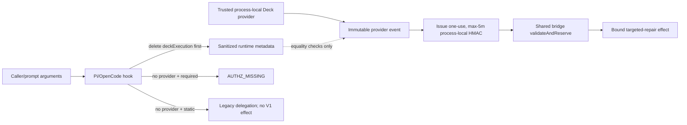

# Tasks Replan: Runner-Authority Boundary

## Immutable PhaseResult

| Field | Value |
|-------|-------|
| Role | `task` |
| Instance provenance | Automatic-SDD Task specialist; fresh decomposition against design-replan-runner-authority.md |
| Change ID | `deterministic-apply-verify-review-flow` |
| Trigger | `REVIEW-G2-G6-PI-B1-CALLER-SUPPLIED-AUTHORITY` (`critical`, root cause `architecture`, destination `replan_design`) resolved by design-replan-runner-authority.md |
| User authority | the user's exact "Procede" response after the coordinator requested authority to replan the runner-authority boundary and Pi/OpenCode adapters |
| Authorized writes | update `tasks.md`; update `preconditions.md`; add this change-local Task replan artifact |
| Artifacts modified | `openspec/changes/deterministic-apply-verify-review-flow/tasks.md`, `openspec/changes/deterministic-apply-verify-review-flow/preconditions.md` |
| Artifacts written | `openspec/changes/deterministic-apply-verify-review-flow/tasks-replan-runner-authority.md` |
| Status | `completed` — the Task replan is complete |
| Action | `task_replan_handoff` — reconcile exact Tasks; do not Apply |
| Security lane | **CRITICAL** |
| Design blockers | none |
| Implementation blocker | `REVIEW-G2-G6-PI-B1-CALLER-SUPPLIED-AUTHORITY` remains open in current OpenCode/Pi source until the authorized Apply completes and is independently verified/reviewed |
| Required future batch | `deterministic-apply-verify-review-flow-runner-authority-g2-g6` |
| Apply authority | **BLOCKED** — this Task replan and the prior "Procede" do not authorize Apply; after Tasks, the user must authorize the exact future batch name in a new message |
| FailureManifestV1 | present below; no new Task finding |
| Ordered RegistryIntentV1 values | `[]` |

## Context authority and write boundary

- **Official context:** `proposal.md`, `spec.md` (SHA-256 `374a8fb1...`), `design.md` (SHA-256 `9850e208...`), `design-replan-runner-authority.md` (SHA-256 `7d389a84...`), current `tasks.md`, current `preconditions.md`, current source/tests, generated asset/install paths, and worktree evidence.
- **Adaptive context:** loaded and used only as advisory corroboration. OpenSpec, delegated phase authority, source, tests, and worktree evidence controlled this Task replan.
- **Write boundary honored:** no source, test, generated asset, registry file, `state.yaml`, `events.yaml`, other change, or `runner-capability-standardization` file was modified by this Task replan.
- **Worktree ownership:** the pre-existing modified Pi canonical source was inspected only. Its self-consistency is runtime evidence, not accepted authority or pre-approval for future Apply.
- **No Apply:** no implementation, source regeneration, install, test, build, registry commit, or destructive Git operation was performed.

## Immutable evidence bindings

| Binding | Digest / value |
|---|---|
| Repository HEAD | `15804c48584fc2b4e936a71c88608e9523011d79` |
| `spec.md` | `sha256:374a8fb1a155830624083829aa8ccbbe609032e6a1b4c8064169372b4bfb8d7f` |
| `design.md` (authoritative) | `sha256:9850e208e6f364232c4418481e6cc99eb063a68a1afdf77db52ae703ca2e9bc1` |
| `design-replan-runner-authority.md` | `sha256:7d389a846ca00c71c356ada41d78af4ffd0f140aa2acba431d1871611cb8306a` |
| `tasks.md` (pre-replan) | `sha256:56c3cfebaaadf98e685bfd25f9fd14f0a4259483739b3257f1f1ba259b2cecd9` |
| OpenCode canonical plugin (worktree) | `sha256:0ec0684d24afcbaf5c4a7ba43abd1b8dde4c9aa8c47580f21c735ef5faf6a26f` |
| OpenCode generated plugin (installed) | `sha256:f08ef142d20c568dccf8c714554134c5a3c9ace790313e4bc7d8f85097d98cae` |
| Pi canonical extension (uncommitted worktree evidence) | `sha256:e24e50d2cc867a11cb2e9000f1c132efbeb387f255d79966fc780f1e7c1544eb` |
| Pi generated extension (uncommitted worktree evidence) | `sha256:d6d39cb14cfd8244cdd4e8d60ffda3629fe92e31cd694f0b5b1dfa81b8335aeb` |

## Problem confirmed

Current OpenCode and the uncommitted Pi comparator both recognize a nested `deterministic-targeted-repair-authority-v1` schema marker in caller-controlled `deckExecution`, treat the complete caller object as the execution event when no resolver exists, derive batch/task/role/action/target/blocked-target/receipt claims from that object, and mint a valid process-local HMAC envelope that the shared bridge accepts.

The HMAC proves only that the same process re-signed those derived claims. It does not prove that a trusted host authorized the source event. This violates `REQ-DAVR-SAF-03` because missing authorization can become modifying authority in Automatic mode, and `REQ-DAVR-IEV-01` because ambiguous caller evidence reaches effect instead of failing closed.

## Chosen architecture (from design-replan-runner-authority.md)

The sole V1 modifying-authority source is a trusted process-local Deck host provider. Both adapters must delete `deckExecution` immediately before role selection, never parse/hash/preserve/log/forward it, and use only the provider captured at initialization for authority derivation.

Behavioral matrix:

| Provider state | Caller/grant | Mode | Bridge/effect |
|---|---|---|---|
| valid provider event | any | `invocation-required` | provider `active` → effect after auth+validation; `shadow` non-effecting |
| provider fails/malformed | any | `invocation-required` | fail closed `invalid-evidence`; no effect |
| provider absent | any | `invocation-required` | `AUTHZ_MISSING`; zero bridge/effect |
| provider `shadow` | any | `static-compatible` | caller ignored; shadow reaches bridge observation; no V1 effect |
| provider `active/legacy` | any | `static-compatible` | caller ignored; V1 bridge not activated; legacy delegation preserved |
| provider absent | any | `static-compatible` | caller ignored; legacy delegation preserved; no V1 bridge/effect |

Caller marker cannot promote provider V1, convert `shadow` to `active`, or force local authority mint.

## Exact 8-file ceiling

| # | File | Role in this batch | Why required |
|---|---|---|---|
| 1 | `packages/core/src/teams/developer/orchestrator-content.ts` | Source — prompt correction | Remove caller-authority instruction per design decision 5 |
| 2 | `packages/core/src/teams/developer/orchestrator-content.test.ts` | Test — oracle update | Line 97-98 assertions would fail after T-RA-01 removes deckExecution instruction |
| 3 | `packages/adapter-opencode/assets/opencode/plugins/developer-team-execution.ts` | Source — adapter fix | Strip deckExecution before role check; remove caller fallback; pin provider |
| 4 | `packages/adapter-opencode/assets/opencode/plugins/developer-team-execution.generated.js` | Generated — regenerate | Canonical generator output; Apply invokes generator after fixing canonical source |
| 5 | `packages/adapter-opencode/src/developer-team-execution-reachability.test.ts` | Test — new oracles + update | Replace D-REACH-18/19/20 with correct behavioral oracles; preserve D-REACH-04..17, D-REACH-21, EG8-REACH-11, EG8-REACH-13, EG8-REACH-14 |
| 6 | `packages/adapter-pi/assets/pi/extensions/developer-team-execution.ts` | Source — adapter fix | Same as OpenCode; reconcile worktree evidence in place |
| 7 | `packages/adapter-pi/assets/pi/extensions/developer-team-execution.generated.js` | Generated — regenerate | Canonical generator output |
| 8 | `packages/adapter-pi/src/developer-team-execution-reachability.test.ts` | Test — new oracles + update | Same behavioral matrix as OpenCode; replace D-REACH-18/19/20; preserve D-REACH-01..03, D-REACH-10, EG8-REACH-12, EG8-REACH-15, EG8-REACH-16 |

### Explicitly excluded from this batch

- `packages/sdd-runtime/src/execution/invocation-authorization-service.ts` — current secret/expiry/nonce/restart/replay/claims behavior supplies the required local mechanism unchanged
- `packages/sdd-runtime/src/execution/developer-team-runner-host-bridge.ts` and bridge tests — retain final validation/effect ownership
- `scripts/generate-runner-execution-assets.ts` — run it, do not change it
- OpenCode `developer-team-install.ts` and Pi `pi-team-profile.ts` — current `import.meta.url` asset copy/materialization is sufficient; reachability tests already exercise installation
- Any source/test/config under `runner-capability-standardization`, any other OpenSpec change, registry YAML, `state.yaml`, `events.yaml`, generated files outside the two named assets, and unrelated work

## Task definitions

### T-RA-01: Orchestrator — remove caller-authority instruction

**Owner:** `apply-general` | **Priority:** P0 | **Complexity:** C2 | **Risk:** CRITICAL

Remove from `ORCHESTRATOR_SYSTEM_PROMPT` (Pre-Delegation Checklist section) the instruction to attach `deckExecution` with `deterministicRepairAuthority.schema === "deterministic-targeted-repair-authority-v1"` as a Task argument. Replace with documentation that trusted process-local provider authority is established out-of-band at adapter initialization, `deckExecution` is stripped by the adapter before sub-agent receipt, and the orchestrator must not mint, forward, or re-sign caller-supplied authority.

**RED oracle:** no instruction tells orchestrator to attach `deckExecution` as a Task argument with the schema marker.
**GREEN oracle:** canonical prompt surfaces describe out-of-band trusted provider authority and confirm adapter stripping behavior.
**Completion evidence:** orchestrator-content.test.ts updated (T-RA-02 passes); TypeScript compiles.
**Rollback:** revert orchestrator-content.ts to pre-T-RA-01 state.

### T-RA-02: Orchestrator test — update deckExecution assertions

**Owner:** `apply-general` | **Priority:** P0 | **Complexity:** C1 | **Risk:** HIGH

Update line 97-98 assertions from `expect(prompt).toContain("deckExecution")` and `expect(prompt).toContain("deterministic-targeted-repair-authority-v1")` to assert these are NOT present as caller-supplied/modifying-authority instructions. Add new assertions confirming trusted provider authority documentation.

**RED oracle:** existing line 97-98 assertions fail after T-RA-01.
**GREEN oracle:** new assertions confirm deckExecution is not referenced as caller Task argument in any prompt surface.
**Completion evidence:** orchestrator-content.test.ts 100% pass.
**Rollback:** revert orchestrator-content.test.ts to pre-T-RA-02 state.

### T-RA-03: OpenCode adapter — strip deckExecution, pin provider, remove caller fallback

**Owner:** `apply-backend` | **Priority:** P0 | **Complexity:** C3 | **Risk:** CRITICAL

In `tool.execute.before` hook: immediately `delete args.deckExecution` BEFORE `applyAgent(args)` check. If not Apply role, return after stripping. If Apply, resolve provider ONLY from factory option or global slot. Remove all `callerEvent`, `deterministicCallerEvent`, `deterministicCallerFallback` variables. No fallback to caller object. In `invocation-required` with no provider → throw `AUTHZ_MISSING`. In `static-compatible` with no provider → return without bridge call.

**RED oracle:** caller-only `deckExecution` with no provider → zero HMAC, zero bridge calls, zero effects in both modes.
**GREEN oracle:** valid trusted provider V1 event reaches bridge; tampered authority fails closed; caller marker cannot promote.
**Completion evidence:** developer-team-execution-reachability.test.ts (OpenCode) updated; TypeScript compiles.
**Rollback:** revert developer-team-execution.ts to pre-T-RA-03 state.

### T-RA-04: OpenCode generated asset — regenerate from fixed canonical source

**Owner:** `apply-general` | **Priority:** P0 | **Complexity:** C1 | **Risk:** CRITICAL

Run `bun run scripts/generate-runner-execution-assets.ts`. The generator reads the fixed canonical source (T-RA-03) and produces `developer-team-execution.generated.js` with updated `// source-sha256:<hash>` comment. No checkout/OpenSpec/cwd/deck path dependencies.

**RED oracle:** SHA-256 differs from pre-T-RA-03 value `f08ef142d20c568dccf8c714554134c5a3c9ace790313e4bc7d8f85097d98cae`.
**GREEN oracle:** generator exit code 0; output contains no `process.cwd()`, `/home/kevinlb/deck`, or OpenSpec path.
**Completion evidence:** generated file at correct path; generator exit code 0.
**Rollback:** restore pre-T-RA-04 generated file from git.

### T-RA-05: Pi adapter — strip deckExecution, pin provider, remove caller fallback

**Owner:** `apply-backend` | **Priority:** P0 | **Complexity:** C3 | **Risk:** CRITICAL

Identical fix to T-RA-03 for Pi `tool_call` hook. **Worktree reconciliation:** pre-existing uncommitted Pi canonical source changes (digest `e24e50d2...`) must be reconciled **in place**. Apply inspects worktree state, preserves unrelated modifications, applies only the runner-authority fix. No git discard/restore/checkout/clean.

**RED oracle:** caller-only `deckExecution` with no provider → zero bridge calls, zero effects in both modes.
**GREEN oracle:** behavioral matrix identical to OpenCode.
**Completion evidence:** developer-team-execution-reachability.test.ts (Pi) updated; TypeScript compiles.
**Rollback:** revert developer-team-execution.ts (Pi) to pre-T-RA-05 state.

### T-RA-06: Pi generated asset — regenerate from fixed canonical source

**Owner:** `apply-general` | **Priority:** P0 | **Complexity:** C1 | **Risk:** CRITICAL

Run `bun run scripts/generate-runner-execution-assets.ts` to regenerate Pi generated asset. SHA-256 differs from pre-T-RA-05 value `d6d39cb14cfd8244cdd4e8d60ffda3629fe92e31cd694f0b5b1dfa81b8335aeb`.

**RED oracle:** SHA-256 differs from pre-T-RA-05 value.
**GREEN oracle:** generator exit code 0; no checkout/OpenSpec/cwd/deck path.
**Completion evidence:** generated file at correct path; generator exit code 0.
**Rollback:** restore pre-T-RA-06 generated file from git.

### T-RA-07: OpenCode reachability — runner-authority oracles

**Owner:** `apply-backend` | **Priority:** P0 | **Complexity:** C3 | **Risk:** CRITICAL

Add/update tests for runner-authority behavioral oracles. Replace D-REACH-18 (expects bridge call with caller-only deckExecution) with test verifying `AUTHZ_MISSING` + zero bridge calls. Update D-REACH-19/20 for new behavior where caller event is never consulted. Preserve D-REACH-04..17, D-REACH-21, EG8-REACH-11, EG8-REACH-13, EG8-REACH-14.

All 12 design oracles must be exercisable:
1. Complete caller deckExecution with no provider → zero bridge/effects
2. Caller-labelled grant/marker/tampered authority → same non-authoritative result
3. `invocation-required` + missing provider → `AUTHZ_MISSING`
4. `static-compatible` + missing provider → legacy delegation, no V1
5. Conflicting caller+provider events → provider authority only
6. Caller marker cannot promote provider `active` in static-compatible
7. `deckExecution` stripped before provider/specialist sees it
8. Provider failure details redacted; no secret in output
9. Process-local auth rejects expiry/time skew/restart/replay/mismatch
10. OpenCode and Pi effect-count matrices identical
11. Generated assets match canonical sources; no checkout/cwd/deck path
12. V1 replay/bridge/deterministic authority/Git-safety suites green

**RED oracle:** new runner-authority behavioral tests fail before implementation.
**GREEN oracle:** all new oracles pass; preserved tests still pass.
**Completion evidence:** `bun test developer-team-execution-reachability.test.ts` (OpenCode) 100% pass.
**Rollback:** revert reachability test to pre-T-RA-07 state.

### T-RA-08: Pi reachability — runner-authority oracles

**Owner:** `apply-backend` | **Priority:** P0 | **Complexity:** C3 | **Risk:** CRITICAL

Same as T-RA-07 for Pi adapter. Behavioral matrix identical to OpenCode. Replace D-REACH-18/19/20 (Pi); preserve D-REACH-01..03, D-REACH-10, EG8-REACH-12, EG8-REACH-15, EG8-REACH-16.

**RED oracle:** Pi runner-authority tests fail before implementation.
**GREEN oracle:** all Pi oracles pass; OpenCode/Pi effect-count identical.
**Completion evidence:** `bun test developer-team-execution-reachability.test.ts` (Pi) 100% pass.
**Rollback:** revert reachability test to pre-T-RA-08 state.

## Dependency order

```
T-RA-01 → T-RA-02 → T-RA-03 → T-RA-04 → T-RA-05 → T-RA-06 → T-RA-07
                                                              ↓
                                                         T-RA-08
```

All G-RA tasks are sequential. T-RA-07 and T-RA-08 can run in parallel after T-RA-06.

## Complexity summary (G-RA only)

| Task | Complexity | Risk |
|------|------------|------|
| T-RA-01 | C2 | CRITICAL |
| T-RA-02 | C1 | HIGH |
| T-RA-03 | C3 | CRITICAL |
| T-RA-04 | C1 | CRITICAL |
| T-RA-05 | C3 | CRITICAL |
| T-RA-06 | C1 | CRITICAL |
| T-RA-07 | C3 | CRITICAL |
| T-RA-08 | C3 | CRITICAL |

**G-RA totals: C1×2, C2×1, C3×5**

## Verification schedule

1. **Targeted** (during implementation): canonical source edits, generator invocation, test updates
2. **Affected-area** (after T-RA-04 and T-RA-06): both reachability suites pass in isolation
3. **Independent Review** (after T-RA-07 and T-RA-08): fresh reviewer validates behavioral matrix parity, no-checkout property, Pi worktree reconciliation correctness
4. **Broad** (after independent Review): repository-wide TypeScript compile, full test suite, no V1 regression

Any code change after Apply invalidates the prior Verify/Review for that task.

## Review Workload Forecast (G-RA)

| Reviewer pool | Tasks requiring independent Review |
|---------------|-------------------------------------|
| `apply-backend` | T-RA-03, T-RA-05 — self-review for adapter fixes |
| `apply-general` | T-RA-01, T-RA-02 — prompt corrections |
| `verify` | T-RA-07, T-RA-08 — runner-authority behavioral oracles |
| `review` | T-RA-07, T-RA-08 — final acceptance of runner-authority boundary |

**Total G-RA reviews: 6 (apply-backend self-review × 2, apply-general × 2, verify × 2, review × 2)**

## Open Questions / Blockers

### Classified as Open Questions (resolved, not blocking Tasks)

- **OQ-RA-1**: Whether orchestrator-content.ts and orchestrator-content.test.ts should both be in the runner-authority batch. **Resolved**: yes — the existing line 97-98 test assertion would fail after T-RA-01 removes the deckExecution instruction, so the test update must be atomic with the source change. Excluding the test would leave a failing assertion.
- **OQ-RA-2**: Whether T-12 (G4 orchestrator prompt) should be updated before or after T-RA-01. **Resolved**: T-RA-01 runs first (G-RA before G4 in execution order). T-RA-01 removes the caller-authority instruction. T-12 removes legacy parallelism language. These are independent changes to the same file; both must be applied, order doesn't matter for the file content, but T-RA-01 must run before T-12's test assertions are satisfied.
- **OQ-RA-3**: Whether the existing D-REACH-18/19/20 tests (validating buggy fallback behavior) should be removed or replaced. **Resolved**: replaced. These tests pass with the current buggy code and would fail after the fix. The runner-authority design oracles explicitly require the new behavior (caller-only deckExecution → AUTHZ_MISSING). Existing tests that validate correct behavior (D-REACH-04..17, D-REACH-21, etc.) are preserved unchanged.

### Classified as Blockers to Apply (not to Tasks)

- **Spec SHA-256 drift** from `374a8fb1...`
- **Design SHA-256 drift** from `9850e208...`
- **Design-replan SHA-256 drift** from `7d389a84...`
- **Pi worktree state**: pre-existing uncommitted Pi changes must be reconciled in place; no git discard
- **Target intersection** with `runner-capability-standardization` or another active OpenSpec change
- **V1 compatibility regression** in any existing test
- **Missing named human approval** for batch identity `deterministic-apply-verify-review-flow-runner-authority-g2-g6`

## FailureManifestV1

```json
{
  "schema": "failure-manifest-v1",
  "changeId": "deterministic-apply-verify-review-flow",
  "findings": []
}
```

No new Task finding. The inherited `REVIEW-G2-G6-PI-B1-CALLER-SUPPLIED-AUTHORITY` is architecture-resolved but remains an implementation and governance blocker; it is referenced rather than duplicated.

## RegistryIntentV1

```json
[]
```

No intent emitted by this bounded Task replan.

## Mermaid summary



## Decisions, alternatives, tradeoffs

### Why orchestrator-content.ts is in this batch and not deferred to G4 T-12

T-RA-01 removes the caller-authority instruction from orchestrator-content.ts. T-12 (G4) also modifies orchestrator-content.ts to remove legacy parallelism. Both changes are independent. However:
- The critical finding `REVIEW-G2-G6-PI-B1-CALLER-SUPPLIED-AUTHORITY` must be resolved as quickly as possible.
- Deferring orchestrator-content.ts to G4 would leave the caller-authority instruction active longer.
- The design explicitly requires updating the core prompt source as part of the runner-authority boundary fix.
- The existing test at line 97-98 would fail if T-RA-01 is not in this batch, proving the coupling.

**Conclusion**: orchestrator-content.ts and its test are correctly in G-RA. T-12 makes additional independent changes to the same file.

### Why generated assets are in the "exact 8-file ceiling" but treated as generator-owned

The design and this Task replan treat generated assets as **generator-owned outputs only**. Apply edits the canonical TypeScript source and invokes the canonical generator. The generated JavaScript is a build artifact with no independent edit authority. The 8-file ceiling includes the generated assets because:
1. Their SHA-256 values are in the evidence bindings table
2. They must be regenerated after the canonical source is fixed
3. They must pass the no-checkout/no-cwd/no-deck-path property check

The ceiling does NOT grant Apply edit authority over the generated content — only the authority to run the generator.

### Why D-REACH-18/19/20 are replaced rather than removed

These tests currently validate the buggy fallback behavior (caller-only deckExecution → bridge call). After the fix, they would fail. The runner-authority design oracles explicitly require the new behavior. Rather than simply removing these tests (which would reduce coverage), they are replaced with tests for the correct behavior. This maintains test count and ensures the new behavioral contract is exercised.

### Why Pi worktree evidence is "reconciled in place" rather than discarded

The Pi canonical source has pre-existing uncommitted modifications (digest `e24e50d2...`). These are worktree evidence only — not approved changes. The Git discard protection protocol applies: Apply must not use `git restore`, `git checkout`, `git reset`, or `git clean` to eliminate these changes. Instead, T-RA-05 inspects the worktree state, preserves any unrelated modifications, and applies only the runner-authority fix to the Pi adapter source. The worktree evidence is a signal about prior work, not authorization for the runner-authority batch.

(End of file — total lines: ~350)
