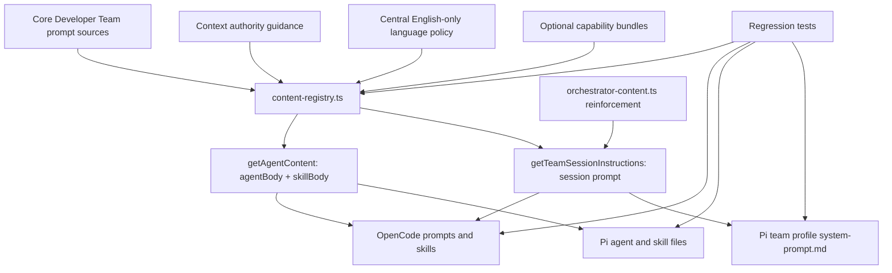

# Design: Enforce English Agent Artifacts

## Source

- Proposal: `enforce-english-agent-artifacts` proposal artifact
- Exploration: `enforce-english-agent-artifacts` exploration artifact, context only
- Capabilities affected:
  - `developer-team-language-policy`
  - `generated-content-language-regression`
  - `developer-team-orchestration`
  - `developer-team-content-registry`
  - `developer-team-adapter-installation`
- Spec status: not yet available

## Current Architecture Context

Deck Developer Team prompt content is generated from a runner-agnostic core content layer and materialized by runner adapters.

- `packages/core/src/teams/developer/content-registry.ts` is the canonical composition boundary for Developer Team content.
  - `getAgentContent()` / `getAgentContentResult()` return `{ agentBody, skillBody }` for catalog agents.
  - `getTeamSessionInstructions("developer-team")` returns the orchestrator session instructions.
  - Current composition order for agent content is: orchestrator invariants, base content, context-authority guidance, then optional capability instructions.
  - Current composition order for session instructions is: orchestrator invariants, orchestrator prompt variant, context-authority guidance, then optional session-surface capability instructions.
- `packages/core/src/teams/developer/orchestrator-content.ts` owns the orchestrator system prompt, agent body, and skill body.
  - It currently rejects phase outputs that use the "wrong or non-requested language" but does not positively define that sub-agent prompts, sub-agent communication, and OpenSpec artifacts must be English-only.
  - The orchestrator must synthesize user-facing responses in the user's language.
- `packages/core/src/teams/developer/instruction-bundles/serena.ts` and the three apply-agent content files contain the known Spanish placeholder leak in the Serena fallback message.
- `packages/adapter-opencode/src/prompt-generation.ts` consumes the registry for OpenCode prompt files.
  - Orchestrator prompt files use `getTeamSessionInstructions("developer-team")`.
  - Sub-agent prompt files use `content.agentBody` from `getAgentContent()`.
- `packages/adapter-opencode/src/developer-team-install.ts` consumes registry content for OpenCode skill files and delegates prompt materialization to `buildPromptGenerationPlan()`.
- `packages/adapter-pi/src/developer-team-install.ts` consumes registry content for Pi agent and skill files.
  - Non-orchestrator agent files use `content.agentBody`.
  - Skill files use `content.skillBody`.
  - The Pi orchestrator agent is a stub; the full session prompt is materialized through `packages/adapter-pi/src/pi-team-profile.ts` as `.deck/pi/profiles/developer-team/system-prompt.md` using `getTeamSessionInstructions()`.

## Proposed Architecture

Add an authoritative Developer Team language-policy composition layer in `content-registry.ts`, reinforce orchestrator delegation/validation rules in `orchestrator-content.ts`, remove known non-English prompt text from Deck-owned sources, and test both core generated content and adapter materialized output.

### Central Language Policy Composition

Define one constant in `packages/core/src/teams/developer/content-registry.ts`, for example `DEVELOPER_TEAM_LANGUAGE_POLICY`, and apply it through a small helper such as `appendDeveloperTeamLanguagePolicy(content: string): string`.

The policy block should state:

- All Developer Team sub-agent prompts, sub-agent-to-agent communication, and generated artifacts must be written in English.
- OpenSpec artifacts produced by Developer Team agents must be English-only.
- The orchestrator must respond directly to the end user in the user's language.
- Literal non-English text is allowed only when it is a domain literal, identifier, file path, brand/product name, exact error message, or quoted user-provided text.
- The policy is authoritative for Developer Team generated content and must not be weakened by capability instruction bundles.

Place the language-policy layer after context-authority guidance and before optional capability instruction composition:

1. Orchestrator invariants.
2. Base agent/session content.
3. Context-authority guidance.
4. Developer Team language policy.
5. Optional capability instructions.

Rationale for this order:

- Context authority remains close to official/adaptive context guidance.
- Capability bundles remain later, preserving existing package-instruction composition semantics.
- Tests must verify the final composed output so capability bundles cannot silently reintroduce the known leak.

### Orchestrator Prompt Reinforcement

Modify `packages/core/src/teams/developer/orchestrator-content.ts` to add an explicit `Language Policy` section to the orchestrator system prompt and the orchestrator skill body.

The orchestrator-specific reinforcement should cover:

- Delegation prompts sent to sub-agents must be in English.
- Sub-agent responses and artifacts must be English-only.
- The orchestrator must reject or request repair for sub-agent outputs that violate the English-only rule.
- The orchestrator must synthesize user-facing summaries in the user's language.
- The policy does not forbid exact literals such as file paths, identifiers, product names, quoted user input, or exact error messages.

The existing "wrong or non-requested language" validation rule should remain, but it should be clarified so the requested language for sub-agent phase outputs is English, while direct user-facing orchestration must use the user's language.

### Known Leak Removal

Replace the known fallback string in Deck-owned source prompt content:

- From: the current fallback sentence containing the confirmed Spanish placeholder token.
- To: `Serena tools unavailable. Using fallback: [tool].`

This change belongs in the canonical Serena instruction bundle and in the duplicated apply-agent skill-body text currently containing the same fallback sentence.

### Adapter Propagation

No adapter contract changes are required. OpenCode and Pi should inherit the policy by continuing to consume core registry functions.

- OpenCode prompt files inherit the policy from `getTeamSessionInstructions()` for the orchestrator and from `getAgentContent()` for sub-agents.
- OpenCode skill files inherit the policy from `getAgentContent().skillBody`.
- Pi non-orchestrator agent and skill files inherit the policy from `getAgentContent()`.
- Pi orchestrator runtime behavior inherits the policy from `.deck/pi/profiles/developer-team/system-prompt.md`, which is built by `buildTeamSystemPrompt()` using `getTeamSessionInstructions()`.
- Pi orchestrator stub content should not become the authoritative place for the policy; tests should verify the profile/system-prompt path as the runtime authority.

### Component / Module Boundaries

| Component | Responsibility | Change Type |
|---|---|---|
| `packages/core/src/teams/developer/content-registry.ts` | Authoritative Developer Team prompt composition for agent, skill, and session surfaces | modified |
| `packages/core/src/teams/developer/orchestrator-content.ts` | Orchestrator delegation, validation, and user-facing language behavior | modified |
| `packages/core/src/teams/developer/instruction-bundles/serena.ts` | Serena capability prompt fragment | modified |
| `packages/core/src/teams/developer/apply-general-content.ts` | General Apply prompt and skill body | modified |
| `packages/core/src/teams/developer/apply-backend-content.ts` | Backend Apply prompt and skill body | modified |
| `packages/core/src/teams/developer/apply-frontend-content.ts` | Frontend Apply prompt and skill body | modified |
| `packages/adapter-opencode/src/prompt-generation.ts` | OpenCode prompt materialization from core registry | unchanged |
| `packages/adapter-opencode/src/developer-team-install.ts` | OpenCode install plan materialization from core registry | unchanged |
| `packages/adapter-pi/src/developer-team-install.ts` | Pi agent/skill materialization from core registry | unchanged |
| `packages/adapter-pi/src/pi-team-profile.ts` | Pi team profile/system prompt materialization from core registry | unchanged |

### Data Flow

1. Developer Team source prompt strings and capability bundles are imported by `content-registry.ts`.
2. `getAgentContentResult()` composes each `{ agentBody, skillBody }` with invariants where applicable, context-authority guidance, the central language policy, and optional capability instructions.
3. `getTeamSessionInstructions("developer-team")` composes the orchestrator session prompt with invariants, context-authority guidance, the central language policy, and optional session-surface capability instructions.
4. OpenCode adapter materializes:
   - prompt files from `buildPromptGenerationPlan()`;
   - skill files from `buildOpenCodeDeveloperTeamInstallPlan()`.
5. Pi adapter materializes:
   - sub-agent files and skill files from `buildDeveloperTeamInstallPlan()`;
   - orchestrator runtime profile from `materializeTeamProfile()` / `buildTeamSystemPrompt()`.
6. Regression tests validate both the core composed content and final adapter plans for policy presence and known leak absence.

### API / Contract Implications

| Endpoint / Interface | Change | Backward Compatible |
|---|---|---|
| `getAgentContent(agentId, options?)` | Returned `agentBody` and `skillBody` include the central language policy | yes |
| `getAgentContentResult(agentId, options?)` | Successful result content includes the central language policy | yes |
| `getTeamSessionInstructions(teamId, options?)` | Developer Team session instructions include the central language policy | yes |
| OpenCode install plan types | No shape change; content strings include the policy | yes |
| Pi install plan/profile types | No shape change; content strings include the policy | yes |

### State / Persistence Implications

None. The change modifies generated prompt content and tests only. It does not add schemas, data files, migrations, or persistent runtime state.

### Migration / Backward Compatibility

- No data migration is required.
- Existing Deck installs will receive the policy when users regenerate/reinstall Developer Team runner files through existing Deck install paths.
- The implementation must not directly edit local installed OpenCode, Pi, or runner files outside the Deck repository.
- Existing public function signatures remain compatible; only generated content changes.

## File Impact Estimate

| File / Path | Action | Rationale |
|---|---|---|
| `packages/core/src/teams/developer/content-registry.ts` | modify | Add central language policy constant/helper and insert it into agent, skill, fallback, and session composition paths. |
| `packages/core/src/teams/developer/orchestrator-content.ts` | modify | Add explicit orchestrator language policy for delegation, validation, repair, and the user-facing language requirement. |
| `packages/core/src/teams/developer/instruction-bundles/serena.ts` | modify | Replace the confirmed Spanish placeholder token with `[tool]` in Serena fallback text. |
| `packages/core/src/teams/developer/apply-general-content.ts` | modify | Replace duplicated confirmed Spanish placeholder fallback text. |
| `packages/core/src/teams/developer/apply-backend-content.ts` | modify | Replace duplicated confirmed Spanish placeholder fallback text. |
| `packages/core/src/teams/developer/apply-frontend-content.ts` | modify | Replace duplicated confirmed Spanish placeholder fallback text. |
| `packages/core/src/teams/developer/content-registry.test.ts` | modify | Add composed-content tests for policy presence and known leak absence across agent, skill, session, and capability-composed surfaces. |
| `packages/core/src/teams/developer/orchestrator-content.test.ts` | modify | Add focused assertions for orchestrator language policy, sub-agent validation, and the user-facing language requirement. |
| `packages/adapter-opencode/src/prompt-generation.test.ts` | modify | Assert generated OpenCode prompt files include the policy and exclude the confirmed Spanish placeholder token. |
| `packages/adapter-opencode/src/developer-team-install.test.ts` | modify | Assert OpenCode install-plan prompt and skill surfaces preserve the policy and exclude the confirmed Spanish placeholder token. |
| `packages/adapter-pi/src/developer-team-install.test.ts` | modify | Assert Pi agent/skill install-plan surfaces preserve the policy and exclude the confirmed Spanish placeholder token. |
| `packages/adapter-pi/src/pi-team-profile.test.ts` | modify | Assert Pi profile `system-prompt.md` content includes the policy and excludes the confirmed Spanish placeholder token. |

## Testing Strategy

- Core content-registry tests:
  - Iterate all Developer Team agent IDs from the catalog.
  - Assert each `agentBody` and `skillBody` contains a stable policy phrase such as `Developer Team Language Policy` and `generated artifacts must be written in English`.
  - Assert `getTeamSessionInstructions("developer-team")` contains the same policy.
  - Repeat with a representative capability instruction bundle, especially Serena, to prove composed output still contains the policy and does not contain the confirmed Spanish placeholder token.
  - Assert the fallback path from `getAgentContentResult(id, { fallback: true })` also receives the policy when fallback is available.
- Orchestrator content tests:
  - Assert the orchestrator prompt requires English-only delegation prompts, sub-agent communication, and generated artifacts.
  - Assert it preserves the requirement that direct user-facing responses use the user's language.
  - Assert it rejects or repairs sub-agent output that violates the English-only rule.
- Adapter tests:
  - OpenCode prompt generation: scan every planned prompt content string.
  - OpenCode install plan: scan planned prompt files and skill files.
  - Pi install plan: scan planned non-orchestrator agent files and skill files.
  - Pi profile: scan `buildTeamSystemPrompt("developer-team")` or materialized profile output because the orchestrator stub is not the full runtime prompt.
- Leak detection:
  - Use a small curated deny-list starting with the confirmed Spanish placeholder token.
  - Do not add broad language detection or translation tests.

## Observability / Error Handling

- No runtime logging or monitoring changes are required.
- Existing orchestrator validation/repair behavior should be clarified to treat non-English sub-agent outputs as contract violations.
- Test failure messages should identify the specific surface (`agentBody`, `skillBody`, `session`, `OpenCode prompt`, `Pi profile`) where the policy is missing or a known leak is present.

## Security / Performance / Accessibility Considerations

- Security: No new external input handling, network calls, or permissions are introduced. Literal exception wording should avoid encouraging translation or modification of exact quoted errors, paths, or identifiers.
- Performance: Negligible prompt-size increase from one central policy block per generated content surface.
- Accessibility: Not applicable.

## Tradeoffs

| Decision | Chosen | Rejected Alternative | Rationale |
|---|---|---|---|
| Policy ownership | Central policy in `content-registry.ts` plus orchestrator reinforcement | Policy repeated in every `*-content.ts` file | Central composition covers current/future Developer Team surfaces and reduces drift; orchestrator reinforcement covers delegation-specific behavior. |
| Composition order | Append language policy after context-authority guidance and before capability instructions | Append only at the very end | Keeping capability instructions last preserves existing package composition semantics while tests verify final output cannot reintroduce known leaks unnoticed. |
| Adapter changes | No adapter API changes; verify inherited content | Add runner-specific language-policy injection in each adapter | Core registry is the runner-agnostic authority; adapter injection would duplicate policy and risk OpenCode/Pi drift. |
| Leak detection | Small curated deny-list for confirmed leaks | Broad natural-language detection | Broad detection is likely brittle for identifiers, quoted user text, exact errors, and product names. |
| Pi orchestrator policy location | Verify profile/system prompt as runtime authority | Force full policy into the Pi orchestrator stub | Pi intentionally keeps the full orchestrator prompt in the team profile; duplicating it in the stub would weaken that architecture. |

## Risks

| Risk | Likelihood | Impact | Mitigation |
|---|---|---|---|
| Capability bundles append non-English text after the central policy | Medium | Medium | Test final composed output with representative bundles and deny-list known leaks. |
| Policy wording is interpreted as forbidding exact non-English literals | Medium | Medium | Include explicit exceptions for file paths, identifiers, product names, exact errors, and quoted user input. |
| Duplication drift between central policy and orchestrator-specific language section | Medium | Low | Keep central policy authoritative; orchestrator text should reinforce behavior without redefining incompatible rules. |
| Pi tests check only the orchestrator stub and miss runtime profile content | Medium | Medium | Add or extend `pi-team-profile.test.ts` or profile materialization assertions to inspect `system-prompt.md`. |
| Prompt-size increase affects generated content snapshots or brittle length assertions | Low | Low | Prefer semantic substring assertions over exact full-content snapshots. |

## Open Decisions

- Whether future changes should expand this policy beyond the Developer Team remains out of scope for this change.
- Whether additional known non-English leak terms exist beyond the confirmed Spanish placeholder token is unknown; implementation should limit deny-list scope to confirmed terms unless new confirmed leaks are found during local inspection.

## Dependencies

- Existing core registry APIs: `getAgentContent()`, `getAgentContentResult()`, and `getTeamSessionInstructions()`.
- Existing Developer Team catalog for enumerating agent IDs in tests.
- Existing OpenCode and Pi install-plan builders for adapter-level regression coverage.
- Existing Pi profile builder for validating orchestrator runtime prompt propagation.

## Implementation Sequencing

1. Add the central language policy constant/helper in `content-registry.ts` and compose it into agent, skill, fallback, and session outputs.
2. Add/adjust core content-registry tests for policy presence and confirmed-placeholder absence across base and capability-composed surfaces.
3. Reinforce orchestrator language behavior in `orchestrator-content.ts`.
4. Add/adjust orchestrator content tests for delegation, validation, and the user-facing language requirement.
5. Replace the confirmed Spanish placeholder token with `[tool]` in Serena and apply-agent prompt sources.
6. Add/adjust OpenCode prompt-generation and install-plan tests.
7. Add/adjust Pi install-plan and profile tests.
8. Run focused Bun tests for the modified core and adapter test files, then the broader relevant package test suite if time permits.

## Next Steps

Ready for Task (`deck-developer-task`) to break this design into implementation tasks, combined with Spec.

## Mermaid Summary Source

