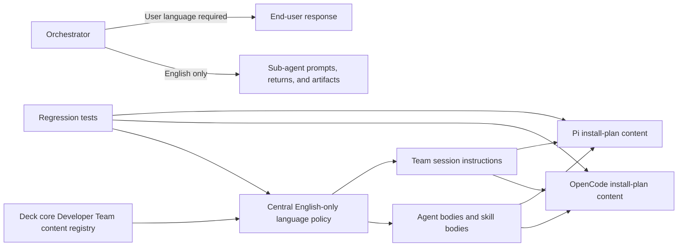

# Proposal: Enforce English Agent Artifacts

## Intent

Deck-generated Developer Team prompts can currently include non-English text and do not centrally require English-only sub-agent communication or artifacts. This creates inconsistent generated/installed orchestrator behavior: orchestrator-to-user communication must use the user's language, while orchestrator-to-sub-agent communication, sub-agent returns, and generated artifacts must remain English-only for consistency, auditability, and downstream Spec/Design/Task consumption.

## Goal

Ensure Deck-owned generated and installed Developer Team prompts require English-only orchestrator-to-sub-agent communication, English-only sub-agent returns, and English-only generated artifacts, while requiring the orchestrator's user-facing responses to use the user's language.

## Scope

### In Scope

- Add a centralized English-only language policy to Deck-owned Developer Team prompt composition.
- Strengthen orchestrator instructions so delegation to sub-agents and validation of sub-agent outputs enforce English-only communication, English-only sub-agent returns, and English-only artifacts.
- Remove the known Spanish placeholder leak (`herramienta`) from Deck-owned prompt sources.
- Add regression coverage for generated Developer Team content and installed adapter output surfaces.
- Keep all changes within the Deck repository, specifically source files, tests, and OpenSpec artifacts owned by Deck.

### Out of Scope

- Direct edits to this machine's local OpenCode files, runner config files, Pi files, or any installed runner-specific files outside the Deck repository.
- Changing user-facing orchestrator responses away from the user's language; the orchestrator must respond to the end user in the user's language.
- Rewriting archived OpenSpec artifacts, README content, or documentation that is not generated/installed as agent prompt content.
- Applying the policy to non-Developer-Team Deck teams unless Design confirms they share the same generated prompt surfaces.
- Adding broad natural-language detection or machine translation.

## Affected Capabilities

> This section is the contract between Proposal and Spec/Design phases.

### New Capabilities

- `developer-team-language-policy`: Deck-generated Developer Team prompts state and preserve the English-only rule for orchestrator-to-sub-agent communication, sub-agent returns, and generated artifacts, while requiring orchestrator-to-user communication to use the user's language.
- `generated-content-language-regression`: Tests detect known non-English prompt leaks and verify the English-only policy appears in generated and installed prompt surfaces.

### Modified Capabilities

- `developer-team-orchestration`: Orchestrator delegation and sub-agent output validation must require English-only orchestrator-to-sub-agent communication, sub-agent returns, and artifacts while user-facing orchestrator responses must use the user's language.
- `developer-team-content-registry`: Prompt composition must inject the central language policy into agent bodies, skill bodies, and team session instructions.
- `developer-team-adapter-installation`: OpenCode and Pi adapter install plan content should carry the language policy through final generated files.

### Unchanged Capabilities

- `runner-user-language-response`: User-facing orchestrator responses must use the user's language.
- `capability-instruction-composition`: Optional capability bundles remain composable; they are only constrained to avoid introducing non-English prompt content.

## Approach

- Treat `packages/core/src/teams/developer/content-registry.ts` as the authoritative composition point for the English-only policy so current and future Developer Team agent bodies, skill bodies, and session instructions inherit it.
- Add explicit orchestrator-facing language instructions in `packages/core/src/teams/developer/orchestrator-content.ts` for delegation, sub-agent output validation, sub-agent return validation, and the requirement that user-facing responses use the user's language.
- Replace the known `[herramienta]` placeholder with `[tool]` in `packages/core/src/teams/developer/instruction-bundles/serena.ts` and duplicated apply-agent prompt sources.
- Add concise per-agent or return-contract reinforcement only where useful; keep the central content-registry policy authoritative to reduce duplication drift.
- Add content-level and adapter-level tests that assert the policy is present and the known Spanish leak is absent from generated prompt/install-plan content.

## Affected Files

| File | Expected Impact |
|---|---|
| `packages/core/src/teams/developer/content-registry.ts` | Add central language policy composition for Developer Team generated content. |
| `packages/core/src/teams/developer/orchestrator-content.ts` | Make orchestrator delegation and validation language rules explicit. |
| `packages/core/src/teams/developer/instruction-bundles/serena.ts` | Replace the known `[herramienta]` placeholder with English text. |
| `packages/core/src/teams/developer/apply-general-content.ts` | Replace duplicated `[herramienta]` fallback text. |
| `packages/core/src/teams/developer/apply-backend-content.ts` | Replace duplicated `[herramienta]` fallback text. |
| `packages/core/src/teams/developer/apply-frontend-content.ts` | Replace duplicated `[herramienta]` fallback text. |
| `packages/core/src/teams/developer/content-registry.test.ts` or new language-policy test | Verify policy presence and known leak absence across generated Developer Team content. |
| `packages/core/src/teams/developer/orchestrator-content.test.ts` | Verify orchestrator language policy coverage. |
| `packages/adapter-opencode/src/prompt-generation.test.ts` | Verify generated OpenCode prompt output carries the policy and excludes known leaks. |
| `packages/adapter-opencode/src/developer-team-install.test.ts` | Verify OpenCode install-plan files preserve the policy and exclude known leaks. |
| `packages/adapter-pi/src/developer-team-install.test.ts` | Verify Pi install-plan files preserve the policy and exclude known leaks. |

## Testing Strategy

- Add or extend core Developer Team content tests to call `getAgentContent()` for each Developer Team agent and `getTeamSessionInstructions("developer-team")`.
- Assert each generated agent body, skill body, and session instruction surface contains the English-only policy for orchestrator-to-sub-agent communication, sub-agent returns, and generated artifacts.
- Assert generated content does not contain the known non-English leak word `herramienta`.
- Add or extend orchestrator content tests to cover delegation, sub-agent return/artifact validation, and the requirement that user-facing responses use the user's language.
- Add adapter tests for OpenCode and Pi install-plan generation to verify the final materialized content still contains the policy and does not contain `herramienta`.
- Prefer a small curated deny-list for known leaks over broad language detection to avoid false positives from legitimate quoted user input, file paths, or brand/domain terms.

## Alternatives and Tradeoffs

| Alternative | Why Considered | Why Not Chosen |
|---|---|---|
| Central policy in `content-registry.ts` only | One authoritative composition point covers current and future agents. | Less visible in orchestrator-specific delegation behavior unless reinforced there. |
| Repeat full policy in every `*-content.ts` file | Very explicit for every agent and return contract. | Duplicated text is harder to maintain and can drift. |
| Central policy plus targeted orchestrator reinforcement | Covers all generated surfaces and makes delegation behavior explicit. | Slightly more prompt text, but lower risk than central-only. |
| Adapter-only validation | Catches final installed output. | Too late as the only control; core generated prompt content could still be wrong. |
| Broad language detector | Could catch unknown future leaks. | Likely false positives for quoted user input, file paths, brand names, and domain terms. |

## Risks

| Risk | Likelihood | Mitigation |
|---|---|---|
| Policy accidentally forbids legitimate non-English literals such as quoted user input, file paths, or brand names. | Medium | Include explicit exceptions for domain literals, file paths, identifiers, and quoted user-provided text. |
| Policy duplication drifts between central registry and per-agent prompt text. | Medium | Make the registry policy authoritative and keep any per-agent text brief. |
| Adapter output misses the policy due to formatting or a separate prompt path. | Medium | Add OpenCode and Pi adapter tests against generated install-plan content. |
| Future optional capability bundles introduce non-English text. | Medium | Test composed output from `getAgentContent()` and session instructions, not only individual source files. |
| Deny-list tests become overbroad or brittle. | Low | Keep deny-list scoped to confirmed leak terms and rely primarily on positive policy assertions. |

## Rollback Plan

Revert the implementation commits that modify Developer Team prompt content, language-policy composition, and related tests. This restores the prior generated prompt behavior without touching any installed OpenCode, Pi, or runner-specific files outside the Deck repository. If tests become too strict but the policy is otherwise correct, narrow or temporarily disable only the new deny-list assertions while preserving existing prompt generation behavior.

## Dependencies

- Existing Developer Team content registry APIs: `getAgentContent()` and `getTeamSessionInstructions()`.
- Existing core prompt content tests for Developer Team agents and orchestrator prompts.
- Existing OpenCode and Pi adapter install-plan tests.
- Exploration finding that the known Spanish leak is `herramienta` in Serena and apply-agent prompt content.

## Open Questions

- Should the English-only rule later expand to every Deck team, or remain scoped to the Developer Team for this change?
- Should implementation add only central policy text plus orchestrator reinforcement, or also concise per-agent return-contract reminders for every artifact-writing sub-agent?
- Are there known non-English generated prompt leaks beyond `herramienta`, or should the first implementation limit regression checks to confirmed terms?

## Acceptance Direction

- [ ] Generated Developer Team agent bodies, skill bodies, and session instructions contain the English-only policy.
- [ ] Orchestrator instructions clearly require English-only orchestrator-to-sub-agent prompts, sub-agent communication, sub-agent returns, and generated artifacts.
- [ ] Orchestrator instructions clearly require user-facing responses to use the user's language.
- [ ] Generated Developer Team prompt content and adapter install-plan content do not contain `herramienta`.
- [ ] No implementation requires direct edits to local runner files or installed runner-specific files outside the Deck repository.
- [ ] Regression tests cover core generated content and OpenCode/Pi materialized output paths.

## Next Steps

Ready for Spec (`deck-developer-spec`) and Design (`deck-developer-design`) in parallel.

## Mermaid Summary Source

