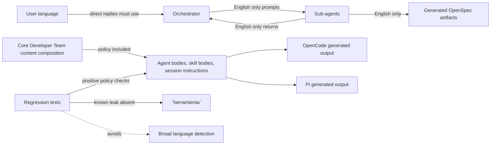

# Spec: Enforce English Agent Artifacts

## Source

- Proposal: `enforce-english-agent-artifacts` proposal artifact
- Context: `enforce-english-agent-artifacts` exploration artifact
- Capabilities affected:
  - `developer-team-language-policy`
  - `generated-content-language-regression`
  - `developer-team-orchestration`
  - `developer-team-content-registry`
  - `developer-team-adapter-installation`
  - `runner-user-language-response`
  - `capability-instruction-composition`

## Requirements

### Capability: Developer Team Language Policy

REQ-LANG-001: Deck-generated Developer Team prompt content MUST state that orchestrator-to-sub-agent prompts, sub-agent-to-orchestrator communication, sub-agent return contracts, and generated OpenSpec artifacts are English only.
  Priority: MUST
  Surface: General
  Rationale: A single observable policy is needed so generated and installed agent behavior is consistent and auditable.

REQ-LANG-002: The English-only policy MUST allow literal non-English text only when it is externally necessary, such as quoted user input, file paths, identifiers, brand names, domain terms, or existing source literals under discussion.
  Priority: MUST
  Surface: General
  Rationale: The policy must not reject legitimate evidence or product/domain literals.

REQ-LANG-003: The English-only policy MUST apply to Deck-owned Developer Team generated content and MUST NOT require direct edits to installed local runner files outside the Deck repository.
  Priority: MUST
  Surface: General
  Rationale: The change scope is Deck source behavior, not machine-local runner configuration.

### Capability: Developer Team Orchestration

REQ-ORCH-001: Generated orchestrator behavior MUST instruct every sub-agent in English only, regardless of the user's language.
  Priority: MUST
  Surface: Integration
  Rationale: Sub-agent inputs are internal team communication and must be stable for downstream agents.

REQ-ORCH-002: Generated orchestrator behavior MUST require sub-agent outputs and artifact-producing return contracts to be English only.
  Priority: MUST
  Surface: Integration
  Rationale: Spec, Design, Task, Apply, Verify, Review, Archive, and related artifacts must remain consistent for audit and consumption.

REQ-ORCH-003: Generated orchestrator behavior MUST require user-facing orchestrator responses to use the user's language.
  Priority: MUST
  Surface: UI
  Rationale: User-facing conversation must remain in the user's language while internal agent communication stays English only.

REQ-ORCH-004: Generated orchestrator behavior SHOULD identify and request repair for sub-agent responses or generated artifacts that violate the English-only policy, except for allowed literal exceptions.
  Priority: SHOULD
  Surface: Integration
  Rationale: The orchestrator is the observable control point for enforcing sub-agent output quality.

### Capability: Developer Team Content Registry

REQ-REG-001: Deck-generated Developer Team agent bodies, skill bodies, and team session instructions MUST include the English-only policy through the core Developer Team content composition surface.
  Priority: MUST
  Surface: Integration
  Rationale: A central generated-content contract reduces drift and covers current and future Developer Team surfaces.

REQ-REG-002: Optional Developer Team capability instruction bundles MUST NOT remove, override, or contradict the English-only policy when composed into generated prompt content.
  Priority: MUST
  Surface: Integration
  Rationale: Capability bundles are part of generated prompts and must preserve the global language contract.

### Capability: Adapter Installation Output

REQ-ADAPT-001: Deck-generated OpenCode adapter output for Developer Team prompts, skills, agents, and install-plan content MUST preserve the English-only policy.
  Priority: MUST
  Surface: Integration
  Rationale: OpenCode materialization is an observable installed-output surface for Deck-generated content.

REQ-ADAPT-002: Deck-generated Pi adapter output for Developer Team prompts, skills, agents, profiles, and install-plan content MUST preserve the English-only policy.
  Priority: MUST
  Surface: Integration
  Rationale: Pi materialization is an observable installed-output surface for Deck-generated content.

REQ-ADAPT-003: Adapter behavior MUST remain limited to generated output and install plans derived from Deck source and MUST NOT directly modify already-installed runner files outside the Deck repository as part of this change.
  Priority: MUST
  Surface: Integration
  Rationale: The scope explicitly excludes direct edits to local runner installations.

### Capability: Known Non-English Leak Regression

REQ-LEAK-001: Deck-generated Developer Team prompt content and adapter materialized output MUST NOT contain the known non-English leak term `herramienta`.
  Priority: MUST
  Surface: General
  Rationale: Exploration confirmed this Spanish term currently leaks into generated prompt content.

REQ-LEAK-002: Regression tests MUST verify absence of `herramienta` on generated Developer Team content and adapter materialization surfaces.
  Priority: MUST
  Surface: General
  Rationale: The confirmed leak must remain fixed across core and adapter outputs.

### Capability: Language Regression Testing

REQ-TEST-001: Regression tests MUST assert positive presence of the English-only policy in core generated Developer Team content and adapter-generated Developer Team output.
  Priority: MUST
  Surface: General
  Rationale: Presence checks verify that the intended policy is communicated to generated and installed prompts.

REQ-TEST-002: Regression tests MUST avoid broad natural-language detection as a required enforcement mechanism.
  Priority: MUST
  Surface: General
  Rationale: Broad language detection can create false positives for quoted user input, file paths, identifiers, brand names, and domain terms.

REQ-TEST-003: Regression tests MAY use a small curated deny-list for confirmed leaks, starting with `herramienta`.
  Priority: MAY
  Surface: General
  Rationale: A targeted deny-list catches known regressions without over-constraining legitimate content.

## Acceptance Scenarios

### Capability: Developer Team Language Policy

#### Scenario: Generated policy states internal English-only behavior
**Given** Deck generates Developer Team prompt content
**When** the generated agent body, skill body, or team session instructions are inspected
**Then** the content states that orchestrator-to-sub-agent prompts, sub-agent communication, return contracts, and generated OpenSpec artifacts are English only.
> Covers: REQ-LANG-001, REQ-REG-001

#### Scenario: Policy permits necessary literal exceptions
**Given** generated prompt content includes the English-only policy
**When** the policy is inspected
**Then** it allows necessary literals such as quoted user input, file paths, identifiers, brand names, domain terms, and source literals under discussion.
> Covers: REQ-LANG-002

#### Scenario: Scope remains within Deck-owned generation
**Given** this change is applied
**When** its observable behavior is reviewed
**Then** the policy affects Deck-owned generated Developer Team content and does not require direct edits to local installed runner files outside the Deck repository.
> Covers: REQ-LANG-003, REQ-ADAPT-003

### Capability: Developer Team Orchestration

#### Scenario: Orchestrator delegates to sub-agents in English
**Given** a user communicates with the orchestrator in any language
**When** the orchestrator prepares a prompt for a sub-agent
**Then** the sub-agent prompt is required to be in English only.
> Covers: REQ-ORCH-001

#### Scenario: Sub-agent outputs and artifacts are English only
**Given** the orchestrator delegates artifact-producing work to a sub-agent
**When** the sub-agent returns its result or writes an OpenSpec artifact
**Then** the return content and generated artifact are required to be in English only, except for allowed literal exceptions.
> Covers: REQ-ORCH-002, REQ-LANG-002

#### Scenario: User-facing orchestrator response uses user language
**Given** the user communicates with the orchestrator in a non-English language
**When** the orchestrator responds directly to the user
**Then** the orchestrator must respond in the user's language while preserving English-only internal sub-agent communication and generated artifacts.
> Covers: REQ-ORCH-003

#### Scenario: Orchestrator requests repair for invalid sub-agent language
**Given** a sub-agent returns non-English content that is not an allowed literal exception
**When** the orchestrator validates the sub-agent output
**Then** the orchestrator should treat the output as policy-violating and request repair before accepting it.
> Covers: REQ-ORCH-004

### Capability: Developer Team Content Registry

#### Scenario: Core generated surfaces include the policy
**Given** Deck core generates Developer Team content
**When** every Developer Team agent body, skill body, and team session instruction surface is inspected
**Then** each generated surface includes the English-only policy.
> Covers: REQ-REG-001, REQ-TEST-001

#### Scenario: Capability bundles preserve the policy
**Given** optional Developer Team capability instructions are composed into generated prompt content
**When** the final generated content is inspected
**Then** the English-only policy remains present and is not contradicted by the capability instructions.
> Covers: REQ-REG-002

### Capability: Adapter Installation Output

#### Scenario: OpenCode generated output preserves the policy
**Given** Deck generates Developer Team install-plan or prompt output for OpenCode
**When** the generated OpenCode output is inspected
**Then** the English-only policy is present in the relevant Developer Team prompt, skill, agent, or install-plan content.
> Covers: REQ-ADAPT-001, REQ-TEST-001

#### Scenario: Pi generated output preserves the policy
**Given** Deck generates Developer Team install-plan or prompt output for Pi
**When** the generated Pi output is inspected
**Then** the English-only policy is present in the relevant Developer Team prompt, skill, agent, profile, or install-plan content.
> Covers: REQ-ADAPT-002, REQ-TEST-001

### Capability: Known Non-English Leak Regression

#### Scenario: Known leak is absent from generated content
**Given** Deck generates Developer Team prompt content
**When** the generated content is inspected
**Then** it does not contain `herramienta`.
> Covers: REQ-LEAK-001, REQ-LEAK-002

#### Scenario: Known leak is absent from adapter output
**Given** Deck generates Developer Team adapter output for supported adapters
**When** the generated adapter output is inspected
**Then** it does not contain `herramienta`.
> Covers: REQ-LEAK-001, REQ-LEAK-002

### Capability: Language Regression Testing

#### Scenario: Tests use positive policy checks
**Given** language-policy regression tests run
**When** they inspect generated Developer Team content and adapter-generated output
**Then** they assert the English-only policy is present on the required generated surfaces.
> Covers: REQ-TEST-001

#### Scenario: Tests avoid broad language detection false positives
**Given** generated content includes legitimate literals such as file paths, identifiers, brand names, quoted user input, or domain terms
**When** language-policy regression tests run
**Then** the tests do not fail solely because broad natural-language detection classifies those literals as non-English.
> Covers: REQ-TEST-002, REQ-LANG-002

#### Scenario: Tests may use curated known-leak checks
**Given** the curated deny-list contains confirmed leak terms
**When** language-policy regression tests run
**Then** the tests may fail only on those confirmed leak terms, including `herramienta`, rather than on broad language classification.
> Covers: REQ-TEST-003, REQ-LEAK-002

## Validation Rules

| Field / Input | Rule | Error Message | REQ-ID |
|---|---|---|---|
| Generated Developer Team internal prompts | Must communicate the English-only policy for sub-agent prompts, sub-agent communication, return contracts, and generated artifacts | Generated Developer Team content is missing the English-only policy. | REQ-LANG-001, REQ-REG-001 |
| Generated Developer Team artifacts | Must be English only except for allowed literal exceptions | Generated artifact violates the English-only policy. | REQ-ORCH-002 |
| Generated Developer Team prompt or adapter output | Must not contain `herramienta` | Generated content contains the known non-English leak `herramienta`. | REQ-LEAK-001 |
| Language regression tests | Must not require broad language detection as the enforcement mechanism | Test approach risks false positives from legitimate literals. | REQ-TEST-002 |

## Error Contracts

| Condition | Error Code | Message | Status |
|---|---|---|---|
| Missing English-only policy in generated content | LANGUAGE_POLICY_MISSING | Generated Developer Team content is missing the English-only policy. | N/A |
| Non-English sub-agent output without an allowed literal exception | LANGUAGE_POLICY_VIOLATION | Sub-agent output must be repaired to English only. | N/A |
| Known leak appears in generated content | KNOWN_LANGUAGE_LEAK | Generated content contains the known non-English leak `herramienta`. | N/A |
| Regression test uses broad language detection as required enforcement | LANGUAGE_TEST_OVERBROAD | Language regression tests must avoid broad detection false positives. | N/A |

## Open Questions

- Should the English-only rule later expand to every Deck team, or remain scoped to the Developer Team for this change?
- Should implementation add only central policy text plus orchestrator reinforcement, or also concise per-agent return-contract reminders for every artifact-writing sub-agent?
- Are there known non-English generated prompt leaks beyond `herramienta`, or should this change limit regression checks to confirmed terms?

## Compliance Matrix

| REQ-ID | Scenario(s) | Status |
|---|---|---|
| REQ-LANG-001 | Generated policy states internal English-only behavior | Defined |
| REQ-LANG-002 | Policy permits necessary literal exceptions; Sub-agent outputs and artifacts are English only; Tests avoid broad language detection false positives | Defined |
| REQ-LANG-003 | Scope remains within Deck-owned generation | Defined |
| REQ-ORCH-001 | Orchestrator delegates to sub-agents in English | Defined |
| REQ-ORCH-002 | Sub-agent outputs and artifacts are English only | Defined |
| REQ-ORCH-003 | User-facing orchestrator response uses user language | Defined |
| REQ-ORCH-004 | Orchestrator requests repair for invalid sub-agent language | Defined |
| REQ-REG-001 | Generated policy states internal English-only behavior; Core generated surfaces include the policy | Defined |
| REQ-REG-002 | Capability bundles preserve the policy | Defined |
| REQ-ADAPT-001 | OpenCode generated output preserves the policy | Defined |
| REQ-ADAPT-002 | Pi generated output preserves the policy | Defined |
| REQ-ADAPT-003 | Scope remains within Deck-owned generation | Defined |
| REQ-LEAK-001 | Known leak is absent from generated content; Known leak is absent from adapter output | Defined |
| REQ-LEAK-002 | Known leak is absent from generated content; Known leak is absent from adapter output; Tests may use curated known-leak checks | Defined |
| REQ-TEST-001 | Core generated surfaces include the policy; OpenCode generated output preserves the policy; Pi generated output preserves the policy; Tests use positive policy checks | Defined |
| REQ-TEST-002 | Tests avoid broad language detection false positives | Defined |
| REQ-TEST-003 | Tests may use curated known-leak checks | Defined |

## Mermaid Summary Source

