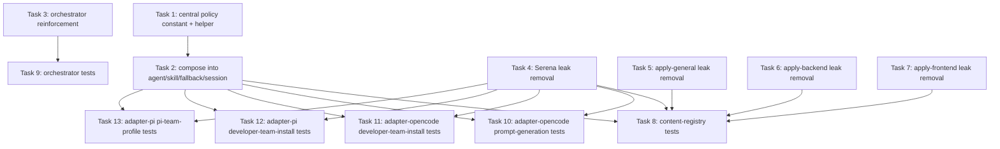

# Tasks: Enforce English Agent Artifacts

## Source

- Spec: `enforce-english-agent-artifacts` spec artifact
- Design: `enforce-english-agent-artifacts` design artifact
- Capabilities affected: `developer-team-language-policy`, `generated-content-language-regression`, `developer-team-orchestration`, `developer-team-content-registry`, `developer-team-adapter-installation`
- User correction preserved: orchestrator-to-user communication MUST use the user's language; orchestrator-to-sub-agent communication, sub-agent returns, and generated OpenSpec artifacts MUST be English only.

## Task Groups

### Group: Shared / Contracts (Core content composition)

#### Task 1: Add central language policy constant and helper in content-registry
**Owner**: General Apply
**Priority**: P0
**Complexity**: Low
**Parallel**: Yes
**Depends on**: none

**Description**
Define one authoritative Developer Team language-policy block in `packages/core/src/teams/developer/content-registry.ts`. Export a `DEVELOPER_TEAM_LANGUAGE_POLICY` constant and a small `appendDeveloperTeamLanguagePolicy(content: string): string` helper. The block must state (in English) that orchestrator-to-sub-agent prompts, sub-agent-to-agent communication, sub-agent return contracts, and generated OpenSpec artifacts are English only; that literal non-English text is permitted only when externally necessary (domain literals, identifiers, file paths, brand/product names, exact error messages, quoted user input); that the orchestrator must respond to the end user in the user's language; and that capability instruction bundles must not contradict this policy.

**Files**
- `packages/core/src/teams/developer/content-registry.ts` — modify

**Verification**
- File compiles under the package's existing TypeScript build.
- `DEVELOPER_TEAM_LANGUAGE_POLICY` is exported and contains the required English-only statement, the allowed literal exceptions, the user-language user-facing requirement, and the capability-bundle preservation clause.
- `appendDeveloperTeamLanguagePolicy(input)` returns `input + "\n\n" + DEVELOPER_TEAM_LANGUAGE_POLICY` for non-empty inputs.

#### Task 2: Compose central policy into agent, skill, fallback, and session surfaces
**Owner**: General Apply
**Priority**: P0
**Complexity**: Medium
**Parallel**: No — must run after Task 1
**Depends on**: Task 1

**Description**
Wire `appendDeveloperTeamLanguagePolicy` into the composition order in `packages/core/src/teams/developer/content-registry.ts`. Apply it in `getAgentContent()` and `getAgentContentResult()` for both `agentBody` and `skillBody`, and in `getTeamSessionInstructions("developer-team")` for the orchestrator session instructions. Composition order must remain: orchestrator invariants → base content → context-authority guidance → Developer Team language policy → optional capability instructions. Fallback path (`fallback: true`) must also receive the policy when fallback content is composed.

**Files**
- `packages/core/src/teams/developer/content-registry.ts` — modify

**Verification**
- For every Developer Team agent ID in the catalog, both `agentBody` and `skillBody` contain `DEVELOPER_TEAM_LANGUAGE_POLICY` substring.
- `getTeamSessionInstructions("developer-team")` contains `DEVELOPER_TEAM_LANGUAGE_POLICY` substring.
- Composition order check: `DEVELOPER_TEAM_LANGUAGE_POLICY` appears after the context-authority guidance substring and before any capability-instruction substring when a capability bundle is provided.

#### Task 3: Reinforce orchestrator prompt and skill body with explicit language policy
**Owner**: General Apply
**Priority**: P0
**Complexity**: Medium
**Parallel**: Yes — independent of Tasks 1-2
**Depends on**: none

**Description**
Modify `packages/core/src/teams/developer/orchestrator-content.ts` to add an explicit `Language Policy` section to the orchestrator system prompt and to the orchestrator skill body. Reinforce: delegation prompts to sub-agents must be English; sub-agent responses and generated artifacts must be English-only; orchestrator must request repair for outputs that violate the English-only rule (except allowed literals); orchestrator must respond directly to the user in the user's language. Clarify the existing "wrong or non-requested language" validation rule so that the requested language for sub-agent phase outputs is English, while direct user-facing orchestration uses the user's language. Do not duplicate the full central policy text; reinforce only orchestrator-specific behavior.

**Files**
- `packages/core/src/teams/developer/orchestrator-content.ts` — modify

**Verification**
- Orchestrator prompt contains a `Language Policy` heading and the four reinforcement points above.
- Orchestrator skill body contains a `Language Policy` heading and the four reinforcement points above.
- The existing `getTeamSessionInstructions("developer-team")` continues to compose the central policy from Task 2 unchanged.

#### Task 4: Replace `herramienta` placeholder in Serena instruction bundle
**Owner**: General Apply
**Priority**: P0
**Complexity**: Low
**Parallel**: Yes — independent of Tasks 1-3
**Depends on**: none

**Description**
In `packages/core/src/teams/developer/instruction-bundles/serena.ts`, replace the confirmed Spanish placeholder token `herramienta` in the Serena fallback message with the English text `[tool]`. Final fallback sentence must read `Serena tools unavailable. Using fallback: [tool].` Ensure no other Spanish text remains in this file.

**Files**
- `packages/core/src/teams/developer/instruction-bundles/serena.ts` — modify

**Verification**
- `rg -n herramienta packages/core/src/teams/developer/instruction-bundles/serena.ts` returns no matches.
- File still exports the same surface used by `content-registry.ts`.

#### Task 5: Replace `herramienta` placeholder in apply-general-content
**Owner**: General Apply
**Priority**: P0
**Complexity**: Low
**Parallel**: Yes — independent of Tasks 1-4
**Depends on**: none

**Description**
In `packages/core/src/teams/developer/apply-general-content.ts`, replace the duplicated Spanish placeholder fallback sentence so it ends with `Using fallback: [tool].` instead of the Spanish placeholder token.

**Files**
- `packages/core/src/teams/developer/apply-general-content.ts` — modify

**Verification**
- `rg -n herramienta packages/core/src/teams/developer/apply-general-content.ts` returns no matches.

#### Task 6: Replace `herramienta` placeholder in apply-backend-content
**Owner**: General Apply
**Priority**: P0
**Complexity**: Low
**Parallel**: Yes — independent of Tasks 1-5
**Depends on**: none

**Description**
In `packages/core/src/teams/developer/apply-backend-content.ts`, replace the duplicated Spanish placeholder fallback sentence so it ends with `Using fallback: [tool].` instead of the Spanish placeholder token.

**Files**
- `packages/core/src/teams/developer/apply-backend-content.ts` — modify

**Verification**
- `rg -n herramienta packages/core/src/teams/developer/apply-backend-content.ts` returns no matches.

#### Task 7: Replace `herramienta` placeholder in apply-frontend-content
**Owner**: General Apply
**Priority**: P0
**Complexity**: Low
**Parallel**: Yes — independent of Tasks 1-6
**Depends on**: none

**Description**
In `packages/core/src/teams/developer/apply-frontend-content.ts`, replace the duplicated Spanish placeholder fallback sentence so it ends with `Using fallback: [tool].` instead of the Spanish placeholder token.

**Files**
- `packages/core/src/teams/developer/apply-frontend-content.ts` — modify

**Verification**
- `rg -n herramienta packages/core/src/teams/developer/apply-frontend-content.ts` returns no matches.

### Group: Shared / Contracts Tests (Core content regression)

#### Task 8: Add content-registry tests for policy presence and leak absence
**Owner**: General Apply
**Priority**: P0
**Complexity**: Medium
**Parallel**: No — depends on Tasks 1-2 and 4-7
**Depends on**: Task 1, Task 2, Task 4, Task 5, Task 6, Task 7

**Description**
Extend `packages/core/src/teams/developer/content-registry.test.ts`. For every Developer Team agent ID in the catalog, assert `agentBody` and `skillBody` contain `DEVELOPER_TEAM_LANGUAGE_POLICY` and do not contain `herramienta`. Assert `getTeamSessionInstructions("developer-team")` contains `DEVELOPER_TEAM_LANGUAGE_POLICY` and does not contain `herramienta`. Repeat with a representative capability instruction bundle (Serena) to prove composed output still contains the policy and does not contain the leak. Assert the fallback path `getAgentContentResult(id, { fallback: true })` also receives the policy when fallback content is available.

**Files**
- `packages/core/src/teams/developer/content-registry.test.ts` — modify

**Verification**
- `bun test packages/core/src/teams/developer/content-registry.test.ts` passes.
- Tests assert positive policy presence (REQ-TEST-001) and absence of `herramienta` (REQ-LEAK-001/002) without requiring broad language detection (REQ-TEST-002).

#### Task 9: Add orchestrator-content tests for delegation, validation, and user-language requirement
**Owner**: General Apply
**Priority**: P1
**Complexity**: Low
**Parallel**: No — depends on Task 3
**Depends on**: Task 3

**Description**
Extend `packages/core/src/teams/developer/orchestrator-content.test.ts`. Assert the orchestrator prompt contains a `Language Policy` heading and the four reinforcement points: English-only delegation prompts, English-only sub-agent responses and artifacts, request-repair for non-English outputs (with allowed literal exceptions), and user-facing responses in the user's language. Assert the orchestrator skill body carries the same reinforcement.

**Files**
- `packages/core/src/teams/developer/orchestrator-content.test.ts` — modify

**Verification**
- `bun test packages/core/src/teams/developer/orchestrator-content.test.ts` passes.
- Test failure messages identify the orchestrator surface (`prompt`, `skillBody`) where the policy is missing.

### Group: Backend (Adapter materialization regression)

#### Task 10: Add adapter-opencode prompt-generation regression tests
**Owner**: Backend Apply
**Priority**: P1
**Complexity**: Medium
**Parallel**: No — depends on Tasks 1-2 and 4-7
**Depends on**: Task 1, Task 2, Task 4, Task 5, Task 6, Task 7

**Description**
Extend `packages/adapter-opencode/src/prompt-generation.test.ts`. For every planned OpenCode prompt content string produced by `buildPromptGenerationPlan()`, assert the content contains `DEVELOPER_TEAM_LANGUAGE_POLICY` and does not contain `herramienta`. Cover both the orchestrator prompt (from `getTeamSessionInstructions`) and sub-agent prompts (from `getAgentContent`).

**Files**
- `packages/adapter-opencode/src/prompt-generation.test.ts` — modify

**Verification**
- `bun test packages/adapter-opencode/src/prompt-generation.test.ts` passes.
- Test scans every planned prompt file path returned by the plan.

#### Task 11: Add adapter-opencode developer-team-install regression tests
**Owner**: Backend Apply
**Priority**: P1
**Complexity**: Medium
**Parallel**: Yes — runs in parallel with Task 10
**Depends on**: Task 1, Task 2, Task 4, Task 5, Task 6, Task 7

**Description**
Extend `packages/adapter-opencode/src/developer-team-install.test.ts`. Scan every planned OpenCode skill file content string produced by `buildOpenCodeDeveloperTeamInstallPlan()` and assert the content contains `DEVELOPER_TEAM_LANGUAGE_POLICY` and does not contain `herramienta`.

**Files**
- `packages/adapter-opencode/src/developer-team-install.test.ts` — modify

**Verification**
- `bun test packages/adapter-opencode/src/developer-team-install.test.ts` passes.
- Test scans every planned skill file path returned by the install plan.

#### Task 12: Add adapter-pi developer-team-install regression tests
**Owner**: Backend Apply
**Priority**: P1
**Complexity**: Medium
**Parallel**: Yes — runs in parallel with Tasks 10-11
**Depends on**: Task 1, Task 2, Task 4, Task 5, Task 6, Task 7

**Description**
Extend `packages/adapter-pi/src/developer-team-install.test.ts`. Scan every planned Pi non-orchestrator agent file and skill file content string produced by `buildDeveloperTeamInstallPlan()` and assert the content contains `DEVELOPER_TEAM_LANGUAGE_POLICY` and does not contain `herramienta`.

**Files**
- `packages/adapter-pi/src/developer-team-install.test.ts` — modify

**Verification**
- `bun test packages/adapter-pi/src/developer-team-install.test.ts` passes.

#### Task 13: Add adapter-pi pi-team-profile regression tests
**Owner**: Backend Apply
**Priority**: P1
**Complexity**: Medium
**Parallel**: Yes — runs in parallel with Tasks 10-12
**Depends on**: Task 1, Task 2, Task 4, Task 5, Task 6, Task 7

**Description**
Extend `packages/adapter-pi/src/pi-team-profile.test.ts`. Assert that the materialized profile output for `developer-team` (the `system-prompt.md` produced by `buildTeamSystemPrompt()` / `materializeTeamProfile()`) contains `DEVELOPER_TEAM_LANGUAGE_POLICY` and does not contain `herramienta`. The Pi orchestrator stub is not authoritative — verify the runtime profile path instead.

**Files**
- `packages/adapter-pi/src/pi-team-profile.test.ts` — modify

**Verification**
- `bun test packages/adapter-pi/src/pi-team-profile.test.ts` passes.
- Test failure messages identify the profile surface where the policy is missing or the leak is present.

## Dependency Graph

```
Task 1 (Shared: central policy constant/helper)
  └─→ Task 2 (Shared: compose policy into surfaces)
       └─→ Task 8 (Shared tests: content-registry)
Task 3 (Shared: orchestrator reinforcement)
  └─→ Task 9 (Shared tests: orchestrator)
Task 4 (Shared: Serena leak removal)
Task 5 (Shared: apply-general leak removal)
Task 6 (Shared: apply-backend leak removal)
Task 7 (Shared: apply-frontend leak removal)
  └─→ Task 8 (Shared tests: content-registry)
Task 10 (Backend: adapter-opencode prompt-generation tests)
Task 11 (Backend: adapter-opencode developer-team-install tests)
Task 12 (Backend: adapter-pi developer-team-install tests)
Task 13 (Backend: adapter-pi pi-team-profile tests)
```

## Parallelization Plan

| Phase | Tasks | Can Run in Parallel |
|---|---|---|
| Shared content (independent) | 1, 3, 4, 5, 6, 7 | Yes |
| Shared content (depends on 1) | 2 | No — after Task 1 |
| Shared tests | 8 (after 1, 2, 4-7), 9 (after 3) | Within phase: serial; cross task: 8 and 9 can run in parallel |
| Backend tests | 10, 11, 12, 13 (all after 1, 2, 4-7) | Yes |

## Responsibility Contracts

| Contract / Boundary | Owner | Consumers | Notes |
|---|---|---|---|
| `DEVELOPER_TEAM_LANGUAGE_POLICY` constant + `appendDeveloperTeamLanguagePolicy` helper | General Apply (Task 1) | General Apply (Tasks 2, 8, 9), Backend Apply (Tasks 10-13) | Single authoritative source; capability bundles must not contradict. |
| `getAgentContent` / `getTeamSessionInstructions` composition order | General Apply (Task 2) | Backend Apply (Tasks 10-13) | Central policy injected after context-authority guidance, before capability bundles. |
| Orchestrator reinforcement wording | General Apply (Task 3) | General Apply (Task 9) | Reinforces delegation/validation/user-language behavior; does not redefine central policy. |
| Adapter materialization contracts | Backend Apply (Tasks 10-13) | None new | No adapter API shape changes; content-only verification. |

## Complexity Summary

| Complexity | Count | Task Numbers |
|---|---|---|
| Low | 6 | 1, 4, 5, 6, 7, 9 |
| Medium | 7 | 2, 3, 8, 10, 11, 12, 13 |
| High | 0 | — |

## Flagged for Splitting

None. All tasks fit a single session and touch at most 2 files.

## Review Workload Forecast

| Signal | Value |
|---|---|
| Estimated changed lines | 100-400 |
| 400-line budget risk | Low |
| Scope reduction recommended | No |
| Sequential work slices recommended | No |
| Decision needed before Apply | No |

**Rationale**: Six core content files receive small additive edits (central policy block, orchestrator reinforcement section, four one-line placeholder replacements) totaling roughly 60-120 changed lines. Six test files each add a focused iteration/scan block estimated at 20-50 lines per file. Total estimate lands in the 200-350 line band — well below the 400-line advisory threshold. No new dependencies, no new abstractions, and no security/API surface changes are introduced. Apply can proceed without scope reduction or sequential slicing. Quality override: tests intentionally cover every Developer Team agent ID and every planned adapter file path, which is a completeness requirement from REQ-TEST-001 and REQ-LEAK-002 and overrides any pressure to shrink coverage.

## Open Questions / Blockers

None — tasks are ready for Apply.

The three open questions recorded in the Spec are non-blocking for this change:
- Future expansion beyond the Developer Team → out of scope, deferred to a follow-up change.
- Per-agent return-contract reminders → resolved by Design (central policy + orchestrator reinforcement only).
- Other non-English leaks beyond `herramienta` → Design limits the deny-list to confirmed terms; additional leaks discovered during Apply can be added without changing the architecture.

## Mermaid Summary Source


