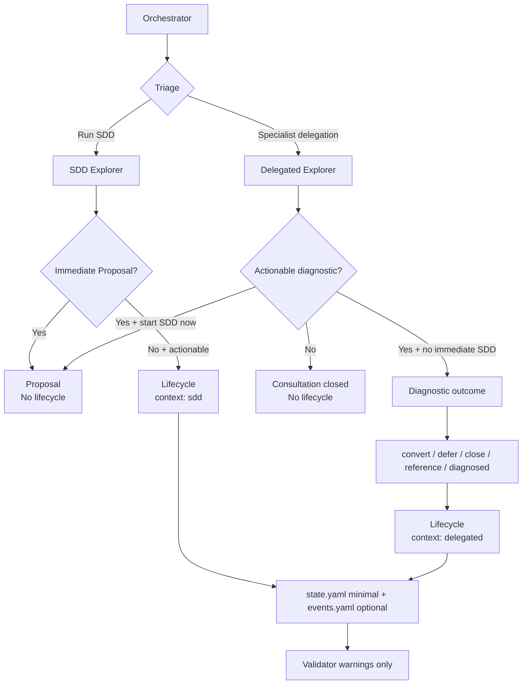

# Design: Exploration lifecycle states

## Source

- Proposal: `openspec/changes/exploration-lifecycle-states/proposal.md`
- Exploration: `openspec/changes/exploration-lifecycle-states/exploration.md`
- Spec: `openspec/changes/exploration-lifecycle-states/spec.md` available; Design repair incorporates later user clarification.
- Capabilities affected: `exploration-lifecycle`, `developer-orchestrator-flow`, `openspec-registry-schema`
- Registry mode: deferred — write only this artifact; return registry intent to Orchestrator.
- Repair clarification: historical examples were not necessarily formal Run SDD Explorer stops. They may also be Orchestrator-delegated Explorer investigations used for pre-SDD analysis.

## Current Architecture Context

- `packages/core/src/teams/developer/orchestrator-content.ts` separates formal SDD flow from role-based delegation:
  - Run SDD uses canonical `Explorer -> Proposal -> Spec + Design -> Tasks -> Apply -> Verify + Review -> Archive`.
  - Non-SDD Specialist delegation can send bounded analysis to `deck-developer-explorer` without committing to SDD.
- `packages/core/src/teams/developer/explorer-content.ts` treats Explorer as a terminal investigation agent. It can produce diagnosis/recommendations but currently has only `explore completed` / `blocked` semantics for formal artifacts.
- `proposal-content.ts` already allows Proposal to consume either Explorer findings or a direct user idea, so delegated Explorer output can later become SDD input without requiring it to be SDD at creation time.
- OpenSpec registry is per-change with `state.yaml` as a minimal index and `events.yaml` as an audit log. Parallel phases use registry-deferred mode to avoid write races.
- `openspec/registry-schema.md` and `packages/core/src/spec-registry/*` support canonical registry validation; lifecycle validation must stay optional/warning-level to avoid false positives.

## Proposed Architecture

Model exploration lifecycle as an optional diagnostic outcome record across two contexts:

1. **Formal SDD Explorer stopped before Proposal** — Run SDD was selected, Explorer completed with an actionable diagnosis, and the SDD flow pauses before Proposal.
2. **Delegated Explorer non-SDD with actionable diagnosis** — Orchestrator delegated a focused Explorer analysis before deciding whether SDD is warranted, and the result contains an actionable diagnosis but no immediate SDD start.

The lifecycle remains auxiliary: no new SDD phase, no global status, no Apply gate, no required artifact beyond existing registry surfaces.

### Component / Module Boundaries

| Component | Responsibility | Change Type |
|---|---|---|
| `packages/core/src/teams/developer/orchestrator-content.ts` | Distinguish Run SDD Explorer from delegated Explorer; decide convert/defer/close/reference outcomes | modified |
| `packages/core/src/teams/developer/explorer-content.ts` | Report actionable diagnostic outcome without deciding lifecycle itself | modified |
| `packages/core/src/teams/developer/proposal-content.ts` | Continue accepting Explorer findings as Proposal input; no major behavior change expected | unchanged/minor wording |
| `openspec/registry-schema.md` | Document optional lifecycle fields/events for both contexts | modified |
| `packages/core/src/spec-registry/schema.ts` | Add lifecycle constants and warning rule codes | modified |
| `packages/core/src/spec-registry/types.ts` | Extend validator result rule typing if rule codes are enumerated | modified |
| `packages/core/src/spec-registry/validator.ts` | Validate lifecycle fields only when present; keep warning-level | modified |
| Team prompt/content tests | Protect SDD and delegated anti-bureaucracy semantics | modified |
| Spec-registry tests | Protect warning-only, low-false-positive behavior | modified |

## Data Flow

### Context A — Formal Run SDD Explorer stopped before Proposal

1. User/Orchestrator selects Run SDD.
2. Orchestrator launches Explorer first.
3. Explorer returns `completed` with actionable diagnosis, or `blocked` with open questions.
4. Orchestrator branches:
   - `blocked` / unclear: preserve existing blocked behavior; no lifecycle.
   - immediate Proposal: start Proposal; no lifecycle prompt or registry lifecycle.
   - stopped before Proposal with actionable diagnosis: record lifecycle outcome.
5. Later decisions can convert to Proposal, defer, close no action, or reference another change.

### Context B — Delegated Explorer non-SDD with diagnostic outcome

1. Triage classifies request as `Specialist(s)` or bounded analysis, not Run SDD.
2. Orchestrator delegates to Explorer for focused investigation.
3. Explorer returns analysis and may identify an actionable diagnosis.
4. Orchestrator records lifecycle only when all are true:
   - diagnosis is actionable;
   - SDD is **not** started immediately;
   - there is a meaningful next action to preserve (`convert`, `defer`, `close`, or `reference`).
5. If the user immediately starts SDD or asks for Proposal, the Proposal/SDD artifact becomes the record; no separate delegated lifecycle is needed.
6. If the delegation was only a factual query, code reading, or non-actionable analysis, no lifecycle is recorded.

### Flow Diagram

```mermaid
flowchart TD
  A[Orchestrator triage] --> B{Run SDD?}
  B -->|Yes| C[Formal SDD Explorer]
  C --> D{Explorer outcome}
  D -->|blocked or unclear| E[Existing blocked flow\nNo lifecycle]
  D -->|completed + immediate Proposal| F[Proposal starts\nNo lifecycle]
  D -->|completed + actionable + stopped| G[Record lifecycle\nexploration_context: sdd]

  B -->|No: Specialist(s)| H[Delegated Explorer]
  H --> I{Diagnostic outcome?}
  I -->|No actionable diagnosis| J[Close normal consultation\nNo lifecycle]
  I -->|Actionable + starts SDD now| F
  I -->|Actionable + no immediate SDD| K{Outcome decision}
  K -->|convert| L[converted-to-change\nreference proposal/change]
  K -->|defer| M[deferred\nreason + reactivation]
  K -->|close| N[closed-no-action\nbrief reason]
  K -->|reference only| O[referenced\nlink existing artifact/change]
  K -->|decision pending| P[diagnosed\nnext_action required]
  L --> Q[Record lifecycle\nexploration_context: delegated]
  M --> Q
  N --> Q
  O --> Q
  P --> Q
```

## API / Contract Implications

| Endpoint / Interface | Change | Backward Compatible |
|---|---|---|
| Explorer return contract | Add optional `Diagnostic Outcome` / `Actionable Diagnosis: yes/no` guidance; Explorer does not decide SDD lifecycle alone | yes |
| Orchestrator triage contract | Add branch for delegated Explorer diagnostic outcomes: convert/defer/close/reference/diagnosed | yes |
| `state.yaml` optional fields | Add `exploration_context`, `lifecycle_status`, `next_action`; optional reason/reference metadata | yes |
| `events.yaml` optional events | Add auxiliary lifecycle events for both `sdd` and `delegated` context | yes |
| Validator result API | Add warning-only lifecycle rule codes; no failing outcome solely for lifecycle fields | yes |

## State / Persistence Implications

No new artifact files or persistence stores.

### Minimal registry shape

Use only when lifecycle applies:

```yaml
exploration_context: sdd | delegated
lifecycle_status: diagnosed | deferred | closed-no-action | converted-to-change | referenced
next_action: "short explicit next action"
```

Optional, brief fields when useful:

```yaml
lifecycle_reason: "short reason"
lifecycle_ref: "proposal.md | target-change-id | external-reference"
decision_required: true
```

Rules:

- `exploration_context: sdd` means formal Run SDD Explorer paused before Proposal.
- `exploration_context: delegated` means Orchestrator delegated Explorer outside formal SDD.
- `lifecycle_status` is auxiliary and MUST NOT replace canonical `currentPhase`, `phase`, or global `status`.
- `next_action` is required for `diagnosed` and recommended for `deferred`.
- `converted-to-change` references a later Proposal or target change.
- `referenced` is for delegated diagnostic work that should be preserved as input/context for an existing change without becoming its own SDD conversion.
- Rich diagnosis remains in `exploration.md` or the delegated Explorer report; registry state stays minimal.

### Auxiliary events

Events remain optional and auditable. Suggested names:

- `exploration.diagnosed`
- `exploration.deferred`
- `exploration.closed-no-action`
- `exploration.converted-to-change`
- `exploration.referenced`

Minimum event payload expectation: actor, timestamp, artifact/report reference, `exploration_context`, `lifecycle_status`, and a brief note/reference.

## Migration / Backward Compatibility

- No automatic migration of historical explorations.
- Existing changes with no lifecycle fields remain valid.
- Formal SDD direct Explorer → Proposal remains unchanged and frictionless.
- Delegated Explorer consultations remain unchanged unless they produce actionable diagnosis and no immediate SDD starts.
- Validator support remains warning-level and should initially validate only present lifecycle fields/events.
- The earlier proposal term `exploration_lifecycle` should be treated as superseded by `lifecycle_status` in implementation docs, or documented as a compatibility alias only if existing artifacts already use it.

## Orchestrator Behavior

| Context | Condition | Behavior |
|---|---|---|
| SDD | Explorer `blocked` or diagnosis unclear | Existing blocked/open-question behavior; no lifecycle |
| SDD | Explorer completed and Proposal starts immediately | No lifecycle prompt/write |
| SDD | Explorer completed with actionable diagnosis and pauses before Proposal | Record `exploration_context: sdd`, `lifecycle_status: diagnosed`, `next_action` |
| Delegated | Explorer returns non-actionable query/analysis | Close/respond normally; no lifecycle |
| Delegated | Actionable diagnosis and user starts SDD/Proposal immediately | Start SDD/Proposal; no separate delegated lifecycle |
| Delegated | Actionable diagnosis and no immediate SDD | Record outcome only if it is useful: `diagnosed`, `deferred`, `closed-no-action`, `converted-to-change`, or `referenced` |

Anti-bureaucracy rule: no lifecycle for consultations, codebase reads, PRD/proposal drafting, or exploratory Q&A that does not leave an actionable diagnostic next step.

## Prompt / Content Changes Needed

| Surface | Required design change |
|---|---|
| Explorer skill methodology | Add optional “Diagnostic outcome” language: identify actionable diagnosis and whether it is ready for Proposal/SDD, but do not force lifecycle. |
| Explorer return contract | Add optional fields/lines: `Actionable Diagnosis: yes/no`, `Recommended Next Action: propose | defer | close | reference | none`. |
| Orchestrator triage prompt | Explicitly distinguish Run SDD Explorer from delegated Explorer analysis. |
| Orchestrator post-Explorer behavior | Add delegated branch: record lifecycle only for actionable diagnosis when SDD is not started immediately. |
| Registry instructions | Use minimal `exploration_context`, `lifecycle_status`, `next_action`; preserve canonical events. |
| Anti-bureaucracy wording | Forbid lifecycle prompts/writes for simple consultations and direct conversion to SDD/Proposal. |

## File Impact Estimate

| File / Path | Action | Rationale |
|---|---|---|
| `openspec/changes/exploration-lifecycle-states/design.md` | modify | Repair design for SDD and delegated Explorer contexts |
| `packages/core/src/teams/developer/orchestrator-content.ts` | modify | Add post-delegated-Explorer diagnostic outcome branch and SDD branch |
| `packages/core/src/teams/developer/orchestrator-content.test.ts` | modify | Assert delegated actionable diagnosis behavior and no lifecycle for consultations/direct SDD |
| `packages/core/src/teams/developer/explorer-content.ts` | modify | Add optional diagnostic outcome guidance |
| `packages/core/src/teams/developer/explorer-content.test.ts` | modify | Assert Explorer reports actionable diagnosis without forcing lifecycle |
| `openspec/registry-schema.md` | modify | Document optional minimal shape and warning-level semantics |
| `packages/core/src/spec-registry/schema.ts` | modify | Add context/status constants and warning rule codes |
| `packages/core/src/spec-registry/types.ts` | modify | Extend rule typing if needed |
| `packages/core/src/spec-registry/validator.ts` | modify | Warning-only validation for present lifecycle fields/events |
| `packages/core/src/spec-registry/validator.test.ts` | modify | Cover valid/invalid lifecycle fields and false-positive avoidance |
| `packages/core/src/spec-registry/types.test.ts` | modify if exhaustive | Cover rule-code type changes |

## Testing Strategy

- Prompt/content tests:
  - Orchestrator distinguishes `Run SDD` vs delegated Explorer.
  - SDD Explorer → immediate Proposal has no lifecycle ceremony.
  - Delegated Explorer with actionable diagnosis and no immediate SDD records only a minimal outcome.
  - Delegated consultation/non-actionable analysis records no lifecycle.
- Validator/docs tests:
  - `exploration_context: sdd | delegated` accepted when present.
  - Unknown `exploration_context` / `lifecycle_status` emits warnings, not errors.
  - Missing lifecycle fields are not errors.
  - Optional “missing lifecycle” heuristic is absent initially or proven low-noise by narrow fixture evidence.
  - Existing canonical phase/status errors remain strict.

## Observability / Error Handling

- No runtime logging/monitoring changes.
- Lifecycle events provide auditability when written.
- Validator warnings should include change id, file, field, rule code, and concise remediation.

## Security / Performance / Accessibility Considerations

- Security: none specific to this change.
- Performance: local per-change validation only; negligible expected impact.
- Accessibility: no UI changes.

## Tradeoffs

| Decision | Chosen | Rejected Alternative | Rationale |
|---|---|---|---|
| Coverage | Support both SDD and delegated Explorer contexts | Treat all cases as formal SDD Explorer stops | Matches clarified history and avoids forcing SDD semantics onto bounded analysis |
| Registry shape | `exploration_context` + `lifecycle_status` + `next_action` | Single `exploration_lifecycle` field only | Context is required to distinguish SDD pause from delegated diagnostic outcome |
| Delegated behavior | Record only actionable non-immediate outcomes | Record every Explorer delegation | Avoids bureaucracy and noisy registry entries |
| Direct conversion | No separate lifecycle when SDD/Proposal starts immediately | Always record `converted-to-change` | Proposal artifact/event already provides traceability |
| Validator | Warning-only, present-field validation first | Strict missing-lifecycle detection | Keeps false positives low and preserves compatibility |

## Risks

| Risk | Likelihood | Impact | Mitigation |
|---|---|---|---|
| Lifecycle becomes bureaucracy for every delegated Explorer | Medium | Medium | Prompt rule: no lifecycle for consultations or immediate SDD conversion |
| Spec/design naming drift (`exploration_lifecycle` vs `lifecycle_status`) | Medium | Medium | Task phase should align schema/docs/tests on repaired minimal shape |
| False-positive validator warnings for missing lifecycle | Medium | Medium | Initial validator validates only fields/events when present |
| Ambiguous delegated `referenced` status | Low | Low | Require `lifecycle_ref` and brief note when used |
| Confusion with canonical SDD phases | Low | Medium | Keep context/status auxiliary and documented outside `currentPhase` / `status` enums |

## Open Decisions

- None blocking. Non-blocking: Task/Spec alignment should decide whether to keep `referenced` as a lifecycle status or model it as `converted-to-change` with an existing-change reference.

## Dependencies

- Existing Orchestrator triage distinction between Run SDD and Specialist delegation.
- Existing Spec Registry validator boundary in `packages/core/src/spec-registry/`.
- Registry-deferred orchestration for parallel OpenSpec phase writes.

## Next Steps

Ready for Task (`deck-developer-task`) to combine repaired Design with Spec and break into implementation tasks. Do not execute Tasks in this phase.

## Mermaid Summary Source


