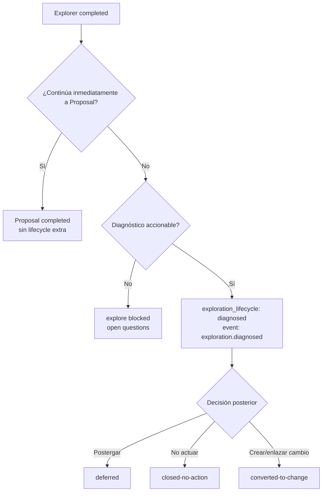

# Proposal: Exploration lifecycle states

## Intent

El flujo SDD registra `explore completed`, pero no distingue si una exploración con diagnóstico accionable quedó pendiente de decisión, fue postergada, se cerró sin acción o se convirtió en cambio formal. Esto deja cambios “flotantes” cuando Explorer encuentra causa raíz y el flujo no continúa inmediatamente a Proposal.

## Goal

Agregar un lifecycle opcional, liviano y auditable para exploraciones diagnosticadas que se detienen después de Explorer, sin cambiar las fases SDD canónicas ni añadir fricción al flujo normal Explorer → Proposal.

## Principios anti-burocracia

- Aplicar sólo cuando Explorer termina con diagnóstico accionable y el flujo se detiene antes de Proposal.
- No pedir decisión lifecycle si el usuario/Orchestrator continúa inmediatamente a Proposal.
- No crear artifacts nuevos: usar `exploration.md`, `state.yaml` y `events.yaml`.
- Mantener `state.yaml` como índice mínimo; el razonamiento vive en el artifact y los eventos.
- No convertir lifecycle en fase SDD, gate de Apply ni bloqueo estricto del validator.
- No migrar históricos automáticamente dentro de este cambio.

## Scope

### In Scope

- Definir estados lifecycle opcionales para exploraciones diagnosticadas detenidas.
- Actualizar reglas de Orchestrator tras Explorer en modo Interactive/Automatic sin fricción cuando continúa a Proposal.
- Registrar estado mínimo en `state.yaml` y transición auditable en `events.yaml`.
- Documentar `exploration_lifecycle` en `openspec/registry-schema.md` como campo opcional con validación warning-level.
- Añadir/ajustar pruebas de contenido o prompts que protejan la semántica anti-burocracia.

### Out of Scope

- Cambiar fases SDD canónicas o status globales existentes.
- Añadir una fase `diagnosed` al pipeline.
- Convertir validator warnings en errores estrictos.
- Cambiar el precondition closure gate.
- Modificar código producto fuera de la metodología/prompts/registry docs/tests aplicables.

### Follow-ups

- Cleanup manual de exploraciones históricas detectadas por auditoría.
- Doctor/listado de exploraciones `diagnosed` o `deferred` pendientes.
- Migración asistida si más cambios históricos justifican automatización.

## Affected Capabilities

> Contrato para Spec y Design.

### New Capabilities

- `exploration-lifecycle`: lifecycle opcional para clasificar exploraciones diagnosticadas que no avanzan inmediatamente a Proposal.

### Modified Capabilities

- `developer-orchestrator-flow`: regla posterior a Explorer para continuar, deferir, cerrar sin acción o registrar diagnóstico pendiente sólo cuando el flujo se detiene.
- `openspec-registry-schema`: documentación y validación warning-level para `exploration_lifecycle` y eventos relacionados.

### Unchanged Capabilities

- `sdd-phase-model`: fases canónicas permanecen `explore → proposal → spec → design → tasks → apply → verify → review → archive → closed`.
- `precondition-closure-gate`: no cambia; este lifecycle ocurre antes de Proposal, no antes de Apply.

## Estados propuestos y semántica

| Estado | Semántica | Requisitos mínimos |
|---|---|---|
| `diagnosed` | Explorer encontró diagnóstico accionable, pero no se decidió avanzar, deferir o cerrar. | `decision_required: true`, razón corta, `next_action` explícito. |
| `deferred` | Diagnóstico reconocido y postergado por prioridad, dependencia o condición externa. | Motivo y condición mínima de reactivación. |
| `closed-no-action` | Diagnóstico reconocido y se decide no implementar. | Razón breve para evitar reaperturas ambiguas. |
| `converted-to-change` | Diagnóstico usado para continuar a Proposal o enlazar otro change después de una pausa/decisión explícita. | Referencia a `proposal.md` o change destino. |

Estos valores son lifecycle de exploración, no `currentPhase` ni `status` global.

## Reglas de Orchestrator tras Explorer

- Si Explorer queda `blocked`: mantener flujo actual con preguntas/bloqueadores; no usar `exploration_lifecycle`.
- Si Explorer `completed` y el flujo continúa inmediatamente a Proposal: no pedir ni registrar lifecycle adicional.
- Si Explorer `completed`, hay diagnóstico accionable y el flujo se detiene: registrar `exploration_lifecycle: diagnosed` y evento `exploration.diagnosed`.
- Si el usuario decide postergar: registrar `deferred` con motivo y condición de reactivación.
- Si el usuario decide no actuar: registrar `closed-no-action` con razón breve.
- Si tras una pausa se crea Proposal o se enlaza otro change: registrar `converted-to-change` con referencia idempotente.

## Registro mínimo state/events

### `state.yaml`

Campos opcionales sugeridos cuando aplique:

```yaml
exploration_lifecycle: diagnosed | deferred | closed-no-action | converted-to-change
decision_required: true
next_action: decide-proposal-defer-or-close
```

- `artifacts.exploration` sigue apuntando a `exploration.md`.
- No duplicar diagnóstico extenso en state; usar nota/provenance breve.
- Si el flujo avanza a Proposal sin pausa, `currentPhase: proposal` y `artifacts.proposal` bastan.

### `events.yaml`

Eventos auxiliares recomendados:

- `exploration.diagnosed`
- `exploration.deferred`
- `exploration.closed-no-action`
- `exploration.converted-to-change`

Los eventos deben incluir actor, timestamp, artifact y nota breve. No reemplazan eventos canónicos como `explore.completed` o `proposal.completed`.

## Interacción con registry-schema docs/validator

- Documentar `exploration_lifecycle` en `openspec/registry-schema.md` como campo opcional.
- Validar valores desconocidos como warning-level, no error, para preservar compatibilidad y evitar bloquear cambios existentes.
- Añadir warning para `explore completed` sin Proposal ni lifecycle sólo si el validator puede hacerlo sin falsos positivos graves.
- Mantener errores estrictos para campos canónicos existentes; el lifecycle auxiliar no debe ampliar enums de `currentPhase` o `status`.

## Approach

Implementar una convención mínima en prompts/docs/registry: Explorer identifica diagnóstico accionable; Orchestrator sólo solicita o registra decisión lifecycle cuando se detiene tras Explorer; registry-schema documenta el campo opcional y el validator lo trata como warning-level.

## Alternatives and Tradeoffs

| Alternative | Why Considered | Why Not Chosen |
|---|---|---|
| Sólo `exploration.md` | Cero cambios de registry/schema. | No es consultable ni auditable como estado operativo. |
| State + events opcionales | Consultable, auditable y no cambia fases core. | Requiere convención nueva y pruebas de prompts. Elegida. |
| Nueva fase/status canónico | Máxima formalidad. | Burocracia alta, riesgo de romper validator/pipeline y mezcla lifecycle auxiliar con SDD core. |

## Risks

| Risk | Likelihood | Mitigation |
|---|---|---|
| Burocracia adicional en cada Explorer | Medium | Aplicar sólo si el flujo se detiene tras Explorer; no pedir lifecycle al continuar a Proposal. |
| Drift con schema/validator | Medium | Campo opcional documentado y warnings exit code 0. |
| Ambigüedad entre `diagnosed` y `deferred` | Medium | `diagnosed` exige decisión pendiente; `deferred` ya contiene decisión de postergar. |
| Confusión con precondition gate | Low | Documentar que aplica antes de Proposal; precondition gate sigue antes de Apply. |
| Eventos auxiliares no canónicos rompen herramientas | Low | Mantener eventos canónicos y tratar lifecycle como warning/documentación auxiliar. |

## Rollback Plan

- Revertir cambios de prompts/docs/tests relacionados con lifecycle.
- Eliminar o ignorar `exploration_lifecycle`, `decision_required` y `next_action` en `state.yaml` de cambios afectados.
- Mantener `exploration.md` y eventos canónicos existentes; los eventos lifecycle pueden quedar como histórico no operativo o eliminarse en cleanup manual si se decide.
- El flujo SDD vuelve a depender sólo de `explore completed` y Proposal posterior.

## Dependencies

- Decisión aprobada: `exploration_lifecycle` entra en `openspec/registry-schema.md` como opcional/warning-level.
- Decisión aprobada: Orchestrator sólo pide/registra lifecycle si el flujo se detiene tras Explorer.
- Registry actual con `state.yaml`/`events.yaml` por change.

## Open Questions

- None — proposal is self-contained.

## Acceptance Direction / Criterios de éxito

- [ ] Orchestrator no añade fricción cuando Explorer continúa inmediatamente a Proposal.
- [ ] Una exploración diagnosticada detenida queda consultable mediante `exploration_lifecycle` y evento lifecycle.
- [ ] `openspec/registry-schema.md` documenta `exploration_lifecycle` como opcional y warning-level.
- [ ] Los eventos lifecycle preservan historial sin reemplazar `explore.completed` ni `proposal.completed`.
- [ ] Pruebas o checks de contenido cubren anti-burocracia y valores lifecycle esperados.

## Next Steps

Ready for Spec (`deck-developer-spec`) and Design (`deck-developer-design`) in parallel.

## Mermaid Summary Source


