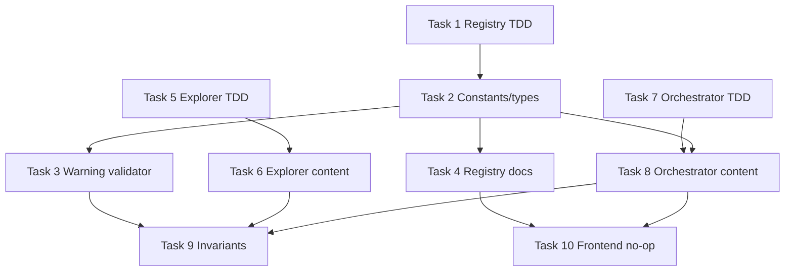

# Tasks: Exploration lifecycle states

## Source

- Spec: `exploration-lifecycle-states` spec artifact
- Design: `exploration-lifecycle-states` design artifact
- Capabilities affected: `exploration-lifecycle`, `developer-orchestrator-flow`, `openspec-registry-schema`

## Task Groups

### Group: Shared / Contracts

#### Task 1: Add failing registry lifecycle schema tests first
**Owner**: General Apply  
**Priority**: P0  
**Complexity**: Medium  
**Parallel**: No — establishes TDD expectations for shared registry behavior  
**Depends on**: none

**Description**  
Add failing tests for optional lifecycle fields and lifecycle events before implementation. Cover `exploration_context: sdd | delegated`, canonical `lifecycle_status` values, `next_action` for `diagnosed`, warning-only invalid lifecycle/context values, and unchanged strict canonical phase/status errors.

**Files**
- `packages/core/src/spec-registry/validator.test.ts` — modify
- `packages/core/src/spec-registry/types.test.ts` — modify if exhaustive rule-code tests exist

**Verification**  
Run `bun test packages/core/src/spec-registry/validator.test.ts` and confirm new lifecycle tests fail for missing implementation while existing canonical validator tests still compile.

#### Task 2: Implement shared lifecycle constants and warning rule types
**Owner**: General Apply  
**Priority**: P0  
**Complexity**: Medium  
**Parallel**: No — depends on Task 1 test contract  
**Depends on**: Task 1

**Description**  
Add registry lifecycle constants/types for contexts, statuses, and warning rule codes. Use `lifecycle_status` as the minimal registry field per repaired Design/user instruction; support `exploration_lifecycle` only as a compatibility alias if needed to satisfy existing/spec wording without making it canonical.

**Files**
- `packages/core/src/spec-registry/schema.ts` — modify
- `packages/core/src/spec-registry/types.ts` — modify

**Verification**  
Run `bun test packages/core/src/spec-registry/types.test.ts packages/core/src/spec-registry/validator.test.ts`; expected remaining failures should be validator implementation assertions only.

#### Task 3: Implement warning-only lifecycle validation when fields or lifecycle events are present
**Owner**: General Apply  
**Priority**: P0  
**Complexity**: Medium  
**Parallel**: No — depends on Tasks 1-2  
**Depends on**: Task 1, Task 2

**Description**  
Extend validator logic to inspect lifecycle fields/events only when present and emit warnings for unknown/malformed context/status, missing `next_action` for `diagnosed`, missing reason/reference metadata for closure/conversion statuses, and incomplete lifecycle event metadata. Preserve strict errors for canonical registry fields and avoid broad missing-lifecycle heuristics unless confidence is explicitly high in fixture data.

**Files**
- `packages/core/src/spec-registry/validator.ts` — modify
- `packages/core/src/spec-registry/validator.test.ts` — modify

**Verification**  
Run `bun test packages/core/src/spec-registry/validator.test.ts`; tests must show lifecycle warnings do not fail validation by themselves and canonical phase/status errors remain errors.

#### Task 4: Document optional lifecycle registry shape and events
**Owner**: General Apply  
**Priority**: P1  
**Complexity**: Low  
**Parallel**: Yes — can run after Task 2 while Task 3 is implemented  
**Depends on**: Task 2

**Description**  
Update registry schema documentation with the optional minimal shape `exploration_context`, `lifecycle_status`, and `next_action`; document lifecycle events, warning-level semantics, anti-bureaucracy constraints, and canonical phase/status non-interference.

**Files**
- `openspec/registry-schema.md` — modify

**Verification**  
Run `bun test packages/core/src/spec-registry/validator.test.ts` plus a docs review confirming examples use `lifecycle_status`, include both `sdd` and `delegated`, and describe warnings rather than strict errors.

### Group: Backend

#### Task 5: Add failing Explorer content tests for diagnostic outcome reporting
**Owner**: Backend Apply  
**Priority**: P0  
**Complexity**: Low  
**Parallel**: Yes — independent of registry implementation  
**Depends on**: none

**Description**  
Add TDD tests asserting Explorer prompt/content asks Explorer to report whether an actionable diagnosis/root cause exists and to provide a suggested next outcome, without assigning lifecycle state or forcing SDD.

**Files**
- `packages/core/src/teams/developer/explorer-content.test.ts` — modify

**Verification**  
Run `bun test packages/core/src/teams/developer/explorer-content.test.ts` and confirm new assertions fail before content changes.

#### Task 6: Update Explorer content with diagnostic outcome guidance
**Owner**: Backend Apply  
**Priority**: P0  
**Complexity**: Low  
**Parallel**: No — depends on Task 5  
**Depends on**: Task 5

**Description**  
Update Explorer methodology/return contract to include optional diagnostic outcome lines such as `Actionable Diagnosis: yes/no` and `Suggested Lifecycle Outcome` or recommended next action. Make clear Explorer reports evidence and recommendation only; the Orchestrator decides whether lifecycle applies.

**Files**
- `packages/core/src/teams/developer/explorer-content.ts` — modify
- `packages/core/src/teams/developer/explorer-content.test.ts` — modify

**Verification**  
Run `bun test packages/core/src/teams/developer/explorer-content.test.ts`; all Explorer content tests pass.

#### Task 7: Add failing Orchestrator content tests for SDD and delegated lifecycle branches
**Owner**: Backend Apply  
**Priority**: P0  
**Complexity**: Medium  
**Parallel**: Yes — can run in parallel with Task 5  
**Depends on**: none

**Description**  
Add failing tests covering formal SDD Explorer stopped before Proposal, formal SDD Explorer blocked/no lifecycle, immediate Explorer → Proposal/no lifecycle, delegated Explorer with actionable diagnosis/no immediate SDD lifecycle prompt, delegated non-actionable consultation/no lifecycle, and delegated immediate SDD/Proposal/no pending `diagnosed` lifecycle.

**Files**
- `packages/core/src/teams/developer/orchestrator-content.test.ts` — modify

**Verification**  
Run `bun test packages/core/src/teams/developer/orchestrator-content.test.ts` and confirm new assertions fail before content changes.

#### Task 8: Update Orchestrator content for minimal lifecycle handling
**Owner**: Backend Apply  
**Priority**: P0  
**Complexity**: Medium  
**Parallel**: No — depends on Task 7 and should align with Task 2 field names  
**Depends on**: Task 2, Task 7

**Description**  
Update Orchestrator prompt/content to distinguish formal Run SDD Explorer from delegated Explorer analysis and to request/record lifecycle only for actionable diagnoses that stop before Proposal/SDD. Include minimal Interactive options: continue/create Proposal or SDD, defer, close no action, leave diagnosed pending, or keep as reference when applicable.

**Files**
- `packages/core/src/teams/developer/orchestrator-content.ts` — modify
- `packages/core/src/teams/developer/orchestrator-content.test.ts` — modify

**Verification**  
Run `bun test packages/core/src/teams/developer/orchestrator-content.test.ts`; tests must prove no lifecycle prompt for non-actionable consultation or immediate Proposal/SDD conversion.

#### Task 9: Add invariant tests for anti-bureaucracy and canonical phase preservation
**Owner**: Backend Apply  
**Priority**: P1  
**Complexity**: Medium  
**Parallel**: No — depends on content and validator implementation  
**Depends on**: Task 3, Task 6, Task 8

**Description**  
Add cross-surface regression tests or assertions that lifecycle remains auxiliary: no new SDD phase, no Apply gate, no historical migration, no strict missing-lifecycle requirement, and no lifecycle ceremony for direct Explorer → Proposal or delegated → SDD flows.

**Files**
- `packages/core/src/teams/developer/orchestrator-content.test.ts` — modify
- `packages/core/src/spec-registry/validator.test.ts` — modify

**Verification**  
Run `bun test packages/core/src/teams/developer/orchestrator-content.test.ts packages/core/src/spec-registry/validator.test.ts`; anti-bureaucracy regressions fail if lifecycle becomes mandatory/noisy.

### Group: Frontend

#### Task 10: Confirm no frontend implementation is required
**Owner**: Frontend Apply  
**Priority**: P2  
**Complexity**: Low  
**Parallel**: Yes — documentation-only verification after shared/backend contracts settle  
**Depends on**: Task 4, Task 8

**Description**  
Perform a focused no-op frontend review confirming this change has no UI, client state, accessibility, or frontend test impact. If a frontend surface is discovered, stop and return to Orchestrator rather than inventing UI behavior.

**Files**
- `apps/` — unchanged
- `packages/core/src/teams/developer/*` — unchanged by Frontend Apply

**Verification**  
Record in Apply summary that no frontend files were changed; run full `bun test` only if frontend-impacting files unexpectedly change.

## Dependency Graph

```text
Task 1 -> Task 2 -> Task 3 -> Task 9
              \-> Task 4 -> Task 10
Task 5 -> Task 6 -> Task 9
Task 7 -> Task 8 -> Task 9
Task 2 -> Task 8
Task 8 -> Task 10
```

## Parallelization Plan

| Phase | Tasks | Can Run in Parallel |
|---|---|---|
| Shared TDD/contracts | 1 | No |
| Shared implementation/docs | 2, 3, 4 | Partially: Task 4 after Task 2 can run while Task 3 runs |
| Backend TDD | 5, 7 | Yes |
| Backend implementation | 6, 8 | Yes after their tests; Task 8 also waits for Task 2 |
| Invariants | 9 | No — final regression slice |
| Frontend | 10 | Yes after Tasks 4 and 8 |

## Responsibility Contracts

| Contract / Boundary | Owner | Consumers | Notes |
|---|---|---|---|
| Registry lifecycle fields | General Apply | Backend Apply, Verify/Review | Canonical minimal shape is `exploration_context`, `lifecycle_status`, `next_action`; `exploration_lifecycle` is alias-only if needed. |
| Lifecycle warning semantics | General Apply | Orchestrator content, validator users | Warnings only; existing canonical registry errors remain strict. |
| Explorer diagnostic outcome text | Backend Apply | Orchestrator Apply | Explorer reports actionable diagnosis and suggested next action, but does not decide lifecycle. |
| Orchestrator lifecycle branch | Backend Apply | Developer Team users | Applies only to actionable diagnoses in stopped SDD or delegated non-immediate contexts. |
| Anti-bureaucracy invariant | Backend Apply + General Apply | All Apply owners | No lifecycle prompt for non-actionable consultations or immediate Proposal/SDD. |

## Complexity Summary

| Complexity | Count | Task Numbers |
|---|---|---|
| Low | 4 | 4, 5, 6, 10 |
| Medium | 6 | 1, 2, 3, 7, 8, 9 |
| High | 0 | none |

## Flagged for Splitting

- None — no task is High complexity or expected to touch 4+ files.

## Execution Groups

| Group | Tasks | Owner(s) | Notes |
|---|---|---|---|
| EG-1 Shared TDD | 1 | General Apply | Must run first for registry contract. |
| EG-2 Backend TDD | 5, 7 | Backend Apply | Can run in parallel with EG-1 if avoiding shared files. |
| EG-3 Shared implementation | 2, 3, 4 | General Apply | Task 4 can overlap after Task 2. |
| EG-4 Backend implementation | 6, 8 | Backend Apply | Task 8 depends on Task 2 naming/constants. |
| EG-5 Invariants/final tests | 9 | Backend Apply with General handoff | Sequential after shared/backend implementation. |
| EG-6 Frontend no-op confirmation | 10 | Frontend Apply | Only verification; no implementation expected. |

## TDD Order

1. Write failing registry validator/type tests (Task 1).
2. Write failing Explorer content tests (Task 5).
3. Write failing Orchestrator content tests (Task 7).
4. Implement shared constants/types (Task 2), then validator warnings (Task 3), then docs (Task 4).
5. Implement Explorer content (Task 6) and Orchestrator content (Task 8).
6. Add/pass invariant and anti-bureaucracy tests (Task 9).
7. Confirm no frontend work (Task 10).

## Verification Commands

```bash
bun test packages/core/src/spec-registry/validator.test.ts
bun test packages/core/src/spec-registry/types.test.ts
bun test packages/core/src/teams/developer/explorer-content.test.ts
bun test packages/core/src/teams/developer/orchestrator-content.test.ts
bun test
```

## Review Workload Forecast

| Signal | Value |
|---|---|
| Estimated changed lines | 100-400 |
| 400-line budget risk | Medium |
| Scope reduction recommended | No |
| Sequential work slices recommended | Yes |
| Decision needed before Apply | No |

**Rationale**: Work spans prompt/content, registry schema docs, validator logic, and tests. TDD plus sequential shared/backend slices should keep each reviewable unit under budget; avoid combining all prompt and validator changes into one Apply pass.

## Open Questions / Blockers

- **Non-blocking naming alignment**: Spec still references `exploration_lifecycle` in some rows, while repaired Design and user instruction require `lifecycle_status`. Handle by implementing/documenting `lifecycle_status` as canonical and treating `exploration_lifecycle` as compatibility alias only if needed.
- **Non-blocking follow-up**: Historical exploration-only or delegated diagnostic records are intentionally not migrated in this change.
- **Implementation-blocking**: None — tasks are ready for Apply.

## Mermaid Summary Source


