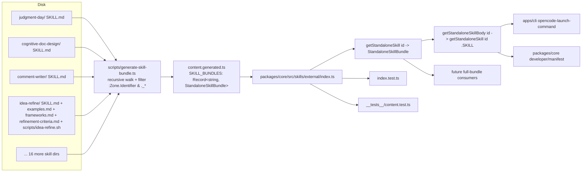

# Design: External Skills Bundle Install — Phase 1

## Source

- Proposal: `openspec/changes/external-skills-bundle-install/proposal.md`
- Exploration: `openspec/changes/external-skills-bundle-install/exploration.md`
- Capabilities affected: `standalone-skill-bundles` (new), `external-skill-installation` (modified), `external-skill-content-generation` (modified), `standalone-skill-body-access` (unchanged contract)
- Spec status: not yet available (Spec runs in parallel with Design; no blocking conflicts detected)

## Current Architecture Context

Standalone external skills are shipped as files under `packages/core/src/skills/external/<skillId>/SKILL.md` and bundled into a TypeScript module at build time.

**Generator** — `scripts/generate-skill-bundle.ts`:

- Hard-codes a 3-entry `SKILL_SOURCES` map (`judgment-day`, `cognitive-doc-design`, `comment-writer`).
- Reads only the `SKILL.md` file referenced by `sourcePath` (single-file assumption).
- Emits `content.generated.ts` containing a `Record<string, string>` named `SKILL_CONTENT` (verbatim SKILL bodies).
- Exits non-zero on missing/empty source content.

**Registry** — `packages/core/src/skills/external/index.ts`:

- `STANDALONE_SKILLS`: a `readonly` array of `{ skillId, sourcePath }` with the same 3 entries.
- `getStandaloneSkillBody(skillId): string`: looks up the registry entry, then either reads from `SKILL_CONTENT` (binary mode) or `readFileSync` (dev fallback). Throws `SkillLookupError` (`code = SKILL_NOT_FOUND`) on unknown id.
- `getStandaloneSkills()`: returns the registry.
- `SkillLookupError` is a typed class carrying `code` and `skillId`.

**Generated content** — `packages/core/src/skills/external/content.generated.ts`:

- Single export: `SKILL_CONTENT: Record<string, string>`.
- Currently 3 entries; each value is the verbatim SKILL.md body inside a TS template literal.

**Tests** — `packages/core/src/skills/external/`:

- `index.test.ts`: 5 cases covering `getStandaloneSkills`, `getStandaloneSkillBody` happy path, content checks, and an "unknown id" case that asserts `content` is `undefined` (line 36). The function actually throws `SkillLookupError` for unknown ids, so this case is misaligned with the implementation and with `__tests__/content.test.ts` (which correctly expects a throw). Pre-existing inconsistency to be fixed in this change.
- `__tests__/content.test.ts`: 8 cases covering registry shape, body content, `SkillLookupError` throws/properties, and a load-all loop. Currently compatible with the new design (it asserts on the string body contract that we preserve).

**External consumers** (read-only verification — no changes required for backward compatibility):

- `apps/cli/src/opencode-launch-command.ts` (line 226) — uses `getStandaloneSkillBody` to build install plan.
- `packages/core/src/teams/developer/manifest.ts` (line 155) — uses `getStandaloneSkillBody` to embed body in manifest.

Both consume the `string` body contract only and are unaffected by adding a new accessor or expanding generated content.

**Working tree** — `rtk git status`:

- 17 untracked skill directories under `packages/core/src/skills/external/`. Each contains a `SKILL.md` and a `SKILL.md:Zone.Identifier` (Windows zone transfer metadata — not part of the skill).
- `idea-refine/` additionally contains `examples.md`, `examples.md:Zone.Identifier`, `frameworks.md`, `frameworks.md:Zone.Identifier`, `refinement-criteria.md`, `refinement-criteria.md:Zone.Identifier`, and a `scripts/` subdir with `idea-refine.sh` + `idea-refine.sh:Zone.Identifier`.
- Tracked-modified: `apps/cli/src/runtime/build-info.generated.ts` (unrelated; do not touch).
- No destructive operations will be performed against the working tree.

## Proposed Architecture

### Component / Module Boundaries

| Component | Responsibility | Change Type |
|---|---|---|
| `scripts/generate-skill-bundle.ts` | Discover skill dirs, walk each recursively, collect non-system files, emit `SKILL_BUNDLES` record | Modified |
| `packages/core/src/skills/external/index.ts` | Add `StandaloneSkillBundle` type, add `getStandaloneSkill`, add 17 registry entries, refactor `getStandaloneSkillBody` to delegate to `getStandaloneSkill(id).SKILL` | Modified |
| `packages/core/src/skills/external/content.generated.ts` | Regenerate: replace `SKILL_CONTENT: Record<string, string>` with `SKILL_BUNDLES: Record<string, StandaloneSkillBundle>`; covers all 20 skills | Regenerated |
| `packages/core/src/skills/external/index.test.ts` | Update unknown-id case to `toThrow(SkillLookupError)`; add full-bundle and multi-file assertions | Modified |
| `packages/core/src/skills/external/__tests__/content.test.ts` | Add full-bundle accessor tests + `idea-refine` multi-file assertions | Modified |
| `packages/core/src/skills/external/<skillId>/` (17 dirs) | Source directories to be registered and bundled | New (already present as untracked) |

### Data Flow

```
  ┌────────────────────────────────────────────┐
  │ 17 untracked skill directories on disk     │
  │   (SKILL.md + optional supporting files)   │
  └────────────────┬───────────────────────────┘
                   │ readdirSync(dir, {withFileTypes:true}) — recursive
                   │ filter: not system files
                   ▼
  ┌────────────────────────────────────────────┐
  │ scripts/generate-skill-bundle.ts           │
  │  → StandaloneSkillBundle[]                 │
  └────────────────┬───────────────────────────┘
                   │ write
                   ▼
  ┌────────────────────────────────────────────┐
  │ content.generated.ts                       │
  │   SKILL_BUNDLES: Record<                   │
  │     skillId, StandaloneSkillBundle         │
  │   >                                        │
  │     .SKILL      = SKILL.md body            │
  │     .files      = { "examples.md": "...",  │
  │                     "scripts/foo.sh": … }  │
  └────────────────┬───────────────────────────┘
                   │ require() (binary) / fallback read (dev)
                   ▼
  ┌────────────────────────────────────────────┐
  │ packages/core/src/skills/external/index.ts │
  │   getStandaloneSkill(id) → bundle          │
  │     └─ getStandaloneSkillBody(id) → .SKILL │
  └────────────────┬───────────────────────────┘
                   │
                   ▼
  ┌────────────────────────────────────────────┐
  │ Consumers                                  │
  │  • opencode-launch-command (body only)     │
  │  • developer/manifest (body only)          │
  │  • future callers needing supporting files│
  └────────────────────────────────────────────┘
```

### API / Contract Implications

| Endpoint / Interface | Change | Backward Compatible |
|---|---|---|
| `getStandaloneSkillBody(skillId): string` | Signature unchanged. Internal refactor delegates to `getStandaloneSkill(id).SKILL`. Throws `SkillLookupError` for unknown ids. | Yes — same signature, same return type, same error type |
| `getStandaloneSkills()` | Signature unchanged. Returns array with 20 entries (was 3). | Yes — same return type, but `length` grows from 3 to 20; consumers iterate, do not assert on length |
| `getStandaloneSkill(skillId): StandaloneSkillBundle` | **New** — returns `{ SKILL: string; files: Record<string,string> }`. Throws `SkillLookupError` for unknown ids. | N/A (new) |
| `STANDALONE_SKILLS` | Adds 17 entries. Existing 3 entries unchanged. | Yes — additive |
| `StandaloneSkillBundle` (new type) | `{ SKILL: string; files: Record<string,string> }` | N/A (new) |
| `SKILL_CONTENT` (generated) | **Removed** from generated output — replaced by `SKILL_BUNDLES`. | Internal — `index.ts` is the only consumer and migrates with it |
| `SKILL_BUNDLES` (generated) | New generated record, type `Record<string, StandaloneSkillBundle>`. | N/A (new) |
| `SkillLookupError` | Unchanged. | Yes |

### State / Persistence Implications

None. Generated content is the only persistent artifact and is regenerated on every `bun scripts/generate-skill-bundle.ts` run. There is no DB or runtime cache.

### Migration / Backward Compatibility

**Compatibility strategy**: keep the public surface area stable, change the generated representation, and have the legacy body accessor delegate to the new bundle accessor.

1. **Generated file** — Replace `SKILL_CONTENT: Record<string, string>` with `SKILL_BUNDLES: Record<string, StandaloneSkillBundle>`. The two external consumers (`opencode-launch-command.ts`, `manifest.ts`) do not import from `content.generated.ts` directly, so the rename is internal.
2. **Body accessor** — `getStandaloneSkillBody(id)` becomes a thin wrapper:
   ```ts
   export function getStandaloneSkillBody(skillId: string): string {
     return getStandaloneSkill(skillId).SKILL;
   }
   ```
   This preserves the throw-on-unknown behavior because the delegate already throws.
3. **Dev-mode fallback** — `getStandaloneSkill` in dev mode needs to read supporting files in addition to `SKILL.md`. Mirror the generator's directory walk in `index.ts` so dev-mode behavior matches binary-mode behavior. If the file-walk cannot be done synchronously in dev mode, the fallback can be limited to `SKILL.md` for non-`SKILL` files (with a one-line comment noting that binary mode is authoritative for full bundles); both branches must still throw `SkillLookupError` consistently.
4. **No feature flag, no phased rollout** — single regeneration step; consumers are unaffected because the public API surface is preserved.
5. **No package version bump** required in this change.

### File Walk Rules (in generator and dev-mode fallback)

- Recursive walk using `readdirSync(dir, { withFileTypes: true })`.
- Skip entries where `name === 'SKILL.md'` and consume separately as `.SKILL`.
- For every other regular file (or file in a subdir), record under `files[relPath]` where `relPath` is the path relative to the skill root, using forward slashes (e.g. `scripts/idea-refine.sh`).
- Exclude system artifacts by name:
  - Anything ending in `:Zone.Identifier` (Windows NTFS alternate data stream marker).
  - Anything starting with `._` (macOS resource fork / Spotlight metadata).
- Empty `files: {}` is the default for single-file skills.

### Generated Type Shape

```ts
export type StandaloneSkillBundle = {
  SKILL: string;                         // verbatim SKILL.md body
  files: Record<string, string>;        // relativePath → file body
};

export const SKILL_BUNDLES: Record<string, StandaloneSkillBundle> = {
  "judgment-day": {
    SKILL: `<SKILL.md body>`,
    files: {},
  },
  "idea-refine": {
    SKILL: `<SKILL.md body>`,
    files: {
      "examples.md": `<body>`,
      "frameworks.md": `<body>`,
      "refinement-criteria.md": `<body>`,
      "scripts/idea-refine.sh": `<body>`,
    },
  },
  // ... 18 more
};
```

Template-literal escaping (backticks, `${`, `\`, newlines, tabs, carriage returns) is reused from the existing `escapeStringForTs` helper.

### Registry Update

`STANDALONE_SKILLS` keeps the shape `{ skillId; sourcePath }` for backward compatibility, but each entry's `sourcePath` becomes a **directory** (e.g. `idea-refine/SKILL.md` is already a file, so legacy entries stay as-is; new entries use directory-relative path, e.g. `idea-refine` — see Open Decision 1).

## File Impact Estimate

| File / Path | Action | Rationale |
|---|---|---|
| `scripts/generate-skill-bundle.ts` | modify | Recursive walk, `SKILL_BUNDLES` emit, escape helper reuse |
| `packages/core/src/skills/external/index.ts` | modify | Add `StandaloneSkillBundle`, `getStandaloneSkill`, 17 registry entries, delegate body accessor |
| `packages/core/src/skills/external/content.generated.ts` | regenerate | `SKILL_BUNDLES` with 20 entries (auto-generated file) |
| `packages/core/src/skills/external/index.test.ts` | modify | Fix unknown-id expectation; add full-bundle and multi-file cases |
| `packages/core/src/skills/external/__tests__/content.test.ts` | modify | Add `getStandaloneSkill` cases and `idea-refine` multi-file assertions |
| `packages/core/src/skills/external/<17 new dirs>` | unchanged on disk | New entries to be registered (no file additions beyond what's already present as untracked) |

## Testing Strategy

- **Unit (focused)** — `bun test packages/core/src/skills/external/`:
  - `getStandaloneSkills().length === 20`.
  - All 20 skills have a `SKILL` body of non-zero length.
  - `getStandaloneSkill("judgment-day").files` is `{}`.
  - `getStandaloneSkill("idea-refine").files` contains exactly `examples.md`, `frameworks.md`, `refinement-criteria.md`, `scripts/idea-refine.sh` — and that no `Zone.Identifier` entries leaked in.
  - `getStandaloneSkillBody("judgment-day")` equals `getStandaloneSkill("judgment-day").SKILL`.
  - Both `getStandaloneSkill` and `getStandaloneSkillBody` throw `SkillLookupError` with `code === SKILL_NOT_FOUND` for unknown ids, and the error carries the requested `skillId`.
- **Generator** — Run `bun scripts/generate-skill-bundle.ts` and assert the produced file declares 20 top-level keys, has no `Zone.Identifier` keys, and re-imports cleanly.
- **Consumers** — Existing tests for `opencode-launch-command` and `manifest` already cover their `body` consumption; do not duplicate.
- **Pre-existing failures** — Out of scope: any unrelated test or typecheck failure in the broader repo.

## Observability / Error Handling

- Generator collects errors into an array and exits non-zero with a per-skill list (existing pattern; preserve).
- `SkillLookupError` is already exported with `code`, `skillId`, and `message` — no change.
- The dev-mode fallback mirrors the binary-mode throw contract.

## Security / Performance / Accessibility Considerations

- **Security**: file content is inlined into a TS module via template literals; `escapeStringForTs` already neutralizes backticks and `${}`. The current escape set is sufficient. No new attack surface.
- **Performance**: inlining 20 skills adds to the binary bundle. Each `SKILL.md` is small (< ~10 KB). `idea-refine` adds ~5 small files. No measurable runtime impact. Regeneration is a one-shot script and is not on a hot path.
- **Accessibility**: not applicable (no UI).

## Tradeoffs

| Decision | Chosen | Rejected Alternative | Rationale |
|---|---|---|---|
| Generated record shape | Single `SKILL_BUNDLES` map; body accessor delegates | Keep `SKILL_CONTENT: Record<string,string>` and add `SKILL_BUNDLES` alongside | One source of truth; the proposal explicitly mandates the delegation pattern; avoids two parallel records that can drift |
| Walk strategy in generator | Recursive `readdirSync` with name-based filter | Hard-code per-skill file list in the generator | Skills are externally authored; the walker must accept arbitrary filenames under each skill dir |
| System-file exclusion | `name.endsWith(":Zone.Identifier")` and `name.startsWith("._")` | Whitelist of known extensions | Generator must work for arbitrary future skills; whitelist would need maintenance |
| Registry entry shape | Keep `{ skillId, sourcePath }`; `sourcePath` stays as the SKILL.md relative path for legacy | Add `{ skillId, dirPath, files[] }` | Minimal disruption to existing tests that check `sourcePath.endsWith(".md")`; directory resolution happens in the accessor |
| Dev-mode fallback scope | Read SKILL.md; for non-SKILL files, walk the same directory and read each one with the same filter | Lazy-read files on first access | Consistent behavior between dev and binary modes; bundle lookup remains synchronous (callers expect sync `string` results) |
| Test for unknown id in `index.test.ts` | Update to `toThrow(SkillLookupError)` | Leave as `toBeUndefined` (silently broken) | The implementation throws; the assertion is wrong; the proposal authorizes test updates |

## Risks

| Risk | Likelihood | Impact | Mitigation |
|---|---|---|---|
| A `:Zone.Identifier` or `._*` file leaks into `SKILL_BUNDLES[id].files` | Low | Medium | Name-based filter in walker; assertion in tests that no `Zone.Identifier` keys exist |
| `getStandaloneSkillBody` silently returns the wrong content | Low | High | Delegation test asserts `body === bundle.SKILL`; existing consumers' tests cover the body path |
| Untracked skill dirs are deleted by cleanup automation between generator run and registry update | Low | High | Do not run destructive git commands; do not run `rm -rf` against the external dir; verification step counts entries before regenerating |
| Dev-mode fallback cannot read nested files (e.g. `scripts/idea-refine.sh`) | Low | Medium | Same recursive walker is reused in dev mode; if sync read fails, `SkillLookupError` is thrown consistently |
| Generated module becomes large enough to slow down typecheck or binary startup | Low | Low | 20 small skills; total payload is bounded; no per-call re-parsing |
| Pre-existing `index.test.ts` "undefined" assertion masks a regression | Low | Low | Updated to `toThrow(SkillLookupError)` as part of this change; explicitly tracked in File Impact |
| New `STANDALONE_SKILLS` entries break a downstream consumer that asserts a fixed set | Low | Medium | `getStandaloneSkills` returns `readonly StandaloneSkillDefinition[]`; downstream consumers iterate; the only callers (`opencode-launch-command.ts`, `manifest.ts`) iterate, do not assert on `length` |

## Open Decisions

- **Decision 1 — Registry entry `sourcePath` semantics for new skills**: Should the 17 new entries' `sourcePath` point to the SKILL.md file (matching the legacy 3 entries' `sourcePath.endsWith(".md")` contract that `__tests__/content.test.ts` asserts on), or to the skill directory root? Legacy shape (file-relative) keeps the existing test passing; directory-relative shape better reflects the new bundle model. **Recommendation**: keep `sourcePath` as the SKILL.md relative path for all 20 entries (`"<skillId>/SKILL.md"`). The accessor resolves the skill's directory by `dirname(sourcePath)`. This requires no test changes for the sourcePath-shape assertion and avoids ambiguity.

> If the team prefers directory-relative `sourcePath` for new entries, the `sourcePath.endsWith(".md")` test must be updated in the same change. Both are valid; defaulting to the legacy shape for consistency.

## Dependencies

- `bun scripts/generate-skill-bundle.ts` — generator must remain runnable.
- `bun test packages/core/src/skills/external/` — verification command.
- The 17 untracked skill directories must remain on disk (no destructive cleanup).

## Next Steps

Ready for Task (`deck-developer-task`) to break this design into implementation tasks, combined with the Spec artifact. Tasks should cover, in order: (1) generator rewrite with walker + escape + 20-skill emit, (2) `index.ts` accessor + registry expansion, (3) regeneration, (4) test updates, (5) focused test run.

## Mermaid Summary Source


