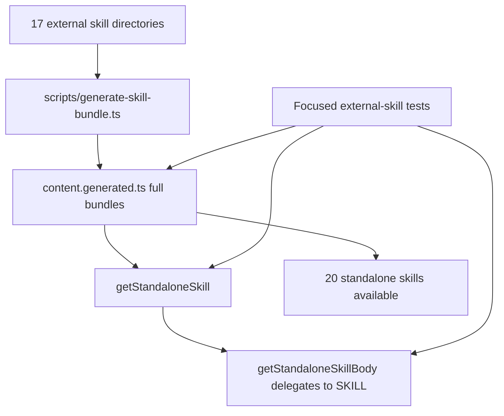

# Proposal: External Skills Bundle Install Phase 1

## Intent

Phase 1 must restore and complete silent installation for 17 external standalone skills. Current standalone skill infrastructure only bundles 3 skills and only reads `SKILL.md`, so multi-file skills such as `idea-refine` would lose supporting files unless the bundle model is expanded.

## Goal

Make all 20 standalone external skills available through a full-package bundle API while preserving existing `getStandaloneSkillBody(skillId): string` behavior.

## Scope

### In Scope
- Install/register 17 external skills under `packages/core/src/skills/external/`.
- Extend generated external skill content from SKILL-only strings to full bundles: `{ SKILL, files }`.
- Add `getStandaloneSkill(skillId)` accessor returning the full bundle.
- Preserve `getStandaloneSkillBody(skillId)` compatibility by delegating to `getStandaloneSkill(skillId).SKILL`.
- Regenerate `packages/core/src/skills/external/content.generated.ts` with all 20 standalone skills.
- Update focused external-skill tests for full bundles, compatibility, unknown-skill errors, and multi-file preservation.

### Out of Scope
- Consolidating Developer Team prompt content with the new standalone skills.
- Changing runtime launcher behavior or skill invocation semantics.
- Refactoring unrelated Developer Team agents.
- Resolving unrelated repository status items or baseline test/typecheck failures.

## Affected Capabilities

### New Capabilities
- `standalone-skill-bundles`: Retrieve a complete standalone skill package, including `SKILL.md` content and supporting files.

### Modified Capabilities
- `external-skill-installation`: Expands silent installation from 3 to 20 standalone skills.
- `external-skill-content-generation`: Changes generated content from SKILL-only bodies to stable full-bundle records with `files: {}` for single-file skills.

### Unchanged Capabilities
- `standalone-skill-body-access`: Existing `getStandaloneSkillBody(skillId): string` remains available and preserves unknown-skill error behavior.

## Approach

Proceed with Explorer Option A: incremental extension. Update `scripts/generate-skill-bundle.ts` to recursively collect non-system files per skill directory, emit `StandaloneSkillBundle`, update `packages/core/src/skills/external/index.ts` with the new accessor and 17 registry entries, regenerate `content.generated.ts`, and verify with focused tests under `packages/core/src/skills/external/`.

## Alternatives and Tradeoffs

| Alternative | Why Considered | Why Not Chosen |
|---|---|---|
| Incremental extension | Preserves current registry, errors, and body accessor while adding full bundles | Chosen; lowest disruption |
| Full rewrite | Could redesign generator/registry around bundle packages | Higher risk and unnecessary for Phase 1 |
| SKILL-only install | Simpler generated output | Violates user preference for complete packages and loses `idea-refine` support files |

## Risks

| Risk | Likelihood | Mitigation |
|---|---|---|
| Multi-file skill files are omitted from generated output | Medium | Add acceptance checks for `idea-refine` supporting files |
| Backward compatibility regression in `getStandaloneSkillBody` | Low | Keep it as a delegating accessor and test existing behavior |
| System artifact files enter generated bundles | Low | Exclude `:Zone.Identifier` and `._*` while walking directories |
| User-added untracked skill directories are accidentally discarded | Medium | Do not run destructive Git commands; preserve untracked directories throughout implementation |
| Generated content becomes stale after directory changes | Low | Regenerate via `bun scripts/generate-skill-bundle.ts` and test generated output |

## Rollback Plan

Revert only the Phase 1 OpenSpec/product changes through a normal non-destructive Git revert or explicit file edits: restore the prior generator, registry, tests, and generated content, and remove only newly added skill directories if they are confirmed to be part of this change. Never use destructive Git cleanup/reset commands against the working tree or untracked directories.

## Dependencies

- The 17 external skill source directories must be present or restored before generation.
- `bun scripts/generate-skill-bundle.ts` must remain the generation entrypoint.
- Focused verification depends on `bun test packages/core/src/skills/external/`.

## Open Questions

None — roadmap and exploration define Phase 1 scope and acceptance direction.

## Acceptance Direction

- [ ] `getStandaloneSkills().length === 20`.
- [ ] `getStandaloneSkillBody("judgment-day")` returns a string and delegates to the full-bundle accessor.
- [ ] `getStandaloneSkill("judgment-day")` returns `{ SKILL, files: {} }`.
- [ ] `getStandaloneSkill("idea-refine")` includes `examples.md`, `frameworks.md`, `refinement-criteria.md`, and `scripts/idea-refine.sh`.
- [ ] Unknown skills throw `SkillLookupError`.
- [ ] `bun test packages/core/src/skills/external/` passes or only reports unrelated pre-existing failures.

## Next Steps

Ready for Spec (`deck-developer-spec`) and Design (`deck-developer-design`) in parallel.

## Mermaid Summary Source

