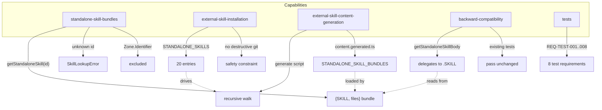

# Spec: External Skills Bundle Install Phase 1

## Source

- Proposal: `external-skills-bundle-install` proposal artifact
- Capabilities affected: `standalone-skill-bundles` (new), `external-skill-installation` (modified), `external-skill-content-generation` (modified)

## Requirements

### Capability: standalone-skill-bundles

REQ-SB-001: The system MUST provide a type `StandaloneSkillBundle` with the shape `{ SKILL: string; files: Record<string, string> }` where `SKILL` holds the verbatim SKILL.md content and `files` maps relative file paths to their string contents.
  Priority: MUST
  Surface: API
  Rationale: The bundle is the foundational data contract for complete skill packages. Consumers (adapters, installers) need both the skill body and all supporting files in a single retrievable unit.

REQ-SB-002: The system MUST provide a function `getStandaloneSkill(skillId: string): StandaloneSkillBundle` that returns the full bundle for a registered skill ID.
  Priority: MUST
  Surface: API
  Rationale: Consumers need a single accessor to retrieve complete skill packages including auxiliary files.

REQ-SB-003: `getStandaloneSkill` MUST throw a `SkillLookupError` with code `SKILL_NOT_FOUND` when called with an unregistered skill ID.
  Priority: MUST
  Surface: API
  Rationale: Fail-fast error handling for missing skills; consistent with existing `getStandaloneSkillBody` error behavior.

REQ-SB-004: For skills whose source directory contains only `SKILL.md` (no non-system auxiliary files), `getStandaloneSkill(skillId).files` MUST be an empty object `{}`.
  Priority: MUST
  Surface: API
  Rationale: 19 of 20 skills are single-file. An empty `files` map signals "no auxiliary files" unambiguously without null/undefined.

REQ-SB-005: For skills whose source directory contains auxiliary files (e.g., `idea-refine`), `getStandaloneSkill(skillId).files` MUST include every non-system file keyed by its relative path within the skill directory, with values equal to the file's string content.
  Priority: MUST
  Surface: API
  Rationale: Multi-file skills must not lose supporting resources during bundling.

REQ-SB-006: The system MUST exclude system artifact files from bundled content, including files matching `*.Zone.Identifier`, `:Zone.Identifier`, and `._*` patterns.
  Priority: MUST
  Surface: Data
  Rationale: Zone.Identifier and macOS resource-fork files are OS artifacts, not skill content. Including them would corrupt generated output and waste space.

### Capability: external-skill-installation

REQ-ESI-001: The `STANDALONE_SKILLS` registry MUST contain exactly 20 entries, one for each skill ID.
  Priority: MUST
  Surface: Data
  Rationale: The 3 existing skills plus 17 newly installed skills total 20. Exact count enables automated verification.

REQ-ESI-002: The 20 registered skill IDs MUST be: `api-and-interface-design`, `ci-cd-and-automation`, `code-review-and-quality`, `code-simplification`, `cognitive-doc-design`, `comment-writer`, `debugging-and-error-recovery`, `deprecation-and-migration`, `documentation-and-adrs`, `doubt-driven-development`, `frontend-ui-engineering`, `git-workflow-and-versioning`, `idea-refine`, `interview-me`, `judgment-day`, `performance-optimization`, `security-and-hardening`, `shipping-and-launch`, `test-driven-development`, `using-agent-skills`.
  Priority: MUST
  Surface: Data
  Rationale: Canonical skill list derived from source directories present on disk.

REQ-ESI-003: `getStandaloneSkills()` MUST return the full 20-entry registry array.
  Priority: MUST
  Surface: API
  Rationale: Existing accessor must reflect the expanded registry.

REQ-ESI-004: The generation script MUST NOT run destructive Git commands (no `git clean`, `git checkout --`, `git reset --hard`, `git rm`, or equivalent operations on tracked or untracked files).
  Priority: MUST
  Surface: Security
  Rationale: Untracked skill directories are user-created. Destructive Git operations could permanently delete user work. This is a critical safety constraint.

REQ-ESI-005: Each skill source directory MUST contain a non-empty `SKILL.md` file as a prerequisite for registration.
  Priority: MUST
  Surface: Data
  Rationale: SKILL.md is the mandatory entry point for every skill. A missing or empty SKILL.md indicates a broken or incomplete skill directory.

### Capability: external-skill-content-generation

REQ-ESCG-001: The generation script (`scripts/generate-skill-bundle.ts`) MUST recursively walk each skill directory and collect all non-system files, not just `SKILL.md`.
  Priority: MUST
  Surface: General
  Rationale: Current implementation only reads `SKILL.md`. Multi-file skills like `idea-refine` require recursive directory walking.

REQ-ESCG-002: The generated `content.generated.ts` MUST export a `STANDALONE_SKILL_BUNDLES` map of type `Record<string, StandaloneSkillBundle>` containing all 20 skill bundles.
  Priority: MUST
  Surface: Data
  Rationale: Generated output must carry full bundles for binary-mode consumption.

REQ-ESCG-003: The generation script MUST exit with non-zero code and report errors if any declared skill is missing, empty, or unreadable.
  Priority: MUST
  Surface: General
  Rationale: Generation-time validation catches broken skill directories before they reach production.

REQ-ESCG-004: The generation script MAY preserve the existing `SKILL_CONTENT` export alongside `STANDALONE_SKILL_BUNDLES` during a transition period.
  Priority: MAY
  Surface: Data
  Rationale: Transitional export reduces risk of breaking downstream consumers that import `SKILL_CONTENT` directly.

### Capability: backward-compatibility

REQ-BC-001: `getStandaloneSkillBody(skillId)` MUST continue to return the `SKILL.md` string content for all 20 registered skill IDs without behavior change.
  Priority: MUST
  Surface: API
  Rationale: Existing consumers depend on `getStandaloneSkillBody`. Breaking this accessor is a regression.

REQ-BC-002: `getStandaloneSkillBody(skillId)` MUST delegate to `getStandaloneSkill(skillId).SKILL` internally rather than maintaining an independent content-loading path.
  Priority: MUST
  Surface: API
  Rationale: Single source of truth. Both accessors must read from the same bundle data to prevent divergence.

REQ-BC-003: `getStandaloneSkillBody(skillId)` MUST throw `SkillLookupError` with code `SKILL_NOT_FOUND` for unregistered skill IDs, preserving its current error behavior.
  Priority: MUST
  Surface: API
  Rationale: Error contract must not change; existing callers may rely on catching `SkillLookupError`.

REQ-BC-004: The existing test suite under `packages/core/src/skills/external/` MUST continue to pass after the change.
  Priority: MUST
  Surface: General
  Rationale: Regressions in existing tests indicate broken backward compatibility.

### Capability: tests

REQ-TEST-001: A test MUST assert `getStandaloneSkills().length === 20`.
  Priority: MUST
  Surface: General
  Rationale: Exact count verification ensures no skill is missing or duplicated.

REQ-TEST-002: A test MUST assert `getStandaloneSkillBody("judgment-day")` returns a non-empty string and delegates to `getStandaloneSkill("judgment-day").SKILL`.
  Priority: MUST
  Surface: General
  Rationale: Validates backward compatibility and delegation behavior for an existing skill.

REQ-TEST-003: A test MUST assert `getStandaloneSkill("judgment-day")` returns `{ SKILL: <string>, files: {} }` (empty files for a single-file skill).
  Priority: MUST
  Surface: General
  Rationale: Validates bundle shape for single-file skills.

REQ-TEST-004: A test MUST assert `getStandaloneSkill("idea-refine").files` contains keys for `examples.md`, `frameworks.md`, `refinement-criteria.md`, and `scripts/idea-refine.sh`, each with non-empty string content.
  Priority: MUST
  Surface: General
  Rationale: Validates multi-file bundle integrity for the only multi-file skill.

REQ-TEST-005: A test MUST assert that calling `getStandaloneSkill` or `getStandaloneSkillBody` with an unknown skill ID throws `SkillLookupError` with code `SKILL_NOT_FOUND`.
  Priority: MUST
  Surface: General
  Rationale: Validates error contract for both accessors.

REQ-TEST-006: A test SHOULD iterate over all 20 registered skills and assert each has a non-empty `SKILL` field in its bundle.
  Priority: SHOULD
  Surface: General
  Rationale: Exhaustive content coverage ensures no bundle has an empty SKILL.md.

REQ-TEST-007: A test SHOULD verify that no Zone.Identifier or `._*` file paths appear in any bundle's `files` map.
  Priority: SHOULD
  Surface: General
  Rationale: Confirms system artifact exclusion across all 20 skills.

REQ-TEST-008: A test MUST verify that `getStandaloneSkillBody` for a newly added skill (e.g., `"api-and-interface-design"`) returns a non-empty string containing YAML frontmatter.
  Priority: MUST
  Surface: General
  Rationale: Confirms newly registered skills are accessible through the legacy accessor.

## Acceptance Scenarios

### Capability: standalone-skill-bundles

#### Scenario: Retrieve full bundle for single-file skill
**Given** the external skills catalog is loaded
**When** `getStandaloneSkill("judgment-day")` is called
**Then** the result has a `SKILL` field containing a non-empty string with YAML frontmatter, and a `files` field equal to `{}`.
> Covers: REQ-SB-001, REQ-SB-002, REQ-SB-004

#### Scenario: Retrieve full bundle for multi-file skill
**Given** the external skills catalog is loaded and `idea-refine` source directory contains auxiliary files
**When** `getStandaloneSkill("idea-refine")` is called
**Then** the result has a `SKILL` field with verbatim SKILL.md content, and `files` contains keys `examples.md`, `frameworks.md`, `refinement-criteria.md`, and `scripts/idea-refine.sh`, each mapped to non-empty string content.
> Covers: REQ-SB-001, REQ-SB-002, REQ-SB-005

#### Scenario: Unknown skill ID throws SkillLookupError
**Given** the external skills catalog is loaded
**When** `getStandaloneSkill("non-existent-skill")` is called
**Then** a `SkillLookupError` is thrown with `code === "SKILL_NOT_FOUND"` and `skillId === "non-existent-skill"`.
> Covers: REQ-SB-003

#### Variant: Empty string skill ID
- **Given** the external skills catalog is loaded
- **When** `getStandaloneSkill("")` is called
- **Then** a `SkillLookupError` is thrown with `code === "SKILL_NOT_FOUND"`.

#### Scenario: System artifact files excluded from bundle
**Given** the `idea-refine` source directory contains `*.Zone.Identifier` files alongside valid skill files
**When** `getStandaloneSkill("idea-refine")` is called
**Then** the `files` map does NOT contain any key ending in `:Zone.Identifier`, `Zone.Identifier`, or starting with `._`.
> Covers: REQ-SB-006

### Capability: external-skill-installation

#### Scenario: Registry contains all 20 skills
**Given** the `STANDALONE_SKILLS` registry is loaded
**When** `getStandaloneSkills()` is called
**Then** the result length is exactly 20, and the result includes all skill IDs listed in REQ-ESI-002.
> Covers: REQ-ESI-001, REQ-ESI-002, REQ-ESI-003

#### Scenario: Each skill directory has a valid SKILL.md
**Given** all 20 skill source directories exist under `packages/core/src/skills/external/`
**When** the generation script reads each skill
**Then** every skill directory contains a non-empty `SKILL.md` file.
> Covers: REQ-ESI-005

#### Scenario: Generation script does not run destructive Git commands
**Given** the generation script source code
**When** the script is audited for Git command usage
**Then** it does not invoke `git clean`, `git checkout --`, `git reset --hard`, `git rm`, `git stash --all`, or any other destructive Git operation on user files.
> Covers: REQ-ESI-004

### Capability: external-skill-content-generation

#### Scenario: Generation script collects all files recursively
**Given** the `idea-refine` directory has files in a `scripts/` subdirectory
**When** the generation script runs
**Then** the generated output includes `scripts/idea-refine.sh` in the `files` map for `idea-refine`.
> Covers: REQ-ESCG-001

#### Scenario: Generated output includes all 20 bundles
**Given** the generation script completes successfully
**When** `content.generated.ts` is loaded
**Then** it exports a `STANDALONE_SKILL_BUNDLES` map with exactly 20 keys matching the registered skill IDs, each containing a valid `{ SKILL, files }` bundle.
> Covers: REQ-ESCG-002

#### Scenario: Generation fails for missing skill
**Given** a skill ID is declared in `SKILL_SOURCES` but its directory does not exist
**When** the generation script runs
**Then** the script exits with non-zero code and prints an error message identifying the missing skill.
> Covers: REQ-ESCG-003

#### Variant: Empty SKILL.md
- **Given** a skill ID is declared and its directory exists but SKILL.md is empty
- **When** the generation script runs
- **Then** the script exits with non-zero code and reports the empty file.

### Capability: backward-compatibility

#### Scenario: Legacy accessor returns SKILL content for existing skill
**Given** `getStandaloneSkillBody("judgment-day")` is called
**When** the result is compared to `getStandaloneSkill("judgment-day").SKILL`
**Then** the values are strictly equal (`===`).
> Covers: REQ-BC-001, REQ-BC-002

#### Scenario: Legacy accessor returns SKILL content for newly registered skill
**Given** `getStandaloneSkillBody("api-and-interface-design")` is called
**When** the result is examined
**Then** it returns a non-empty string containing YAML frontmatter (`---`).
> Covers: REQ-BC-001, REQ-ESI-002

#### Scenario: Legacy accessor throws for unknown skill
**Given** `getStandaloneSkillBody("non-existent-skill")` is called
**Then** a `SkillLookupError` is thrown with `code === "SKILL_NOT_FOUND"`.
> Covers: REQ-BC-003

#### Scenario: Existing test suite passes
**Given** the test suite at `packages/core/src/skills/external/` is executed
**When** `bun test packages/core/src/skills/external/` runs
**Then** all existing test cases pass (no regressions).
> Covers: REQ-BC-004

### Capability: tests

#### Scenario: Full bundle accessor test suite
**Given** the updated test file at `packages/core/src/skills/external/`
**When** the test suite runs
**Then** all assertions listed in REQ-TEST-001 through REQ-TEST-008 pass.
> Covers: REQ-TEST-001, REQ-TEST-002, REQ-TEST-003, REQ-TEST-004, REQ-TEST-005, REQ-TEST-006, REQ-TEST-007, REQ-TEST-008

## Validation Rules

| Field / Input | Rule | Error | REQ-ID |
|---|---|---|---|
| `skillId` parameter (getStandaloneSkill) | Must match a registered skill ID | `SkillLookupError` with `SKILL_NOT_FOUND` | REQ-SB-003 |
| `skillId` parameter (getStandaloneSkillBody) | Must match a registered skill ID | `SkillLookupError` with `SKILL_NOT_FOUND` | REQ-BC-003 |
| SKILL.md file per skill directory | Must exist and be non-empty | Generation script exits non-zero | REQ-ESI-005, REQ-ESCG-003 |
| File path in generated bundle | Must NOT match `*.Zone.Identifier`, `:Zone.Identifier`, `._*` | Excluded during walk | REQ-SB-006 |
| STANDALONE_SKILLS registry length | Must equal 20 | Test assertion failure | REQ-ESI-001 |

## Error Contracts

| Condition | Error Code | Message Pattern | Context |
|---|---|---|---|
| Unknown skill ID in getStandaloneSkill | `SKILL_NOT_FOUND` | `Skill {skillId} not found in bundled resources. Reinstall deck binary.` | Runtime (binary + dev mode) |
| Unknown skill ID in getStandaloneSkillBody | `SKILL_NOT_FOUND` | `Skill {skillId} not found in bundled resources. Reinstall deck binary.` | Runtime (binary + dev mode) |
| Missing skill directory at generation time | N/A (process exit) | `Skill {skillId} not found at {path}` | Build time |
| Empty SKILL.md at generation time | N/A (process exit) | `Skill {skillId} at {path} is empty` | Build time |

## States and Transitions

| State | Description | Entry Criteria |
|---|---|---|
| `unregistered` | Skill source directory exists on disk but is not in the registry | Source directory present, not in `STANDALONE_SKILLS` |
| `registered` | Skill is declared in `STANDALONE_SKILLS` with a valid `skillId` and `sourcePath` | Entry added to registry array |
| `bundled` | Skill content is present in `content.generated.ts` as a `StandaloneSkillBundle` | Generation script has run successfully |
| `loadable` | Skill bundle is accessible via `getStandaloneSkill()` at runtime | `content.generated.ts` compiled and importable |

| From | To | Trigger | Side Effects |
|---|---|---|---|
| `unregistered` | `registered` | Add entry to `STANDALONE_SKILLS` array | Registry grows by 1 |
| `registered` | `bundled` | Run `bun scripts/generate-skill-bundle.ts` | `content.generated.ts` updated with new bundle |
| `bundled` | `loadable` | Application starts and imports `content.generated.ts` | `getStandaloneSkill()` returns bundle |

> Note: Existing skills (judgment-day, cognitive-doc-design, comment-writer) transition from `bundled` (old format) to `bundled` (new format with files map) during regeneration.

## Open Questions

None — spec is self-contained. Proposal and exploration provide sufficient scope clarity.

## Compliance Matrix

| REQ-ID | Scenario(s) | Status |
|---|---|---|
| REQ-SB-001 | Retrieve full bundle (single-file, multi-file) | Defined |
| REQ-SB-002 | Retrieve full bundle (single-file, multi-file) | Defined |
| REQ-SB-003 | Unknown skill ID throws SkillLookupError + Empty string variant | Defined |
| REQ-SB-004 | Retrieve full bundle for single-file skill | Defined |
| REQ-SB-005 | Retrieve full bundle for multi-file skill | Defined |
| REQ-SB-006 | System artifact files excluded from bundle | Defined |
| REQ-ESI-001 | Registry contains all 20 skills | Defined |
| REQ-ESI-002 | Registry contains all 20 skills | Defined |
| REQ-ESI-003 | Registry contains all 20 skills | Defined |
| REQ-ESI-004 | Generation script does not run destructive Git commands | Defined |
| REQ-ESI-005 | Each skill directory has a valid SKILL.md | Defined |
| REQ-ESCG-001 | Generation script collects all files recursively | Defined |
| REQ-ESCG-002 | Generated output includes all 20 bundles | Defined |
| REQ-ESCG-003 | Generation fails for missing skill + Empty SKILL.md variant | Defined |
| REQ-ESCG-004 | (MAY — transitional export) | Defined |
| REQ-BC-001 | Legacy accessor for existing skill + newly registered skill | Defined |
| REQ-BC-002 | Legacy accessor delegates to full-bundle accessor | Defined |
| REQ-BC-003 | Legacy accessor throws for unknown skill | Defined |
| REQ-BC-004 | Existing test suite passes | Defined |
| REQ-TEST-001 | Full bundle accessor test suite | Defined |
| REQ-TEST-002 | Full bundle accessor test suite | Defined |
| REQ-TEST-003 | Full bundle accessor test suite | Defined |
| REQ-TEST-004 | Full bundle accessor test suite | Defined |
| REQ-TEST-005 | Full bundle accessor test suite | Defined |
| REQ-TEST-006 | Full bundle accessor test suite | Defined |
| REQ-TEST-007 | Full bundle accessor test suite | Defined |
| REQ-TEST-008 | Full bundle accessor test suite | Defined |

## Mermaid Summary Source

