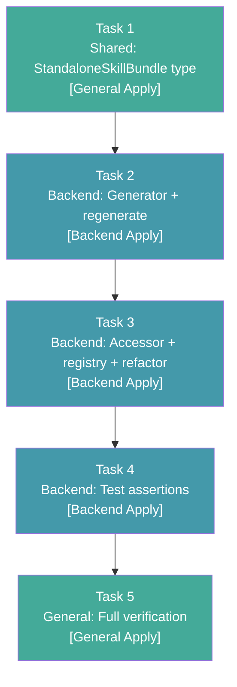

# Tasks: External Skills Bundle Install — Phase 1

## Source

- Spec: `external-skills-bundle-install` spec artifact
- Design: `external-skills-bundle-install` design artifact
- Capabilities affected: standalone-skill-bundles, external-skill-installation, external-skill-content-generation, backward-compatibility, tests

## Task Groups

### Group: Shared / Contracts

#### Task 1: Add StandaloneSkillBundle type and update generated content contract

**Owner**: General Apply
**Priority**: P0 (blocking — all downstream tasks depend on this type)
**Complexity**: Low
**Parallel**: Yes — independent of generator logic; defines the contract only
**Depends on**: none
**Execution Group**: A

**Description**

Add the `StandaloneSkillBundle` type export to `packages/core/src/skills/external/index.ts`. This is the foundational data contract: `{ SKILL: string; files: Record<string, string> }`. The generated `content.generated.ts` will use an inline type matching this shape, and `index.ts` re-exports the canonical named type. No behavioral changes — type definition only.

**Files**
- `packages/core/src/skills/external/index.ts` — modify (add type export)

**Verification**
- Typecheck passes: `bun run typecheck` or equivalent.
- `StandaloneSkillBundle` is importable from `packages/core/src/skills/external/index.ts`.

---

### Group: Backend

#### Task 2: Modify generator script for recursive walk and SKILL_BUNDLES output

**Owner**: Backend Apply
**Priority**: P0 (blocking — produces the generated content file)
**Complexity**: Medium
**Parallel**: No — depends on Task 1 type shape being agreed; but generator is self-contained logic
**Depends on**: Task 1
**Execution Group**: B

**Description**

Modify `scripts/generate-skill-bundle.ts` to:

1. **Recursive directory walk**: Replace flat `SKILL.md`-only read with `readdirSync(dir, { withFileTypes: true })` recursive walk for each skill directory.
2. **System file exclusion**: Skip entries ending in `:Zone.Identifier` (Windows NTFS) and starting with `._` (macOS resource forks).
3. **Bundle emission**: Change output from `SKILL_CONTENT: Record<string, string>` to `SKILL_BUNDLES: Record<string, StandaloneSkillBundle>` where each bundle has `.SKILL` (SKILL.md body) and `.files` (map of relative-path → content for all other files). Include inline `StandaloneSkillBundle` type in the generated file.
4. **Validation**: Exit non-zero if any declared skill directory is missing, SKILL.md is empty, or any file is unreadable (REQ-ESCG-003).
5. **Git safety**: MUST NOT run any destructive Git commands (`git clean`, `git checkout --`, `git reset --hard`, `git rm`, etc.) — REQ-ESI-004.
6. **Re-use** existing `escapeStringForTs` helper for template-literal escaping.

After modifying, run the script (`bun scripts/generate-skill-bundle.ts`) to produce the new `content.generated.ts` with all 20 skill bundles.

**Decision to follow**: `sourcePath` for new registry entries should point to `<skillId>/SKILL.md` (legacy shape), as recommended in the design's Open Decisions section. No test changes needed for sourcePath assertions.

**Files**
- `scripts/generate-skill-bundle.ts` — modify
- `packages/core/src/skills/external/content.generated.ts` — regenerate

**Verification**
- `bun scripts/generate-skill-bundle.ts` exits 0.
- Generated `content.generated.ts` exports `SKILL_BUNDLES` (not `SKILL_CONTENT`).
- Generated file contains exactly 20 top-level keys matching the skill IDs from REQ-ESI-002.
- `idea-refine` bundle has `files` containing `examples.md`, `frameworks.md`, `refinement-criteria.md`, `scripts/idea-refine.sh`.
- No `:Zone.Identifier` or `._*` keys in any bundle's `files` map.
- Script fails with non-zero exit if a skill directory is missing or SKILL.md is empty.

---

#### Task 3: Add getStandaloneSkill accessor, expand registry to 20 entries, refactor getStandaloneSkillBody

**Owner**: Backend Apply
**Priority**: P0 (blocking — core behavioral change)
**Complexity**: Medium
**Parallel**: No — depends on Task 2 generated output
**Depends on**: Task 1, Task 2
**Execution Group**: C

**Description**

Update `packages/core/src/skills/external/index.ts` to:

1. **Add `getStandaloneSkill(skillId: string): StandaloneSkillBundle`**: Returns the full bundle from `SKILL_BUNDLES`. In binary mode, reads from generated `content.generated.ts`. In dev mode (fallback), walks the skill directory on disk using the same recursive walk + system file exclusion as the generator. Throws `SkillLookupError` with code `SKILL_NOT_FOUND` for unknown IDs.
2. **Expand `STANDALONE_SKILLS` registry**: Add 17 new entries for: `api-and-interface-design`, `ci-cd-and-automation`, `code-review-and-quality`, `code-simplification`, `cognitive-doc-design`, `comment-writer`, `debugging-and-error-recovery`, `deprecation-and-migration`, `documentation-and-adrs`, `doubt-driven-development`, `frontend-ui-engineering`, `git-workflow-and-versioning`, `interview-me`, `performance-optimization`, `security-and-hardening`, `shipping-and-launch`, `test-driven-development`. Each entry: `{ skillId, sourcePath: "<skillId>/SKILL.md" }`.
3. **Refactor `getStandaloneSkillBody`**: Change to thin delegation: `return getStandaloneSkill(skillId).SKILL;`. Preserves throw-on-unknown behavior automatically.
4. **Update imports**: Switch from `SKILL_CONTENT` to `SKILL_BUNDLES` import from `content.generated.ts`.
5. **Dev-mode fallback**: Mirror the generator's directory walk in the dev-mode branch of `getStandaloneSkill` so both modes produce consistent bundles. If file-walk is impractical in dev mode, limit to `SKILL.md` body with a comment noting binary mode is authoritative for full bundles.

**Files**
- `packages/core/src/skills/external/index.ts` — modify

**Verification**
- `getStandaloneSkills().length === 20`.
- `getStandaloneSkill("judgment-day")` returns `{ SKILL: <string>, files: {} }`.
- `getStandaloneSkill("idea-refine").files` contains 4 entries.
- `getStandaloneSkillBody("judgment-day") === getStandaloneSkill("judgment-day").SKILL`.
- `getStandaloneSkill("non-existent-skill")` throws `SkillLookupError` with `code === "SKILL_NOT_FOUND"`.
- `getStandaloneSkillBody("non-existent-skill")` throws `SkillLookupError`.
- Typecheck passes.

---

#### Task 4: Update test files with all required assertions

**Owner**: Backend Apply
**Priority**: P1 (important — ensures correctness)
**Complexity**: Medium
**Parallel**: No — depends on Task 3 behavioral changes
**Depends on**: Task 3
**Execution Group**: D

**Description**

Update both test files to cover all spec requirements (REQ-TEST-001 through REQ-TEST-008):

**`packages/core/src/skills/external/index.test.ts`**:
- Fix the unknown-id test: change from `toBeUndefined` to `toThrow(SkillLookupError)` (REQ-TEST-003, REQ-SB-003).
- Verify `SkillLookupError` carries the requested `skillId`.
- Add empty-string skill ID variant that also throws `SkillLookupError`.

**`packages/core/src/skills/external/__tests__/content.test.ts`**:
- Add `getStandaloneSkills().length === 20` assertion (REQ-TEST-001).
- Add `getStandaloneSkillBody("judgment-day")` delegation test: equals `getStandaloneSkill("judgment-day").SKILL` (REQ-TEST-002).
- Add `getStandaloneSkill("judgment-day").files` is `{}` for single-file skill (REQ-TEST-004).
- Add `getStandaloneSkill("idea-refine").files` contains exactly `examples.md`, `frameworks.md`, `refinement-criteria.md`, `scripts/idea-refine.sh` (REQ-TEST-005, REQ-SB-005).
- Add all-20-skills SKILL body non-empty assertion (REQ-TEST-006).
- Add no `Zone.Identifier` or `._*` entries in any bundle's files (REQ-TEST-007, REQ-SB-006).
- Add `getStandaloneSkillBody("api-and-interface-design")` returns non-empty string with YAML frontmatter (REQ-TEST-008).
- Add `getStandaloneSkillBody("non-existent-skill")` throws `SkillLookupError` (REQ-BC-003).

**Files**
- `packages/core/src/skills/external/index.test.ts` — modify
- `packages/core/src/skills/external/__tests__/content.test.ts` — modify

**Verification**
- `bun test packages/core/src/skills/external/` — all tests pass.
- Each of REQ-TEST-001 through REQ-TEST-008 is covered by at least one assertion.

---

#### Task 5: Full verification and regression check

**Owner**: General Apply
**Priority**: P0 (blocking — gate for completion)
**Complexity**: Low
**Parallel**: No — depends on all prior tasks
**Depends on**: Task 4
**Execution Group**: E

**Description**

Run the full verification suite to confirm no regressions and all acceptance criteria are met:

1. Regenerate content: `bun scripts/generate-skill-bundle.ts` — exits 0.
2. Run test suite: `bun test packages/core/src/skills/external/` — all tests pass.
3. Verify generated output: `SKILL_BUNDLES` has exactly 20 keys, no system artifact keys.
4. Verify backward compatibility: existing consumers (`opencode-launch-command`, `manifest`) still work (their tests pass).
5. Typecheck: `bun run typecheck` or equivalent passes for affected files.

**Files**
- `packages/core/src/skills/external/content.generated.ts` — unchanged (verify only)
- `packages/core/src/skills/external/index.ts` — unchanged (verify only)

**Verification**
- All tests pass with zero failures.
- No typecheck errors.
- Generated file has 20 entries, correct structure.
- No regressions in consumer tests.

---

## Dependency Graph

```
Task 1 (Shared: type contract)
  → Task 2 (Backend: generator + regenerate)
    → Task 3 (Backend: accessor + registry + refactor)
      → Task 4 (Backend: test assertions)
        → Task 5 (General: full verification)
```

## Parallelization Plan

| Phase | Tasks | Can Run in Parallel |
|---|---|---|
| Shared | Task 1 | Yes (standalone type definition) |
| Backend | Task 2 | No — depends on Task 1 |
| Backend | Task 3 | No — depends on Task 2 |
| Backend | Task 4 | No — depends on Task 3 |
| Verification | Task 5 | No — depends on Task 4 |

This is a sequential chain with no parallelism opportunities. The change is narrow (5 files, one module) and each task builds on the prior task's output.

## Responsibility Contracts

| Contract / Boundary | Owner | Consumers | Notes |
|---|---|---|---|
| `StandaloneSkillBundle` type shape | General Apply (Task 1) | Backend Apply (Tasks 2, 3, 4) | Type is `{ SKILL: string; files: Record<string, string> }`. Generated file mirrors inline; `index.ts` re-exports named type. |
| `SKILL_BUNDLES` generated record | Backend Apply (Task 2) | Backend Apply (Tasks 3, 4) | `Record<string, StandaloneSkillBundle>` — 20 entries. Generator is the single source of truth for binary-mode content. |
| `getStandaloneSkill(skillId)` API | Backend Apply (Task 3) | Backend Apply (Task 4), future consumers | Returns full bundle; throws `SkillLookupError` for unknown IDs. Dev-mode fallback mirrors generator walk. |
| `getStandaloneSkillBody` delegation | Backend Apply (Task 3) | Backend Apply (Task 4), existing consumers | Signature unchanged; delegates to `getStandaloneSkill(id).SKILL`. Preserves throw behavior. |
| `STANDALONE_SKILLS` registry | Backend Apply (Task 3) | Backend Apply (Task 4) | 20 entries. `sourcePath` uses legacy shape `<skillId>/SKILL.md`. |
| Test coverage (REQ-TEST-001–008) | Backend Apply (Task 4) | General Apply (Task 5) | Both test files updated; all 8 test requirements covered. |

## Complexity Summary

| Complexity | Count | Task Numbers |
|---|---|---|
| Low | 2 | 1, 5 |
| Medium | 3 | 2, 3, 4 |
| High | 0 | — |

## Flagged for Splitting

None — all tasks are within reasonable scope (max 3 files per task, medium complexity). No task is flagged for splitting.

## Review Workload Forecast

| Signal | Value |
|---|---|
| Estimated changed lines | 100–400 |
| 400-line budget risk | Low |
| Scope reduction recommended | No |
| Sequential work slices recommended | Yes (5 sequential tasks) |
| Decision needed before Apply | No — open decision on `sourcePath` semantics has a recommended resolution (keep legacy shape) |

**Rationale**: The change touches 5 files across one module (`packages/core/src/skills/external/`) plus one script (`scripts/`). The generator modification is the largest single change (~80–120 lines for recursive walk + system exclusion + validation). The registry expansion adds 17 entries of repetitive but simple data (~70 lines). Test additions are ~80–100 lines across two files. Total estimated: 250–350 changed lines. The 400-line budget risk is low because the change is well-scoped with no cross-module impact. Sequential slices are natural due to the dependency chain (type → generator → accessor → tests → verify). No decision is needed before Apply — the open design decision (`sourcePath` semantics) has a clear recommendation to follow.

## Open Questions / Blockers

None — tasks are ready for Apply. The design's single open decision (`sourcePath` semantics for new entries) has a recommended resolution: keep `sourcePath` as `<skillId>/SKILL.md` for all 20 entries, matching the legacy shape. This preserves existing `sourcePath.endsWith(".md")` test assertions. If the team prefers directory-relative `sourcePath`, Task 3 must also update the relevant test — both approaches are valid.

## Mermaid Summary Source


