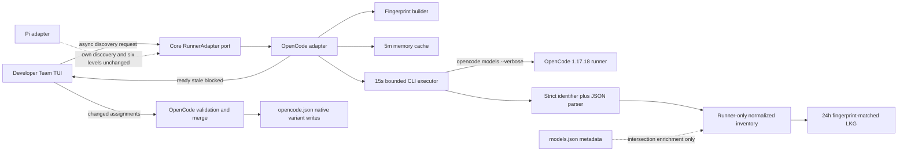
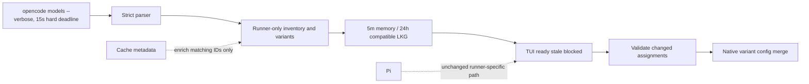

# Design: Runner-Resolved OpenCode Model and Variant Discovery

## Decision Summary

Deck will make `opencode models --verbose` the authoritative OpenCode discovery source. The OpenCode adapter will own an asynchronous, bounded command/parser/cache pipeline; core will expose runner-neutral discovery and validation contracts; and the TUI will render explicit loading, ready, stale, and blocked states. `models.json`, auth data, static catalogs, and the existing Deck variant cache may enrich metadata or invalidate snapshots, but they cannot add a provider, model, or variant.

The official SDK/server route is not selected. OpenCode 1.17.18 exposes typed `/provider` and `/config/providers` APIs, but Deck has no existing server connection or SDK dependency, starting a server adds lifecycle and version-coupling concerns, and the verified 1.17.18 server took about 3.8 seconds merely to become ready. In contrast, the 1.17.18 `models` command directly calls OpenCode's resolved provider service and serializes every final model object, including `variants`. Discovery has a resolved 15,000 ms hard subprocess deadline, which covers the observed runner latency with margin while remaining bounded.

## Source

- Proposal: `fix-runner-model-discovery-regression/proposal.md`
- Corrected investigation: `exploration.md`; the `exploration-corrected` event supersedes the stale-binary diagnosis.
- Capabilities affected:
  - New: `opencode-runner-resolved-model-inventory`, `opencode-runner-resolved-reasoning-variants`
  - Modified: `developer-team-tui-model-selection`, `opencode-model-configuration`, `opencode-model-metadata-enrichment`, `runner-adapter-inventory-contract`
  - Unchanged: `pi-model-configuration`, `developer-team-model-assignment-propagation`
- Spec status: not yet available; Design and Spec are running in parallel.
- Runtime verified: local OpenCode `1.17.18`.
- Resolved user decision: the OpenCode discovery hard subprocess deadline is **15,000 ms**, superseding the proposal's earlier 3-second value.

## Verified OpenCode Runtime Contract

### Runtime evidence

| Probe | Verified behavior |
|---|---|
| `opencode --version` | Reports `1.17.18`. |
| `opencode models --help` | Supports `--verbose` and the separately network-backed `--refresh`; no JSON-output flag exists. |
| OpenCode 1.17.18 source | `ModelsCommand` obtains `Provider.Service`, calls `provider.list()`, prints each `providerID/modelID`, then prints `JSON.stringify(model, null, 2)` when verbose. |
| Live verbose output | 107 identifier/JSON pairs, 10 providers, 107 balanced top-level JSON objects, and no header/`providerID` mismatches. |
| Live variants | 53 models have variants; observed keys are `low`, `medium`, `high`, `max`, `none`, `thinking`, `minimal`, and `xhigh`. |
| Built-in provider | The output includes `opencode/*` without requiring an auth-derived provider entry. |
| Current docs | `/provider` returns `all`, `default`, and `connected`; `/config/providers` returns providers and defaults. The SDK can start a new server or connect to a known server URL. |

### Resolved timeout decision and rationale

On this machine, `opencode models --verbose` completed in approximately 7.55 seconds cold and 4.11-4.37 seconds on immediate repeats; `opencode --version` took about 1.25 seconds. A standalone server became ready after approximately 3.8 seconds, before any provider request. This evidence showed that the proposal's earlier 3-second value was too short for the supported local runtime.

The user selected the tolerant option: use a **15,000 ms hard subprocess discovery deadline**, inclusive of process execution. This is long enough to cover the observed 7.55-second cold run with substantial margin, remains bounded, and preserves the same timeout handling: kill the subprocess and use only an eligible snapshot or blocked state when the deadline expires. The timeout decision is resolved and does not block Apply.

## Current Architecture Context

- `packages/adapter-opencode/src/model-inventory.ts` synchronously reads `~/.cache/opencode/models.json`, derives configured providers from auth/env signals, and treats cached `reasoning_options`/legacy `variants` as authoritative.
- `OpenCodeRunnerAdapterImpl.getModelInventory()` synchronously memoizes that inventory for the lifetime of the adapter. There is no TTL, fingerprint, refresh, or failure-state contract.
- `getThinkingLevels(modelId)` reads cached variants; `supportsThinking(modelId)` may fall back to the static catalog when a model is absent.
- `RunnerAdapter.getModelInventory?()` is typed as synchronous even though `resolveAdapterModelInventory()` in the TUI contains an ad hoc sync-or-Promise bridge.
- `detectOpenCodeModelInventoryForTui()` prefers the cache-backed adapter and then falls back to plain `opencode models`. This fallback cannot provide final variants and turns failures into an indistinguishable empty inventory.
- `hydrateDeveloperTeamModelConfig()` removes persisted thinking assignments when synchronous capability checks fail. This is destructive in memory and cannot represent stale assignments safely.
- New OpenCode writes still use the closed `OpenCodeThinkingLevel`/`reasoningEffort` path, while OpenCode's resolved values are arbitrary final `variant` keys.
- Pi has separate CLI/config semantics and fixed six-level reasoning behavior. It must not inherit OpenCode discovery, parsing, cache, or write rules.

## Proposed Architecture

### Component / Module Boundaries

| Component | Responsibility | Change Type |
|---|---|---|
| `packages/core/src/runner-adapter.ts` | Runner-neutral async inventory result, variant-key, and assignment-validation contracts. No OpenCode paths, commands, or cache rules. | Modified |
| `packages/adapter-opencode/src/opencode-models-cli.ts` | Execute the exact OpenCode command without a shell; parse and validate identifier/JSON pairs; normalize only safe runner data. | New |
| `packages/adapter-opencode/src/model-inventory-cache.ts` | Build fingerprints; manage 5-minute in-process entries and optional 24-hour compatible LKG snapshots. | New |
| `packages/adapter-opencode/src/model-inventory.ts` | Orchestrate live discovery, metadata-only enrichment, cache selection, diagnostics, and result states. | Replaced in place |
| `packages/adapter-opencode/src/runner-adapter.ts` | Implement async discovery and validation ports; retain the latest usable snapshot for synchronous variant lookups after loading. | Modified |
| `packages/adapter-opencode/src/model-config.ts` | Read native `variant` with legacy `reasoningEffort` fallback; preserve arbitrary validated strings; report stale status instead of sanitizing on read. | Modified |
| `packages/adapter-opencode/src/developer-team-install.ts` | Merge unchanged persisted assignments non-destructively; write only validated changed model/variant values. | Modified |
| `apps/cli/src/tui/app.tsx` | Own loading/result state, explicit local rescan, dirty-agent tracking, stale assignment annotation, and pre-write validation. | Modified |
| `apps/cli/src/tui/screens/developer-team-screens.tsx` | Render loading/error/stale banners, retry guidance, unavailable assignments, and disabled apply state. | Modified |
| Pi adapter/config modules | Continue Pi-owned provider/model discovery and fixed six-level behavior. | Unchanged except regression tests |

### Core Contracts

The existing inventory payload remains runner-neutral, but availability state moves to a discriminated result. Names are illustrative TypeScript declarations and are the implementation contract for Task/Apply:

```ts
export type RunnerVariantKey = string;

export type RunnerModelSource = "runner-resolved";

export type RunnerModelEntry = {
  id: string;                 // exact canonical provider/model header from the runner
  providerId: string;         // prefix before the first slash
  modelId: string;            // remainder after the first slash; may contain slashes
  displayName: string;
  supportsTools?: boolean;
  supportsReasoning?: boolean | null; // metadata only; not variant authority
  variants: readonly RunnerVariantKey[];
  metadataSource: "runner" | "runner+cache";
  source: RunnerModelSource;
};

export type RunnerModelProvider = {
  id: string;
  displayName: string;
  envVars?: readonly string[]; // metadata/fingerprint input only
  source: RunnerModelSource;
};

export type RunnerModelInventory = {
  providers: readonly RunnerModelProvider[];
  modelsByProvider: Readonly<Record<string, readonly RunnerModelEntry[]>>;
  diagnostics?: readonly string[];
};

export type RunnerModelDiscoveryError = {
  code:
    | "runner-not-found"
    | "timeout"
    | "command-failed"
    | "output-too-large"
    | "malformed-output"
    | "incompatible-snapshot";
  message: string;            // sanitized/actionable; never raw subprocess output
  retryable: boolean;
};

export type RunnerModelDiscoveryRequest = {
  projectRoot: string;
  mode?: "prefer-cache" | "rescan"; // rescan bypasses Deck caches; never implies --refresh
};

export type RunnerModelInventoryResult =
  | {
      state: "ready";
      inventory: RunnerModelInventory;
      source: "live" | "memory";
      discoveredAt: number;
      fingerprint: string;
    }
  | {
      state: "stale";
      inventory: RunnerModelInventory;
      source: "last-known-good";
      discoveredAt: number;
      fingerprint: string;
      error: RunnerModelDiscoveryError;
    }
  | {
      state: "blocked";
      inventory: null;
      source: "none";
      error: RunnerModelDiscoveryError;
    };

export type RunnerModelAssignmentValidationInput = {
  projectRoot: string;
  modelAssignments: DeveloperTeamModelAssignments;
  thinkingAssignments: DeveloperTeamThinkingAssignments;
  changedAgentIds: readonly string[];
  expectedFingerprint?: string;
};

export type RunnerModelAssignmentIssue = {
  agentId: string;
  code: "model-unavailable" | "variant-unavailable" | "inventory-not-ready";
  message: string;
};

export type RunnerModelAssignmentValidationResult =
  | { valid: true; fingerprint: string }
  | { valid: false; issues: readonly RunnerModelAssignmentIssue[] };
```

`RunnerAdapter` changes are additive for runners that do not offer dynamic inventory:

```ts
getModelInventory?(
  request: RunnerModelDiscoveryRequest,
): Promise<RunnerModelInventoryResult>;

validateModelAssignments?(
  input: RunnerModelAssignmentValidationInput,
): Promise<RunnerModelAssignmentValidationResult>;

getThinkingLevels(modelId?: string): readonly RunnerVariantKey[];
```

- Remove the TUI's untyped sync/Promise probing. An implementing adapter is always async.
- Pi need not implement either optional discovery/validation method and retains its existing paths.
- `RunnerThinkingLevel = ReasoningLevel` remains available for fixed runner-native sets, but dynamic model variants use `RunnerVariantKey`; no unsafe cast is required.
- `DeveloperTeamAdapterInstallInput` gains optional `changedAgentIds` and `validatedInventoryFingerprint` fields. OpenCode stores them in its native plan and revalidates in `applyDeveloperTeamInstall()` before any config write. Pi ignores them.

### Adapter-Local Injectable Seams

```ts
type OpenCodeCommandRequest = {
  file: string;               // resolved absolute executable path
  args: readonly string[];
  cwd: string;
  timeoutMs: number;
  maxStdoutBytes: number;
  maxStderrBytes: number;
};

interface OpenCodeCommandRunner {
  run(request: OpenCodeCommandRequest): Promise<{
    exitCode: number | null;
    signal: string | null;
    stdout: string;
    stderr: string;
  }>;
}

interface ModelDiscoveryFileSystem {
  readFile(path: string): Promise<string>;
  stat(path: string): Promise<{ size: number; mtimeMs: number; mode: number }>;
  realpath(path: string): Promise<string>;
  mkdir(path: string, mode: number): Promise<void>;
  writeFile(path: string, body: string, mode: number): Promise<void>;
  rename(from: string, to: string): Promise<void>;
}

type OpenCodeModelDiscoveryDependencies = {
  commandRunner: OpenCodeCommandRunner;
  fs: ModelDiscoveryFileSystem;
  now: () => number;
  env: Readonly<Record<string, string | undefined>>;
  resolveExecutable: (command: string, env: Readonly<Record<string, string | undefined>>) => Promise<string>;
};
```

Production uses Node/Bun built-ins. Tests inject every command, filesystem, environment, and clock interaction.

The production default is a named constant, `OPENCODE_DISCOVERY_TIMEOUT_MS = 15_000`, passed through `OpenCodeCommandRequest.timeoutMs`; tests override time through the command/clock seams rather than sleeping.

## Authoritative Discovery and Normalization

### Command

- Execute resolved `opencode` with the literal argument vector `['models', '--verbose']`.
- Never invoke through a shell and never interpolate provider/config/user text into arguments.
- Do not pass `--pure`, because it would suppress plugins and violate the requirement to reflect plugin-resolved providers/models.
- Do not pass `--refresh`; normal discovery reads the runner's current resolved state without a network refresh.
- Hard subprocess discovery deadline: **15,000 ms**, inclusive of process execution. Kill the process on expiry.
- Bounds: 8 MiB stdout, 256 KiB stderr, 10,000 model blocks, 256 KiB per JSON block, 512 bytes per canonical ID, 128 bytes per variant key, and 64 variants per model. Exceeding a bound fails the entire discovery.

### Parser grammar

OpenCode 1.17.18 emits repeated records:

```text
<provider/model identifier line>\n
<one complete JSON object, pretty printed across lines>\n
```

The parser will:

1. Read the next non-empty identifier line and require a non-control, non-whitespace string containing a slash with non-empty provider and model portions.
2. Split on the **first** slash. This preserves model IDs such as `openrouter/openai/gpt-*` while deriving provider `openrouter`.
3. Scan one complete top-level JSON object with a string/escape-aware state machine. It must not count braces inside JSON strings.
4. Parse the object and require `providerID` to equal the identifier prefix.
5. Treat the identifier line as the model's canonical ID. Do not require metadata `id` to equal the remainder: aliases may retain an alias key while targeting a different API/model ID.
6. Require `variants` to be a non-array object. Preserve its validated keys exactly and in emitted order; ignore variant values because Deck only selects names.
7. Ignore unknown metadata fields. Allow additive OpenCode fields without parser changes.
8. Reject duplicate canonical IDs, malformed records, trailing non-whitespace text, provider mismatches, missing `variants`, oversized values, or invalid variant keys. Do not return a partial authoritative inventory.
9. Stable-sort providers by display name/ID and models by display name/canonical ID only for presentation; variant order remains runner order.

An exit-zero empty stream is a valid ready inventory with a `runner-returned-no-models` diagnostic, not a parser failure. Non-zero exit, timeout, malformed output, or overflow are failures.

### Version handling

- Parser schema version starts at `1`; fixture names include the verified OpenCode version.
- Capture `opencode --version` when it can be obtained inside the configured discovery budget or from a previously verified binary-identity cache. Version lookup failure does not make otherwise valid verbose output unavailable.
- Do not maintain guessed per-version text parsers. Any runtime version is accepted if it satisfies the strict record contract; otherwise return `malformed-output` with the sanitized version in diagnostics.
- Binary path/stat or version changes invalidate memory and LKG entries. LKG reuse requires an exact fingerprint match, so a new OpenCode version cannot consume an old parser snapshot silently.

### Provider derivation

- Provider availability comes only from canonical IDs emitted by the command.
- Built-in `opencode`, auth-backed providers, custom providers, aliases, and plugin-contributed providers require no Deck special cases.
- The model header identifies an alias exposed to users. The JSON block supplies the runner's final transformed metadata and variants.
- `auth.json`, configured-provider sets, environment variables, and cache provider lists never filter or add providers. They participate only in fingerprint invalidation or metadata enrichment.

### Metadata-only enrichment

The verbose JSON block is the first metadata source. An optional cache enricher may fill only allowlisted missing fields on an already runner-returned canonical ID:

- provider/model display name
- environment variable **names**
- tool/reasoning capability hints
- context-window metadata if later exposed by the core DTO

It must use an intersection join (`runner IDs ∩ cache IDs`). It cannot create providers/models, remove runner entries, change model IDs, populate `variants`, or alter runner-provided values. Raw `headers`, `options`, endpoint credentials, and config values are never copied into normalized inventory or snapshots.

## Cache, Fingerprint, and Failure Policy

### Fingerprint

Compute SHA-256 over a canonical object containing:

- fingerprint schema/parser version
- resolved executable realpath plus binary size and mtime (inode/device when available)
- OpenCode version when available
- real project/workspace root
- applicable global and workspace OpenCode config candidates, represented by path, existence, size, mtime, and content digest (contents are never stored or logged)
- auth file path, existence, size, and mtime; never credential values or credential-derived hashes
- local plugin file paths referenced by config plus safe stat/content digests
- sorted names of currently present provider credential environment variables, derived from cache/config env-name metadata; never environment values

Changes in any available field invalidate the entry. Missing fingerprint inputs are represented explicitly, not omitted, to prevent accidental matches.

### In-process cache

- Key by full fingerprint.
- TTL: five minutes from successful live discovery.
- Bound to eight entries with least-recently-used eviction.
- Concurrent requests for one fingerprint share one in-flight Promise.
- `mode: 'rescan'` bypasses a completed memory entry but still coalesces concurrent rescans.
- A failed rescan does not replace a still-valid successful memory entry; the caller receives the fresh memory snapshot plus a diagnostic only if that snapshot remains inside its five-minute TTL.

### Last-known-good snapshot

Implement the optional LKG because it gives bounded fail-closed resilience without reviving broad catalogs:

- Path: `${XDG_CACHE_HOME:-~/.cache}/deck/opencode/model-inventory-v1/<scope-hash>.json`, where scope hash is derived from runner realpath and project root.
- Maximum age: 24 hours.
- Reuse only when schema/parser version and the complete current fingerprint match.
- Contents: normalized allowlisted inventory, fingerprint digest, discovery timestamp, OpenCode version, and schema version only. Never persist raw command output, headers, options, auth/config contents, environment values, or error streams.
- Create directories with `0700`; write an adjacent random temporary file with `0600`, fsync where supported, rename atomically, and keep final mode `0600`.
- Invalid, old, over-limit, incorrectly permissioned, or fingerprint-mismatched snapshots are ignored and may be replaced only by a later successful live discovery.

### Result selection

1. Return a matching unexpired in-process snapshot as `ready/memory`.
2. Otherwise run live discovery.
3. On success, return `ready/live`, update memory, and atomically replace LKG.
4. On failure, return a matching LKG younger than 24 hours as `stale/last-known-good` with the live error.
5. Without a compatible LKG, return `blocked` with no inventory.

Never fall back to `models.json`, the static core catalog, auth-filtered providers, plain CLI output, cached `reasoning_options`, or the Deck model-variants plugin.

## TUI and Persistence Behavior

### UI states

| State | Behavior |
|---|---|
| Loading | Route to a model-inventory loading view before awaiting discovery. Keep current persisted assignments in memory, show `Reading models from OpenCode…`, and do not render empty provider/model lists. |
| Ready | Render runner-derived providers/models and exact model variant keys. Enable edits and apply after validation. |
| Ready but empty | Show `OpenCode reported no available models.` with Retry and Back. This is distinct from command failure. |
| Stale LKG | Render the snapshot with a persistent `Last known OpenCode models (discovered <time>)` warning. Permit inspection, but disable new/changed assignment writes until a live rescan succeeds. |
| Blocked | Show sanitized reason (`timed out`, `not found`, `failed`, or `output incompatible`), Retry, command guidance (`opencode models --verbose`), and Back. Do not show cache/catalog-only choices. |

### Explicit refresh

- Pressing `r`/selecting `Retry discovery` invokes `getModelInventory({ mode: 'rescan' })`, bypassing Deck's memory and LKG selection for the live attempt.
- This action still executes only `opencode models --verbose`. It never appends `--refresh` and therefore does not intentionally refresh models.dev or introduce an automatic network operation.
- This change does not add a network-refresh action. Users may explicitly run `opencode models --refresh` outside Deck, then use Deck's rescan. A future network action requires separate product/spec approval and clear network copy.

### Persisted and stale assignments

- Hydration reads model IDs non-destructively and reads `agent.variant` first; an empty/absent `variant` falls back to legacy `agent.reasoningEffort`.
- Hydration no longer deletes a thinking assignment merely because inventory has not loaded or a synchronous catalog check fails.
- After discovery, each persisted assignment is annotated as:
  - `available`: exact model and variant are present;
  - `model-unavailable`: model is absent;
  - `variant-unavailable`: model exists but the non-empty persisted variant is absent;
  - `unverified`: discovery is stale/blocked.
- Persisted-only models are shown in the agent summary with an `Unavailable` badge; they are not injected into provider/model selection lists and therefore do not become availability authority.
- Leaving an agent unchanged preserves its raw model, `variant`, and legacy `reasoningEffort` fields byte-for-value through the config merge.
- Changing a model requires a `ready` inventory and exact canonical ID membership. Suffix matching is removed.
- Changing a variant requires exact membership in that model's final `variants` keys. No nearest-level mapping or canonical fallback is allowed.
- Selecting a different model clears the old variant in TUI state. If the new model has variants, the user explicitly selects one or leaves it unset. If it has none, the changed agent's obsolete `variant`/`reasoningEffort` is removed.
- New/changed OpenCode assignments write native `variant`; legacy `reasoningEffort` is read-only compatibility and is removed only on the changed agent. Unrelated config and unchanged agents remain untouched.

### Validation and write race protection

1. TUI tracks `changedAgentIds` rather than treating the hydrated full map as newly selected values.
2. Before plan creation, `validateModelAssignments()` requires a `ready` inventory and validates changed agents only.
3. The successful validation fingerprint is passed into the install plan.
4. `applyDeveloperTeamInstall()` rechecks the fingerprint and changed values before writing. A config/auth/plugin/binary fingerprint change triggers discovery; stale/blocked discovery aborts before disk modification.
5. Existing backup/rollback behavior remains around the subsequent write and verification.

This boundary protects non-TUI callers too: they cannot bypass OpenCode model/variant validation merely by constructing an install input directly.

## Data Flow

1. The TUI reads persisted assignments without sanitizing them and enters loading state.
2. The OpenCode adapter builds a runner/config fingerprint.
3. The discovery service checks the five-minute in-process cache, otherwise runs `opencode models --verbose` under limits.
4. The parser validates every identifier/JSON pair and builds the normalized runner-only inventory.
5. Cache metadata may enrich matching entries only.
6. A successful result populates memory and the compatible LKG. A failure selects only a fingerprint-matched LKG or returns blocked.
7. The TUI annotates persisted assignments against the result and renders the appropriate state.
8. A user edit is validated against a ready snapshot; apply revalidates the fingerprint and writes only changed assignment fields.

## Architecture Diagrams

### Component diagram



### Discovery and write sequence

```mermaid
sequenceDiagram
  actor User
  participant TUI
  participant Adapter as OpenCode adapter
  participant Cache as Memory/LKG
  participant CLI as CLI executor/parser
  participant Runner as opencode
  participant Config as opencode.json writer

  User->>TUI: Open model configuration
  TUI->>TUI: Read persisted values; show loading
  TUI->>Adapter: getModelInventory(prefer-cache)
  Adapter->>Cache: Lookup fingerprint and 5m TTL
  alt fresh memory hit
    Cache-->>Adapter: ready snapshot
  else no fresh memory
    Adapter->>Runner: spawn [models, --verbose], no shell/no --refresh, 15,000 ms hard deadline
    Runner-->>CLI: ID + final JSON blocks
    CLI-->>Adapter: validated normalized inventory
    alt live success
      Adapter->>Cache: Save memory + safe 24h LKG
    else timeout/failure
      Cache-->>Adapter: compatible LKG or none
    end
  end
  Adapter-->>TUI: ready, stale, or blocked
  User->>TUI: Change model/variant and Apply
  TUI->>Adapter: validate changed agents
  Adapter->>Adapter: Require ready snapshot + exact memberships
  alt valid and fingerprint unchanged
    Adapter->>Config: Merge changed fields; preserve unchanged stale values
    Config-->>TUI: Applied and verified
  else stale, blocked, or invalid
    Adapter-->>TUI: Actionable validation issue; no write
  end
```

## API / Contract Implications

| Interface | Change | Backward Compatible |
|---|---|---|
| `RunnerAdapter.getModelInventory` | Becomes an optional, explicitly async discovery port returning a discriminated result. | Partial; OpenCode/TUI/mocks migrate together. Pi can omit it. |
| `RunnerAdapter.getThinkingLevels` | Returns runner variant strings rather than forcing dynamic values through closed `ReasoningLevel`. | Source-compatible for Pi values; TypeScript consumers/mocks need updates. |
| `RunnerAdapter.validateModelAssignments` | New optional pre-write validation port. | Yes for adapters that omit it; OpenCode callers must use it. |
| `RunnerModelEntry` | Adds raw `modelId`, required `variants`, and safe metadata/source fields. | Partial; inventory producers/tests update. |
| `DeveloperTeamAdapterInstallInput` | Adds dirty-agent and validated-fingerprint evidence. | Yes; fields are optional and Pi ignores them. |
| OpenCode config | New changes write native `variant`; reads preserve `variant ?? reasoningEffort`. | Partial; old values remain readable and unchanged values are preserved. |

No external Deck HTTP API changes are introduced.

## State / Persistence Implications

- New cache schema: normalized LKG `model-inventory-v1`; it is ephemeral and safe to delete.
- No project database or durable schema migration.
- Existing `opencode.json` values are not batch-migrated. Migration happens only when a user changes a specific agent assignment.
- TUI adds transient discovery result, loading/error state, persisted-assignment status, and dirty-agent state.

## Migration / Backward Compatibility

### Existing Deck/OpenCode users

1. First open reads current config without mutation.
2. Discovery may mark assignments unavailable or variants stale, but does not rewrite them.
3. An agent migrates from legacy `reasoningEffort` to native `variant` only when that agent is changed and validated.
4. Unknown/unsupported values remain preserved until the user edits that agent.
5. LKG v1 is optional; absence causes live discovery or blocked UX, not catalog fallback.

### Reconciliation with overlapping changes

| Change | Reuse | Replace / Ownership Boundary | Registry reconciliation intent |
|---|---|---|---|
| `opencode-configured-providers-filter` | Keep `MenuList` windowing, zero-width placeholder fix, and cursor clamping. Reuse env-name parsing only for metadata/fingerprint input. | Supersede auth/env provider filtering as availability authority and remove its remaining backend task from independent implementation. Runner IDs determine providers. | Orchestrator should mark its backend availability work superseded by this change while preserving the completed TUI fix history. |
| `fix-opencode-effort-levels-hardcoded` | Keep model-specific TUI plumbing and tests that pass exact arrays/hide empty selectors. | Replace cache `reasoning_options` authority, lifetime memoization, closed-type casts, catalog fallback, and legacy new writes with final runner `variants` keys. | Record this change as the corrective successor; do not re-run its completed Apply as a separate implementation. |
| `tui-model-assignment-bug` | Consume its eventual assignment-propagation fix and shared full assignment maps. | This change owns OpenCode discovery, validation, dirty-agent preservation, and safe config merge. It does not implement Pi/team-bundle propagation. | Its future Task/Apply must pass assignment changes through the new validation boundary and must not duplicate inventory logic. |

`packages/adapter-opencode/src/model-variants.ts` and `assets/opencode/plugins/model-variants.ts` remain non-authoritative compatibility artifacts in this change. Do not call them from discovery or validation. Their eventual deprecation/removal requires a separate usage audit and is not needed to fix this regression.

## File Impact Estimate

| File / Path | Action | Rationale |
|---|---|---|
| `packages/core/src/runner-adapter.ts` | Modify | Add async result/validation/variant contracts. |
| `packages/core/src/adapter-registry.test.ts` | Modify | Update contract mocks and optional-method compatibility. |
| `packages/adapter-opencode/src/opencode-models-cli.ts` | Create | Isolate command execution and strict parsing. |
| `packages/adapter-opencode/src/opencode-models-cli.test.ts` | Create | Parser, limits, command-vector, and timeout tests. |
| `packages/adapter-opencode/src/model-inventory-cache.ts` | Create | Fingerprint, TTL, in-flight coalescing, and LKG implementation. |
| `packages/adapter-opencode/src/model-inventory-cache.test.ts` | Create | Clock/fs/permission/fingerprint/LKG tests. |
| `packages/adapter-opencode/src/model-inventory.ts` | Rewrite | Replace cache authority with runner discovery orchestration and enrichment. |
| `packages/adapter-opencode/src/model-inventory.test.ts` | Rewrite | Runner-only membership and metadata-enrichment tests. |
| `packages/adapter-opencode/src/runner-adapter.ts` | Modify | Async discovery, latest snapshot, exact levels, validation, apply recheck. |
| `packages/adapter-opencode/src/runner-adapter.inventory.test.ts` | Modify | Discovery state and exact variant integration tests. |
| `packages/adapter-opencode/src/model-config.ts` | Modify | Native variant read, legacy fallback, arbitrary string preservation/status. |
| `packages/adapter-opencode/src/model-config.test.ts` | Modify | Stale/non-destructive read and variant precedence tests. |
| `packages/adapter-opencode/src/developer-team-install.ts` | Modify | Changed-agent native variant merge and validation evidence. |
| `packages/adapter-opencode/src/developer-team-install.test.ts` | Modify | Preserve unchanged stale values; reject invalid changed writes. |
| `packages/adapter-opencode/src/__tests__/fixtures/opencode-models-verbose/` | Create | Versioned deterministic stdout/error fixtures. |
| `apps/cli/src/tui/app.tsx` | Modify | Loading/result/refresh/dirty/validation flow; remove plain CLI fallback. |
| `apps/cli/src/tui/screens/developer-team-screens.tsx` | Modify | Loading, stale, unavailable, and blocked presentation. |
| `apps/cli/src/tui/__tests__/developer-team-screens-effort.test.tsx` | Modify | Exact dynamic variants plus stale/error rendering. |
| `apps/cli/src/tui/developer-team-flow.test.tsx` | Modify | Async loading/rescan/blocked/persistence flow. |
| `packages/adapter-pi/src/runner-adapter.test.ts` | Modify | Prove fixed six-level and optional-discovery behavior is unchanged. |
| `packages/adapter-pi/src/model-config.test.ts` | Modify | Pi assignment semantics anti-regression. |

Estimated impact: 3 new source modules/directories, 3 new test/fixture areas, and 15 existing source/test files modified. Task may consolidate tests but must preserve the boundaries above.

## Deterministic TDD Strategy

Implementation proceeds red-green by layer; no test executes the installed OpenCode binary or network:

1. **Parser contract first**
   - Fixtures: verified 1.17.18 normal output; nested objects; braces/escapes in strings; built-in `opencode`; custom/plugin provider; alias header whose metadata ID differs; model ID containing extra slashes; empty variants; custom variant keys; empty output.
   - Failure fixtures: truncated JSON, log/trailing garbage, duplicate ID, provider mismatch, missing/non-object variants, oversized output/block/key/count, non-zero exit, timeout.
   - The injected executor proves completion before 15,000 ms succeeds, reaching the 15,000 ms hard deadline aborts and classifies the attempt as `timeout`, and process termination is requested exactly once. Tests use a fake clock/runner and do not wait in real time.
2. **Coordinator/cache**
   - Fake command runner asserts exact executable/args/cwd/limits and throws if `--refresh`, `--pure`, a shell, or a network helper appears.
   - Fake clock proves five-minute hit/expiry, rescan bypass, in-flight coalescing, and bounded LRU.
   - Fake filesystem proves fingerprint invalidation for binary/version/config/auth/plugin/env-name changes and no invalidation for credential value changes.
   - LKG tests prove 24-hour boundary, exact fingerprint/schema matching, atomic write shape, safe fields, and POSIX modes.
3. **Metadata authority**
   - A fixture with runner-only and cache-only models proves runner-only inclusion and cache-only exclusion.
   - Cache variants deliberately disagree with runner variants; normalized output must equal runner keys exactly.
4. **Adapter/config writes**
   - Tests load a ready snapshot, validate exact canonical IDs and variants, reject suffix matches, block stale/blocked writes, and recheck fingerprint at apply.
   - Tests preserve unchanged stale model/variant/legacy values and mutate only selected agents.
5. **TUI**
   - Deferred Promises prove loading renders before completion.
   - Ready, empty, stale, and blocked result fixtures prove routing/copy.
   - `r` proves local rescan and no network refresh.
   - Stale persisted assignments remain visible and unchanged; apply stays disabled until live ready.
6. **Pi regression**
   - Pi's provider/model discovery, six levels, assignment reads/writes, and screens remain byte-for-behavior equivalent.

A manual, non-CI runtime check may compare parsed IDs/variant keys with local `opencode models --verbose`; it is evidence only and never a deterministic test dependency.

## Observability / Error Handling

- Log structured event names, duration, state, source (`live`, `memory`, `last-known-good`, `none`), counts, sanitized version, and error code.
- Never log stdout JSON, stderr, config/auth contents, environment values, normalized raw options/headers, or credentials.
- User messages are stable and actionable; parser internals remain diagnostic codes rather than raw payload excerpts.
- Treat malformed output as an external-boundary validation failure. Do not continue with a partial inventory.
- Expose stale timestamp and Retry; do not silently label LKG as current.

## Security / Performance / Accessibility Considerations

### Security

- Use `spawn`/equivalent with an absolute executable and literal argument array; `shell: false`.
- Enforce timeout, kill, stdout/stderr/model/block/key bounds, and in-flight/LRU bounds.
- Validate all external strings before rendering or persistence; reject control characters.
- Keep raw verbose blocks in memory only until normalization; use an allowlist for snapshots.
- Use private cache directory/file modes and atomic writes; symlink-safe creation/rename should follow existing Deck filesystem utilities where available.
- Fingerprint only environment variable names and auth stat metadata, never secret values.

### Performance

- Five-minute memory TTL and request coalescing avoid repeated runner startups.
- Parsing is linear in bounded stdout size; JSON blocks are processed once.
- Metadata enrichment is an indexed intersection, not nested broad scans.
- The measured OpenCode 1.17.18 latency (about 7.55 seconds cold and 4.11-4.37 seconds warm) fits within the resolved 15,000 ms hard deadline. Loading UI, five-minute memory TTL, request coalescing, and the optional compatible LKG prevent that worst-case wait from recurring on ordinary navigation.

### Accessibility

- Loading/stale/error states use text labels, not color alone.
- Retry and Back remain keyboard reachable; stale badges are included in screen-reader/terminal text.
- Existing long-list windowing/cursor fixes are retained.

## Tradeoffs

| Decision | Chosen | Rejected Alternative | Rationale |
|---|---|---|---|
| Authoritative source | Isolated parse of `opencode models --verbose` | Start/connect official SDK/server | The CLI is installed with the selected runner and directly serializes `Provider.Service.list()` final models. The server adds SDK/runtime version coupling, port/auth/lifecycle work, and measured about 3.8 seconds merely to become ready before any provider request. |
| Discovery timeout | 15,000 ms hard subprocess deadline | Proposal's earlier 3,000 ms deadline or an unbounded wait | The verified runner took about 7.55 seconds cold and 4.11-4.37 seconds warm. Fifteen seconds provides measured margin while preserving deterministic termination and fail-closed behavior. |
| Failure behavior | Fresh runner snapshot, compatible LKG, or blocked | Auth/cache/static fallback | Only the chosen path preserves runner availability and final variants. |
| Parser compatibility | Strict shape validation, additive metadata tolerance, exact-version fingerprint invalidation | Loose line/brace splitting or hardcoded per-version parsers | Strict boundaries prevent partial/poisoned inventories while unknown metadata remains forward-compatible. |
| Variant contract | Arbitrary validated runner string keys | Closed canonical effort union or nearest mapping | Live 1.17.18 already emits non-canonical keys such as `thinking`, `minimal`, `none`, and `max`. |
| Persistent resilience | Safe normalized 24h LKG | No persistence or raw output snapshot | LKG improves bounded resilience; normalized allowlisting avoids credential-bearing metadata. |
| Stale assignment migration | Preserve unchanged, validate changed | Eager cleanup/normalization | Avoids destructive config changes and unsupported guesses. |
| Refresh | Explicit local rescan without `--refresh` | Automatic or TUI-triggered network cache refresh | Keeps TUI opening deterministic and within proposal scope. |
| Pi compatibility | Optional runner-specific ports | Force Pi through OpenCode-style discovery/result semantics | Runner ownership is the architectural boundary; Pi already has valid independent behavior. |

## Risks

| Risk | Likelihood | Impact | Mitigation |
|---|---|---|---|
| A slow runner consumes most of the 15-second deadline and delays first-open UX | Medium | Medium | Render loading immediately; use five-minute memory TTL, in-flight coalescing, optional compatible LKG, duration telemetry, and hard termination at 15,000 ms. |
| CLI format changes | Medium | High | Isolated strict parser, version/fingerprint invalidation, fixtures, fail closed. |
| Plugin writes unexpected stdout | Low/Medium | Medium | Treat non-record stdout as malformed; surface sanitized retry guidance rather than parsing logs. |
| LKG becomes misleading | Medium | Medium | 24h maximum, exact fingerprint, visible stale state, no writes from stale inventory. |
| Metadata accidentally becomes authority | Medium | High | Intersection-only enricher and adversarial cache-only/variant-disagreement tests. |
| Config write removes stale unrelated values | Medium | High | Dirty-agent tracking, raw read preservation, merge tests, pre-write/apply revalidation. |
| Core async contract breaks mocks/callers | Medium | Medium | Optional port, compile-time migration of OpenCode/TUI mocks, Pi regression suite. |
| Snapshot leaks sensitive runner fields | Low | High | Normalized allowlist, no raw blocks/options/headers, `0700`/`0600`, content-shape tests. |

## Open Decisions

None — the timeout decision is resolved at 15,000 ms and the design is self-contained. Runtime compatibility is contract-based: OpenCode 1.17.18 is the verified baseline, and other versions are accepted only when their output passes the strict record validation and fingerprint rules. The TUI stale/error copy and refresh semantics are also decided; automatic network refresh remains out of scope.

## Dependencies

- Installed OpenCode executable supporting the verified identifier-plus-JSON verbose contract.
- Existing Deck backup/atomic config merge utilities where compatible.
- Spec must align acceptance behavior with the stale/write-blocking and native `variant` decisions.
- Deferred Spec/registry reconciliation must replace stale 3-second references with the resolved 15,000 ms deadline; this is bookkeeping alignment, not an unresolved Design or Apply decision.

## Rollback and Compatibility Strategy

- Keep the implementation in adapter-owned modules so rollback is a targeted revert of core contract additions, adapter discovery/cache, TUI states, config validation, and tests.
- LKG files are disposable and schema-versioned; an older Deck ignores them. Rollback may delete them manually, but no cleanup migration is required.
- Persisted config remains valid OpenCode config. Unchanged legacy `reasoningEffort` values survive; newly changed assignments use native `variant`, which OpenCode understands even if an older Deck UI does not expose every key.
- Do not retain a feature flag that silently restores cache/catalog authority. Emergency rollback means reverting to the previous release with the known regression documented, not mixing both sources in one release.
- Pi code paths and persisted Pi configuration remain unchanged, enabling runner-specific rollback and regression isolation.

## Preconditions Intent

None. The timeout decision is resolved at 15,000 ms, so the prior timeout precondition is satisfied and no residual timeout blocker remains. Registry-deferred mode forbids editing `preconditions.md`; the Orchestrator should reconcile that existing record and related registry/Spec references separately.

## Next Steps

Ready for Task (`deck-developer-task`) to combine this design with the timeout-reconciled Spec and produce implementation tasks. No Design or Apply blocker remains from the discovery timeout decision.

## Mermaid Summary Source

See **Architecture Diagrams** for the component and sequence sources. Compact summary:



---

# Human Override Replan

## Replan Authority and Boundary

- **Incident**: `verify-review-blockers-round-1`
- **Authorization**: explicit user-approved higher-level override after the Repair Cycle 1 hard stop.
- **Registry mode**: deferred; this section is the only artifact mutation in this phase.
- **Additional Apply capacity**: one focused sequential batch.
- **Additional attempt capacity**: one attempt for each scoped fingerprint:
  - `discovery-runtime-cache-fingerprint-lkg-unwired`
  - `opencode-timeout-not-hard-bounded`
  - `required-regression-matrix-incomplete`
- **Verification capacity**: one final Verify + Review cycle.
- **Final hard stop**: any recurrence of a scoped fingerprint, or any failure in Verify + Review cycle 2.
- **Explicitly not reopened**: runner authority, exact variants, unchanged-assignment preservation, latest-request coordination, empty-state routing, LKG schema/privacy/atomicity, immutable plan implementation, UTF-8 decoding, Pi behavior, and the already-passing TUI/compatibility slice. Existing behavior in those areas may only receive the integration evidence listed below.

### `evaluateRepairIncident()` decision semantics

Repair Cycle 1 correctly produced `block`: per-fingerprint hard attempt exhaustion has higher priority than a soft checkpoint. This human authorization does not relabel that result or weaken priority ordering. It creates a narrowly scoped replacement budget envelope for the three named failures. Within that envelope, the next action is **continue** into one focused Apply batch. After that batch, the next evaluation MUST return `block` without another automatic repair when any scoped fingerprint remains/recurs or cycle 2 fails. No unscoped finding may be silently folded into this override; a genuinely new blocker goes directly to escalation.

## Stricter Evidence Resolution

The Repair Cycle 1 Review evidence is controlling wherever Verify and Review differed. Green unit tests do not prove the contract unless they exercise the default production composition and assert the public boundary. In particular:

1. The discovery deadline is one absolute caller-visible budget, not a per-process timeout plus cleanup grace.
2. A fingerprint test must enter through the default adapter composition; supplying `inventoryDiscovery` bypasses the behavior under test.
3. Extracted coordinator tests supplement, but do not replace, a mounted `DeckApp` transition test.
4. Existing immutable-plan source logic is retained, but acceptance requires two independently built plans applied in reverse order.

## Revised Architecture

### 1. One absolute discovery deadline

`OPENCODE_DISCOVERY_TIMEOUT_MS = 15_000` defines the maximum elapsed time from entry into default production discovery until the Promise returned by `OpenCodeRunnerAdapterImpl.getModelInventory()` settles. The budget includes executable identity resolution, version probing, fingerprint/LKG preparation, and `models --verbose`; version probing and verbose discovery MUST NOT each receive independent additive budgets.

#### Deadline contract

- `createDefaultOpenCodeInventoryDiscovery()` captures `startedAt` and `deadlineAt = startedAt + 15_000` once per public request and creates one abort/deadline signal.
- Every bounded operation receives `remainingMs = max(0, deadlineAt - now())`:
  - version probing receives `min(2_000, remainingMs)`;
  - verbose discovery receives the then-current `remainingMs`;
  - filesystem/context/LKG work remains under the outer absolute race even where the filesystem API itself is not cancellable.
- The public discovery Promise races all composition work against the absolute deadline. At `deadlineAt`, it settles once with the normal timeout selection result: an already-loaded, exact-fingerprint eligible LKG becomes `stale`; otherwise the result is `blocked/timeout`.
- A late internal completion cannot update memory cache, replace LKG, update `#latestReady`, or authorize a write. Cache/LKG commits check that the deadline signal is still active before mutation. The losing Promise is observed so it cannot produce an unhandled rejection.
- A memory hit may settle before the deadline. It still requires the current complete fingerprint; it does not bypass identity/context collection.

#### Caller settlement versus child cleanup

`createNodeOpenCodeCommandRunner().run()` separates two state machines:

1. **Caller state** (`pending | settled`): at timeout or output overflow, freeze stream accumulation, classify the reason, and resolve the caller Promise immediately and exactly once.
2. **Child cleanup state** (`running | term-sent | kill-sent | reaped`): send `SIGTERM` once, schedule `SIGKILL` after the existing 250 ms grace, and clear cleanup resources on `close`/`error`. Cleanup continues after caller settlement and never delays or re-settles the caller.

The shared absolute signal is added to `OpenCodeCommandRequest`. If the signal aborts before a command-local timer, the same immediate caller settlement and independent reap path runs. Close/error/signal races remain settle-once. Decoder flush after the deadline is cleanup-only and cannot append to the already returned bounded payload.

### 2. Complete production discovery context

Add `packages/adapter-opencode/src/model-discovery-context.ts` as the production-context boundary. It collects a typed, canonical `OpenCodeDiscoveryContext` using only injected filesystem, path-root, environment, executable, command, clock, and timer dependencies. `runner-adapter.ts` composes this factory; `buildDiscoveryFingerprint()` only canonicalizes and hashes the already-safe DTO.

```ts
type SafeFileState = {
  logicalPath: string;
  realPath: string | null;
  exists: boolean;
  kind: "file" | "directory" | "missing" | "unsafe";
  size: number | null;
  mtimeMs: number | null;
  ctimeMs: number | null;
  mode: number | null;
  safeDigest: string | null;
  digestDisposition: "sanitized" | "not-applicable" | "unavailable";
};

type OpenCodeDiscoveryContext = {
  schema: 2;
  runner: {
    realPath: string;
    stat: SafeFileState;
    version: string | null;
  };
  scope: {
    projectRoot: string;
    workspaceRoot: string;
  };
  configCandidates: readonly SafeFileState[];
  authFile: Omit<SafeFileState, "safeDigest" | "digestDisposition">;
  pluginFiles: readonly SafeFileState[];
  controlEnvironment: Readonly<Record<string, boolean | string | null>>;
  credentialEnvironment: readonly { name: string; present: boolean }[];
};
```

#### Runner and project scope

- Resolve `opencode` to an absolute realpath and include path, file kind, size, mtime, ctime, mode, and version. Include device/inode in the implementation DTO when exposed by the injected stat seam.
- Canonicalize the requested project root with `realpath`.
- Resolve the workspace/worktree boundary used for upward config discovery and include it separately from the project root. A different project root or workspace boundary produces a different fingerprint even when the runner is identical.
- Cache a successful version probe only by the complete runner realpath/stat identity. A stat identity change forces another probe. Probe failure is represented as `version: null`, never by omitting the field.

#### Config candidate set

Collect an ordered, deduplicated candidate list matching OpenCode's active scope rather than checking one global path:

1. `${XDG_CONFIG_HOME:-~/.config}/opencode/opencode.json` and `opencode.jsonc`.
2. The explicit file named by `OPENCODE_CONFIG`, when present.
3. Every `opencode.json` and `opencode.jsonc` discovered from the project root upward through the resolved workspace/worktree boundary, in OpenCode merge order, unless `OPENCODE_DISABLE_PROJECT_CONFIG` is present.
4. Config roots from global and discovered `.opencode` directories, plus `OPENCODE_CONFIG_DIR` when present; their `opencode.json`/`opencode.jsonc` candidates and plugin directories are represented even when missing.
5. `OPENCODE_CONFIG_CONTENT` as a virtual candidate with only a sanitized digest/presence record; raw inline content is never retained.

Every candidate records explicit missing/existing/unsafe state. A config's `safeDigest` is computed only from a parsed, canonical, secret-redacted projection: object keys, structure, relevant non-secret provider/model/plugin/path/control values, and referenced environment **names** are retained; credential-bearing fields and provider option values are replaced by type/presence markers. If safe parsing/redaction cannot be guaranteed, use `safeDigest: null`, `digestDisposition: "unavailable"`, and rely on path/stat/parser-status state. Raw config bytes and hashes derived from identified secret values are forbidden.

#### Auth state

- Represent `${XDG_DATA_HOME:-~/.local/share}/opencode/auth.json` with path, realpath, existence, file kind, size, mtime, ctime, mode, and device/inode when available.
- Do not read, digest, hash, log, snapshot, or persist auth contents. Stat-state changes invalidate discovery.

#### Plugin state

- Parse the sanitized config projection to collect local `file:` and relative plugin references and resolve package references to local entry files through an injected resolver where possible.
- Include auto-loaded `{plugin,plugins}/*.{js,ts}` files under every active config directory, including global, project `.opencode`, and `OPENCODE_CONFIG_DIR` roots.
- Canonicalize, sort, and deduplicate by realpath. Record explicit missing/unsafe state and stat identity.
- A plugin `safeDigest` may include a conservative tokenized projection that removes all string/template/numeric literal contents before hashing. If safe tokenization is unavailable, record no digest and rely on stat identity. Never hash a literal that may contain a credential.

#### Environment state

- Remove `process.env` from `buildDiscoveryFingerprint()`; the fingerprint builder MUST NOT enumerate all present environment variables.
- `credentialEnvironment` contains only sorted, deduplicated names obtained from active config environment references and OpenCode provider metadata env-name declarations. For each name, record only `{ name, present }`; values and value-derived hashes are forbidden.
- Unrelated environment variables do not alter the fingerprint. Changing a relevant variable's secret value while it remains present also does not alter the fingerprint; changing relevant presence does.
- Non-secret control variables are represented separately: resolved `OPENCODE_CONFIG`/`OPENCODE_CONFIG_DIR` paths and boolean presence for `OPENCODE_DISABLE_PROJECT_CONFIG`, `OPENCODE_PURE`, and `OPENCODE_DISABLE_DEFAULT_PLUGINS`. `OPENCODE_CONFIG_CONTENT` contributes only its sanitized virtual-candidate state.

### 3. LKG scope derived from runtime identity

Replace the constructor's constant scope hash with:

```ts
buildLastKnownGoodScopeKey({
  runnerRealPath,
  projectRoot: canonicalProjectRoot,
  workspaceRoot: canonicalWorkspaceRoot,
})
```

The helper canonicalizes a schema-tagged object and returns SHA-256. `createDefaultOpenCodeInventoryDiscovery()` creates or retrieves a `LastKnownGoodStore` by that key after runner/project context resolution. Two projects using one runner and one project using two runner realpaths MUST address different LKG files. The existing closed schema, 24-hour compatibility, `0700` directory, `0600` file, symlink checks, unique adjacent temporary file, and atomic rename remain unchanged.

### 4. Injectable default composition

Retain `inventoryDiscovery` for narrow adapter behavior tests, but it cannot prove production composition. Add the following exported seam:

```ts
type OpenCodeProductionDiscoveryDependencies = {
  commandRunner: OpenCodeCommandRunner;
  fs: ModelDiscoveryFileSystem;
  now: () => number;
  timers: DiscoveryTimers;
  env: Readonly<Record<string, string | undefined>>;
  homeDir: string;
  xdgConfigHome: string;
  xdgDataHome: string;
  xdgCacheHome: string;
  resolveExecutable: (...) => Promise<string>;
  resolveWorkspaceRoot: (...) => Promise<string>;
  resolvePluginEntry: (...) => Promise<string | null>;
};

export function createDefaultOpenCodeInventoryDiscovery(
  dependencies: OpenCodeProductionDiscoveryDependencies,
): (request: RunnerModelDiscoveryRequest) => Promise<RunnerModelInventoryResult>;
```

`OpenCodeRunnerAdapterOptions` gains `productionDiscoveryDependencies?: Partial<OpenCodeProductionDiscoveryDependencies>` and optional adapter path dependencies used by install tests. The constructor always invokes the same default factory used in production unless the pre-existing full `inventoryDiscovery` override is deliberately supplied. Production fills defaults from Node/Bun; tests supply fake process/timers/filesystem/environment and temporary roots. Tests MUST NOT mutate the real `HOME`, invoke a live runner, contact a network, or write outside their isolated filesystem/temp root.

`DeckApp` gains a narrow dependency prop (defaulting to the current module functions) for `getAdapter` and project-root resolution. This is a composition seam only; screen states, navigation rules, and Pi behavior do not change.

## Component and File Impact

| File / symbol | Change in the focused batch |
|---|---|
| `packages/adapter-opencode/src/opencode-models-cli.ts` — `OpenCodeCommandRequest`, `createNodeOpenCodeCommandRunner`, `discoverOpenCodeModels` | Carry remaining budget/abort signal; settle caller immediately on timeout while independently reaping the child. |
| `packages/adapter-opencode/src/opencode-models-cli.test.ts` — process-boundary describe | Replace the 15,250 ms expectation with exact 15,000 ms public settlement; prove SIGTERM at deadline, SIGKILL/reap later, and no second settlement. |
| `packages/adapter-opencode/src/model-discovery-context.ts` — new `collectOpenCodeDiscoveryContext`, safe file/config/plugin helpers | Collect complete secret-safe runner/project/config/auth/plugin/environment state through injected dependencies. |
| `packages/adapter-opencode/src/model-discovery-context.test.ts` — new | Prove candidate selection, safe redaction, relevant-only environment presence, and config/auth/plugin invalidation without real user paths. |
| `packages/adapter-opencode/src/model-inventory-cache.ts` — `buildDiscoveryFingerprint`, new `buildLastKnownGoodScopeKey` | Accept only the safe context DTO; remove broad environment enumeration; derive LKG scope from runner/project/workspace identity. |
| `packages/adapter-opencode/src/model-inventory-cache.test.ts` | Assert every production fingerprint dimension, irrelevant env/value stability, and distinct LKG scope keys. Preserve existing TTL/LRU/LKG privacy tests. |
| `packages/adapter-opencode/src/model-inventory.ts` — `discoverModelInventory` | Consume one request deadline/signal, preload compatible LKG before live wait, and prevent cache/LKG commits after deadline. |
| `packages/adapter-opencode/src/model-inventory.test.ts` | Prove deadline timeout selects a preloaded eligible LKG or blocked state and ignores late live completion. |
| `packages/adapter-opencode/src/runner-adapter.ts` — `OpenCodeRunnerAdapterOptions`, `OpenCodeRunnerAdapterImpl.constructor`, new `createDefaultOpenCodeInventoryDiscovery` | Replace inline partial composition and constant LKG scope with the injectable default factory and one absolute deadline. Preserve adapter-lifetime cache and plan bindings. |
| `packages/adapter-opencode/src/runner-adapter.inventory.test.ts` | Exercise the default factory (no `inventoryDiscovery` bypass) for runner/config/auth/plugin invalidation and LKG scoping. |
| `packages/adapter-opencode/src/developer-team-install.test.ts` | Build two immutable plans, then apply plan B followed by plan A; assert each writes only its own bound assignments. |
| `apps/cli/src/tui/app.tsx` — `DeckApp`, dependency resolution, stale module comment | Add the narrow adapter/project seam and remove obsolete cache-authority prose; do not change passing state behavior. |
| `apps/cli/src/tui/app.opencode-discovery.test.tsx` — new | Mount `DeckApp` with deferred adapter Promises and drive complete loading → ready/empty/stale/blocked, Retry, Back, latest-result, and project-identity transitions. |
| `apps/cli/src/tui/opencode-discovery.test.ts` | Retain fast coordinator unit coverage; no replacement by the mounted test. |
| `apps/cli/src/tui/__tests__/developer-team-screens-effort.test.tsx` | If still present after the required work, replace “returns from cache” and literal `\\n` comment escapes with runner-resolved terminology/normal comments. No behavior change. |

No core contract, Pi source, TUI presentation contract, or persistence schema change is planned.

## Single-Batch Atomic Repair Sequence

1. **Freeze RED evidence**: first change only tests/fakes. Demonstrate failures for (a) public Promise still pending at 15,000 ms, (b) default composition failing config/auth/plugin/LKG-scope invalidation, (c) default adapter seam unavailable, (d) reverse-order plans lacking integration proof, and (e) mounted `DeckApp` deferred transitions lacking a composition seam. These failures are the one authorized attempt for their mapped fingerprints; do not start a second repair loop.
2. **Repair the deadline boundary**: separate caller settlement from child cleanup, add shared abort/remaining-budget propagation, then make `discoverModelInventory` deadline-aware and late-write-safe. Run process and inventory tests before touching fingerprint composition.
3. **Repair production context and LKG scope**: implement the safe context collector, schema-2 fingerprint DTO, relevant-only environment signals, per-runner/project scope key, and default factory. Preserve existing cache/LKG security invariants.
4. **Close integration evidence**: run the default-composition invalidation tests, reverse-order immutable-plan apply test, and mounted `DeckApp` deferred matrix. Make only the narrow dependency-injection changes needed by those tests. Apply the remaining terminology cleanup only in already-touched files.
5. **Prove the batch and stop editing**: run focused tests, typecheck, affected adapter/TUI suites, package tests, and repo-wide baseline comparison. Hand the unchanged working tree to final Verify + Review cycle 2; do not launch another Apply batch for a failure.

**Atomic repair steps**: 5.

## TDD and Acceptance Proof

### Mandatory RED → GREEN evidence

| Scoped fingerprint | Required RED | Required GREEN / acceptance proof |
|---|---|---|
| `opencode-timeout-not-hard-bounded` | At fake time 15,000 ms, the existing Promise remains pending until the 250 ms grace. | One test starts the full default discovery, consumes time in version probing, leaves verbose running, and proves the public Promise has settled as timeout at total elapsed 15,000 ms. It separately proves child cleanup is still pending, `SIGTERM` was sent once, `SIGKILL` occurs at 15,250 ms if needed, and late close/error cannot change the result or write cache/LKG. A 14,999 ms assertion remains pending. |
| `discovery-runtime-cache-fingerprint-lkg-unwired` | Default adapter composition reuses one fingerprint when config/auth/plugin state or runner/project scope changes. | Through `createOpenCodeRunnerAdapter({ productionDiscoveryDependencies: fakes })`, mutate each of runner realpath/stat/version, project/workspace root, global config, workspace config, auth stat, referenced/auto-loaded plugin stat, and relevant credential-env presence; each causes a fresh discovery. Unrelated env changes and credential value-only changes do not. Captured LKG paths differ by runner realpath and project scope. No `inventoryDiscovery` override is used. |
| `required-regression-matrix-incomplete` | Existing tests cannot instantiate default composition, accept 15,250 ms, apply only one plan/order, and test only the extracted TUI coordinator. | The strict timeout and production-context tests above pass; two plans apply B→A with their own immutable bindings; mounted `DeckApp` tests cover all deferred states/actions and both completion orders while the coordinator tests remain green. |

### Focused commands

```text
bun test packages/adapter-opencode/src/opencode-models-cli.test.ts packages/adapter-opencode/src/model-discovery-context.test.ts packages/adapter-opencode/src/model-inventory-cache.test.ts packages/adapter-opencode/src/model-inventory.test.ts packages/adapter-opencode/src/runner-adapter.inventory.test.ts packages/adapter-opencode/src/developer-team-install.test.ts apps/cli/src/tui/opencode-discovery.test.ts apps/cli/src/tui/app.opencode-discovery.test.tsx apps/cli/src/tui/__tests__/developer-team-screens-effort.test.tsx
bunx tsc --noEmit
bun test packages/adapter-opencode/src apps/cli/src/tui
bun run test
bun test
```

The repository-wide command is compared with the recorded binary-doctor baseline fingerprint. It does not waive a new or causally changed failure. Verify cycle 2 must inspect source and references in addition to green commands; Review cycle 2 must approve the backend/security and integration evidence. Both are required for completion.

## Data Flow After Replan

1. Default adapter request starts one 15,000 ms deadline.
2. Production context resolves runner and project/workspace identity, probes version within the remaining budget, and collects safe config/auth/plugin/environment state.
3. Schema-2 context produces the memory fingerprint and runner/project-derived LKG scope key.
4. A fresh matching memory result returns immediately; otherwise a compatible LKG candidate is loaded before waiting on live verbose discovery.
5. Verbose discovery receives only the remaining absolute budget.
6. Live success before the deadline commits memory/LKG and returns `ready`.
7. At the deadline, the caller receives `stale` from the already eligible candidate or `blocked/timeout`; process reaping continues independently and late work is discarded.

```mermaid
sequenceDiagram
  participant Caller
  participant Factory as Default discovery factory
  participant Context as Safe context collector
  participant Cache as Memory/LKG
  participant Version as opencode --version
  participant Models as opencode models --verbose

  Caller->>Factory: getModelInventory(request)
  Factory->>Factory: deadlineAt = now + 15,000
  Factory->>Context: runner/project/config/auth/plugin/env state
  Context->>Version: probe with min(2,000, remaining)
  Version-->>Context: version or null; cleanup independent
  Context-->>Factory: safe schema-2 context
  Factory->>Cache: fingerprint lookup + scoped LKG preload
  Factory->>Models: run with remaining budget
  alt completes before deadline
    Models-->>Factory: validated live inventory
    Factory->>Cache: commit while signal active
    Factory-->>Caller: ready
  else absolute deadline
    Factory-->>Caller: stale candidate or blocked timeout at 15,000 ms
    Factory-->>Models: abort / SIGTERM
    Models-->>Models: SIGKILL/reap after grace, no caller wait
  end
```

## Tradeoffs and Rejected Alternatives

| Decision | Chosen | Rejected | Rationale |
|---|---|---|---|
| Timeout boundary | Immediate caller settlement at one absolute deadline; asynchronous reap | Await child close/SIGKILL before settlement | Cleanup correctness must not extend the user-visible contract. |
| Version probing | Consume the same budget and cache by runner stat identity | Separate additive two-second budget | Separate budgets caused the reviewed >17-second path. |
| Fingerprint environment | Derived relevant names plus presence only | Enumerate all present environment names or hash values | Avoids irrelevant invalidation and forbids secret/value-derived material. |
| Config/plugin change detection | Stat plus conservative secret-redacted digest when safe | Raw-byte digest | Raw config/plugin text may contain credentials; secret safety dominates rare same-stat edit detection. |
| LKG key | Runner realpath + canonical project/workspace scope | Constant adapter key or fingerprint-only filename | Prevents cross-runner/project collision while keeping compatibility in the snapshot fingerprint. |
| Production testing | Invoke the same default factory with injected boundaries | Inject completed `inventoryDiscovery` results | A result stub cannot prove production composition. |
| TUI proof | Mounted `DeckApp` deferred integration plus coordinator units | Coordinator units alone | State helpers do not prove actual routing/state application. |

## Risks and Mitigations

| Risk | Impact | Mitigation |
|---|---|---|
| Losing deadline work mutates state after timeout | A timed-out inventory could later become authoritative | Abort lease checks before every cache/LKG/`#latestReady` commit and tests with late completion. |
| Safe digest redaction omits a meaningful same-stat scalar change | Delayed invalidation in an artificial metadata-preserving edit | Include mtime/ctime/size/device/inode; retain allowlisted discovery-relevant values; use `unavailable` rather than unsafe raw hashing. |
| Plugin/config collector diverges from OpenCode scope | Stale or over-invalidated inventory | Encode the candidate order above in table-driven tests and keep collector isolated in one module. |
| Mounted DeckApp test requires broad UI refactoring | Reopens the passing TUI slice | Permit only adapter/project dependency injection; do not change state contracts or screen copy except stale comments. |
| One batch combines backend and integration evidence | Retry budget may be consumed without closure | RED matrix is frozen first, implementation is sequenced deadline → context → integration, and no unrelated cleanup is admitted. |

## Rollback

- Revert only the files listed in **Component and File Impact** as one repair batch. No core/Pi/schema rollback is required.
- The schema-2 fingerprint naturally invalidates schema-1 memory entries. New runner/project-scoped LKG files are disposable; old constant-scope files are no longer read and need no migration or deletion.
- No user OpenCode config or assignment format changes in this replan. Reverse-order plan testing verifies existing bindings rather than introducing a new persistence representation.
- Rollback MUST NOT restore broad environment enumeration, the constant LKG key, additive timeout budgets, or cache/catalog authority as a fallback. If cycle 2 fails, stop and escalate with artifacts intact.

## Replan Exit Criteria

The focused Apply batch is complete only when all stricter evidence above exists and passes. The change itself remains unapproved until final Verify + Review cycle 2 both pass. Any scoped recurrence, missing mandatory integration test, new non-baseline failure, or failed final cycle activates the final hard stop.

**Replan decision**: `continue` to one focused Apply batch under the authorized replacement budget.
