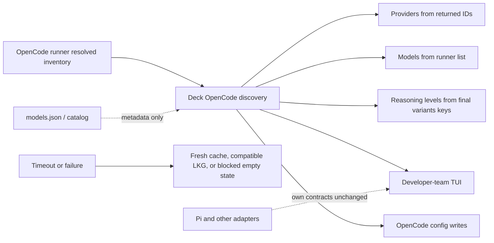

# Proposal: Runner-Resolved OpenCode Model and Variant Discovery

**Change ID**: `fix-runner-model-discovery-regression`

## Intent

Deck's OpenCode model-selection flow currently treats the auth-filtered `models.json` cache and cached `reasoning_options` as authoritative. The corrected exploration shows this is wrong: the active OpenCode runner reports a different available model set and different per-model `variants`. This makes Deck show stale/unavailable cache-only models, omit runner-available models such as built-in `opencode` entries, and expose reasoning levels that the runner may not accept.

This proposal uses the corrected `exploration-corrected` event as authoritative and does not rely on the superseded stale-installed-binary diagnosis.

## Goal

Deck's OpenCode TUI and configuration writes should use exactly the active runner's resolved provider/model inventory and per-model reasoning variant keys, while preserving safe behavior for failures, stale persisted assignments, and non-OpenCode adapters.

## Scope

### In Scope

- Make `opencode models --verbose` or an equivalent stable structured runner API the authoritative OpenCode inventory source.
- Derive visible OpenCode providers from runner-returned `provider/model` IDs, including built-in, custom, plugin, and alias-resolved providers.
- Derive selectable reasoning levels exactly from each runner-resolved model's final `variants` keys.
- Keep `models.json`, static catalogs, and cache metadata as optional enrichment only; they must not add unavailable models or variants.
- Define bounded discovery timeout, caching, invalidation, and safe failure behavior without broad fallback pollution.
- Distinguish runner-state discovery from network refresh: normal TUI open must not automatically run `opencode models --refresh`.
- Preserve Pi and other adapters through runner-specific discovery contracts and regression coverage.
- Define compatibility behavior for persisted assignments whose model or variant is no longer reported by the runner.
- Reconcile overlap with `opencode-configured-providers-filter`, `fix-opencode-effort-levels-hardcoded`, and `tui-model-assignment-bug` without duplicating implementation.
- Cover behavior with injected fixtures/mocks and no network calls in tests.

### Out of Scope

- Running `opencode models --refresh` on every TUI open.
- Treating auth/provider configuration, `models.json`, cached `reasoning_options`, static catalogs, or canonical hardcoded arrays as authoritative availability or variant sources.
- Adding broad fallback catalogs that repopulate unavailable models after runner discovery fails.
- Changing Pi's current model/reasoning semantics except for shared-contract compatibility and regression tests.
- Redesigning the TUI beyond the minimum stale/unavailable assignment states needed for safe compatibility.
- Implementing provider authentication, OpenCode cache refresh policy, or network-backed model updates.

## Affected Capabilities

> This section is the contract between Proposal and Spec/Design phases.

### New Capabilities

- `opencode-runner-resolved-model-inventory`: Deck can discover OpenCode providers and models from the runner's final resolved available model set.
- `opencode-runner-resolved-reasoning-variants`: Deck can expose reasoning choices from each runner-resolved model's final `variants` keys.

### Modified Capabilities

- `developer-team-tui-model-selection`: OpenCode provider/model lists and reasoning choices must reflect the resolved runner inventory, not auth-filtered cache entries.
- `opencode-model-configuration`: Writes must validate selected model IDs and variants against the runner-resolved inventory; stale persisted values are handled compatibly.
- `opencode-model-metadata-enrichment`: Cache/catalog data may enrich runner-returned models only and must not create additional visible models or variants.
- `runner-adapter-inventory-contract`: OpenCode discovery becomes runner-owned; shared contracts must allow each adapter to define its own authoritative inventory source.

### Unchanged Capabilities

- `pi-model-configuration`: Pi remains governed by Pi-specific contracts; this change only requires anti-regression coverage where shared contracts are touched.
- `developer-team-model-assignment-propagation`: Existing assignment propagation work from `tui-model-assignment-bug` remains separate; this change supplies validated inventory and variants.

## Approach

- Introduce or adjust an OpenCode inventory discovery seam that invokes `opencode models --verbose` or consumes an equivalent stable structured runner API. If a structured API is available, prefer it over text parsing; in either case, the source is the runner's final resolved inventory.
- Parse the runner result into Deck's inventory shape:
  - provider IDs are derived from returned `provider/model` IDs;
  - model IDs are included only when present in the runner result;
  - reasoning levels are the exact final `variants` keys for that model;
  - models with no variants expose no reasoning selector.
- Treat cache/catalog data as metadata-only enrichment for runner-returned models, such as display labels or context metadata when safe. Enrichment must never add providers, models, or variant names absent from the runner result.
- Use bounded discovery behavior:
  - default command timeout: **3 seconds** through an injected/testable runner-command seam;
  - in-process snapshot TTL: **5 minutes**, keyed by runner command/binary identity, OpenCode version when available, workspace/config scope, auth/config file mtimes or equivalent fingerprints, and provider environment variable names without secret values;
  - invalidation: TTL expiry, explicit user refresh action if present, runner/config/auth fingerprint change, or runner version/path change;
  - optional persisted last-known-good snapshot: max age **24 hours**, fingerprint-matched, clearly marked stale, and never merged with broad cache/catalog fallback;
  - failure without a fresh compatible snapshot: return an empty/blocked inventory state with an actionable error instead of showing cache/catalog-only models.
- Keep network refresh separate: normal TUI open may perform runner-state discovery but must not pass `--refresh`; any network refresh remains explicit and user-triggered if supported.
- Handle persisted assignments compatibly:
  - read existing model and reasoning values non-destructively;
  - if a persisted model is not runner-reported, show/preserve it as unavailable or stale until the user changes that assignment;
  - when writing new or changed assignments, write only runner-reported model IDs;
  - if a persisted variant is not in the model's runner `variants` keys, do not silently map it to a nearest canonical value; require re-selection or omit/clear the invalid reasoning value according to Spec/Design;
  - avoid destructive cleanup of unrelated user configuration.
- Reconcile overlapping active changes:
  - `opencode-configured-providers-filter`: provider filtering is no longer an availability source; any auth/env logic can remain only as metadata or invalidation input.
  - `fix-opencode-effort-levels-hardcoded`: reuse useful adapter/TUI plumbing for model-specific levels, but replace cache-derived `reasoning_options` authority with runner `variants` keys.
  - `tui-model-assignment-bug`: keep assignment propagation work separate; ensure this change provides validated OpenCode inventory/variant data to that flow.

## Alternatives and Tradeoffs

| Alternative | Why Considered | Why Not Chosen |
|---|---|---|
| Keep auth-filtered `models.json` as source of truth | Already implemented and fast | Proven to include 58 cache-only unavailable entries, omit 17 runner-reported entries, and miss the built-in `opencode` provider. |
| Use cached `reasoning_options` or legacy `variants` | Easy continuation of the current adapter logic | Proven to disagree with live runner variants for 33 comparable models and cannot represent final runner transforms, aliases, disabled variants, or plugins. |
| Expand static/catalog hardcoded arrays | Predictable and avoids CLI parsing | Reintroduces stale data and cannot represent custom/plugin providers or per-user runner resolution. |
| Always run `opencode models --refresh` | Maximizes cache freshness | May trigger network latency and is not required to read the runner's current resolved state. |
| Fail open to broad cache/catalog on discovery failure | Keeps the UI populated | Reintroduces unavailable models and variants; safe behavior requires a bounded runner snapshot or a blocked/empty state. |

## Risks

| Risk | Likelihood | Mitigation |
|---|---|---|
| `opencode models --verbose` text format changes | Medium | Prefer a stable structured runner API if available; otherwise isolate parser behind fixtures and version-aware tests. |
| Runner command adds TUI latency | Medium | Use a 3s timeout, 5m in-process TTL, fingerprint invalidation, and optional 24h compatible last-known-good snapshot. |
| Last-known-good snapshot is stale | Medium | Fingerprint and max-age bound it, mark stale, and never merge it with broad cache/catalog fallback. |
| Persisted assignments reference unavailable models or variants | High | Read non-destructively, display stale/unavailable state, and validate only new/changed writes against the runner result. |
| Overlap changes implement conflicting cache/provider logic | Medium | Design/Task phases must treat this proposal as the authority for availability/variants and reuse only compatible plumbing. |
| Pi or future adapters regress due to shared contract changes | Medium | Keep contracts runner-specific and add Pi anti-regression tests. |
| Tests accidentally call live OpenCode/network | Medium | Use injected command/filesystem seams and fixture output; no network calls in tests. |

## Rollback Plan

- Revert the OpenCode adapter discovery changes, parser/cache additions, TUI wiring, validation behavior, and tests introduced for this change.
- Remove any new last-known-good snapshot files or ignore them if the implementation stores snapshots on disk.
- Because persisted assignment handling is non-destructive, rollback should not require data migration; users can reselect models if a bad release wrote invalid values.
- If an implementation includes a feature flag or adapter option, disable runner-resolved discovery and fall back to the previous release while preserving the OpenSpec record of why cache/catalog authority is incorrect.

## Dependencies

- OpenCode runtime support for `opencode models --verbose` on the supported version range, or an equivalent stable structured runner API.
- Injectable command execution, filesystem, environment, and clock seams for deterministic tests.
- Existing OpenCode adapter/TUI tests plus new fixtures for runner-only, cache-only, custom/plugin, no-variant, malformed-output, timeout, and Pi anti-regression cases.
- Coordination with active OpenSpec changes listed in the overlap section.

## Open Questions

- Is there a stable structured OpenCode API available in the supported runtime range, or must Design specify a robust parser for `opencode models --verbose`?
- What exact TUI copy/state should represent a persisted assignment that is no longer runner-reported?
- If no explicit refresh UI exists today, should this change add a user-triggered refresh affordance or defer it?

## Preconditions

- Proposal-specific apply blockers: none identified beyond normal SDD phase sequencing.
- See `openspec/changes/fix-runner-model-discovery-regression/preconditions.md` for the Proposal-phase precondition record.

## Acceptance Direction

- [ ] OpenCode provider/model inventory is built only from the runner-resolved result; cache-only models are excluded and runner-only models are included.
- [ ] Providers are derived from runner-returned model IDs, including built-in/custom/plugin providers such as `opencode`.
- [ ] Selectable reasoning levels for each model equal exactly the runner's final `variants` keys; cached `reasoning_options` and static arrays cannot add levels.
- [ ] Models with no runner variants hide or disable reasoning selection.
- [ ] Cache/catalog data enriches only runner-returned entries and cannot add models or variants.
- [ ] Discovery timeout, cache TTL, invalidation, last-known-good, and failure-empty behavior are covered by deterministic tests.
- [ ] Normal TUI open does not run `opencode models --refresh`; any network refresh is explicit.
- [ ] Persisted stale model/variant assignments are read safely and are not silently normalized to unsupported values on write.
- [ ] Pi and other adapters keep their runner-specific behavior under shared contract changes.
- [ ] Tests use injected fixtures/mocks and make no network calls.

## Next Steps

Ready for Spec (`deck-developer-spec`) and Design (`deck-developer-design`) in parallel.

## Mermaid Summary Source

