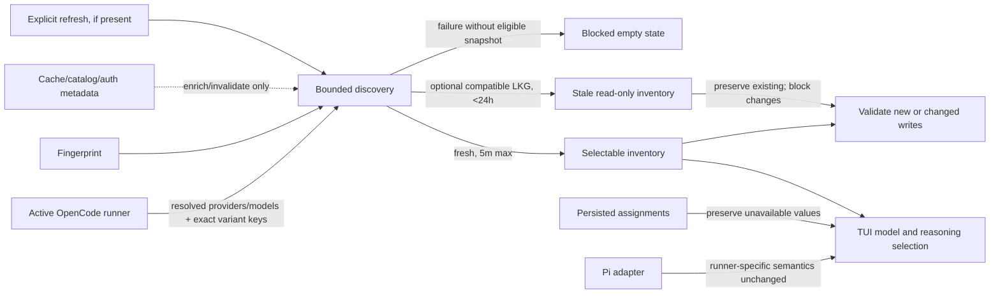

# Spec: Runner-Resolved OpenCode Model Discovery

## Source and Decision Summary

- Change: `fix-runner-model-discovery-regression`
- Primary input: `proposal.md`
- Corrected evidence: `exploration.md` and the authoritative `exploration-corrected` event
- Existing preconditions: `preconditions.md`; no additional pre-Apply precondition is introduced by this spec
- Affected capabilities: OpenCode runner-resolved inventory, per-model reasoning variants, Developer Team TUI model selection, OpenCode model configuration, metadata enrichment, and runner-adapter inventory isolation
- Superseded diagnosis: the earlier stale-installed-binary diagnosis is not part of this contract

The active OpenCode runner's resolved output is the only authority for OpenCode provider/model availability and selectable per-model reasoning variants. Runner-origin snapshots may preserve bounded continuity, while catalogs, authentication records, environment hints, and caches may enrich or invalidate discovery but may never expand its inventory or variants.

> Downstream UI planning note: use `ui-skills-root` to select the smallest applicable UI guidance. Interactive stale, blocked, and validation states should include accessibility planning through `fixing-accessibility`; this note is non-normative and does not prescribe implementation.

## Requirements

### Capability: OpenCode runner-resolved inventory

**REQ-INV-001: Sole availability authority**  
Priority: **MUST**  
Surface: Integration  
Deck MUST derive the selectable OpenCode provider/model inventory solely from the active runner's final resolved inventory response.  
Rationale: Intermediate caches and configuration proxies have been proven to disagree with the runner.

**REQ-INV-002: Exact inventory membership**  
Priority: **MUST**  
Surface: UI  
Deck MUST include every valid runner-reported model ID and MUST exclude every model ID not reported by the runner-origin inventory or an eligible runner-origin snapshot. Provider lists MUST be derived from those included model IDs.  
Rationale: The UI must neither omit runner-only entries nor display cache-only entries.

**REQ-INV-003: Provider-kind neutrality**  
Priority: **MUST**  
Surface: Integration  
Deck MUST apply the same inclusion rules to built-in, custom, plugin-provided, and alias-resolved providers and models, without requiring a matching authentication-file entry, catalog entry, or known-provider allowlist.  
Rationale: The runner has already resolved configuration, aliases, plugins, and built-ins.

**REQ-INV-004: Valid empty inventory**  
Priority: **MUST**  
Surface: UI  
A successful runner response containing no models MUST produce an explicit empty inventory state and MUST NOT be repopulated from metadata or a broad fallback catalog.  
Rationale: An empty authoritative result is materially different from cached availability.

### Capability: OpenCode runner-resolved reasoning variants

**REQ-VAR-001: Exact final variant keys**  
Priority: **MUST**  
Surface: UI  
For each included model, Deck MUST expose exactly the model's final runner-resolved `variants` keys as selectable reasoning levels, preserving the runner-provided key spelling and order.  
Rationale: Provider transforms, aliases, overrides, disabled variants, and plugins are already reflected in the final keys.

**REQ-VAR-002: No synthetic or normalized levels**  
Priority: **MUST**  
Surface: Data  
Deck MUST NOT add hardcoded, canonical, cached, catalog-derived, nearest-match, or normalized reasoning levels to a model's runner-resolved key set.  
Rationale: Added or normalized values may be rejected by OpenCode or select unintended behavior.

**REQ-VAR-003: Zero-variant behavior**  
Priority: **MUST**  
Surface: UI  
When a runner-reported model has zero final variant keys, Deck MUST hide or disable reasoning selection for that model and MUST treat an unset reasoning value as the only valid value for a new or changed assignment.  
Rationale: The interface must not imply support for a discrete choice that the runner did not report.

**REQ-VAR-004: Model-specific recomputation**  
Priority: **MUST**  
Surface: UI  
When the selected OpenCode model changes, the reasoning choices and current selection validity MUST be recomputed against that selected model's own final variant keys.  
Rationale: Variant sets are model-specific, not provider-wide or runner-wide.

### Capability: Metadata enrichment boundaries

**REQ-META-001: Enrichment cannot expand authority**  
Priority: **MUST**  
Surface: Data  
Cache, catalog, authentication, and configuration metadata MAY enrich a runner-included model with non-authoritative presentation or descriptive data, but MUST NOT add a provider, model, or variant; change a model ID or provider assignment; or replace runner-resolved variant keys.  
Rationale: Enrichment must not recreate the regression through a secondary source.

**REQ-META-002: Enrichment isolation**  
Priority: **MUST**  
Surface: General  
Missing, stale, malformed, or conflicting enrichment data MUST be ignored for the affected enrichment fields and MUST NOT invalidate an otherwise valid runner inventory. Authentication/configuration/environment evidence MAY contribute to discovery invalidation, but MUST NOT filter availability.  
Rationale: Optional metadata must remain optional and subordinate.

### Capability: Bounded discovery and refresh

**REQ-DISC-001: Discovery timeout**  
Priority: **MUST**  
Surface: Integration  
An OpenCode runner discovery attempt MUST stop waiting after 15 seconds and classify the attempt as timed out.  
Rationale: Opening or using the TUI must not hang indefinitely.

**REQ-DISC-002: In-process freshness window**  
Priority: **MUST**  
Surface: General  
A successful runner-origin inventory MAY be reused in-process for no more than 5 minutes without another discovery attempt, and only while its discovery fingerprint remains unchanged.  
Rationale: Bounded reuse controls latency without masking relevant runtime changes.

**REQ-DISC-003: Fingerprint coverage and secrecy**  
Priority: **MUST**  
Surface: Security  
The discovery fingerprint MUST distinguish runner executable identity/path, runner version when available, workspace/configuration scope, relevant configuration and authentication state, and relevant provider-environment variable names or non-secret presence state. It MUST NOT record secret values.  
Rationale: Availability must refresh when its inputs change without persisting credentials.

**REQ-DISC-004: Immediate invalidation triggers**  
Priority: **MUST**  
Surface: General  
Deck MUST invalidate in-process freshness before 5 minutes when the fingerprint changes or when an explicit user refresh is requested. TTL expiry MUST also require a new discovery attempt before the result is considered fresh.  
Rationale: Version, path, workspace, config, auth, and environment changes must not wait for an old snapshot.

**REQ-DISC-005: Optional last-known-good eligibility**  
Priority: **MAY**  
Surface: Data  
Deck MAY use a persisted last-known-good inventory after a failed fresh discovery only when it came from a previously successful runner discovery, has an age of at most 24 hours, exactly matches the current discovery fingerprint, and passes the same structural validation as a live result. If used, it MUST be visibly identified as stale and MUST NOT be merged with catalog/cache inventory or variants.  
Rationale: Bounded continuity is acceptable only when provenance and compatibility are established.

**REQ-DISC-006: Ineligible snapshot rejection**  
Priority: **MUST**  
Surface: Data  
Deck MUST reject a last-known-good snapshot that is older than 24 hours, fingerprint-incompatible, malformed, or not runner-origin. A snapshot exactly 24 hours old remains within the maximum-age boundary.  
Rationale: Such a snapshot cannot safely represent the active runner scope.

**REQ-DISC-007: Safe blocked failure state**  
Priority: **MUST**  
Surface: UI  
On timeout, command failure, or malformed runner output, when neither a fresh in-process inventory nor an eligible last-known-good snapshot is available, Deck MUST expose an empty/blocked OpenCode inventory with an actionable discovery error and MUST NOT offer new model or reasoning selections.  
Rationale: Failure must not fail open to unavailable choices.

**REQ-DISC-008: Stale inventory write safety**  
Priority: **MUST**  
Surface: Data  
When an eligible last-known-good snapshot is being displayed as stale, Deck MUST preserve existing assignments but MUST block new or changed OpenCode model/variant writes until a fresh runner discovery confirms availability.  
Rationale: A stale snapshot supports diagnosis and continuity of display, not a claim of current write validity.

**REQ-DISC-009: Network refresh separation**  
Priority: **MUST**  
Surface: Integration  
Normal TUI opening and ordinary runner-state discovery MUST NOT request a network-backed OpenCode model refresh. If an explicit refresh affordance exists, only a deliberate user action MAY invoke network refresh behavior; it MUST invalidate current freshness, run through the same timeout/validation/failure rules, and clearly report success or failure. This change does not require adding such an affordance.  
Rationale: Reading recognized runner state must not unexpectedly incur network traffic or latency.

### Capability: Persisted assignment compatibility and validation

**REQ-ASG-001: Non-destructive reads**  
Priority: **MUST**  
Surface: Data  
Deck MUST read and preserve an existing persisted model ID and variant value even when either value is absent from the fresh runner inventory. Discovery alone MUST NOT rewrite, clear, normalize, or delete the assignment.  
Rationale: Runtime availability changes must not destroy user configuration.

**REQ-ASG-002: Precise unavailable state**  
Priority: **MUST**  
Surface: UI  
Deck MUST visibly distinguish an unavailable persisted model from an available model with an unavailable persisted variant, retain the original persisted value for display, and identify that re-selection is required before that assignment can be changed to a valid value. Exact user-facing copy is not fixed by this spec.  
Rationale: Users need to understand what is stale without losing the original configuration.

**REQ-ASG-003: Validate only affected writes**  
Priority: **MUST**  
Surface: Data  
Saving or installing unrelated changes MUST preserve unchanged stale assignments byte-for-value at the assignment field level and MUST NOT reject the operation solely because those unchanged assignments are unavailable.  
Rationale: Compatibility requires validation at the changed assignment boundary, not destructive global cleanup.

**REQ-ASG-004: Changed model validation**  
Priority: **MUST**  
Surface: Data  
A new or changed OpenCode model assignment MUST exactly match a model in a fresh runner-resolved inventory. Otherwise Deck MUST reject that assignment change, explain that the model is unavailable, and leave the prior persisted assignment unchanged.  
Rationale: New writes must be accepted only against current runner authority.

**REQ-ASG-005: Changed variant validation**  
Priority: **MUST**  
Surface: Data  
A new or changed variant MUST exactly match a final variant key of the newly selected or currently assigned runner-reported model. Deck MUST reject unsupported values without nearest-value mapping, canonical substitution, or case normalization, and MUST leave the prior persisted assignment unchanged.  
Rationale: Variant tokens are exact runner-defined identifiers.

**REQ-ASG-006: Model-change variant transition**  
Priority: **MUST**  
Surface: UI  
When a user changes a model, Deck MUST NOT silently carry an invalid prior variant to the new model. The resulting assignment MUST use an explicitly selected valid key or an unset value; for a zero-variant model it MUST use the unset value and communicate that no reasoning choice applies.  
Rationale: Changing a model creates a new validation boundary and must not produce an invalid combined assignment.

### Capability: Runner-specific isolation

**REQ-ADP-001: Per-runner authority contract**  
Priority: **MUST**  
Surface: Integration  
Shared model-selection contracts MUST allow each runner adapter to define its own authoritative inventory and reasoning source; OpenCode-specific discovery rules MUST NOT become global catalog or cache rules.  
Rationale: Different runners expose different availability contracts.

**REQ-ADP-002: Pi anti-regression**  
Priority: **MUST**  
Surface: General  
Pi provider/model discovery, Pi's supported reasoning-level semantics, Pi configuration reads/writes, and Pi assignment propagation MUST remain behaviorally unchanged by this OpenCode change.  
Rationale: Pi is explicitly out of scope except for shared-contract compatibility.

**REQ-ADP-003: Failure isolation**  
Priority: **MUST**  
Surface: UI  
An OpenCode discovery timeout, failure, malformed result, empty result, or stale state MUST NOT empty, block, or alter another runner's inventory or configuration flow.  
Rationale: One adapter's runtime failure must remain isolated.

### Capability: Active-change reconciliation

**REQ-REC-001: Provider-filter reconciliation**  
Priority: **MUST**  
Surface: UI  
For `opencode-configured-providers-filter`, runner-resolved membership MUST supersede authentication/environment provider filtering, while its valid long-list navigation/windowing behavior and non-authoritative metadata handling MUST remain intact.  
Rationale: The obsolete authority rule must be replaced without regressing the independent list-usability fix.

**REQ-REC-002: Effort-level reconciliation**  
Priority: **MUST**  
Surface: UI  
For `fix-opencode-effort-levels-hardcoded`, model-specific adapter/TUI selection behavior and zero-level fail-closed behavior MUST remain, but cache `reasoning_options`, legacy cache variants, and hardcoded arrays MUST no longer supply selectable OpenCode levels.  
Rationale: Useful model-specific plumbing remains valid; its former data authority does not.

**REQ-REC-003: Assignment-flow reconciliation**  
Priority: **MUST**  
Surface: Data  
For `tui-model-assignment-bug`, valid changed assignments MUST continue through the existing review/install propagation flow, while this change governs only which OpenCode model/variant values may be newly written. Reconciliation MUST NOT silently remove non-conflicting assignment-propagation or Pi requirements from that change.  
Rationale: Inventory validation and assignment propagation solve separate defects and both behaviors are required.

### Capability: Deterministic verification

**REQ-TEST-001: Hermetic test boundaries**  
Priority: **MUST**  
Surface: General  
Automated tests for this change MUST use injected or isolated command, clock, filesystem, environment, fingerprint, and snapshot seams with fixtures; they MUST make no network requests, invoke no live user runner as an authority, and perform no writes to the real user filesystem.  
Rationale: Discovery, expiry, and failure behavior must be safe and reproducible.

**REQ-TEST-002: Required regression matrix**  
Priority: **MUST**  
Surface: General  
Automated coverage MUST include runner-only and cache-only models; built-in, custom, plugin, and alias-resolved entries; exact and zero variants; metadata conflicts; malformed and empty output; command failure and 15-second timeout; 5-minute TTL boundaries; runner version/path and workspace/config/auth/environment fingerprint changes; eligible, expired, incompatible, and malformed last-known-good snapshots when that optional capability is present; normal versus explicit refresh; stale assignment reads and changed-write validation; active-change reconciliation; and Pi isolation.  
Rationale: These cases define the regression boundary and acceptance evidence.

## Acceptance Scenarios

### Capability: OpenCode runner-resolved inventory

#### Scenario: Runner membership is exact
**Given** the runner reports models `opencode/alpha` and `custom/beta`, while metadata also contains `cache/old` and omits `opencode/alpha`  
**When** Deck presents OpenCode providers and models  
**Then** only `opencode/alpha` and `custom/beta` are selectable, and providers are derived as `opencode` and `custom`  
> Covers: REQ-INV-001, REQ-INV-002, REQ-META-001

#### Scenario: All runner-resolved provider kinds are treated equally
**Given** a valid runner response contains built-in, custom, plugin-provided, and alias-resolved model IDs, including entries absent from authentication and catalog data  
**When** Deck builds the inventory  
**Then** every valid returned entry is included without source-kind filtering or allowlisting  
> Covers: REQ-INV-003

#### Scenario: Successful empty runner inventory stays empty
**Given** discovery succeeds with a structurally valid response containing zero models and metadata contains models  
**When** Deck presents model selection  
**Then** Deck shows an explicit no-models state, offers no provider/model choices, and does not import metadata models  
> Covers: REQ-INV-004

### Capability: OpenCode runner-resolved reasoning variants

#### Scenario: Exact per-model variant keys are selectable
**Given** the runner reports `openai/example` variants in order `none`, `low`, `xhigh` and metadata also advertises `medium` and `max`  
**When** the user selects `openai/example`  
**Then** the reasoning selector offers exactly `none`, `low`, `xhigh` in that order  
> Covers: REQ-VAR-001, REQ-VAR-002, REQ-META-001

#### Scenario: Alias and plugin transforms remain final
**Given** the runner's final alias-resolved model has variants `custom-fast`, `custom-deep` after plugins and disabled-variant rules  
**When** Deck presents its reasoning choices  
**Then** Deck offers exactly those two keys and does not restore disabled or canonical keys  
> Covers: REQ-INV-003, REQ-VAR-001, REQ-VAR-002

#### Scenario: Model with no variants has no reasoning choice
**Given** a runner-reported model has an empty `variants` key set  
**When** the model is selected for a new assignment  
**Then** reasoning selection is hidden or disabled and the only valid persisted reasoning state is unset  
> Covers: REQ-VAR-003

#### Scenario: Changing models changes the variant domain
**Given** model A offers `low`, `high`, model B offers `max`, and `high` is selected for model A  
**When** the user changes the assignment to model B  
**Then** the available choices become exactly `max` and `high` is not silently retained or mapped  
> Covers: REQ-VAR-004, REQ-ASG-006

### Capability: Metadata enrichment boundaries

#### Scenario: Matching metadata enriches without changing authority
**Given** valid metadata supplies a display label and descriptive context for an exact runner-reported model ID  
**When** inventory is presented  
**Then** Deck may show those descriptive fields while preserving the runner model ID, provider membership, and exact variants  
> Covers: REQ-META-001

#### Scenario: Conflicting or malformed metadata is isolated
**Given** runner discovery is valid and optional metadata is malformed or claims different variants or provider membership  
**When** Deck builds the inventory  
**Then** the valid runner inventory remains usable, the bad enrichment is ignored, and no metadata-only entry or variant appears  
> Covers: REQ-META-001, REQ-META-002

#### Scenario: Authentication evidence does not filter availability
**Given** the runner reports a built-in provider absent from authentication data and an authentication file lists a provider absent from the runner response  
**When** Deck builds the inventory  
**Then** the runner-reported built-in provider is included and the auth-only provider is excluded  
> Covers: REQ-INV-001, REQ-INV-003, REQ-META-002

### Capability: Bounded discovery and refresh

#### Scenario: Fresh in-process inventory is reused within five minutes
**Given** a successful discovery snapshot is 4 minutes 59 seconds old and its fingerprint is unchanged  
**When** inventory is requested again  
**Then** Deck may return that snapshot without another runner discovery and treats it as fresh  
> Covers: REQ-DISC-002

#### Scenario: Five-minute boundary requires discovery
**Given** a successful in-process snapshot has reached 5 minutes of age with an unchanged fingerprint  
**When** inventory is requested  
**Then** Deck attempts runner discovery before treating any result as fresh  
> Covers: REQ-DISC-002, REQ-DISC-004

#### Scenario: Version or executable path change invalidates immediately
**Given** a fresh in-process snapshot exists  
**When** the OpenCode runner version or executable identity/path changes before TTL expiry  
**Then** Deck does not reuse the snapshot as fresh and attempts discovery for the new fingerprint  
> Covers: REQ-DISC-003, REQ-DISC-004

#### Scenario: Workspace, configuration, authentication, or environment change invalidates immediately
**Given** a fresh in-process snapshot exists  
**When** workspace/configuration scope, relevant config/auth state, or relevant provider-environment names or non-secret presence state changes  
**Then** Deck attempts discovery for the changed fingerprint without recording any secret value  
> Covers: REQ-DISC-003, REQ-DISC-004

#### Scenario: Discovery times out deterministically
**Given** the runner discovery operation does not complete  
**When** 15 seconds elapse  
**Then** Deck stops waiting, classifies the attempt as a timeout, and applies only the eligible-snapshot or blocked-state rules  
> Covers: REQ-DISC-001, REQ-DISC-007

#### Scenario: Command failure does not fail open
**Given** the runner command exits unsuccessfully and no eligible snapshot exists  
**When** Deck requests the OpenCode inventory  
**Then** Deck shows a blocked empty state with an actionable command-failure error and no cache/catalog choices  
> Covers: REQ-DISC-007

#### Scenario: Malformed runner output is rejected as a whole
**Given** runner output cannot be validated as a complete inventory and no eligible snapshot exists  
**When** Deck parses the response  
**Then** Deck does not expose a partial inventory, shows a blocked malformed-output error, and adds nothing from metadata  
> Covers: REQ-DISC-007

#### Scenario: Compatible last-known-good snapshot is shown stale
**Given** fresh discovery fails and a structurally valid runner-origin snapshot is 23 hours 59 minutes old with the exact current fingerprint  
**When** optional last-known-good support is enabled  
**Then** Deck may display only that snapshot's inventory, clearly marks it stale, and does not merge metadata inventory or variants  
> Covers: REQ-DISC-005

#### Scenario: Last-known-good boundary and compatibility are enforced
**Given** candidate snapshots are respectively older than 24 hours, fingerprint-incompatible, malformed, or not runner-origin  
**When** fresh discovery fails  
**Then** each candidate is rejected and cannot populate the inventory  
> Covers: REQ-DISC-006

#### Scenario: Stale display cannot authorize changed writes
**Given** an eligible last-known-good inventory is displayed as stale  
**When** the user attempts a new or changed model or variant assignment  
**Then** Deck blocks the write until fresh runner discovery succeeds while preserving existing persisted assignments  
> Covers: REQ-DISC-008, REQ-ASG-001

#### Scenario: Successful rediscovery replaces stale state
**Given** a stale last-known-good inventory or blocked state is displayed  
**When** a later fresh discovery succeeds for the current fingerprint  
**Then** Deck presents the new exact runner inventory as fresh and validates subsequent changed writes against it  
> Covers: REQ-DISC-004, REQ-DISC-008

#### Scenario: Normal TUI opening performs no network refresh
**Given** the user opens the normal TUI model-selection flow  
**When** Deck performs runner-state discovery  
**Then** the discovery request does not request OpenCode's network-backed model refresh  
> Covers: REQ-DISC-009

#### Scenario: Explicit refresh remains explicit and bounded
**Given** a refresh affordance exists and the user deliberately activates it  
**When** refresh begins  
**Then** current freshness is invalidated, any network-backed refresh behavior is attributable to that action, and the result follows the same 15-second timeout, structural validation, snapshot, and error-state rules  
> Covers: REQ-DISC-001, REQ-DISC-004, REQ-DISC-009

### Capability: Persisted assignment compatibility and validation

#### Scenario: Persisted unavailable model is preserved
**Given** configuration contains model `provider/retired` and the fresh runner inventory does not report it  
**When** Deck reads and displays the assignment  
**Then** the original model value remains persisted and visible as an unavailable model without automatic rewrite or deletion  
> Covers: REQ-ASG-001, REQ-ASG-002

#### Scenario: Persisted unavailable variant is distinguished
**Given** the persisted model remains runner-available but its persisted variant `max` is not among the model's final keys  
**When** Deck reads and displays the assignment  
**Then** the model remains available, the original `max` value remains persisted, and only the variant is identified as unavailable  
> Covers: REQ-ASG-001, REQ-ASG-002

#### Scenario: Unrelated save preserves stale assignments
**Given** agent A has an unchanged stale assignment and the user changes only agent B  
**When** the user saves or installs the change  
**Then** agent B's valid change proceeds and agent A's model and variant fields remain unchanged  
> Covers: REQ-ASG-003, REQ-REC-003

#### Scenario: Changed unavailable model is rejected atomically
**Given** a fresh inventory is available and the user changes an assignment to a model absent from it  
**When** the user attempts to save  
**Then** Deck rejects that assignment change with a model-unavailable error and leaves its prior persisted model and variant unchanged  
> Covers: REQ-ASG-004

#### Scenario: Changed unsupported variant is rejected without mapping
**Given** a fresh inventory reports variants `low`, `high` for the assigned model  
**When** the user attempts to write `HIGH`, `medium`, or another absent key  
**Then** Deck rejects the exact unsupported value, performs no case normalization or nearest mapping, and leaves the prior assignment unchanged  
> Covers: REQ-ASG-005

#### Scenario: Model change resolves the previous variant explicitly
**Given** a persisted assignment uses model A variant `high` and the user changes to model B, which has no variants  
**When** the changed assignment is reviewed and saved  
**Then** Deck communicates that reasoning is unavailable, persists model B only with reasoning unset, and does not carry or map `high`  
> Covers: REQ-VAR-003, REQ-ASG-006

### Capability: Runner-specific isolation

#### Scenario: Pi behavior remains unchanged
**Given** the same Pi fixtures and supported reasoning choices used before this change  
**When** Pi inventory, selection, assignment, and configuration flows run  
**Then** their observable provider/model membership, reasoning levels, reads, writes, and propagation remain unchanged  
> Covers: REQ-ADP-001, REQ-ADP-002

#### Scenario: OpenCode failure does not affect Pi
**Given** OpenCode discovery times out or returns malformed output while Pi inventory is available  
**When** the user enters each runner's flow  
**Then** OpenCode alone shows its blocked/stale state and Pi remains usable with its own inventory and semantics  
> Covers: REQ-ADP-003

### Capability: Active-change reconciliation

#### Scenario: Provider authority changes without list-navigation regression
**Given** runner discovery returns a long provider/model list and auth metadata disagrees with it  
**When** the user navigates the list  
**Then** membership follows the runner, and the existing bounded visible-list navigation keeps the focused row visible and selectable  
> Covers: REQ-REC-001

#### Scenario: Existing model-specific effort UI consumes runner keys
**Given** model-specific reasoning plumbing already exists from `fix-opencode-effort-levels-hardcoded`  
**When** an OpenCode model is selected  
**Then** that plumbing receives the exact runner final keys, including an empty set, rather than cache-derived or hardcoded levels  
> Covers: REQ-REC-002

#### Scenario: Valid assignments still propagate through review and install
**Given** the user changes an assignment to a fresh runner-reported model and exact valid variant  
**When** the existing review/install flow runs  
**Then** the selected values reach the appropriate OpenCode assignment write, while Pi propagation behavior remains unchanged  
> Covers: REQ-REC-003, REQ-ADP-002

### Capability: Deterministic verification

#### Scenario: Tests remain hermetic
**Given** the automated discovery and assignment suites run in any developer or CI environment  
**When** timeout, filesystem, environment, refresh, snapshot, and command cases execute  
**Then** all external effects use injected seams and fixtures, with zero network requests, zero live-user-runner authority, and zero writes to real user paths  
> Covers: REQ-TEST-001

#### Scenario: Regression matrix is executable deterministically
**Given** fixed fixtures and controlled clocks/fingerprints for every case listed in REQ-TEST-002  
**When** the regression suite is repeated  
**Then** the same inventory, variants, states, errors, invalidations, assignment outcomes, reconciliation outcomes, and Pi results are produced  
> Covers: REQ-TEST-002

## Validation Rules

| Field / Input | Rule | Error message semantics | REQ-ID |
|---|---|---|---|
| Runner inventory response | Must be a complete structurally valid runner-resolved inventory; malformed output is rejected as a whole | State that OpenCode model discovery returned invalid output and suggest retry/checking the runner | REQ-DISC-007 |
| Runner model ID | Must be a valid ID included in the current fresh runner inventory for new/changed writes | State that the selected model is unavailable in the active OpenCode runner | REQ-ASG-004 |
| Variant key | Must be an exact, case-sensitive final key for the selected model; unset only when allowed | State that the selected reasoning variant is unavailable for the model | REQ-ASG-005 |
| Zero-variant model | New/changed reasoning value must be unset | State that the model has no selectable reasoning variants | REQ-VAR-003 |
| In-process snapshot | Age must be less than 5 minutes and fingerprint must match to be fresh | Do not label an expired or incompatible snapshot fresh | REQ-DISC-002, REQ-DISC-004 |
| Last-known-good snapshot | Runner-origin, structurally valid, exact fingerprint match, and age at most 24 hours | State that current discovery is unavailable; if eligible snapshot is used, label it stale | REQ-DISC-005, REQ-DISC-006 |
| Changed write while stale | Requires successful fresh discovery before validation | State that availability must be refreshed before changing the assignment | REQ-DISC-008 |
| Explicit refresh | Must originate from deliberate user action when supported | Report refresh success or actionable failure without silently changing to catalog data | REQ-DISC-009 |

## Error Contracts

| Condition | Error code / type | Required observable outcome | Status |
|---|---|---|---|
| Discovery exceeds 15 seconds | `OPENCODE_DISCOVERY_TIMEOUT` | Eligible stale snapshot or blocked empty inventory; no broad fallback | stale or blocked |
| Runner command fails | `OPENCODE_DISCOVERY_COMMAND_FAILED` | Eligible stale snapshot or actionable blocked empty inventory | stale or blocked |
| Runner output is malformed | `OPENCODE_DISCOVERY_INVALID_OUTPUT` | Reject whole live result; eligible stale snapshot or actionable blocked empty inventory | stale or blocked |
| Valid runner result contains zero models | `OPENCODE_INVENTORY_EMPTY` | Explicit empty state; no metadata population | empty |
| No eligible snapshot after discovery failure | `OPENCODE_INVENTORY_UNAVAILABLE` | No new selections or changed writes | blocked |
| Changed model absent from fresh inventory | `OPENCODE_MODEL_UNAVAILABLE` | Reject affected assignment atomically; preserve prior value | validation rejected |
| Changed variant absent from model keys | `OPENCODE_VARIANT_UNAVAILABLE` | Reject affected assignment atomically; preserve prior value; no mapping | validation rejected |
| Changed write attempted from stale inventory | `OPENCODE_INVENTORY_STALE` | Require successful fresh discovery; preserve persisted values | validation blocked |

Error codes are behavioral identifiers for deterministic verification; this spec does not require a particular transport or internal exception type. User-facing wording may vary if it preserves the listed semantics and actionable distinction.

## States and Transitions

### Discovery states

| State | Description | Entry criteria |
|---|---|---|
| `fresh` | Exact runner-origin inventory may authorize new/changed writes | Successful validated discovery, or an in-process snapshot younger than 5 minutes with matching fingerprint |
| `stale` | Eligible runner-origin last-known-good inventory is visible but cannot authorize changed writes | Fresh discovery failed; optional snapshot is at most 24 hours old, valid, and fingerprint-compatible |
| `empty` | Runner successfully reports no available models | Successful validated zero-model response |
| `blocked` | No authoritative inventory can be used | Discovery fails or is malformed/timed out and no eligible snapshot exists |

| From | To | Trigger | Observable side effects |
|---|---|---|---|
| `fresh` | `fresh` | Request before 5 minutes with same fingerprint | Reuse exact snapshot; no network refresh |
| `fresh` | discovery pending | TTL expiry, fingerprint change, or explicit refresh | Old result is no longer fresh for changed-write authorization |
| discovery pending | `fresh` | Valid non-empty runner result | Replace prior snapshot and clear stale/blocked indication |
| discovery pending | `empty` | Valid zero-model runner result | Show no-models state; clear prior membership |
| discovery pending | `stale` | Failure plus eligible optional snapshot | Show snapshot with stale indication; block changed writes |
| discovery pending | `blocked` | Failure without eligible snapshot | Show actionable error; offer no selections |
| `stale` or `blocked` | `fresh` or `empty` | Later successful discovery | Replace stale/blocked state with current runner result |

### Persisted assignment states

| State | Description | Entry criteria |
|---|---|---|
| `available` | Model and optional variant are valid against fresh inventory | Model is present and variant is exact or unset as allowed |
| `model-unavailable` | Original model is preserved but not runner-reported | Persisted model absent from fresh inventory |
| `variant-unavailable` | Model is available but original variant is not | Persisted variant absent from model's final keys |
| `unverified` | Existing value is preserved while current inventory is stale/blocked | No fresh inventory can validate current availability |

| From | To | Trigger | Observable side effects |
|---|---|---|---|
| any persisted state | same persisted state | Discovery/read only | No configuration mutation |
| unavailable or unverified | `available` | Fresh inventory again reports exact persisted values | Remove stale/unavailable indication without rewriting values |
| unavailable | `available` | User explicitly selects a fresh valid model and valid/unset variant | Write only the affected assignment |
| available or unavailable | validation rejected | User submits absent model or variant | Keep prior assignment unchanged and show precise error |

## Open Questions

None — the product behavior is self-contained. Design may choose a stable structured runner API or a validated parser for verbose runner output. Persisted last-known-good support and an explicit refresh affordance remain optional; if implemented, their behavior is fully constrained above.

## Compliance Matrix

| REQ-ID | Primary scenario(s) | Status |
|---|---|---|
| REQ-INV-001 | Runner membership is exact; Authentication evidence does not filter availability | Defined |
| REQ-INV-002 | Runner membership is exact | Defined |
| REQ-INV-003 | All runner-resolved provider kinds are treated equally; Alias and plugin transforms remain final | Defined |
| REQ-INV-004 | Successful empty runner inventory stays empty | Defined |
| REQ-VAR-001 | Exact per-model variant keys are selectable | Defined |
| REQ-VAR-002 | Exact per-model variant keys are selectable; Alias and plugin transforms remain final | Defined |
| REQ-VAR-003 | Model with no variants has no reasoning choice; Model change resolves the previous variant explicitly | Defined |
| REQ-VAR-004 | Changing models changes the variant domain | Defined |
| REQ-META-001 | Matching metadata enriches without changing authority; Conflicting or malformed metadata is isolated | Defined |
| REQ-META-002 | Conflicting or malformed metadata is isolated; Authentication evidence does not filter availability | Defined |
| REQ-DISC-001 | Discovery times out deterministically; Explicit refresh remains explicit and bounded | Defined |
| REQ-DISC-002 | Fresh in-process inventory is reused within five minutes; Five-minute boundary requires discovery | Defined |
| REQ-DISC-003 | Version or executable path change invalidates immediately; Workspace, configuration, authentication, or environment change invalidates immediately | Defined |
| REQ-DISC-004 | Five-minute boundary requires discovery; fingerprint invalidation scenarios; Explicit refresh remains explicit and bounded | Defined |
| REQ-DISC-005 | Compatible last-known-good snapshot is shown stale | Defined |
| REQ-DISC-006 | Last-known-good boundary and compatibility are enforced | Defined |
| REQ-DISC-007 | Discovery times out deterministically; Command failure does not fail open; Malformed runner output is rejected as a whole | Defined |
| REQ-DISC-008 | Stale display cannot authorize changed writes; Successful rediscovery replaces stale state | Defined |
| REQ-DISC-009 | Normal TUI opening performs no network refresh; Explicit refresh remains explicit and bounded | Defined |
| REQ-ASG-001 | Persisted unavailable model is preserved; Persisted unavailable variant is distinguished | Defined |
| REQ-ASG-002 | Persisted unavailable model is preserved; Persisted unavailable variant is distinguished | Defined |
| REQ-ASG-003 | Unrelated save preserves stale assignments | Defined |
| REQ-ASG-004 | Changed unavailable model is rejected atomically | Defined |
| REQ-ASG-005 | Changed unsupported variant is rejected without mapping | Defined |
| REQ-ASG-006 | Changing models changes the variant domain; Model change resolves the previous variant explicitly | Defined |
| REQ-ADP-001 | Pi behavior remains unchanged | Defined |
| REQ-ADP-002 | Pi behavior remains unchanged; Valid assignments still propagate through review and install | Defined |
| REQ-ADP-003 | OpenCode failure does not affect Pi | Defined |
| REQ-REC-001 | Provider authority changes without list-navigation regression | Defined |
| REQ-REC-002 | Existing model-specific effort UI consumes runner keys | Defined |
| REQ-REC-003 | Unrelated save preserves stale assignments; Valid assignments still propagate through review and install | Defined |
| REQ-TEST-001 | Tests remain hermetic | Defined |
| REQ-TEST-002 | Regression matrix is executable deterministically | Defined |

## Mermaid Capability Map

