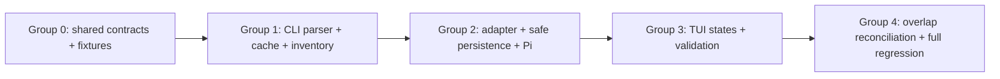

# Tasks: Runner-Resolved OpenCode Model Discovery

## Source

- Spec: `fix-runner-model-discovery-regression/spec.md` (33 requirements, 36 scenarios)
- Design: `fix-runner-model-discovery-regression/design.md`
- Preconditions: `preconditions.md` (Tasks closure reconciled below)
- Capabilities: runner-only OpenCode inventory, exact variants, bounded discovery, safe persistence, TUI states, and runner isolation.

## Execution Groups

Execution groups are the Apply batching boundary. Complete each group and its focused verification before starting its dependents. Every task is **unblocked**; the resolved 15,000 ms deadline is not reopened.

### Group 0 — Shared contracts and deterministic test foundation (sequential)
**Recommended owner**: General Apply  
**Depends on**: none  
**Apply batching**: one writer for core contracts and shared test doubles.

#### Task 0.1: Define runner-neutral async discovery and changed-write contracts
**Owner**: General Apply  
**Priority**: P0  
**Complexity**: Medium  
**Classification**: unblocked  
**Parallel**: No — shared contract and its mocks are touched by every dependent group.  
**Depends on**: none

**RED**: Add/update `packages/core/src/adapter-registry.test.ts` cases proving optional async discovery/validation ports, discriminated `ready`/`stale`/`blocked` results, arbitrary `RunnerVariantKey` strings, changed-agent validation evidence, and Pi omission compatibility.  
**GREEN**: Modify `packages/core/src/runner-adapter.ts` and dependent shared test types/mocks to expose the design-defined runner-neutral request, result, validation, inventory-entry, and optional install-input contracts; do not encode OpenCode paths, CLI behavior, cache policy, or closed variant unions in core.  
**REFACTOR**: Remove the TUI sync-or-Promise probing contract only where the shared type boundary requires it; retain Pi’s fixed-level semantics.

**Files**
- `packages/core/src/runner-adapter.ts` — modify
- `packages/core/src/adapter-registry.test.ts` — modify
- shared install/input type location(s) — modify only if required by `changedAgentIds` and validated fingerprint fields

**Verification**
- `bun test packages/core/src/adapter-registry.test.ts`
- `bunx tsc --noEmit`

#### Task 0.2: Establish hermetic OpenCode verbose fixtures and injected seams
**Owner**: General Apply  
**Priority**: P0  
**Complexity**: Medium  
**Classification**: unblocked  
**Parallel**: No — Task 1.1 consumes the fixture format and fake command/filesystem/clock interfaces.  
**Depends on**: Task 0.1

**RED**: Add fixture-driven test helpers that fail if a test invokes a live runner, network helper, real user path, shell, or uncontrolled clock. Include versioned valid and invalid `opencode models --verbose` transcript fixtures.  
**GREEN**: Create the fixture area and adapter-local dependency/test-double seam shapes specified by Design (command runner, filesystem, clock, environment, executable resolution).  
**REFACTOR**: Centralize reusable fixture builders without hiding test-specific expected command vectors or failure assertions.

**Files**
- `packages/adapter-opencode/src/__tests__/fixtures/opencode-models-verbose/` — create
- `packages/adapter-opencode/src/opencode-models-cli.test.ts` — create or stage
- adapter OpenCode test-helper location(s) — create/modify

**Verification**
- `bun test packages/adapter-opencode/src/opencode-models-cli.test.ts`
- Confirm test doubles assert zero network/live-runner/real-home writes.

### Group 1 — OpenCode discovery authority (sequential backend slice)
**Recommended owner**: Backend Apply  
**Depends on**: Group 0  
**Apply batching**: one backend writer; Tasks 1.1–1.3 share normalized inventory and cache modules.

#### Task 1.1: Implement bounded command execution and strict verbose-record parsing
**Owner**: Backend Apply  
**Priority**: P0  
**Complexity**: High — split parser and process boundary only if the existing Apply session cannot safely finish both.  
**Classification**: unblocked  
**Parallel**: No — establishes the authoritative normalized inventory consumed by all subsequent OpenCode work.  
**Depends on**: Task 0.2

**RED**: Complete parser/process tests for literal absolute executable plus `['models', '--verbose']`, no shell/`--pure`/`--refresh`, 15,000 ms hard deadline and one termination request, stdout/stderr/object/key/count bounds, identifier-first-slash splitting, string-aware JSON scanning, provider match, alias-header preservation, duplicate/trailing/malformed rejection, and valid zero-model output. Fixtures must cover built-in, custom, plugin, alias, extra-slash model IDs, exact ordered arbitrary keys, and zero variants.  
**GREEN**: Create `packages/adapter-opencode/src/opencode-models-cli.ts` with the Design’s bounded subprocess port and all-or-nothing strict parser. Normalize only validated runner data, preserve canonical IDs and final variant-key order, and return sanitized classified errors.  
**REFACTOR**: Isolate grammar/bound checks from command lifecycle without weakening whole-result rejection or leaking stdout/stderr.

**Files**
- `packages/adapter-opencode/src/opencode-models-cli.ts` — create
- `packages/adapter-opencode/src/opencode-models-cli.test.ts` — modify
- `packages/adapter-opencode/src/__tests__/fixtures/opencode-models-verbose/` — modify

**Verification**
- `bun test packages/adapter-opencode/src/opencode-models-cli.test.ts`
- Focused test proves fake time reaches exactly 15,000 ms without sleeping and no test executes installed OpenCode.

#### Task 1.2: Implement fingerprinted memory cache and compatible 24-hour LKG
**Owner**: Backend Apply  
**Priority**: P0  
**Complexity**: High — potential split between fingerprint/LRU and LKG persistence if needed.  
**Classification**: unblocked  
**Parallel**: No — shares discovery result/snapshot representation with Tasks 1.1 and 1.3.  
**Depends on**: Task 1.1

**RED**: Add fake-clock/filesystem tests for 4:59 reuse, 5:00 rediscovery, rescan bypass/coalescing, bounded LRU, and immediate invalidation on executable path/stat/version, workspace, config/auth/plugin state, and environment-name/presence changes—but not secret values. Add LKG cases for exactly 24h eligible, older/incompatible/malformed/non-runner-origin rejected, allowlisted content, private modes, and atomic replacement.  
**GREEN**: Create `packages/adapter-opencode/src/model-inventory-cache.ts` implementing SHA-256 canonical fingerprints, five-minute in-process entries, bounded in-flight coalescing, and the Design-selected fingerprint-matched normalized LKG at the specified cache location and permissions.  
**REFACTOR**: Keep cache-key/fingerprint construction separate from persistence; do not retain raw output, credentials, config contents, environment values, headers, or options.

**Files**
- `packages/adapter-opencode/src/model-inventory-cache.ts` — create
- `packages/adapter-opencode/src/model-inventory-cache.test.ts` — create

**Verification**
- `bun test packages/adapter-opencode/src/model-inventory-cache.test.ts`
- Focused tests assert no real filesystem writes and no secret values enter snapshots/fingerprints.

#### Task 1.3: Replace cache-authoritative inventory orchestration with runner-only normalization
**Owner**: Backend Apply  
**Priority**: P0  
**Complexity**: High — combines authority replacement, enrichment boundary, and state selection; split only along tested public seams.  
**Classification**: unblocked  
**Parallel**: No — modifies the existing inventory authority and consumes Tasks 1.1–1.2.  
**Depends on**: Tasks 1.1, 1.2

**RED**: Rewrite `model-inventory` tests for runner-only inclusion/cache-only exclusion, provider derivation from headers, all provider kinds, exact runner variants despite cache conflicts, safe matching metadata enrichment, malformed enrichment isolation, valid empty result, ready/memory, stale LKG, and blocked failure states. Prove command failure, timeout, and malformed live output never fail open.  
**GREEN**: Replace `packages/adapter-opencode/src/model-inventory.ts` orchestration with fingerprint → memory → live parser → metadata intersection enrichment → LKG/blocked selection. Return the runner-neutral state contract; metadata may fill only allowlisted missing presentation fields for matching IDs and cannot filter/add/replace provider/model/variant authority.  
**REFACTOR**: Delete or disconnect cache/provider-filter/catalog/plain-CLI fallback paths from discovery and validation while retaining only compatible metadata/fingerprint inputs.

**Files**
- `packages/adapter-opencode/src/model-inventory.ts` — rewrite
- `packages/adapter-opencode/src/model-inventory.test.ts` — rewrite
- `packages/adapter-opencode/src/model-catalog.ts` and cache metadata helpers — unchanged or modify only to enforce non-authoritative enrichment boundaries

**Verification**
- `bun test packages/adapter-opencode/src/model-inventory.test.ts packages/adapter-opencode/src/opencode-models-cli.test.ts packages/adapter-opencode/src/model-inventory-cache.test.ts`
- Validate the focused suite has no `--refresh`, network, live runner, or real-home filesystem access.

### Group 2 — Adapter persistence, validation, and Pi isolation (sequential backend slice)
**Recommended owner**: Backend Apply  
**Depends on**: Group 1  
**Apply batching**: one backend writer; Tasks 2.1–2.3 overlap adapter/config and should not be split across writers.

#### Task 2.1: Wire async OpenCode adapter discovery and exact changed-assignment validation
**Owner**: Backend Apply  
**Priority**: P0  
**Complexity**: High  
**Classification**: unblocked  
**Parallel**: No — changes adapter public behavior used by persistence and TUI.  
**Depends on**: Task 1.3

**RED**: Add adapter integration tests for ready/stale/blocked/empty propagation, latest usable snapshot lookup, exact model and case-sensitive variant validation, zero-variant unset-only behavior, stale/blocked write rejection, suffix/nearest-match rejection, and fingerprint revalidation.  
**GREEN**: Modify `packages/adapter-opencode/src/runner-adapter.ts` to implement the optional async discovery/validation ports, expose final variant keys from usable snapshots, and never fall back to static/catalog levels for OpenCode.  
**REFACTOR**: Remove lifetime synchronous memoization and closed-union casts from OpenCode dynamic variants; keep Pi interfaces compatible through the optional core contract.

**Files**
- `packages/adapter-opencode/src/runner-adapter.ts` — modify
- `packages/adapter-opencode/src/runner-adapter.inventory.test.ts` — modify/create

**Verification**
- `bun test packages/adapter-opencode/src/runner-adapter.inventory.test.ts`
- `bunx tsc --noEmit`

#### Task 2.2: Preserve stale reads and enforce native variant-only changed writes
**Owner**: Backend Apply  
**Priority**: P0  
**Complexity**: High — potential split between config hydration and install merge/recheck.  
**Classification**: unblocked  
**Parallel**: No — both files implement one persistence safety boundary.  
**Depends on**: Task 2.1

**RED**: Add tests proving `variant` then legacy `reasoningEffort` read precedence, no discovery-time deletion, model-unavailable versus variant-unavailable annotation, unchanged stale fields preserved byte-for-value during unrelated saves, changed invalid assignment rejected atomically, model-change old variant clearing, and apply-time fingerprint/value revalidation before any write.  
**GREEN**: Modify `packages/adapter-opencode/src/model-config.ts` and `packages/adapter-opencode/src/developer-team-install.ts` to retain raw unchanged assignments, track changed agents, write validated native `variant` only for changed OpenCode agents, clear obsolete legacy fields only on changed agents, and abort stale/blocked/invalid/raced writes before mutation.  
**REFACTOR**: Remove recursive/eager sanitization and normalization/nearest-match paths; reuse existing backup/rollback mechanics after the validation boundary.

**Files**
- `packages/adapter-opencode/src/model-config.ts` — modify
- `packages/adapter-opencode/src/model-config.test.ts` — modify
- `packages/adapter-opencode/src/developer-team-install.ts` — modify
- `packages/adapter-opencode/src/developer-team-install.test.ts` — modify

**Verification**
- `bun test packages/adapter-opencode/src/model-config.test.ts packages/adapter-opencode/src/developer-team-install.test.ts`
- Focused failure tests assert no real user configuration is written.

#### Task 2.3: Lock Pi semantics and cross-runner failure isolation
**Owner**: Backend Apply  
**Priority**: P0  
**Complexity**: Medium  
**Classification**: unblocked  
**Parallel**: No — run after shared contract and OpenCode adapter changes to catch regression at their final interface.  
**Depends on**: Tasks 2.1, 2.2

**RED**: Add/strengthen Pi tests for unchanged provider/model behavior, fixed six-level reasoning, config reads/writes, and assignment propagation while OpenCode fixtures return timeout/malformed/blocked states.  
**GREEN**: Make only compatibility adjustments needed by the shared optional ports; Pi must not adopt OpenCode parser, cache, snapshot, stale-write, or variant rules.  
**REFACTOR**: Remove test-only assumptions that OpenCode failure globally determines inventory state.

**Files**
- `packages/adapter-pi/src/runner-adapter.test.ts` — modify
- `packages/adapter-pi/src/model-config.test.ts` — modify
- Pi source modules — unchanged unless contract compilation requires a minimal compatibility change

**Verification**
- `bun test packages/adapter-pi/src/runner-adapter.test.ts packages/adapter-pi/src/model-config.test.ts`
- `bunx tsc --noEmit`

### Group 3 — TUI discovery, accessibility, and assignment flow (sequential frontend slice)
**Recommended owner**: Frontend Apply  
**Depends on**: Group 2  
**Apply batching**: one frontend writer. Run `ui-skills-root`; apply `fixing-accessibility` for interactive loading/stale/blocked states.

#### Task 3.1: Render async runner states and rescan without network refresh
**Owner**: Frontend Apply  
**Priority**: P0  
**Complexity**: High  
**Classification**: unblocked  
**Parallel**: No — both TUI files share selection/dirty-state flow and depend on stable adapter contracts.  
**Depends on**: Tasks 2.1, 2.2, 2.3

**RED**: Add deferred-promise and fixture tests proving loading before resolution; ready, explicit-empty, stale, and blocked render paths; keyboard-reachable Retry/Back; sanitized actionable error copy; stale timestamp/badges; unavailable model versus unavailable variant distinction; selection lists contain runner-only IDs and exact ordered variants; stale/blocked disable changed writes; `r` triggers local `rescan` only and never `--refresh`; and model changes clear invalid old variants. Include long-list focus/windowing coverage retained from the provider-filter change.  
**GREEN**: Modify `apps/cli/src/tui/app.tsx` and `apps/cli/src/tui/screens/developer-team-screens.tsx` to await the async contract, remove plain CLI/cache fallback and sync probing, retain persisted raw assignments, track dirty agents, validate before plan creation, pass validation fingerprint, and render the Design-defined states.  
**REFACTOR**: Consolidate state-to-screen mapping and preserve Pi’s current independent flow; ensure terminal text—not color alone—communicates loading/stale/error/unavailable status.

**Files**
- `apps/cli/src/tui/app.tsx` — modify
- `apps/cli/src/tui/screens/developer-team-screens.tsx` — modify
- `apps/cli/src/tui/__tests__/developer-team-screens-effort.test.tsx` — modify
- `apps/cli/src/tui/developer-team-flow.test.tsx` — modify

**Verification**
- `bun test apps/cli/src/tui/__tests__/developer-team-screens-effort.test.tsx apps/cli/src/tui/developer-team-flow.test.tsx`
- `bunx tsc --noEmit`
- Manual terminal check using fakes only: loading, empty, stale, blocked, Retry, and unavailable assignment labels are keyboard reachable.

### Group 4 — Reconciliation and final regression closure (sequential, no parallel writers)
**Recommended owner**: General Apply  
**Depends on**: Groups 1–3  
**Apply batching**: final integrator only; it may touch tests across domains but must not redesign the completed contracts.

#### Task 4.1: Reconcile overlapping change behavior and execute the complete deterministic matrix
**Owner**: General Apply  
**Priority**: P0  
**Complexity**: Medium  
**Classification**: unblocked  
**Parallel**: No — validates shared paths after all writer groups and prevents conflicting overlap edits.  
**Depends on**: Tasks 1.3, 2.2, 2.3, 3.1

**RED**: Add only missing integration assertions that demonstrate: (a) `opencode-configured-providers-filter` keeps list windowing but loses auth/env availability authority; (b) `fix-opencode-effort-levels-hardcoded` plumbing consumes runner final keys/empty sets, not cache/hardcoded values; and (c) valid OpenCode changes continue through `tui-model-assignment-bug` review/install propagation without taking ownership of its Pi/team propagation scope.  
**GREEN**: Reconcile duplicate/conflicting fallback logic in the touched implementation/tests according to the Design ownership table; do not reimplement completed compatible work or erase unrelated active-change requirements.  
**REFACTOR**: Deduplicate fixtures and assertions while preserving a single runner-authoritative source and explicit cross-change ownership notes in Apply progress.

**Files**
- focused adapter/TUI integration tests from Groups 1–3 — modify only where a reconciliation assertion is missing
- `openspec/changes/opencode-configured-providers-filter/` — no product-file rewrite; record supersession/reconciliation only through the normal orchestrator registry workflow if authorized
- `openspec/changes/fix-opencode-effort-levels-hardcoded/` — no duplicate Apply; preserve history
- `openspec/changes/tui-model-assignment-bug/` — no implementation ownership transfer; downstream task must consume this validation boundary

**Verification**
- `bun test packages/core/src/adapter-registry.test.ts packages/adapter-opencode/src/opencode-models-cli.test.ts packages/adapter-opencode/src/model-inventory-cache.test.ts packages/adapter-opencode/src/model-inventory.test.ts packages/adapter-opencode/src/runner-adapter.inventory.test.ts packages/adapter-opencode/src/model-config.test.ts packages/adapter-opencode/src/developer-team-install.test.ts packages/adapter-pi/src/runner-adapter.test.ts packages/adapter-pi/src/model-config.test.ts apps/cli/src/tui/__tests__/developer-team-screens-effort.test.tsx apps/cli/src/tui/developer-team-flow.test.tsx`
- `bunx tsc --noEmit`
- Run the repository-relevant test script(s) identified in `package.json`, then `bun test`.

## Dependency Graph

`0.1 → 0.2 → 1.1 → 1.2 → 1.3 → 2.1 → 2.2 → 2.3 → 3.1 → 4.1`

## Parallelization Plan

| Execution group | Tasks | Can run in parallel | Reason |
|---|---|---|---|
| 0 Shared | 0.1–0.2 | No | Core types, fixtures, and seams are shared contracts. |
| 1 Discovery | 1.1–1.3 | No | Parser, cache, and coordinator share normalized inventory/state. |
| 2 Adapter/persistence | 2.1–2.3 | No | Adapter and config write boundary overlap; Pi runs last as anti-regression. |
| 3 Frontend | 3.1 | No internal split | `app.tsx` and screens jointly own selection state. |
| 4 Reconciliation | 4.1 | No | Final cross-domain assertions must observe final behavior. |
| Backend + Frontend | Groups 1–3 | No | Frontend requires completed async contract, exact validation, and stable write semantics. |

## Responsibility Contracts and Hidden Coupling

| Boundary | Owner | Consumers | Coupling / handoff |
|---|---|---|---|
| Runner-neutral async result and validation types | General Apply | OpenCode adapter, TUI, Pi tests | No OpenCode source rules in core; optional ports protect Pi. |
| Strict runner parser and normalized inventory | Backend Apply | cache, coordinator, adapter, TUI | Canonical IDs and ordered variant keys are immutable authority. |
| Fingerprint/LKG | Backend Apply | adapter validation, TUI stale state | Fingerprint passed to install must be rechecked before writes. |
| Dirty-agent/raw assignment merge | Backend Apply | TUI/apply flow | TUI must mark only user-changed agents; unchanged stale fields remain untouched. |
| Async result states and user controls | Frontend Apply | user, adapter validation | No TUI fallback may recreate cache/catalog authority; Retry is local rescan, not network refresh. |
| Overlap work | General Apply | active changes | Preserve provider-list navigation and assignment propagation; supersede only obsolete availability/variant authority. |

## Complexity Summary

| Complexity | Count | Task IDs |
|---|---:|---|
| Medium | 4 | 0.1, 0.2, 2.3, 4.1 |
| High | 6 | 1.1, 1.2, 1.3, 2.1, 2.2, 3.1 |
| Low | 0 | none |

## Flagged for Splitting

- Task 1.1: split command lifecycle from parser only if both retain the same fixture contract and all-or-nothing result semantics.
- Task 1.2: split fingerprint/LRU from LKG persistence only at the cache module boundary.
- Task 1.3: split authority orchestration from metadata intersection only after Task 1.1–1.2 expose stable tested APIs.
- Task 2.2: split hydration from install merge/recheck only if both retain a shared raw-assignment preservation test.

## Verification Sequence and Baseline-Health Policy

1. Run each task’s focused `bun test` command immediately after GREEN/REFACTOR.
2. After Groups 0, 2, and 3 run `bunx tsc --noEmit`.
3. At Group 4 run the exact focused combined command listed in Task 4.1, then the repository-relevant suite(s) from `package.json`, then **`bun test`**.
4. Tests must use injected command/filesystem/environment/clock seams; no network, no live user runner as authority, and no real user filesystem writes.
5. Baseline-health policy: record pre-existing unrelated failures before Apply when feasible. A final `bun test` failure blocks completion only for failures introduced by, causally related to, or masked by this change; unrelated known baseline failures must be reported with evidence and not silently waived.

## Review Workload Forecast

| Signal | Value |
|---|---|
| Original completed scope | 10 completed tasks; retained as historical evidence |
| Override scope | One Backend Apply batch, Task R1 only; three authorized recurring fingerprints only |
| Expected changed files | ~14 source/test files; one new context module and focused test seams |
| Estimated changed lines | 400–800 |
| 400-line budget risk | High (advisory only) |
| Scope reduction recommended | No |
| Sequential work slices recommended | Yes — one ordered five-step Backend Apply batch |
| Decision needed before Apply | No |

**Rationale**: This is a constrained production-boundary repair, not a reimplementation. Review the absolute caller deadline, secret-safe context/fingerprint and runner/project LKG scope, then the required default-composition and mounted-app evidence. High advisory risk is justified by process/security boundaries and deterministic integration coverage. Quality override applies; do not reduce mandatory proof.

## Open Questions / Blockers

None — Task R1 is **unblocked** by the explicit human override. Exactly one focused Backend Apply batch, one further attempt per scoped fingerprint, and one Verify + Review cycle remain. The 15,000 ms product decision is final and is not reopened. Any scoped recurrence, missing required integration proof, new non-baseline failure, or failed cycle 2 is a final hard stop; a new unscoped blocker escalates directly.

## Mermaid Summary Source



## Human Override Repair Batch

**Incident**: `verify-review-blockers-round-1`  
**Authority**: `design.md` “Human Override Replan”; explicit user-approved replacement envelope.  
**Scope boundary**: Only `discovery-runtime-cache-fingerprint-lkg-unwired`, `opencode-timeout-not-hard-bounded`, and `required-regression-matrix-incomplete`. All original ten tasks remain completed and are not reopened.

### Task R1: Complete the authorized production-discovery boundary repair
**Owner**: Backend Apply  
**Priority**: P0  
**Complexity**: High — one coherent batch across process, production composition, and integration evidence; do not split across writers.  
**Classification**: unblocked  
**Parallel**: No — the single authorized batch has one deadline/context/cache state boundary and one final evidence set.  
**Depends on**: Tasks 0.1–4.1 completed; `repair-design-replan-completed`; explicit human override.

**Description**
Execute exactly one focused Backend Apply batch under `evaluateRepairIncident()`’s replacement envelope. Do not repair, alter, or re-test already-passing TUI behavior except the required mounted `DeckApp` composition evidence and narrow injection seam; do not admit unrelated fingerprints. Any scoped failure after this batch proceeds to final Verify + Review cycle 2, never another Apply retry.

**Files**
- `packages/adapter-opencode/src/opencode-models-cli.ts` — `OpenCodeCommandRequest`, `createNodeOpenCodeCommandRunner`, `discoverOpenCodeModels`
- `packages/adapter-opencode/src/opencode-models-cli.test.ts` — process-boundary describe
- `packages/adapter-opencode/src/model-discovery-context.ts` — create `collectOpenCodeDiscoveryContext` and safe file/config/plugin helpers
- `packages/adapter-opencode/src/model-discovery-context.test.ts` — create
- `packages/adapter-opencode/src/model-inventory-cache.ts` — `buildDiscoveryFingerprint`, `buildLastKnownGoodScopeKey`
- `packages/adapter-opencode/src/model-inventory-cache.test.ts`
- `packages/adapter-opencode/src/model-inventory.ts` — `discoverModelInventory`
- `packages/adapter-opencode/src/model-inventory.test.ts`
- `packages/adapter-opencode/src/runner-adapter.ts` — `OpenCodeRunnerAdapterOptions`, `OpenCodeRunnerAdapterImpl.constructor`, `createDefaultOpenCodeInventoryDiscovery`
- `packages/adapter-opencode/src/runner-adapter.inventory.test.ts`
- `packages/adapter-opencode/src/developer-team-install.test.ts`
- `apps/cli/src/tui/app.tsx` — `DeckApp` dependency resolution and stale module comment only
- `apps/cli/src/tui/app.opencode-discovery.test.tsx` — create
- `apps/cli/src/tui/opencode-discovery.test.ts` — retain coordinator coverage
- `apps/cli/src/tui/__tests__/developer-team-screens-effort.test.tsx` — terminology-only cleanup if incidental to touched work

**Atomic TDD substeps (one batch, sequential)**
1. **Freeze RED evidence.** Change only tests/fakes first. Record failing proof that the public Promise is pending at 15,000 ms; default composition cannot yet invalidate config/auth/plugin/LKG scope; the injectable default seam is unavailable; reverse-order plans lack proof; and mounted `DeckApp` deferred transitions lack a composition seam. This consumes the sole authorized attempt for the mapped scoped fingerprints; do not start another repair loop.
2. **Repair the absolute deadline.** Separate caller settlement from child cleanup; propagate one abort signal and remaining budget through version and verbose discovery; make `discoverModelInventory` deadline-aware and late-write-safe. `OPENCODE_DISCOVERY_TIMEOUT_MS = 15,000` is one public deadline from default discovery entry across version and `models --verbose`, while process reaping is independent.
3. **Repair production context and LKG scope.** Implement the injected safe collector and schema-2 DTO; fingerprint only it; derive LKG scope from runner realpath plus canonical project/workspace identity; compose through the injectable default factory. Preserve existing cache TTL/LRU, LKG schema/privacy/atomicity, and immutable plan implementation.
4. **Close integration evidence.** Run default-composition invalidation, two independently built plans applied B→A, and mounted `DeckApp` deferred loading → ready/empty/stale/blocked, Retry, Back, latest-result, and project-identity transitions. Make only the narrow `DeckApp` adapter/project dependency injection required. Clean remaining terminology only in already-touched files.
5. **Prove the batch and stop editing.** Run all required final gates and compare repo-wide output with the recorded binary-doctor baseline. Hand the tree to final Verify + Review cycle 2; do not launch another Apply batch for a failure.

**RED / GREEN / REFACTOR evidence by scoped fingerprint**
| Fingerprint | RED | GREEN | REFACTOR / retained proof |
|---|---|---|---|
| `opencode-timeout-not-hard-bounded` | At fake time 15,000 ms, prove the current public Promise remains pending until the 250 ms grace. | Full default discovery consumes version time while verbose remains running; public result settles exactly at total 15,000 ms as timeout; 14,999 ms remains pending; `SIGTERM` is once at deadline; cleanup remains pending; `SIGKILL` occurs at 15,250 ms if required; late close/error cannot alter result or commit cache/LKG. | Keep caller state separate from child cleanup state; freeze stream/result mutation after settlement and observe losing work to avoid unhandled rejection. |
| `discovery-runtime-cache-fingerprint-lkg-unwired` | Default composition reuses one fingerprint when config/auth/plugin state or runner/project scope changes. | Via `createOpenCodeRunnerAdapter({ productionDiscoveryDependencies: fakes })`, prove fresh discovery for runner realpath/stat/version, project/workspace root, global/workspace config, auth stat, referenced/auto-loaded plugin stat, and relevant credential-env presence; irrelevant env changes and credential value-only changes do not invalidate; captured LKG paths differ by runner realpath/project scope; no `inventoryDiscovery` bypass. | The safe schema-2 DTO contains runner identity; canonical project/workspace roots; ordered config candidates including XDG, explicit, upward, `.opencode`, config-dir, and sanitized virtual config-content state; auth stat only; plugin stat/digest only when safely tokenized; control-env paths/presence; and sorted relevant credential `{name,present}` only. No raw secrets, raw config/plugin bytes, broad environment enumeration, or value-derived hashes. |
| `required-regression-matrix-incomplete` | Existing coverage cannot instantiate default composition, permits 15,250 ms, applies only one plan/order, and tests only extracted coordinator state. | Strict deadline/context tests pass; default adapter composition is injected hermetically; plans B then A write only their own immutable bindings; mounted `DeckApp` covers all required deferred outcomes and both completion orders while coordinator tests stay green. | Retain existing unit tests and passing UI behavior. Remove obsolete cache-authority prose or literal escaped-comment terminology only when incidental; no visual/state-contract or Pi changes. |

**Required final gates**
```text
bun test packages/adapter-opencode/src/opencode-models-cli.test.ts packages/adapter-opencode/src/model-discovery-context.test.ts packages/adapter-opencode/src/model-inventory-cache.test.ts packages/adapter-opencode/src/model-inventory.test.ts packages/adapter-opencode/src/runner-adapter.inventory.test.ts packages/adapter-opencode/src/developer-team-install.test.ts apps/cli/src/tui/opencode-discovery.test.ts apps/cli/src/tui/app.opencode-discovery.test.tsx apps/cli/src/tui/__tests__/developer-team-screens-effort.test.tsx
bunx tsc --noEmit
bun test packages/adapter-opencode/src apps/cli/src/tui
bun run test
bun test
```
The final `bun test` is a baseline comparison against the recorded Binary smoke doctor fingerprint; it does not waive a new or causally changed failure.

**Verification**
- Preserve RED failure output and each GREEN result in `apply-progress.md` for the three scoped fingerprints.
- Confirm the one coherent batch has no changes outside the exact scope except incidental terminology in already-touched files.
- Final routing is `continue` only to Verify + Review cycle 2. `evaluateRepairIncident()` must return `block` if any scoped fingerprint recurs/remains or cycle 2 fails; a new unscoped blocker escalates immediately.

## Override Dependency and Routing

`completed Tasks 0.1–4.1 → R1 Backend Apply batch → final Verify + Review cycle 2 → block/escalate on any recurrence or failure`

| Batch | Task | Owner | Can run in parallel | Budget effect |
|---|---|---|---|---|
| Human override repair | R1 | Backend Apply | No | One remaining Apply batch; one remaining attempt for each scoped fingerprint; one verification cycle remains. |
