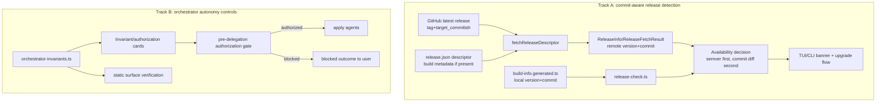
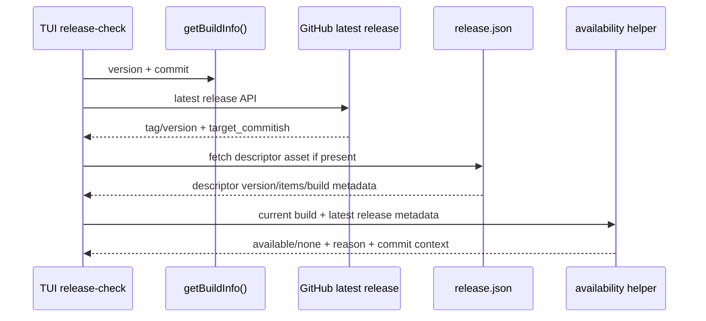
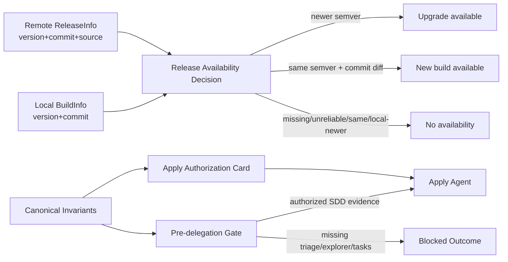

# Design: Fix Update/Upgrade Detection and Orchestrator Invariants

## Source

- Proposal: `fix-update-upgrade-and-orchestrator-invariants`
- Exploration: `openspec/changes/fix-update-upgrade-and-orchestrator-invariants/exploration.md`
- Capabilities affected: `deck-upgrade-detection`, `release-metadata-resolution`, `orchestrator-modification-authorization`, `orchestrator-invariant-enforcement`
- Spec status: not yet available

## Current Architecture Context

### Track A — Update/Upgrade Detection

- Build metadata is generated by `scripts/generate-build-info.ts` into `apps/cli/src/runtime/build-info.generated.ts`; runtime reads it through `apps/cli/src/runtime/build-info.ts#getBuildInfo()`.
- Release checks use `apps/cli/src/upgrade-command/github-release.ts`:
  - `fetchReleaseDescriptor()` calls GitHub latest-release API, optionally fetches `release.json`, validates it with `parseReleaseDescriptor()`, and falls back to `buildLegacyReleaseInfo()`.
  - `fetchLatestRelease()` converts descriptor or legacy data into `ReleaseInfo`.
  - `compareVersions()` is semver-only.
  - `checkUpgradeAvailable(currentVersion)` returns `true` only when `compareVersions(currentVersion, latestRelease.version) < 0`.
- TUI release visibility uses `apps/cli/src/tui/release-check.ts`:
  - `runReleaseCheckWithTimeout()` reads `getBuildInfo().version` only.
  - `toReleaseCheckState()` maps descriptor/legacy results to `available`, `none`, or `network-error` using semver-only checks.
- Unauthorized dirty context currently exists in `apps/cli/src/upgrade-command/github-release.ts`: `ReleaseInfo.commit`, descriptor `commit`, and API `target_commitish` were added but not populated or consumed. Treat this as non-authoritative implementation residue.

### Track B — Orchestrator Invariants

- Canonical invariant records live in `packages/core/src/teams/developer/orchestrator-invariants.ts` with six critical invariants and helpers:
  - `renderOrchestratorInvariants()`
  - `prependOrchestratorInvariants()`
  - `verifyOrchestratorInvariantPresence()`
- Main orchestrator content lives in `packages/core/src/teams/developer/orchestrator-content.ts`; adapter prompt wrappers re-export it from `packages/core/src/orchestrator-prompt.ts` and `packages/adapter-pi/src/orchestrator-prompt.ts`.
- Current controls are mostly prompt/content verification. The incident shows prompt text alone did not prevent apply delegation before INV-004 triage and INV-006 Explorer-first evidence.

## Proposed Architecture

Implement as two coordinated tracks with one incident disposition rule:

1. **Incident disposition first**: restore `apps/cli/src/upgrade-command/github-release.ts` to clean baseline before applying this change. Do not preserve the unauthorized dirty diff as implementation. Then intentionally reintroduce commit metadata and comparison behavior through reviewed SDD tasks.
2. **Track A**: make release availability decision commit-aware without adding full Git topology. Use semver as the primary ordering; when semver is equal, require both local and remote commit metadata and report availability only when the normalized commits differ.
3. **Track B**: add defense-in-depth autonomy controls: canonical authorization contract, pre-delegation gate prompt/checklist, apply-agent authorization card, static surface verification, and runtime/self-audit expectations.

### Concise Architecture Diagram



### Component / Module Boundaries

| Component | Responsibility | Change Type |
|---|---|---|
| `apps/cli/src/upgrade-command/github-release.ts` | GitHub release API/descriptor fetch, legacy fallback, `ReleaseInfo`, availability decision | modified after revert |
| `apps/cli/src/upgrade-command/release-descriptor.ts` | `release.json` schema and parsing | modified only if descriptor build/commit metadata needs schema support |
| `apps/cli/src/runtime/build-info.ts` | Runtime local build metadata contract | unchanged or narrow type-doc update |
| `scripts/generate-build-info.ts` | Generate local build metadata | modified |
| `scripts/prepare-release.ts` | Release preparation flow invoking build-info generation | modified if it currently allows stale generated metadata |
| `apps/cli/src/tui/release-check.ts` | TUI-facing release-check state mapping | modified |
| `apps/cli/src/tui/screens/home-screen.tsx` / banner components | User-facing release banner copy | modified if new same-version update copy requires display support |
| `packages/core/src/teams/developer/orchestrator-invariants.ts` | Canonical invariant source and verification helpers | modified |
| `packages/core/src/teams/developer/orchestrator-content.ts` | Orchestrator prompt/body/skill content and SDD gate wording | modified |
| `packages/core/src/orchestrator-prompt.ts` | Core prompt wrapper/export surface | modified only if new composed prompt helpers are exported |
| `packages/adapter-pi/src/orchestrator-prompt.ts` | Pi adapter prompt wrapper/export surface | modified only if wrapper must expose new composed prompt helpers |
| Apply-agent skill/prompt sources under `packages/core/src/teams/developer/` or installer templates | Specialist authorization card injection target | modified; exact file depends on current installer/source layout |

## Track A Design — Commit-Aware Update Detection

### Release Metadata Contract

Use an explicit commit metadata shape rather than a bare string where interfaces cross boundaries:

```ts
type ReleaseCommitMetadata = {
  value: string;
  source: "github-target-commitish" | "release-descriptor" | "legacy-body";
  reliable: boolean;
};
```

Architectural rules:

- `ReleaseInfo` should expose `commit: ReleaseCommitMetadata | null` or a narrow equivalent that preserves source/reliability. If implementation must keep `commit: string | null` for compatibility, add side metadata only where needed and do not overstate reliability.
- Remote commit source priority:
  1. Descriptor/build metadata when present and validated as release-produced metadata.
  2. GitHub API `target_commitish`.
  3. Legacy/body-derived metadata only if an existing descriptor or release body format reliably exposes it; otherwise absent.
- Normalize commit values before comparison:
  - trim whitespace;
  - reject empty, `unknown`, or placeholder values;
  - accept full or short hex SHA-like values as comparable;
  - treat branch names/tags from `target_commitish` as metadata but not reliable for commit-diff availability unless Spec explicitly allows non-SHA comparison.

### GitHub `target_commitish`

- Extend the local GitHub latest-release API payload type in `fetchReleaseDescriptor()` and `buildLegacyReleaseInfo()` to include `target_commitish?: string`.
- Populate remote commit metadata from `releaseData.target_commitish` for both descriptor and legacy fallback paths.
- Do not cache GitHub API commit metadata inside cached `release.json` unless the cache envelope is extended; cached descriptor payload should remain descriptor-shaped. If cached descriptor reads are used for availability in future, pair them with fresh API metadata or descriptor-native commit metadata.

### Descriptor / Build Metadata

- Prefer adding/using descriptor-native build commit metadata only if `ReleaseJsonSchema` already has an appropriate field or can be extended backward-compatibly.
- Descriptor schema extension must be optional to preserve compatibility with older `release.json` assets.
- Generated descriptor metadata should come from the same source as `build-info.generated.ts` for release builds to avoid split-brain local/remote commit identity.

### Comparison Algorithm

Create a single decision helper used by CLI and TUI paths, e.g. conceptually:

```ts
decideReleaseAvailability({ currentVersion, currentCommit, latestVersion, latestCommit }):
  | { kind: "available"; reason: "newer-version" }
  | { kind: "available"; reason: "same-version-different-commit" }
  | { kind: "none"; reason: "same-build" | "local-newer" | "missing-commit" }
```

Rules:

1. `compareVersions(currentVersion, latestVersion) < 0` => available, reason `newer-version`.
2. `compareVersions(currentVersion, latestVersion) > 0` => none, reason `local-newer`.
3. Equal semver:
   - if either local or remote commit is missing/unreliable => none, reason `missing-commit`;
   - if normalized commits are equal or one is a prefix of the other in the expected short/full SHA relationship => none, reason `same-build`;
   - if both are reliable and differ => available, reason `same-version-different-commit`.

Do **not** add full Git topology or GitHub compare API in this change. Surface commit context to reduce false-positive confusion.

### TUI / CLI Integration

- `checkUpgradeAvailable()` should read `getBuildInfo()` or accept a richer current-build input so same-version comparison can use local commit.
- `fetchLatestRelease()` must return populated remote commit metadata for descriptor and legacy paths.
- `ReleaseCheckDeps.currentVersion` should become a richer current build provider or add `currentBuildInfo?: () => Pick<BuildInfo, "version" | "commit">` while keeping current tests easy to inject.
- `ReleaseCheckState.available` should carry optional availability reason and commit context:
  - `reason: "newer-version" | "same-version-different-commit"`;
  - `currentCommit?: string`;
  - `latestCommit?: string`.
- TUI copy should distinguish same-version update from semver upgrade, e.g. “New build available for v0.1.5” rather than implying a version bump.
- Upgrade installation flow remains unchanged; it consumes the selected latest release/download URL as before.

### Build Metadata Freshness

- Keep `scripts/generate-build-info.ts` as the single generator for baked local commit metadata.
- Ensure release preparation runs generation at the correct point:
  - after the final release commit/tag target is known, or
  - with an explicit `--commit` override supplied by release prep/CI when HEAD is not the final release commit.
- Add validation in `scripts/prepare-release.ts` or release prep checks to detect stale `build-info.generated.ts` commit before packaging.
- Prefer failing release prep on stale/unknown commit over silently shipping ambiguous metadata.

### Track A Flow



## Track B Design — Orchestrator Autonomy Controls

### Invariant Prompt Construction

- Keep `orchestrator-invariants.ts` as canonical source, but extend it from “render presence” to “actionable authorization artifact”.
- Add a compact render mode for delegation gates/cards that emphasizes:
  - INV-004: triage completed before modifying work;
  - INV-006: Explorer completed before Proposal/Spec/Design/Task/Apply in Run SDD;
  - apply-specific rule: no apply/write delegation without task artifact and explicit authorization.
- Compose invariant content into:
  - orchestrator system prompt first-position section;
  - orchestrator agent body and skill body;
  - apply-agent launch prompt/body as an authorization card;
  - installed/generated surfaces verified by tests.

### Gate / Authorization Model

Define an explicit delegation authorization record in orchestrator methodology/prompt contract:

```ts
type ModificationAuthorization = {
  requestClassification: "Direct" | "Specialist(s)" | "Recommend SDD" | "Run SDD";
  userAuthorizedModification: boolean;
  sddChange?: string;
  explorerArtifact?: string;
  proposalArtifact?: string;
  specArtifact?: string;
  designArtifact?: string;
  taskArtifact?: string;
  allowedTargets?: readonly string[];
  blockedTargets?: readonly string[];
};
```

Authorization rules:

- Non-SDD modifying delegation requires explicit user request plus triage classification that selects Direct or Specialist(s).
- Run SDD modifying delegation requires, at minimum: Explorer, Proposal, Spec, Design, Tasks complete; task artifact authorizes the target apply agent and target file scope.
- Automatic mode does not waive triage or phase evidence.
- Missing, contradictory, or stale authorization => block and report the missing gate instead of delegating.

### Runtime / Self-Audit Checks

- Add a pre-delegation checklist in orchestrator content before any modifying phase or apply-agent launch:
  1. classify request;
  2. confirm initialized SDD workspace if SDD;
  3. confirm Explorer-first evidence for Run SDD;
  4. confirm required phase artifacts and registry intent/state;
  5. confirm user authorization and task routing;
  6. emit blocked outcome if any item is missing.
- Because the orchestrator itself is prompt-driven, make this a mandatory launch contract and test its presence across composed prompts.
- If a runtime layer exists for specialist launches, introduce a small pure helper that validates `ModificationAuthorization` before composing an apply prompt. If no runtime layer exists, encode the contract in canonical prompt/source and verify statically.

### Static Checks

- Extend `orchestrator-invariants.test.ts` and `orchestrator-content.test.ts` to verify:
  - INV-004 and INV-006 include modification-blocking wording;
  - pre-delegation checklist appears before apply routing in orchestrator content;
  - automatic mode text explicitly says it does not bypass triage/Explorer-first;
  - apply-agent authorization card is present in launch/specialist surfaces;
  - installed/generated prompt surfaces include current invariant block where test infrastructure can inspect generated output.
- Use `verifyOrchestratorInvariantPresence()` for ID presence, but add semantic tests for required phrases because ID presence alone did not prevent the incident.

### Agent Delegation Contract

Every apply-agent handoff must include:

- change name;
- task IDs and allowed files/scope;
- artifact paths for Explorer, Proposal, Spec, Design, Tasks;
- explicit authorization statement: “modifying work authorized: yes”;
- invariant card stating the agent must refuse if triage/Explorer/task authorization is missing;
- instruction to report `blocked` rather than write when authorization is absent.

Apply agents must treat missing authorization as a blocker, not as permission to infer.

### Preventing Repeat Unauthorized Apply

- Primary prevention: orchestrator pre-delegation gate blocks apply launch until SDD evidence exists.
- Secondary prevention: apply-agent prompt card requires refusal without authorization.
- Tertiary prevention: static tests verify all surfaces contain gate/card semantics.
- Incident response: if unauthorized dirty files are detected, do not continue from dirty implementation; restore baseline via user-confirmed safe/discard workflow or intentional SDD implementation path.

## State / Persistence Implications

- No database or durable application state changes.
- Local release cache remains descriptor-shaped unless a deliberate cache-envelope extension is chosen later.
- Build metadata file remains generated source artifact.
- Spec Registry semantics unchanged; this Design phase is registry-deferred by instruction.

## Migration / Backward Compatibility

- Older releases without commit metadata remain valid. Equal-semver detection simply returns none when commit data is missing/unreliable.
- Descriptor schema additions must be optional.
- Existing semver-newer upgrade behavior remains unchanged.
- TUI state additions should be additive to `available`; existing consumers can ignore reason/commit fields if not displaying them.
- Installed orchestrator prompt/skill files may be stale until regenerated/reinstalled; tests should cover generated source and installer outputs, and user-facing remediation should be “run/install updated Deck prompts” if applicable.

## File Impact Estimate

| File / Path | Action | Rationale |
|---|---|---|
| `apps/cli/src/upgrade-command/github-release.ts` | modify | Revert unauthorized diff first, then intentionally add commit metadata population and commit-aware availability helper |
| `apps/cli/src/upgrade-command/release-descriptor.ts` | modify/unchanged | Optional descriptor build commit schema support if existing schema lacks metadata |
| `apps/cli/src/upgrade-command/__tests__/github-release.test.ts` | modify | Cover same-version/different-commit, missing commit, local-newer, legacy/descriptor paths |
| `apps/cli/src/tui/release-check.ts` | modify | Use local commit, propagate availability reason/commit context |
| `apps/cli/src/tui/__tests__/tui-integration.test.tsx` | modify | Verify same-version update is visible instead of `none` |
| `apps/cli/src/tui/screens/home-screen.test.tsx` | modify | Verify banner copy/state for same-version build update if banner copy changes |
| `apps/cli/src/tui/screens/home-screen.tsx` or banner component | modify/unchanged | Display “new build available” copy if state reason is surfaced in UI |
| `apps/cli/src/runtime/build-info.ts` | modify/unchanged | May need docs/helper for comparable local commit metadata |
| `apps/cli/src/runtime/build-info.generated.ts` | generated | May change during implementation/release-prep validation; avoid manual product edit unless task requires regeneration |
| `scripts/generate-build-info.ts` | modify | Add explicit commit override/validation support and reliable HEAD capture |
| `scripts/prepare-release.ts` | modify | Ensure release prep regenerates or validates build commit freshness |
| `packages/core/src/teams/developer/orchestrator-invariants.ts` | modify | Add compact gate/card render helpers and stronger invariant metadata |
| `packages/core/src/teams/developer/orchestrator-content.ts` | modify | Add pre-delegation checklist, automatic-mode non-bypass text, apply authorization contract |
| `packages/core/src/teams/developer/orchestrator-invariants.test.ts` | modify | Verify gate/card rendering and semantic blocker wording |
| `packages/core/src/teams/developer/orchestrator-content.test.ts` | modify | Verify surface ordering/content and apply authorization card presence |
| `packages/core/src/orchestrator-prompt.ts` | modify/unchanged | Re-export new composition helpers only if needed by adapters |
| `packages/adapter-pi/src/orchestrator-prompt.ts` | modify/unchanged | Mirror prompt helper export only if adapter consumes it |
| Installed/generated orchestrator prompt/skill fixture or installer tests | modify | Ensure installed surfaces include new invariant gate/card |

## Testing Strategy

### Track A

- Unit tests for a pure availability decision helper:
  - remote semver greater => available;
  - equal semver + different reliable commits => available with `same-version-different-commit`;
  - equal semver + missing local or remote commit => none;
  - equal semver + short/full SHA prefix match => none;
  - local semver greater => none/local-newer.
- Fetch tests for descriptor and legacy paths ensuring `target_commitish`/descriptor metadata populates remote commit metadata.
- TUI mapping tests for `toReleaseCheckState()` ensuring same-version update maps to `available`, not `none`.
- Release-prep/generator tests for commit override/freshness validation.

### Track B

- Unit tests for invariant render helpers and semantic required phrases.
- Content tests asserting pre-delegation gate precedes apply routing and automatic mode cannot bypass it.
- Apply-agent prompt/surface tests asserting authorization card and refusal instructions are present.
- Installer/generated-surface tests where available to prevent stale installed prompts.

## Observability / Error Handling

- Track A should not turn missing/ambiguous commit metadata into errors; return no commit-based availability and keep network errors unchanged.
- Same-version update display should include commit context when available to explain why an update is shown.
- Track B blocked gate outcomes should be explicit and concise: identify missing triage, missing Explorer, missing task authorization, or missing user authorization.
- Optional future structured invariant-violation logging remains an open decision; not required for first hardening.

## Security / Performance / Accessibility Considerations

- Security: release commit metadata is advisory availability context, not an integrity check. Existing checksum/signature behavior must remain the install integrity boundary.
- Performance: no GitHub compare/topology call in this design; existing latest-release and descriptor calls remain the network boundary.
- Accessibility: if TUI copy changes, same-version update state should remain text-visible and not rely on color-only distinction.

## Unauthorized Dirty File Disposition

| Option | Decision | Rationale |
|---|---|---|
| Revert first, then re-implement via SDD | Chosen | Preserves traceability, removes dangling fields, and prevents normalizing unauthorized apply output |
| Overwrite via implementation without revert | Rejected | Risks accidentally preserving unauthorized code and obscures provenance |
| Commit/accept dirty change as-is | Rejected | Proposal explicitly excludes preserving unauthorized product-file change; current diff is incomplete |

Implementation note: commands such as `git checkout -- apps/cli/src/upgrade-command/github-release.ts` or `git restore apps/cli/src/upgrade-command/github-release.ts` are destructive and require explicit user confirmation per Git discard protection. If avoiding destructive git commands, an apply agent may intentionally rewrite the file to the desired reviewed final state, but the design preference is still to restore clean baseline first.

## Tradeoffs

| Decision | Chosen | Rejected Alternative | Rationale |
|---|---|---|---|
| Same-version detection | Commit-diff heuristic when both sides have reliable commit metadata | Full Git topology / GitHub compare API | Solves release miss with lower complexity and no extra network dependency |
| Missing commit behavior | Safe none/no commit-based claim | Treat missing as available | Avoids unsafe false positives and noisy banners |
| `target_commitish` handling | Use as best-effort commit metadata only when normalized/reliable | Trust all strings blindly | GitHub may return branches/tags; unreliable values should not drive availability |
| Build metadata freshness | Validate/fail stale release metadata | Silently keep generated file | Prevents recurrence of stale baked commit |
| Invariant enforcement | Layered prompt construction + authorization contract + tests | Prompt-only strengthening | Incident proves passive text alone is insufficient |
| Programmatic guard depth | Add helper/contract where launch layer exists, otherwise verify canonical source | Deep runtime framework rewrite | Provides immediate hardening without over-scoping orchestrator runtime architecture |
| Unauthorized dirty file | Revert first, re-implement intentionally | Preserve/complete dirty diff | Maintains SDD provenance and avoids accepting unauthorized mutation |

## Risks

| Risk | Likelihood | Impact | Mitigation |
|---|---|---|---|
| Commit-diff false-positive for local manual build newer than latest release | Medium | Medium | Semver local-newer blocks version downgrade; equal-version commit-diff copy shows context; future topology check can refine |
| `target_commitish` is branch/tag, not SHA | Medium | Medium | Normalize and mark unreliable; do not use unreliable metadata for commit-based availability |
| Descriptor schema change affects older release assets | Low | Medium | Make metadata optional and preserve legacy fallback |
| TUI state type additions cascade through fixtures | Medium | Low | Keep fields additive and centralize decision helper |
| Build-info regeneration changes generated file unexpectedly | Medium | Medium | Validate in release prep; make generator override explicit; tests document behavior |
| Orchestrator gate remains bypassable because it is prompt-mediated | Medium | High | Add apply-agent refusal card and static semantic tests; add runtime helper if launch layer exists |
| Installed prompts stale after code update | Medium | Medium | Verify generated/installed surfaces where possible and document reinstall/remediation |
| Revert command could discard unrelated user work | Low | High | Require exact user confirmation for destructive Git discard; inspect status/diff before revert during Apply |

## Open Decisions

- Should same-version/different-commit UI label be “update”, “upgrade”, or “new build available”? Design recommends “new build available” for clarity; Spec/user should finalize copy.
- Should non-SHA `target_commitish` ever count as reliable enough for same-version availability? Design recommends no for first pass.
- Should invariant violations be logged as structured incidents? Not required for first hardening; useful future follow-up.
- Exact apply-agent prompt source file(s) depend on installer/template layout; Task/Apply should locate the canonical source before editing.

## Dependencies

- GitHub Releases API `target_commitish` availability.
- Existing release descriptor schema and generator paths.
- Existing build-info generation and release preparation scripts.
- Orchestrator invariant/content tests and installer/generated surface tests.
- User-approved destructive Git confirmation if implementation uses `git restore`/`checkout --` to revert unauthorized dirty file.

## Rollback

- Track A: revert availability helper usage to semver-only comparison; keep optional metadata fields if backward-compatible or remove with tests.
- Track A build prep: disable stale-commit validation if it blocks releases unexpectedly, but retain generator tests to diagnose.
- Track B: remove pre-delegation/card composition from prompt surfaces while retaining canonical invariant records; tests should be updated only through SDD if rollback is approved.
- Incident disposition: do not resurrect unauthorized dirty diff; rollback should still preserve traceable SDD-authored changes only.

## Next Steps

Ready for Task (`deck-developer-task`) to combine with Spec and break into implementation tasks.

## Mermaid Summary Source


