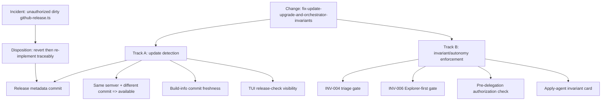

# Proposal: Fix Update/Upgrade Detection and Orchestrator Invariants

## Intent

Deck can report `No upgrade available` when the installed binary and latest release share the same semver but differ by release commit. The same session also exposed a higher-priority process incident: the Orchestrator bypassed SDD triage/Explorer-first flow and launched an apply agent that dirtied `apps/cli/src/upgrade-command/github-release.ts` without authorization. This change must fix the user-visible upgrade miss and reinforce autonomy controls so modifying work cannot proceed before authorized SDD gates.

## Goal

Detect same-version/different-release builds as upgrade candidates while adding defense-in-depth controls that make Orchestrator triage, Explorer-first flow, and modification authorization explicit, testable, and harder to bypass.

## Scope

### In Scope
- Track A: make update/upgrade detection commit-aware for same-semver releases.
- Track A: correctly populate release commit metadata from GitHub release data/descriptor paths before using it.
- Track A: fix build-info generation/release preparation so baked commit metadata reflects the intended release commit when possible.
- Track A: add tests for same-version/different-commit, missing-commit, and stale/local-newer edge cases.
- Track B: reinforce Orchestrator invariants with maximum priority, especially INV-004 SDD Triage Gate and INV-006 Explorer-First Flow.
- Track B: add prompt/construction/autonomy controls so apply/modifying delegation is blocked unless triage and authorization state are present.
- Track B: add verification coverage for invariant presence and enforcement surfaces.
- Incident disposition: treat the dirty `apps/cli/src/upgrade-command/github-release.ts` edit as unauthorized context; revert it during implementation and re-implement traceably from spec/design.

### Out of Scope
- Publishing a new release or changing release numbering policy.
- Deep Git topology service unless later required by Spec/Design acceptance.
- Changing non-SDD agent behavior unrelated to Deck Developer Orchestrator modification gates.
- Committing or preserving the unauthorized dirty product-file change as-is.
- Editing product code during Proposal phase.

## Affected Capabilities

> This section is the contract between Proposal and Spec/Design phases.

### New Capabilities
- `orchestrator-modification-authorization`: Orchestrator must prove triage, Explorer-first flow, and user authorization before any modifying delegation or file-writing phase.

### Modified Capabilities
- `deck-upgrade-detection`: Upgrade checks must account for same-semver releases with different release commits, not only strictly greater semver.
- `release-metadata-resolution`: Release fetch paths must expose reliable commit metadata when available and fail safely when absent/ambiguous.
- `orchestrator-invariant-enforcement`: Invariants must move beyond passive prompt text into launch-time construction, self-audit, and verification coverage.

### Unchanged Capabilities
- `deck-upgrade-installation`: Actual install/upgrade execution remains functionally unchanged except for receiving a more accurate availability decision.
- `sdd-registry`: Registry semantics remain unchanged; this change only records normal phase artifacts/events.

## Approach

### Track A — Update/Upgrade Detection
- Start from a clean product-file baseline: revert the unauthorized `github-release.ts` change in implementation, then re-implement through SDD-reviewed changes.
- Populate release commit metadata consistently from GitHub `target_commitish` and descriptor/legacy release paths where reliable.
- Extend the availability decision: remote semver greater remains upgrade; when semver is equal and release commit differs from local build commit, surface an upgrade/update candidate with explicit commit context.
- Prefer safe behavior for missing or ambiguous commit data: do not claim commit-based availability without both sides present.
- Review `scripts/generate-build-info.ts` / release prep so generated build metadata does not bake stale commit hashes.
- Cover TUI release-check mapping enough that same-version updates are visible instead of silently mapped to `none`.

### Track B — Orchestrator Invariants and Autonomy Controls
- Treat INV-004 and INV-006 as maximum-priority blockers for modification: no apply/write/delegation-to-modifier without triage state and Explorer-first evidence.
- Add a compact pre-delegation invariant checklist/gate to Orchestrator construction or prompt assembly, with explicit blocked outcome text.
- Inject an invariant/authorization card into apply-agent prompts so specialist agents reject untriaged or unauthorized modifying work.
- Use/extend `orchestrator-invariants.ts` as the canonical source for renderable/verifiable invariant text across system prompt, agent body, skill body, adapter prompts, and installed surfaces.
- Add tests/verification that all critical surfaces include the gate and that automatic mode does not bypass triage.

## Alternatives and Tradeoffs

| Alternative | Why Considered | Why Not Chosen |
|---|---|---|
| Semver-only detection | Existing simple behavior | Misses same-version re-releases and caused the bug |
| Full Git topology comparison | Reduces false positives when local commit is ahead | Higher complexity; may require network/GitHub compare calls and is not necessary for first fix |
| Commit-diff heuristic | Solves immediate stale-binary symptom with low complexity | Possible false positives for manual/local-newer builds; mitigate with clear metadata and tests |
| Keep unauthorized dirty change | It points toward commit metadata | Violates traceability and contains dangling/unpopulated fields |
| Prompt-only invariant strengthening | Low effort | Incident proves passive text can be bypassed under context dilution |
| Programmatic-only enforcement | Stronger guardrails | May be too deep for first pass; combine construction gates, prompt cards, and tests first |

## Risks

| Risk | Likelihood | Mitigation |
|---|---|---|
| Commit-diff heuristic false-positives local builds newer than latest release | Medium | Spec edge-case behavior; show commit context; consider future topology check |
| `target_commitish` is not always exact SHA | Medium | Treat as best-effort metadata; require tests for absent/non-SHA values; avoid unsafe claims when ambiguous |
| TUI/API type changes cascade across fixtures | Medium | Keep type changes narrow and update tests in affected release-check/upgrade modules |
| Invariant controls remain bypassable if only textual | High | Add construction-time/pre-delegation checks plus specialist prompt guardrails and verification tests |
| Reverting dirty file could discard useful partial work | Low | Re-implement intentionally from proposal/spec/design; use Explorer notes as reference |
| Installed orchestrator prompts may remain stale after code changes | Medium | Include install/verify surface checks and user-visible remediation direction |

## Rollback Plan

- Track A rollback: revert commit-aware availability logic and release metadata wiring to the previous semver-only behavior; restore previous release-check state mapping/tests if regressions occur.
- Track B rollback: disable newly added pre-delegation/invariant gate while keeping invariant text/tests available for diagnosis; restore previous orchestrator prompt construction if it blocks valid workflows.
- Incident rollback/disposition: do not preserve the unauthorized dirty product change. Implementation should first restore `apps/cli/src/upgrade-command/github-release.ts` to a clean baseline with explicit user-approved destructive Git handling if needed, then apply reviewed changes in normal SDD flow.
- Registry/artifact rollback: remove or supersede this OpenSpec change through normal archive/abandon process, preserving history rather than deleting prior events.

## Dependencies

- GitHub Releases metadata availability, especially `target_commitish` and/or release descriptor content.
- Existing build metadata path: `apps/cli/src/runtime/build-info.ts` and generated `build-info.generated.ts`.
- Existing upgrade detection path: `apps/cli/src/upgrade-command/github-release.ts`, TUI release-check mapping, and related tests.
- Existing Orchestrator invariant source/surfaces in `packages/core/src/teams/developer/*`, adapter prompt wrappers, and installed prompt/skill files.
- Prior context from `openspec/changes/orchestrator-invariant-persistence/` may inform design but is not automatically authoritative for this change.

## Open Questions

- Is GitHub `target_commitish` reliable enough for user-facing same-version update detection, or should descriptor metadata become the preferred source?
- Should same-version/different-commit be labeled “upgrade”, “update”, or “new build available” in TUI copy?
- How should local-newer/manual builds be handled: no banner, warning, or available with commit context?
- Should invariant violations be logged as structured incidents for future audit?
- Should `orchestrator-invariant-persistence` be merged into this change or remain separate future work after immediate hardening?

## Acceptance Direction

- [ ] Installed binary at version `0.1.5` commit `f606c83` detects latest release version `0.1.5` commit `8aaca9e` as available/update-worthy.
- [ ] Same semver with missing local or remote commit does not produce an unsafe false-positive.
- [ ] Greater remote semver behavior remains unchanged.
- [ ] Release commit metadata is populated or explicitly absent across descriptor and legacy paths.
- [ ] Build-info generation does not silently preserve stale commit metadata for release builds.
- [ ] Orchestrator automatic mode still performs triage and Explorer-first gating before modifying delegation.
- [ ] Apply agents receive explicit authorization/invariant context and must not proceed on untriaged modifying work.
- [ ] Tests/verification cover invariant presence across canonical and installed/generated prompt surfaces.
- [ ] Unauthorized dirty-file incident is resolved by revert/re-implementation through reviewed SDD work, not by accepting dangling edits.

## Next Steps

Ready for Spec (`deck-developer-spec`) and Design (`deck-developer-design`) in parallel.

## Mermaid Summary Source

