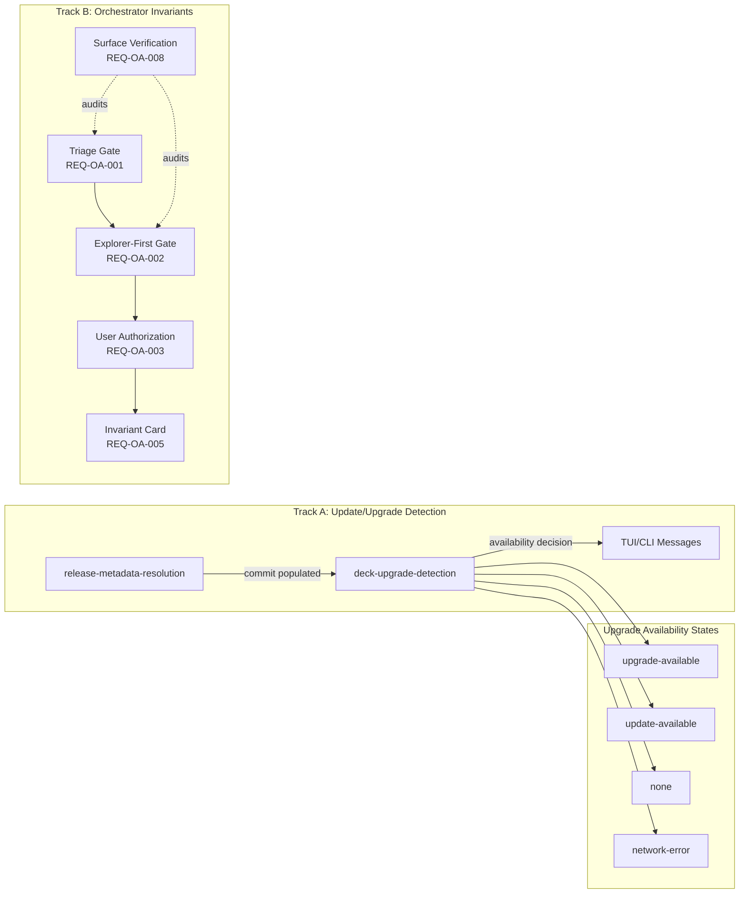

# Spec: Fix Update/Upgrade Detection and Orchestrator Invariants

## Source

- Proposal: `fix-update-upgrade-and-orchestrator-invariants` proposal artifact
- Exploration: `fix-update-upgrade-and-orchestrator-invariants` exploration artifact
- Capabilities affected: `deck-upgrade-detection`, `release-metadata-resolution`, `orchestrator-invariant-enforcement`, `orchestrator-modification-authorization` (new)

## Non-Goals

- Publishing a new release or changing release numbering policy.
- Deep Git topology comparison service (SHA ancestry / parent-child resolution).
- Changing non-Deck-Developer agent behavior unrelated to Orchestrator modification gates.
- Committing or preserving the unauthorized dirty product-file change as-is.
- Modifying `sdd-registry` semantics.
- Altering `deck-upgrade-installation` execution behavior (only the availability decision changes).

---

## Requirements

### Capability: deck-upgrade-detection

REQ-UD-001: The system MUST detect an available update when the installed binary and the latest release share the same semver but have different commit hashes.
  Priority: MUST
  Surface: General
  Rationale: Same-version re-releases are silently missed today, leaving users on stale binaries.

REQ-UD-002: The system MUST NOT report an update available when semver is equal and either the local commit, the remote commit, or both are absent or non-parseable.
  Priority: MUST
  Surface: General
  Rationale: Prevents false positives when metadata is unreliable.

REQ-UD-003: The system MUST preserve existing behavior when remote semver is strictly greater than local semver, regardless of commit metadata.
  Priority: MUST
  Surface: General
  Rationale: No regression for the common upgrade path.

REQ-UD-004: The system MUST NOT report an update available when local semver is greater than remote semver.
  Priority: MUST
  Surface: General
  Rationale: Local-ahead case must not false-positive.

REQ-UD-005: The TUI release-check state mapping SHOULD include a distinguishable state for same-version/different-commit updates that carries commit context for display.
  Priority: SHOULD
  Surface: UI
  Rationale: Users need to see why an update is offered (commit, not version bump).

REQ-UD-006: The system SHOULD treat missing or empty commit metadata as "unknown" and exclude it from upgrade eligibility without erroring.
  Priority: SHOULD
  Surface: General
  Rationale: GitHub `target_commitish` is best-effort; graceful degradation is required.

REQ-UD-007: The CLI upgrade command and TUI banner MUST display user-facing copy that distinguishes a same-version update from a semver upgrade (e.g., "new build available" vs "upgrade available").
  Priority: MUST
  Surface: UI
  Rationale: Avoids user confusion about what is being offered.

REQ-UD-008: Cache or network failures during release metadata fetch MUST produce a `network-error` state with no change to the user's current binary.
  Priority: MUST
  Surface: Integration
  Rationale: No side-effects on failure; safe degradation.

REQ-UD-009: When the local build is a development or non-release build (no valid version or commit), the system SHOULD NOT claim an update is available based on commit comparison alone.
  Priority: SHOULD
  Surface: General
  Rationale: Dev/local builds should not trigger commit-diff false positives.

### Capability: release-metadata-resolution

REQ-RM-001: The release metadata fetch path MUST populate the commit field from `target_commitish` in the legacy (non-descriptor) GitHub API path when the value is a valid SHA-like string.
  Priority: MUST
  Surface: Integration
  Rationale: `buildLegacyReleaseInfo()` currently ignores `target_commitish`, leaving commit permanently null.

REQ-RM-002: The release metadata fetch path MUST populate the commit field from the descriptor JSON when present and valid; otherwise it MUST fall back to `target_commitish`.
  Priority: MUST
  Surface: Integration
  Rationale: Descriptor-first path must also carry commit data.

REQ-RM-003: When `target_commitish` is absent, empty, or not a SHA-like string, the commit field MUST be set to null (explicitly absent), not an empty string or placeholder.
  Priority: MUST
  Surface: Data
  Rationale: Null signals "unknown"; empty/placeholder would invite unsafe comparisons.

REQ-RM-004: Build-info generation (`generate-build-info.ts`) MUST use the actual HEAD commit at generation time, not a stale or cached commit hash.
  Priority: MUST
  Surface: General
  Rationale: The root mismatch (build-info showing f606c83 for commit 8aaca9e) must not recur.

REQ-RM-005: Release preparation scripts MUST NOT silently preserve stale commit metadata when regenerating build info for a release.
  Priority: MUST
  Surface: General
  Rationale: Prevents the class of bug where build-info diverges from the releasing commit.

### Capability: orchestrator-modification-authorization (NEW)

REQ-OA-001: The Orchestrator MUST perform SDD triage (classifying the request into an SDD phase) before delegating any modifying work to an apply agent or any file-writing phase.
  Priority: MUST
  Surface: General
  Rationale: INV-004 was violated; apply agent launched without triage.

REQ-OA-002: The Orchestrator MUST complete Explorer-first investigation before any modifying delegation, regardless of execution mode (automatic or interactive).
  Priority: MUST
  Surface: General
  Rationale: INV-006 was violated; automatic mode bypassed Explorer.

REQ-OA-003: The Orchestrator MUST NOT delegate modifying work unless explicit user authorization is present (proposal approval, task assignment, or equivalent explicit consent).
  Priority: MUST
  Surface: Security
  Rationale: Unauthorized file edits occurred because no authorization gate existed.

REQ-OA-004: The Orchestrator MUST include a pre-delegation invariant checklist that verifies triage state and Explorer-first evidence before any modifying delegation proceeds.
  Priority: MUST
  Surface: General
  Rationale: Passive prompt text was bypassed under context dilution.

REQ-OA-005: The Orchestrator MUST inject a compact invariant/authorization card into every apply-agent prompt so that specialist agents can self-reject untriaged or unauthorized modifying work.
  Priority: MUST
  Surface: General
  Rationale: Defense-in-depth: specialists become a second enforcement layer.

REQ-OA-006: The Orchestrator's automatic mode MUST be subject to the same triage, Explorer-first, and authorization gates as interactive mode; there MUST be no "fast path" that bypasses these controls.
  Priority: MUST
  Surface: General
  Rationale: The incident occurred during automatic mode operation.

REQ-OA-007: When an invariant violation is detected at delegation time, the Orchestrator MUST block the delegation and report the specific violated invariant with remediation guidance, rather than silently proceeding or falling back.
  Priority: MUST
  Surface: General
  Rationale: Silent fallback enabled the original incident.

REQ-OA-008: The system SHOULD provide a verification mechanism that confirms invariant text is present and consistent across all canonical and installed prompt surfaces.
  Priority: SHOULD
  Surface: General
  Rationale: Installed files may become stale after code changes.

REQ-OA-009: Invariant construction and prompt assembly MUST include the triage-before-modification and Explorer-first gates in all renderable surfaces: system prompt, agent body, skill body, adapter prompts, and installed files.
  Priority: MUST
  Surface: General
  Rationale: Coverage gaps in any surface create bypass opportunities.

REQ-OA-010: Incident handling: The unauthorized dirty change to `github-release.ts` MUST be reverted to a clean baseline before any re-implementation; the re-implementation MUST follow normal SDD phases (spec → design → task → apply).
  Priority: MUST
  Surface: General
  Rationale: Preserving unauthorized edits violates traceability.

---

## Acceptance Scenarios

### Capability: deck-upgrade-detection

#### Scenario: Same semver, different commit detected as available
**Given** the installed binary reports version `0.1.5` commit `f606c83`
  **And** the latest GitHub release reports version `0.1.5` commit `8aaca9e`
**When** the release check runs
**Then** the system reports an update available with commit context
> Covers: REQ-UD-001, REQ-UD-007

#### Scenario: Same semver, same commit — no update
**Given** the installed binary reports version `0.1.5` commit `8aaca9e`
  **And** the latest GitHub release reports version `0.1.5` commit `8aaca9e`
**When** the release check runs
**Then** the system reports no update available
> Covers: REQ-UD-001

#### Scenario: Remote semver greater — upgrade regardless of commit
**Given** the installed binary reports version `0.1.5` commit `any`
  **And** the latest GitHub release reports version `0.1.6` commit `any2`
**When** the release check runs
**Then** the system reports an upgrade available (existing behavior unchanged)
> Covers: REQ-UD-003

#### Scenario: Remote semver greater — works even with missing commits
**Given** the installed binary reports version `0.1.5` commit `null`
  **And** the latest GitHub release reports version `0.1.6` commit `null`
**When** the release check runs
**Then** the system reports an upgrade available
> Covers: REQ-UD-003

#### Scenario: Local semver greater — no update despite commit diff
**Given** the installed binary reports version `0.1.6` commit `aaa111`
  **And** the latest GitHub release reports version `0.1.5` commit `bbb222`
**When** the release check runs
**Then** the system reports no update available
> Covers: REQ-UD-004

#### Scenario: Same semver, missing local commit — no false positive
**Given** the installed binary reports version `0.1.5` commit `null`
  **And** the latest GitHub release reports version `0.1.5` commit `8aaca9e`
**When** the release check runs
**Then** the system reports no update available
> Covers: REQ-UD-002

#### Scenario: Same semver, missing remote commit — no false positive
**Given** the installed binary reports version `0.1.5` commit `f606c83`
  **And** the latest GitHub release reports version `0.1.5` commit `null`
**When** the release check runs
**Then** the system reports no update available
> Covers: REQ-UD-002

#### Scenario: Same semver, both commits missing — no false positive
**Given** the installed binary reports version `0.1.5` commit `null`
  **And** the latest GitHub release reports version `0.1.5` commit `null`
**When** the release check runs
**Then** the system reports no update available
> Covers: REQ-UD-002

#### Scenario: TUI displays same-version update with commit context
**Given** a same-version/different-commit update is detected
**When** the TUI renders the release check banner
**Then** the banner displays commit context and distinct copy (e.g., "new build available") rather than "upgrade available"
> Covers: REQ-UD-005, REQ-UD-007

#### Scenario: Network failure produces safe degradation
**Given** the GitHub API is unreachable
**When** the release check runs
**Then** the system produces a `network-error` state
  **And** the current binary is unchanged with no side effects
> Covers: REQ-UD-008

#### Scenario: Dev/non-release build — no commit-based update claim
**Given** the installed binary reports a dev version like `0.0.0-dev` with commit `abc123`
  **And** the latest release reports version `0.1.5` commit `def456`
**When** the release check runs
**Then** the system does not claim an update based on commit comparison alone
  **And** semver comparison still applies normally
> Covers: REQ-UD-009

#### Scenario: Cache stale data does not produce incorrect availability
**Given** the release check previously cached release metadata
  **And** the cache is stale or corrupted
**When** the release check runs and fetch fails
**Then** the system reports `network-error` rather than using stale data
> Covers: REQ-UD-008

### Capability: release-metadata-resolution

#### Scenario: Legacy path populates commit from target_commitish
**Given** a GitHub API release response with `target_commitish: "8aaca9e"`
  **And** no `release.json` descriptor asset
**When** `buildLegacyReleaseInfo()` processes the response
**Then** the resulting `ReleaseInfo.commit` is `"8aaca9e"`
> Covers: REQ-RM-001

#### Scenario: Descriptor path populates commit from descriptor JSON
**Given** a `release.json` descriptor with commit `"8aaca9e"`
  **And** `target_commitish: "main"` (branch name, not SHA)
**When** `fetchReleaseDescriptor()` processes the release
**Then** the resulting `ReleaseFetchResult.commit` is `"8aaca9e"` (descriptor wins)
> Covers: REQ-RM-002

#### Scenario: Descriptor missing commit falls back to target_commitish
**Given** a `release.json` descriptor without a commit field
  **And** `target_commitish: "8aaca9e"`
**When** the descriptor path processes the release
**Then** the resulting commit is `"8aaca9e"` (fallback)
> Covers: REQ-RM-002

#### Scenario: Non-SHA target_commitish treated as absent
**Given** a GitHub API release response with `target_commitish: "main"`
  **And** no descriptor asset
**When** `buildLegacyReleaseInfo()` processes the response
**Then** the resulting `ReleaseInfo.commit` is `null`
> Covers: REQ-RM-003

#### Scenario: Empty target_commitish treated as absent
**Given** a GitHub API release response with `target_commitish: ""`
**When** `buildLegacyReleaseInfo()` processes the response
**Then** the resulting `ReleaseInfo.commit` is `null`
> Covers: REQ-RM-003

#### Scenario: Build-info generation uses actual HEAD
**Given** the repository HEAD is at commit `abc1234`
**When** `generate-build-info.ts` runs
**Then** the generated `build-info.generated.ts` contains `commit: "abc1234"` matching HEAD
> Covers: REQ-RM-004

#### Scenario: Release prep does not preserve stale commit
**Given** a prior `build-info.generated.ts` with commit `old0000`
  **And** HEAD is now at commit `new1111`
**When** the release preparation script regenerates build info
**Then** the commit field reflects `new1111`, not `old0000`
> Covers: REQ-RM-005

### Capability: orchestrator-modification-authorization

#### Scenario: Triage required before modifying delegation
**Given** the Orchestrator receives a user request to fix a bug
  **And** no SDD triage has been performed
**When** the Orchestrator considers delegating to an apply agent
**Then** delegation is blocked
  **And** the Orchestrator reports that triage must complete first
> Covers: REQ-OA-001, REQ-OA-004, REQ-OA-007

#### Scenario: Explorer-first required before modifying delegation
**Given** the Orchestrator has performed triage (classified as bug fix)
  **And** no Explorer investigation has been completed
**When** the Orchestrator considers delegating to an apply agent
**Then** delegation is blocked
  **And** the Orchestrator reports that Explorer-first investigation is required
> Covers: REQ-OA-002, REQ-OA-004, REQ-OA-007

#### Scenario: User authorization required for modification
**Given** triage and Explorer are complete
  **And** no user authorization (proposal approval / task assignment) is present
**When** the Orchestrator considers delegating modifying work
**Then** delegation is blocked
  **And** the Orchestrator reports that user authorization is required
> Covers: REQ-OA-003, REQ-OA-004, REQ-OA-007

#### Scenario: All gates passed — delegation proceeds
**Given** triage is complete
  **And** Explorer-first investigation is complete
  **And** user authorization is present
**When** the Orchestrator delegates to an apply agent
**Then** delegation proceeds normally
  **And** the apply agent prompt includes the invariant/authorization card
> Covers: REQ-OA-001, REQ-OA-002, REQ-OA-003, REQ-OA-005

#### Scenario: Automatic mode does not bypass gates
**Given** the Orchestrator is running in automatic execution mode
  **And** no triage has been performed
**When** the Orchestrator considers delegating modifying work
**Then** delegation is blocked identically to interactive mode
> Covers: REQ-OA-006

#### Scenario: Automatic mode full path — gates respected
**Given** automatic mode is active
  **And** triage, Explorer-first, and authorization are all complete
**When** the Orchestrator delegates modifying work
**Then** delegation proceeds with all invariant context
> Covers: REQ-OA-006

#### Scenario: Apply agent receives invariant card
**Given** the Orchestrator delegates modifying work with all gates passed
**When** the apply agent's prompt is assembled
**Then** the prompt includes a compact invariant/authorization card referencing INV-004 and INV-006
> Covers: REQ-OA-005

#### Scenario: Apply agent self-rejects untriaged work
**Given** an apply agent receives a prompt without triage/authorization context
**When** the apply agent processes the request
**Then** the apply agent refuses modifying work and reports missing authorization
> Covers: REQ-OA-005

#### Scenario: Invariant presence verified across all surfaces
**Given** the system's canonical and installed prompt surfaces
**When** a verification check runs
**Then** INV-004 (triage gate) and INV-006 (Explorer-first) text is present in: system prompt, agent body, skill body, adapter prompts, and installed files
> Covers: REQ-OA-008, REQ-OA-009

#### Scenario: Missing invariant in installed file detected
**Given** an installed prompt file that does not contain INV-004 text
**When** the verification check runs
**Then** the check reports the missing invariant with remediation guidance
> Covers: REQ-OA-008

#### Scenario: Unauthorized dirty file reverted before re-implementation
**Given** `apps/cli/src/upgrade-command/github-release.ts` is worktree-dirty with unauthorized changes
**When** implementation begins
**Then** the file is reverted to its last-committed state first
  **And** all subsequent changes follow SDD phases
> Covers: REQ-OA-010

---

## Validation Rules

| Field / Input | Rule | Error Behavior | REQ-ID |
|---|---|---|---|
| Remote commit (`target_commitish`) | Must match SHA-like pattern (`^[0-9a-f]{7,40}$`) to be used; otherwise treated as null | Set to null; no error raised | REQ-RM-001, REQ-RM-003 |
| Local commit (build-info) | Must be non-null and non-empty for commit-based comparison | Exclude from commit comparison; semver-only comparison applies | REQ-UD-002, REQ-UD-006 |
| Descriptor commit field | Must be non-null, non-empty, SHA-like to be used; fallback to `target_commitish` | Use `target_commitish` fallback | REQ-RM-002 |
| Build-info commit at generation | Must equal `git rev-parse HEAD` output at generation time | N/A — generation-time correctness; test verifies | REQ-RM-004 |
| Orchestrator triage state | Must be present (non-null) before any modifying delegation | Block delegation; report INV-004 violation | REQ-OA-001, REQ-OA-004 |
| Orchestrator Explorer evidence | Must be present before any modifying delegation | Block delegation; report INV-006 violation | REQ-OA-002, REQ-OA-004 |
| User authorization | Must be present (proposal approved / task assigned) before modifying delegation | Block delegation; report authorization missing | REQ-OA-003 |

## Error Contracts

| Condition | Error Code / Type | User-Facing Message | Context |
|---|---|---|---|
| GitHub API unreachable / timeout | `network-error` | "Could not check for updates" | TUI banner suppressed; no side effects |
| Invalid release metadata (malformed JSON) | `parse-error` | "Could not check for updates" | Treated as network-error equivalent |
| INV-004 violation (no triage) | `invariant-violation` | "Cannot proceed: triage must complete before modifying work" | Orchestrator blocks delegation |
| INV-006 violation (no Explorer) | `invariant-violation` | "Cannot proceed: Explorer investigation required before modifying work" | Orchestrator blocks delegation |
| Missing authorization | `authorization-missing` | "Cannot proceed: user authorization required for modifying work" | Orchestrator blocks delegation |
| Stale installed invariant | `invariant-stale` | "Installed prompt files may be outdated. Run `deck init` to refresh." | Verification check output |

---

## States and Transitions

### Upgrade Availability States

| State | Description | Entry Criteria |
|---|---|---|
| `upgrade-available` | Remote semver is strictly greater than local | `compareVersions(local, remote) < 0` |
| `update-available` | Semver equal, both commits present and differ | `compareVersions == 0` AND commits both non-null AND `local !== remote` |
| `none` | No update/upgrade available | Semver equal and commits match, or either commit missing, or local semver greater |
| `network-error` | Could not reach release metadata | Fetch failed or timed out |

### Orchestrator Delegation States

| State | Description | Entry Criteria |
|---|---|---|
| `blocked-no-triage` | Triage not performed | No triage state present |
| `blocked-no-explorer` | Explorer not performed | Triage present, no Explorer evidence |
| `blocked-no-authorization` | User has not authorized modification | Triage + Explorer present, no authorization |
| `cleared-for-delegation` | All gates passed | Triage + Explorer + authorization all present |

### Transitions

| From | To | Trigger | Side Effects |
|---|---|---|---|
| `blocked-no-triage` | `blocked-no-explorer` | Triage completed | Triage state recorded |
| `blocked-no-explorer` | `blocked-no-authorization` | Explorer completed | Explorer evidence recorded |
| `blocked-no-authorization` | `cleared-for-delegation` | User authorizes | Authorization recorded; invariant card injected into agent prompt |
| `cleared-for-delegation` | (delegation) | Orchestrator dispatches work | Apply agent receives invariant/authorization card |

---

## Open Questions

- **OQ-1**: Is GitHub `target_commitish` reliable enough for user-facing same-version update detection, or should descriptor metadata become the sole trusted source?
- **OQ-2**: Should same-version/different-commit be labeled "upgrade", "update", or "new build available" in TUI copy? (Proposal suggests "update" or "new build available"; awaiting design/user feedback.)
- **OQ-3**: Should local-newer/manual builds produce a warning, silent no-update, or available-with-commit-context? (Spec currently specifies no false-positive; design may refine.)
- **OQ-4**: Should invariant violations be logged as structured incidents for future audit, or is blocking+reporting sufficient?
- **OQ-5**: Should `orchestrator-invariant-persistence` exploration recommendations be absorbed into this change or tracked separately?

---

## Compliance Matrix

| REQ-ID | Scenario(s) | Status |
|---|---|---|
| REQ-UD-001 | Same semver different commit detected; Same semver same commit no update | Defined |
| REQ-UD-002 | Missing local commit; Missing remote commit; Both commits missing | Defined |
| REQ-UD-003 | Remote semver greater; Remote semver greater with missing commits | Defined |
| REQ-UD-004 | Local semver greater | Defined |
| REQ-UD-005 | TUI displays same-version update with commit context | Defined |
| REQ-UD-006 | Non-SHA target_commitish; Empty target_commitish | Defined |
| REQ-UD-007 | TUI displays same-version update with commit context | Defined |
| REQ-UD-008 | Network failure; Cache stale data | Defined |
| REQ-UD-009 | Dev/non-release build | Defined |
| REQ-RM-001 | Legacy path populates commit from target_commitish | Defined |
| REQ-RM-002 | Descriptor path populates commit; Descriptor missing commit fallback | Defined |
| REQ-RM-003 | Non-SHA target_commitish; Empty target_commitish | Defined |
| REQ-RM-004 | Build-info generation uses actual HEAD | Defined |
| REQ-RM-005 | Release prep does not preserve stale commit | Defined |
| REQ-OA-001 | Triage required before modifying delegation | Defined |
| REQ-OA-002 | Explorer-first required before modifying delegation | Defined |
| REQ-OA-003 | User authorization required for modification | Defined |
| REQ-OA-004 | Triage required; Explorer-first required | Defined |
| REQ-OA-005 | Apply agent receives invariant card; Apply agent self-rejects | Defined |
| REQ-OA-006 | Automatic mode does not bypass gates; Automatic mode full path | Defined |
| REQ-OA-007 | Triage required; Explorer-first required; User authorization required | Defined |
| REQ-OA-008 | Invariant presence verified; Missing invariant detected | Defined |
| REQ-OA-009 | Invariant presence verified across all surfaces | Defined |
| REQ-OA-010 | Unauthorized dirty file reverted | Defined |

---

## Mermaid Summary Source

