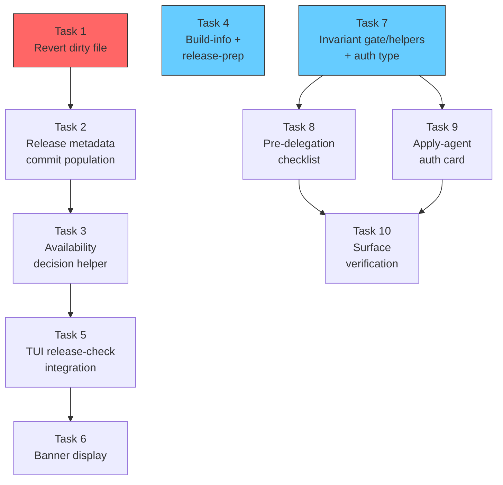

# Tasks: Fix Update/Upgrade Detection and Orchestrator Invariants

## Source

- Spec: `fix-update-upgrade-and-orchestrator-invariants` spec artifact
- Design: `fix-update-upgrade-and-orchestrator-invariants` design artifact
- Capabilities affected: `deck-upgrade-detection`, `release-metadata-resolution`, `orchestrator-modification-authorization` (new), `orchestrator-invariant-enforcement`

## Task Groups

### Group: Incident Disposition

#### Task 1: Revert unauthorized dirty file to clean baseline

**Owner**: General Apply
**Priority**: P0 (blocking)
**Complexity**: Low
**Parallel**: No — must complete before any Track A work on `github-release.ts`
**Depends on**: none

**Description**
Revert `apps/cli/src/upgrade-command/github-release.ts` to its last-committed (clean) state, removing all unauthorized dirty changes (dangling `ReleaseInfo.commit`, descriptor `commit` fields, `target_commitish` additions). This must happen before any intentional re-implementation. Per Git discard protection rules, the apply agent MUST obtain explicit user confirmation before executing `git restore` or equivalent. If user declines destructive git, the agent may rewrite the file to match the committed content instead.

**Files**
- `apps/cli/src/upgrade-command/github-release.ts` — restore to committed state

**Verification**
- `git status` shows the file as clean (no modifications)
- `git diff` against HEAD produces no output for this file
- Existing tests continue to pass

---

### Group: Track A — Release Metadata & Detection

#### Task 2: Release metadata commit population (legacy + descriptor paths)

**Owner**: General Apply
**Priority**: P0 (blocking)
**Complexity**: Medium
**Parallel**: No — depends on Task 1
**Depends on**: Task 1

**Description**
Intentionally add commit metadata population to `github-release.ts`:
1. Extend the local GitHub API payload type to include `target_commitish?: string`.
2. In `buildLegacyReleaseInfo()`: populate `commit` from `target_commitish` when it matches SHA-like pattern (`^[0-9a-f]{7,40}$`); set to `null` when absent, empty, or non-SHA (e.g. branch name `"main"`).
3. In descriptor path (`fetchReleaseDescriptor`): populate commit from descriptor JSON when present and valid; fall back to `target_commitish` when descriptor lacks commit.
4. Add a `normalizeCommit(raw: string | undefined | null): string | null` helper for trim, empty-check, SHA validation.
5. Add comprehensive unit tests covering: SHA target_commitish, branch-name target_commitish (→ null), empty target_commitish (→ null), descriptor commit present, descriptor commit missing with SHA fallback, descriptor commit missing with non-SHA fallback.

Covers: REQ-RM-001, REQ-RM-002, REQ-RM-003, REQ-UD-006

**Files**
- `apps/cli/src/upgrade-command/github-release.ts` — modify (add commit population + normalize helper)
- `apps/cli/src/upgrade-command/release-descriptor.ts` — modify if descriptor schema needs commit field support
- `apps/cli/src/upgrade-command/__tests__/github-release.test.ts` — modify (add metadata population tests)

**Verification**
- Unit tests pass for all target_commitish scenarios (SHA, branch, empty, absent)
- Unit tests pass for descriptor commit + fallback scenarios
- `ReleaseInfo.commit` is `null` for non-SHA inputs, populated string for valid SHA inputs
- Existing tests unchanged and passing

---

#### Task 3: Availability decision helper

**Owner**: General Apply
**Priority**: P0 (blocking)
**Complexity**: Medium
**Parallel**: No — depends on Task 2 (needs commit in ReleaseInfo)
**Depends on**: Task 2

**Description**
Create a pure `decideReleaseAvailability()` helper function that implements the comparison algorithm from the Design:
1. Remote semver greater → `available`, reason `newer-version`
2. Local semver greater → `none`, reason `local-newer`
3. Equal semver + either commit missing/unreliable → `none`, reason `missing-commit`
4. Equal semver + normalized commits equal (including short/full prefix match) → `none`, reason `same-build`
5. Equal semver + both reliable commits differ → `available`, reason `same-version-different-commit`

Also handle dev/non-release builds (e.g. `0.0.0-dev`): semver comparison applies normally, but commit-based same-version detection should not trigger for non-release local versions (REQ-UD-009).

Wire `checkUpgradeAvailable()` and `fetchLatestRelease()` to use this helper. Add comprehensive unit tests covering every scenario from Spec acceptance criteria (all 12 upgrade-detection scenarios).

Covers: REQ-UD-001 through REQ-UD-009

**Files**
- `apps/cli/src/upgrade-command/github-release.ts` — modify (add helper, wire into existing functions)
- `apps/cli/src/upgrade-command/__tests__/github-release.test.ts` — modify (add decision helper tests)

**Verification**
- All Spec acceptance scenarios pass as unit tests
- Existing upgrade path (remote semver greater) unchanged
- Same-version/different-commit returns `available` with commit context
- All missing-commit cases return `none`
- Dev build (`0.0.0-dev`) does not false-positive on commit comparison

---

#### Task 4: Build-info generation and release-prep staleness validation

**Owner**: General Apply
**Priority**: P1
**Complexity**: Medium
**Parallel**: Yes — touches different files (scripts/), independent of Tasks 2-3
**Depends on**: none (independent of Track A detection chain; file scope is `scripts/`)

**Description**
1. Verify/fix `scripts/generate-build-info.ts` to capture actual HEAD commit at generation time (not stale/cached). Add explicit `--commit` override for CI scenarios where HEAD != release commit.
2. Add staleness detection in `scripts/prepare-release.ts`: after generating build-info, verify the commit in `build-info.generated.ts` matches expected HEAD or override; fail with clear message if stale.
3. Add tests for generator: mock `git rev-parse HEAD`, verify output matches. Add tests for prepare-release staleness check.

Covers: REQ-RM-004, REQ-RM-005

**Files**
- `scripts/generate-build-info.ts` — modify (HEAD capture, override support)
- `scripts/prepare-release.ts` — modify (staleness validation)
- Corresponding test files — modify or create

**Verification**
- Generator test: output commit matches mocked HEAD
- Generator test: `--commit` override produces correct output
- Prepare-release test: stale commit detected and reported
- Existing build scripts still function

---

#### Task 5: TUI release-check integration

**Owner**: General Apply
**Priority**: P1
**Complexity**: Medium
**Parallel**: No — depends on Tasks 2, 3
**Depends on**: Task 2, Task 3

**Description**
Integrate commit-aware availability into TUI release-check flow:
1. Modify `runReleaseCheckWithTimeout()` to read `getBuildInfo().commit` alongside version.
2. Update `toReleaseCheckState()` to use `decideReleaseAvailability()` result, propagating availability reason and commit context.
3. Extend `ReleaseCheckState.available` type to carry `reason: "newer-version" | "same-version-different-commit"` and optional `currentCommit`/`latestCommit` fields (additive, backward-compatible).
4. Add TUI integration tests verifying: same-version/different-commit maps to `available` (not `none`), missing commit maps to `none`, remote semver greater maps to `available`.

Covers: REQ-UD-005, REQ-UD-007

**Files**
- `apps/cli/src/tui/release-check.ts` — modify (use local commit, new decision helper, extend state type)
- `apps/cli/src/tui/__tests__/release-check.test.ts` or equivalent — modify (add integration tests)

**Verification**
- Same-version/different-commit → state is `available` with reason `same-version-different-commit`
- Missing commit → state is `none`
- Remote semver greater → state is `available` with reason `newer-version`
- Network error → state is `network-error` (unchanged)

---

#### Task 6: TUI/CLI banner display for same-version updates

**Owner**: General Apply
**Priority**: P1
**Complexity**: Low
**Parallel**: No — depends on Task 5
**Depends on**: Task 5

**Description**
Update TUI banner and CLI upgrade command user-facing copy to distinguish same-version updates from semver upgrades:
1. When `ReleaseCheckState.available.reason === "same-version-different-commit"`, display "New build available for v{version}" (or equivalent per OQ-2 resolution) with commit context.
2. When `reason === "newer-version"`, keep existing "upgrade available" copy.
3. Ensure text distinction is not color-only (accessibility).
4. Add/update tests for banner rendering.

Covers: REQ-UD-007

**Files**
- `apps/cli/src/tui/screens/home-screen.tsx` or banner component — modify (conditional copy)
- `apps/cli/src/tui/screens/home-screen.test.tsx` or equivalent — modify (banner copy tests)
- CLI upgrade command output if applicable — modify

**Verification**
- Banner displays "new build available" (or resolved copy) for same-version updates
- Banner displays "upgrade available" for semver upgrades
- Copy is text-distinguishable without color
- Tests pass for both display modes

---

### Group: Track B — Orchestrator Autonomy Controls

#### Task 7: Orchestrator invariant gate/card helpers and authorization type

**Owner**: General Apply
**Priority**: P0 (blocking)
**Complexity**: Medium
**Parallel**: Yes — fully independent of Track A (Tasks 1-6)
**Depends on**: none

**Description**
Extend `packages/core/src/teams/developer/orchestrator-invariants.ts`:
1. Add `ModificationAuthorization` type as defined in Design (requestClassification, userAuthorizedModification, sddChange, explorerArtifact, proposalArtifact, specArtifact, designArtifact, taskArtifact, allowedTargets, blockedTargets).
2. Add compact gate render helper: `renderDelegationGate(auth: ModificationAuthorization): string` — produces a concise authorization artifact for injection into agent prompts, referencing INV-004 (triage gate) and INV-006 (Explorer-first gate).
3. Add apply-agent authorization card render helper: `renderApplyAuthorizationCard(auth: ModificationAuthorization): string` — includes change name, task IDs, allowed file scope, artifact paths, authorization statement, and refusal instruction.
4. Add unit tests for both render helpers verifying: gate blocks when triage missing, gate blocks when Explorer missing, gate blocks when authorization missing, gate clears when all present; card includes all required fields and refusal instruction.

Covers: REQ-OA-001, REQ-OA-002, REQ-OA-003, REQ-OA-004, REQ-OA-005, REQ-OA-007

**Files**
- `packages/core/src/teams/developer/orchestrator-invariants.ts` — modify (add type + render helpers)
- `packages/core/src/teams/developer/orchestrator-invariants.test.ts` — modify (add gate/card render tests)

**Verification**
- Gate render helper blocks for each missing gate individually
- Gate render helper clears when all gates present
- Authorization card includes refusal instruction
- All existing invariant tests still pass

---

#### Task 8: Orchestrator pre-delegation checklist and automatic-mode text

**Owner**: General Apply
**Priority**: P0 (blocking)
**Complexity**: Medium
**Parallel**: No — depends on Task 7 (uses render helpers)
**Depends on**: Task 7

**Description**
Extend `packages/core/src/teams/developer/orchestrator-content.ts`:
1. Add pre-delegation checklist section that precedes any apply-routing content: (a) classify request, (b) confirm initialized SDD workspace, (c) confirm Explorer-first evidence, (d) confirm required phase artifacts, (e) confirm user authorization, (f) emit blocked outcome if any missing.
2. Add explicit automatic-mode text stating: "Automatic execution mode does NOT bypass triage, Explorer-first investigation, or user authorization requirements."
3. Wire the delegation gate render helper from Task 7 into the orchestrator content composition.
4. Add tests verifying: pre-delegation checklist appears before apply routing in composed output, automatic-mode non-bypass text is present, semantic phrases like "triage must complete" and "Explorer investigation required" appear.

Covers: REQ-OA-001, REQ-OA-002, REQ-OA-004, REQ-OA-006, REQ-OA-007, REQ-OA-009

**Files**
- `packages/core/src/teams/developer/orchestrator-content.ts` — modify (add checklist, auto-mode text)
- `packages/core/src/teams/developer/orchestrator-content.test.ts` — modify (add content ordering/semantic tests)

**Verification**
- Pre-delegation checklist text appears before apply-routing text in composed output
- Automatic-mode non-bypass text is present
- Semantic phrases for INV-004 and INV-006 blocking are present
- Existing orchestrator content tests pass

---

#### Task 9: Apply-agent authorization card injection

**Owner**: General Apply
**Priority**: P0 (blocking)
**Complexity**: Medium
**Parallel**: No — depends on Task 7 (uses card render helper)
**Depends on**: Task 7

**Description**
Inject the apply-agent authorization card into apply-agent prompt/skill surfaces:
1. Locate the canonical apply-agent prompt/body source files (under `packages/core/src/teams/developer/` or installer templates — exact paths to be confirmed by Apply agent).
2. Add the `renderApplyAuthorizationCard()` output as a mandatory section in apply-agent launch prompts.
3. Include instruction that apply agents must refuse modifying work and report `blocked` when authorization card is absent or incomplete.
4. Add tests verifying authorization card and refusal instruction are present in apply-agent surfaces.

Covers: REQ-OA-005, REQ-OA-009

**Files**
- Apply-agent skill/prompt source files (exact paths TBD by Apply agent, likely under `packages/core/src/teams/developer/`) — modify
- Installer template files if applicable — modify
- Corresponding test files — modify

**Verification**
- Authorization card present in apply-agent prompt source
- Refusal instruction present
- Tests pass for card presence and content

**Note**: Exact file paths depend on current installer/template layout. Apply agent should locate canonical source before editing. Flagged as potential blocker if layout is unclear.

---

#### Task 10: Orchestrator surface verification tests

**Owner**: General Apply
**Priority**: P1
**Complexity**: Medium
**Parallel**: No — depends on Tasks 7, 8, 9
**Depends on**: Task 7, Task 8, Task 9

**Description**
Add comprehensive static verification:
1. Extend `orchestrator-invariants.test.ts` to verify `verifyOrchestratorInvariantPresence()` catches missing INV-004 and INV-006 text in all surfaces.
2. Add semantic tests beyond ID presence: verify phrases like "triage must complete before modifying", "Explorer investigation required", "user authorization required" appear in composed prompts.
3. Verify installed/generated prompt surfaces include new invariant gate/card content where test infrastructure can inspect generated output.
4. Verify adapter prompt wrappers (`packages/core/src/orchestrator-prompt.ts`, `packages/adapter-pi/src/orchestrator-prompt.ts`) include composed content if they re-export.

Covers: REQ-OA-008, REQ-OA-009

**Files**
- `packages/core/src/teams/developer/orchestrator-invariants.test.ts` — modify (add semantic verification)
- `packages/core/src/teams/developer/orchestrator-content.test.ts` — modify (add surface coverage)
- Adapter prompt test files if they exist — modify

**Verification**
- Verification catches missing INV-004 text in any surface
- Verification catches missing INV-006 text in any surface
- Semantic phrase tests pass for all required blocking wording
- Installed surface tests pass (or document gap if test infra unavailable)

---

## Dependency Graph

```
Task 1 (revert)
  → Task 2 (release metadata commit population)
    → Task 3 (availability decision helper)
      → Task 5 (TUI release-check integration)
        → Task 6 (banner display)

Task 4 (build-info + release-prep) [independent]

Task 7 (invariant gate helpers + auth type) [independent]
  → Task 8 (pre-delegation checklist)
  → Task 9 (apply-agent card)
  Tasks 8 + 9 → Task 10 (surface verification)
```

## Parallelization Plan

| Phase | Tasks | Can Run in Parallel |
|---|---|---|
| Incident Disposition | Task 1 | No — must be first |
| Track A Metadata | Task 2 | No — after Task 1 |
| Track A Decision | Task 3 | No — after Task 2 |
| Track A Build Scripts | Task 4 | Yes — parallel with Tasks 2, 3, 7 |
| Track A TUI Integration | Task 5 | No — after Tasks 2, 3 |
| Track A Banner | Task 6 | No — after Task 5 |
| Track B Invariant Helpers | Task 7 | Yes — parallel with Tasks 2, 3, 4 |
| Track B Checklist | Task 8 | No — after Task 7 |
| Track B Apply Card | Task 9 | Yes — parallel with Task 8 (both after Task 7) |
| Track B Verification | Task 10 | No — after Tasks 8, 9 |

## Responsibility Contracts

| Contract / Boundary | Owner | Consumers | Notes |
|---|---|---|---|
| `ReleaseInfo.commit` field shape | Task 2 (General Apply) | Tasks 3, 5 | Task 2 defines how commit is populated; Tasks 3+ consume it |
| `decideReleaseAvailability()` return shape | Task 3 (General Apply) | Tasks 5, 6 | Task 3 defines the availability decision contract; Tasks 5+ consume it |
| `ReleaseCheckState` extended type | Task 5 (General Apply) | Task 6 | Task 5 extends the state type; Task 6 renders it |
| `ModificationAuthorization` type | Task 7 (General Apply) | Tasks 8, 9, 10 | Task 7 defines the authorization contract; Tasks 8+ consume it |
| Apply-agent card render output | Task 7 (General Apply) | Task 9 | Task 7 provides the card renderer; Task 9 injects it into surfaces |

## Hidden Coupling

- Tasks 2 and 3 both modify `github-release.ts`. If applied by different agents/sessions, they must coordinate. Recommend same agent/session for both.
- Task 9 file paths depend on installer/template layout discovery. Apply agent must locate canonical source before editing.
- Task 10 may reveal gaps in test infrastructure for installed surfaces; may need test helper creation.

## Complexity Summary

| Complexity | Count | Task Numbers |
|---|---|---|
| Low | 2 | 1, 6 |
| Medium | 8 | 2, 3, 4, 5, 7, 8, 9, 10 |
| High | 0 | — |

## Flagged for Splitting

None — all tasks are scoped for single-session completion. Task 3 (availability decision helper) has many test scenarios but the helper itself is a pure function with bounded complexity.

## Review Workload Forecast

| Signal | Value |
|---|---|
| Estimated changed lines | 400-800 |
| 400-line budget risk | Medium |
| Scope reduction recommended | No |
| Sequential work slices recommended | Yes — Track A and Track B can be reviewed independently |
| Decision needed before Apply | No |

**Rationale**: 10 tasks across ~18 files including tests. Track A adds commit population, a decision helper, and TUI wiring — moderate production code plus substantial test coverage. Track B extends invariant rendering and adds authorization contracts — moderate content/test additions. Total is within 400-800 range. No scope reduction needed, but reviewing Track A and Track B as separate slices prevents reviewer fatigue and allows partial merge if one track completes first.

## Open Questions / Blockers

| ID | Question / Blocker | Classification | Handling |
|---|---|---|---|
| OQ-1 | Is `target_commitish` reliable enough, or should descriptor be sole source? | Allowed-with-placeholder | Design proceeds with both sources; descriptor preferred. Future refinement possible. |
| OQ-2 | Same-version UI label: "update", "upgrade", or "new build available"? | Allowed-with-placeholder | Task 6 uses "new build available" per Design recommendation. Copy is easily swappable. |
| OQ-3 | Local-newer/manual builds: warning, silent, or available-with-context? | Unblocked | Spec says no false-positive; local-newer → `none`. |
| OQ-4 | Structured incident logging for invariant violations? | Allowed-with-placeholder | Not required for first hardening. Future follow-up. |
| OQ-5 | Absorb `orchestrator-invariant-persistence` exploration recommendations? | Unblocked | Tracked separately per Spec Non-Goals. |
| BLK-1 | Task 1 requires destructive Git confirmation from user | Allowed-with-placeholder | Apply agent must follow Git discard protection; user confirms before revert. |
| BLK-2 | Task 9 exact apply-agent source file paths unknown | Allowed-with-placeholder | Apply agent locates canonical source before editing; if unclear, escalates to Orchestrator. |

## Mermaid Summary Source


