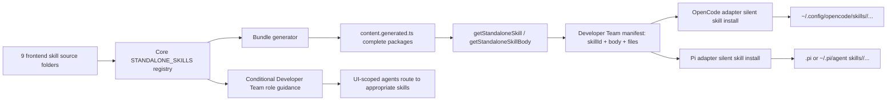

# Design: Frontend External Skills Integration

## Source

- Proposal: `frontend-external-skills-integration` proposal artifact
- Exploration: `frontend-external-skills-integration` exploration artifact
- Capabilities affected:
  - New: `frontend-external-skills`, `runner-skill-installation-parity`
  - Modified: `external-skill-bundling`, `developer-team-role-routing`
  - Unchanged: `runtime-skill-accessors`, `developer-team-role-model`
- Spec status: not yet available; Design is running in parallel with Spec.

## Current Architecture Context

- External standalone skills are defined in `packages/core/src/skills/external/index.ts` through `STANDALONE_SKILLS` entries and exposed by:
  - `getStandaloneSkill(skillId): { SKILL: string; files: Record<string, string> }`
  - `getStandaloneSkillBody(skillId): string`, which delegates to `getStandaloneSkill(skillId).SKILL`.
- The generated bundle lives in `packages/core/src/skills/external/content.generated.ts` and is emitted by `scripts/generate-skill-bundle.ts`.
- The current generated bundle and registry cover 20 standalone skills. The 9 requested frontend skill folders already exist under `packages/core/src/skills/external/` but are not registered or bundled.
- The generator already supports recursive package files and excludes system artifacts such as `:Zone.Identifier` and `._*`; however, it maintains a separate hardcoded `CANONICAL_SKILLS` list, which can drift from `STANDALONE_SKILLS`.
- The canonical Developer Team manifest is built in `packages/core/src/teams/developer/manifest.ts`. It currently serializes standalone skills as `{ skillId, body }`, so support files are lost before adapters install them.
- Runner capability contracts in `packages/core/src/runner-capability.ts` and `packages/core/src/runner-adapter.ts` also model standalone skills as body-only.
- Supported runner adapters with native Developer Team skill installation are:
  - OpenCode: `packages/adapter-opencode/src/developer-team-install.ts`, `runner-adapter.ts`, and `runner-capabilities.ts`.
  - Pi: `packages/adapter-pi/src/developer-team-install.ts`, `runner-adapter.ts`, and `runner-capabilities.ts`.
- `packages/adapter-supermemory` and `packages/adapter-engram` are memory-provider adapters, not runner skill installers.
- OpenCode and Pi install plans currently accept `standaloneSkills?: { skillId, body }[]` and write only `SKILL.md`. Several generic capability paths also classify standalone skills through a hardcoded three-skill list (`judgment-day`, `cognitive-doc-design`, `comment-writer`), which will not scale to 29 skills or multi-file packages.
- Developer Team role content files under `packages/core/src/teams/developer/*-content.ts` contain compact `Follow the ... skill` guidance near the end of each role body. Current frontend guidance includes `frontend-ui-engineering`, but not the 9 new frontend-focused skills.

## Proposed Architecture

Extend the existing standalone external skill architecture rather than introducing a new loader. The core registry remains the canonical source; generated bundles preserve complete packages; manifests and runner adapter install plans carry `SKILL.md` plus support files; supported adapters silently install all registered standalone skills using their existing skill directories.

### Core Registry and Generated Bundles

1. Add the 9 skill IDs to `STANDALONE_SKILLS` in `packages/core/src/skills/external/index.ts`:
   - `ui-skills-root`
   - `frontend-design`
   - `baseline-ui`
   - `fixing-accessibility`
   - `fixing-motion-performance`
   - `fixing-metadata`
   - `web-quality-audit`
   - `playwright-cli`
   - `design-lab`
2. Preserve the existing public accessor contract:
   - `getStandaloneSkill()` returns complete packages.
   - `getStandaloneSkillBody()` remains backward compatible and returns only `SKILL.md` content.
3. Make bundle generation derive its skill IDs from the core standalone registry, or from a small shared internal registry module imported by both `index.ts` and the generator. The architectural constraint is: do not keep an independently maintained generator list that can drift from `STANDALONE_SKILLS`.
4. Regenerate `content.generated.ts` with all 29 registered skills and support files.
5. Preserve package paths with POSIX separators and keep `files` as a map of paths relative to the skill root, excluding `SKILL.md`.

### Complete Package Contract Through Core and Adapters

Extend body-only standalone-skill contracts to carry support files while preserving existing callers:

```ts
type StandaloneSkillInstallInput = {
  skillId: string;
  body: string;                 // SKILL.md content, unchanged
  files?: Record<string, string>; // support files relative to the skill root
};
```

- `files` should be optional at input boundaries for backward compatibility.
- Core-produced manifests should always provide `files`, using `{}` for single-file skills.
- Adapters should treat missing `files` as `{}`.
- `DeveloperTeamInstallFile` can gain optional metadata, such as `kind`, `skillId`, and `packagePath`, to avoid hardcoded standalone-skill ID lists. Existing `{ path, content }` consumers remain valid.

### Adapter Installation Model

Adapters should expand each standalone package into one planned file per package file:

| Runner | Existing skill root | Package expansion |
|---|---|---|
| OpenCode | `~/.config/opencode/skills/<skillId>/` | `SKILL.md` plus every `files[path]` under the same directory |
| Pi native project plan | `<projectRoot>/.pi/skills/<skillId>/` | `SKILL.md` plus every `files[path]` under the same directory |
| Pi runner capability apply path | `~/.pi/agent/skills/<skillId>/` | Preserve existing Pi capability path semantics while writing full packages |

Adapter builders should validate both `skillId` and support-file paths:

- `skillId` must keep the existing safe pattern (`^[a-z0-9_-]+$`, case-insensitive is acceptable if existing behavior keeps it).
- Support-file paths must be relative POSIX paths, must not be absolute, must not contain `..`, and must not escape the skill directory.
- Nested directories must be created recursively before writing files.

### Silent Installation Design

- Installation remains silent and adapter-mediated.
- No new prompt, TUI checkbox, CLI flag, or per-skill opt-in is introduced for the 9 skills.
- Existing install/launch flows that already install standalone external skills should pass full package data and install all registered standalone skills by default.
- Conditional role guidance affects when agents consider or load a skill during work; it does not affect whether the skill is installed.
- If a future runner does not support native skill installation, it must declare that constraint and tests must prove that behavior. Current supported runner skill installers are OpenCode and Pi.

### Component / Module Boundaries

| Component | Responsibility | Change Type |
|---|---|---|
| `packages/core/src/skills/external/index.ts` | Canonical standalone skill registry and accessors | Modified |
| `scripts/generate-skill-bundle.ts` | Deterministic complete-package bundle generator | Modified |
| `packages/core/src/skills/external/content.generated.ts` | Generated standalone skill package data | Modified, generated |
| `packages/core/src/teams/developer/manifest.ts` | Runner-neutral Developer Team manifest | Modified |
| `packages/core/src/runner-capability.ts` | Runner-neutral manifest/install contracts | Modified, backward compatible |
| `packages/core/src/runner-adapter.ts` | Adapter install input contract | Modified, backward compatible |
| `packages/adapter-opencode/src/developer-team-install.ts` | OpenCode native plan/apply/verify/backup for skill files | Modified |
| `packages/adapter-opencode/src/runner-adapter.ts` | OpenCode class adapter bridge | Modified |
| `packages/adapter-opencode/src/runner-capabilities.ts` | OpenCode capability facade and generic apply/backup paths | Modified |
| `packages/adapter-pi/src/developer-team-install.ts` | Pi native plan/apply/verify/backup for skill files | Modified |
| `packages/adapter-pi/src/runner-adapter.ts` | Pi class adapter bridge | Modified |
| `packages/adapter-pi/src/runner-capabilities.ts` | Pi capability facade and generic apply/backup paths | Modified |
| `packages/core/src/teams/developer/*-content.ts` | Role-aware skill guidance | Modified selectively |
| `apps/cli/src/opencode-launch-command.ts` | Direct OpenCode launch/install entry point | Modified |
| `apps/cli/src/pi-launch-command.ts` | Direct Pi launch/install entry point when it refreshes team install | Modified if needed to pass full packages |

## Data Flow

1. Source skill package exists under `packages/core/src/skills/external/<skillId>/`.
2. `STANDALONE_SKILLS` registers `<skillId>` as a standalone external skill.
3. `scripts/generate-skill-bundle.ts` walks the registered skill directory, reads `SKILL.md` and support files, and writes `content.generated.ts`.
4. Core accessors return either:
   - full bundle: `{ SKILL, files }`, or
   - legacy body: `SKILL` only.
5. `buildDeveloperTeamManifest()` and direct launch/install entry points convert each bundle into `{ skillId, body: SKILL, files }`.
6. OpenCode and Pi adapter builders expand each package into runner-native planned files.
7. Adapter apply functions silently write `SKILL.md` and support files under the runner's native skills directory.
8. Adapter verification, backup, and rollback include standalone package files, not only agent-bound skills.

## API / Contract Implications

| Endpoint / Interface | Change | Backward Compatible |
|---|---|---|
| `getStandaloneSkill(skillId)` | Adds 9 resolvable skill IDs; return shape unchanged | Yes |
| `getStandaloneSkillBody(skillId)` | Adds 9 resolvable skill IDs; behavior unchanged | Yes |
| `DeveloperTeamManifestStandaloneSkill` | Add optional `files?: Record<string, string>`; core emits `{}` when no support files exist | Yes |
| `DeveloperTeamAdapterInstallInput.standaloneSkills` | Add optional `files?: Record<string, string>` | Yes |
| `DeveloperTeamInstallFile` | May add optional metadata for kind/skill/package path to remove hardcoded ID classification | Yes |
| Adapter native planned standalone file types | Represent expanded package files instead of only `SKILL.md` | Partial; internal adapter contract changes require tests |

## State / Persistence Implications

- No database, schema, or durable application state changes.
- Generated source artifact changes: `content.generated.ts`.
- Runner installs write additional files under existing runner skill directories during normal install/launch flows.
- No registry files are written in this phase because registry mode is deferred.

## Migration / Backward Compatibility

- Existing skill IDs and accessors remain valid.
- Existing body-only callers remain valid because `files` is optional at input boundaries and defaults to `{}`.
- Existing installed runner skill directories are updated idempotently on the next Deck install/launch flow.
- Existing generated bundle aliases (`STANDALONE_SKILL_BUNDLES` and `SKILL_BUNDLES`) remain unchanged.
- No data migration is required.
- Script file executable bits are not added to the bundle contract in this change. Current architecture stores text content only; preserving path and content is sufficient for existing standalone skill package behavior. A future file-mode metadata contract can be designed separately if a supported runner requires executable-bit preservation.

## Role-Impact Design

### Role Matrix

| Skill | Primary role impact | Conditional role impact | Injection rule |
|---|---|---|---|
| `ui-skills-root` | `orchestrator`, `explorer`, `task`, `apply-frontend`, `review`, `verify` | `proposal`, `design`, `spec` when UI scope exists | Router for UI work; use before choosing narrower UI skills, not as a reason to load every UI skill. |
| `frontend-design` | `design`, `apply-frontend`, `review` | `explorer`, `proposal`, `spec`, `task` for new visual surfaces or visual identity | Use for distinctive visual direction, pages, and components with identity. |
| `baseline-ui` | `apply-frontend`, `review`, `verify` | `design`, `task` for polish scope | Use for spacing, hierarchy, typography, states, and small cleanup. |
| `fixing-accessibility` | `apply-frontend`, `review`, `verify` | `design`, `spec`, `task` for interactive UI | Use for forms, buttons, dialogs, tabs, dropdowns, focus, ARIA, and keyboard behavior. |
| `fixing-motion-performance` | `apply-frontend`, `review`, `verify` | `design`, `task` for animation-heavy work | Use only when motion, transitions, scrolling, or animation performance are in scope. |
| `fixing-metadata` | `apply-frontend`, `review`, `verify` | `spec`, `design`, `task` for new pages/routes | Use for title/meta, canonical, Open Graph, Twitter cards, JSON-LD, and robots directives. |
| `web-quality-audit` | `review`, `verify` | `orchestrator`, `task`, `apply-frontend` near predeploy/global audit | Audit/predeploy skill; do not make it daily implementation guidance. |
| `playwright-cli` | `apply-frontend`, `verify`, `review` | `explorer` for reproductions/screenshots; `task` for browser QA tasks | Use for real-browser checks, screenshots, forms, navigation, local state, and UI regression evidence. |
| `design-lab` | `explorer`, `design` | `orchestrator`, `proposal` for major redesign intake | Heavy redesign exploration with variants; avoid default apply guidance. |

### Injection / Routing Rules

- Add compact role-specific guidance near existing external skill guidance in affected `*-content.ts` files.
- Prefer one small frontend-routing block per role over repeating all skill descriptions verbatim.
- Do not add these skills to backend-only or archive roles unless a future proposal expands their responsibilities.
- `apply-frontend` should receive the strongest day-to-day guidance for `ui-skills-root`, `frontend-design`, `baseline-ui`, `fixing-accessibility`, `fixing-motion-performance`, `fixing-metadata`, and `playwright-cli`.
- `review` and `verify` should receive audit/QA guidance for `baseline-ui`, `fixing-accessibility`, `fixing-motion-performance`, `fixing-metadata`, `web-quality-audit`, and `playwright-cli`.
- `explorer` and `design` should mention `design-lab` only for substantial redesigns needing variants or structured exploration.
- `proposal`, `spec`, and `task` should use conditional planning wording, not implementation/audit-heavy wording.
- Prompt tests should verify both presence of intended conditional guidance and absence of heavy default guidance where inappropriate, especially `design-lab` and `web-quality-audit` in routine apply flows.

## File Impact Estimate

| File / Path | Action | Rationale |
|---|---|---|
| `packages/core/src/skills/external/index.ts` | Modify | Add 9 `STANDALONE_SKILLS` entries and preserve public accessors. |
| `scripts/generate-skill-bundle.ts` | Modify | Derive bundle list from the canonical registry or shared registry module; keep recursive package bundling. |
| `packages/core/src/skills/external/content.generated.ts` | Modify, generated | Regenerate all 29 complete skill bundles. |
| `packages/core/src/skills/external/index.test.ts` | Modify | Update expected count to 29 and assert new skill availability. |
| `packages/core/src/skills/external/__tests__/content.test.ts` | Modify | Assert complete packages and representative support files. |
| `packages/core/src/runner-capability.ts` | Modify | Add package-file support to runner-neutral standalone skill/install types. |
| `packages/core/src/runner-adapter.ts` | Modify | Add package-file support to adapter install input type. |
| `packages/core/src/teams/developer/manifest.ts` | Modify | Emit `{ skillId, body, files }` for standalone skills. |
| `packages/core/src/teams/developer/manifest.test.ts` | Modify | Assert manifest includes 29 standalone skills and package files. |
| `packages/core/src/teams/developer/{orchestrator,explorer,proposal,spec,design,task,apply-frontend,review,verify}-content.ts` | Modify | Add role-aware conditional frontend skill guidance. |
| `packages/core/src/teams/developer/{orchestrator,explorer,proposal,spec,design,task,apply-frontend,review,verify}-content.test.ts` | Modify | Assert routing guidance presence and bounded heavy-skill usage. |
| `packages/core/src/teams/developer/no-op-skill-absence.test.ts` | Modify only if needed | Keep old no-op guarantees; do not classify the 9 requested skills as absent by accident. |
| `apps/cli/src/opencode-launch-command.ts` | Modify | Pass complete standalone packages into OpenCode install plans silently. |
| `apps/cli/src/pi-launch-command.ts` | Modify if needed | Ensure direct Pi launch refresh paths pass complete standalone packages when they build install plans. |
| `packages/adapter-opencode/src/developer-team-install.ts` | Modify | Expand packages, validate paths, write/verify/backup standalone package files. |
| `packages/adapter-opencode/src/runner-adapter.ts` | Modify | Preserve package files in generic runner install plans. |
| `packages/adapter-opencode/src/runner-capabilities.ts` | Modify | Remove hardcoded standalone ID classification and preserve packages in capability paths. |
| `packages/adapter-opencode/src/developer-team-install.test.ts` | Modify | Assert silent full-package plan/apply/verify/backup behavior. |
| `packages/adapter-opencode/src/runner-capabilities.test.ts` | Modify | Assert capability path parity for the 9 new skills and support files. |
| `packages/adapter-pi/src/developer-team-install.ts` | Modify | Expand packages, validate paths, write/verify/backup standalone package files. |
| `packages/adapter-pi/src/runner-adapter.ts` | Modify | Preserve package files in generic runner install plans. |
| `packages/adapter-pi/src/runner-capabilities.ts` | Modify | Remove hardcoded standalone ID classification and preserve packages in capability paths. |
| `packages/adapter-pi/src/developer-team-install.test.ts` | Modify | Assert silent full-package plan/apply/verify/backup behavior. |
| `packages/adapter-pi/src/runner-capabilities.test.ts` | Modify | Assert capability path parity for the 9 new skills and support files. |
| `docs/skills-integration-roadmap.md` | Unchanged by default | Treat as historical/reconstructed roadmap unless a separate documentation decision says it is current inventory. |

## Testing Strategy

- Core external skill tests:
  - Registry count is 29.
  - All 9 new skill IDs resolve via `getStandaloneSkill()` and `getStandaloneSkillBody()`.
  - Representative support files exist in bundles:
    - `frontend-design/LICENSE.txt`
    - `web-quality-audit/scripts/analyze.sh`
    - `design-lab/DESIGN_PRINCIPLES.md`
    - several `playwright-cli/references/*.md` files.
  - No system artifacts are bundled.
- Generator tests/checks:
  - Generated keys match `STANDALONE_SKILLS` exactly.
  - Running the generator is deterministic and idempotent.
- Core manifest tests:
  - Manifest standalone skill count is 29.
  - Manifest includes `files` for multi-file skills and `{}` for single-file skills.
- Adapter tests for OpenCode and Pi:
  - Native build plans include all 29 standalone skills.
  - Package support files are planned under the correct runner skill directory.
  - Apply writes nested support files without user interaction.
  - Verify fails on missing/stale support files and passes exact content matches.
  - Backup/rollback include standalone package files.
  - Generic runner capability paths do not rely on the old three-skill hardcoded list.
- Developer Team prompt tests:
  - Affected roles include expected conditional guidance.
  - Backend/general/archive roles remain free from irrelevant frontend-skill bloat.
  - `design-lab` and `web-quality-audit` are not made default daily apply guidance.
- Runner parity tests:
  - OpenCode and Pi expose/install all 9 new skill IDs through supported install paths.
  - Multi-file package preservation is asserted through both native adapter plans and runner capability facades.
- Final verification commands:
  - Targeted: `bun test packages/core/src/skills/external packages/core/src/teams/developer packages/adapter-opencode/src packages/adapter-pi/src --timeout 30000`
  - Full: `bun test --timeout 30000`

## Observability / Error Handling

- Keep existing `SkillLookupError` behavior for missing skill IDs.
- Generator should fail loudly if a registered skill directory or `SKILL.md` is missing.
- Adapter builders should fail fast on invalid `skillId` or unsafe support-file paths.
- Adapter verification should perform exact content checks for standalone package files, matching existing exact-match verification for generated role skill files.
- No new runtime telemetry or logging is required.

## Security / Performance / Accessibility Considerations

- Security: support-file path validation is required to prevent path traversal during runner installation.
- Performance: prompt changes must remain conditional and compact to avoid unnecessary role prompt bloat. Installation adds small text files only and should remain idempotent.
- Accessibility: `fixing-accessibility` and `web-quality-audit` improve frontend quality coverage, but this change only distributes and routes skills; it does not change product UI directly.

## Tradeoffs

| Decision | Chosen | Rejected Alternative | Rationale |
|---|---|---|---|
| Skill-loading architecture | Extend existing standalone registry and bundle accessors | Add a new frontend-specific loader | Existing architecture already supports complete packages and backward-compatible body access. |
| Generator source of truth | Derive generated bundle list from core registry or shared registry module | Maintain a second hardcoded generator list | Prevents drift between registered and bundled skills. |
| Installation default | Install all registered standalone skills silently | Add per-skill prompt/opt-in | User explicitly requires silent behavior matching existing external skills. |
| Role awareness | Conditional role-specific guidance | Add all 9 skills unconditionally to every role | Avoids prompt bloat and heavy-skill overuse. |
| Adapter package preservation | Expand package files into runner-native skill directories | Install only `SKILL.md` | Multi-file skills require references/scripts/license files to remain usable. |
| Script permissions | Preserve content/path only | Add file-mode metadata now | Current bundle contract is text-only and existing script skills use shell invocation; file modes can be a future contract if needed. |
| Generic runner plan classification | Optional metadata or registry-derived classification | Hardcode standalone skill IDs in adapters | Hardcoded lists already drifted and cannot scale to 29 skills. |

## Risks

| Risk | Likelihood | Impact | Mitigation |
|---|---|---|---|
| Adapter code still writes only `SKILL.md` on one path | Medium | High | Add multi-file plan/apply tests for OpenCode and Pi native and capability paths. |
| Hardcoded standalone ID lists remain in generic apply/backup paths | Medium | High | Replace with metadata or registry-derived classification and assert all 9 new IDs. |
| Prompt bloat weakens role routing | Medium | Medium | Use compact conditional guidance and tests for heavy-skill boundaries. |
| Generated bundle churn obscures review | Medium | Medium | Regenerate deterministically and verify key set/file content rather than hand-editing. |
| Support-file path traversal bug | Low | High | Validate file paths before planning/writing package files. |
| Pi path semantics are inconsistent between project `.pi` plans and `~/.pi/agent` capability apply | Medium | Medium | Preserve existing Pi path behavior while asserting full package structure under whichever `skillsDir` each path uses. |
| File-mode expectations for scripts emerge later | Low | Low/Medium | Document that this change preserves content/path only; design file-mode metadata separately if a runner requires it. |

## Open Decisions

- Whether to implement generator single-source behavior by direct import from `index.ts` or by extracting a small internal standalone-skill definition module. The architectural requirement is decided: the generator must not maintain a divergent independent skill list.
- Whether to update `docs/skills-integration-roadmap.md` in this change. Design recommends leaving it unchanged because it reads as a historical reconstructed roadmap, not current inventory.

## Dependencies

- Existing source folders for the 9 skills under `packages/core/src/skills/external/`.
- Existing OpenCode and Pi Developer Team install mechanisms.
- Existing Bun test infrastructure.

## Sequencing

1. Update core registry and generator source-of-truth behavior.
2. Regenerate `content.generated.ts` and update core external skill tests.
3. Extend core manifest and runner contracts to carry support files.
4. Update OpenCode adapter native and capability paths for full-package planning/apply/verify/backup.
5. Update Pi adapter native and capability paths for full-package planning/apply/verify/backup.
6. Update direct launch/install entry points that build standalone skill inputs.
7. Add role-specific Developer Team guidance and prompt tests.
8. Run targeted tests, generator idempotence check, then full test suite.

## Rollback

- Revert the 9 `STANDALONE_SKILLS` entries.
- Regenerate `content.generated.ts` from the reverted registry.
- Revert manifest/runner contract additions if no other code depends on them, or keep optional `files` support if already useful and backward compatible.
- Revert adapter package-file expansion and parity tests.
- Revert Developer Team prompt guidance additions.
- Re-run targeted external skill, Developer Team prompt, adapter, and full Bun tests.
- No database or data migration rollback is required. Previously installed runner skill files are code/config artifacts and will be overwritten by the next Deck install from the reverted registry.

## Mermaid Summary Source



## Next Steps

Ready for Task (`deck-developer-task`) to combine this Design with Spec and break the change into implementation tasks.
