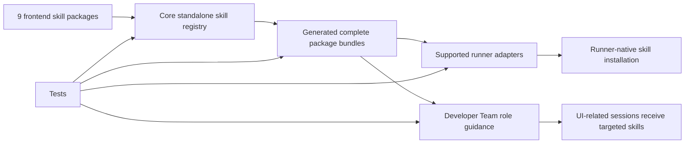

# Proposal: Frontend External Skills Integration

## Summary

- Integrate 9 frontend-focused external skill packages into Deck's standalone external skill registry and generated bundles.
- Preserve the existing external-skill architecture: `packages/core/src/skills/external/`, `STANDALONE_SKILLS`, generated bundle content, `getStandaloneSkill()`, and backward-compatible `getStandaloneSkillBody()`.
- Add targeted Developer Team role guidance so UI-related sessions can access the right frontend skills without making heavy tools default for routine work.
- Explicitly include adapter-mediated installation/distribution so supported runner adapters receive complete bundled skill packages with parity expectations.
- Avoid changing runtime skill-loading semantics, adding new Developer Team roles, or rewriting external skill source content unless a packaging defect is found.

## Problem Statement

The repository already contains source folders for the 9 requested frontend-focused skills, but Deck does not currently expose them through the official external-skill integration path. They are absent from `STANDALONE_SKILLS`, absent from generated top-level bundle content, and absent from Developer Team role guidance. If the change only updates core registration, supported runner adapters may still fail to install or distribute the skills consistently, leaving sessions without the intended frontend capabilities.

## Intent

Extend Deck's frontend capability by making the 9 external frontend skills available as complete packages, visible to appropriate Developer Team roles, and installable through supported runner adapters using the same pattern as prior external skill integrations.

## Goal

Deck exposes all 9 frontend-focused external skills as complete standalone packages across core and supported runner adapters, with role-aware guidance that brings the skills into UI-related Developer Team sessions.

## Proposed Scope

### In Scope

- Register these 9 skills as standalone external skills:
  - `ui-skills-root`
  - `frontend-design`
  - `baseline-ui`
  - `fixing-accessibility`
  - `fixing-motion-performance`
  - `fixing-metadata`
  - `web-quality-audit`
  - `playwright-cli`
  - `design-lab`
- Regenerate external skill bundle content so all 9 packages include `SKILL.md` and supporting files where present.
- Preserve existing accessor behavior for `getStandaloneSkill()` and `getStandaloneSkillBody()`.
- Update external skill tests for the expected registry increase from 20 to 29 and for representative multi-file package completeness.
- Add targeted Developer Team role guidance and prompt tests for UI-related skill routing.
- Include adapter-mediated runner installation/distribution behavior and compatibility/parity tests for supported runners.
- Update documentation only if Design confirms there is a current maintained skill-inventory document that should reflect this second frontend-focused wave.

### Explicit Adapter/Runner Installation Scope

- The canonical source of installed external skills remains `@deck/core` standalone skill registry and generated package bundle data.
- Supported runner adapters must receive/install the bundled skill packages through their adapter-specific skill installation paths, preserving package structure rather than only `SKILL.md` text.
- Adapter behavior must not assume a single runner. Supported runners should either:
  - install all registered standalone external skills that the runner supports, or
  - explicitly declare a runner capability constraint and test the resulting behavior.
- Tests should prove runner parity for at least:
  - all 9 skill identifiers being visible to supported adapter installation flows,
  - complete package file preservation for multi-file skills such as `playwright-cli`, `design-lab`, `frontend-design`, and `web-quality-audit`,
  - compatibility with the existing external-skill installation path used by earlier integrated skills,
  - no regression in adapters that do not support native skill installation.
- Exact adapter file names and supported-runner inventory are Design-phase details; the proposal scope requires adapter-aware installation coverage, not core-only registration.

### Role-Impact Scope

| Skill | Role impact direction |
|---|---|
| `ui-skills-root` | Strong router for UI-related work in `orchestrator`, `explorer`, `task`, `apply-frontend`, `review`, and `verify`; conditional in `proposal`, `design`, and `spec` when UI scope exists. |
| `frontend-design` | Strong for `design`, `apply-frontend`, and `review` when visual identity or new page/component creation is in scope; conditional for earlier planning roles. |
| `baseline-ui` | Strong for `apply-frontend`, `review`, and `verify` on spacing, hierarchy, typography, basic states, and polish work. |
| `fixing-accessibility` | Strong for `apply-frontend`, `review`, and `verify` on forms, buttons, dialogs, tabs, dropdowns, focus, ARIA, and keyboard behavior. |
| `fixing-motion-performance` | Conditional for animation, transition, scroll, and motion-performance work, strongest in frontend apply/review/verify roles. |
| `fixing-metadata` | Conditional for new pages/routes and metadata/social SEO work, strongest in frontend apply/review/verify roles and relevant planning roles. |
| `web-quality-audit` | Audit/predeploy skill for `review` and `verify`; avoid default daily implementation guidance. |
| `playwright-cli` | Browser QA skill for `apply-frontend`, `verify`, and `review`; conditional in `explorer` for reproductions and screenshots. |
| `design-lab` | Heavy redesign/exploration skill for `explorer` and `design`; avoid default apply guidance. |

## Non-Goals

- Do not implement code in the Proposal phase.
- Do not introduce a new runtime skill-loading mechanism.
- Do not add new Developer Team roles.
- Do not rewrite or materially edit external skill source content unless a packaging defect prevents registration or bundling.
- Do not make heavy tools such as `design-lab` or `web-quality-audit` default for every frontend task.
- Do not scope the change to one runner only; adapter behavior must account for supported runner compatibility/parity.
- Do not define detailed acceptance scenarios or implementation tasks in this phase.

## Affected Capabilities

### New Capabilities

- `frontend-external-skills`: Deck exposes the 9 frontend-focused skill packages as standalone external skills.
- `runner-skill-installation-parity`: Supported runner adapters install/distribute bundled external skill packages consistently from the core registry.

### Modified Capabilities

- `external-skill-bundling`: Existing standalone skill registration and generated bundles expand from the prior external skill set to include the 9 frontend packages.
- `developer-team-role-routing`: Developer Team role prompts gain conditional frontend skill guidance based on UI scope and phase responsibility.

### Unchanged Capabilities

- `runtime-skill-accessors`: `getStandaloneSkill()` and `getStandaloneSkillBody()` semantics remain unchanged except for availability of additional skill IDs.
- `developer-team-role-model`: Existing roles remain intact; only their guidance changes.

## Impacted Files / Areas

| Area | Expected impact |
|---|---|
| `packages/core/src/skills/external/index.ts` | Add 9 `STANDALONE_SKILLS` entries; expected total becomes 29. |
| `packages/core/src/skills/external/content.generated.ts` | Regenerate generated package bundles for all registered skills. |
| `scripts/generate-skill-bundle.ts` | Verify current generator handles the new multi-file/script packages; change only if required for package completeness. |
| `packages/core/src/skills/external/index.test.ts` | Update skill count and new skill resolution assertions. |
| `packages/core/src/skills/external/__tests__/content.test.ts` | Add bundle completeness assertions for representative multi-file frontend skills. |
| `packages/core/src/teams/developer/*-content.ts` | Add targeted, role-specific frontend skill guidance. |
| `packages/core/src/teams/developer/*-content.test.ts` and related prompt invariant tests | Update expected prompt guidance and absence/presence invariants. |
| Runner capability/parity registry areas in `@deck/core` | Ensure supported-runner capability expectations include bundled skill package installation where applicable. |
| `packages/adapter-*/` skill installation paths | Ensure supported adapters receive/install the complete bundled packages consistently. |
| Adapter/core parity tests | Prove supported runners expose/install the 9 skills and preserve package files. |
| `docs/skills-integration-roadmap.md` | Optional update if the document is maintained as current inventory rather than historical record. |

## Approach

1. Extend the existing standalone external skill registry with the 9 skill IDs and their source folders.
2. Regenerate generated bundle content using the existing generator, preserving complete package files.
3. Add focused tests for registry count, accessor behavior, multi-file package completeness, and generator determinism.
4. Add conditional Developer Team role guidance based on the role-impact matrix, keeping heavy/audit skills scoped to redesign, exploration, audit, or predeploy contexts.
5. Update supported runner adapters and capability/parity tests so the new bundled packages are installed/distributed through adapter-native skill installation flows.

## Alternatives and Tradeoffs

| Alternative | Why Considered | Why Not Chosen |
|---|---|---|
| Core-only registration and bundle regeneration | Minimal change to expose `getStandaloneSkill()` in source/core contexts. | Insufficient because supported runner adapters may not install/distribute the new packages; violates explicit runner compatibility scope. |
| Add all 9 skills to every Developer Team role unconditionally | Ensures broad visibility. | Creates prompt bloat and makes heavy tools default for routine work. |
| Create a new frontend skill-loading mechanism | Could isolate frontend packages from existing skills. | Prior architecture already supports complete external packages; new mechanism adds unnecessary complexity and compatibility risk. |
| Defer adapter parity to a later change | Reduces initial implementation scope. | Leaves sessions on supported runners inconsistent and fails the user-confirmed requirement. |

## Risks and Mitigations

| Risk | Likelihood | Mitigation |
|---|---:|---|
| Role prompt bloat weakens skill routing discipline. | Medium | Use conditional wording and reserve `design-lab`/`web-quality-audit` for redesign/audit/predeploy contexts. |
| Supported runner adapters drift from the core registry. | Medium | Add adapter/capability parity tests that assert all 9 IDs are visible to supported installation flows. |
| Multi-file skills lose support files during generation or adapter install. | Medium | Add representative file assertions for `playwright-cli`, `design-lab`, `frontend-design`, and `web-quality-audit`. |
| Generated artifact churn obscures meaningful review. | Medium | Regenerate deterministically and include generator idempotence checks. |
| Script file behavior differs across runners. | Low/Medium | Verify script files are preserved; Design should decide whether executable mode is required or shell invocation is sufficient. |
| Unknown supported-runner inventory causes incomplete parity coverage. | Medium | Design must identify current supported adapters and map tests to each supported runner or declared non-support behavior. |

## Rollback Plan

- Revert the 9 new `STANDALONE_SKILLS` entries.
- Regenerate `content.generated.ts` from the reverted registry so the generated bundle returns to the prior external skill set.
- Revert Developer Team prompt guidance additions and corresponding prompt tests.
- Revert adapter/capability parity changes that install or expose the 9 new frontend skill packages.
- Re-run targeted external skill, Developer Team prompt, adapter parity, and typecheck tests to confirm the prior behavior is restored.
- No data migration rollback is required because this change affects bundled code/configuration and generated artifacts only.

## Dependencies

- Existing source folders under `packages/core/src/skills/external/` for the 9 skills.
- Existing standalone external skill registration and bundle generation architecture.
- Supported runner adapter installation mechanisms and capability/parity test infrastructure.
- Current Developer Team role content and prompt invariant tests.

## Open Questions

- Which runner adapters are currently considered supported for native skill installation, and what are their exact install paths/tests?
- Should `docs/skills-integration-roadmap.md` be updated as current inventory, or preserved as historical documentation only?
- Does `web-quality-audit/scripts/analyze.sh` require executable permission preservation, or is preserving file content/path sufficient for all supported runners?
- Should adapter installation include all standalone external skills by default, or should any runner capability explicitly filter skills?
- What exact prompt wording should distinguish `ui-skills-root` as mandatory for UI-related work while avoiding automatic loading of every downstream UI skill?

## Success Criteria

- [ ] All 9 listed skills resolve through `getStandaloneSkill()` with complete package data.
- [ ] `getStandaloneSkillBody()` continues to return `SKILL.md` text for existing and new skills.
- [ ] Generated bundle content includes the new skills and representative supporting files.
- [ ] External skill registry tests reflect the expected total of 29 standalone skills.
- [ ] Developer Team role guidance covers the role-impact matrix without making heavy audit/redesign skills default for routine tasks.
- [ ] Supported runner adapter tests prove installation/distribution parity for the 9 bundled packages.
- [ ] Generator idempotence, targeted prompt tests, adapter parity tests, and TypeScript checks pass.

## Acceptance Direction

- Spec should formalize requirements for package registration, package completeness, role-aware routing, and adapter parity across supported runners.
- Design should identify the exact adapter files, runner capability registry touch points, and prompt-test updates required to satisfy the scope without broad architectural rewrites.

## Next Steps

Ready for Spec (`deck-developer-spec`) and Design (`deck-developer-design`) in parallel.

## Mermaid Summary Source

