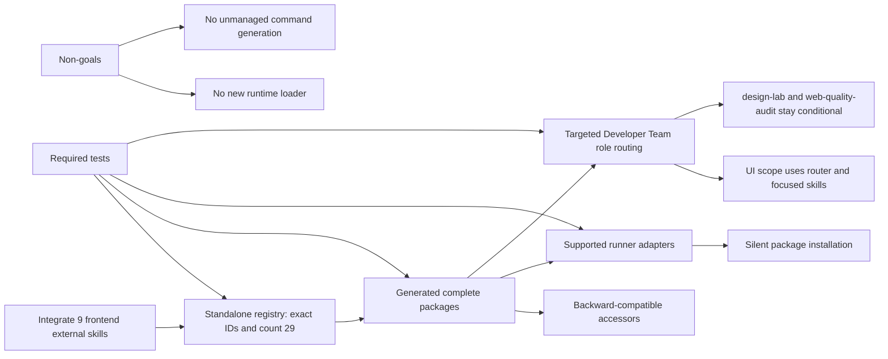

# Spec: Frontend External Skills Integration

## Source

- Change ID: `frontend-external-skills-integration`
- Proposal: `openspec/changes/frontend-external-skills-integration/proposal.md`
- Exploration: `openspec/changes/frontend-external-skills-integration/exploration.md`
- Capabilities affected: `frontend-external-skills`, `external-skill-bundling`, `runner-skill-installation-parity`, `developer-team-role-routing`, `runtime-skill-accessors`, `developer-team-role-model`

## Requirements

### Capability: Frontend External Skill Registry

REQ-SKILLS-001: Deck MUST register all 9 frontend-focused external skills as standalone external skills: `ui-skills-root`, `frontend-design`, `baseline-ui`, `fixing-accessibility`, `fixing-motion-performance`, `fixing-metadata`, `web-quality-audit`, `playwright-cli`, and `design-lab`.
  Priority: MUST
  Surface: Integration
  Rationale: The user goal requires these exact skills to be available through the same official external-skill path as prior external skills.

REQ-SKILLS-002: The standalone external skill inventory MUST expose 29 registered skills after this change, reflecting the previous 20 plus the 9 frontend skills.
  Priority: MUST
  Surface: Data
  Rationale: Count-based tests prevent partial registration and accidental omissions.

REQ-SKILLS-003: Each new frontend skill MUST be addressable by its exact public skill identifier, and duplicate or renamed identifiers MUST NOT be introduced.
  Priority: MUST
  Surface: Integration
  Rationale: Developer Team routing, adapter installation, and users depend on stable skill IDs.

### Capability: Generated Bundle and Package Completeness

REQ-BUNDLE-001: Generated standalone skill bundle data MUST include `SKILL.md` content for each of the 9 frontend skills.
  Priority: MUST
  Surface: Data
  Rationale: A standalone skill is unusable without its primary instruction document.

REQ-BUNDLE-002: Generated bundle data MUST preserve supporting files for multi-file frontend skill packages, including representative package files for `playwright-cli`, `design-lab`, `frontend-design`, and `web-quality-audit`.
  Priority: MUST
  Surface: Data
  Rationale: Prior external skill behavior supports complete packages, not only `SKILL.md` text.

REQ-BUNDLE-003: Bundle generation SHOULD be deterministic: regenerating from unchanged inputs SHOULD produce no semantically different bundle output.
  Priority: SHOULD
  Surface: Data
  Rationale: Determinism keeps generated artifact review and release validation reliable.

REQ-BUNDLE-004: The change MUST NOT materially rewrite external skill source content unless a packaging defect prevents registration, bundling, or installation.
  Priority: MUST
  Surface: General
  Rationale: The scope is integration of existing skills, not content redesign.

### Capability: Runtime Skill Accessors

REQ-ACCESS-001: `getStandaloneSkill()` MUST resolve each of the 9 new skill IDs and return complete package data containing the skill body and available supporting files.
  Priority: MUST
  Surface: API
  Rationale: This is the primary existing complete-package accessor.

REQ-ACCESS-002: `getStandaloneSkillBody()` MUST continue to return `SKILL.md` text for existing skills and MUST return `SKILL.md` text for each new frontend skill.
  Priority: MUST
  Surface: API
  Rationale: Existing callers that use the backward-compatible body-only accessor must not regress.

REQ-ACCESS-003: Unknown-skill behavior for standalone skill accessors MUST remain consistent with pre-change behavior.
  Priority: MUST
  Surface: API
  Rationale: Adding new skills must not change error contracts for unsupported IDs.

### Capability: Silent Runner Adapter Installation and Distribution

REQ-ADAPTER-001: Supported runner adapters MUST install or distribute the 9 new frontend skill packages through the same adapter-mediated external-skill installation path used by existing external skills.
  Priority: MUST
  Surface: Integration
  Rationale: The user explicitly requires installation/distribution through supported runner adapters, not core-only visibility.

REQ-ADAPTER-002: Installation of the new external skills MUST be silent and consistent with existing external skills: it MUST NOT require a per-skill user confirmation, manual copy instruction, or interactive prompt.
  Priority: MUST
  Surface: Integration
  Rationale: The latest user constraint requires silent installation behavior.

REQ-ADAPTER-003: Supported runner adapters MUST preserve package structure for installed/distributed multi-file skills rather than installing only `SKILL.md` text.
  Priority: MUST
  Surface: Integration
  Rationale: Multi-file skills require supporting files to function as packaged capabilities.

REQ-ADAPTER-004: Each supported runner adapter MUST either expose/install all registered standalone external skills it supports or declare and test a runner capability constraint for non-support.
  Priority: MUST
  Surface: Integration
  Rationale: Parity expectations must be explicit and testable across supported runners.

REQ-ADAPTER-005: Adapters that do not support native skill installation MUST NOT regress existing behavior and MUST report or preserve their non-support behavior consistently with current runner capability semantics.
  Priority: MUST
  Surface: Integration
  Rationale: The change must account for supported-runner compatibility without forcing unsupported runners into broken installs.

### Capability: Developer Team Role Awareness and Routing

REQ-ROUTING-001: Developer Team role guidance MUST make the 9 frontend skills available to relevant roles according to UI scope and phase responsibility.
  Priority: MUST
  Surface: General
  Rationale: The skills must be considered for Developer Team role awareness and routing.

REQ-ROUTING-002: `ui-skills-root` MUST be treated as the primary router for UI-related work, without forcing downstream UI skills into every non-UI or routine task.
  Priority: MUST
  Surface: General
  Rationale: Router-based guidance provides awareness without prompt bloat.

REQ-ROUTING-003: `design-lab` MUST be scoped to heavy redesign or exploration contexts and MUST NOT become default daily implementation guidance.
  Priority: MUST
  Surface: General
  Rationale: The proposal identifies `design-lab` as heavy and not a daily default.

REQ-ROUTING-004: `web-quality-audit` MUST be scoped to audit, predeploy, or broad quality review contexts and MUST NOT become default daily implementation guidance.
  Priority: MUST
  Surface: General
  Rationale: The proposal identifies `web-quality-audit` as audit/predeploy-focused.

REQ-ROUTING-005: Role guidance SHOULD remain concise and targeted, adding enough routing awareness to trigger the right skill while avoiding broad prompt bloat.
  Priority: SHOULD
  Surface: General
  Rationale: Over-broad prompt additions weaken routing discipline.

### Capability: Test and Verification Coverage

REQ-TEST-001: Tests MUST assert the standalone skill count, exact names, and successful resolution for all 9 new frontend skills.
  Priority: MUST
  Surface: General
  Rationale: Registration must be protected by automated coverage.

REQ-TEST-002: Tests MUST assert bundle/package completeness for representative multi-file skills, including `playwright-cli`, `design-lab`, `frontend-design`, and `web-quality-audit`.
  Priority: MUST
  Surface: General
  Rationale: Multi-file package loss is a known risk.

REQ-TEST-003: Tests MUST cover adapter-mediated installation/distribution behavior for supported runners, including silent installation and package-file preservation where the runner supports native skills.
  Priority: MUST
  Surface: General
  Rationale: Adapter parity is in scope and must not be left implicit.

REQ-TEST-004: Tests MUST cover Developer Team role guidance so relevant roles mention appropriate frontend skills and heavy/audit skills are not promoted as default guidance for routine work.
  Priority: MUST
  Surface: General
  Rationale: Role-awareness behavior is externally observed through generated role prompts.

REQ-TEST-005: Verification SHOULD include generator idempotence and project type checks after generated bundle and prompt changes.
  Priority: SHOULD
  Surface: General
  Rationale: Generated bundle changes and prompt updates can create broad type or snapshot regressions.

### Capability: Non-Destructive Behavior and Scope Constraints

REQ-SCOPE-001: This change MUST NOT introduce a new runtime skill-loading mechanism.
  Priority: MUST
  Surface: General
  Rationale: Existing external-skill architecture is the intended integration path.

REQ-SCOPE-002: This change MUST NOT add, remove, or rename Developer Team roles.
  Priority: MUST
  Surface: General
  Rationale: Only role guidance changes are in scope.

REQ-SCOPE-003: This change MUST NOT generate, install, or manage unmanaged command files, including SDD command files, as a side effect of external skill installation.
  Priority: MUST
  Surface: Integration
  Rationale: External skill installation must remain limited to supported skill package distribution and must avoid unrelated command generation.

REQ-SCOPE-004: This change MUST NOT require destructive file operations or deletion of user-owned files during installation, generation, or adapter distribution.
  Priority: MUST
  Surface: Permission
  Rationale: Skill integration should be additive and non-destructive.

REQ-SCOPE-005: Documentation updates MAY occur only when the target document is confirmed to be a maintained current inventory rather than historical documentation.
  Priority: MAY
  Surface: General
  Rationale: The proposal leaves roadmap documentation status unresolved.

## Acceptance Scenarios

### Capability: Frontend External Skill Registry

#### Scenario: All requested frontend skills are registered
**Given** Deck's standalone external skill inventory is available after the change
**When** the inventory is inspected
**Then** it contains exactly the 9 requested frontend skill IDs and reports 29 total standalone external skills
> Covers: REQ-SKILLS-001, REQ-SKILLS-002, REQ-SKILLS-003

#### Scenario: Skill identifiers remain exact and unique
**Given** the standalone external skill inventory includes the new frontend skills
**When** the inventory is checked for duplicate IDs or alternate renamed IDs
**Then** each requested frontend skill appears once under its exact requested identifier and no duplicate alias is introduced
> Covers: REQ-SKILLS-003

### Capability: Generated Bundle and Package Completeness

#### Scenario: Every new frontend skill has a generated primary skill body
**Given** generated standalone skill bundle data has been refreshed
**When** each of the 9 new skill bundles is inspected
**Then** each bundle contains non-empty `SKILL.md` content
> Covers: REQ-BUNDLE-001

#### Scenario: Multi-file skill packages preserve support files
**Given** generated standalone skill bundle data has been refreshed
**When** representative multi-file skills are inspected
**Then** `playwright-cli`, `design-lab`, `frontend-design`, and `web-quality-audit` preserve their expected package support files with paths and content available to installation flows
> Covers: REQ-BUNDLE-002

#### Scenario: Bundle generation is stable
**Given** bundle inputs have not changed since the last generation
**When** bundle generation is run again
**Then** the resulting generated bundle has no semantically different changes
> Covers: REQ-BUNDLE-003

#### Scenario: External source content is not rewritten unnecessarily
**Given** existing frontend skill source packages are already valid for packaging
**When** the change is implemented
**Then** source instruction content is not materially rewritten as part of the integration
> Covers: REQ-BUNDLE-004

### Capability: Runtime Skill Accessors

#### Scenario: Complete-package accessor resolves new frontend skills
**Given** the standalone registry and generated bundle include the 9 frontend skills
**When** `getStandaloneSkill()` is called with each new skill ID
**Then** it returns complete package data with `SKILL.md` content and any available supporting files
> Covers: REQ-ACCESS-001

#### Scenario: Body-only accessor remains backward compatible
**Given** existing and new standalone skills are registered
**When** `getStandaloneSkillBody()` is called for an existing skill and for each new frontend skill
**Then** it returns the corresponding `SKILL.md` text without requiring callers to consume package-file data
> Covers: REQ-ACCESS-002

#### Scenario: Unknown skill error behavior is unchanged
**Given** a skill ID is not registered
**When** a standalone skill accessor is called with that unknown ID
**Then** the observable error or empty-result behavior matches pre-change behavior
> Covers: REQ-ACCESS-003

### Capability: Silent Runner Adapter Installation and Distribution

#### Scenario: Supported adapters silently install frontend skill packages
**Given** a supported runner adapter installs external skills from Deck's standalone skill registry
**When** installation or distribution is executed after this change
**Then** the 9 frontend skills are included through the existing adapter-mediated path without per-skill confirmation, manual copy instructions, or interactive prompts
> Covers: REQ-ADAPTER-001, REQ-ADAPTER-002

#### Scenario: Adapter installs complete multi-file packages
**Given** a supported runner adapter supports native skill package installation
**When** it installs or distributes the new frontend skills
**Then** multi-file skills retain package structure and support files rather than being reduced to `SKILL.md` only
> Covers: REQ-ADAPTER-003

#### Scenario: Runner capability constraints are explicit
**Given** a supported runner cannot install one or more native skill packages
**When** adapter behavior is tested
**Then** the runner declares and tests its capability constraint instead of silently omitting the skill or failing unpredictably
> Covers: REQ-ADAPTER-004, REQ-ADAPTER-005

#### Scenario: Existing external skill installation behavior does not regress
**Given** previously integrated external skills are already installed or distributed by a supported adapter
**When** the adapter includes the 9 new frontend skills
**Then** existing external skills continue to be installed or distributed through the same supported path
> Covers: REQ-ADAPTER-001, REQ-ADAPTER-005

### Capability: Developer Team Role Awareness and Routing

#### Scenario: UI-scoped roles receive targeted frontend skill awareness
**Given** Developer Team role guidance is generated or inspected for UI-related phases
**When** roles such as orchestration, exploration, task planning, frontend apply, review, and verify handle UI scope
**Then** the guidance makes relevant frontend skills available according to the role-impact matrix
> Covers: REQ-ROUTING-001

#### Scenario: UI router guidance avoids prompt bloat
**Given** a role prompt may encounter UI-related work
**When** the prompt guidance references frontend skill selection
**Then** `ui-skills-root` is positioned as a router for UI tasks and downstream UI skills are not loaded or recommended unconditionally for non-UI work
> Covers: REQ-ROUTING-002, REQ-ROUTING-005

#### Scenario: Heavy redesign skill is not default apply guidance
**Given** a routine frontend implementation task does not require large redesign exploration
**When** Developer Team apply guidance is inspected
**Then** `design-lab` is not presented as default daily implementation guidance
> Covers: REQ-ROUTING-003, REQ-ROUTING-005

#### Scenario: Web quality audit skill is reserved for audit/predeploy use
**Given** a routine frontend implementation task is not a broad audit or predeploy quality review
**When** Developer Team apply guidance is inspected
**Then** `web-quality-audit` is not presented as default daily implementation guidance
> Covers: REQ-ROUTING-004, REQ-ROUTING-005

### Capability: Test and Verification Coverage

#### Scenario: Registry and accessor tests protect the new inventory
**Given** automated tests for standalone external skills are run
**When** the tests inspect counts, names, and accessor results
**Then** they fail if any requested frontend skill is missing, renamed, duplicated, or unresolvable
> Covers: REQ-TEST-001, REQ-ACCESS-001, REQ-ACCESS-002

#### Scenario: Bundle tests protect package completeness
**Given** automated bundle tests are run
**When** they inspect representative multi-file frontend skills
**Then** they fail if expected support files are missing from generated bundle data
> Covers: REQ-TEST-002, REQ-BUNDLE-002

#### Scenario: Adapter tests prove silent parity behavior
**Given** supported runner adapter tests are run
**When** they exercise external skill installation or distribution
**Then** they prove the 9 new skills are visible, installed silently where supported, and preserve package files where native package installation is supported
> Covers: REQ-TEST-003, REQ-ADAPTER-001, REQ-ADAPTER-002, REQ-ADAPTER-003, REQ-ADAPTER-004

#### Scenario: Role prompt tests protect targeted guidance
**Given** Developer Team prompt tests are run
**When** they inspect role guidance
**Then** they prove relevant roles mention appropriate frontend skills and heavy/audit tools are not defaulted for routine work
> Covers: REQ-TEST-004, REQ-ROUTING-001, REQ-ROUTING-003, REQ-ROUTING-004, REQ-ROUTING-005

#### Scenario: Generated and typed surfaces verify cleanly
**Given** generated bundle and prompt updates are complete
**When** generator idempotence checks and project type checks are run
**Then** they complete without regressions attributable to this change
> Covers: REQ-TEST-005, REQ-BUNDLE-003

### Capability: Non-Destructive Behavior and Scope Constraints

#### Scenario: Existing skill-loading mechanism is reused
**Given** the new frontend skills are integrated
**When** runtime skill loading is inspected from outside the accessor contract
**Then** the existing standalone external-skill mechanism remains the integration path and no new runtime loader is required
> Covers: REQ-SCOPE-001

#### Scenario: Developer Team role model is preserved
**Given** Developer Team role guidance has been updated
**When** the role inventory is inspected
**Then** no Developer Team roles have been added, removed, or renamed as part of this change
> Covers: REQ-SCOPE-002

#### Scenario: No unmanaged command generation occurs
**Given** runner adapter installation or Developer Team installation is executed
**When** the new frontend skills are installed or distributed
**Then** no unmanaged command files, including SDD command files, are generated, installed, or modified as a side effect
> Covers: REQ-SCOPE-003

#### Scenario: Installation is additive and non-destructive
**Given** a user has existing files or previously installed skills
**When** the new frontend skills are installed or distributed through supported adapters
**Then** the process does not delete user-owned files or require destructive file operations
> Covers: REQ-SCOPE-004

#### Scenario: Optional documentation update is gated by document status
**Given** an optional skill roadmap or inventory document exists
**When** the implementation considers documentation updates
**Then** the document is updated only if confirmed to be maintained current inventory, and otherwise remains unchanged
> Covers: REQ-SCOPE-005

## Validation Rules

| Field / Input | Rule | Error Message | REQ-ID |
|---|---|---|---|
| Skill ID list | MUST contain exactly the 9 requested frontend skill IDs using exact spelling. | Missing, extra, renamed, or duplicate frontend skill ID. | REQ-SKILLS-001, REQ-SKILLS-003 |
| Standalone skill count | MUST be 29 after registration. | Unexpected standalone skill count. | REQ-SKILLS-002 |
| Skill package | MUST include non-empty `SKILL.md`. | Skill package is missing primary skill content. | REQ-BUNDLE-001 |
| Multi-file package | MUST preserve expected supporting files for representative multi-file skills. | Skill package support files are incomplete. | REQ-BUNDLE-002, REQ-ADAPTER-003 |
| Adapter install flow | MUST be silent for these skills, matching existing external skills. | External skill installation requires unsupported manual or interactive action. | REQ-ADAPTER-002 |
| Runner support declaration | MUST either install supported skills or declare/test non-support. | Runner skill installation support is ambiguous or untested. | REQ-ADAPTER-004, REQ-ADAPTER-005 |
| Role guidance | MUST be relevant to UI scope and phase responsibility. | Role guidance is missing, unconditional, or overly broad. | REQ-ROUTING-001, REQ-ROUTING-005 |
| Command generation | MUST NOT generate or manage unrelated command files. | External skill integration attempted unmanaged command generation. | REQ-SCOPE-003 |

## Error Contracts

| Condition | Error Code | Message | Status |
|---|---|---|---|
| Unknown standalone skill ID requested | Preserve existing accessor error code/type | Preserve existing unknown-skill message | N/A |
| Registered skill package lacks `SKILL.md` | `INCOMPLETE_SKILL_PACKAGE` | Skill package is incomplete. | Build/test failure |
| Multi-file package loses expected support files | `INCOMPLETE_SKILL_PACKAGE_FILES` | Skill package support files are incomplete. | Build/test failure |
| Adapter omits a supported skill without declaring non-support | `RUNNER_SKILL_PARITY_FAILURE` | Runner adapter skill installation parity failed. | Test failure |
| Installation requires per-skill interaction | `NON_SILENT_SKILL_INSTALL` | External skill installation must be silent. | Test failure |
| Role guidance defaults heavy/audit skills for routine work | `PROMPT_ROUTING_SCOPE_FAILURE` | Developer Team role guidance is too broad. | Test failure |
| Unmanaged command generation attempted | `UNMANAGED_COMMAND_GENERATION` | External skill integration must not generate unmanaged commands. | Test failure |

## States and Transitions

| State | Description | Entry Criteria |
|---|---|---|
| Source-present | Frontend skill source packages exist in the repository. | Existing source folders are present before integration. |
| Registered | The 9 skill IDs are available in the standalone external skill inventory. | Registry exposes exact IDs and total count is 29. |
| Bundled | Generated package data contains `SKILL.md` and preserved support files. | Bundle generation completes and package completeness tests pass. |
| Adapter-installable | Supported runner adapters can install/distribute the packages silently or declare tested non-support. | Adapter parity tests pass. |
| Role-aware | Developer Team role guidance contains targeted UI-skill routing. | Prompt guidance tests pass. |
| Verified | Required registry, bundle, adapter, prompt, idempotence, and type checks pass. | Verification suite completes without change-related regressions. |

| From | To | Trigger | Side Effects |
|---|---|---|---|
| Source-present | Registered | Standalone skill inventory is updated. | The 9 IDs become resolvable by inventory tests. |
| Registered | Bundled | Bundle data is regenerated. | Complete package data becomes available for accessors and adapters. |
| Bundled | Adapter-installable | Supported adapter installation/distribution paths consume bundled packages. | Runner installations receive complete packages silently where supported. |
| Bundled | Role-aware | Developer Team guidance is updated. | UI-related roles can route to appropriate frontend skills. |
| Adapter-installable + Role-aware | Verified | Required tests and checks pass. | Change is ready for implementation verification. |

## Out of Scope / Non-Goal Constraints

- Implementing a new runtime skill-loading mechanism is out of scope.
- Adding, removing, or renaming Developer Team roles is out of scope.
- Rewriting external skill source content is out of scope unless a packaging defect requires a minimal corrective change.
- Making `design-lab` or `web-quality-audit` default for every frontend task is out of scope.
- Limiting the change to one runner adapter is out of scope.
- Requiring explicit user action per new skill install is out of scope; installation must remain silent.
- Generating or managing unrelated command files is out of scope.

## Open Questions

- Which runner adapters are currently considered supported for native skill installation, and what are their exact install/distribution paths and tests?
- Should `docs/skills-integration-roadmap.md` be updated as current inventory, or preserved as historical documentation only?
- Does `web-quality-audit/scripts/analyze.sh` require executable permission preservation, or is preserving file content/path sufficient for all supported runners?
- Should adapter installation include all standalone external skills by default, or should any runner capability explicitly filter skills?
- What exact prompt wording best distinguishes `ui-skills-root` as the UI router while avoiding automatic loading of every downstream UI skill?

## Compliance Matrix

| REQ-ID | Scenario(s) | Status |
|---|---|---|
| REQ-SKILLS-001 | All requested frontend skills are registered | Defined |
| REQ-SKILLS-002 | All requested frontend skills are registered | Defined |
| REQ-SKILLS-003 | All requested frontend skills are registered; Skill identifiers remain exact and unique | Defined |
| REQ-BUNDLE-001 | Every new frontend skill has a generated primary skill body | Defined |
| REQ-BUNDLE-002 | Multi-file skill packages preserve support files | Defined |
| REQ-BUNDLE-003 | Bundle generation is stable; Generated and typed surfaces verify cleanly | Defined |
| REQ-BUNDLE-004 | External source content is not rewritten unnecessarily | Defined |
| REQ-ACCESS-001 | Complete-package accessor resolves new frontend skills; Registry and accessor tests protect the new inventory | Defined |
| REQ-ACCESS-002 | Body-only accessor remains backward compatible; Registry and accessor tests protect the new inventory | Defined |
| REQ-ACCESS-003 | Unknown skill error behavior is unchanged | Defined |
| REQ-ADAPTER-001 | Supported adapters silently install frontend skill packages; Existing external skill installation behavior does not regress | Defined |
| REQ-ADAPTER-002 | Supported adapters silently install frontend skill packages; Adapter tests prove silent parity behavior | Defined |
| REQ-ADAPTER-003 | Adapter installs complete multi-file packages; Adapter tests prove silent parity behavior | Defined |
| REQ-ADAPTER-004 | Runner capability constraints are explicit; Adapter tests prove silent parity behavior | Defined |
| REQ-ADAPTER-005 | Runner capability constraints are explicit; Existing external skill installation behavior does not regress | Defined |
| REQ-ROUTING-001 | UI-scoped roles receive targeted frontend skill awareness; Role prompt tests protect targeted guidance | Defined |
| REQ-ROUTING-002 | UI router guidance avoids prompt bloat | Defined |
| REQ-ROUTING-003 | Heavy redesign skill is not default apply guidance; Role prompt tests protect targeted guidance | Defined |
| REQ-ROUTING-004 | Web quality audit skill is reserved for audit/predeploy use; Role prompt tests protect targeted guidance | Defined |
| REQ-ROUTING-005 | UI router guidance avoids prompt bloat; Heavy redesign skill is not default apply guidance; Web quality audit skill is reserved for audit/predeploy use; Role prompt tests protect targeted guidance | Defined |
| REQ-TEST-001 | Registry and accessor tests protect the new inventory | Defined |
| REQ-TEST-002 | Bundle tests protect package completeness | Defined |
| REQ-TEST-003 | Adapter tests prove silent parity behavior | Defined |
| REQ-TEST-004 | Role prompt tests protect targeted guidance | Defined |
| REQ-TEST-005 | Generated and typed surfaces verify cleanly | Defined |
| REQ-SCOPE-001 | Existing skill-loading mechanism is reused | Defined |
| REQ-SCOPE-002 | Developer Team role model is preserved | Defined |
| REQ-SCOPE-003 | No unmanaged command generation occurs | Defined |
| REQ-SCOPE-004 | Installation is additive and non-destructive | Defined |
| REQ-SCOPE-005 | Optional documentation update is gated by document status | Defined |

## Mermaid Summary Source

