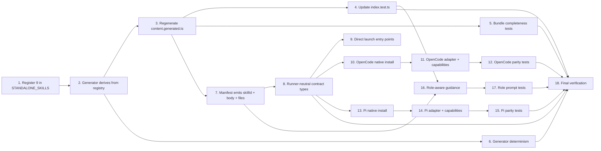

# Tasks: Frontend External Skills Integration

## Source

- Spec: `openspec/changes/frontend-external-skills-integration/spec.md`
- Design: `openspec/changes/frontend-external-skills-integration/design.md`
- Proposal: `openspec/changes/frontend-external-skills-integration/proposal.md`
- Exploration: `openspec/changes/frontend-external-skills-integration/exploration.md`
- Capabilities affected:
  - New: `frontend-external-skills`, `runner-skill-installation-parity`
  - Modified: `external-skill-bundling`, `developer-team-role-routing`
  - Unchanged: `runtime-skill-accessors`, `developer-team-role-model`

## Goal

Register the 9 frontend-focused external skills as standalone external skills, regenerate complete package bundles, expose them through the existing accessor contract, distribute them silently through supported runner adapters (OpenCode and Pi), and add conditional Developer Team role guidance so UI-scoped agents can route to the right skills without making heavy/audit tools default for routine work.

## Sequencing Summary (from Design §Sequencing)

1. Core registry + generator source-of-truth alignment.
2. Regenerate bundles + core external-skill tests.
3. Extend core manifest and runner-neutral contracts.
4. Update OpenCode adapter native and capability paths.
5. Update Pi adapter native and capability paths.
6. Update direct launch/install entry points.
7. Add role-aware Developer Team guidance + prompt tests.
8. Targeted tests, generator idempotence, then full Bun test suite.

## Task Groups

### Group A — Shared: Core Registry and Generator Source-of-Truth

#### Task 1: Register the 9 frontend skills in `STANDALONE_SKILLS`

**Owner**: General Apply
**Priority**: P0
**Complexity**: Low
**Parallel**: No — blocks every downstream task
**Depends on**: none

**Description**
Add the 9 frontend-focused skill IDs to the canonical `STANDALONE_SKILLS` list in `packages/core/src/skills/external/index.ts`. Each entry keeps the existing `{ skillId, sourcePath }` shape and points at the existing source folder under `packages/core/src/skills/external/<skillId>/`. Do not modify or rewrite the source content under those folders.

**Files**
- `packages/core/src/skills/external/index.ts` — modify (add 9 entries)
- `packages/core/src/skills/external/{ui-skills-root,frontend-design,baseline-ui,fixing-accessibility,fixing-motion-performance,fixing-metadata,web-quality-audit,playwright-cli,design-lab}/` — unchanged

**Verification**
- Total `STANDALONE_SKILLS` length equals 29 (20 prior + 9 new).
- Public accessor signatures `getStandaloneSkill()` and `getStandaloneSkillBody()` are unchanged.

---

#### Task 2: Make the bundle generator derive its skill list from the canonical registry

**Owner**: General Apply
**Priority**: P0
**Complexity**: Medium
**Parallel**: No — depends on Task 1
**Depends on**: Task 1

**Description**
Refactor `scripts/generate-skill-bundle.ts` so that the skill IDs it emits are derived from the canonical standalone-skill registry instead of a hardcoded `CANONICAL_SKILLS` list. Implementation may either import `STANDALONE_SKILLS` directly from `packages/core/src/skills/external/index.ts` or from a small internal registry module imported by both files. Preserve the existing recursive walk, system-artifact exclusions (`:Zone.Identifier`, `._*`), POSIX path separators, and `SKILL.md`-first ordering. Do not change the bundle output shape beyond what is required for package completeness.

**Files**
- `scripts/generate-skill-bundle.ts` — modify (derive skill IDs from registry)
- `packages/core/src/skills/external/index.ts` — possibly modify (export `STANDALONE_SKILLS` consumable from the generator) or no change if an internal module is introduced

**Verification**
- Generated keys are exactly the union of `STANDALONE_SKILLS` IDs.
- Running the generator twice without input changes produces identical output (byte-for-byte or semantically equivalent).
- The generator fails loudly if a registered directory is missing or has no `SKILL.md`.

---

#### Task 3: Regenerate `content.generated.ts` for all 29 complete packages

**Owner**: General Apply
**Priority**: P0
**Complexity**: Low
**Parallel**: No — depends on Task 2
**Depends on**: Task 2

**Description**
Run the generator from Task 2 to (re)emit `packages/core/src/skills/external/content.generated.ts` so it contains all 29 standalone skills with `SKILL.md` content and `files` maps preserving supporting files for the multi-file packages (`playwright-cli`, `design-lab`, `frontend-design`, `web-quality-audit`). Do not hand-edit the generated file.

**Files**
- `packages/core/src/skills/external/content.generated.ts` — modify, generated

**Verification**
- `content.generated.ts` contains all 29 skill IDs and the same top-level bundle aliases are preserved.
- Each of the 4 multi-file skills retains at least its known support files (e.g. `frontend-design/LICENSE.txt`, `web-quality-audit/scripts/analyze.sh`, `design-lab/DESIGN_PRINCIPLES.md`, and several `playwright-cli/references/*.md`).
- No system artifacts (`:Zone.Identifier`, `._*`) leak into the bundle.

---

### Group B — Shared: Core External Skill Tests

#### Task 4: Update `packages/core/src/skills/external/index.test.ts` for count and new skill resolution

**Owner**: General Apply
**Priority**: P0
**Complexity**: Low
**Parallel**: No — depends on Task 3
**Depends on**: Task 3

**Description**
Update the existing external skill registry test to expect 29 standalone skills and assert that each of the 9 new IDs (`ui-skills-root`, `frontend-design`, `baseline-ui`, `fixing-accessibility`, `fixing-motion-performance`, `fixing-metadata`, `web-quality-audit`, `playwright-cli`, `design-lab`) is present, unique, and resolvable through both `getStandaloneSkill()` and `getStandaloneSkillBody()`. Unknown-skill error behavior must remain consistent with pre-change behavior.

**Files**
- `packages/core/src/skills/external/index.test.ts` — modify

**Verification**
- Test fails if any of the 9 IDs is missing, renamed, duplicated, or unresolvable.
- Unknown-skill error contract test still passes.
- `getStandaloneSkillBody()` returns non-empty `SKILL.md` text for each new ID.

---

#### Task 5: Add bundle/package completeness assertions for multi-file skills

**Owner**: General Apply
**Priority**: P0
**Complexity**: Medium
**Parallel**: Yes — touches a different test file
**Depends on**: Task 3

**Description**
Update `packages/core/src/skills/external/__tests__/content.test.ts` to assert that generated bundle data preserves the expected supporting files for the representative multi-file skills (`playwright-cli`, `design-lab`, `frontend-design`, `web-quality-audit`) and that single-file skills expose empty `files` maps. Include an assertion that no system artifacts are bundled.

**Files**
- `packages/core/src/skills/external/__tests__/content.test.ts` — modify

**Verification**
- Tests fail if any expected multi-file support file path or content is missing.
- Single-file skills assert `files` is `{}` (or empty object equivalent).
- Generator idempotence check is included or referenced.

---

#### Task 6: Generator determinism and integrity check

**Owner**: General Apply
**Priority**: P1
**Complexity**: Low
**Parallel**: Yes — verification-only task
**Depends on**: Task 2

**Description**
Add a lightweight check (test or script invocation in CI/verification path) that runs the generator from a clean state and confirms idempotence: running it twice without input changes produces no semantic differences in `content.generated.ts`. Reuse existing test infrastructure where possible.

**Files**
- `scripts/generate-skill-bundle.ts` — unchanged
- `packages/core/src/skills/external/__tests__/content.test.ts` or new test file — modify/create

**Verification**
- Running the generator twice produces an unchanged `content.generated.ts`.
- The check fails loudly if any registered directory is missing `SKILL.md`.

---

### Group C — Shared: Core Manifest and Runner-Neutral Contracts

#### Task 7: Extend core manifest to emit `{ skillId, body, files }`

**Owner**: General Apply
**Priority**: P0
**Complexity**: Medium
**Parallel**: No — depends on Task 3; blocks adapter work
**Depends on**: Task 3

**Description**
Update `packages/core/src/teams/developer/manifest.ts` so the `standaloneSkills` payload it produces for the runner-neutral Developer Team manifest carries `{ skillId, body, files }` for every registered skill. `files` is always populated; use `{}` when the package has no support files. Keep the existing surface stable and additive.

**Files**
- `packages/core/src/teams/developer/manifest.ts` — modify
- `packages/core/src/teams/developer/manifest.test.ts` — modify (assert 29 skills, presence of `files` for multi-file skills, `{}` for single-file skills)

**Verification**
- Manifest reports 29 standalone skills.
- Each entry has `skillId`, `body`, and `files` keys.
- Multi-file skills have non-empty `files`; single-file skills have `files === {}`.

---

#### Task 8: Extend runner-neutral install contract types to carry support files

**Owner**: General Apply
**Priority**: P0
**Complexity**: Medium
**Parallel**: No — depends on Task 7
**Depends on**: Task 7

**Description**
Extend the runner-neutral contracts in `packages/core/src/runner-capability.ts` and `packages/core/src/runner-adapter.ts` so standalone skill install inputs and capabilities can carry optional `files?: Record<string, string>`. Mark the new fields optional and treat missing `files` as `{}` inside adapters. Optionally add metadata (e.g. `kind`, `skillId`, `packagePath`) to `DeveloperTeamInstallFile` so adapters can stop hardcoding standalone-skill ID classification. Existing body-only callers and serialized shapes must remain valid.

**Files**
- `packages/core/src/runner-capability.ts` — modify
- `packages/core/src/runner-adapter.ts` — modify

**Verification**
- Type signatures compile with existing callers still valid.
- Adapters treating `files` as `{}` when absent do not regress existing single-file behavior.

---

#### Task 9: Update direct launch/install entry points to pass complete packages

**Owner**: General Apply
**Priority**: P1
**Complexity**: Low
**Parallel**: Yes — separate entry points
**Depends on**: Task 8

**Description**
Ensure direct launch/install entry points that build standalone skill inputs from bundles pass complete `{ skillId, body, files }` data into the adapter install paths. Specifically check and update `apps/cli/src/opencode-launch-command.ts` and `apps/cli/src/pi-launch-command.ts` so they forward the full package data when they build install plans. If a launch path already delegates to adapter builders and Task 11/15 will handle it, leave a comment and skip.

**Files**
- `apps/cli/src/opencode-launch-command.ts` — modify if needed
- `apps/cli/src/pi-launch-command.ts` — modify if needed

**Verification**
- Entry points either pass complete packages or delegate to adapter builders that do.
- No new prompt, TUI checkbox, CLI flag, or per-skill opt-in is introduced.

---

### Group D — Adapter: OpenCode (silent, complete-package installation)

#### Task 10: Update OpenCode native install to expand full packages

**Owner**: Backend Apply
**Priority**: P0
**Complexity**: Medium
**Parallel**: No — depends on Task 8; blocks OpenCode tests
**Depends on**: Task 8

**Description**
Update `packages/adapter-opencode/src/developer-team-install.ts` so the native plan/apply/verify/backup pipeline expands each standalone package into one planned file per package file (one for `SKILL.md`, one per entry in `files`), writing them under `~/.config/opencode/skills/<skillId>/`. Validate `skillId` against the existing safe pattern; validate every support-file path as relative POSIX, non-absolute, no `..`, and not escaping the skill directory. Create nested directories recursively before writing. Make apply, verify (exact content match), and backup include the full package set. Keep changes additive: existing single-file skill behavior must remain valid.

**Files**
- `packages/adapter-opencode/src/developer-team-install.ts` — modify

**Verification**
- Plan output lists every expected package file per skill for the 9 new skills.
- Apply writes all package files without any prompt or interactive step.
- Verify fails on missing/stale support files and passes on exact content match.
- Backup/rollback include the full package files.

---

#### Task 11: Update OpenCode adapter bridge and capability facade

**Owner**: Backend Apply
**Priority**: P0
**Complexity**: Medium
**Parallel**: No — depends on Task 10
**Depends on**: Task 10

**Description**
Update `packages/adapter-opencode/src/runner-adapter.ts` and `packages/adapter-opencode/src/runner-capabilities.ts` so the class adapter bridge and the capability facade preserve package files in their install plans. Replace hardcoded three-skill standalone classification with metadata- or registry-derived classification so the path scales to 29 skills. Generic apply/backup paths must continue to work for single-file skills and now also handle multi-file packages.

**Files**
- `packages/adapter-opencode/src/runner-adapter.ts` — modify
- `packages/adapter-opencode/src/runner-capabilities.ts` — modify

**Verification**
- All 29 standalone skill IDs flow through capability apply/backup without hardcoded filtering.
- Multi-file packages keep their support files end-to-end.

---

#### Task 12: OpenCode adapter parity and silent-install tests

**Owner**: Backend Apply
**Priority**: P0
**Complexity**: Medium
**Parallel**: No — depends on Tasks 10 and 11
**Depends on**: Tasks 10, 11

**Description**
Update or add tests under `packages/adapter-opencode/src/`:
- `developer-team-install.test.ts`: assert that native plans include all 29 standalone skills, that package support files are planned under `~/.config/opencode/skills/<skillId>/...`, that apply writes nested files without user interaction, and that verify/backup cover the full package set.
- `runner-capabilities.test.ts`: assert capability path parity for the 9 new skill IDs and that support files are preserved.
- Add a non-regression test ensuring that no unmanaged command files (including SDD command files) are generated as a side effect of standalone skill installation.

**Files**
- `packages/adapter-opencode/src/developer-team-install.test.ts` — modify
- `packages/adapter-opencode/src/runner-capabilities.test.ts` — modify

**Verification**
- Tests fail if any of the 9 new IDs is missing from native plans or capability paths.
- Tests fail if expected support files are missing or if installation requires any user interaction.
- No unmanaged command files are emitted.

---

### Group E — Adapter: Pi (silent, complete-package installation)

#### Task 13: Update Pi native install to expand full packages

**Owner**: Backend Apply
**Priority**: P0
**Complexity**: Medium
**Parallel**: No — depends on Task 8; blocks Pi tests
**Depends on**: Task 8

**Description**
Update `packages/adapter-pi/src/developer-team-install.ts` similarly to Task 10 for Pi native plan/apply/verify/backup. Pi has two skill roots in scope: `<projectRoot>/.pi/skills/<skillId>/` for the native project plan and `~/.pi/agent/skills/<skillId>/` for the runner capability apply path. Preserve existing Pi path semantics while expanding packages into full file sets at whichever `skillsDir` each path uses. Apply the same `skillId` and support-file path validation rules.

**Files**
- `packages/adapter-pi/src/developer-team-install.ts` — modify

**Verification**
- Native Pi project plan includes all package files for the 9 new skills.
- Pi capability apply path writes the same package files under `~/.pi/agent/skills/<skillId>/`.
- Verify fails on missing/stale support files; backup covers them.

---

#### Task 14: Update Pi adapter bridge and capability facade

**Owner**: Backend Apply
**Priority**: P0
**Complexity**: Medium
**Parallel**: No — depends on Task 13
**Depends on**: Task 13

**Description**
Update `packages/adapter-pi/src/runner-adapter.ts` and `packages/adapter-pi/src/runner-capabilities.ts` so the class adapter bridge and capability facade preserve package files and remove hardcoded three-skill classification. Ensure that both the project `.pi` skill plan path and the `~/.pi/agent` capability apply path handle multi-file packages.

**Files**
- `packages/adapter-pi/src/runner-adapter.ts` — modify
- `packages/adapter-pi/src/runner-capabilities.ts` — modify

**Verification**
- All 29 standalone skill IDs flow through Pi capability apply/backup.
- Multi-file packages retain support files end-to-end.

---

#### Task 15: Pi adapter parity and silent-install tests

**Owner**: Backend Apply
**Priority**: P0
**Complexity**: Medium
**Parallel**: No — depends on Tasks 13 and 14
**Depends on**: Tasks 13, 14

**Description**
Update or add tests under `packages/adapter-pi/src/`:
- `developer-team-install.test.ts`: native project plan and capability apply plan both include all 29 standalone skills and preserve package support files; verify/backup cover the full package set; installation is silent.
- `runner-capabilities.test.ts`: capability path parity for the 9 new skill IDs.
- Add a non-regression test ensuring that no unmanaged command files (including SDD command files) are generated as a side effect of Pi standalone skill installation.

**Files**
- `packages/adapter-pi/src/developer-team-install.test.ts` — modify
- `packages/adapter-pi/src/runner-capabilities.test.ts` — modify

**Verification**
- Tests fail if any of the 9 new IDs is missing or if expected support files are missing.
- No unmanaged command files are emitted.

---

### Group F — Developer Team Role Awareness and Routing

#### Task 16: Add role-aware conditional frontend skill guidance to role content files

**Owner**: General Apply
**Priority**: P1
**Complexity**: Medium
**Parallel**: No — depends on Tasks 4, 7; blocks prompt tests
**Depends on**: Tasks 4, 7

**Description**
Add compact, conditional, role-specific frontend skill guidance to the affected `packages/core/src/teams/developer/*-content.ts` files, anchored near the existing external skill guidance at the bottom of each role body. Routing follows the Design §Role Matrix:
- `apply-frontend-content.ts`: strongest day-to-day guidance for `ui-skills-root`, `frontend-design`, `baseline-ui`, `fixing-accessibility`, `fixing-motion-performance`, `fixing-metadata`, and `playwright-cli`.
- `review-content.ts` and `verify-content.ts`: audit/QA guidance for `baseline-ui`, `fixing-accessibility`, `fixing-motion-performance`, `fixing-metadata`, `web-quality-audit`, and `playwright-cli`.
- `explorer-content.ts` and `design-content.ts`: `design-lab` and `frontend-design` only for substantial redesigns or new visual surfaces.
- `orchestrator-content.ts` and `task-content.ts`: `ui-skills-root` as a router for UI work; conditional UI mentions elsewhere.
- `proposal-content.ts` and `spec-content.ts`: conditional planning wording only; no implementation/audit-heavy wording.
- Do not modify backend/general/archive role content files unless a stronger justification emerges.
- Keep wording compact to avoid prompt bloat. Do not auto-load every downstream UI skill.

**Files**
- `packages/core/src/teams/developer/apply-frontend-content.ts` — modify
- `packages/core/src/teams/developer/review-content.ts` — modify
- `packages/core/src/teams/developer/verify-content.ts` — modify
- `packages/core/src/teams/developer/explorer-content.ts` — modify
- `packages/core/src/teams/developer/design-content.ts` — modify
- `packages/core/src/teams/developer/orchestrator-content.ts` — modify
- `packages/core/src/teams/developer/task-content.ts` — modify
- `packages/core/src/teams/developer/proposal-content.ts` — modify (conditional only)
- `packages/core/src/teams/developer/spec-content.ts` — modify (conditional only)

**Verification**
- Each modified role file contains role-appropriate conditional guidance.
- `apply-frontend`, `review`, and `verify` guidance does not default `design-lab` or `web-quality-audit` for routine work.

---

#### Task 17: Update Developer Team prompt tests for routing presence and absence

**Owner**: General Apply
**Priority**: P1
**Complexity**: Medium
**Parallel**: No — depends on Task 16
**Depends on**: Task 16

**Description**
Update prompt tests under `packages/core/src/teams/developer/`:
- For each affected `*-content.test.ts`, assert that the role-appropriate skills are mentioned and that heavy/audit skills (`design-lab`, `web-quality-audit`) are not promoted as default daily implementation guidance in routine roles (especially `apply-frontend`).
- Update `no-op-skill-absence.test.ts` if needed to keep prior no-op guarantees and avoid classifying any of the 9 new skills as absent by accident.

**Files**
- `packages/core/src/teams/developer/{orchestrator,explorer,proposal,spec,design,task,apply-frontend,review,verify}-content.test.ts` — modify
- `packages/core/src/teams/developer/no-op-skill-absence.test.ts` — modify only if needed

**Verification**
- Tests fail if expected conditional guidance is missing.
- Tests fail if `design-lab` or `web-quality-audit` is positioned as default daily guidance for routine apply flows.

---

### Group G — Final Verification

#### Task 18: Run targeted tests, generator idempotence, typecheck, and full Bun test suite

**Owner**: General Apply
**Priority**: P0
**Complexity**: Low
**Parallel**: No — final gate
**Depends on**: Tasks 4, 5, 6, 7, 8, 9, 10, 11, 12, 13, 14, 15, 16, 17

**Description**
Run the project's canonical verification commands and capture results:
1. `bun test packages/core/src/skills/external packages/core/src/teams/developer packages/adapter-opencode/src packages/adapter-pi/src --timeout 30000`
2. Generator idempotence check (Task 6 invocation).
3. `bun run typecheck` (or the project's canonical TypeScript check).
4. `bun test --timeout 30000` (full suite).
Report any regressions attributable to this change and stop the change from advancing until they are addressed.

**Files**
- Verification artifacts (logs) only — no source changes expected.

**Verification**
- All targeted and full-suite tests pass.
- Typecheck passes.
- Generator idempotence holds.

---

## Dependency Graph

```
Task 1 (Registry)
  → Task 2 (Generator single-source)
    → Task 3 (Regenerate content.generated.ts)
      → Task 4 (index.test.ts)
      → Task 5 (content.test.ts completeness)
      → Task 7 (manifest emits files)
        → Task 8 (runner-neutral contract)
          → Task 9 (direct launch entry points)
          → Task 10 (OpenCode native install)
            → Task 11 (OpenCode adapter + capabilities)
              → Task 12 (OpenCode tests)
          → Task 13 (Pi native install)
            → Task 14 (Pi adapter + capabilities)
              → Task 15 (Pi tests)
      → Task 16 (Role content guidance)
        → Task 17 (Role prompt tests)
Task 6 (Generator determinism) → Task 18 (Final verification)
All Tasks 4..17 → Task 18 (Final verification)
```

## Parallelization Plan

| Phase | Tasks | Can Run in Parallel |
|---|---|---|
| Shared / Contracts | 1 → 2 → 3 → 4, 5, 7 | Sequential (3 blocks 4, 5, 7); 4 and 5 may share but should serialize with 7 if both edit test infrastructure |
| Adapter (OpenCode) | 10 → 11 → 12 | Sequential; can run in parallel with Pi adapter work |
| Adapter (Pi) | 13 → 14 → 15 | Sequential; can run in parallel with OpenCode adapter work |
| Role guidance | 16 → 17 | Sequential; can run in parallel with adapter work after Task 7 |
| Verification | 18 | After all others |

Backend (Tasks 10–15) and role guidance (16–17) may run in parallel after Task 8, because they touch disjoint packages.

## Responsibility Contracts

| Contract / Boundary | Owner | Consumers | Notes |
|---|---|---|---|
| `STANDALONE_SKILLS` registry | General Apply (Task 1) | Bundle generator, manifest, adapters, prompt content | Single source of truth; generator must derive from it. |
| `content.generated.ts` bundles | General Apply (Tasks 2–3) | Core accessors, manifest, adapter input builders | Generated; never hand-edited. |
| `DeveloperTeamManifestStandaloneSkill` (`{ skillId, body, files }`) | General Apply (Task 7) | OpenCode + Pi adapters (Tasks 10–15) | `files` always populated; `{}` for single-file skills. |
| Runner-neutral install contract types | General Apply (Task 8) | Adapters (Tasks 10–15) | `files` optional at input boundary; backward compatible. |
| Role-aware conditional guidance | General Apply (Tasks 16–17) | Developer Team agents at runtime | Heavy/audit skills must not become default daily apply guidance. |
| Silent, complete-package adapter install | Backend Apply (Tasks 10–15) | End-user installations on OpenCode and Pi | No prompt, no CLI flag, no per-skill opt-in. |

## Complexity Summary

| Complexity | Count | Task Numbers |
|---|---|---|
| Low | 7 | 1, 3, 4, 6, 9, 18 |
| Medium | 11 | 2, 5, 7, 8, 10, 11, 12, 13, 14, 15, 16, 17 |
| High | 0 | — |

(Counts include Tasks 16 and 17 in the Medium bucket; total tasks = 18.)

## Flagged for Splitting

- None. Each task is sized to fit a single Apply session with clear file boundaries and verification steps. If an Apply agent finds an adapter change requires touching more than ~6 files, it should propose a sub-split back to the Orchestrator rather than expanding the task in place.

## Tests / Verification Plan

| Layer | What is covered | Owner |
|---|---|---|
| Core registry | Count = 29, IDs exact, no duplicates, resolution via both accessors, unknown-skill behavior unchanged. | General Apply |
| Generated bundles | `SKILL.md` non-empty for all 29 skills; representative support files preserved for `playwright-cli`, `design-lab`, `frontend-design`, `web-quality-audit`; no system artifacts. | General Apply |
| Generator | Idempotence: running twice with unchanged inputs produces identical output. | General Apply |
| Manifest | 29 standalone skills, `files` populated, multi-file skills retain package files. | General Apply |
| Runner-neutral contracts | Optional `files` field, backward-compatible input shapes. | General Apply |
| OpenCode adapter | Native plan includes all 29 skills; package files planned under correct directory; apply writes nested files silently; verify exact content match; backup covers full package; no unmanaged command files. | Backend Apply |
| Pi adapter | Project `.pi` plan and `~/.pi/agent` capability path both include all 29 skills with package files; silent installation; verify/backup; no unmanaged command files. | Backend Apply |
| Developer Team role guidance | Affected roles include appropriate conditional guidance; heavy/audit skills not defaulted for routine apply. | General Apply |
| Type / full suite | `bun run typecheck` and `bun test --timeout 30000` pass without regressions attributable to this change. | General Apply |

## Review Workload Forecast

| Signal | Value |
|---|---|
| Estimated changed lines | 400–800 |
| 400-line budget risk | Medium |
| Scope reduction recommended | No |
| Sequential work slices recommended | Yes — group-by-group sequencing (A → B → C → D/E in parallel → F → G) preserves a clean review trail |
| Decision needed before Apply | No — Design is sufficient; remaining open decisions are documented and resolved within tasks (single-source registry; road-map doc left unchanged) |

**Rationale**: This change touches many files (registry, generator, manifest, runner-neutral types, two adapter packages with several files each, nine role content files plus tests, and a regenerated ~240KB bundle artifact), but the per-task scope is well-bounded and the existing single-source architecture reduces the cognitive load. Sequential group slicing (Group A → B → C → D/E in parallel → F → G) keeps each review slice small and avoids merge conflicts on the generated bundle. The regenerated `content.generated.ts` is the largest single artifact but it is deterministic and reviewable by key/file diff only. No new runtime loader, no new role, no new dependency; the change is additive and reversible.

**Advisory budget signal**: Medium
**Justification needed**: Yes — medium LOC budget risk because the regenerated bundle is large and adapter changes affect multiple files per runner. Apply agents should regenerate the bundle rather than hand-edit and should keep adapter changes minimal/consistent with existing patterns.
**Economy guidance**: Reuse existing bundle pattern, recursive walk, safe-path validation; do not introduce a new runtime gate or new abstraction; prefer removing the hardcoded three-skill classification in adapters rather than adding a parallel classification system.
**Quality override used**: Yes — preserved multi-file package completeness and explicit per-runner parity tests are required by Spec REQ-ADAPTER-003 and REQ-TEST-003 even though they add coverage volume.

## Open Questions / Blockers

- None — Spec and Design are consistent and complete. Tasks are ready for Apply.

**Per-task blocker classification**:

| Task | Classification |
|---|---|
| 1 | unblocked |
| 2 | unblocked |
| 3 | unblocked |
| 4 | unblocked |
| 5 | unblocked |
| 6 | unblocked |
| 7 | unblocked |
| 8 | unblocked |
| 9 | allowed-with-placeholder — may be no-op if adapter builders already handle full packages after Tasks 10/13 |
| 10 | unblocked |
| 11 | unblocked |
| 12 | unblocked |
| 13 | unblocked |
| 14 | unblocked |
| 15 | unblocked |
| 16 | unblocked |
| 17 | unblocked |
| 18 | unblocked |

**Carried-forward open questions (resolved by Design, documented for traceability)**:
- OQ-1 (supported runner inventory): resolved — OpenCode and Pi are the supported runners with native skill installation (Design §Proposed Architecture §Adapter Installation Model).
- OQ-2 (roadmap doc update): resolved — leave `docs/skills-integration-roadmap.md` unchanged; treat as historical/reconstructed (Design §Open Decisions).
- OQ-3 (`web-quality-audit/scripts/analyze.sh` executable bits): resolved — preserve content/path only; file-mode metadata is out of scope (Design §Migration / Backward Compatibility).
- OQ-4 (adapter default install behavior): resolved — install all registered standalone skills silently (Design §Silent Installation Design).
- OQ-5 (`ui-skills-root` prompt wording): resolved — router for UI work; not auto-load every downstream UI skill (Design §Role-Impact Design and §Injection / Routing Rules).

## Mermaid Summary Source

