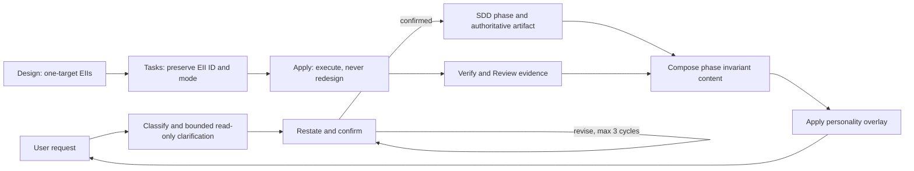

# Design: Improve User Phase Communication

## Decisions at a Glance

| Topic | Decision |
|---|---|
| Implementation shape | Extend the canonical Developer Team prompt content in `packages/core/src/teams/developer`; do not add a renderer, state machine, schema, adapter behavior, or CLI/TUI surface. |
| User summary surface | Keep the summary as free-form Orchestrator prose inside the existing user response. Test invariant content, not a new serialized envelope. |
| Intake gate | Extend existing `INV-004`; allow bounded read-only clarification, exempt trivial Direct work, and require a confirmed restatement before substantial non-trivial work. |
| Restatement bound | Permit three user-requested revision cycles after the initial restatement; a fourth revision request escalates and never auto-confirms. |
| Personality | Compose invariant content first, then apply `guia` or `pragmatica` only as a presentation overlay. Personality may change form, never substance or visibility. |
| Design authority | Add the stable conditional `## Exact Implementation Instructions` contract to Design content. Every EII targets exactly one canonical symbol or named section. |
| Downstream fidelity | Tasks preserve EII IDs and modes. Apply executes them without redesign and stops with `design-instruction-ambiguous` when direction cannot be followed exactly. |
| Profiles | Preserve semantic parity across `compact` (default) and `legacy`; retain the existing 70% compact ceiling and deliberate legacy baseline snapshot. |
| Diagrams | Conditional and non-authoritative. This Design includes concise diagram-ready Mermaid source; product-facing diagrams remain optional. |
| Apply sequencing | **Blocked** until `developer-team-execution-convergence` closes or an explicit target handoff/rebase point is recorded. |
| Estimated implementation impact | 15 files: 11 canonical prompt-content sources, 3 existing tests, and 1 new table-driven semantic contract test. No generated file. |

## Phase Result

- **Status**: Design completed; centralized registry reconciliation remains pending.
- **Action**: The Orchestrator may record this Design intent and proceed to Task after Spec/Design reconciliation. Task may plan the authorized work, but Apply remains blocked by active overlapping ownership.
- **Role**: `deck-developer-design`
- **Instance**: `openai/gpt-5.6-sol`, 2026-07-22
- **Execution mode**: Interactive, centralized registry mode; this specialist writes no shared registry YAML.
- **Artifact**: `openspec/changes/improve-user-phase-communication/design.md`
- **Dependencies**: approved `proposal.md`; completed `spec.md`; current `state.yaml` and `events.yaml`; current canonical source/tests; active `developer-team-execution-convergence` ownership.
- **Official context**: OpenSpec artifacts, Spec Registry records, source, tests, package metadata, and repository architecture.
- **Adaptive context**: Loaded as advisory context. It agreed with the official overlap and prompt-composition findings and did not change scope or decisions.
- **Overall risk**: Medium. The behavior is prompt-governed and reversible, but it is cross-phase, authorization-adjacent, and overlaps another active change.
- **Registry contract**: Return one helper-built, helper-parsed `RegistryIntentV1` bound to this artifact and the current registry-pair digests; do not write the pair from this role.

## Requirement Reconciliation

Every Spec capability is covered without changing its scope.

| Spec capability | Design coverage | Primary evidence after Apply |
|---|---|---|
| `orchestrator-intake-and-confirmation` (`REQ-INTAKE-001`–`006`) | Extend `INV-004` and all Orchestrator session/agent/skill profile surfaces with the exact intake block, trivial exemption, bounded discovery, separate authorization gate, and three-cycle revision bound. | Exact-block and composed-profile assertions in the new semantic contract test plus `orchestrator-invariants.test.ts`. |
| `orchestrator-phase-communication` (`REQ-COMMS-001`–`006`) | Add one common Orchestrator phase matrix; keep authoritative artifacts detailed; make Apply low-noise, failures actionable, and diagrams conditional. | Matrix assertions across both profiles and both personalities; revised diagram tests. |
| `proposal-collaborative-agreement` (`REQ-PROPOSAL-001`–`004`) | Make Proposal role content produce a collaborative draft and approval question; only the Orchestrator records existing human decision events. | Proposal profile assertions and existing registry behavior tests, unchanged. |
| `design-exact-implementation-instructions` (`REQ-DESIGN-001`–`005`) | Add the stable conditional EII section, explicit safe mode selection, one-target EII rule, machine-checkable assertions, and existing Design sections unchanged. | Design profile assertions against exact heading, fields, and mode rules. |
| `task-and-apply-fidelity` (`REQ-FIDELITY-001`–`004`) | Carry EII ID/mode/constraints through Tasks; enforce exact-or-semantic execution in all Apply roles and stop on ambiguity. | Task and all-role/profile Apply assertions, including exact blocker reason. |
| `verify-review-failure-explanation` (`REQ-FAILURE-001`–`003`) | Require internal phase returns to provide plain-language failure meaning while retaining anchored reports; prohibit automatic modifying retry/advance at the Orchestrator. | Verify/Review return-contract assertions and exact Orchestrator failure-stop assertion. |
| `personality-styling` (`REQ-PERSONALITY-001`–`003`) | Preserve current base-plus-overlay composition; add an exact non-suppression rule and remove the unconditional one-line completion rule. | Both personality constants and all four composed session variants. |
| `cross-phase-compatibility-and-budget` (`REQ-COMPAT-001`–`007`) | Keep registry/runtime/adapter APIs unchanged; edit only canonical content; preserve compact default/budget, adapter pass-through, append-only evidence, rollback safety, and protected-scope exclusion. | Prompt-profile budget/snapshot, unchanged adapter pass-through suites, broad tests, and changed-path audit. |

## Resolved Spec Decisions

### 1. Phase-summary formatting surface

**Decision: free-form Orchestrator prose in the existing user-facing response.** No structured `summary`/`decisions`/`blockers` object, return-schema field, telemetry event, or renderer is added.

Rationale:

- No production summary formatter exists; canonical prompt composition is the current control boundary.
- A new envelope would modify runtime/adapter contracts excluded by the Proposal and Spec.
- Stable tests can assert the required phase matrix and composed prompt invariants without freezing user-language or personality-dependent copy.

### 2. EII anchoring

**Decision: each EII targets exactly one canonical editable symbol or one named section inside that symbol.** Cross-symbol combined EIIs are prohibited. A symbol may have more than one EII only when distinct concerns require different modes, such as byte-verbatim intake safety plus semantically constrained phase-summary behavior.

Rationale: Task and Apply can reference one unambiguous target, while mode safety is not weakened by forcing dynamic and authorization-critical instructions into one mode.

### 3. Restatement revision bound

**Decision: three user-requested revision cycles after the initial restatement.** One cycle is one user correction followed by one revised restatement. A fourth correction request stops advancement and escalates the unresolved ambiguity to the user; it does not auto-confirm, silently choose, or authorize work.

## Current Architecture

### Authoritative composition boundary

1. Canonical role/session strings live in `packages/core/src/teams/developer/*-content.ts` and `orchestrator-invariants.ts`.
2. `content-registry.ts` selects `compact` by default or explicit `legacy`, prepends the applicable runtime/invariant contract, then appends context authority, language policy, and capability instructions.
3. `getOrchestratorSystemPrompt()` composes the shared Orchestrator core first and appends `guia` or `pragmatica` afterwards.
4. OpenCode and Pi adapters consume registry content and materialize runner-native plans. They do not own phase communication semantics.
5. Existing tests protect raw role content, composed content, legacy snapshots, compact budget, and adapter pass-through. There is no dedicated runtime phase-summary formatter to modify.

### Constraints that remain unchanged

- OpenSpec artifacts and Spec Registry records remain authoritative; user summaries are non-authoritative.
- Specialist prompts, returns, and generated artifacts remain English; the Orchestrator answers the user in the user's language.
- Centralized specialists do not write `state.yaml` or `events.yaml`.
- Restatement confirmation and modification authorization are separate gates.
- Runtime authorization, Git safety, independent Verify/Review, lane floors, freshness, and hard stops remain intact.
- `compact` remains the production default; `legacy` remains an explicit compatibility profile.
- No generated or materialized output is an editable source target.

## Proposed Architecture

### Boundary 1: Intake policy extends `INV-004`

Keep one taxonomy and one existing invariant. `INV-004` becomes the source of the non-trivial alignment contract rather than introducing a competing invariant or state machine. Raw Orchestrator content repeats the actionable clause where current tests and installed surfaces expect it; composed tests prevent profile drift.

The gate sequence is:

1. Classify every request and record the reason.
2. For non-trivial work only, perform bounded read-only discovery when needed.
3. Restate intent, assumptions, open questions, risks, and consequential choices.
4. Obtain explicit confirmation or iterate up to the defined bound.
5. Treat modification authorization as a separate later gate.

### Boundary 2: Orchestrator owns user-facing synthesis

Add the phase communication matrix to the shared Orchestrator core and skill, not to a new renderer and not to every specialist. Specialists return the decision-relevant data the Orchestrator needs; the Orchestrator chooses concise prose in the user's language.

Composition order is normative:

1. Read the immutable phase result and authoritative artifact.
2. Extract the phase's minimum invariant content.
3. Include all decisions, blockers, approval requests, failures, open questions, risks, and required authorizations.
4. Apply personality styling to presentation only.
5. Present one concise decision surface; optionally add non-authoritative diagram-ready data when useful.

### Boundary 3: Design carries prompt authority through stable EIIs

`design.md` remains the only Design artifact. When Deck-owned prompts, skills, or instructions are affected, its stable `## Exact Implementation Instructions` section contains one-target EIIs with an explicit mode and test contract. No parser, schema field, or new lifecycle artifact is introduced.

Task references the EII rather than paraphrasing it. Apply treats it as an immutable execution input. Missing or infeasible direction returns to Design instead of being redesigned downstream.

### Boundary 4: Failure meaning travels with Verify/Review returns

Verify and Review retain full structured reports and anchors. Their return contracts additionally carry concise failure meaning so the Orchestrator does not need to reconstruct it from a report. The Orchestrator translates that meaning into the user's language and waits for a user decision before another modifying attempt or phase advancement.

### Boundary 5: Compatibility is proved at canonical composition

No adapter implementation changes are needed. Canonical content tests cover raw and composed surfaces, both profiles, both personalities, and all Apply roles. Existing adapter tests remain integration proof that registry-provided content reaches temporary materialization plans.

## Data Flow and State



- **Runtime state**: No new state, field, approval state, or transition.
- **Persistence**: Existing OpenSpec artifacts and centralized registry events only.
- **Proposal approval**: Reuse existing approved status and human approval/rejection event support.
- **API/contracts**: No public TypeScript export, registry schema, runtime authorization contract, or adapter API change.
- **Migration**: None. Existing installations receive changed canonical content through their normal install/materialization path.
- **Observability**: No new telemetry. Prompt-level semantic regression evidence is sufficient for this change; product telemetry remains an optional follow-up.

## Exact Implementation Instructions

This section is the authoritative Design-to-Task-to-Apply contract for this change.

### Consumption rules

1. **Task MUST preserve this section by EII ID.** Every task touching a listed target must carry its originating requirement/scenario, EII ID, mode, required block or semantic constraints, exclusions, rollout gate, and rollback boundary.
2. **Apply MUST execute, not redesign.** It may perform only mechanical TypeScript escaping or placement needed to make the exported prompt contain the required emitted bytes or semantics.
3. **Byte-verbatim means emitted prompt bytes.** The first and last characters shown in each fenced `text` block are part of the block; no leading or trailing blank line is included. TypeScript template-literal escaping of backticks is mechanical and must not alter the exported string.
4. **Semantic-constrained means every listed clause is mandatory.** Wording and local placement may vary only when all clauses, invariants, ordering, and prohibitions remain machine-checkable.
5. **One target per EII.** Do not combine symbols. If current source moved after the ownership handoff, stop with `design-instruction-ambiguous` and return to Design rather than selecting a replacement target.
6. **Ambiguity stop.** Task or Apply must make no affected edit and return blocker `design-instruction-ambiguous` for a missing target, missing mode, unclear placement, conflicting direction, infeasible exact copy, or incompatibility with newer authoritative work.
7. **Ownership hard stops.** Apply is currently blocked by `developer-team-execution-convergence`. Any intersection with `runner-capability-standardization` is `excluded-scope` and must be rejected without modification.

### Byte-verbatim emitted prompt blocks

#### `BV-INTAKE-ALIGNMENT`

```text
For every non-trivial request, before any substantial work, classify the request as exactly one of Direct, Specialist(s), Recommend SDD, or Run SDD; record the classification and its reason in the delegation or phase return, and expose both to the user when consequential work begins. You may perform bounded read-only discovery only to resolve ambiguity. Then restate the user's intent, assumptions, open questions, risks, and consequential choices and obtain explicit confirmation that the restatement is correct. Trivial direct edits are exempt. Restatement confirmation does not authorize modification; modification authorization remains a separate later gate.

If the user revises the restatement, revise it and do not advance. Permit at most three user-requested revision cycles after the initial restatement; on a fourth revision request, stop and escalate the unresolved ambiguity rather than auto-confirming. If the user declines, record the decision and stop.
```

#### `BV-INTAKE-COMPACT-SUMMARY`

```text
Classify every request; for non-trivial work allow only bounded read-only discovery, then restate and obtain confirmation before substantial work. Trivial Direct edits are exempt; modification authorization remains separate.
```

#### `BV-FAILURE-DECISION-GATE`

```text
After Verify or Review reports a failure, do not auto-retry modification and do not auto-advance. First present what failed, why it matters, the next decision or action, and any rollback-relevant behavior to the user, then wait for the user's explicit decision; existing modification authorization remains a separate gate.
```

#### `BV-PERSONALITY-CONTENT-PRESERVING`

```text
- **Content-preserving overlay**: Apply this style only after the phase summary's invariant decisions, blockers, approval requests, failures, open questions, risks, and required authorizations have been composed. Do not remove, weaken, hide, or reorder that content.
```

#### `BV-PRAGMATICA-SIGNAL-ONLY`

```text
- **Signal-only status updates**: Routine progress may use one line only when no invariant content is lost. Give blockers, approval requests, failures, decisions, open questions, and required authorizations enough space to be explicit.
```

#### `BV-PROPOSAL-COLLABORATION`

```text
Treat `proposal.md` as a collaborative draft and revision loop. Creating or revising the draft never constitutes approval. Preserve prior decisions, dependencies, risks, rollback, and unresolved decisions on every revision. Return the consequential choices and a specific approval question. Only the Orchestrator may record explicit human approval evidence; Spec and Design must not begin until that evidence exists.
```

#### `BV-DESIGN-AGENT-AUTHORITY`

```text
When the change modifies Deck-owned prompts, skills, or system instructions, Design—not Tasks or Apply—must reason about and define the change in a stable `## Exact Implementation Instructions` section. Do not complete Design with an ambiguous target, missing mode, or untestable instruction.
```

#### `BV-DESIGN-EII-CONTRACT`

```text
## Exact Implementation Instructions

Include this section whenever the change modifies Deck-owned prompts, skills, or system instructions. Create one independently testable EII per canonical symbol or named section; a symbol may have multiple EIIs only when concerns require different modes. Each EII must include: EII ID; editable source target; mode (`byte-verbatim` or `semantic-constrained`); required change; preserved constraints; affected tests/assertions; prohibited reinterpretations; and ambiguity-stop behavior. For `byte-verbatim`, provide the exact emitted prompt text in a fenced block, including whitespace and punctuation. For `semantic-constrained`, enumerate every required clause, invariant, intent, and prohibition. Use `byte-verbatim` for security-, authorization-, or destructive-operation-critical text. Do not use `byte-verbatim` for user-language-, personality-, data-, or composition-dependent text.
```

#### `BV-TASK-AGENT-FIDELITY`

```text
Preserve every Design Exact Implementation Instruction by EII ID and canonical target; do not reinterpret, dilute, replace, or summarize it away. Missing, ambiguous, conflicting, or infeasible direction blocks with `design-instruction-ambiguous`.
```

#### `BV-TASK-EII-FIDELITY`

```text
For each task, carry the originating requirement and acceptance scenario, Design constraint and EII ID, EII mode and exact text or semantic constraints, excluded targets, rollout condition, and rollback boundary. A `byte-verbatim` EII must reference its exact target and fenced text; a `semantic-constrained` EII must carry every declared clause, invariant, intent, and prohibition. If any required Design direction is missing, ambiguous, conflicting, or infeasible, stop task generation for that target and return blocker `design-instruction-ambiguous`; do not invent a decision for Apply.
```

#### `BV-APPLY-AGENT-FIDELITY`

```text
For Deck prompt or system-instruction work, execute the named Design EII without redesign. Missing, ambiguous, conflicting, or infeasible direction blocks with `design-instruction-ambiguous`; do not invent a substitute.
```

#### `BV-APPLY-EII-FIDELITY`

```text
Execute each named Design EII exactly as routed by Tasks; do not redesign prompt or system-instruction behavior. For `byte-verbatim`, reproduce the emitted prompt text exactly, including whitespace and punctuation. For `semantic-constrained`, preserve every declared clause, invariant, intent, and prohibition. If an EII is missing, ambiguous, conflicting, infeasible, or cannot be placed at its named canonical target, make no affected edit and return blocker `design-instruction-ambiguous`; do not invent, substitute, or reinterpret prompt behavior.
```

### Semantic implementation constraints

#### `SC-PHASE-MATRIX`

The shared Orchestrator session/skill content must contain this minimum semantic matrix. The generated user copy is dynamic and therefore must **not** be byte-frozen.

| Phase | Required invariant content | Required boundary |
|---|---|---|
| Explore | Key findings, risks, assumptions, and open decisions | Preserve evidence-rich `exploration.md`. |
| Proposal | Collaborative problem, intent, scope, tradeoffs, dependencies, and the specific approval question | Do not presume approval; preserve risks, rollback, and unresolved decisions. |
| Spec | Low-detail behavioral highlights useful to the owner | Preserve complete requirements and scenarios in `spec.md`. |
| Design | High-level technical-lead view of boundaries, choices, and tradeoffs | Preserve actionable architecture and EIIs in `design.md`. |
| Tasks | General grouped plan and sequencing | Preserve atomic, routed, dependency-aware `tasks.md`. |
| Apply | Final outcome, material deviations, blockers, and required user actions only | Do not narrate routine steps or internal targeted/affected/broad stages. |
| Verify | Pass, or what failed, why it matters, blocking status, and next action | Preserve independent structured evidence. |
| Review | Pass, or what failed, impact, blocking status, and next action | Preserve independent structured findings. |
| Archive | Closure, traceability confirmation, and advisory Git suggestion when useful | Preserve full archive evidence; never mutate Git automatically. |

Additional mandatory clauses:

- The Orchestrator writes the summary in the user's language and keeps it within one Interactive decision prompt.
- A blocker, approval request, failure, open decision, risk, or required authorization may never be removed for brevity.
- Personality is applied only after invariant content is complete.
- A concise runner-agnostic Mermaid source or equivalent diagram-ready data is optional, non-authoritative, and never a phase gate.
- Replace the legacy unconditional “After each planning phase ... include” rule with conditional usefulness language. Keep existing runner-agnostic and non-authoritative constraints.
- The Orchestrator may classify or package a failure through existing deterministic runtime helpers, but `BV-FAILURE-DECISION-GATE` forbids another modifying launch or phase advance before the user's explicit decision.

#### `SC-EXPLORER-HANDOFF`

Explorer agent and skill content, in both profiles, must make the phase return identify key findings, risks, assumptions, open decisions, confidence, evidence references, and blockers. This augments the return only; it must not reduce `exploration.md`, authorize product decisions, or make Explorer user-facing.

#### `SC-PROPOSAL-OWNER-FRAMING`

Proposal content must provide enough information for the Orchestrator to frame the user as client, system owner, domain authority, and active stakeholder. Its next-step language must say approval is awaited; “ready for Spec and Design” is permitted only as a conditional after recorded approval. Existing human approval/rejection event types are reused.

#### `SC-DESIGN-RETURN`

Both Design profiles must retain technical-lead prose, architecture, file impact, testing, tradeoffs, risks, dependencies, and open decisions. The return adds the exact editable target list and an EII summary. The EII section is additive and conditional, not a replacement template.

#### `SC-FAILURE-RETURNS`

- Verify agent and skill returns, in both profiles, must state on failure: what failed, why it matters to the user/change, whether it is blocking, and the next decision/action. Full anchors remain in `verify-report.md`.
- Review agent and skill returns, in both profiles, must state on requested changes: what failed, impact, whether it is blocking, and the next decision/action. Full anchors remain in `review-report.md`.
- Internal specialist returns remain English. The Orchestrator translates/synthesizes for the user.
- Neither role implements a fix, changes requirements, or weakens independent judgment.

#### `SC-PROFILE-AND-MATERIALIZATION`

- Keep `content-registry.ts`, `getOrchestratorSystemPrompt()`, profile selection, default personality, and composition order unchanged.
- Keep `compact` as default and `legacy` explicit. Both must contain the same contract, although semantic-constrained wording may differ.
- Update the frozen legacy bytes, lexical-token count, and SHA-256 in `prompt-profile.test.ts` only from the resulting canonical content; do not guess values or relax the 70% assertions.
- Do not edit generated/materialized output. OpenCode content is materialized through existing `buildPromptGenerationPlan()` / Developer Team install planning; Pi content is materialized through existing `buildDeveloperTeamInstallPlan()` / profile materialization. Integration tests must use temporary targets.
- No checked-in generator is expected to change for these prompt strings. If a downstream install artifact must be refreshed, invoke the existing adapter install/materialization path from canonical content and verify byte pass-through; never patch the derivative file.

### Target-by-target EII map

Every bullet below is an independent EII with exactly one editable symbol.

#### Orchestrator intake, phase synthesis, and personality

- **`EII-INTAKE-INV004`** — `packages/core/src/teams/developer/orchestrator-invariants.ts::INV_004_SDD_TRIAGE_GATE.requiredAction`; mode `byte-verbatim` using `BV-INTAKE-ALIGNMENT`. Preserve ID `INV-004`, critical tier, all surfaces, exact taxonomy, and separate authorization; do not add a new invariant.
- **`EII-INTAKE-INV004-METADATA`** — `packages/core/src/teams/developer/orchestrator-invariants.ts::INV_004_SDD_TRIAGE_GATE` (`condition`, `rationale`, `violationConsequence`, and `sourceRefs` only); mode `semantic-constrained`. Cover substantial work, bounded read-only discovery, normalized restatement, explicit confirmation, trivial exemption, three-cycle escalation, and separate modification authorization. Preserve the existing schema, ID, title, tier, and surfaces; replace brittle line-number references with the named current section.
- **`EII-INTAKE-COMPACT-INV004`** — `packages/core/src/teams/developer/orchestrator-invariants.ts::COMPACT_ORCHESTRATOR_INVARIANT_SUMMARIES_V1` (`INV-004` entry); mode `byte-verbatim` using `BV-INTAKE-COMPACT-SUMMARY`. Preserve all other entries and order.
- **`EII-ORCH-LEGACY-SESSION-INTAKE`** — `packages/core/src/teams/developer/orchestrator-content.ts::ORCHESTRATOR_SYSTEM_PROMPT`; mode `byte-verbatim` using `BV-INTAKE-ALIGNMENT`; retain the four category definitions and modification checklist.
- **`EII-ORCH-COMPACT-SESSION-INTAKE`** — `orchestrator-content.ts::ORCHESTRATOR_SYSTEM_PROMPT_COMPACT`; mode `byte-verbatim` using `BV-INTAKE-ALIGNMENT`; retain compact runtime authority and hard stops.
- **`EII-ORCH-LEGACY-AGENT-INTAKE`** — `orchestrator-content.ts::ORCHESTRATOR_AGENT_BODY`; mode `byte-verbatim` using `BV-INTAKE-ALIGNMENT`; preserve delegation identity and triggers.
- **`EII-ORCH-COMPACT-AGENT-INTAKE`** — `orchestrator-content.ts::ORCHESTRATOR_COMPACT_AGENT_BODY`; mode `byte-verbatim` using `BV-INTAKE-ALIGNMENT`; preserve all existing compact boundaries.
- **`EII-ORCH-LEGACY-SKILL-INTAKE`** — `orchestrator-content.ts::ORCHESTRATOR_SKILL_BODY`; mode `byte-verbatim` using `BV-INTAKE-ALIGNMENT`; preserve category guidance and dependency flow.
- **`EII-ORCH-COMPACT-SKILL-INTAKE`** — `orchestrator-content.ts::ORCHESTRATOR_COMPACT_SKILL_BODY`; mode `byte-verbatim` using `BV-INTAKE-ALIGNMENT`; preserve normalized result and deterministic routing rules.
- **`EII-ORCH-LEGACY-SESSION-COMMS`** — `orchestrator-content.ts::ORCHESTRATOR_SYSTEM_PROMPT`; mode `semantic-constrained` using `SC-PHASE-MATRIX`. Preserve user-language, artifact-authority, safety, and execution-mode clauses.
- **`EII-ORCH-COMPACT-SESSION-COMMS`** — `orchestrator-content.ts::ORCHESTRATOR_SYSTEM_PROMPT_COMPACT`; mode `semantic-constrained` using `SC-PHASE-MATRIX`, compactly expressed without dropping a phase or invariant.
- **`EII-ORCH-LEGACY-AGENT-COMMS`** — `orchestrator-content.ts::ORCHESTRATOR_AGENT_BODY`; mode `semantic-constrained`: require phase-appropriate synthesis without duplicating the full role artifact.
- **`EII-ORCH-COMPACT-AGENT-COMMS`** — `orchestrator-content.ts::ORCHESTRATOR_COMPACT_AGENT_BODY`; mode `semantic-constrained`: preserve the same synthesis boundary in compact form.
- **`EII-ORCH-LEGACY-SKILL-COMMS`** — `orchestrator-content.ts::ORCHESTRATOR_SKILL_BODY`; mode `semantic-constrained` using the complete `SC-PHASE-MATRIX`; replace mandatory diagram wording and preserve all existing safety/registry guidance.
- **`EII-ORCH-COMPACT-SKILL-COMMS`** — `orchestrator-content.ts::ORCHESTRATOR_COMPACT_SKILL_BODY`; mode `semantic-constrained` using the complete matrix in compact form.
- **`EII-ORCH-LEGACY-SESSION-FAILURE`** — `orchestrator-content.ts::ORCHESTRATOR_SYSTEM_PROMPT`; mode `byte-verbatim`, add `BV-FAILURE-DECISION-GATE`.
- **`EII-ORCH-COMPACT-SESSION-FAILURE`** — `orchestrator-content.ts::ORCHESTRATOR_SYSTEM_PROMPT_COMPACT`; mode `byte-verbatim`, add `BV-FAILURE-DECISION-GATE`.
- **`EII-ORCH-LEGACY-AGENT-FAILURE`** — `orchestrator-content.ts::ORCHESTRATOR_AGENT_BODY`; mode `byte-verbatim`, add `BV-FAILURE-DECISION-GATE`.
- **`EII-ORCH-COMPACT-AGENT-FAILURE`** — `orchestrator-content.ts::ORCHESTRATOR_COMPACT_AGENT_BODY`; mode `byte-verbatim`, add `BV-FAILURE-DECISION-GATE`.
- **`EII-ORCH-LEGACY-SKILL-FAILURE`** — `orchestrator-content.ts::ORCHESTRATOR_SKILL_BODY`; mode `byte-verbatim`, add `BV-FAILURE-DECISION-GATE` and let it constrain, rather than delete, deterministic diagnostic routing.
- **`EII-ORCH-COMPACT-SKILL-FAILURE`** — `orchestrator-content.ts::ORCHESTRATOR_COMPACT_SKILL_BODY`; mode `byte-verbatim`, add `BV-FAILURE-DECISION-GATE` and preserve non-modifying diagnosis.
- **`EII-PERSONALITY-GUIA`** — `orchestrator-content.ts::PERSONALITY_COMMUNICATION_GUIDA`; mode `byte-verbatim`: add `BV-PERSONALITY-CONTENT-PRESERVING`. Preserve teaching style and progressive disclosure.
- **`EII-PERSONALITY-PRAGMATICA`** — `orchestrator-content.ts::PERSONALITY_COMMUNICATION_PRAGMATICA`; mode `byte-verbatim`: add `BV-PERSONALITY-CONTENT-PRESERVING` and replace the existing unconditional signal-only line with `BV-PRAGMATICA-SIGNAL-ONLY`. Preserve default personality and efficient style.

#### Specialist handoffs and Design authority

- **`EII-EXP-LEGACY-AGENT`** — `packages/core/src/teams/developer/explorer-content.ts::EXPLORER_AGENT_BODY`; mode `semantic-constrained` using `SC-EXPLORER-HANDOFF` for the Return Contract only.
- **`EII-EXP-LEGACY-SKILL`** — `explorer-content.ts::EXPLORER_SKILL_BODY`; mode `semantic-constrained` using `SC-EXPLORER-HANDOFF`; preserve the full artifact template and evidence rules.
- **`EII-EXP-COMPACT-AGENT`** — `explorer-content.ts::EXPLORER_COMPACT_AGENT_BODY`; mode `semantic-constrained` using `SC-EXPLORER-HANDOFF`; do not add user-facing synthesis.
- **`EII-EXP-COMPACT-SKILL`** — `explorer-content.ts::EXPLORER_COMPACT_SKILL_BODY`; mode `semantic-constrained` using `SC-EXPLORER-HANDOFF` in `Artifact and Return`.
- **`EII-PROP-LEGACY-AGENT`** — `packages/core/src/teams/developer/proposal-content.ts::PROPOSAL_AGENT_BODY`; mode `byte-verbatim`, add `BV-PROPOSAL-COLLABORATION`.
- **`EII-PROP-LEGACY-SKILL`** — `proposal-content.ts::PROPOSAL_SKILL_BODY`; mode `byte-verbatim`, add `BV-PROPOSAL-COLLABORATION` and preserve complete proposal sections.
- **`EII-PROP-COMPACT-AGENT`** — `proposal-content.ts::PROPOSAL_COMPACT_AGENT_BODY`; mode `byte-verbatim`, add `BV-PROPOSAL-COLLABORATION`.
- **`EII-PROP-COMPACT-SKILL`** — `proposal-content.ts::PROPOSAL_COMPACT_SKILL_BODY`; mode `byte-verbatim`, add `BV-PROPOSAL-COLLABORATION`.
- **`EII-PROP-LEGACY-AGENT-HANDOFF`** — `proposal-content.ts::PROPOSAL_AGENT_BODY` (`Return Contract` only); mode `semantic-constrained` using `SC-PROPOSAL-OWNER-FRAMING`. The handoff must await recorded approval and must not say the Orchestrator will advance immediately.
- **`EII-PROP-LEGACY-SKILL-HANDOFF`** — `proposal-content.ts::PROPOSAL_SKILL_BODY` (return and next-step sections only); mode `semantic-constrained` using `SC-PROPOSAL-OWNER-FRAMING`; replace unconditional advancement with an approval-waiting condition.
- **`EII-PROP-COMPACT-AGENT-HANDOFF`** — `proposal-content.ts::PROPOSAL_COMPACT_AGENT_BODY` (boundary/handoff wording only); mode `semantic-constrained` using `SC-PROPOSAL-OWNER-FRAMING`.
- **`EII-PROP-COMPACT-SKILL-HANDOFF`** — `proposal-content.ts::PROPOSAL_COMPACT_SKILL_BODY` (`Artifact and Return` only); mode `semantic-constrained` using `SC-PROPOSAL-OWNER-FRAMING` and a conditional next handoff.
- **`EII-DESIGN-LEGACY-AGENT`** — `packages/core/src/teams/developer/design-content.ts::DESIGN_AGENT_BODY`; mode `byte-verbatim`, add `BV-DESIGN-AGENT-AUTHORITY` and preserve current role boundaries.
- **`EII-DESIGN-LEGACY-SKILL`** — `design-content.ts::DESIGN_SKILL_BODY`; mode `byte-verbatim`, add `BV-DESIGN-EII-CONTRACT` in the existing output template.
- **`EII-DESIGN-COMPACT-AGENT`** — `design-content.ts::DESIGN_COMPACT_AGENT_BODY`; mode `byte-verbatim`, add `BV-DESIGN-AGENT-AUTHORITY` and preserve current boundaries.
- **`EII-DESIGN-COMPACT-SKILL`** — `design-content.ts::DESIGN_COMPACT_SKILL_BODY`; mode `byte-verbatim`, add `BV-DESIGN-EII-CONTRACT`.
- **`EII-DESIGN-LEGACY-AGENT-RETURN`** — `design-content.ts::DESIGN_AGENT_BODY` (`Return Contract` only); mode `semantic-constrained` using `SC-DESIGN-RETURN`.
- **`EII-DESIGN-LEGACY-SKILL-RETURN`** — `design-content.ts::DESIGN_SKILL_BODY` (existing output template and Return Summary only); mode `semantic-constrained` using `SC-DESIGN-RETURN`; retain every existing Design section.
- **`EII-DESIGN-COMPACT-AGENT-RETURN`** — `design-content.ts::DESIGN_COMPACT_AGENT_BODY` (return-facing boundary only); mode `semantic-constrained` using `SC-DESIGN-RETURN`.
- **`EII-DESIGN-COMPACT-SKILL-RETURN`** — `design-content.ts::DESIGN_COMPACT_SKILL_BODY` (`Artifact and Return` only); mode `semantic-constrained` using `SC-DESIGN-RETURN` and add target/EII summary.
- **`EII-TASK-LEGACY-AGENT`** — `packages/core/src/teams/developer/task-content.ts::TASK_AGENT_BODY`; mode `byte-verbatim` using `BV-TASK-AGENT-FIDELITY`; preserve owner/routing boundaries.
- **`EII-TASK-LEGACY-SKILL`** — `task-content.ts::TASK_SKILL_BODY`; mode `byte-verbatim` using `BV-TASK-EII-FIDELITY`; add EII fields to each applicable task and self-check without weakening atomic tasks.
- **`EII-TASK-COMPACT-AGENT`** — `task-content.ts::TASK_COMPACT_AGENT_BODY`; mode `byte-verbatim` using `BV-TASK-AGENT-FIDELITY`.
- **`EII-TASK-COMPACT-SKILL`** — `task-content.ts::TASK_COMPACT_SKILL_BODY`; mode `byte-verbatim` using `BV-TASK-EII-FIDELITY`; retain exact-target, RED/GREEN, routing, and blocker fields.

#### Apply execution fidelity

For every Apply target below, preserve the existing modification gate, authorization behavior, Git safety, domain boundary, checks, and centralized registry contract.

- **`EII-APPLY-GENERAL-LEGACY-AGENT`** — `packages/core/src/teams/developer/apply-general-content.ts::APPLY_GENERAL_AGENT_BODY`; mode `byte-verbatim`, add `BV-APPLY-AGENT-FIDELITY`.
- **`EII-APPLY-GENERAL-LEGACY-SKILL`** — `apply-general-content.ts::APPLY_GENERAL_SKILL_BODY`; mode `byte-verbatim`, add `BV-APPLY-EII-FIDELITY` before implementation steps and require the blocker code in Return.
- **`EII-APPLY-GENERAL-COMPACT-AGENT`** — `apply-general-content.ts::APPLY_GENERAL_COMPACT_AGENT_BODY`; mode `byte-verbatim`, add `BV-APPLY-AGENT-FIDELITY`.
- **`EII-APPLY-GENERAL-COMPACT-SKILL`** — `apply-general-content.ts::APPLY_GENERAL_COMPACT_SKILL_BODY`; mode `byte-verbatim`, add `BV-APPLY-EII-FIDELITY`.
- **`EII-APPLY-BACKEND-LEGACY-AGENT`** — `packages/core/src/teams/developer/apply-backend-content.ts::APPLY_BACKEND_AGENT_BODY`; mode `byte-verbatim`, add `BV-APPLY-AGENT-FIDELITY`.
- **`EII-APPLY-BACKEND-LEGACY-SKILL`** — `apply-backend-content.ts::APPLY_BACKEND_SKILL_BODY`; mode `byte-verbatim`, add `BV-APPLY-EII-FIDELITY` before implementation steps and require the blocker code in Return.
- **`EII-APPLY-BACKEND-COMPACT-AGENT`** — `apply-backend-content.ts::APPLY_BACKEND_COMPACT_AGENT_BODY`; mode `byte-verbatim`, add `BV-APPLY-AGENT-FIDELITY`.
- **`EII-APPLY-BACKEND-COMPACT-SKILL`** — `apply-backend-content.ts::APPLY_BACKEND_COMPACT_SKILL_BODY`; mode `byte-verbatim`, add `BV-APPLY-EII-FIDELITY`.
- **`EII-APPLY-FRONTEND-LEGACY-AGENT`** — `packages/core/src/teams/developer/apply-frontend-content.ts::APPLY_FRONTEND_AGENT_BODY`; mode `byte-verbatim`, add `BV-APPLY-AGENT-FIDELITY`.
- **`EII-APPLY-FRONTEND-LEGACY-SKILL`** — `apply-frontend-content.ts::APPLY_FRONTEND_SKILL_BODY`; mode `byte-verbatim`, add `BV-APPLY-EII-FIDELITY` before implementation steps and require the blocker code in Return.
- **`EII-APPLY-FRONTEND-COMPACT-AGENT`** — `apply-frontend-content.ts::APPLY_FRONTEND_COMPACT_AGENT_BODY`; mode `byte-verbatim`, add `BV-APPLY-AGENT-FIDELITY`.
- **`EII-APPLY-FRONTEND-COMPACT-SKILL`** — `apply-frontend-content.ts::APPLY_FRONTEND_COMPACT_SKILL_BODY`; mode `byte-verbatim`, add `BV-APPLY-EII-FIDELITY`.

#### Verify and Review failure meaning

- **`EII-VERIFY-LEGACY-AGENT`** — `packages/core/src/teams/developer/verify-content.ts::VERIFY_AGENT_BODY`; mode `semantic-constrained` using the Verify clauses in `SC-FAILURE-RETURNS`; preserve independent compliance scope.
- **`EII-VERIFY-LEGACY-SKILL`** — `verify-content.ts::VERIFY_SKILL_BODY`; mode `semantic-constrained`; add the four failure meanings to the exact return template and preserve all anchored evidence.
- **`EII-VERIFY-COMPACT-AGENT`** — `verify-content.ts::VERIFY_COMPACT_AGENT_BODY`; mode `semantic-constrained`; require the same four meanings.
- **`EII-VERIFY-COMPACT-SKILL`** — `verify-content.ts::VERIFY_COMPACT_SKILL_BODY`; mode `semantic-constrained`; require the same meanings in the immutable result.
- **`EII-REVIEW-LEGACY-AGENT`** — `packages/core/src/teams/developer/review-content.ts::REVIEW_AGENT_BODY`; mode `semantic-constrained` using the Review clauses in `SC-FAILURE-RETURNS`; preserve independent engineering-quality scope.
- **`EII-REVIEW-LEGACY-SKILL`** — `review-content.ts::REVIEW_SKILL_BODY`; mode `semantic-constrained`; add the four failure meanings to the exact return template and preserve anchors/severity.
- **`EII-REVIEW-COMPACT-AGENT`** — `review-content.ts::REVIEW_COMPACT_AGENT_BODY`; mode `semantic-constrained`; require the same four meanings.
- **`EII-REVIEW-COMPACT-SKILL`** — `review-content.ts::REVIEW_COMPACT_SKILL_BODY`; mode `semantic-constrained`; require the same meanings in the immutable result.

### EII-to-assertion routing

This prefix map makes the affected assertion explicit for every EII above.

| EII ID or prefix | Required assertion IDs | Existing focused test also affected |
|---|---|---|
| `EII-INTAKE-*` | `UPC-INTAKE-01`, `UPC-INTAKE-02` | `orchestrator-invariants.test.ts` |
| `EII-ORCH-*-INTAKE` | `UPC-INTAKE-01` | `orchestrator-content.test.ts` |
| `EII-ORCH-*-COMMS` | `UPC-COMMS-01`, `UPC-COMMS-02` | `orchestrator-content.test.ts` |
| `EII-ORCH-*-FAILURE` | `UPC-COMMS-02`, `UPC-FAILURE-01` | `orchestrator-content.test.ts` |
| `EII-PERSONALITY-*` | `UPC-PERSONALITY-01` | `orchestrator-content.test.ts` |
| `EII-EXP-*` | `UPC-EXPLORER-01` | Existing Explorer content suite runs unchanged. |
| `EII-PROP-*` | `UPC-PROPOSAL-01` | Existing Proposal content suite runs unchanged. |
| `EII-DESIGN-*` | `UPC-DESIGN-01` | Existing Design content suite runs unchanged. |
| `EII-TASK-*` | `UPC-TASK-01` | Existing Task content suite runs unchanged. |
| `EII-APPLY-*` | `UPC-APPLY-01` | All three existing Apply content suites run unchanged. |
| `EII-VERIFY-*`, `EII-REVIEW-*` | `UPC-FAILURE-01` | Existing Verify and Review content suites run unchanged. |
| Every EII | `UPC-SCOPE-01`; compact/legacy budget and pass-through evidence | `prompt-profile.test.ts` plus unchanged registry/adapter suites. |

### Focused machine-checkable assertions

#### New canonical contract test

Create `packages/core/src/teams/developer/user-phase-communication.test.ts` as one table-driven test boundary. It must assert:

| Assertion ID | Surface/profile/personality | Machine-checkable invariant |
|---|---|---|
| `UPC-INTAKE-01` | Orchestrator session, agent, and skill; `compact` and `legacy`; `guia` and `pragmatica` session variants | Exact `BV-INTAKE-ALIGNMENT` is present; all four categories, trivial exemption, bounded discovery, three-cycle bound, and separate modification authorization are present. |
| `UPC-INTAKE-02` | `INV_004_SDD_TRIAGE_GATE` and compact invariant entry | `requiredAction` contains the exact full block and the compact summary equals `BV-INTAKE-COMPACT-SUMMARY`; no seventh invariant is introduced. |
| `UPC-COMMS-01` | Orchestrator session and skill, both profiles and personalities | Every phase in `SC-PHASE-MATRIX` and its minimum invariant is present; artifact detail remains explicitly separate. |
| `UPC-COMMS-02` | Orchestrator common/skill content | Exact `BV-FAILURE-DECISION-GATE` is present; Apply is low-noise; diagrams are conditional/non-blocking; the old universal-diagram command is absent. |
| `UPC-PERSONALITY-01` | Both personality constants and all composed session variants | Exact content-preserving block appears in both; exact revised Pragmatica block appears; unconditional “Phase completions get one line” is absent; shared invariant content precedes the overlay. |
| `UPC-PROPOSAL-01` | Proposal agent and skill, both profiles | Exact collaboration block appears; approval is not inferred; next handoff is conditional on recorded approval. |
| `UPC-DESIGN-01` | Design agent and skill, both profiles | Exact authority/EII blocks appear; heading, both modes, required fields, safe mode rules, target list, and EII return summary are present. |
| `UPC-TASK-01` | Task agent and skill, both profiles | Exact Task fidelity blocks appear; requirement/scenario/EII/exclusion/rollout/rollback fields and blocker code are present. |
| `UPC-APPLY-01` | General, Backend, Frontend agent and skill; both profiles | Exact agent/skill fidelity blocks appear once per raw target; byte/semantic execution rules and `design-instruction-ambiguous` are present; no role permits redesign. |
| `UPC-FAILURE-01` | Verify and Review agent/skill; both profiles | Failure return semantics include what failed, significance/impact, blocking status, and next action while preserving report anchors. |
| `UPC-EXPLORER-01` | Explorer agent/skill; both profiles | Return/handoff exposes findings, risks, assumptions, open decisions, confidence/evidence, and blockers without user-facing authority. |
| `UPC-SCOPE-01` | Exact intended source/test target list | No target is generated, an adapter implementation, registry/runtime schema, CLI/TUI, another OpenSpec change, or `runner-capability-standardization`. |

For byte-verbatim blocks, tests must compare the complete multiline block against exported/composed strings, not a bag of keywords. For semantic constraints, use table-driven clause assertions and explicit negative assertions for forbidden drift.

#### Existing test updates

- `packages/core/src/teams/developer/orchestrator-content.test.ts`
  - Replace the mandatory phase-diagram expectation with conditional/non-authoritative/non-blocking assertions.
  - Assert personality cannot hide blockers, approval requests, failures, decisions, or authorizations.
  - Retain existing composition, default personality, language, safety, and triage checks.
- `packages/core/src/teams/developer/orchestrator-invariants.test.ts`
  - Extend `INV-004` checks to exact taxonomy, bounded discovery, restatement fields, trivial exemption, explicit confirmation, three-cycle escalation, recorded reason, and separate authorization.
  - Assert invariant count remains six and the compact `INV-004` summary is exact.
- `packages/core/src/teams/developer/prompt-profile.test.ts`
  - Recompute `LEGACY_BYTES`, `LEGACY_LEXICAL_TOKENS`, and `LEGACY_SHA256` from canonical content after all prompt changes.
  - Keep compact default, dedicated-role, immutable runtime contract, and 70% byte/token assertions unchanged; do not raise the ceiling.

#### Existing integration evidence to run without editing

- `packages/core/src/teams/developer/content-registry.test.ts`
- `packages/core/src/teams/developer/manifest.test.ts`
- `packages/adapter-opencode/src/prompt-generation.test.ts`
- `packages/adapter-opencode/src/developer-team-install.test.ts`
- `packages/adapter-pi/src/registry-consumption.test.ts`
- `packages/adapter-pi/src/developer-team-install.test.ts`

These tests remain pass-through evidence. Do not change adapter implementation or weaken an assertion to accommodate canonical prompt failures.

### Prohibited reinterpretations

Task and Apply must not:

- add a structured summary schema, phase-summary renderer, telemetry contract, approval state machine, lifecycle phase, or new OpenSpec artifact;
- treat concise user summaries as permission to shorten authoritative artifacts or specialist results;
- let personality suppress, weaken, postpone, or reorder a blocker, approval request, failure, decision, open question, risk, or authorization;
- interpret restatement confirmation as modification authorization;
- infer Proposal approval from draft creation, completion, or conversational silence;
- permit an automatic modifying retry or phase advance after Verify/Review failure before a user decision;
- paraphrase byte-verbatim blocks, change `design-instruction-ambiguous`, combine EIIs across symbols, or select a replacement target after source drift;
- edit `content-registry.ts`, Spec Registry schemas, runtime authorization contracts, adapters, CLI/TUI, generated/materialized output, historical OpenSpec records, or another change;
- touch any `runner-capability-standardization` target, WIP, branch, commit, artifact, or registry history;
- begin Apply while `developer-team-execution-convergence` ownership remains active without explicit handoff/rebase evidence.

## Exact Editable Target List and File Estimate

### Canonical source targets — modify 11

| File | Exact symbols/sections | Purpose |
|---|---|---|
| `packages/core/src/teams/developer/orchestrator-invariants.ts` | `INV_004_SDD_TRIAGE_GATE`; `COMPACT_ORCHESTRATOR_INVARIANT_SUMMARIES_V1` `INV-004` entry | Extend one intake invariant and compact summary. |
| `packages/core/src/teams/developer/orchestrator-content.ts` | `ORCHESTRATOR_SYSTEM_PROMPT`; `ORCHESTRATOR_SYSTEM_PROMPT_COMPACT`; `ORCHESTRATOR_AGENT_BODY`; `ORCHESTRATOR_COMPACT_AGENT_BODY`; `ORCHESTRATOR_SKILL_BODY`; `ORCHESTRATOR_COMPACT_SKILL_BODY`; `PERSONALITY_COMMUNICATION_GUIDA`; `PERSONALITY_COMMUNICATION_PRAGMATICA` | Intake, phase matrix, failure decision gate, conditional diagrams, and content-preserving personalities. Derived composed constants/functions remain unchanged. |
| `packages/core/src/teams/developer/explorer-content.ts` | All four Explorer agent/skill constants | Decision-ready internal handoff. |
| `packages/core/src/teams/developer/proposal-content.ts` | All four Proposal agent/skill constants | Collaborative draft and explicit approval boundary. |
| `packages/core/src/teams/developer/design-content.ts` | All four Design agent/skill constants | Stable EII contract and Design return. |
| `packages/core/src/teams/developer/task-content.ts` | All four Task agent/skill constants | EII-preserving decomposition and ambiguity stop. |
| `packages/core/src/teams/developer/apply-general-content.ts` | All four General Apply agent/skill constants | Exact execution/no-redesign contract. |
| `packages/core/src/teams/developer/apply-backend-content.ts` | All four Backend Apply agent/skill constants | Exact execution/no-redesign contract. |
| `packages/core/src/teams/developer/apply-frontend-content.ts` | All four Frontend Apply agent/skill constants | Exact execution/no-redesign contract. |
| `packages/core/src/teams/developer/verify-content.ts` | All four Verify agent/skill constants | Actionable internal failure meaning. |
| `packages/core/src/teams/developer/review-content.ts` | All four Review agent/skill constants | Actionable internal failure meaning. |

### Test targets — modify 3, create 1

| File | Action |
|---|---|
| `packages/core/src/teams/developer/user-phase-communication.test.ts` | Create the table-driven canonical contract suite. |
| `packages/core/src/teams/developer/orchestrator-content.test.ts` | Modify stale diagram/personality assertions and retain existing safety checks. |
| `packages/core/src/teams/developer/orchestrator-invariants.test.ts` | Modify `INV-004` assertions. |
| `packages/core/src/teams/developer/prompt-profile.test.ts` | Modify computed legacy snapshot constants only after semantic assertions pass; retain the budget. |

**Total estimated implementation impact: 15 files** — 14 modified, 1 created, 0 deleted, 0 generated.

### Explicit non-targets

`content-registry.ts`, `catalog.ts`, `manifest.ts`, adapter implementation, runtime contracts, registry schemas/serializers, CLI/TUI, package metadata, generated assets, `state.yaml`, `events.yaml`, all other OpenSpec changes/history, and every `runner-capability-standardization` target are read-only for Apply.

## Verification Strategy

### Targeted

1. Start with the new canonical contract test in RED state before prompt edits.
2. Run the new contract test, Orchestrator content test, Orchestrator invariant test, and prompt-profile test independently.
3. Run existing adjacent role-content tests for every modified role file; additions must not weaken role differentiation, safety, language, or Git protection.

### Affected area

- Run `content-registry.test.ts` and `manifest.test.ts` to prove composed surfaces.
- Run the listed OpenCode and Pi tests to prove compact/default and explicit legacy content pass through unchanged adapter boundaries.
- Run repository typecheck.
- Confirm generated/materialized files are absent from the changed-path set.
- Confirm no target intersects `runner-capability-standardization` or another active owner.

### Broad

- Run the repository-wide test command under the existing timeout policy.
- Re-run the compact budget and deterministic canonical-content digest calculation from the final source.
- Require fresh independent Verify and Review after implementation. Prompt-source changes invalidate earlier evidence.

No assertion may be weakened, skipped, or moved to generated output to obtain a pass.

## Rollout and Materialization

1. **Ownership gate first**: do not issue an Apply batch until `developer-team-execution-convergence` is closed or the Orchestrator records an explicit handoff/rebase point for every listed target.
2. **Freshness check at handoff**: re-read all target symbols and the profile baseline. Any target/mode/placement drift returns to Design with `design-instruction-ambiguous`; Apply does not adapt this Design itself.
3. **Canonical activation**: after accepted source/tests, compact behavior changes immediately because compact is the existing default. Legacy changes ship as compatibility content in the same coherent release.
4. **Derivative materialization**: use existing adapter install/materialization tooling from canonical registry content in temporary integration fixtures or the normal installation flow. Do not edit derivative runner files.
5. **No flag or migration**: no database, registry, state, or feature-flag migration is required.

## Rollback

- Revert the canonical prompt-content and focused test changes as one coherent, ordinary source change; do not use destructive Git discard operations.
- Restore the prior deliberately recorded legacy baseline constants from the corresponding prior canonical source state, then rerun budget and adapter pass-through evidence.
- Rematerialize runner-native files through existing adapter tooling only when an installation needs refresh.
- Preserve this OpenSpec change, all human approval/rejection evidence, append-only events, and rollback evidence. Never rewrite registry history.
- Leave `runner-capability-standardization` and unrelated WIP untouched.

## Tradeoffs and Rejected Alternatives

| Decision | Chosen | Rejected alternative | Rationale |
|---|---|---|---|
| Summary mechanism | Prompt-governed free-form Orchestrator synthesis | New structured renderer/envelope | Smallest compatible boundary; no excluded runtime/adapter/schema change. |
| Phase policy location | Shared Orchestrator core plus decision-ready specialist returns | Repeat full phase matrix in every role | Preserves compact budget and prevents drift while retaining required handoff data. |
| EII placement | Stable section in existing `design.md` | New artifact or registry field | Existing artifact accepts additive headings and already flows to Task/Apply. |
| EII anchoring | Exactly one target per EII; multiple EIIs per symbol only for distinct modes | One combined cross-symbol EII | Independent testing and unambiguous Apply placement. |
| Exactness | Byte-verbatim for critical/stable clauses, semantic constraints for dynamic content | All prose byte-frozen or all prose semantic | Avoids weakening safety and avoids freezing language/personality-dependent output. |
| Test organization | One new table-driven cross-role contract suite plus three focused existing-test updates | Duplicate the full matrix in every adjacent role test | Lower maintenance burden and clearer profile/personality review path. Existing adjacent tests still run. |
| Personality | Presentation overlay after invariant composition | Personality-specific content selection | Keeps style without hiding decisions or blockers. |
| Diagrams | Conditional diagram-ready source | Universal phase diagrams | Better signal-to-noise and no phase gating. |

## Risks and Mitigations

| Risk | Likelihood | Impact | Mitigation |
|---|---|---|---|
| Intake becomes bureaucratic | Medium | Medium | Exact trivial Direct exemption; bounded discovery; tests for both paths. |
| Read-only clarification becomes unconfirmed planning | Medium | High | Exact substantial-work boundary and confirmation gate in `INV-004` and all Orchestrator surfaces. |
| Personality hides required content | Medium | High | Exact overlay rule, revised Pragmatica wording, composition-order tests. |
| Prompt duplication drifts across profiles/roles | Medium | High | EII-per-symbol map and table-driven composed-profile assertions. |
| Static prompts do not guarantee perfect runtime prose | Medium | Medium | Accept current prompt-governed architecture; retain optional renderer/telemetry as separate follow-up, not scope creep. |
| Compact budget regresses | Low | High | Existing ceiling has substantial headroom, but final source must still pass unchanged 70% byte/token assertions. |
| Legacy snapshot is updated casually | Medium | Medium | Recompute exact bytes/tokens/SHA only after final canonical content; retain explicit hash oracle. |
| Failure gate conflicts with convergence repair wording | High until handoff | High | Apply blocker, explicit handoff/rebase, fresh Design check; no downstream reinterpretation. |
| Concurrent ownership causes lost or conflicting prompt work | High until closure | High | No Apply before closure or explicit target handoff; no partial prompt implementation. |
| Protected WIP intersection | Low | Critical | Hard changed-path exclusion and `excluded-scope` stop; no target credit from that work. |

## Open Decisions and Blockers

- **Open product/design decisions**: None. All three Spec questions are resolved above.
- **Task blocker**: None after centralized Design intent reconciliation; Task must preserve this exact section.
- **Apply blocker**: `developer-team-execution-convergence` remains active at Apply / `passed_with_warnings` and owns overlapping Developer Team prompt/profile targets. Apply requires closure or an explicit target handoff/rebase point.
- **Protected-scope blocker**: Any newly discovered intersection with `runner-capability-standardization` blocks that operation and returns to scope review without modification.
- **FailureManifestV1**: None for this Design phase; no execution or verification failure occurred.

## Next Handoff

Task may reconcile this completed Design with the completed Spec and create atomic internal work. Its user-facing summary remains a general grouped plan, but `tasks.md` must preserve every EII ID, mode, target, exact block or semantic constraint, test assertion, exclusion, rollout gate, rollback boundary, and ambiguity stop defined here.
