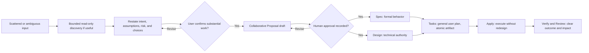

# Draft Proposal: Improve User Phase Communication

> **Approval status:** Awaiting user review in Interactive mode. The four exploration defaults are authorized inputs to this draft; they are not approval of the Proposal itself, and no human approval is recorded here.

## Problem

Deck can begin consequential work without first turning scattered or ambiguous user input into a shared understanding. Its phase communication is also inconsistent: decision-relevant context can be too thin, routine progress can be too noisy, diagrams can be required when they add little value, and authoritative artifact detail can be confused with what the user needs to see. Proposal is not yet framed as a genuinely collaborative agreement, while downstream Apply agents can lack an explicit boundary against redesigning Deck prompt or system-instruction changes that Design should own.

## Intent

Make Interactive Developer Team work collaborative and phase-appropriate without adding bureaucracy to trivial edits. Deck should:

- organize scattered input and align on intent, assumptions, ambiguity, risk, and consequential choices before substantial work;
- permit bounded read-only discovery when it improves that alignment, then require explicit confirmation before artifact creation, planning commitment, or modification;
- exempt genuinely trivial direct edits from this confirmation gate;
- treat the user as client, system owner, domain authority, and active stakeholder while collaboratively building Proposal;
- communicate each phase concisely, with personality affecting presentation but not suppressing decision-relevant content;
- preserve full authoritative artifacts while giving the user only the detail useful for the current decision; and
- make Design authoritative for the reasoning and definition of Deck prompt or system-instruction changes, with Tasks preserving and Apply executing those directions without redesign.

## Measurable Outcomes

- Covered non-trivial intake paths leave explicit evidence of a normalized restatement and user confirmation before substantial work; bounded read-only discovery remains allowed and trivial edits remain unblocked.
- Proposal advancement requires explicit human approval evidence in the centralized registry; creating or revising a draft does not count as approval.
- Regression evidence covers phase-appropriate communication across supported prompt profiles and personality variants without weakening canonical artifacts or exceeding the existing compact-profile budget.
- User-facing phase summaries consistently expose the information needed for the next decision while Apply progress remains low-noise.
- Verify and Review failures are understandable without reading internal reports: the summary identifies what failed, why it matters, and the next decision or action.
- Deck prompt or system-instruction changes remain traceable from Design direction through Tasks to Apply, with downstream ambiguity stopping work rather than triggering redesign.

## Scope

### Required Work

- Extend the existing intake/triage responsibility with risk-, ambiguity-, definition-, and consequence-sensitive alignment and confirmation; keep modification authorization as a separate later gate.
- Establish the following explicit detail boundary:

| Phase | User-facing summary | Authoritative artifact or result |
|---|---|---|
| Explore | Concise, personality-aware key findings, risks, assumptions, and open decisions. | Evidence-rich `exploration.md`. |
| Proposal | Collaborative problem, intent, scope, tradeoffs, and approval question. | Approval-ready `proposal.md` retaining dependencies, risks, rollback, and unresolved decisions. |
| Spec | Low-detail behavioral highlights useful to the owner. | Complete, testable requirements and scenarios in `spec.md`. |
| Design | High-level technical-lead view of boundaries, choices, and tradeoffs. | Actionable architecture and exact implementation direction in `design.md`. |
| Tasks | General grouped plan and sequencing. | Atomic, routed, dependency-aware `tasks.md`. |
| Apply | Low-noise progress and material deviations only. | Detailed execution evidence in Apply results and progress artifacts. |
| Verify / Review | Plain-language outcome; on failure, what failed, impact, and next action. | Independent, structured evidence and findings in their reports. |

- Make Proposal an iterative agreement with the user and record agreement as explicit human approval evidence only after the user actually approves it.
- Make diagrams conditional on usefulness and personality, while retaining diagram-ready data when it helps a Proposal decision.
- Update canonical Developer Team prompt/instruction contracts and focused semantic regression coverage across compact and legacy profiles; generated outputs remain derivative evidence.

### Design → Task → Apply Authority Boundary

- **Design owns reasoning and definition.** For each Deck-owned prompt or system-instruction change, Design identifies the canonical target, intended change, preserved constraints, focused regression intent, and whether wording is byte-verbatim or mechanically implemented under semantic constraints.
- **Tasks preserve and route.** Tasks may decompose and reference Design directions, but may not reinterpret, dilute, or replace them.
- **Apply implements without redesign.** Apply follows the approved Design and Tasks. Ambiguous, conflicting, or infeasible direction blocks and escalates back to Design; Apply must not invent replacement prompt behavior.

### Exclusions

- A dedicated phase-summary UI, formatter, approval state machine, new lifecycle phase, or new OpenSpec artifact/schema.
- Changes to Spec Registry schemas, runtime authorization contracts, adapter behavior, CLI/TUI presentation, or historical OpenSpec records.
- Universal Mermaid display after every planning phase.
- Reducing the required detail or rigor of authoritative Spec, Design, Tasks, Apply, Verify, or Review artifacts/results.
- Manual edits to generated/materialized prompt or skill outputs.
- Any target or history belonging to `runner-capability-standardization`.

### Optional Follow-up

If prompt-governed behavior later proves insufficient, a dedicated runtime summary/approval surface or communication telemetry may be proposed separately; neither is required for this change.

## Approach

1. Extend the current intake model rather than introduce a competing gate: use bounded read-only discovery only to resolve uncertainty, then restate and confirm before substantial work.
2. Keep authoritative role artifacts evidence-rich and centralize concise, phase-specific user synthesis in the Orchestrator, applying personality only after invariant decision content is preserved.
3. Treat Proposal as a draft/revision loop until the user explicitly approves it; the centralized coordinator then records separate human approval evidence.
4. Add a stable conditional Design contract for exact Deck prompt/system-instruction directions, including a declared verbatim-versus-semantic mode, and preserve that authority through Tasks and Apply.
5. Prove the communication contract with semantic assertions at canonical composition boundaries while retaining profile compatibility, prompt-budget protection, and existing adapter pass-through coverage.

This approach is intentionally high-level. Exact targets, wording, composition choices, and test assertions belong to Design after Proposal approval.

## Dependencies

- `exploration.md` and the user-approved exploration defaults define the Proposal inputs; `state.yaml` and `events.yaml` establish Interactive mode and the current centralized lifecycle state.
- Existing registry support for approved status and human approval/rejection evidence is reused; agreement must not be inferred from artifact creation.
- Compact is the production-default profile, while legacy remains supported; both must preserve the same semantics within the current compact budget.
- `developer-team-execution-convergence` has direct target overlap. Proposal, then parallel Spec and Design, may proceed, but Apply is blocked until that change closes or an explicit target handoff/rebase point is established.
- No required target intersects `runner-capability-standardization`; that scope remains protected and untouched.

## Risks

**Overall risk: Medium.** The change is prompt-governed and reversible, but it affects cross-phase behavior and overlaps an active change.

| Risk | Mitigation direction |
|---|---|
| Confirmation becomes bureaucracy for trivial work. | Keep an explicit trivial direct-edit exemption and test both gated and exempt paths. |
| Bounded discovery quietly expands into unconfirmed planning or modification. | Define it as read-only clarification and require confirmation before any substantial commitment or artifact work. |
| Concise summaries weaken authoritative artifacts or hide decisions. | Enforce the artifact-versus-summary boundary and preserve invariant content before personality styling. |
| Compact, legacy, or personality variants drift semantically. | Use shared semantic assertions and retain compact-budget/profile coverage. |
| Exact instructions become either too rigid or too vague. | Require Design to declare byte-verbatim or semantic mode per target and preserve that declaration downstream. |
| Apply redesigns when directions are unclear. | Make ambiguity a stop/escalation condition, not permission to reinterpret Design. |
| Concurrent edits conflict with convergence work. | Do not begin Apply until closure or an explicit target handoff/rebase point. |

## Rollback

Revert the canonical prompt/instruction changes and their focused regression assertions as one coherent change, then rematerialize derivative outputs through existing generators. No data or schema migration requires reversal. Preserve OpenSpec artifacts, approval/rollback evidence, and registry history rather than rewriting them. Rollback must not touch `runner-capability-standardization` or use destructive Git operations without the protected confirmation flow.

## Unresolved Decisions and Approval

The four exploration decisions are resolved for this draft: bounded read-only discovery is allowed before confirmation; actual Proposal agreement requires explicit human approval evidence; Design may choose byte-verbatim or semantic constraints per instruction; and user-facing diagrams are conditional.

No additional product-scope decision is open. Two gates remain:

1. **Proposal approval:** Does this draft accurately capture the intended problem, outcomes, boundaries, and tradeoffs, and may Spec and Design begin in parallel? No approval is claimed until the user answers explicitly and the Orchestrator records that evidence.
2. **Apply sequencing:** The overlapping `developer-team-execution-convergence` ownership must be closed or explicitly handed off before implementation begins; this does not block Proposal approval, Spec, or Design.

## Parallel Handoff Readiness

After explicit approval, Spec and Design can proceed in parallel from this shared scope. Spec should formalize observable behavior without choosing architecture. Design should choose implementation boundaries and author the exact Deck prompt/system-instruction directions without changing Proposal scope. Any scope change returns to the user for agreement before Tasks or Apply.

## Conditional User-Facing Diagram Source

Use this summary only when a visual aid helps the user's decision; it is not mandatory phase output.

