# Spec: Improve User Phase Communication

## Source and Scope

- Authoritative source: `improve-user-phase-communication` Proposal artifact and Exploration defaults approved by the user.
- Confirmed communication model and confirmed exclusions in the Proposal are preserved as binding constraints for this specification.
- Capabilities affected: `orchestrator-intake-and-confirmation`, `orchestrator-phase-communication`, `proposal-collaborative-agreement`, `design-exact-implementation-instructions`, `task-and-apply-fidelity`, `verify-review-failure-explanation`, `personality-styling`, `cross-phase-compatibility-and-budget`.
- Explicit non-targets: Spec Registry schemas, runtime authorization contracts, adapter behavior, CLI/TUI presentation, generated output files, and any target intersecting `runner-capability-standardization` (its WIP, branch, commit, artifacts, or registry history). No new lifecycle phase is introduced.
- RFC 2119 terms are normative. OpenSpec artifacts and Spec Registry records remain authoritative; adaptive context is advisory and must not modify this specification.
- This specification defines observable behavior and the evidence required to prove it. It does NOT prescribe exact prompt wording, file architecture, code structure, libraries, or task routing. The Design phase owns those decisions and the byte-verbatim versus semantic-constrained mode for every targeted instruction.

## Contract Vocabulary

| Term | Normative meaning |
|---|---|
| Substantial work | Any operation that creates, modifies, or commits an OpenSpec artifact; commits a batch or execution plan; performs a non-read-only file mutation; delegates a modifying task to a specialist; or advances the SDD phase. |
| Trivial direct edit | A user request that is local, low-risk, already clear, a single mechanical artifact, or a read-only inspection, where misalignment is impossible or negligible. |
| Bounded read-only discovery | Read-only repository inspection permitted to resolve ambiguity before substantial work, without creating, modifying, or committing artifacts and without delegating modifying work. |
| Restatement | A normalized, non-authoritative synthesis that re-organizes the user input and surfaces intent, assumptions, open questions, risks, and consequential choices, presented for the user to confirm. |
| Human approval evidence | A centralized registry event recorded by the Orchestrator that records the user has explicitly approved a Proposal or other consequential decision. Creating or revising a draft does not count. |
| Authoritative artifact | The OpenSpec `exploration.md`, `proposal.md`, `spec.md`, `design.md`, `tasks.md`, `apply-progress.md`, `verify-report.md`, `review-report.md`, or `archive-report.md` file under the change directory. Authoritative artifacts retain the full detail required for Design, Tasks, Apply, Verify, Review, and Archive, regardless of what the user sees. |
| User-facing summary | The concise, decision-relevant copy the Orchestrator shows the user for a phase, distinct from the authoritative artifact. The summary never replaces or weakens the authoritative artifact. |
| Diagram-ready data | A Mermaid source block, structured dependency map, or equivalent machine-readable structural representation that supports optional visualization when a user decision benefits from it. |
| Exact Implementation Instruction (EII) | A Design-authored direction that targets a specific canonical Deck prompt or system-instruction symbol, declares a verbatim or semantically constrained mode, names preserved constraints, and names focused regression assertions. |
| Mode (EII) | One of `byte-verbatim` (the prompt text is the exact text, including whitespace) or `semantic-constrained` (the change must preserve specified clauses, invariants, and intent but may adjust wording under the declared constraints). |
| Design authority | The Design phase owns the EII; Tasks and Apply consume and preserve it without reinterpretation, dilution, or replacement. |
| Personality styling | A presentation overlay (for example, `guia` teaching-style or `pragmatica` efficiency-style) applied to user-facing summaries after the invariant decision content has been preserved. |
| Compatibility profile | A prompt profile selection (`compact` is the production default; `legacy` remains an explicit compatibility profile). Both profiles MUST preserve the same communication contract. |
| Compact budget | The existing constraint that compact profile generated content is at most 70% of the frozen legacy baseline in bytes and lexical tokens, and that adding any phase communication copy that would breach this ceiling is rejected at the canonical source level. |
| Generated output | A file produced by a canonical generator (for example, adapter materialization). Generated outputs are derivative evidence and MUST NOT be edited directly. |

## Requirements

### Capability: orchestrator-intake-and-confirmation

**REQ-INTAKE-001**: For every non-trivial user request, the Orchestrator MUST classify the request and produce a restatement that surfaces intent, assumptions, open questions, risks, and any consequential choices before any substantial work begins. A trivial direct edit MUST be exempt from this restatement gate, and the classification reason MUST be recorded in the return contract.  
Priority: MUST | Surface: General | Rationale: Prevents the Orchestrator from beginning consequential work on ambiguous or scattered input and keeps trivial edits unblocked.

**REQ-INTAKE-002**: The Orchestrator MUST classify each request into exactly one of: `Direct`, `Specialist(s)`, `Recommend SDD`, or `Run SDD`. The classification MUST be recorded before any substantial work. The classification and its reason MUST appear in the delegation or phase return contract. The classification MUST be exposed to the user when consequential work is initiated.  
Priority: MUST | Surface: General | Rationale: A single, stable taxonomy is required so that downstream roles and tests can assert behavior without ambiguity.

**REQ-INTAKE-003**: The Orchestrator MUST permit bounded read-only discovery before the restatement gate ONLY to resolve ambiguity, and MUST NOT allow it to create, modify, or commit artifacts, delegate modifying work, or pre-commit a plan. The bounded discovery MUST be terminated by the restatement and confirmation step.  
Priority: MUST | Surface: General | Rationale: Bounded discovery reduces restatement quality risks; unbounded discovery silently becomes planning.

**REQ-INTAKE-004**: After the restatement, the Orchestrator MUST obtain explicit user confirmation that the restated understanding is correct before any substantial work begins, except for trivial direct edits exempted under REQ-INTAKE-001. The confirmation MUST distinguish between (a) approving substantial work and (b) authorizing modification; the latter is a separate later gate.  
Priority: MUST | Surface: General | Rationale: Conflating restatement confirmation with modification authorization creates hidden authority; separating them is required.

**REQ-INTAKE-005**: If the user revises the restatement, the Orchestrator MUST iterate, MUST NOT advance, and MUST NOT begin substantial work. If the user declines, the Orchestrator MUST record the decision and stop. A bounded restatement loop MAY proceed for a small number of revisions; exhaustion MUST escalate rather than auto-confirm.  
Priority: MUST | Surface: General | Rationale: The restatement is a collaborative agreement, not a one-shot check.

**REQ-INTAKE-006**: The intake gate MUST remain consistent across Orchestrator surfaces (system prompt, agent body, skill body) and across supported prompt profiles (`compact` and `legacy`) and personality variants (`guia` and `pragmatica`). Semantic equivalence is sufficient; byte-identical wording is NOT required.  
Priority: MUST | Surface: Integration | Rationale: Drift across surfaces or profiles produces inconsistent user experience and weakens authority.

### Capability: orchestrator-phase-communication

**REQ-COMMS-001**: For every SDD phase, the Orchestrator MUST synthesize a user-facing summary that is concise, decision-relevant, and consistent with the authoritative artifact, applying the phase communication matrix below. The summary MUST NOT replace, weaken, or contradict the authoritative artifact. The authoritative artifact MUST retain full evidence regardless of the summary.  
Priority: MUST | Surface: General | Rationale: Phase summaries guide user decisions; the authoritative artifacts are the implementation contract.

| Phase | User-facing summary content (minimum invariant) | Authoritative artifact |
|---|---|---|
| Explore | Key findings, risks, assumptions, and open decisions | `exploration.md` (evidence-rich) |
| Proposal | Collaborative problem, intent, scope, tradeoffs, dependencies, and approval question | `proposal.md` (approval-ready, retains dependencies, risks, rollback, unresolved decisions) |
| Spec | Low-detail behavioral highlights useful to the owner | `spec.md` (complete, testable requirements and scenarios) |
| Design | High-level technical-lead view of boundaries, choices, and tradeoffs | `design.md` (actionable architecture and Exact Implementation Instructions) |
| Tasks | General grouped plan and sequencing | `tasks.md` (atomic, dependency-ordered, routed) |
| Apply | Low-noise progress and material deviations only | Apply results and `apply-progress.md` (detailed execution evidence) |
| Verify | Plain-language outcome: pass or, on failure, what failed, why it matters, and the next action | `verify-report.md` (independent, structured evidence) |
| Review | Plain-language outcome: pass or, on failure, what failed, impact, and the next action | `review-report.md` (independent, structured findings) |
| Archive | Closure summary, traceability confirmation, and (advisory only) commit suggestion | `archive-report.md` (full archive evidence) |

**REQ-COMMS-002**: Phase summaries MUST be expressed in the user's language, MUST remain concise enough to fit a single Interactive decision prompt, and MUST include any open decision, blocker, or required authorization the user must act on. Summary brevity MUST NOT remove a blocker or a required user decision.  
Priority: MUST | Surface: General | Rationale: The summary is the user-facing decision surface; hiding a blocker defeats the purpose.

**REQ-COMMS-003**: Apply progress summaries MUST be low-noise by default, MUST surface only material deviations, blockers, and required user actions, and MUST NOT restate routine steps. Apply phase returns that are stage-internal (targeted, affected-area, broad) MUST NOT spam the user with per-step detail; only the final stage outcome is summarized unless an explicit user request asks for more.  
Priority: MUST | Surface: General | Rationale: Routine noise drowns out the decisions that actually need user attention.

**REQ-COMMS-004**: Verify and Review failure summaries MUST identify, in plain language: (a) what failed, (b) why it matters for the user or the change, and (c) the next decision or action the user must take. The summary MUST be understandable without reading the internal report. The full structured evidence MUST remain in `verify-report.md` or `review-report.md`.  
Priority: MUST | Surface: General | Rationale: The user must be able to act on failures without internal archaeology.

**REQ-COMMS-005**: A conditional, concise Mermaid source (or equivalent diagram-ready data) MAY be presented with any phase summary when the user's decision benefits from a visual. The diagram MUST be runner-agnostic, MUST remain readable as fenced source when not rendered, and MUST be non-authoritative. The presence of a diagram MUST NOT be required and MUST NOT block phase progression. The authoritative artifact MUST continue to retain the full structural detail.  
Priority: SHOULD | Surface: Integration | Rationale: Diagrams help when a decision is structural, but mandatory diagrams add noise and conflict with low-noise summaries.

**REQ-COMMS-006**: Personality styling (`guia`, `pragmatica`, and any future variant) MUST be applied ONLY after the invariant decision content from REQ-COMMS-001 through REQ-COMMS-004 has been composed. Personality styling MUST NOT remove, weaken, or hide a decision, a blocker, an open question, a risk, or a required authorization. The same underlying content MUST appear under each personality variant for a given phase, modulo presentation style.  
Priority: MUST | Surface: General | Rationale: Personality is a presentation overlay, not a content filter.

### Capability: proposal-collaborative-agreement

**REQ-PROPOSAL-001**: The Proposal phase MUST treat `proposal.md` as a collaborative draft and revision loop, not a single-shot output. Each revision MUST preserve prior decisions, dependencies, risks, rollback, and unresolved decisions. The Orchestrator MUST expose agreement questions to the user and MUST NOT mark the Proposal as `approved` without explicit human approval evidence.  
Priority: MUST | Surface: General | Rationale: Approval must be a real agreement, not a side-effect of artifact creation.

**REQ-PROPOSAL-002**: Advancing the change to Spec and Design phases MUST require a centralized registry entry of human approval evidence for the Proposal, recorded by the Orchestrator. Creating or revising a draft MUST NOT count as approval. The Spec Registry's existing approved status and human approval/rejection event types MUST be reused; no new schema is required.  
Priority: MUST | Surface: Data | Rationale: Centralized human approval evidence is the authoritative signal for phase advancement.

**REQ-PROPOSAL-003**: The Proposal summary presented to the user MUST frame the user as client, system owner, domain authority, and active stakeholder. It MUST surface consequential choices, open decisions, and the specific approval question. It MUST NOT presume approval has been granted. The summary MUST be in the user's language.  
Priority: MUST | Surface: General | Rationale: A collaborative proposal depends on the user being recognized in the right roles.

**REQ-PROPOSAL-004**: If the user revises or rejects the Proposal, the Orchestrator MUST record the outcome as a human decision event and MUST allow iteration. The change MUST NOT advance to Spec or Design until explicit human approval evidence is recorded. The failure path MUST be observable in the centralized registry.  
Priority: MUST | Surface: Data | Rationale: Iteration and rejection are first-class outcomes, not errors.

### Capability: design-exact-implementation-instructions

**REQ-DESIGN-001**: The Design phase MUST add a conditional, stable `Exact Implementation Instructions` section to `design.md` whenever the change modifies Deck-owned system prompts, skills, or system instructions. The section MUST identify, for each affected canonical target, the canonical symbol or location, the intended change, the preserved constraints, the focused regression intent, and the declared mode (`byte-verbatim` or `semantic-constrained`).  
Priority: MUST | Surface: Data | Rationale: A stable section establishes Design authority and prevents prompt drift downstream.

**REQ-DESIGN-002**: For every Exact Implementation Instruction, Design MUST declare the mode explicitly. `byte-verbatim` MUST mean the replacement prompt text is the exact text, including whitespace and punctuation. `semantic-constrained` MUST enumerate the clauses, invariants, and intent that MUST be preserved, and MAY describe implementation guidance under those constraints. The declaration MUST be present in the EII block and MUST be available to Tasks and Apply.  
Priority: MUST | Surface: Data | Rationale: Without an explicit mode, downstream steps either over-constrain or dilute the direction.

**REQ-DESIGN-003**: Design MUST NOT choose `byte-verbatim` for instructions whose intent depends on the user's language, on personality styling, on data-driven composition, on dynamic content, or on the surrounding compact profile composition. Design MUST NOT choose `semantic-constrained` for instructions that are security-critical, authorization-critical, or destructive-operation-critical.  
Priority: MUST | Surface: Security | Rationale: Wrong mode declarations silently weaken safety or freeze dynamic content.

**REQ-DESIGN-004**: Design MUST add focused regression assertions to `design.md` for each EII. Each assertion MUST name the prompt surface (system prompt, agent body, skill body), the profile (`compact`, `legacy`, or both), the personality variant, and the invariant to assert (presence, semantic clause, forbidden drift, or stable ratio). Assertions MUST be machine-checkable.  
Priority: MUST | Surface: Integration | Rationale: Focused assertions are the only way to prove the communication contract without full-prompt snapshots.

**REQ-DESIGN-005**: Design MUST retain the existing capability to add technical-lead prose, file impact, tradeoffs, and open decisions. The new EII section is conditional, additive, and MUST NOT replace or weaken any existing Design section.  
Priority: MUST | Surface: General | Rationale: Design authority is added, not redefined.

### Capability: task-and-apply-fidelity

**REQ-FIDELITY-001**: The Tasks phase MUST preserve, in every decomposed task, the originating requirement, the originating scenario, the originating Design constraint (including any Exact Implementation Instruction reference), the excluded targets, the rollout conditions, and the rollback boundary. Tasks MUST NOT reinterpret, dilute, or replace the originating direction. When an originating instruction is `byte-verbatim`, the task MUST reference the exact target. When it is `semantic-constrained`, the task MUST carry the declared constraints.  
Priority: MUST | Surface: Data | Rationale: Decomposition must not become reinterpretation.

**REQ-FIDELITY-002**: The Apply phase MUST execute the exact delegated task or batch. When the instruction mode is `byte-verbatim`, Apply MUST reproduce the exact text at the named target. When the mode is `semantic-constrained`, Apply MUST preserve every declared clause, invariant, and intent. Apply MUST NOT invent replacement prompt text, MUST NOT widen scope, and MUST NOT rewrite Design directions under any pretext.  
Priority: MUST | Surface: Data | Rationale: Apply is execution, not redesign.

**REQ-FIDELITY-003**: If the Apply phase encounters an ambiguous, conflicting, or infeasible Design direction, the Apply phase MUST stop, MUST return a blocker with a stable reason code, and MUST escalate back to Design. Apply MUST NOT reinterpret, MUST NOT substitute, and MUST NOT proceed on a guess. The Orchestrator MUST surface the blocker to the user in plain language.  
Priority: MUST | Surface: General | Rationale: Ambiguity is a stop condition, not a license to redesign.

**REQ-FIDELITY-004**: All three Apply role contents (general, backend, frontend) MUST enforce REQ-FIDELITY-002 and REQ-FIDELITY-003 in their compact profile and MUST remain semantically consistent with the legacy profile. The wording MAY differ, but the behavioral contract MUST be identical.  
Priority: MUST | Surface: Integration | Rationale: Apply roles share the same fidelity contract regardless of surface.

### Capability: verify-review-failure-explanation

**REQ-FAILURE-001**: Verify and Review phase returns MUST be understandable without reading the internal report. The Orchestrator's user-facing summary MUST identify, in plain language, what failed, why it matters, and the next decision or action. The summary MUST be in the user's language. The full structured evidence (findings, anchors, severity, dependency references) MUST remain in the phase report.  
Priority: MUST | Surface: General | Rationale: Failures are the highest-leverage user decisions; the summary is the action surface.

**REQ-FAILURE-002**: Verify and Review MUST continue to surface blocking findings with explicit anchors (requirement ID, accepted Design constraint, mandatory policy, or reproducible engineering/security defect with evidence, severity, affected behavior, and acceptance impact). The user-facing summary MUST distinguish blocking from non-blocking findings.  
Priority: MUST | Surface: General | Rationale: Blocking/non-blocking distinction is required for user action.

**REQ-FAILURE-003**: When Verify or Review reports a failure, the Orchestrator MUST NOT auto-retry modification and MUST NOT auto-advance the phase. The Orchestrator MUST present the failure, the next decision or action, and any rollback-relevant behavior to the user.  
Priority: MUST | Surface: General | Rationale: Failure decisions are user territory; auto-retry hides accountability.

### Capability: personality-styling

**REQ-PERSONALITY-001**: The Orchestrator MUST compose the user-facing summary invariant content first and apply personality styling as a presentation overlay afterwards. Personality styling MUST NOT alter, hide, reorder, or weaken any decision, blocker, open question, risk, or required authorization. The same phase input MUST produce the same invariant content under every supported personality variant.  
Priority: MUST | Surface: General | Rationale: Personality is presentation, not filtering.

**REQ-PERSONALITY-002**: Personality variants MUST be present in the prompt registry for both `compact` and `legacy` profiles. The default personality MUST be unchanged. New personality variants MUST follow the same overlay composition rule and MUST NOT introduce a new lifecycle phase.  
Priority: MUST | Surface: Integration | Rationale: Personalities are prompt content, not a new workflow control.

**REQ-PERSONALITY-003**: Personality MAY adapt the form of the summary (for example, narrative versus structured lists) but MUST NOT adapt the substance. Open decisions, blockers, risks, and required authorizations MUST always be explicit, regardless of personality.  
Priority: MUST | Surface: General | Rationale: The substance of decisions is invariant under personality.

### Capability: cross-phase-compatibility-and-budget

**REQ-COMPAT-001**: The change MUST preserve semantic equivalence of the communication contract across both `compact` and `legacy` prompt profiles. The compact profile MUST remain the production default. Legacy profile content MUST remain readable as an explicit compatibility surface. The compact profile MUST continue to provide a dedicated agent body and skill body for every Developer Team role.  
Priority: MUST | Surface: Integration | Rationale: Profiles are interchangeable semantics, not different products.

**REQ-COMPAT-002**: The compact profile MUST continue to satisfy the existing 30% reduction constraint relative to the frozen legacy baseline in both bytes and lexical tokens, measured at the canonical content level. Any addition that would breach this constraint MUST be rejected at the canonical source level rather than compensated by generated-output trimming.  
Priority: MUST | Surface: Integration | Rationale: The compact budget is a project standard; phase communication is not a license to breach it.

**REQ-COMPAT-003**: Generated outputs (adapter materialization, prompt file generation, skill file generation) MUST remain derivative evidence. They MUST be regenerated through canonical generators, MUST NOT be edited directly, and MUST NOT be used to satisfy a regression assertion. Regression assertions MUST be evaluated at the canonical content level.  
Priority: MUST | Surface: Integration | Rationale: Generated files are an integration check, not a source of truth.

**REQ-COMPAT-004**: Adapter pass-through tests (OpenCode and Pi) MUST continue to prove that registry-provided compact agent and skill bodies reach the generated plans. Phase communication contract changes MUST NOT silently drop the bodies from the generated plan.  
Priority: MUST | Surface: Integration | Rationale: Adapter coverage is the integration proof.

**REQ-COMPAT-005**: Spec Registry schemas, runtime authorization contracts, and adapter implementation MUST NOT be modified by this change. New exports, fields, or event types MUST be additive and warning-first; existing public behavior MUST remain semantically compatible.  
Priority: MUST | Surface: API/Integration | Rationale: Backward compatibility is non-negotiable.

**REQ-COMPAT-006**: Rollback MUST preserve all additive evidence, append-only event history, and approval/rollback evidence. Rollback MUST NOT rewrite prior registry history, MUST NOT drop a previously recorded human approval or rejection, and MUST NOT require destructive Git operations. The protected Git discard confirmation flow MUST remain in force.  
Priority: MUST | Surface: Data | Rationale: Rollback restores prior state without evidence loss.

**REQ-COMPAT-007**: No target intersecting `runner-capability-standardization` (its WIP, branch, commit, active files, artifacts, or registry history) MAY be modified by this change. Any planned or actual operation against that scope MUST be rejected as out of scope and reported without modifying it.  
Priority: MUST | Surface: Permission | Rationale: Preserves the explicit, hard-excluded scope from the Proposal.

## Acceptance Scenarios

### Intake and Confirmation

#### Scenario: Non-trivial intake restates scattered input before any substantial work

**Given** a user request that is ambiguous, multi-faceted, or consequential  
**When** the Orchestrator begins processing the request  
**Then** the Orchestrator classifies the request, performs bounded read-only discovery only when it materially reduces ambiguity, produces a restatement that surfaces intent, assumptions, open questions, risks, and consequential choices, and obtains explicit user confirmation before any substantial work begins.  
> Covers: REQ-INTAKE-001, REQ-INTAKE-002, REQ-INTAKE-003, REQ-INTAKE-004

#### Scenario: Trivial direct edit bypasses restatement gate

**Given** a user request that is local, low-risk, already clear, a single mechanical artifact, or a read-only inspection  
**When** the Orchestrator begins processing the request  
**Then** the Orchestrator classifies the request and proceeds without producing a restatement or blocking on confirmation, and the classification reason is recorded in the return contract.  
> Covers: REQ-INTAKE-001, REQ-INTAKE-002

#### Scenario: Bounded read-only discovery does not commit planning or modify

**Given** a non-trivial user request where bounded read-only discovery is in progress  
**When** the discovery completes  
**Then** no OpenSpec artifact has been created or modified, no plan has been committed, and no modifying work has been delegated; the restatement and confirmation step follows.  
> Covers: REQ-INTAKE-003, REQ-INTAKE-004

#### Scenario: Restatement revision loops until confirmation

**Given** a restatement presented to the user  
**When** the user revises the restatement  
**Then** the Orchestrator iterates with an updated restatement, does not advance, and does not begin substantial work; the loop is bounded and escalates after a small number of revisions rather than auto-confirming.  
> Covers: REQ-INTAKE-005

#### Scenario: Modification authorization is a separate later gate

**Given** the user has confirmed the restatement for a non-trivial request  
**When** the Orchestrator is about to begin substantial work that modifies artifacts, configuration, prompts, or project files  
**Then** the Orchestrator treats the restatement confirmation and the modification authorization as two distinct gates and does not conflate them.  
> Covers: REQ-INTAKE-004

#### Scenario: Intake gate semantics consistent across surfaces, profiles, and personalities

**Given** the Orchestrator's intake gate wording and behavior  
**When** the system prompt, agent body, and skill body are compared across `compact` and `legacy` profiles and across `guia` and `pragmatica` personalities  
**Then** the same classification taxonomy, the same restatement, the same confirmation behavior, and the same trivial-edit exemption are present and behaviorally equivalent on every surface.  
> Covers: REQ-INTAKE-006, REQ-COMPAT-001

### Phase Communication

#### Scenario: Each phase summary matches the matrix and preserves the authoritative artifact

**Given** a completed phase result for any of Explore, Proposal, Spec, Design, Tasks, Apply, Verify, Review, or Archive  
**When** the Orchestrator composes the user-facing summary  
**Then** the summary matches the minimum invariant content defined in REQ-COMMS-001 for that phase, is in the user's language, and the corresponding authoritative artifact retains its full evidence regardless of the summary.  
> Covers: REQ-COMMS-001, REQ-COMMS-002

#### Scenario: Apply progress is low-noise

**Given** an Apply phase that completes its targeted, affected-area, and broad stages with no material deviation  
**When** the Orchestrator composes the user-facing Apply summary  
**Then** the summary reports the final outcome and any required user action; it does not restate routine steps, does not narrate per-step tool calls, and does not surface internal stage details.  
> Covers: REQ-COMMS-003

#### Scenario: Verify failure summary is understandable without the report

**Given** a Verify stage that returns a blocking finding  
**When** the Orchestrator composes the user-facing summary  
**Then** the summary identifies in plain language what failed, why it matters, and the next decision or action; the summary is understandable without reading `verify-report.md`.  
> Covers: REQ-COMMS-004, REQ-FAILURE-001

#### Scenario: Review failure summary is understandable without the report

**Given** a Review verdict with a blocking finding  
**When** the Orchestrator composes the user-facing summary  
**Then** the summary identifies what failed, its impact, and the next decision or action; the full structured evidence remains in `review-report.md`.  
> Covers: REQ-COMMS-004, REQ-FAILURE-001

#### Scenario: Diagram is conditional and never required

**Given** a phase summary for Proposal, Spec, Design, or Tasks  
**When** the user decision would not benefit from a visual aid  
**Then** the Orchestrator omits a Mermaid diagram or equivalent visualization and does not block phase progression. When the user decision would benefit, a concise, runner-agnostic, non-authoritative diagram may be presented, readable as fenced source when not rendered.  
> Covers: REQ-COMMS-005

#### Scenario: Personality does not hide decisions or blockers

**Given** the same phase result composed under two different personality variants  
**When** the two user-facing summaries are compared  
**Then** the invariant content (decisions, blockers, open questions, risks, required authorizations) is identical, the form MAY differ, and no invariant content is removed, weakened, or hidden.  
> Covers: REQ-COMMS-006, REQ-PERSONALITY-001, REQ-PERSONALITY-003

### Proposal Collaboration and Human Approval

#### Scenario: Proposal advances only on explicit human approval evidence

**Given** a completed `proposal.md` draft and a centralized Spec Registry that contains the change  
**When** the Orchestrator considers advancing the change to Spec and Design  
**Then** the Orchestrator verifies that the Spec Registry records explicit human approval evidence for the Proposal recorded by the Orchestrator; absent that evidence, the change does not advance, and a draft revision or rejection does not satisfy the gate.  
> Covers: REQ-PROPOSAL-001, REQ-PROPOSAL-002

#### Scenario: Proposal summary surfaces consequential choices and the approval question

**Given** a `proposal.md` ready for review  
**When** the Orchestrator composes the user-facing Proposal summary  
**Then** the summary frames the user as client, system owner, domain authority, and active stakeholder; surfaces consequential choices, open decisions, risks, and dependencies; and presents the specific approval question without presuming approval.  
> Covers: REQ-PROPOSAL-003

#### Scenario: Proposal revision or rejection is recorded and does not advance

**Given** a Proposal in review and a user who revises or rejects it  
**When** the Orchestrator processes the decision  
**Then** the Orchestrator records the outcome as a human decision event, allows iteration, and does not advance to Spec or Design until explicit human approval evidence is recorded.  
> Covers: REQ-PROPOSAL-004

### Design Authority

#### Scenario: Design publishes Exact Implementation Instructions with explicit mode

**Given** a Design phase that modifies a Deck-owned system prompt, skill, or system instruction  
**When** the Design phase finalizes `design.md`  
**Then** the file contains a conditional `Exact Implementation Instructions` section that, for each affected canonical target, names the target, the intended change, the preserved constraints, the focused regression intent, and an explicit mode (`byte-verbatim` or `semantic-constrained`).  
> Covers: REQ-DESIGN-001, REQ-DESIGN-002

#### Scenario: Mode is chosen safely

**Given** a Design phase declaring an Exact Implementation Instruction  
**When** the mode is chosen  
**Then** the mode is `byte-verbatim` only when the text is language-stable, personality-stable, profile-stable, and not data-driven; the mode is `semantic-constrained` only for instructions that are not security-, authorization-, or destructive-operation-critical, in which case the design uses `byte-verbatim` and names the safety-critical clauses that must remain.  
> Covers: REQ-DESIGN-003

#### Scenario: Focused regression assertions are machine-checkable

**Given** a Design phase that adds Exact Implementation Instructions  
**When** the focused regression assertions are inspected  
**Then** each assertion names the prompt surface, the profile, the personality variant, and the invariant; the assertions are machine-checkable and evaluate at the canonical content level.  
> Covers: REQ-DESIGN-004

#### Scenario: Existing Design sections remain

**Given** a Design phase that adds the new EII section  
**When** the rest of `design.md` is inspected  
**Then** technical-lead prose, file impact, tradeoffs, and open decisions remain present and the EII section is additive, not a replacement.  
> Covers: REQ-DESIGN-005

### Task and Apply Fidelity

#### Scenario: Tasks preserve Design direction without reinterpretation

**Given** approved Spec and Design artifacts containing Exact Implementation Instructions  
**When** the Tasks phase decomposes work into tasks  
**Then** each task references the originating requirement, scenario, Design constraint (including EII mode and preserved clauses), excluded targets, rollout conditions, and rollback boundary; the originating direction is preserved verbatim where the EII mode is `byte-verbatim` and the declared constraints are carried where the mode is `semantic-constrained`.  
> Covers: REQ-FIDELITY-001

#### Scenario: Apply executes without redesign

**Given** an authorized Apply task that targets a `byte-verbatim` Exact Implementation Instruction  
**When** the Apply phase executes  
**Then** the prompt text at the named target is reproduced exactly and the focused regression assertion passes.  
> Covers: REQ-FIDELITY-002

#### Scenario: Apply preserves semantic clauses

**Given** an authorized Apply task that targets a `semantic-constrained` Exact Implementation Instruction  
**When** the Apply phase executes  
**Then** every declared clause, invariant, and intent from the EII is preserved in the resulting prompt text; wording may differ but the asserted invariants pass.  
> Covers: REQ-FIDELITY-002, REQ-DESIGN-002

#### Scenario: Ambiguity blocks and escalates

**Given** an Apply phase that encounters an ambiguous, conflicting, or infeasible Design direction  
**When** the Apply phase reaches the ambiguity  
**Then** the Apply phase stops, returns a blocker with a stable reason code, does not reinterpret or substitute, and the Orchestrator surfaces the blocker to the user in plain language.  
> Covers: REQ-FIDELITY-003, REQ-FAILURE-003

#### Scenario: Fidelity contract shared across all Apply roles and profiles

**Given** the three Apply role contents (general, backend, frontend) under `compact` and `legacy` profiles  
**When** the contents are compared  
**Then** the no-redesign, stop-on-ambiguity, and exact-or-semantic-mode execution contract is behaviorally identical across roles and profiles.  
> Covers: REQ-FIDELITY-004, REQ-COMPAT-001

### Verify, Review, and Failure Communication

#### Scenario: Blocking finding is anchored

**Given** a Verify or Review return that includes a blocking finding  
**When** the return is inspected  
**Then** the finding is anchored to a requirement ID, an accepted Design constraint, a mandatory policy, or a reproducible engineering/security defect with evidence, severity, affected behavior, and acceptance impact; the user-facing summary distinguishes blocking from non-blocking findings.  
> Covers: REQ-FAILURE-002

#### Scenario: Orchestrator does not auto-retry on failure

**Given** a Verify or Review failure  
**When** the Orchestrator processes the failure  
**Then** the Orchestrator does not auto-retry modification, does not auto-advance the phase, presents the failure to the user with the next decision or action, and surfaces any rollback-relevant behavior.  
> Covers: REQ-FAILURE-003

### Personality, Compatibility, and Budget

#### Scenario: Personality overlay is content-preserving

**Given** the same phase input composed under two personality variants  
**When** the two resulting user-facing summaries are compared  
**Then** the invariant content is identical and only the presentation form differs; the default personality is unchanged, the variant is present in both compact and legacy profiles, and no new lifecycle phase is introduced.  
> Covers: REQ-PERSONALITY-001, REQ-PERSONALITY-002, REQ-PERSONALITY-003

#### Scenario: Compact profile budget is preserved

**Given** the existing compact profile generated content size relative to the frozen legacy baseline  
**When** the new phase communication contract is added to the compact profile  
**Then** the resulting compact profile content remains at most 70% of the legacy baseline in bytes and lexical tokens; any addition that would breach the constraint is rejected at the canonical source level.  
> Covers: REQ-COMPAT-002

#### Scenario: Generated outputs are not edited and remain derivative

**Given** adapter-generated prompts and skill files for OpenCode and Pi  
**When** a phase communication contract change is applied  
**Then** the canonical sources are updated and the generated files are regenerated through canonical generators; no generated file is edited directly, and no regression assertion is satisfied by a generated file alone.  
> Covers: REQ-COMPAT-003, REQ-COMPAT-004

#### Scenario: Additive compatibility, no schema or contract change

**Given** the Spec Registry, runtime authorization contracts, and adapter implementation  
**When** the phase communication contract is applied  
**Then** no Spec Registry schema, runtime authorization contract, or adapter behavior is changed; any new export, field, or event is additive and warning-first; existing public behavior is preserved.  
> Covers: REQ-COMPAT-005

#### Scenario: Rollback preserves evidence and avoids destructive operations

**Given** a phase communication contract change that needs to be rolled back  
**When** rollback is executed  
**Then** all additive evidence and append-only event history are preserved, prior human approval or rejection events are not dropped, no destructive Git operation is performed, and the protected Git discard confirmation flow remains in force.  
> Covers: REQ-COMPAT-006

#### Scenario: `runner-capability-standardization` is not touched

**Given** a planned or actual operation whose target intersects `runner-capability-standardization` (its WIP, branch, commit, active files, artifacts, or registry history)  
**When** the operation is attempted or proposed under this change  
**Then** the operation is rejected as out of scope and reported without modifying the target.  
> Covers: REQ-COMPAT-007

## Validation Rules

| Field / Input | Rule | Error Condition | REQ-ID |
|---|---|---|---|
| Intake classification | MUST be exactly one of `Direct`, `Specialist(s)`, `Recommend SDD`, `Run SDD` and MUST be recorded before any substantial work | Missing, multiple, or post-hoc classification | REQ-INTAKE-002 |
| Restatement for non-trivial intake | MUST surface intent, assumptions, open questions, risks, and consequential choices and MUST be confirmed before any substantial work | Substantial work begins without restatement or confirmation | REQ-INTAKE-001, REQ-INTAKE-004 |
| Phase summary content | MUST match the minimum invariant content defined in REQ-COMMS-001 for the phase | Missing decision, blocker, or required authorization | REQ-COMMS-001, REQ-COMMS-002 |
| Human approval evidence for Proposal | MUST be a centralized registry event recorded by the Orchestrator; draft creation does not satisfy | Registry lacks the recorded event when phase advances | REQ-PROPOSAL-002 |
| Exact Implementation Instruction mode | MUST be `byte-verbatim` or `semantic-constrained`; `byte-verbatim` MUST NOT be used for dynamic content; `semantic-constrained` MUST NOT be used for security/authorization/destructive-operation-critical content | Missing mode declaration; forbidden mode chosen | REQ-DESIGN-002, REQ-DESIGN-003 |
| Focused regression assertions | MUST name surface, profile, personality, and invariant and MUST be machine-checkable at the canonical content level | Vague or non-machine-checkable assertion | REQ-DESIGN-004 |
| Apply fidelity | MUST NOT invent replacement prompt text; MUST stop on ambiguous or conflicting Design direction | Replacement text invented; ambiguity not escalated | REQ-FIDELITY-002, REQ-FIDELITY-003 |
| Compact budget | MUST remain at most 70% of the frozen legacy baseline in bytes and lexical tokens, measured at the canonical content level | Addition that would breach the constraint is accepted | REQ-COMPAT-002 |
| Generated outputs | MUST NOT be edited directly; MUST be regenerated through canonical generators | Direct edit to a generated file | REQ-COMPAT-003 |
| `runner-capability-standardization` scope | MUST NOT be modified by this change | Any modification of the excluded scope | REQ-COMPAT-007 |

## Error Contracts

| Condition | Observable Behavior | Resolution |
|---|---|---|
| Substantial work begins without restatement confirmation | Block Apply, surface missing gate, request repair from intake | Intake gate repaired; restatement confirmed before retry |
| Proposal advances without human approval evidence | Block Spec/Design launch, request Orchestrator repair to record evidence | Orchestrator records the missing human approval event before retry |
| Exact Implementation Instruction missing mode declaration | Design returns blocker; Tasks/Apply refuse to consume the EII | Design declares `byte-verbatim` or `semantic-constrained` and rescopes if needed |
| Apply invents replacement prompt text | Verify/Review return blocking finding; Apply is rejected | Apply restores the EII text and reruns focused regression |
| Ambiguous Design direction encountered by Apply | Apply returns blocker with stable reason code; Orchestrator surfaces the blocker | Design replans; Orchestrator asks the user only for the new decision |
| Compact budget would be breached by an addition | Source-level check rejects the change before generation | The addition is reworked under the existing budget or split across changes |
| Generated file edited directly | Adapter materialization regen evidence fails; Verify returns blocking finding | Source is updated, generated file is regenerated, diff verified |
| Operation intersects `runner-capability-standardization` | Operation is rejected as out of scope and reported | The change returns to scope review; target is left untouched |

## States and Transitions

- Not applicable: this specification modifies prompt content and Design contract; it does not introduce a new lifecycle phase, a new state machine, or a new approval state. Existing centralized Spec Registry state and event types are reused; no phase or status value is added or repurposed.

## Open Questions

1. **Phase-summary formatting surface**: Should the user-facing summary that REQ-COMMS-001 requires be produced as a structured, machine-readable block (for example, with stable keys for `summary`, `decisions`, `blockers`, `next_action`) inside the return contract, or as free-form prose at the Orchestrator layer? Both preserve the contract; the choice affects test stability and downstream telemetry. If unresolved, Design MAY select either so long as REQ-COMMS-001 minimum invariants remain testable. (Heredada del Proposal; si no se resuelve, asumir que el resumen es parte del return del Orchestrator, no del agente, y que la prueba semántica compara el contenido invariante, no el envoltorio.)
2. **EII block anchoring**: When Design declares an Exact Implementation Instruction for a target that spans multiple symbols (for example, `ORCHESTRATOR_SYSTEM_PROMPT` plus the compact personality overlay), must the EII list each symbol separately or accept a single combined EII with cross-references? Design MAY choose so long as each target remains independently testable. (Heredada del Proposal; si no se resuelve, preferir una EII por símbolo para que Apply pueda referirse a un único objetivo.)
3. **Restatement revision loop bound**: REQ-INTAKE-005 says a small number of restatement revisions is allowed before escalation. The exact number is a Design decision. If unresolved, the default is three iterations before the Orchestrator escalates to the user. (Heredada del Proposal; si no se resuelve, asumir tres iteraciones antes de escalar.)

## Compliance Matrix

| REQ-ID | Scenario(s) | Status |
|---|---|---|
| REQ-INTAKE-001 | Non-trivial restatement; trivial bypass; intake across surfaces | Defined |
| REQ-INTAKE-002 | Non-trivial restatement; trivial bypass; intake across surfaces; intake classification rule | Defined |
| REQ-INTAKE-003 | Bounded discovery; non-trivial restatement | Defined |
| REQ-INTAKE-004 | Bounded discovery; non-trivial restatement; modification gate is separate | Defined |
| REQ-INTAKE-005 | Restatement revision loop | Defined |
| REQ-INTAKE-006 | Intake across surfaces, profiles, and personalities | Defined |
| REQ-COMMS-001 | Phase summary matrix; Apply low-noise; failure explainability | Defined |
| REQ-COMMS-002 | Phase summary matrix; restatement is in user language | Defined |
| REQ-COMMS-003 | Apply low-noise | Defined |
| REQ-COMMS-004 | Verify/Review failure understandability | Defined |
| REQ-COMMS-005 | Conditional diagram | Defined |
| REQ-COMMS-006 | Personality preserves invariant content | Defined |
| REQ-PROPOSAL-001 | Proposal advances only on human approval evidence | Defined |
| REQ-PROPOSAL-002 | Proposal advances only on human approval evidence; revision/rejection recorded | Defined |
| REQ-PROPOSAL-003 | Proposal summary surfaces consequential choices | Defined |
| REQ-PROPOSAL-004 | Proposal revision/rejection recorded | Defined |
| REQ-DESIGN-001 | EII section present and conditional | Defined |
| REQ-DESIGN-002 | EII mode declaration; Apply preserves semantic clauses | Defined |
| REQ-DESIGN-003 | EII mode chosen safely | Defined |
| REQ-DESIGN-004 | Focused regression assertions machine-checkable | Defined |
| REQ-DESIGN-005 | Existing Design sections remain | Defined |
| REQ-FIDELITY-001 | Tasks preserve Design direction | Defined |
| REQ-FIDELITY-002 | Apply executes without redesign; semantic clauses preserved | Defined |
| REQ-FIDELITY-003 | Ambiguity blocks and escalates; Orchestrator does not auto-retry | Defined |
| REQ-FIDELITY-004 | Fidelity shared across Apply roles and profiles | Defined |
| REQ-FAILURE-001 | Verify/Review summary understandable without report | Defined |
| REQ-FAILURE-002 | Blocking finding is anchored | Defined |
| REQ-FAILURE-003 | Orchestrator does not auto-retry; ambiguity escalates | Defined |
| REQ-PERSONALITY-001 | Personality preserves invariant content | Defined |
| REQ-PERSONALITY-002 | Personality across profiles; no new phase | Defined |
| REQ-PERSONALITY-003 | Personality form, not substance | Defined |
| REQ-COMPAT-001 | Intake across profiles; Apply fidelity across profiles | Defined |
| REQ-COMPAT-002 | Compact budget preserved | Defined |
| REQ-COMPAT-003 | Generated outputs are not edited | Defined |
| REQ-COMPAT-004 | Adapter pass-through preserved | Defined |
| REQ-COMPAT-005 | Additive compatibility, no schema change | Defined |
| REQ-COMPAT-006 | Rollback preserves evidence | Defined |
| REQ-COMPAT-007 | `runner-capability-standardization` is not touched | Defined |

## Conditional User-Facing Summary (Mermaid Source)

Use this Mermaid source only when a visual aid helps the user's decision. The diagram is non-authoritative; OpenSpec artifacts and Spec Registry records remain authoritative. The presence of this block MUST NOT be required and MUST NOT block phase progression.

```mermaid
flowchart LR
  I[Scattered or ambiguous input] --> D[Bounded read-only discovery if useful]
  D --> R[Restate intent, assumptions, risk, and choices]
  R --> U{User confirms substantial work?}
  U -->|Revise| R
  U -->|Yes| P[Collaborative Proposal draft]
  P --> H{Human approval recorded?}
  H -->|Revise or reject| P
  H -->|Yes| S[Spec: low-detail highlights, full authoritative spec.md]
  H -->|Yes| G[Design: technical-lead summary plus Exact Implementation Instructions]
  S --> T[Tasks: general user plan, atomic authoritative tasks.md]
  G --> T
  T --> A[Apply: low-noise progress, full authoritative apply-progress.md]
  A --> Q[Verify and Review: plain-language outcome and impact, full authoritative report]
  Q --> AR[Archive: closure and traceability]
  AR --> RC{Rollback required?}
  RC -->|Yes| RB[Preserve evidence, regenerate outputs, no destructive Git]
  RC -->|No| Done[Change closed]
```

