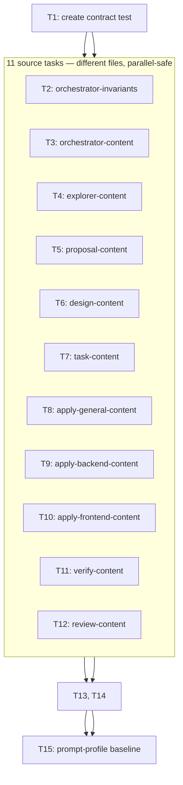

# Tasks: Improve User Phase Communication

## General Plan

15 atomic tasks in 3 deterministic execution groups. All work targets canonical Developer Team prompt/instruction content in `packages/core/src/teams/developer/`. Routing: `deck-developer-apply-general` for all tasks (shared, cross-cutting, prompt content — not backend or frontend). Apply is blocked by PC-1.

## Consumption Rules (preserved from Design)

Every task carries its originating requirement, acceptance scenario, EII ID, mode, required block or semantic constraints, excluded targets, rollout gate, rollback boundary, and ambiguity-stop behavior. Apply executes, never redesigns. Byte-verbatim means emitted prompt bytes. Semantic-constrained means every listed clause is mandatory. One target per EII. Ambiguity stops with `design-instruction-ambiguous`. Ownership hard stops: Apply blocked by `developer-team-execution-convergence`; any `runner-capability-standardization` intersection is `excluded-scope`.

## Excluded Targets (all tasks)

`content-registry.ts`, `catalog.ts`, `manifest.ts`, adapter implementation, runtime contracts, registry schemas/serializers, CLI/TUI, package metadata, generated assets, `state.yaml`, `events.yaml`, all other OpenSpec changes/history, and every `runner-capability-standardization` target are read-only.

## Rollback Boundary (all tasks)

Revert canonical prompt-content and focused test changes as one coherent source change. Restore prior legacy baseline constants from prior canonical source. Rematerialize runner-native files through existing adapter tooling only when needed. Preserve OpenSpec artifacts, approval/rejection evidence, append-only events, and rollback evidence. Never rewrite registry history. Leave `runner-capability-standardization` and unrelated WIP untouched. No destructive Git operations.

## Rollout Gate (all tasks)

1. Ownership gate: no Apply batch until `developer-team-execution-convergence` closes or explicit handoff/rebase.
2. Freshness check at handoff: re-read all target symbols and profile baseline. Drift returns to Design with `design-instruction-ambiguous`.
3. Canonical activation: compact changes immediately (existing default); legacy ships as compatibility content.
4. Derivative materialization: existing adapter install/materialization tooling only. No derivative file edits.
5. No flag or migration.

---

## Group 0: RED — TDD Setup

### T1: Create canonical contract test suite

- **Owner**: `deck-developer-apply-general`
- **Priority**: P0
- **Complexity**: High
- **Parallel**: No (first task, no source exists yet)
- **Depends on**: None
- **EIIs**: All 67 (assertion coverage for every EII prefix)
- **Requirements**: REQ-DESIGN-004, REQ-COMPAT-001, REQ-COMPAT-002, REQ-COMPAT-007
- **Scenarios**: Focused regression assertions are machine-checkable; fidelity contract shared across all Apply roles and profiles; compact budget preserved; `runner-capability-standardization` is not touched
- **Files**: `packages/core/src/teams/developer/user-phase-communication.test.ts` (create)
- **Mode**: Test creation (RED state — assertions fail because prompt content not yet changed)
- **Content**: Create one table-driven test boundary asserting:
  - `UPC-INTAKE-01`: Orchestrator session/agent/skill; compact and legacy; guia and pragmatica — exact `BV-INTAKE-ALIGNMENT` present; all four categories, trivial exemption, bounded discovery, three-cycle bound, separate modification authorization present.
  - `UPC-INTAKE-02`: `INV_004_SDD_TRIAGE_GATE` and compact invariant entry — `requiredAction` contains exact full block; compact summary equals `BV-INTAKE-COMPACT-SUMMARY`; no seventh invariant introduced.
  - `UPC-COMMS-01`: Orchestrator session and skill, both profiles and personalities — every phase in `SC-PHASE-MATRIX` and its minimum invariant present; artifact detail explicitly separate.
  - `UPC-COMMS-02`: Orchestrator common/skill content — exact `BV-FAILURE-DECISION-GATE` present; Apply low-noise; diagrams conditional/non-blocking; old universal-diagram command absent.
  - `UPC-PERSONALITY-01`: Both personality constants and all composed session variants — exact content-preserving block in both; exact revised Pragmatica block; unconditional "Phase completions get one line" absent; shared invariant content precedes overlay.
  - `UPC-PROPOSAL-01`: Proposal agent and skill, both profiles — exact collaboration block; approval not inferred; next handoff conditional on recorded approval.
  - `UPC-DESIGN-01`: Design agent and skill, both profiles — exact authority/EII blocks; heading, both modes, required fields, safe mode rules, target list, EII return summary present.
  - `UPC-TASK-01`: Task agent and skill, both profiles — exact Task fidelity blocks; requirement/scenario/EII/exclusion/rollout/rollback fields and blocker code present.
  - `UPC-APPLY-01`: General, Backend, Frontend agent and skill; both profiles — exact agent/skill fidelity blocks once per raw target; byte/semantic execution rules and `design-instruction-ambiguous` present; no role permits redesign.
  - `UPC-FAILURE-01`: Verify and Review agent/skill; both profiles — failure return semantics include what failed, significance/impact, blocking status, next action while preserving report anchors.
  - `UPC-EXPLORER-01`: Explorer agent/skill; both profiles — return/handoff exposes findings, risks, assumptions, open decisions, confidence/evidence, blockers without user-facing authority.
  - `UPC-SCOPE-01`: Exact intended source/test target list — no target is generated, adapter implementation, registry/runtime schema, CLI/TUI, another OpenSpec change, or `runner-capability-standardization`.
- **Byte-verbatim tests**: compare complete multiline block against exported/composed strings, not keyword bags.
- **Semantic tests**: table-driven clause assertions and explicit negative assertions for forbidden drift.
- **RED verification**: `bun test packages/core/src/teams/developer/user-phase-communication.test.ts` — all assertions fail (prompt content unchanged).
- **GREEN signal**: All assertions pass after T2–T12 complete.
- **Completion evidence**: Test file exists, RED run confirms failure, test passes after source changes.

---

## Group 1: GREEN — Source Implementation (parallel-safe across different files)

All tasks in this group edit different files with no shared symbols. Safe to parallelize after PC-1 resolves. Each depends on T1 (RED exists).

### T2: Extend orchestrator invariants

- **Owner**: `deck-developer-apply-general`
- **Priority**: P1
- **Complexity**: Medium
- **Parallel**: Yes (different file from T3–T12)
- **Depends on**: T1
- **EIIs**: `EII-INTAKE-INV004`, `EII-INTAKE-INV004-METADATA`, `EII-INTAKE-COMPACT-INV004`
- **Requirements**: REQ-INTAKE-001, REQ-INTAKE-002, REQ-INTAKE-003, REQ-INTAKE-004, REQ-INTAKE-005, REQ-INTAKE-006
- **Scenarios**: Non-trivial intake restates scattered input; trivial direct edit bypasses; bounded read-only discovery; restatement revision loops; modification gate is separate; intake across surfaces
- **Files**: `packages/core/src/teams/developer/orchestrator-invariants.ts`
- **Symbols**: `INV_004_SDD_TRIAGE_GATE.requiredAction`; `INV_004_SDD_TRIAGE_GATE` (`condition`, `rationale`, `violationConsequence`, `sourceRefs`); `COMPACT_ORCHESTRATOR_INVARIANT_SUMMARIES_V1` (`INV-004` entry)
- **EII details**:
  - `EII-INTAKE-INV004` — `INV_004_SDD_TRIAGE_GATE.requiredAction`; mode `byte-verbatim` using `BV-INTAKE-ALIGNMENT`. Preserve ID `INV-004`, critical tier, all surfaces, exact taxonomy, and separate authorization; do not add a new invariant.
  - `EII-INTAKE-INV004-METADATA` — `INV_004_SDD_TRIAGE_GATE` (`condition`, `rationale`, `violationConsequence`, `sourceRefs` only); mode `semantic-constrained`. Cover substantial work, bounded read-only discovery, normalized restatement, explicit confirmation, trivial exemption, three-cycle escalation, and separate modification authorization. Preserve existing schema, ID, title, tier, and surfaces; replace brittle line-number references with named current section.
  - `EII-INTAKE-COMPACT-INV004` — `COMPACT_ORCHESTRATOR_INVARIANT_SUMMARIES_V1` (`INV-004` entry); mode `byte-verbatim` using `BV-INTAKE-COMPACT-SUMMARY`. Preserve all other entries and order.
- **BV-INTAKE-ALIGNMENT** (byte-verbatim): `For every non-trivial request, before any substantial work, classify the request as exactly one of Direct, Specialist(s), Recommend SDD, or Run SDD; record the classification and its reason in the delegation or phase return, and expose both to the user when consequential work begins. You may perform bounded read-only discovery only to resolve ambiguity. Then restate the user's intent, assumptions, open questions, risks, and consequential choices and obtain explicit confirmation that the restatement is correct. Trivial direct edits are exempt. Restatement confirmation does not authorize modification; modification authorization remains a separate later gate.\n\nIf the user revises the restatement, revise it and do not advance. Permit at most three user-requested revision cycles after the initial restatement; on a fourth revision request, stop and escalate the unresolved ambiguity rather than auto-confirming. If the user declines, record the decision and stop.`
- **BV-INTAKE-COMPACT-SUMMARY** (byte-verbatim): `Classify every request; for non-trivial work allow only bounded read-only discovery, then restate and obtain confirmation before substantial work. Trivial Direct edits are exempt; modification authorization remains separate.`
- **Assertion IDs**: `UPC-INTAKE-01`, `UPC-INTAKE-02`; existing `orchestrator-invariants.test.ts` also affected.
- **Preserved constraints**: Existing schema, ID, title, tier, surfaces, all other invariant entries and order. No seventh invariant.
- **RED**: T1 assertions fail on invariants. **GREEN**: exact block present, metadata clauses satisfied, compact summary exact.
- **Completion evidence**: `bun test packages/core/src/teams/developer/user-phase-communication.test.ts` + `orchestrator-invariants.test.ts` pass.

### T3: Extend orchestrator content (intake, comms, failure, personality)

- **Owner**: `deck-developer-apply-general`
- **Priority**: P1
- **Complexity**: High
- **Parallel**: Yes (different file from T2, T4–T12)
- **Depends on**: T1
- **EIIs** (20): `EII-ORCH-LEGACY-SESSION-INTAKE`, `EII-ORCH-COMPACT-SESSION-INTAKE`, `EII-ORCH-LEGACY-AGENT-INTAKE`, `EII-ORCH-COMPACT-AGENT-INTAKE`, `EII-ORCH-LEGACY-SKILL-INTAKE`, `EII-ORCH-COMPACT-SKILL-INTAKE`, `EII-ORCH-LEGACY-SESSION-COMMS`, `EII-ORCH-COMPACT-SESSION-COMMS`, `EII-ORCH-LEGACY-AGENT-COMMS`, `EII-ORCH-COMPACT-AGENT-COMMS`, `EII-ORCH-LEGACY-SKILL-COMMS`, `EII-ORCH-COMPACT-SKILL-COMMS`, `EII-ORCH-LEGACY-SESSION-FAILURE`, `EII-ORCH-COMPACT-SESSION-FAILURE`, `EII-ORCH-LEGACY-AGENT-FAILURE`, `EII-ORCH-COMPACT-AGENT-FAILURE`, `EII-ORCH-LEGACY-SKILL-FAILURE`, `EII-ORCH-COMPACT-SKILL-FAILURE`, `EII-PERSONALITY-GUIA`, `EII-PERSONALITY-PRAGMATICA`
- **Requirements**: REQ-INTAKE-001, REQ-INTAKE-004, REQ-INTAKE-006, REQ-COMMS-001 through REQ-COMMS-006, REQ-FAILURE-001, REQ-FAILURE-003, REQ-PERSONALITY-001, REQ-PERSONALITY-002, REQ-PERSONALITY-003
- **Scenarios**: Non-trivial intake restates; trivial bypass; intake across surfaces; each phase summary matches matrix; Apply low-noise; Verify/Review failure summary; diagram conditional; personality does not hide decisions; blocking finding anchored; Orchestrator does not auto-retry
- **Files**: `packages/core/src/teams/developer/orchestrator-content.ts`
- **Symbols**: `ORCHESTRATOR_SYSTEM_PROMPT`, `ORCHESTRATOR_SYSTEM_PROMPT_COMPACT`, `ORCHESTRATOR_AGENT_BODY`, `ORCHESTRATOR_COMPACT_AGENT_BODY`, `ORCHESTRATOR_SKILL_BODY`, `ORCHESTRATOR_COMPACT_SKILL_BODY`, `PERSONALITY_COMMUNICATION_GUIDA`, `PERSONALITY_COMMUNICATION_PRAGMATICA`
- **EII details**:
  - **Intake EIIs** (6): Each of the 6 Orchestrator symbols (`ORCHESTRATOR_SYSTEM_PROMPT`, `_COMPACT`, `ORCHESTRATOR_AGENT_BODY`, `_COMPACT`, `ORCHESTRATOR_SKILL_BODY`, `_COMPACT`) — mode `byte-verbatim` using `BV-INTAKE-ALIGNMENT`. Retain four category definitions, modification checklist, compact runtime authority, hard stops, delegation identity/triggers, category guidance, dependency flow, normalized result, and deterministic routing rules as specified per EII.
  - **Comms EIIs** (6): Same 6 symbols — mode `semantic-constrained` using `SC-PHASE-MATRIX`. Preserve user-language, artifact-authority, safety, execution-mode clauses. Compact expressed without dropping a phase or invariant. Replace mandatory diagram wording with conditional usefulness language; preserve all existing safety/registry guidance.
  - **Failure EIIs** (6): Same 6 symbols — mode `byte-verbatim`, add `BV-FAILURE-DECISION-GATE`. Let it constrain rather than delete deterministic diagnostic routing. Preserve non-modifying diagnosis.
  - **Personality EIIs** (2):
    - `EII-PERSONALITY-GUIA` — `PERSONALITY_COMMUNICATION_GUIDA`; mode `byte-verbatim`: add `BV-PERSONALITY-CONTENT-PRESERVING`. Preserve teaching style and progressive disclosure.
    - `EII-PERSONALITY-PRAGMATICA` — `PERSONALITY_COMMUNICATION_PRAGMATICA`; mode `byte-verbatim`: add `BV-PERSONALITY-CONTENT-PRESERVING` and replace existing unconditional signal-only line with `BV-PRAGMATICA-SIGNAL-ONLY`. Preserve default personality and efficient style.
- **BV-FAILURE-DECISION-GATE** (byte-verbatim): `After Verify or Review reports a failure, do not auto-retry modification and do not auto-advance. First present what failed, why it matters, the next decision or action, and any rollback-relevant behavior to the user, then wait for the user's explicit decision; existing modification authorization remains a separate gate.`
- **BV-PERSONALITY-CONTENT-PRESERVING** (byte-verbatim): `- **Content-preserving overlay**: Apply this style only after the phase summary's invariant decisions, blockers, approval requests, failures, open questions, risks, and required authorizations have been composed. Do not remove, weaken, hide, or reorder that content.`
- **BV-PRAGMATICA-SIGNAL-ONLY** (byte-verbatim): `- **Signal-only status updates**: Routine progress may use one line only when no invariant content is lost. Give blockers, approval requests, failures, decisions, open questions, and required authorizations enough space to be explicit.`
- **SC-PHASE-MATRIX** (semantic): 9-phase matrix (Explore, Proposal, Spec, Design, Tasks, Apply, Verify, Review, Archive) with required invariant content and boundary per phase. Additional mandatory clauses: user's language, one Interactive decision prompt, no removing blocker for brevity, personality after invariant content, conditional Mermaid, replace legacy unconditional diagram rule, Orchestrator may classify failure but `BV-FAILURE-DECISION-GATE` forbids another modifying launch.
- **Assertion IDs**: `UPC-INTAKE-01`, `UPC-COMMS-01`, `UPC-COMMS-02`, `UPC-FAILURE-01`, `UPC-PERSONALITY-01`; existing `orchestrator-content.test.ts` also affected.
- **Preserved constraints**: Derived composed constants/functions unchanged. Composition order unchanged. All existing safety/registry guidance.
- **RED**: T1 assertions fail on orchestrator content. **GREEN**: all exact blocks present, matrix clauses satisfied, personality overlay rules enforced.
- **Completion evidence**: `bun test` on contract test + `orchestrator-content.test.ts` pass.

### T4: Extend explorer content

- **Owner**: `deck-developer-apply-general`
- **Priority**: P1
- **Complexity**: Low
- **Parallel**: Yes (different file)
- **Depends on**: T1
- **EIIs** (4): `EII-EXP-LEGACY-AGENT`, `EII-EXP-LEGACY-SKILL`, `EII-EXP-COMPACT-AGENT`, `EII-EXP-COMPACT-SKILL`
- **Requirements**: REQ-COMMS-001 (explorer return contract)
- **Scenarios**: Each phase summary matches matrix; bounded read-only discovery does not commit planning
- **Files**: `packages/core/src/teams/developer/explorer-content.ts`
- **Symbols**: `EXPLORER_AGENT_BODY`, `EXPLORER_SKILL_BODY`, `EXPLORER_COMPACT_AGENT_BODY`, `EXPLORER_COMPACT_SKILL_BODY`
- **EII details**: All 4 — mode `semantic-constrained` using `SC-EXPLORER-HANDOFF` for Return Contract only. Agent/skill return must identify key findings, risks, assumptions, open decisions, confidence, evidence references, and blockers. Do not reduce `exploration.md`, authorize product decisions, or make Explorer user-facing. Compact skill: apply in `Artifact and Return` section.
- **SC-EXPLORER-HANDOFF** (semantic): Explorer agent and skill content, in both profiles, must make the phase return identify key findings, risks, assumptions, open decisions, confidence, evidence references, and blockers. This augments the return only; must not reduce `exploration.md`, authorize product decisions, or make Explorer user-facing.
- **Assertion IDs**: `UPC-EXPLORER-01`; existing Explorer content suite runs unchanged.
- **RED**: T1 `UPC-EXPLORER-01` fails. **GREEN**: all four returns expose required handoff data.
- **Completion evidence**: `bun test` on contract test + existing Explorer content suite pass.

### T5: Extend proposal content

- **Owner**: `deck-developer-apply-general`
- **Priority**: P1
- **Complexity**: Medium
- **Parallel**: Yes (different file)
- **Depends on**: T1
- **EIIs** (8): `EII-PROP-LEGACY-AGENT`, `EII-PROP-LEGACY-SKILL`, `EII-PROP-COMPACT-AGENT`, `EII-PROP-COMPACT-SKILL`, `EII-PROP-LEGACY-AGENT-HANDOFF`, `EII-PROP-LEGACY-SKILL-HANDOFF`, `EII-PROP-COMPACT-AGENT-HANDOFF`, `EII-PROP-COMPACT-SKILL-HANDOFF`
- **Requirements**: REQ-PROPOSAL-001, REQ-PROPOSAL-002, REQ-PROPOSAL-003, REQ-PROPOSAL-004
- **Scenarios**: Proposal advances only on explicit human approval evidence; proposal summary surfaces consequential choices; proposal revision or rejection recorded
- **Files**: `packages/core/src/teams/developer/proposal-content.ts`
- **Symbols**: `PROPOSAL_AGENT_BODY`, `PROPOSAL_SKILL_BODY`, `PROPOSAL_COMPACT_AGENT_BODY`, `PROPOSAL_COMPACT_SKILL_BODY`
- **EII details**:
  - **Collaboration EIIs** (4): All 4 symbols — mode `byte-verbatim`, add `BV-PROPOSAL-COLLABORATION`. Legacy skill: preserve complete proposal sections.
  - **Handoff EIIs** (4): Same 4 symbols (Return Contract / boundary / next-step sections only) — mode `semantic-constrained` using `SC-PROPOSAL-OWNER-FRAMING`. Handoff must await recorded approval; must not say Orchestrator will advance immediately. Replace unconditional advancement with approval-waiting condition. Compact skill: apply in `Artifact and Return` with conditional next handoff.
- **BV-PROPOSAL-COLLABORATION** (byte-verbatim): `Treat \`proposal.md\` as a collaborative draft and revision loop. Creating or revising the draft never constitutes approval. Preserve prior decisions, dependencies, risks, rollback, and unresolved decisions on every revision. Return the consequential choices and a specific approval question. Only the Orchestrator may record explicit human approval evidence; Spec and Design must not begin until that evidence exists.`
- **SC-PROPOSAL-OWNER-FRAMING** (semantic): Proposal content must provide enough information for the Orchestrator to frame the user as client, system owner, domain authority, and active stakeholder. Next-step language must say approval is awaited; "ready for Spec and Design" permitted only as conditional after recorded approval. Reuse existing human approval/rejection event types.
- **Assertion IDs**: `UPC-PROPOSAL-01`; existing Proposal content suite runs unchanged.
- **RED**: T1 `UPC-PROPOSAL-01` fails. **GREEN**: exact collaboration block present, approval not inferred, next handoff conditional.
- **Completion evidence**: `bun test` on contract test + existing Proposal content suite pass.

### T6: Extend design content

- **Owner**: `deck-developer-apply-general`
- **Priority**: P1
- **Complexity**: Medium
- **Parallel**: Yes (different file)
- **Depends on**: T1
- **EIIs** (8): `EII-DESIGN-LEGACY-AGENT`, `EII-DESIGN-LEGACY-SKILL`, `EII-DESIGN-COMPACT-AGENT`, `EII-DESIGN-COMPACT-SKILL`, `EII-DESIGN-LEGACY-AGENT-RETURN`, `EII-DESIGN-LEGACY-SKILL-RETURN`, `EII-DESIGN-COMPACT-AGENT-RETURN`, `EII-DESIGN-COMPACT-SKILL-RETURN`
- **Requirements**: REQ-DESIGN-001, REQ-DESIGN-002, REQ-DESIGN-003, REQ-DESIGN-004, REQ-DESIGN-005
- **Scenarios**: Design publishes EIIs with explicit mode; mode chosen safely; focused assertions machine-checkable; existing Design sections remain
- **Files**: `packages/core/src/teams/developer/design-content.ts`
- **Symbols**: `DESIGN_AGENT_BODY`, `DESIGN_SKILL_BODY`, `DESIGN_COMPACT_AGENT_BODY`, `DESIGN_COMPACT_SKILL_BODY`
- **EII details**:
  - **Authority EIIs** (4): Legacy agent + compact agent — mode `byte-verbatim`, add `BV-DESIGN-AGENT-AUTHORITY`. Legacy skill + compact skill — mode `byte-verbatim`, add `BV-DESIGN-EII-CONTRACT` in existing output template. Preserve current role boundaries.
  - **Return EIIs** (4): Same 4 symbols (Return Contract / output template / return-facing boundary / Artifact and Return sections only) — mode `semantic-constrained` using `SC-DESIGN-RETURN`. Retain every existing Design section. Compact skill: add target/EII summary.
- **BV-DESIGN-AGENT-AUTHORITY** (byte-verbatim): `When the change modifies Deck-owned prompts, skills, or system instructions, Design—not Tasks or Apply—must reason about and define the change in a stable \`## Exact Implementation Instructions\` section. Do not complete Design with an ambiguous target, missing mode, or untestable instruction.`
- **BV-DESIGN-EII-CONTRACT** (byte-verbatim): The full `## Exact Implementation Instructions` section template including: one EII per canonical symbol, mode declaration, required change, preserved constraints, affected tests, prohibited reinterpretations, ambiguity-stop. Use `byte-verbatim` for security/authorization/destructive text; do not use for user-language/personality/data/composition-dependent text.
- **SC-DESIGN-RETURN** (semantic): Both Design profiles must retain technical-lead prose, architecture, file impact, testing, tradeoffs, risks, dependencies, open decisions. Return adds exact editable target list and EII summary. EII section is additive and conditional, not replacement template.
- **Assertion IDs**: `UPC-DESIGN-01`; existing Design content suite runs unchanged.
- **RED**: T1 `UPC-DESIGN-01` fails. **GREEN**: exact authority/EII blocks present, return contract satisfies SC-DESIGN-RETURN.
- **Completion evidence**: `bun test` on contract test + existing Design content suite pass.

### T7: Extend task content

- **Owner**: `deck-developer-apply-general`
- **Priority**: P1
- **Complexity**: Low
- **Parallel**: Yes (different file)
- **Depends on**: T1
- **EIIs** (4): `EII-TASK-LEGACY-AGENT`, `EII-TASK-LEGACY-SKILL`, `EII-TASK-COMPACT-AGENT`, `EII-TASK-COMPACT-SKILL`
- **Requirements**: REQ-FIDELITY-001
- **Scenarios**: Tasks preserve Design direction without reinterpretation
- **Files**: `packages/core/src/teams/developer/task-content.ts`
- **Symbols**: `TASK_AGENT_BODY`, `TASK_SKILL_BODY`, `TASK_COMPACT_AGENT_BODY`, `TASK_COMPACT_SKILL_BODY`
- **EII details**:
  - Legacy agent + compact agent — mode `byte-verbatim` using `BV-TASK-AGENT-FIDELITY`. Preserve owner/routing boundaries.
  - Legacy skill + compact skill — mode `byte-verbatim` using `BV-TASK-EII-FIDELITY`. Add EII fields to each applicable task and self-check without weakening atomic tasks. Retain exact-target, RED/GREEN, routing, and blocker fields.
- **BV-TASK-AGENT-FIDELITY** (byte-verbatim): `Preserve every Design Exact Implementation Instruction by EII ID and canonical target; do not reinterpret, dilute, replace, or summarize it away. Missing, ambiguous, conflicting, or infeasible direction blocks with \`design-instruction-ambiguous\`.`
- **BV-TASK-EII-FIDELITY** (byte-verbatim): `For each task, carry the originating requirement and acceptance scenario, Design constraint and EII ID, EII mode and exact text or semantic constraints, excluded targets, rollout condition, and rollback boundary. A \`byte-verbatim\` EII must reference its exact target and fenced text; a \`semantic-constrained\` EII must carry every declared clause, invariant, intent, and prohibition. If any required Design direction is missing, ambiguous, conflicting, or infeasible, stop task generation for that target and return blocker \`design-instruction-ambiguous\`; do not invent a decision for Apply.`
- **Assertion IDs**: `UPC-TASK-01`; existing Task content suite runs unchanged.
- **RED**: T1 `UPC-TASK-01` fails. **GREEN**: exact fidelity blocks present, EII fields and blocker code present.
- **Completion evidence**: `bun test` on contract test + existing Task content suite pass.

### T8: Extend apply-general content

- **Owner**: `deck-developer-apply-general`
- **Priority**: P1
- **Complexity**: Low
- **Parallel**: Yes (different file)
- **Depends on**: T1
- **EIIs** (4): `EII-APPLY-GENERAL-LEGACY-AGENT`, `EII-APPLY-GENERAL-LEGACY-SKILL`, `EII-APPLY-GENERAL-COMPACT-AGENT`, `EII-APPLY-GENERAL-COMPACT-SKILL`
- **Requirements**: REQ-FIDELITY-002, REQ-FIDELITY-003, REQ-FIDELITY-004
- **Scenarios**: Apply executes without redesign; Apply preserves semantic clauses; ambiguity blocks and escalates; fidelity shared across Apply roles and profiles
- **Files**: `packages/core/src/teams/developer/apply-general-content.ts`
- **Symbols**: `APPLY_GENERAL_AGENT_BODY`, `APPLY_GENERAL_SKILL_BODY`, `APPLY_GENERAL_COMPACT_AGENT_BODY`, `APPLY_GENERAL_COMPACT_SKILL_BODY`
- **EII details**:
  - Legacy agent + compact agent — mode `byte-verbatim`, add `BV-APPLY-AGENT-FIDELITY`.
  - Legacy skill + compact skill — mode `byte-verbatim`, add `BV-APPLY-EII-FIDELITY` before implementation steps and require blocker code in Return.
- **BV-APPLY-AGENT-FIDELITY** (byte-verbatim): `For Deck prompt or system-instruction work, execute the named Design EII without redesign. Missing, ambiguous, conflicting, or infeasible direction blocks with \`design-instruction-ambiguous\`; do not invent a substitute.`
- **BV-APPLY-EII-FIDELITY** (byte-verbatim): `Execute each named Design EII exactly as routed by Tasks; do not redesign prompt or system-instruction behavior. For \`byte-verbatim\`, reproduce the emitted prompt text exactly, including whitespace and punctuation. For \`semantic-constrained\`, preserve every declared clause, invariant, intent, and prohibition. If an EII is missing, ambiguous, conflicting, infeasible, or cannot be placed at its named canonical target, make no affected edit and return blocker \`design-instruction-ambiguous\`; do not invent, substitute, or reinterpret prompt behavior.`
- **Preserved constraints**: Existing modification gate, authorization behavior, Git safety, domain boundary, checks, centralized registry contract.
- **Assertion IDs**: `UPC-APPLY-01`; existing General Apply content suite runs unchanged.
- **RED**: T1 `UPC-APPLY-01` fails. **GREEN**: exact agent/skill fidelity blocks present once per raw target, blocker code present, no redesign permitted.
- **Completion evidence**: `bun test` on contract test + existing General Apply content suite pass.

### T9: Extend apply-backend content

- **Owner**: `deck-developer-apply-general`
- **Priority**: P1
- **Complexity**: Low
- **Parallel**: Yes (different file)
- **Depends on**: T1
- **EIIs** (4): `EII-APPLY-BACKEND-LEGACY-AGENT`, `EII-APPLY-BACKEND-LEGACY-SKILL`, `EII-APPLY-BACKEND-COMPACT-AGENT`, `EII-APPLY-BACKEND-COMPACT-SKILL`
- **Requirements**: REQ-FIDELITY-002, REQ-FIDELITY-003, REQ-FIDELITY-004
- **Scenarios**: Same as T8
- **Files**: `packages/core/src/teams/developer/apply-backend-content.ts`
- **Symbols**: `APPLY_BACKEND_AGENT_BODY`, `APPLY_BACKEND_SKILL_BODY`, `APPLY_BACKEND_COMPACT_AGENT_BODY`, `APPLY_BACKEND_COMPACT_SKILL_BODY`
- **EII details**: Identical pattern to T8 using `BV-APPLY-AGENT-FIDELITY` and `BV-APPLY-EII-FIDELITY` (byte-verbatim blocks as specified in T8).
- **Assertion IDs**: `UPC-APPLY-01`; existing Backend Apply content suite runs unchanged.
- **RED**: T1 `UPC-APPLY-01` fails. **GREEN**: fidelity blocks present, blocker code present.
- **Completion evidence**: `bun test` on contract test + existing Backend Apply content suite pass.

### T10: Extend apply-frontend content

- **Owner**: `deck-developer-apply-general`
- **Priority**: P1
- **Complexity**: Low
- **Parallel**: Yes (different file)
- **Depends on**: T1
- **EIIs** (4): `EII-APPLY-FRONTEND-LEGACY-AGENT`, `EII-APPLY-FRONTEND-LEGACY-SKILL`, `EII-APPLY-FRONTEND-COMPACT-AGENT`, `EII-APPLY-FRONTEND-COMPACT-SKILL`
- **Requirements**: REQ-FIDELITY-002, REQ-FIDELITY-003, REQ-FIDELITY-004
- **Scenarios**: Same as T8
- **Files**: `packages/core/src/teams/developer/apply-frontend-content.ts`
- **Symbols**: `APPLY_FRONTEND_AGENT_BODY`, `APPLY_FRONTEND_SKILL_BODY`, `APPLY_FRONTEND_COMPACT_AGENT_BODY`, `APPLY_FRONTEND_COMPACT_SKILL_BODY`
- **EII details**: Identical pattern to T8 using `BV-APPLY-AGENT-FIDELITY` and `BV-APPLY-EII-FIDELITY` (byte-verbatim blocks as specified in T8).
- **Assertion IDs**: `UPC-APPLY-01`; existing Frontend Apply content suite runs unchanged.
- **RED**: T1 `UPC-APPLY-01` fails. **GREEN**: fidelity blocks present, blocker code present.
- **Completion evidence**: `bun test` on contract test + existing Frontend Apply content suite pass.

### T11: Extend verify content

- **Owner**: `deck-developer-apply-general`
- **Priority**: P1
- **Complexity**: Low
- **Parallel**: Yes (different file)
- **Depends on**: T1
- **EIIs** (4): `EII-VERIFY-LEGACY-AGENT`, `EII-VERIFY-LEGACY-SKILL`, `EII-VERIFY-COMPACT-AGENT`, `EII-VERIFY-COMPACT-SKILL`
- **Requirements**: REQ-FAILURE-001, REQ-FAILURE-002
- **Scenarios**: Verify failure summary understandable without report; blocking finding is anchored
- **Files**: `packages/core/src/teams/developer/verify-content.ts`
- **Symbols**: `VERIFY_AGENT_BODY`, `VERIFY_SKILL_BODY`, `VERIFY_COMPACT_AGENT_BODY`, `VERIFY_COMPACT_SKILL_BODY`
- **EII details**: All 4 — mode `semantic-constrained` using Verify clauses in `SC-FAILURE-RETURNS`. Legacy skill: add four failure meanings to exact return template, preserve all anchored evidence. Compact agent: require same four meanings. Compact skill: require same meanings in immutable result. Preserve independent compliance scope.
- **SC-FAILURE-RETURNS (Verify)** (semantic): Verify agent and skill returns, in both profiles, must state on failure: what failed, why it matters to the user/change, whether it is blocking, and the next decision/action. Full anchors remain in `verify-report.md`. Internal specialist returns remain English. Neither role implements a fix, changes requirements, or weakens independent judgment.
- **Assertion IDs**: `UPC-FAILURE-01`; existing Verify content suite runs unchanged.
- **RED**: T1 `UPC-FAILURE-01` fails. **GREEN**: failure return semantics include all four meanings, report anchors preserved.
- **Completion evidence**: `bun test` on contract test + existing Verify content suite pass.

### T12: Extend review content

- **Owner**: `deck-developer-apply-general`
- **Priority**: P1
- **Complexity**: Low
- **Parallel**: Yes (different file)
- **Depends on**: T1
- **EIIs** (4): `EII-REVIEW-LEGACY-AGENT`, `EII-REVIEW-LEGACY-SKILL`, `EII-REVIEW-COMPACT-AGENT`, `EII-REVIEW-COMPACT-SKILL`
- **Requirements**: REQ-FAILURE-001, REQ-FAILURE-002
- **Scenarios**: Review failure summary understandable without report; blocking finding is anchored
- **Files**: `packages/core/src/teams/developer/review-content.ts`
- **Symbols**: `REVIEW_AGENT_BODY`, `REVIEW_SKILL_BODY`, `REVIEW_COMPACT_AGENT_BODY`, `REVIEW_COMPACT_SKILL_BODY`
- **EII details**: All 4 — mode `semantic-constrained` using Review clauses in `SC-FAILURE-RETURNS`. Legacy skill: add four failure meanings to exact return template, preserve anchors/severity. Compact agent: require same four meanings. Compact skill: require same meanings in immutable result. Preserve independent engineering-quality scope.
- **SC-FAILURE-RETURNS (Review)** (semantic): Review agent and skill returns, in both profiles, must state on requested changes: what failed, impact, whether it is blocking, and the next decision/action. Full anchors remain in `review-report.md`. Internal specialist returns remain English. Neither role implements a fix, changes requirements, or weakens independent judgment.
- **Assertion IDs**: `UPC-FAILURE-01`; existing Review content suite runs unchanged.
- **RED**: T1 `UPC-FAILURE-01` fails. **GREEN**: failure return semantics include all four meanings, anchors/severity preserved.
- **Completion evidence**: `bun test` on contract test + existing Review content suite pass.

---

## Group 2: Test Updates (after all source changes)

### T13: Update orchestrator-content test assertions

- **Owner**: `deck-developer-apply-general`
- **Priority**: P2
- **Complexity**: Medium
- **Parallel**: Yes (different file from T14, T15)
- **Depends on**: T3 (source changes must be complete)
- **EIIs**: `EII-ORCH-*-COMMS`, `EII-ORCH-*-FAILURE`, `EII-PERSONALITY-*` (assertion updates)
- **Requirements**: REQ-COMMS-005, REQ-PERSONALITY-001
- **Scenarios**: Diagram is conditional and never required; personality does not hide decisions or blockers
- **Files**: `packages/core/src/teams/developer/orchestrator-content.test.ts`
- **Changes**:
  - Replace mandatory phase-diagram expectation with conditional/non-authoritative/non-blocking assertions.
  - Assert personality cannot hide blockers, approval requests, failures, decisions, or authorizations.
  - Retain existing composition, default personality, language, safety, and triage checks.
- **RED**: Existing assertions fail against changed source (stale diagram/personality expectations). **GREEN**: updated assertions pass.
- **Completion evidence**: `bun test packages/core/src/teams/developer/orchestrator-content.test.ts` passes.

### T14: Update orchestrator-invariants test assertions

- **Owner**: `deck-developer-apply-general`
- **Priority**: P2
- **Complexity**: Medium
- **Parallel**: Yes (different file from T13, T15)
- **Depends on**: T2 (source changes must be complete)
- **EIIs**: `EII-INTAKE-*` (assertion updates)
- **Requirements**: REQ-INTAKE-002, REQ-INTAKE-004, REQ-INTAKE-005, REQ-INTAKE-006
- **Scenarios**: Non-trivial restatement; trivial bypass; intake across surfaces; restatement revision loop
- **Files**: `packages/core/src/teams/developer/orchestrator-invariants.test.ts`
- **Changes**:
  - Extend `INV-004` checks to exact taxonomy, bounded discovery, restatement fields, trivial exemption, explicit confirmation, three-cycle escalation, recorded reason, and separate authorization.
  - Assert invariant count remains six and the compact `INV-004` summary is exact.
- **RED**: Existing assertions fail against changed `INV-004` source. **GREEN**: extended assertions pass.
- **Completion evidence**: `bun test packages/core/src/teams/developer/orchestrator-invariants.test.ts` passes.

### T15: Recompute prompt-profile legacy baseline

- **Owner**: `deck-developer-apply-general`
- **Priority**: P2
- **Complexity**: Medium
- **Parallel**: No (must run after ALL source changes T2–T12)
- **Depends on**: T2, T3, T4, T5, T6, T7, T8, T9, T10, T11, T12 (all source changes complete)
- **EIIs**: Every EII (compact/legacy budget and pass-through evidence)
- **Requirements**: REQ-COMPAT-002, REQ-COMPAT-003, REQ-COMPAT-004
- **Scenarios**: Compact profile budget is preserved; generated outputs are not edited; adapter pass-through preserved
- **Files**: `packages/core/src/teams/developer/prompt-profile.test.ts`
- **Changes**:
  - Recompute `LEGACY_BYTES`, `LEGACY_LEXICAL_TOKENS`, and `LEGACY_SHA256` from canonical content after all prompt changes.
  - Keep compact default, dedicated-role, immutable runtime contract, and 70% byte/token assertions unchanged; do not raise the ceiling.
- **Preserved constraints**: 70% compact ceiling. Compact default. Immutable runtime contract. No generated file edits.
- **RED**: Existing baseline constants fail against changed canonical content. **GREEN**: recomputed baseline constants pass, 70% assertions hold.
- **Completion evidence**: `bun test packages/core/src/teams/developer/prompt-profile.test.ts` passes; 70% budget assertions hold.

---

## Complexity Summary

| Complexity | Count | Task IDs |
|---|---|---|
| Low | 7 | T4, T7, T8, T9, T10, T11, T12 |
| Medium | 6 | T2, T5, T6, T13, T14, T15 |
| High | 2 | T1, T3 |
| **Total** | **15** | |

## EII Coverage Summary

| EII Group | Count | Tasks | Assertion IDs |
|---|---|---|---|
| EII-INTAKE-* | 3 | T2 | UPC-INTAKE-01, UPC-INTAKE-02 |
| EII-ORCH-*-INTAKE | 6 | T3 | UPC-INTAKE-01 |
| EII-ORCH-*-COMMS | 6 | T3 | UPC-COMMS-01, UPC-COMMS-02 |
| EII-ORCH-*-FAILURE | 6 | T3 | UPC-COMMS-02, UPC-FAILURE-01 |
| EII-PERSONALITY-* | 2 | T3 | UPC-PERSONALITY-01 |
| EII-EXP-* | 4 | T4 | UPC-EXPLORER-01 |
| EII-PROP-* | 8 | T5 | UPC-PROPOSAL-01 |
| EII-DESIGN-* | 8 | T6 | UPC-DESIGN-01 |
| EII-TASK-* | 4 | T7 | UPC-TASK-01 |
| EII-APPLY-* | 12 | T8, T9, T10 | UPC-APPLY-01 |
| EII-VERIFY-* | 4 | T11 | UPC-FAILURE-01 |
| EII-REVIEW-* | 4 | T12 | UPC-FAILURE-01 |
| Every EII | 67 | T1, T15 | UPC-SCOPE-01; compact/legacy budget |
| **Total EIIs** | **67** | | |

## Requirement Coverage Summary

All 38 requirements (REQ-INTAKE-001–006, REQ-COMMS-001–006, REQ-PROPOSAL-001–004, REQ-DESIGN-001–005, REQ-FIDELITY-001–004, REQ-FAILURE-001–003, REQ-PERSONALITY-001–003, REQ-COMPAT-001–007) are covered across the 15 tasks. Every EII maps to its originating requirement(s) via the Design's Requirement Reconciliation table.

## Verification Plan

### Targeted

1. T1 starts in RED: `bun test packages/core/src/teams/developer/user-phase-communication.test.ts` — all assertions fail.
2. After each source task: run the new contract test + that file's existing content test independently.
3. Run existing adjacent role-content tests for every modified role file; additions must not weaken role differentiation, safety, language, or Git protection.

### Affected Area

- `content-registry.test.ts` and `manifest.test.ts` — prove composed surfaces.
- OpenCode and Pi adapter tests — prove compact/default and explicit legacy pass through unchanged adapter boundaries.
- `tsc --noEmit` — repository typecheck.
- Confirm generated/materialized files absent from changed-path set.
- Confirm no target intersects `runner-capability-standardization` or another active owner.

### Broad

- Repository-wide `bun test` under existing timeout policy.
- Re-run compact budget and deterministic canonical-content digest from final source.
- Fresh independent Verify and Review after implementation. Prompt-source changes invalidate earlier evidence.

No assertion may be weakened, skipped, or moved to generated output to obtain a pass.

## Review Workload Forecast

| Area | Focus | Effort |
|---|---|---|
| Byte-verbatim fidelity | All 12 BV blocks reproduced exactly at every named target across both profiles | High — T3 carries 23 EIIs with 4 distinct BV blocks; verify exact multiline block comparisons |
| Semantic constraint completeness | All 6 SC constraint sets fully satisfied with negative drift assertions | Medium — table-driven clause assertions across roles |
| Compact budget integrity | 70% ceiling holds after all additions; legacy baseline recomputed precisely | Medium — T15 must recompute without relaxing ceiling |
| Scope boundary | No excluded target touched; no generated file edited; no `runner-capability-standardization` intersection | Low — UPC-SCOPE-01 + changed-path audit |
| Cross-profile parity | Same behavioral contract across compact/legacy and all Apply roles | Medium — UPC-APPLY-01 across 3 roles × 2 profiles |
| Intake gate safety | Trivial exemption, bounded discovery, three-cycle bound, separate authorization | Medium — critical authorization-adjacent logic |
| Personality overlay | Content-preserving, no suppression, composition order | Medium — UPC-PERSONALITY-01 across 4 composed variants |

## Open Questions / Blockers

- **Open questions**: None. All three Spec open questions are resolved by Design.
- **Apply blocker**: PC-1 — `developer-team-execution-convergence` ownership blocks all implementation tasks.
- **Protected-scope blocker**: PC-2 — any `runner-capability-standardization` intersection is `excluded-scope`.
- **Ambiguity stop**: Any missing target, missing mode, unclear placement, conflicting direction, infeasible exact copy, or incompatibility with newer authoritative work returns `design-instruction-ambiguous` and stops Apply without modification.
- **FailureManifestV1**: None for this Task phase.
