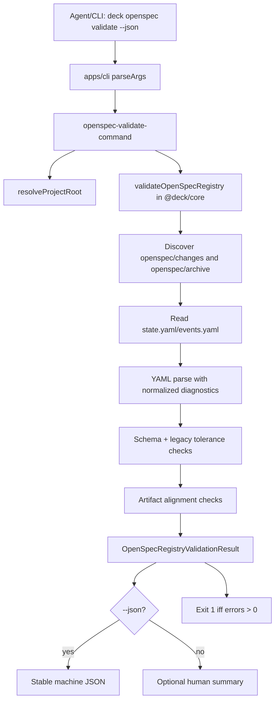
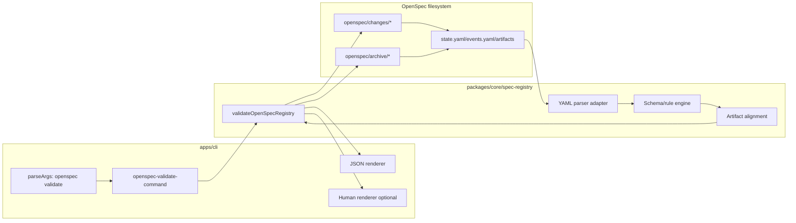

# Design: Schema canónico y validator read-only para OpenSpec Registry

## Source

- Proposal: `openspec-registry-schema-validator` proposal artifact.
- Exploration: `openspec/changes/openspec-registry-schema-validator/exploration.md`.
- User clarification: agent-first; CLI is primarily for Orchestrator/Verify/Archive/Audit via structured JSON, not human-first usage.
- Capabilities affected: `openspec-registry-schema`, `openspec-registry-validation`, `openspec-registry-cli-validation`, `openspec-documentation`.
- Spec status: not yet available / parallel.

## Current Architecture Context

- The repo already has a `packages/core/src/spec-registry/` boundary with:
  - `types.ts`: lifecycle, phase, artifact, event type constants.
  - `paths.ts`: pure OpenSpec path helpers for `openspec/changes/{name}`.
  - `events.ts`: event factory and event model exports.
  - `index.ts`: barrel export used by `packages/core/src/index.ts`.
- `@deck/core` exports its public root API from `packages/core/src/index.ts` and package subpaths through `packages/core/package.json` `exports`.
- `apps/cli/src/main.tsx` is a top-level command router using a small hand-written parser from `apps/cli/src/cli-args.ts`.
- Existing CLI commands (`doctor`, `upgrade`, `rollback`, `pi`) parse into typed `ParsedArgs`, then `main.tsx` lazy-imports command modules and exits with explicit status codes.
- Tests use `bun:test`; core tests live next to modules and CLI parser tests assert exact parsed command shapes.
- OpenSpec registry files currently live under both `openspec/changes/*` and `openspec/archive/*`. Exploration found schema drift across `state.yaml` and `events.yaml`, malformed YAML, missing event logs, and artifact/registry mismatch.

## Proposed Architecture

Create a read-only registry validator in `packages/core/src/spec-registry/` and route the CLI through it. The validator is the single source of truth for schema/version rules, legacy tolerance, artifact alignment, issue severity, and agent-readable JSON output.

The canonical schema names are:

- `spec-registry-v1` for `state.yaml`.
- `spec-registry-events-v1` for `events.yaml`.

The validator should be filesystem-aware but mutation-free: it reads registry files and artifact paths, records parse/contract/alignment issues, and never writes, normalizes, moves, or repairs any OpenSpec file.

### Component / Module Boundaries

| Component | Responsibility | Change Type |
|---|---|---|
| `packages/core/src/spec-registry/validator.ts` | Public `validateOpenSpecRegistry` API, traversal, validation orchestration, read-only result aggregation. | new |
| `packages/core/src/spec-registry/schema.ts` | Canonical constants, phase order, status sets, artifact key mapping, rule IDs. | new |
| `packages/core/src/spec-registry/yaml.ts` | YAML parsing adapter with recoverable warning/error normalization and duplicate-key reporting where parser supports it. | new |
| `packages/core/src/spec-registry/types.ts` | Add/export validator DTOs without replacing existing registry lifecycle types. | modify |
| `packages/core/src/spec-registry/index.ts` | Export validator/schema API. | modify |
| `packages/core/src/index.ts` | Continue re-exporting `./spec-registry`; no separate root export required if barrel is updated. | unchanged/verified |
| `packages/core/package.json` | Add `./spec-registry` subpath export for agent/CLI imports if not already available via root. | modify |
| `apps/cli/src/cli-args.ts` | Parse `deck openspec validate --json [--change <id>]` and optional human output flags. | modify |
| `apps/cli/src/openspec-validate-command.ts` | CLI adapter: resolve project root, call core validator, render JSON or human output, choose exit code. | new |
| `apps/cli/src/main.tsx` | Route parsed `openspec-validate` command to the new CLI adapter. | modify |
| `openspec/registry-schema.md` | Public schema/rule/severity reference. | new |

### Data Flow



Flow details:

1. Agent invokes `deck openspec validate --json` and optionally `--change <changeId>`.
2. CLI resolves the project root and passes `{ rootDir, changeId?, includeArchive, schemaMode }` into core.
3. Core discovers target change directories:
   - With `--change`: validate the matching directory in `openspec/changes/{id}` first, then `openspec/archive/{id}` if active path is absent.
   - Without `--change`: validate `openspec/changes/*` and `openspec/archive/*`.
4. Core reads only `state.yaml`, optional/required `events.yaml`, and artifact existence metadata.
5. Parser returns `data | undefined`, parse diagnostics, and duplicate-key diagnostics; malformed YAML becomes validation issues, not process crashes.
6. Rule engine emits stable issue objects with `severity`, `code`, `path`, `changeId`, `field`, `message`, and optional `details`.
7. CLI prints JSON by default when `--json` is set; human output is a presentation layer only.

## Core API Design

### Public function

```ts
export async function validateOpenSpecRegistry(
  options: ValidateOpenSpecRegistryOptions,
): Promise<OpenSpecRegistryValidationResult>;
```

### Options

```ts
export type ValidateOpenSpecRegistryOptions = {
  /** Project root containing openspec/. */
  rootDir: string;
  /** Validate one change id; searches changes/ first, archive/ second. */
  changeId?: string;
  /** Defaults to true when changeId is absent. */
  includeArchive?: boolean;
  /** Defaults to true. */
  includeChanges?: boolean;
  /** Future-compatible strictness toggle; default is legacy-tolerant. */
  mode?: "legacy-tolerant" | "canonical-strict";
};
```

### Result and issue contracts

```ts
export type OpenSpecRegistryValidationResult = {
  schema: "openspec-registry-validation-result-v1";
  ok: boolean;
  rootDir: string;
  summary: {
    checkedChanges: number;
    checkedActiveChanges: number;
    checkedArchivedChanges: number;
    errors: number;
    warnings: number;
  };
  issues: OpenSpecRegistryValidationIssue[];
  changes: OpenSpecRegistryChangeValidation[];
};

export type OpenSpecRegistryValidationIssue = {
  severity: "error" | "warning";
  code: OpenSpecRegistryValidationRuleCode;
  message: string;
  path: string;
  changeId?: string;
  file?: "state.yaml" | "events.yaml" | "artifact";
  field?: string;
  details?: Record<string, unknown>;
};

export type OpenSpecRegistryChangeValidation = {
  changeId: string;
  location: "changes" | "archive";
  path: string;
  statePath: string;
  eventsPath?: string;
  detectedSchema?: string;
  detectedEventsSchema?: string;
  currentPhase?: string;
  status?: string;
  issueCounts: { errors: number; warnings: number };
};
```

### Stable JSON output shape for agents

The CLI `--json` output should be exactly the core result plus CLI metadata:

```json
{
  "schema": "openspec-registry-validation-result-v1",
  "ok": false,
  "command": "deck openspec validate",
  "rootDir": "/repo",
  "summary": {
    "checkedChanges": 1,
    "checkedActiveChanges": 1,
    "checkedArchivedChanges": 0,
    "errors": 1,
    "warnings": 2
  },
  "issues": [
    {
      "severity": "error",
      "code": "state.yaml.parse_error",
      "message": "state.yaml is not valid YAML: bad indentation of a mapping entry",
      "path": "openspec/changes/example/state.yaml",
      "changeId": "example",
      "file": "state.yaml",
      "field": null,
      "details": { "line": 3, "column": 18 }
    }
  ],
  "changes": [
    {
      "changeId": "example",
      "location": "changes",
      "path": "openspec/changes/example",
      "statePath": "openspec/changes/example/state.yaml",
      "currentPhase": "proposal",
      "status": "completed",
      "issueCounts": { "errors": 1, "warnings": 2 }
    }
  ]
}
```

Contract notes for agents:

- `schema` version must be stable and checked by Orchestrator/Verify/Archive/Audit.
- `ok` is `true` only when `summary.errors === 0`.
- `issues[]` is the machine-actionable list; human prose must not be required for downstream parsing.
- Paths should be repo-relative where possible; `rootDir` carries absolute context.
- Unknown additional fields are allowed for forward compatibility, but existing fields must not change meaning within `*-v1`.

## CLI Design

Command:

```bash
deck openspec validate --json
deck openspec validate --json --change openspec-registry-schema-validator
deck openspec validate --change openspec-registry-schema-validator
```

Parsed command shape:

```ts
{
  command: "openspec-validate";
  flags: {
    json?: boolean;
    changeId?: string;
  };
}
```

CLI behavior:

- `--json` emits only JSON on stdout; diagnostics for unexpected CLI failures go to stderr.
- Exit code is `1` when validation completes with `errors > 0`; warnings do not cause non-zero exit.
- Exit code is `2` for CLI usage errors, if the existing CLI parser supports introducing distinct usage exits; otherwise retain current `error` command behavior with exit `1` and document it.
- Human output is optional and secondary: compact summary with counts and grouped issue lines.
- `--change` narrows validation for agent workflows that only need the current change.
- No `--fix`, `--write`, or migration flag is introduced in this change.

Rejected naming decision: use `deck openspec validate` rather than `deck validate-registry` because the command belongs to the OpenSpec control plane and leaves room for future OpenSpec subcommands without top-level CLI sprawl.

## Parser Approach for YAML

- Prefer the `yaml` npm package if adding a dependency is acceptable because it supports document parsing, rich parse errors/warnings, and duplicate-key detection more directly than ad-hoc parsing.
- Encapsulate the dependency in `packages/core/src/spec-registry/yaml.ts` so the rest of the validator consumes a small internal DTO:

```ts
type ParsedYamlDocument = {
  ok: boolean;
  data?: unknown;
  diagnostics: Array<{
    severity: "error" | "warning";
    code: "yaml.parse_error" | "yaml.parse_warning" | "yaml.duplicate_key";
    message: string;
    line?: number;
    column?: number;
  }>;
};
```

- Malformed YAML should produce `state.yaml.parse_error` or `events.yaml.parse_error` and skip schema-specific checks for that file.
- Duplicate keys should be reported as `error` for canonical `schema: spec-registry-v1` files and at least `warning` for legacy files if parser support allows differentiation.
- If dependency addition is deferred, use Bun-compatible minimal parsing only as a temporary internal adapter and keep the same DTO; do not leak parser-specific objects into public API.

## Rules / Checks List

| Code | Severity | Applies To | Rule |
|---|---:|---|---|
| `state.yaml.missing` | error | all change dirs | `state.yaml` must exist. |
| `state.yaml.parse_error` | error | all state files | YAML must be parseable. |
| `state.yaml.duplicate_key` | error/warning | state files | Duplicate keys are invalid for canonical files; legacy warning if tolerated. |
| `state.schema.missing` | warning | legacy state | Missing `schema` is tolerated for legacy. |
| `state.schema.invalid` | error | canonical/declared state | `schema` must be `spec-registry-v1` when present as canonical. |
| `state.changeId.missing` | error | canonical state | `changeId` is required. |
| `state.changeId.mismatch` | warning/error | all state | `changeId` should match directory name; error for canonical, warning for legacy. |
| `state.currentPhase.missing` | error | canonical state | `currentPhase` is required. |
| `state.currentPhase.legacy_field` | warning | legacy state | `current_phase`, `phase`, or `state` accepted but warned. |
| `state.status.missing` | error | canonical state | `status` is required. |
| `state.phase_status.invalid_archive` | error | all parseable state | `currentPhase: archive` requires `status: archived`. |
| `state.phase_status.invalid_closed` | error | all parseable state | `currentPhase: closed` requires `status: abandoned` or `incomplete`. |
| `state.artifacts.missing` | error | canonical state | `artifacts` map is required. |
| `state.artifacts.legacy_shape` | warning | legacy state | List/singular artifact shapes are tolerated but non-canonical. |
| `state.provenance.missing` | warning/error | state | Missing provenance is warning for legacy; error for canonical. |
| `state.provenance.legacy_shape` | warning | state | Object provenance is tolerated but non-canonical; array is canonical. |
| `events.yaml.missing` | error | phase > explore | `events.yaml` required after explore. |
| `events.yaml.parse_error` | error | existing events | YAML must be parseable. |
| `events.schema.missing` | warning | legacy events | Missing `spec-registry-events-v1` tolerated for legacy. |
| `events.events.missing` | error | canonical events | Wrapped `events` array required. |
| `events.events.legacy_flat_list` | warning | legacy events | Top-level event list tolerated but non-canonical. |
| `events.event.required_field_missing` | error | canonical events | Each event requires `phase`, `status`, `event`, `artifact`, `timestamp`, `actor`. |
| `events.state.last_event_mismatch` | warning/error | state + events | Latest event should align with `currentPhase`/`status`; error for canonical, warning for legacy. |
| `artifact.missing_for_completed_phase` | error | artifacts | Completed/current-or-past phase artifact listed or expected must exist. |
| `artifact.unregistered_present` | warning | artifact files | Known artifact file exists but is not registered in state. |
| `change.abandoned_or_incomplete_active` | warning | active changes | `abandoned`/`incomplete` under `openspec/changes/` is reported, not moved. |

## API / Contract Implications

| Endpoint / Interface | Change | Backward Compatible |
|---|---|---|
| `@deck/core/spec-registry` | Add validator exports and canonical schema constants. | yes |
| `@deck/core` root export | Existing `export * from "./spec-registry"` exposes new API after barrel update. | yes |
| `validateOpenSpecRegistry` | New read-only async API returning stable result object. | yes |
| `deck openspec validate --json` | New agent-first CLI command. | yes |
| `openspec/registry-schema.md` | New public docs for registry authors/agents. | yes |

## State / Persistence Implications

None. The validator reads filesystem state but does not write registry files, artifacts, baseline files, or cache. No persistent store, migration, or feature flag is required.

## Migration / Backward Compatibility

- No automatic migration.
- Existing legacy dialects remain valid enough to inspect and report.
- Missing canonical `schema` fields are warnings, not errors, for legacy files unless the file declares a conflicting schema.
- `events.yaml` remains required only after `explore` to preserve lightweight exploration workflows.
- Canonical rules become stricter for new files that declare `schema: spec-registry-v1` / `spec-registry-events-v1`.
- Follow-up integrations may convert warnings to gates for specific agent phases, but this change only reports.

## File Impact Estimate

| File / Path | Action | Rationale |
|---|---|---|
| `packages/core/src/spec-registry/schema.ts` | create | Canonical schema constants, rule codes, phase/status/artifact maps. |
| `packages/core/src/spec-registry/yaml.ts` | create | Isolated tolerant YAML parser adapter and diagnostic normalization. |
| `packages/core/src/spec-registry/validator.ts` | create | Main validator API and read-only traversal/check orchestration. |
| `packages/core/src/spec-registry/validator.test.ts` | create | TDD coverage for canonical, legacy, malformed YAML, missing events, artifact alignment. |
| `packages/core/src/spec-registry/types.ts` | modify | Add validator result/issue option types or re-export from dedicated file. |
| `packages/core/src/spec-registry/index.ts` | modify | Export validator/schema API. |
| `packages/core/package.json` | modify | Add `./spec-registry` export if needed for direct CLI/agent imports. |
| `package.json` / lockfile | modify | Add `yaml` dependency if chosen. |
| `apps/cli/src/cli-args.ts` | modify | Parse `openspec validate`, `--json`, `--change`. |
| `apps/cli/src/cli-args.test.ts` | modify | Parser tests for new command and usage errors. |
| `apps/cli/src/openspec-validate-command.ts` | create | CLI adapter, renderers, exit code mapping. |
| `apps/cli/src/openspec-validate-command.test.ts` | create | JSON/human output and exit-code tests with mocked validator or temp fixtures. |
| `apps/cli/src/main.tsx` | modify | Route `openspec-validate` command. |
| `openspec/registry-schema.md` | create | Human/agent reference for canonical schema, rules, severities, compatibility. |
| `openspec/changes/openspec-registry-schema-validator/design.md` | create | This design artifact. |

## Testing Strategy

- Use TDD at the core boundary first:
  1. `validateOpenSpecRegistry` returns `ok: true` for a canonical temp fixture.
  2. Legacy state without `schema` returns warnings but no errors when otherwise parseable.
  3. Malformed YAML returns a parse error issue and does not throw.
  4. Phase > explore without `events.yaml` returns `events.yaml.missing` error.
  5. Listed/expected completed artifact missing returns `artifact.missing_for_completed_phase` error.
  6. Present but unregistered known artifact returns warning.
  7. `--change` validates only selected change and searches archive fallback.
- CLI parser tests in `apps/cli/src/cli-args.test.ts` for:
  - `openspec validate --json`
  - `openspec validate --json --change foo`
  - unknown flags / missing `--change` value.
- CLI command tests assert:
  - JSON stdout is parseable and matches `openspec-registry-validation-result-v1`.
  - Exit code is `0` for warnings-only and `1` for errors.
  - Human output is compact and non-authoritative.
- Documentation test optional: examples in `openspec/registry-schema.md` mirror fixture shapes.

## Observability / Error Handling

- Validation issues are the observability surface; no telemetry or logging required.
- Unexpected validator exceptions should be caught by CLI and rendered as command failures, not as validation result issues.
- Expected file/YAML/schema problems must be represented as `issues[]` and should not crash the process.
- For agent use, JSON output must be deterministic enough for automated parsing: stable `schema`, `code`, `severity`, `path`, and count fields.

## Security / Performance / Accessibility Considerations

- Security: read-only filesystem access scoped under project `openspec/`; do not follow arbitrary external write operations. If symlinks are encountered, report path issues rather than mutating targets.
- Performance: validating current repo scale (~tens of changes, two YAML files each) should be simple async filesystem traversal; no caching required.
- Accessibility: human output is optional and should be concise; agent JSON is canonical.

## Integration Points / Follow-ups

- Orchestrator: follow-up can call `deck openspec validate --json --change <changeId>` before/after registry writes and use `issues[]` as structured repair input.
- Verify: follow-up can add a non-blocking or blocking validation step depending on error policy for the current change.
- Archive: follow-up can validate archive readiness and ensure `archive-report.md` and final events align before moving/closing a change.
- Audit: follow-up can run full `deck openspec validate --json` and aggregate legacy drift by rule code.
- `deck doctor`: follow-up can surface validator summary under diagnostics.
- CI gate: follow-up can fail PRs on errors after canonical adoption, but CI is out-of-scope here.

## Tradeoffs

| Decision | Chosen | Rejected Alternative | Rationale |
|---|---|---|---|
| Validator location | `packages/core/src/spec-registry` | Standalone script under `scripts/` | Core API is reusable by CLI and future agents; avoids duplicated rules. |
| CLI shape | `deck openspec validate` | `deck validate-registry` | Groups registry validation under OpenSpec and scales to future OpenSpec commands. |
| Output contract | Agent-first JSON with optional human renderer | Human-first text with ad-hoc parsing | Orchestrator/Verify/Archive/Audit need stable structured data. |
| Legacy handling | Warnings for legacy drift, errors for parse/critical contract failures | Strictly fail all historical drift | Avoids turning known historical debt into immediate blocker. |
| Parser | Encapsulated tolerant YAML adapter, preferably `yaml` dependency | Regex/manual YAML parsing | Need reliable parse diagnostics and duplicate-key handling. |
| Mutation policy | Read-only validator | Auto-normalizer/migrator | Preserves OpenSpec history and avoids accidental registry rewrites. |
| Exit policy | Non-zero only for errors | Non-zero for warnings | Allows legacy warnings to be visible without blocking agent workflows. |

## Risks

| Risk | Likelihood | Impact | Mitigation |
|---|---|---|---|
| Rule strictness creates noisy reports on legacy history | Medium | Medium | Separate `error` vs `warning`; canonical strictness only for declared v1 files. |
| YAML parser dependency adds package surface | Medium | Low | Encapsulate dependency; choose maintained `yaml`; keep DTO stable. |
| CLI JSON shape drifts from core result | Low | Medium | CLI should wrap/forward core result with minimal metadata; tests assert schema. |
| Artifact alignment semantics are ambiguous for future phases | Medium | Medium | Error only for completed/current-or-past expected artifacts; warning for future/unregistered artifacts. |
| Scope creep toward migration/reconciliation | Medium | High | No write APIs or `--fix` flag in this change; document follow-ups separately. |
| Existing `ChangeStatus` types do not include every observed legacy/canonical status | Medium | Low | Validator schema constants can be additive for registry validation without breaking existing public lifecycle types; reconcile in follow-up if needed. |

## Open Decisions

- Dependency decision: confirm whether adding the `yaml` package is acceptable, or whether the implementation must use an existing parser/minimal internal adapter.
- Usage-error exit code: confirm whether CLI can introduce exit code `2` for usage errors, or should preserve current parser `error` behavior with exit `1`.
- Strict-mode exposure: decide whether `canonical-strict` should be exposed as a CLI flag in this change or remain core-only for tests/future use.

## Dependencies

- Existing Bun/TypeScript workspace and `bun:test`.
- Existing `@deck/core` package export flow.
- Optional new runtime dependency: `yaml`.
- Current OpenSpec directory layout: `openspec/changes/*` and `openspec/archive/*`.

## Next Steps

Ready for Task (`deck-developer-task`) to combine this design with the parallel Spec and break implementation into tasks.

## Mermaid Summary Source


