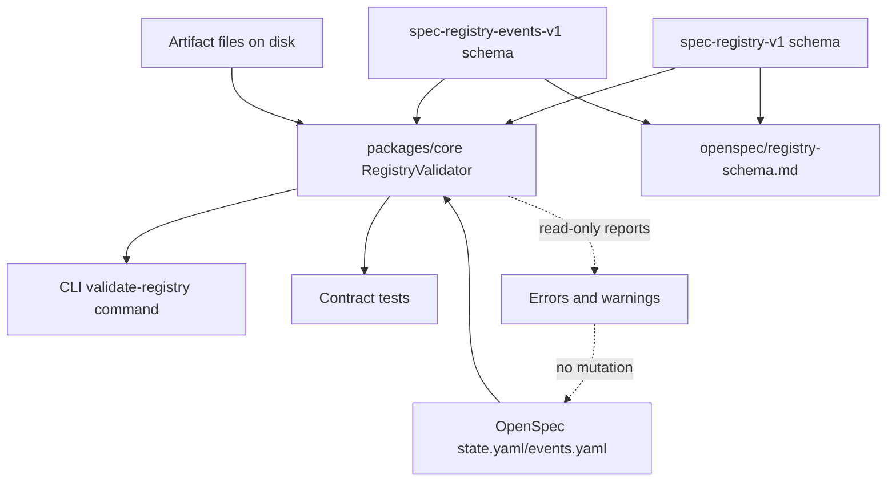

# Proposal: Schema canónico y validator read-only para OpenSpec Registry

## 1. Problema / motivación

El registry de OpenSpec presenta drift de schema entre cambios activos y archivados: múltiples dialectos de `state.yaml`, formatos heterogéneos de `events.yaml`, eventos faltantes, artefactos no registrados y casos de YAML malformado. Esta variación dificulta auditoría, trazabilidad de fases, recuperación automática y tooling confiable.

Este cambio propone formalizar un schema canónico mínimo (`spec-registry-v1`) y un validator read-only que detecte inconsistencias sin modificar históricos ni alterar el workflow actual de agentes.

## 2. Goal

Proveer un contrato versionado y verificable para el OpenSpec Registry, con una librería validator reutilizable, comando CLI, tests de contrato y documentación pública del schema.

## 3. Scope

### In Scope
- Definir schema canónico `spec-registry-v1` para `state.yaml`.
- Definir schema canónico `spec-registry-events-v1` para `events.yaml`.
- Implementar validator read-only en `packages/core`.
- Exponer comando CLI para ejecutar la validación del registry.
- Agregar tests de contrato con ejemplos reales/representativos de dialectos actuales.
- Documentar el contrato en `openspec/registry-schema.md`.
- Usar este cambio como piloto de registry canónico nuevo.

### Out of Scope
- Normalización retroactiva de cambios históricos.
- Migración automática de dialectos legacy al schema nuevo.
- Modificar el workflow de agentes para forzar escritura canónica.
- Mover cambios `abandoned` o `incomplete` a `archive/`.
- Resolver estados de lifecycle de exploración más allá del contrato mínimo.

### Follow-ups
- Integrar el validator en `deck doctor`.
- Agregar auto-reconciliation entre `events.yaml`, `state.yaml` y artefactos presentes en disco.
- Añadir gate de CI para validar registry en pull requests.
- Definir lifecycle extendido para exploraciones (`diagnosed`, `deferred`, `converted-to-change`).

## 4. Affected Capabilities

### New Capabilities
- `openspec-registry-schema`: contrato versionado para `state.yaml` y `events.yaml`.
- `openspec-registry-validation`: validación read-only de registry, eventos y alineación con artefactos.
- `openspec-registry-cli-validation`: comando CLI para ejecutar el validator desde el repo/proyecto.

### Modified Capabilities
- `openspec-documentation`: incorporación de `openspec/registry-schema.md` como referencia oficial del contrato.

### Unchanged Capabilities
- `developer-team-workflow`: el flujo de agentes no cambia en este SDD; el validator reporta issues pero no reescribe ni bloquea workflows por sí solo.
- `openspec-archive`: no se migran ni mueven cambios históricos como parte de este cambio.

## 5. Cambios propuestos por área / capability

| Área / capability | Cambio propuesto |
|---|---|
| Schema `state.yaml` | Requerir `schema: spec-registry-v1` para cambios nuevos, `changeId`, `currentPhase`, `status`, `artifacts` y `provenance`. |
| Schema `events.yaml` | Usar `schema: spec-registry-events-v1` y lista `events` con `phase`, `status`, `event`, `artifact`, `timestamp`, `actor` y `notes` opcional. |
| Validator core | Implementar lógica pura read-only en `packages/core` para parseo YAML, required fields, consistencia fase/status, presencia de eventos y artifact alignment. |
| CLI | Exponer un comando de validación que consuma el validator de core y reporte errores/warnings sin modificar archivos. |
| Tests | Cubrir contrato con casos de schema canónico, dialectos legacy tolerados, YAML inválido, eventos faltantes y artifact alignment. |
| Docs | Publicar `openspec/registry-schema.md` con campos, reglas, severidades y compatibilidad legacy. |

## 6. Compatibilidad con históricos

- El validator será read-only: nunca modifica `state.yaml`, `events.yaml` ni artefactos existentes.
- Cambios legacy sin `schema` se reportarán como warning salvo que impidan parseo o validación básica.
- `events.yaml` será obligatorio sólo cuando `currentPhase > explore`; exploraciones completas pueden existir con `state.yaml` + `exploration.md` sin evento histórico, aunque se recomienda evento nuevo.
- Cambios `abandoned` o `incomplete` se reportarán como warning si siguen en `openspec/changes/`; no serán movidos automáticamente.
- `apply_batches` y `apply_fixes` quedan como campos opcionales compatibles con registros previos.
- `provenance` recomendado en schema nuevo será array de objetos. El validator tolerará `provenance` legacy como objeto y emitirá warning.
- Artifact alignment deberá distinguir severidad: error para artefactos esperados por fases completadas; warning para artefactos futuros/opcionales.

## 7. Approach

1. Definir tipos/reglas del schema en `packages/core` como lógica pura y reutilizable.
2. Implementar validator read-only que recorra cambios activos y archivados, parseando `state.yaml` y `events.yaml` cuando existan.
3. Reportar issues con severidad (`error`/`warning`), ruta, regla y mensaje accionable.
4. Integrar un comando CLI que invoque la librería y devuelva exit code acorde a errores críticos.
5. Añadir tests de contrato para evitar drift futuro.
6. Documentar reglas oficiales en `openspec/registry-schema.md`.

## 8. Alternatives and Tradeoffs

| Alternative | Why Considered | Why Not Chosen |
|---|---|---|
| Script standalone en `scripts/` | Menor esfuerzo inicial y útil para auditoría puntual. | Menos reusable, menos integrado al CLI y más fácil de divergir del core. |
| Migrador automático | Podría resolver drift histórico de una vez. | Alto riesgo de reescritura accidental de historia OpenSpec; contradice objetivo read-only. |
| Validar sólo en tests/CI | Reduce superficie CLI. | No ofrece herramienta manual para usuarios ni agentes durante SDD interactivo. |
| Schema estricto para todos los históricos | Simplifica reglas. | Rompería registros existentes y convertiría deuda histórica en blocker inmediato. |

## 9. Riesgos / mitigaciones

| Risk | Likelihood | Mitigation |
|---|---|---|
| Schema demasiado rígido para exploraciones rápidas | Medium | Requerir `events.yaml` sólo después de `explore`; permitir campos opcionales y warnings legacy. |
| Confundir warnings históricos con fallos del cambio actual | Medium | Separar severidad y reportar legacy drift como warning salvo errores de parseo/contrato crítico. |
| Validator deriva hacia migrador | Medium | Mantener alcance read-only y dejar reconciliation/migración como follow-up explícito. |
| YAML malformado provoca crash del comando | Low | Manejar errores de parseo como issues reportables, no como excepción no controlada. |
| CLI y core divergen | Low | CLI debe consumir exclusivamente la librería de `packages/core`; tests cubren contrato compartido. |

## 10. Rollback plan

- Revertir la librería validator en `packages/core`, el comando CLI, tests y `openspec/registry-schema.md`.
- Mantener intactos los archivos OpenSpec históricos porque el validator no los modifica.
- Si el schema resulta demasiado estricto, relajar reglas en `spec-registry-v1` mediante warnings antes de introducir un schema nuevo.
- Si el comando CLI causa regresiones, deshabilitar sólo la entrada CLI manteniendo la librería y documentación hasta decidir un ajuste posterior.

## 11. Criterios de éxito

- [ ] Existe documentación oficial en `openspec/registry-schema.md` para `spec-registry-v1` y `spec-registry-events-v1`.
- [ ] Existe validator read-only en `packages/core` que reporta errores/warnings sin escribir archivos.
- [ ] Existe comando CLI para ejecutar la validación del registry.
- [ ] Tests de contrato cubren schema canónico, legacy tolerado, eventos faltantes y artefactos desalineados.
- [ ] Nuevos cambios OpenSpec pueden declarar `schema: spec-registry-v1` y ser validados de forma consistente.
- [ ] Históricos no canónicos son tolerados con warnings cuando no bloquean parseo o reglas críticas.

## 12. Dependencies

- Parser YAML existente o dependencia ya aceptada por el repo para leer `state.yaml` y `events.yaml`.
- Convenciones actuales de estructura OpenSpec: `openspec/changes/*` y `openspec/archive/*`.
- Integración CLI existente para registrar comandos de `deck`.

## 13. Open questions restantes

- Confirmar el nombre exacto del comando CLI (`deck validate-registry` vs subcomando bajo `deck openspec`).
- Confirmar política de exit code: propuesta inicial es exit code no-cero sólo cuando existan `error`, no por `warning` legacy.
- Confirmar si el primer piloto debe validar sólo este cambio o todo `openspec/changes/*` y `openspec/archive/*` desde el inicio.

## 14. Mermaid impact / dependency diagram

## 15. Next Steps

Ready for Spec (`deck-developer-spec`) and Design (`deck-developer-design`) in parallel.
