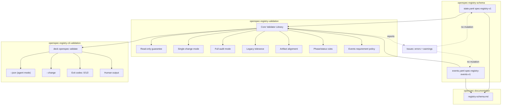

# Spec: OpenSpec Registry Schema Canonical + Validator Read-Only

## Source

- Proposal: `openspec-registry-schema-validator` proposal artifact
- Exploration: `openspec-registry-schema-validator` exploration artifact
- Capabilities affected:
  - **NEW** `openspec-registry-schema` — versioned canonical contract for `state.yaml` and `events.yaml`.
  - **NEW** `openspec-registry-validation` — read-only validator library (core API).
  - **NEW** `openspec-registry-cli-validation` — agent-first CLI command `deck openspec validate`.
  - **MODIFIED** `openspec-documentation` — new `openspec/registry-schema.md` public reference.

---

## Requirements

### Capability: openspec-registry-schema

REQ-schema-001: The system MUST define a canonical schema identifier `spec-registry-v1` for `state.yaml` files.
  Priority: MUST
  Surface: Data
  Rationale: Versioned schema enables forward-compatible evolution without breaking existing readers.

REQ-schema-002: The system MUST define a canonical schema identifier `spec-registry-events-v1` for `events.yaml` files.
  Priority: MUST
  Surface: Data
  Rationale: Separate versioning for events allows independent evolution of state snapshot and event log formats.

REQ-schema-003: A `state.yaml` conforming to `spec-registry-v1` MUST contain the following required fields: `schema`, `changeId`, `currentPhase`, `status`, `artifacts` (map with at least `exploration`), and `provenance` (array with at least one entry).
  Priority: MUST
  Surface: Data
  Rationale: These fields are the minimum needed for unambiguous change identification, phase tracking, and provenance.

REQ-schema-004: `state.yaml` `currentPhase` MUST be one of: `explore`, `proposal`, `spec`, `design`, `tasks`, `apply`, `verify`, `review`, `archive`, `closed`.
  Priority: MUST
  Surface: Data
  Rationale: Closed phase enum covering the full SDD lifecycle including terminal states.

REQ-schema-005: `state.yaml` `status` MUST be one of: `in_progress`, `completed`, `passed`, `passed_with_warnings`, `failed`, `approved`, `archived`, `abandoned`, `incomplete`.
  Priority: MUST
  Surface: Data
  Rationale: Status enum covers all observed lifecycle states across existing dialects.

REQ-schema-006: `state.yaml` `artifacts` MUST be a map of artifact-kind keys to filename strings. Valid keys: `exploration`, `proposal`, `spec`, `design`, `tasks`, `apply_progress`, `verify_report`, `review_report`, `archive_report`.
  Priority: MUST
  Surface: Data
  Rationale: Normalizes the artifact map across dialect variants (list-of-objects, flat map, etc.).

REQ-schema-007: `state.yaml` `provenance` MUST be an array of objects, each containing `phase`, `agent`, `model`, `timestamp` (ISO 8601), and `registryWrite`. Optional field: `note`.
  Priority: MUST
  Surface: Data
  Rationale: Array form supports multiple provenance entries per phase (repairs, fixups) unlike object-per-phase legacy form.

REQ-schema-008: `state.yaml` MAY contain optional compatibility fields: `apply_batches`, `apply_fixes`, `baseline_health`, `closure_reason`, `closed_at`, `name`.
  Priority: MAY
  Surface: Data
  Rationale: Preserves backward compatibility with existing changes that use these fields.

REQ-schema-009: `closure_reason` MUST be present when `status` is `abandoned` or `incomplete`.
  Priority: MUST
  Surface: Data
  Rationale: Ensures auditability of terminal non-success states.

REQ-schema-010: An `events.yaml` conforming to `spec-registry-events-v1` MUST contain `schema` and `events` (array). Each event MUST have `phase`, `status`, `event`, `artifact`, `timestamp`, `actor`. Optional: `notes` (array of strings).
  Priority: MUST
  Surface: Data
  Rationale: Canonical event structure replaces the 4 observed dialects with a single format.

REQ-schema-011: `events.yaml` `event` field MUST follow the naming pattern `{phase}.{status}` (e.g., `explore.completed`, `spec.completed`).
  Priority: MUST
  Surface: Data
  Rationale: Predictable event names enable programmatic filtering and agent consumption.

---

### Capability: openspec-registry-validation

REQ-val-001: The system MUST provide a read-only validator library in `packages/core` that accepts a project root path and returns a structured validation result.
  Priority: MUST
  Surface: API
  Rationale: Core library enables reuse by CLI, tests, CI, and future integrations (deck doctor, etc.) without duplication.

REQ-val-002: The validator MUST NOT modify any file on disk. It MUST NOT write to `state.yaml`, `events.yaml`, or any artifact file.
  Priority: MUST
  Surface: API
  Rationale: Read-only guarantee is the foundational safety invariant — the validator must never mutate registry data.

REQ-val-003: The validator MUST accept an optional `changeId` parameter to validate a single change. When omitted, it MUST validate all changes in `openspec/changes/` and produce an archive summary for `openspec/archive/`.
  Priority: MUST
  Surface: API
  Rationale: Single-change mode enables targeted validation during SDD; full mode enables audit and CI gating.

REQ-val-004: The validator MUST parse YAML files using a tolerant parser. YAML parse failures MUST be reported as errors with file path and parse error details, NOT as uncaught exceptions.
  Priority: MUST
  Surface: API
  Rationale: Malformed YAML exists in the wild (e.g., `supermemory-mcp-integration/state.yaml`); the validator must degrade gracefully.

REQ-val-005: The validator MUST report issues as a list of objects, each containing: `severity` (`error` | `warning`), `changeId`, `file` (relative path), `rule` (rule identifier), and `message` (human-readable description).
  Priority: MUST
  Surface: API
  Rationale: Structured issue format enables both agent consumption (JSON) and human readability.

REQ-val-006: The validator MUST enforce phase/status consistency rules:
  - If `currentPhase == archive`, `status` MUST be `archived`.
  - If `currentPhase == closed`, `status` MUST be `abandoned` or `incomplete`.
  - If `currentPhase > explore`, `artifacts` MUST contain the artifact for the preceding completed phase.
  Priority: MUST
  Surface: API
  Rationale: Prevents contradictions like `currentPhase: review` with `status: completed` but `archive.status: archived`.

REQ-val-007: The validator MUST perform artifact alignment: for each key in `artifacts`, the referenced file MUST exist on disk relative to the change directory. Missing artifacts for completed phases are errors; missing artifacts for future phases are warnings.
  Priority: MUST
  Surface: API
  Rationale: Ensures registry-to-disk consistency without false positives for not-yet-created artifacts.

REQ-val-008: The validator MUST require `events.yaml` to exist when `currentPhase > explore`. Absence is an error for canonical-schema changes and a warning for legacy (no `schema` field) changes.
  Priority: MUST
  Surface: API
  Rationale: Events are the audit trail; they become mandatory once a change moves beyond exploration.

REQ-val-009: The validator MUST emit `warning` severity for legacy drift: missing `schema` field, legacy `provenance` object form, non-canonical field names (`current_phase` vs `currentPhase`, `state` vs `phase`).
  Priority: MUST
  Surface: API
  Rationale: Historical tolerance — warnings surface drift without blocking validation of older changes.

REQ-val-010: The validator MUST emit `error` severity for: YAML parse failure, missing required fields in canonical-schema changes, artifact references to non-existent files for completed phases, phase/status contradictions.
  Priority: MUST
  Surface: API
  Rationale: Hard errors mark genuine contract violations that block reliable automation.

REQ-val-011: The validator MUST validate `events.yaml` internal consistency: each event's `phase` and `status` must use valid enum values; the last event's `phase` SHOULD match `state.yaml` `currentPhase`.
  Priority: MUST
  Surface: API
  Rationale: Cross-file consistency between state snapshot and event log is essential for recovery.

REQ-val-012: The validation result MUST include a summary object: `totalChanges`, `validChanges`, `changesWithErrors`, `changesWithWarnings`, `totalErrors`, `totalWarnings`.
  Priority: MUST
  Surface: API
  Rationale: Summary enables quick pass/fail decisions by agents and CI without iterating all issues.

REQ-val-013: The validator MUST handle the case where `openspec/changes/` or `openspec/archive/` directories do not exist by returning a valid result with zero changes and no errors.
  Priority: MUST
  Surface: API
  Rationale: Graceful handling of uninitialized or partial OpenSpec setups.

---

### Capability: openspec-registry-cli-validation

REQ-cli-001: The system MUST provide the command `deck openspec validate` that invokes the core validator library.
  Priority: MUST
  Surface: API (CLI)
  Rationale: Stable CLI entry point consumable by agents (Orchestrator, Verify, Archive) and humans.

REQ-cli-002: The command MUST support the `--json` flag. When `--json` is present, stdout MUST contain a single valid JSON object matching the validation result schema. No human-readable text, progress bars, or ANSI escapes may appear on stdout when `--json` is active.
  Priority: MUST
  Surface: API (CLI)
  Rationale: Agent-first design — agents parse JSON deterministically; mixing formats breaks parsing.

REQ-cli-003: The command SHOULD support the `--change <changeId>` flag to validate a single change. When omitted, it MUST validate all active changes and produce an archive summary.
  Priority: SHOULD
  Surface: API (CLI)
  Rationale: Single-change validation is the common agent case (Orchestrator validates the current change after each phase).

REQ-cli-004: The command MUST exit with code `0` when there are zero `error`-severity issues (warnings alone are acceptable).
  Priority: MUST
  Surface: API (CLI)
  Rationale: Warnings are informational; they must not block agent workflows or CI.

REQ-cli-005: The command MUST exit with code `1` when there is one or more `error`-severity issues.
  Priority: MUST
  Surface: API (CLI)
  Rationale: Non-zero exit enables agent/CI gating on validation failures.

REQ-cli-006: The command MUST exit with code `2` when the validator itself fails at runtime (e.g., unexpected exception, I/O error reading the project root, invalid `--change` target that does not exist).
  Priority: MUST
  Surface: API (CLI)
  Rationale: Distinguishes "validation found problems" (exit 1) from "validator could not run" (exit 2) — agents need to know the difference.

REQ-cli-007: Without `--json`, the command SHOULD produce human-readable output to stdout summarizing issues grouped by change, with color when stdout is a TTY.
  Priority: SHOULD
  Surface: UI (CLI)
  Rationale: Human output is secondary; agents use `--json`. Humans benefit from readable summaries during development.

REQ-cli-008: When `--json` is active and `--change <changeId>` targets a non-existent change, the command MUST exit with code `2` and output a JSON object with an `error` field describing the problem.
  Priority: MUST
  Surface: API (CLI)
  Rationale: Agents must receive machine-parseable error details even for runtime failures.

REQ-cli-009: The JSON output MUST be written to stdout. Diagnostic/progress messages (if any) MUST go to stderr.
  Priority: MUST
  Surface: API (CLI)
  Rationale: Standard CLI convention — agents pipe stdout; stderr is for operator diagnostics.

REQ-cli-010: The command MUST accept an optional `--root <path>` flag to specify the project root. When omitted, it MUST use the current working directory.
  Priority: SHOULD
  Surface: API (CLI)
  Rationale: Enables validation of projects at arbitrary paths, useful for CI and multi-repo scenarios.

---

### Capability: openspec-documentation

REQ-doc-001: The system MUST include a public schema reference document at `openspec/registry-schema.md` documenting `spec-registry-v1` and `spec-registry-events-v1`.
  Priority: MUST
  Surface: Data (Documentation)
  Rationale: Single source of truth for agents and humans to understand the canonical contract.

REQ-doc-002: The schema document MUST include: field definitions, required/optional markers, enum values, severity rules, legacy compatibility notes, and examples of valid `state.yaml` and `events.yaml`.
  Priority: MUST
  Surface: Data (Documentation)
  Rationale: Complete reference enables self-service consumption without reading source code.

---

## Acceptance Scenarios

### Capability: openspec-registry-schema

#### Scenario: Canonical state.yaml passes schema validation

**Given** a change directory with a `state.yaml` containing `schema: spec-registry-v1`, valid `changeId`, `currentPhase: spec`, `status: in_progress`, `artifacts` map with `exploration` and `proposal` keys pointing to existing files, and `provenance` array with two entries (explore, proposal)
**When** the validator processes this change
**Then** the validator returns zero errors for this change
> Covers: REQ-schema-001, REQ-schema-003, REQ-schema-004, REQ-schema-005, REQ-schema-006, REQ-schema-007

#### Scenario: Canonical events.yaml passes schema validation

**Given** an `events.yaml` with `schema: spec-registry-events-v1` and `events` array containing entries with valid `phase`, `status`, `event` (e.g., `explore.completed`), `artifact`, `timestamp`, `actor`
**When** the validator processes this events file
**Then** the validator returns zero errors for event schema compliance
> Covers: REQ-schema-010, REQ-schema-011

#### Scenario: Missing required field in canonical state.yaml

**Given** a `state.yaml` with `schema: spec-registry-v1` but missing the `changeId` field
**When** the validator processes this change
**Then** the validator reports one `error`-severity issue with rule `required-field` and message indicating `changeId` is missing
> Covers: REQ-schema-003, REQ-val-010

#### Scenario: Invalid enum value in currentPhase

**Given** a `state.yaml` with `schema: spec-registry-v1` and `currentPhase: unknown_phase`
**When** the validator processes this change
**Then** the validator reports one `error`-severity issue with rule `invalid-enum` for `currentPhase`
> Covers: REQ-schema-004

#### Scenario: closure_reason required for abandoned status

**Given** a `state.yaml` with `schema: spec-registry-v1`, `status: abandoned`, and no `closure_reason` field
**When** the validator processes this change
**Then** the validator reports one `error`-severity issue with rule `required-field` indicating `closure_reason` is required when status is `abandoned`
> Covers: REQ-schema-009

---

### Capability: openspec-registry-validation

#### Scenario: Read-only guarantee — no files modified

**Given** a project root with multiple changes in various states
**When** the validator runs to completion
**Then** no file under `openspec/` has been created, modified, or deleted by the validator
> Covers: REQ-val-002

#### Scenario: Malformed YAML handled gracefully

**Given** a `state.yaml` containing invalid YAML syntax (e.g., unquoted colons in values)
**When** the validator processes this change
**Then** the validator reports one `error`-severity issue with rule `yaml-parse-error` including the file path and parse error details, and continues validating remaining changes without crashing
> Covers: REQ-val-004, REQ-val-010

#### Scenario: Single-change validation mode

**Given** a project with 30 changes in `openspec/changes/`
**When** the validator is invoked with `changeId` set to `fix-supermemory-userid-validation`
**Then** the validation result contains issues for only that change, and `totalChanges` equals `1`
> Covers: REQ-val-003

#### Scenario: Full validation mode with archive summary

**Given** a project with 25 changes in `openspec/changes/` and 35 entries in `openspec/archive/`
**When** the validator is invoked without a `changeId`
**Then** the validation result contains issues for all 25 active changes, plus an archive summary reporting `archiveTotal: 35`, `archiveErrors`, and `archiveWarnings`
> Covers: REQ-val-003

#### Scenario: Phase/status consistency — archive phase requires archived status

**Given** a `state.yaml` with `currentPhase: archive` and `status: completed`
**When** the validator processes this change
**Then** the validator reports one `error`-severity issue with rule `phase-status-consistency`
> Covers: REQ-val-006

#### Scenario: Artifact alignment — missing file for completed phase

**Given** a `state.yaml` with `currentPhase: apply` and `artifacts.spec: spec.md`, but `spec.md` does not exist on disk
**When** the validator processes this change
**Then** the validator reports one `error`-severity issue with rule `artifact-missing` for `spec.md`
> Covers: REQ-val-007

#### Scenario: Artifact alignment — future phase artifact absent is warning only

**Given** a `state.yaml` with `currentPhase: spec` and `artifacts` map containing only `exploration` and `proposal` (no `design`, `tasks`, etc.)
**When** the validator processes this change
**Then** the validator reports zero errors for artifact alignment (future artifacts are not yet expected)
> Covers: REQ-val-007

#### Scenario: Events required after explore phase

**Given** a `state.yaml` with `schema: spec-registry-v1`, `currentPhase: spec`, and no `events.yaml` in the change directory
**When** the validator processes this change
**Then** the validator reports one `error`-severity issue with rule `events-required`
> Covers: REQ-val-008

#### Scenario: Legacy change without schema field

**Given** a `state.yaml` without a `schema` field (legacy dialect), using `current_phase` instead of `currentPhase`
**When** the validator processes this change
**Then** the validator reports `warning`-severity issues with rule `legacy-drift` for missing `schema` field and non-canonical field name `current_phase`, but does not report `error` for the field naming itself
> Covers: REQ-val-009

#### Scenario: Legacy provenance object form

**Given** a `state.yaml` with `schema: spec-registry-v1` but `provenance` as a single object instead of an array
**When** the validator processes this change
**Then** the validator reports one `warning`-severity issue with rule `legacy-provenance-format`
> Covers: REQ-val-009

#### Scenario: Events/state phase cross-check

**Given** a `state.yaml` with `currentPhase: apply` and an `events.yaml` whose last event has `phase: spec`
**When** the validator processes this change
**Then** the validator reports one `warning`-severity issue with rule `events-state-phase-mismatch`
> Covers: REQ-val-011

#### Scenario: Empty project — no changes directory

**Given** a project root where `openspec/changes/` does not exist
**When** the validator runs
**Then** the validation result has `totalChanges: 0`, `totalErrors: 0`, `totalWarnings: 0`, and exit code is `0`
> Covers: REQ-val-013

#### Scenario: Validation result summary structure

**Given** a project with 3 changes: one valid, one with 2 errors, one with 1 warning
**When** the validator runs in full mode
**Then** the result summary contains `totalChanges: 3`, `validChanges: 1`, `changesWithErrors: 1`, `changesWithWarnings: 1`, `totalErrors: 2`, `totalWarnings: 1`
> Covers: REQ-val-012

---

### Capability: openspec-registry-cli-validation

#### Scenario: JSON output for single change — success

**Given** a change `my-change` with valid canonical registry files
**When** `deck openspec validate --change my-change --json` is executed
**Then** stdout contains a single valid JSON object with `totalChanges: 1`, `totalErrors: 0`, and the exit code is `0`
> Covers: REQ-cli-001, REQ-cli-002, REQ-cli-003, REQ-cli-004

#### Scenario: JSON output — validation errors present

**Given** a change `broken-change` with a `state.yaml` missing required fields
**When** `deck openspec validate --change broken-change --json` is executed
**Then** stdout contains a valid JSON object with `totalErrors > 0` and an `issues` array containing error entries, and the exit code is `1`
> Covers: REQ-cli-002, REQ-cli-005

#### Scenario: JSON output — runtime failure

**Given** `--change nonexistent-change` targets a change that does not exist
**When** `deck openspec validate --change nonexistent-change --json` is executed
**Then** stdout contains a valid JSON object with an `error` field describing the missing change, and the exit code is `2`
> Covers: REQ-cli-006, REQ-cli-008

#### Scenario: Warnings only produce exit code 0

**Given** a legacy change with no `schema` field (produces warnings only, no errors)
**When** `deck openspec validate --change legacy-change --json` is executed
**Then** the exit code is `0` and the JSON output contains `totalWarnings > 0` and `totalErrors: 0`
> Covers: REQ-cli-004

#### Scenario: Human-readable output without --json

**Given** a change with 1 error and 2 warnings
**When** `deck openspec validate --change my-change` is executed (no `--json`)
**Then** stdout contains human-readable text listing the error and warnings grouped by change, and the exit code is `1`
> Covers: REQ-cli-007

#### Scenario: Full validation mode — no --change flag

**Given** a project with multiple active changes and an archive directory
**When** `deck openspec validate --json` is executed (no `--change`)
**Then** stdout contains a JSON object covering all active changes plus an `archiveSummary` object, and the exit code reflects the highest severity found
> Covers: REQ-cli-003

#### Scenario: stdout/stderr separation with --json

**Given** a valid project and `--json` flag active
**When** `deck openspec validate --json` is executed
**Then** stdout contains only the JSON result object; stderr is empty or contains only diagnostic messages
> Covers: REQ-cli-009

---

### Capability: openspec-documentation

#### Scenario: Schema document exists and is complete

**Given** the change has been applied
**When** a user or agent reads `openspec/registry-schema.md`
**Then** the document contains field definitions for `spec-registry-v1` and `spec-registry-events-v1`, required/optional markers, enum values, severity rules, legacy compatibility notes, and at least one valid example of each file type
> Covers: REQ-doc-001, REQ-doc-002

---

## Validation Rules

| Field / Input | Rule | Error Message | REQ-ID |
|---|---|---|---|
| `schema` (state.yaml) | Required when change declares canonical schema; value must be `spec-registry-v1` | `Missing or invalid schema field; expected "spec-registry-v1"` | REQ-schema-001 |
| `changeId` | Required; non-empty string, kebab-case recommended | `Missing required field: changeId` | REQ-schema-003 |
| `currentPhase` | Required; must be valid enum value | `Invalid currentPhase value: {value}` | REQ-schema-004 |
| `status` | Required; must be valid enum value | `Invalid status value: {value}` | REQ-schema-005 |
| `artifacts` | Required; must be a map; must contain `exploration` key | `Missing required field: artifacts` / `artifacts must contain exploration key` | REQ-schema-003, REQ-schema-006 |
| `provenance` | Required; must be an array with ≥1 entry | `Missing or empty provenance array` | REQ-schema-003, REQ-schema-007 |
| `closure_reason` | Required when `status` is `abandoned` or `incomplete` | `closure_reason required when status is {status}` | REQ-schema-009 |
| `events` (events.yaml) | Required; must be an array | `Missing or invalid events array` | REQ-schema-010 |
| Event `phase` | Must be valid ChangePhase enum | `Invalid event phase: {value}` | REQ-schema-010 |
| Event `event` | Must match `{phase}.{status}` pattern | `Event name does not match phase.status pattern: {value}` | REQ-schema-011 |
| Artifact file reference | File must exist on disk for completed phases | `Artifact file not found: {path} (required for phase {phase})` | REQ-val-007 |
| `events.yaml` presence | Required when `currentPhase > explore` | `events.yaml required when currentPhase is {phase}` | REQ-val-008 |
| YAML well-formedness | Must parse without fatal errors | `YAML parse error in {file}: {details}` | REQ-val-004 |

---

## Error Contracts

| Condition | Exit Code | Severity | Rule | Message Pattern |
|---|---|---|---|---|
| YAML parse failure | 1 | error | `yaml-parse-error` | `YAML parse error in {file}: {details}` |
| Missing required field (canonical) | 1 | error | `required-field` | `Missing required field: {field}` |
| Invalid enum value | 1 | error | `invalid-enum` | `Invalid {field} value: {value}` |
| Phase/status contradiction | 1 | error | `phase-status-consistency` | `Phase {phase} requires status {expected}, got {actual}` |
| Artifact file missing (completed phase) | 1 | error | `artifact-missing` | `Artifact file not found: {path}` |
| events.yaml missing (phase > explore) | 1 | error | `events-required` | `events.yaml required when currentPhase is {phase}` |
| Change target not found (CLI) | 2 | runtime | `change-not-found` | `Change not found: {changeId}` |
| Validator runtime exception | 2 | runtime | `runtime-error` | `Validator error: {details}` |
| Legacy: missing schema field | 0 | warning | `legacy-drift` | `Missing schema field; treating as legacy change` |
| Legacy: non-canonical field names | 0 | warning | `legacy-drift` | `Non-canonical field: {field} (expected {canonical})` |
| Legacy: provenance as object | 0 | warning | `legacy-provenance-format` | `provenance is object; expected array` |
| Events/state phase mismatch | 0 | warning | `events-state-phase-mismatch` | `Last event phase {eventPhase} differs from state currentPhase {statePhase}` |

---

## States and Transitions

> This capability introduces no new change lifecycle states. It validates existing states. The validator itself is stateless — it reads, reports, and exits.

| Validator Mode | Description | Trigger |
|---|---|---|
| Single-change | Validates one change by `changeId` | `--change <id>` flag |
| Full audit | Validates all active changes + archive summary | No `--change` flag |

---

## Open Questions

- **OQ-1 (Advisory — resolved by user clarification)**: ~~Is the CLI primarily for humans or agents?~~ → Resolved: agent-first. CLI exists as stable interface for Orchestrator/Verify/Archive/Audit consumption, ideally with `--json`. Human output is optional/secondary.
- **OQ-2 (Low priority)**: Should the validator support a `--strict` flag that escalates all legacy-drift warnings to errors? This would enable future CI gating once historical drift is resolved. Currently not required — can be added as follow-up.
- **OQ-3 (Low priority)**: Should `deck doctor` integration be part of this change or a follow-up? Proposal explicitly defers it. Spec follows proposal — out of scope.
- **OQ-4 (Design decision)**: The existing `packages/core/src/spec-registry/types.ts` defines `ChangePhase` without `closed`. This spec adds `closed` as a valid phase. Design must reconcile whether to extend the existing enum or create a parallel validator-specific enum.
- **OQ-5 (Design decision)**: The existing `ArtifactKind` uses kebab-case (`apply-progress`) while this spec uses snake_case (`apply_progress`) in the artifacts map. Design must decide the canonical key format and handle mapping.

---

## Compliance Matrix

| REQ-ID | Scenario(s) | Status |
|---|---|---|
| REQ-schema-001 | Canonical state.yaml passes schema validation | Defined |
| REQ-schema-002 | Canonical events.yaml passes schema validation | Defined |
| REQ-schema-003 | Canonical state.yaml passes; Missing required field | Defined |
| REQ-schema-004 | Canonical state.yaml passes; Invalid enum value | Defined |
| REQ-schema-005 | Invalid enum value in currentPhase | Defined |
| REQ-schema-006 | Canonical state.yaml passes | Defined |
| REQ-schema-007 | Canonical state.yaml passes | Defined |
| REQ-schema-008 | (Optional — no dedicated scenario; covered by full validation) | Defined |
| REQ-schema-009 | closure_reason required for abandoned status | Defined |
| REQ-schema-010 | Canonical events.yaml passes | Defined |
| REQ-schema-011 | Canonical events.yaml passes | Defined |
| REQ-val-001 | (API surface — covered by all validator scenarios) | Defined |
| REQ-val-002 | Read-only guarantee — no files modified | Defined |
| REQ-val-003 | Single-change validation; Full validation mode | Defined |
| REQ-val-004 | Malformed YAML handled gracefully | Defined |
| REQ-val-005 | (Output structure — covered by all scenarios) | Defined |
| REQ-val-006 | Phase/status consistency — archive phase | Defined |
| REQ-val-007 | Artifact alignment — missing file; future phase absent | Defined |
| REQ-val-008 | Events required after explore phase | Defined |
| REQ-val-009 | Legacy change without schema; Legacy provenance object | Defined |
| REQ-val-010 | Missing required field; Malformed YAML; Phase/status | Defined |
| REQ-val-011 | Events/state phase cross-check | Defined |
| REQ-val-012 | Validation result summary structure | Defined |
| REQ-val-013 | Empty project — no changes directory | Defined |
| REQ-cli-001 | JSON output for single change — success | Defined |
| REQ-cli-002 | JSON output for single change; JSON output — errors | Defined |
| REQ-cli-003 | JSON output for single change; Full validation mode | Defined |
| REQ-cli-004 | JSON output — success; Warnings only produce exit 0 | Defined |
| REQ-cli-005 | JSON output — validation errors present | Defined |
| REQ-cli-006 | JSON output — runtime failure | Defined |
| REQ-cli-007 | Human-readable output without --json | Defined |
| REQ-cli-008 | JSON output — runtime failure | Defined |
| REQ-cli-009 | stdout/stderr separation with --json | Defined |
| REQ-cli-010 | (Optional — --root flag; covered by CLI implementation) | Defined |
| REQ-doc-001 | Schema document exists and is complete | Defined |
| REQ-doc-002 | Schema document exists and is complete | Defined |

---

## Mermaid Capability Map

