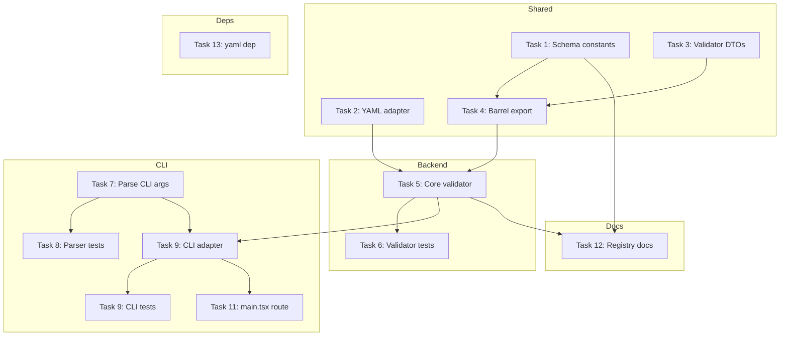
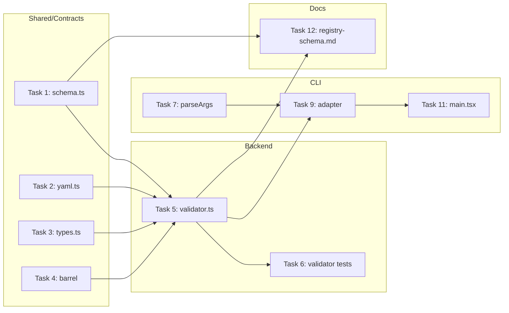

# Tasks: openspec-registry-schema-validator

## Source

- Spec: `openspec-registry-schema-validator` spec artifact
- Design: `openspec-registry-schema-validator` design artifact
- Capabilities affected: `openspec-registry-schema`, `openspec-registry-validation`, `openspec-registry-cli-validation`, `openspec-documentation`

## Task Groups

### Group: Shared / Contracts

#### Task 1: Create canonical schema constants
**Owner**: General Apply
**Priority**: P0
**Complexity**: Low
**Parallel**: Yes
**Depends on**: none

**Description**
Create `packages/core/src/spec-registry/schema.ts` with canonical constants: phase enum, status enum, artifact key mapping, rule codes, schema identifiers (`spec-registry-v1`, `spec-registry-events-v1`).

**Files**
- `packages/core/src/spec-registry/schema.ts` — create

**Verification**
- `npx tsc --noEmit packages/core/src/spec-registry/schema.ts` passes

---

#### Task 2: Create YAML parser adapter
**Owner**: General Apply
**Priority**: P0
**Complexity**: Low
**Parallel**: Yes
**Depends on**: none

**Description**
Create `packages/core/src/spec-registry/yaml.ts` with tolerant YAML parser adapter. Use `yaml` npm package if available; encapsulate diagnostic normalization with `ParsedYamlDocument` DTO. Report duplicate keys and parse errors as normalized issues.

**Files**
- `packages/core/src/spec-registry/yaml.ts` — create

**Verification**
- Create temp fixture with malformed YAML; validator reports `yaml-parse-error` without crashing

---

#### Task 3: Add validator DTOs to types.ts
**Owner**: General Apply
**Priority**: P0
**Complexity**: Low
**Parallel**: Yes
**Depends on**: none

**Description**
Add validator result/issue types to `packages/core/src/spec-registry/types.ts`: `ValidateOpenSpecRegistryOptions`, `OpenSpecRegistryValidationResult`, `OpenSpecRegistryValidationIssue`, `OpenSpecRegistryChangeValidation`. Do not replace existing registry lifecycle types.

**Files**
- `packages/core/src/spec-registry/types.ts` — modify (add validator DTOs)

**Verification**
- TypeScript compiles; types are re-exported from barrel

---

#### Task 4: Update spec-registry barrel export
**Owner**: General Apply
**Priority**: P0
**Complexity**: Low
**Parallel**: Yes
**Depends on**: Task 1, Task 3

**Description**
Update `packages/core/src/spec-registry/index.ts` to export validator/schema API.

**Files**
- `packages/core/src/spec-registry/index.ts` — modify

**Verification**
- `import { validateOpenSpecRegistry } from "@deck/core/spec-registry"` resolves

---

### Group: Backend

#### Task 5: Implement core validateOpenSpecRegistry function
**Owner**: Backend Apply
**Priority**: P0
**Complexity**: High
**Parallel**: No — depends on Task 1, Task 2, Task 3

**Description**
Create `packages/core/src/spec-registry/validator.ts` with main `validateOpenSpecRegistry` async function. Implement:
- Directory discovery (`openspec/changes/`, `openspec/archive/`)
- YAML parsing with tolerant adapter
- Schema validation (canonical vs legacy detection)
- Phase/status consistency rules
- Artifact alignment checks
- Events.yaml requirement enforcement
- Legacy drift warning emission
- Result aggregation

**Files**
- `packages/core/src/spec-registry/validator.ts` — create

**Verification**
- `npx tsc --noEmit packages/core/src/spec-registry/validator.ts` passes

---

#### Task 6: Write unit tests for validator (TDD)
**Owner**: Backend Apply
**Priority**: P0
**Complexity**: Medium
**Parallel**: No — depends on Task 5

**Description**
Create `packages/core/src/spec-registry/validator.test.ts` with TDD coverage:
- Canonical valid state.yaml passes
- Missing required field reports error
- Invalid enum reports error
- Malformed YAML handled gracefully
- Phase > explore without events.yaml reports error
- Artifact missing for completed phase reports error
- Legacy drift reports warnings
- Empty project returns ok:true with zero counts

**Files**
- `packages/core/src/spec-registry/validator.test.ts` — create

**Verification**
- `bun test packages/core/src/spec-registry/validator.test.ts` passes

---

### Group: CLI Integration

#### Task 7: Parse openspec validate CLI args
**Owner**: General Apply
**Priority**: P1
**Complexity**: Low
**Parallel**: Yes
**Depends on**: none

**Description**
Modify `apps/cli/src/cli-args.ts` to parse:
- `deck openspec validate --json`
- `deck openspec validate --json --change <id>`
- Optional `--root <path>`

Update `ParsedArgs` type to include new command.

**Files**
- `apps/cli/src/cli-args.ts` — modify

**Verification**
- Parser tests pass for new command shapes

---

#### Task 8: Add CLI parser tests
**Owner**: General Apply
**Priority**: P1
**Complexity**: Low
**Parallel**: No — depends on Task 7

**Description**
Add tests to `apps/cli/src/cli-args.test.ts` for new command parsing.

**Files**
- `apps/cli/src/cli-args.test.ts` — modify

**Verification**
- `bun test apps/cli/src/cli-args.test.ts` passes

---

#### Task 9: Create CLI validate command adapter
**Owner**: Backend Apply
**Priority**: P1
**Complexity**: Medium
**Parallel**: No — depends on Task 5, Task 7

**Description**
Create `apps/cli/src/openspec-validate-command.ts`:
- Resolve project root from args or cwd
- Call `validateOpenSpecRegistry` from core
- Render JSON output (stable machine format)
- Render optional human output (TTY detection)
- Map severity to exit codes: 0 (no errors), 1 (errors found), 2 (runtime failure)

**Files**
- `apps/cli/src/openspec-validate-command.ts` — create

**Verification**
- `npx tsc --noEmit apps/cli/src/openspec-validate-command.ts` passes

---

#### Task 10: Add CLI validate command tests
**Owner**: Backend Apply
**Priority**: P1
**Complexity**: Medium
**Parallel**: No — depends on Task 9

**Description**
Create `apps/cli/src/openspec-validate-command.test.ts`:
- JSON output matches schema
- Exit code 0 for warnings-only
- Exit code 1 for errors present
- Exit code 2 for runtime failure
- stdout/stderr separation

**Files**
- `apps/cli/src/openspec-validate-command.test.ts` — create

**Verification**
- `bun test apps/cli/src/openspec-validate-command.test.ts` passes

---

#### Task 11: Route CLI command in main.tsx
**Owner**: Backend Apply
**Priority**: P1
**Complexity**: Low
**Parallel**: No — depends on Task 9

**Description**
Modify `apps/cli/src/main.tsx` to route parsed `openspec-validate` command to the new CLI adapter.

**Files**
- `apps/cli/src/main.tsx` — modify

**Verification**
- `deck openspec validate --json --change openspec-registry-schema-validator` runs and exits with expected code

---

### Group: Documentation

#### Task 12: Create registry schema documentation
**Owner**: General Apply
**Priority**: P2
**Complexity**: Low
**Parallel**: Yes
**Depends on**: Task 1, Task 5

**Description**
Create `openspec/registry-schema.md` documenting:
- `spec-registry-v1` field definitions
- `spec-registry-events-v1` field definitions
- Required/optional markers
- Enum values
- Severity rules (error vs warning)
- Legacy compatibility notes
- Valid examples of state.yaml and events.yaml

**Files**
- `openspec/registry-schema.md` — create

**Verification**
- File exists and contains both schema examples

---

### Group: Package Dependency (if needed)

#### Task 13: Add yaml dependency if needed
**Owner**: General Apply
**Priority**: P2
**Complexity**: Low
**Parallel**: Yes
**Depends on**: none

**Description**
Check if `yaml` npm package exists in project. If not, add to root `package.json`. Update lockfile if needed.

**Files**
- `package.json` — modify (conditional)
- `bun.lockb` — modify (conditional)

**Verification**
- `bun add yaml` succeeds or package already present

---

## Dependency Graph

## Parallelization Plan

| Phase | Tasks | Can Run in Parallel |
|---|---|---|
| Shared | Task 1, Task 2, Task 3 | Yes |
| Backend | Task 5, Task 6 | No — Task 5 must precede Task 6 |
| CLI | Task 7, Task 8 | Yes |
| CLI (after backend) | Task 9, Task 10, Task 11 | No — Task 9 depends on Task 5 |
| Docs | Task 12 | Yes (after Task 1, Task 5) |
| Package | Task 13 | Yes |

## Responsibility Contracts

| Contract / Boundary | Owner | Consumers | Notes |
|---|---|---|---|
| `schema.ts` constants | General Apply | Backend, CLI | Phase/status enums, rule codes |
| `yaml.ts` parser | General Apply | Backend | Normalized diagnostics |
| `validateOpenSpecRegistry` API | Backend Apply | CLI, Tests | Core validation engine |
| CLI JSON contract | Backend Apply | Agents | Stable v1 schema for JSON output |
| `registry-schema.md` | General Apply | Humans, Agents | Public reference |

## Complexity Summary

| Complexity | Count | Task Numbers |
|---|---|---|
| Low | 8 | 1, 2, 3, 4, 7, 8, 11, 13 |
| Medium | 3 | 6, 9, 10 |
| High | 1 | 5 |
| P2 (Docs) | 1 | 12 |

## Flagged for Splitting

- Task 5 (Core validator): High complexity — touches 4+ validation rule categories. Consider if scope grows; current design keeps all rules in one module. Split only if Apply reports difficulty.

## Review Workload Forecast

| Signal | Value |
|---|---|
| Estimated changed lines | 400-800 |
| 400-line budget risk | Medium |
| Scope reduction recommended | No |
| Sequential work slices recommended | Yes — Shared → Backend → CLI order |
| Decision needed before Apply | No |

**Rationale**: Core validator (Task 5) is the critical path. Shared/Contracts must complete before Backend. CLI builds on both. Expect ~600 lines across all tasks. Medium risk from validator complexity; sequential slices reduce review load.

## Open Questions / Blockers

- **OQ-4 (resolved by user)**: Existing `ChangePhase` enum missing `closed` — validator schema can add it without modifying existing lifecycle types (additive).
- **OQ-5 (resolved by user)**: Artifact key format — Design uses snake_case for validator internal; reconciling with existing kebab-case is a future follow-up.
- **Canonical-strict mode**: CLI does NOT expose this flag per user decision. Core supports it for future use; not in CLI scope.

> All open questions resolved. Tasks are ready for Apply.

## Mermaid Summary Source

