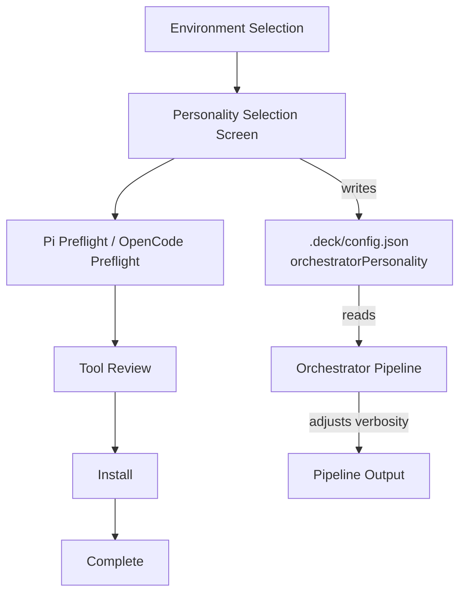

# Proposal: Orchestrator Personality Selector

## Intent

Deck's orchestrator currently communicates with a fixed, one-size-fits-all verbosity level. Users with varying experience levels and token budgets need different communication styles from the orchestrator:

- **Beginners** need verbose, educational explanations to understand what the orchestrator is doing and why.
- **Experienced users** want balanced communication — necessary context without noise.
- **Token-constrained users** need minimal output to maximize token efficiency, accepting the trade-off of reduced context.

Adding a personality selector during the TUI start installation flow allows users to choose their preferred communication style upfront, making Deck accessible to a broader audience while respecting token budgets.

## Goal

Enable users to select an orchestrator personality (Guía, Pragmática, Ahorro extremo) during the TUI start installation flow, and persist that choice so it affects orchestrator communication across all runner environments.

## Scope

### In Scope
- Add a **Personality Selection Screen** to the TUI installation flow as the first configuration step (after environment selection, before tool review).
- Define three personality profiles with distinct communication characteristics:
  - `guia` (Teacher): Verbose, educational, explains rationale for every orchestrator decision.
  - `pragmatica` (Pragmatic): Balanced — communicates necessary info without excess.
  - `ahorro-extremo` (Extreme saver): Minimal communication for maximum token savings.
- Persist the selected personality to `.deck/config.json` under a new `orchestratorPersonality` field.
- Modify the orchestrator pipeline (`packages/sdd-runtime/src/orchestrator/`) to accept a personality parameter and adjust its output verbosity accordingly.
- Update the TUI screen flow (`apps/cli/src/developer-team-flow.ts`) to route through the personality selector.
- Ensure the personality selection applies transversally to **all runners** (Pi, OpenCode, and future adapters).

### Out of Scope
- Real-time personality switching during a running orchestrator pipeline.
- Per-runner (Pi vs OpenCode) personality overrides.
- Personality-driven changes to orchestrator **logic** (risk scoring, quality routing, loop breaking) — only **communication verbosity** is affected.
- UI for changing personality after installation (can be done via manual config edit; future work).
- Non-TUI (headless/CI) personality selection — CLI flag or env var support is deferred.

## Affected Capabilities

### New Capabilities
- `orchestrator-personality-selection`: TUI screen for choosing the orchestrator's communication style during installation.
- `orchestrator-personality-persistence`: Read/write personality preference from/to `.deck/config.json`.
- `orchestrator-personality-aware-output`: Adjust orchestrator log/explanation verbosity based on the active personality.

### Modified Capabilities
- `deck-installation-flow`: Adds a new screen to the existing TUI flow between environment selection and preflight checks.
- `orchestrator-pipeline`: Accepts an optional `personality` parameter in `OrchestratorPipelineInput` or `PipelineConfig` to influence output generation.

### Unchanged Capabilities
- `budget-watchdog`: Token budgets remain unchanged; personality is a user preference, not a budget control.
- `risk-scorer`, `quality-router`, `loop-breaker`: Core pipeline logic stays the same; only output formatting is affected.
- `runner-capabilities`: Adapter interfaces for Pi/OpenCode are unchanged at the spec level.

## Approach

1. **Config Layer**: Extend `DeckConfig` in `packages/core/src/config/deck-config.ts` with `orchestratorPersonality?: "guia" | "pragmatica" | "ahorro-extremo"`. Add validation and normalization (default: `"pragmatica"`).

2. **TUI Flow**: Insert a new screen (`personality-selection`) into the installation flow in `apps/cli/src/tui/app.tsx`. This screen renders a `MenuList` with the three options and descriptive hints. The selection is stored in React state and written to `.deck/config.json` before proceeding.

3. **Flow Routing**: Update `apps/cli/src/developer-team-flow.ts` to include `"personality-selection"` in `NextScreen` and add `getNextScreenAfterEnvironmentSelection` to route to personality selection before preflight.

4. **Orchestrator Integration**: Pass the selected personality into `runOrchestratorPipeline` via `PipelineConfig` (or `OrchestratorPipelineInput`). The pipeline uses it to determine how much explanatory text to generate in results, block reasons, and quality decisions.

5. **Output Adjustment**: In the orchestrator pipeline (`packages/sdd-runtime/src/orchestrator/orchestrator-pipeline.ts`), when building `blockReason`, `qualityDecision` explanations, and loop-breaker messages, conditionally include or omit educational detail based on the personality:
   - `guia`: Full explanations + "why this matters" context.
   - `pragmatica`: Standard explanations (current behavior).
   - `ahorro-extremo`: One-line summaries only; omit rationale.

## Alternatives and Tradeoffs

| Alternative | Why Considered | Why Not Chosen |
|---|---|---|
| Post-install personality configuration only (no TUI screen) | Simpler, no flow changes | Poor discoverability; users won't know the feature exists; doesn't address beginner onboarding at first use. |
| Per-runner personality selection | More granular control | Over-complicates the UI for a first-run flow; the user's communication preference is personal, not runner-specific. Can be added later if needed. |
| Personality as CLI flag (`--personality`) instead of config | Easy to implement | Doesn't solve the core use case of setting preference during first installation; TUI is the primary interface. |
| Four or more personality tiers | More nuance | Three clear personas cover the user spectrum without analysis paralysis. |

## Risks

| Risk | Likelihood | Mitigation |
|---|---|---|
| `ahorro-extremo` mode strips too much context, causing users to miss important warnings or rationale | Medium | Pragmatica remains the default; ahorro-extremo explicitly warns the user during selection that detail will be lost. Critical block reasons still include a one-line mandatory summary. |
| Adding a screen to the install flow increases friction for existing users | Low | The screen is single-step (arrow + Enter) and defaults to Pragmatica, minimizing disruption. |
| Orchestrator output is consumed by multiple downstream systems (logs, TUI, MCP tools); reducing verbosity may break consumers expecting full messages | Medium | Scope is limited to **human-facing** explanations in the pipeline result. Machine-readable fields (`outcome`, `loopAction`, `riskResult.score`) remain unchanged. Spec phase will audit all consumers. |
| Config schema migration if `.deck/config.json` already exists without the new field | Low | `readDeckConfig` already returns defaults for missing fields; normalization handles this gracefully. |

## Rollback Plan

1. Remove the `orchestratorPersonality` field from `DeckConfig` and its normalization logic.
2. Remove the `personality-selection` screen and its flow transitions from `apps/cli/src/tui/app.tsx` and `developer-team-flow.ts`.
3. Remove the `personality` parameter from `OrchestratorPipelineInput` / `PipelineConfig`.
4. Revert verbosity conditionals in `orchestrator-pipeline.ts`.
5. Since the field is optional in config, existing `.deck/config.json` files with the field will be harmless (ignored) but can be manually cleaned up if desired.

No data migration is required; rollback is purely code reversion.

## Dependencies

- None external. All changes are within the existing monorepo (`apps/cli`, `packages/core`, `packages/sdd-runtime`).

## Open Questions

1. Should the personality affect **agent system prompts** (e.g., injected into the orchestrator's SKILL.md or agent instructions), or only **orchestrator pipeline output messages**? The user description says "orchestrator personality," but the impact on agent instructions is unclear.
2. Should `ahorro-extremo` also suppress TUI **screen descriptions/hints**, or only orchestrator-generated text? If both, the scope expands to all Ink components in the install flow.
3. Is there an existing token-usage telemetry/logging hook where we should log personality selection for future analysis?

> If there are no open questions, write "None — proposal is self-contained."

## Acceptance Direction

- [ ] The TUI installation flow displays a personality selection screen with three clearly labeled options.
- [ ] Selecting a personality and pressing Enter writes the choice to `.deck/config.json`.
- [ ] The orchestrator pipeline produces different verbosity levels for `guia`, `pragmatica`, and `ahorro-extremo` when generating human-facing explanations.
- [ ] Default personality is `pragmatica` when no config exists.
- [ ] All existing tests pass; new tests cover config normalization and flow routing.

## Next Steps

Ready for Spec (`deck-developer-spec`) and Design (`deck-developer-design`) in parallel.

## Mermaid Summary Source

