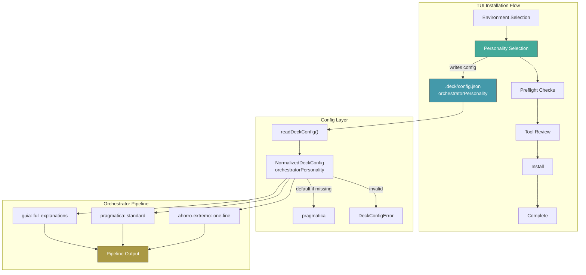

# Spec: Orchestrator Personality Selector

## Source

- Proposal: `orchestrator-personality-selector` proposal artifact
- Capabilities affected:
  - **New**: `orchestrator-personality-selection`, `orchestrator-personality-persistence`, `orchestrator-personality-aware-output`
  - **Modified**: `deck-installation-flow`, `orchestrator-pipeline`
  - **Unchanged**: `budget-watchdog`, `risk-scorer`, `quality-router`, `loop-breaker`, `runner-capabilities`

## Feature Overview

The orchestrator personality selector allows users to choose how the orchestrator communicates during the developer team workflow. Three personality profiles cover the spectrum from educational verbosity to extreme token economy:

| Personality | ID | Description |
|---|---|---|
| Guia (Teacher) | `guia` | Verbose, educational; explains rationale for every orchestrator decision. |
| Pragmatica (Pragmatic) | `pragmatica` | Balanced — communicates necessary info without excess. Default. |
| Ahorro extremo (Extreme saver) | `ahorro-extremo` | Minimal communication for maximum token savings. |

The selection occurs during the TUI installation flow as a single-step screen, is persisted to `.deck/config.json`, and is consumed by the orchestrator pipeline to adjust human-facing explanation verbosity. Machine-readable fields remain unchanged regardless of personality.

## User Stories

### US-001: Beginner selects Guia personality

As a new Deck user unfamiliar with the developer team workflow, I want to select the "Guia" personality during installation so that the orchestrator explains every decision it makes, helping me learn the system.

### US-002: Experienced user selects Pragmatica personality

As an experienced Deck user, I want the default "Pragmatica" personality so that I receive necessary context and decisions without excessive explanation, matching the current orchestrator behavior.

### US-003: Token-constrained user selects Ahorro extremo personality

As a user working with tight token budgets, I want to select "Ahorro extremo" so that the orchestrator produces minimal output, maximizing token efficiency while still surfacing critical decisions in one-line summaries.

### US-004: User changes personality after installation

As a user who initially selected one personality, I want to be able to change it later by editing `.deck/config.json` so that I am not locked into my initial choice.

## Requirements

### Capability: orchestrator-personality-selection

**REQ-SEL-001**: The TUI installation flow MUST display a personality selection screen after environment selection and before the preflight / tool review screens.

- Priority: MUST
- Surface: UI
- Rationale: The proposal places personality selection early in the flow so the preference is available before any orchestrator execution.

**REQ-SEL-002**: The personality selection screen MUST present exactly three options in this order: Guia, Pragmatica, Ahorro extremo.

- Priority: MUST
- Surface: UI
- Rationale: Three clearly differentiated personas cover the user spectrum without analysis paralysis.

**REQ-SEL-003**: Each option MUST display its name and a one-line description of its communication style.

- Priority: MUST
- Surface: UI
- Rationale: Users need enough information to make an informed choice without external documentation.

**REQ-SEL-004**: The "Ahorro extremo" option MUST display a disclaimer warning that detailed context and rationale will be omitted.

- Priority: MUST
- Surface: UI
- Rationale: Users must understand the trade-off before selecting the token-saving mode.

**REQ-SEL-005**: The "Pragmatica" option MUST be pre-selected (default cursor position) when the screen renders.

- Priority: MUST
- Surface: UI
- Rationale: Pragmatica matches current orchestrator behavior, minimizing disruption for users who skip the choice.

**REQ-SEL-006**: The user MUST be able to navigate the options using arrow keys and confirm selection with Enter.

- Priority: MUST
- Surface: UI
- Rationale: Consistent with the existing TUI navigation pattern (MenuList component).

**REQ-SEL-007**: Confirming a selection MUST advance to the next screen in the installation flow.

- Priority: MUST
- Surface: UI
- Rationale: The screen is a single-step configuration; no sub-screens or confirmation dialogs are needed.

### Capability: orchestrator-personality-persistence

**REQ-PER-001**: The selected personality MUST be written to `.deck/config.json` under a top-level field `orchestratorPersonality` with one of the string values: `"guia"`, `"pragmatica"`, or `"ahorro-extremo"`.

- Priority: MUST
- Surface: Data
- Rationale: The config file is the single source of truth for Deck settings; personality must survive process restarts.

**REQ-PER-002**: When `orchestratorPersonality` is absent from the config file, the system MUST default to `"pragmatica"`.

- Priority: MUST
- Surface: Data
- Rationale: Backward compatibility — existing installations without the field behave identically to current behavior.

**REQ-PER-003**: The config validation layer MUST reject any value for `orchestratorPersonality` that is not one of `"guia"`, `"pragmatica"`, or `"ahorro-extremo"`.

- Priority: MUST
- Surface: Data
- Rationale: Invalid personality values must fail fast rather than silently falling through to runtime defaults.

**REQ-PER-004**: The `orchestratorPersonality` field MUST be included in the `NormalizedDeckConfig` type with a resolved (non-optional) value.

- Priority: MUST
- Surface: Data
- Rationale: Downstream consumers (orchestrator pipeline) should receive a normalized config with no `undefined` checks needed.

**REQ-PER-005**: The `TOP_LEVEL_FIELDS` allow-list in the config validation MUST include `"orchestratorPersonality"`.

- Priority: MUST
- Surface: Data
- Rationale: The existing validation rejects unknown top-level fields; the new field must be added to the allow-list.

### Capability: orchestrator-personality-aware-output

**REQ-OUT-001**: The orchestrator pipeline MUST accept a personality parameter and produce different verbosity levels for human-facing explanations based on the active personality.

- Priority: MUST
- Surface: General
- Rationale: The core value of the feature — personality affects output, not logic.

**REQ-OUT-002**: Machine-readable pipeline output fields (e.g., `outcome`, `loopAction`, `riskResult.score`) MUST remain identical regardless of personality.

- Priority: MUST
- Surface: General
- Rationale: Downstream consumers (TUI, MCP tools, logging) depend on structured fields; only human-facing text changes.

**REQ-OUT-003**: When the personality is `"guia"`, the pipeline MUST include full explanations with "why this matters" context in block reasons, quality decisions, and loop-breaker messages.

- Priority: MUST
- Surface: General
- Rationale: Educational value is the primary purpose of the Guia personality.

**REQ-OUT-004**: When the personality is `"pragmatica"`, the pipeline MUST produce standard explanations matching the current orchestrator behavior.

- Priority: MUST
- Surface: General
- Rationale: No regression; existing users see no change.

**REQ-OUT-005**: When the personality is `"ahorro-extremo"`, the pipeline MUST produce one-line summaries only, omitting extended rationale from human-facing text.

- Priority: MUST
- Surface: General
- Rationale: Maximum token savings for budget-constrained users.

**REQ-OUT-006**: When the personality is `"ahorro-extremo"`, critical block reasons MUST still include a mandatory one-line summary.

- Priority: MUST
- Surface: General
- Rationale: Token savings must not suppress essential warnings that could cause user errors.

**REQ-OUT-007**: The personality MUST apply transversally to all runners (Pi, OpenCode, and future adapters).

- Priority: MUST
- Surface: Integration
- Rationale: Communication style is a personal preference, not runner-specific.

### Capability: deck-installation-flow (modified)

**REQ-FLOW-001**: The `NextScreen` union type MUST include `"personality-selection"` as a valid screen.

- Priority: MUST
- Surface: General
- Rationale: The flow router must recognize the new screen to navigate to it.

**REQ-FLOW-002**: After environment selection completes, the flow MUST route to the personality selection screen.

- Priority: MUST
- Surface: General
- Rationale: The proposal specifies personality selection as the next step after environment selection.

**REQ-FLOW-003**: After personality selection completes, the flow MUST route to the appropriate preflight screen (Pi preflight or OpenCode preflight depending on selected environments).

- Priority: MUST
- Surface: General
- Rationale: The personality screen is a single step; flow continues to the existing preflight checks.

## Screen Specification

### Personality Selection Screen

**Screen ID**: `personality-selection`

**Title**: "Choose orchestrator personality"

**Layout**:
```
┌─────────────────────────────────────────────────┐
│  Choose orchestrator personality                 │
│  Controls how verbose the orchestrator is when   │
│  communicating decisions and rationale.           │
│                                                  │
│  ❯ Guía (Teacher)                                │
│    Pragmática (Pragmatic)              [default]  │
│    Ahorro extremo (Extreme saver)                │
│                                                  │
│  ⚠ Ahorro extremo omits detailed context and     │
│    rationale to save tokens.                     │
│                                                  │
│  ↑↓ Navigate   Enter Confirm                     │
└─────────────────────────────────────────────────┘
```

**Options list**:

| # | Name | Label | Hint / Description | Token Cost Indicator |
|---|---|---|---|---|
| 1 | Guia | `Guía (Teacher)` | "Full explanations with educational context" | Higher token usage |
| 2 | Pragmatica | `Pragmática (Pragmatic)` | "Balanced communication — what you need, nothing more" | Moderate token usage (default) |
| 3 | Ahorro extremo | `Ahorro extremo (Extreme saver)` | "Minimal output for maximum token savings" | Lowest token usage |

**Disclaimer**: The screen MUST display a persistent warning that "Ahorro extremo" omits detailed context and rationale. This warning is always visible (not only when the option is highlighted) because the user must be aware of the trade-off regardless of cursor position.

**Selection behavior**:
- Arrow keys move the cursor up/down.
- Enter confirms the highlighted option and writes it to config.
- No multiselect; exactly one personality is chosen.

**Navigation**:
- **Back**: Returns to the environment selection screen.
- **Next (Enter)**: Persists selection to `.deck/config.json` and advances to the preflight screen for the first selected environment.

**Component pattern**: Uses the existing `MenuList` component with single-select mode, consistent with other selection screens (e.g., `MemoryProviderSelectionScreen`).

## Data Flow

```
1. User selects personality on TUI screen
   ↓
2. TUI writes selected value to .deck/config.json
   {"orchestratorPersonality": "guia" | "pragmatica" | "ahorro-extremo"}
   ↓
3. Config validation layer reads and normalizes:
   - Missing field → defaults to "pragmatica"
   - Invalid value → throws DeckConfigError
   - Valid value → included in NormalizedDeckConfig
   ↓
4. Orchestrator pipeline reads personality from NormalizedDeckConfig
   ↓
5. Pipeline adjusts human-facing output verbosity:
   - guia: full explanations + "why this matters"
   - pragmatica: standard explanations (current behavior)
   - ahorro-extremo: one-line summaries, no rationale
   ↓
6. Machine-readable fields pass through unchanged
```

## Acceptance Scenarios

### Capability: orchestrator-personality-selection

#### Scenario: User sees personality selection screen during installation

**Given** the user has completed environment selection in the TUI installation flow
**When** the flow advances to the next screen
**Then** a personality selection screen is displayed with three options: Guia, Pragmatica, Ahorro extremo
**And** the Pragmatica option is pre-selected
**And** a disclaimer about Ahorro extremo token trade-offs is visible
> Covers: REQ-SEL-001, REQ-SEL-002, REQ-SEL-003, REQ-SEL-004, REQ-SEL-005

#### Scenario: User selects Guia personality

**Given** the personality selection screen is displayed
**When** the user navigates to "Guía" and presses Enter
**Then** the system writes `{"orchestratorPersonality": "guia"}` to `.deck/config.json`
**And** the flow advances to the preflight screen
> Covers: REQ-SEL-006, REQ-SEL-007, REQ-PER-001

#### Scenario: User selects Ahorro extremo personality

**Given** the personality selection screen is displayed
**When** the user navigates to "Ahorro extremo" and presses Enter
**Then** the system writes `{"orchestratorPersonality": "ahorro-extremo"}` to `.deck/config.json`
**And** the flow advances to the preflight screen
> Covers: REQ-SEL-006, REQ-SEL-007, REQ-PER-001

#### Scenario: User accepts default Pragmatica personality

**Given** the personality selection screen is displayed with Pragmatica pre-selected
**When** the user presses Enter without changing the selection
**Then** the system writes `{"orchestratorPersonality": "pragmatica"}` to `.deck/config.json`
**And** the flow advances to the preflight screen
> Covers: REQ-SEL-005, REQ-SEL-007, REQ-PER-001

#### Scenario: User navigates back from personality screen

**Given** the personality selection screen is displayed
**When** the user presses the back navigation key
**Then** the flow returns to the environment selection screen
**And** no personality is written to config yet
> Covers: REQ-SEL-007

### Capability: orchestrator-personality-persistence

#### Scenario: Config defaults to pragmatica when field is missing

**Given** `.deck/config.json` exists without an `orchestratorPersonality` field
**When** the config is read and normalized
**Then** `NormalizedDeckConfig.orchestratorPersonality` resolves to `"pragmatica"`
> Covers: REQ-PER-002, REQ-PER-004

#### Scenario: Config defaults to pragmatica when config file does not exist

**Given** `.deck/config.json` does not exist
**When** the config is read
**Then** `NormalizedDeckConfig.orchestratorPersonality` resolves to `"pragmatica"`
> Covers: REQ-PER-002

#### Scenario: Config rejects invalid personality value

**Given** `.deck/config.json` contains `{"orchestratorPersonality": "chatty"}`
**When** the config is validated
**Then** a `DeckConfigError` with code `DECK_CONFIG_INVALID_SHAPE` is thrown
**And** the error references the `orchestratorPersonality` field path
> Covers: REQ-PER-003

#### Scenario: Config rejects non-string personality value

**Given** `.deck/config.json` contains `{"orchestratorPersonality": 42}`
**When** the config is validated
**Then** a `DeckConfigError` is thrown
> Covers: REQ-PER-003

#### Scenario: Config accepts all valid personality values

**Given** a `.deck/config.json` with `{"orchestratorPersonality": "guia"}`
**When** the config is validated
**Then** `NormalizedDeckConfig.orchestratorPersonality` equals `"guia"`

- **Variant: pragmatica value**
  - Given config has `{"orchestratorPersonality": "pragmatica"}`
  - When validated
  - Then `NormalizedDeckConfig.orchestratorPersonality` equals `"pragmatica"`

- **Variant: ahorro-extremo value**
  - Given config has `{"orchestratorPersonality": "ahorro-extremo"}`
  - When validated
  - Then `NormalizedDeckConfig.orchestratorPersonality` equals `"ahorro-extremo"`
> Covers: REQ-PER-001, REQ-PER-003, REQ-PER-004

### Capability: orchestrator-personality-aware-output

#### Scenario: Guia personality produces full explanations

**Given** the orchestrator pipeline is configured with personality `"guia"`
**When** the pipeline produces a block reason for a quality gate failure
**Then** the human-facing explanation includes the full rationale
**And** the explanation includes a "why this matters" context section
> Covers: REQ-OUT-001, REQ-OUT-003

#### Scenario: Pragmatica personality produces standard explanations

**Given** the orchestrator pipeline is configured with personality `"pragmatica"`
**When** the pipeline produces a block reason for a quality gate failure
**Then** the human-facing explanation matches the current orchestrator output format
> Covers: REQ-OUT-001, REQ-OUT-004

#### Scenario: Ahorro extremo personality produces one-line summaries

**Given** the orchestrator pipeline is configured with personality `"ahorro-extremo"`
**When** the pipeline produces a block reason for a quality gate failure
**Then** the human-facing explanation is a single line
**And** no extended rationale or "why this matters" context is included
> Covers: REQ-OUT-001, REQ-OUT-005

#### Scenario: Critical block reasons always include one-line summary in ahorro-extremo

**Given** the orchestrator pipeline is configured with personality `"ahorro-extremo"`
**When** the pipeline encounters a critical block condition
**Then** the output still includes a mandatory one-line summary of the blocking reason
> Covers: REQ-OUT-005, REQ-OUT-006

#### Scenario: Machine-readable fields are identical across all personalities

**Given** the orchestrator pipeline is configured with personality `"guia"`, `"pragmatica"`, or `"ahorro-extremo"`
**When** the pipeline produces output
**Then** machine-readable fields (`outcome`, `loopAction`, `riskResult.score`) are structurally identical across all three personalities
**And** only human-facing text fields differ
> Covers: REQ-OUT-002

#### Scenario: Personality applies to all runners

**Given** the orchestrator personality is set to `"guia"`
**When** the orchestrator pipeline runs under both the Pi runner and the OpenCode runner
**Then** both runners produce output with full explanations and educational context
> Covers: REQ-OUT-007

### Capability: deck-installation-flow (modified)

#### Scenario: Flow routes to personality selection after environment selection

**Given** the user has completed the environment selection screen
**When** the flow router determines the next screen
**Then** the next screen is `"personality-selection"`
> Covers: REQ-FLOW-001, REQ-FLOW-002

#### Scenario: Flow routes to preflight after personality selection

**Given** the user has completed the personality selection screen
**And** the user selected "pi-development" as an environment
**When** the flow router determines the next screen
**Then** the next screen is the Pi preflight screen

- **Variant: OpenCode environment selected**
  - Given the user selected "opencode" as an environment
  - When the flow router determines the next screen after personality selection
  - Then the next screen is the OpenCode preflight screen
> Covers: REQ-FLOW-003

#### Scenario: Flow routes to personality selection before preflight (not after)

**Given** the full TUI installation flow runs from start to finish
**When** the screens are rendered in sequence
**Then** the order is: environment selection → personality selection → preflight → tool review → install → complete
**And** personality selection appears exactly once in the flow
> Covers: REQ-FLOW-002, REQ-FLOW-003

## Validation Rules

| Field / Input | Rule | Error Message | REQ-ID |
|---|---|---|---|
| `orchestratorPersonality` (string) | Must be one of `"guia"`, `"pragmatica"`, `"ahorro-extremo"` if present | `orchestratorPersonality must be one of: guia, pragmatica, ahorro-extremo` | REQ-PER-003 |
| `orchestratorPersonality` (type) | Must be a string when present | `orchestratorPersonality must be a string.` | REQ-PER-003 |

## Error Contracts

| Condition | Error Code | Message | Notes |
|---|---|---|---|
| Invalid personality string | `DECK_CONFIG_INVALID_SHAPE` | `orchestratorPersonality must be one of: guia, pragmatica, ahorro-extremo` | Reuses existing error code; fieldPath set to `orchestratorPersonality` |
| Non-string personality value | `DECK_CONFIG_INVALID_SHAPE` | `orchestratorPersonality must be a string.` | Reuses existing error code |

## Out of Scope

The following are explicitly **not** part of this spec:

- **Real-time personality switching** during a running orchestrator pipeline.
- **Per-runner personality overrides** (Pi vs OpenCode different personalities).
- **Personality-driven logic changes** — risk scoring, quality routing, loop-breaking logic remain unchanged; only communication verbosity is affected.
- **Post-installation UI for changing personality** — users can edit `.deck/config.json` manually; a dedicated settings screen is future work.
- **Non-TUI (headless/CI) personality selection** — CLI flags or environment variables for personality are deferred.
- **Agent system prompt injection** — personality affects orchestrator pipeline output messages, not the SKILL.md or agent instruction files.
- **TUI screen description/hint suppression** in ahorro-extremo mode — the TUI itself renders fully regardless of personality.
- **Token-usage telemetry** for personality selection analytics.

## Open Questions

1. **Agent instruction injection**: Should the personality value also be injected into the orchestrator's agent system prompt (SKILL.md or agent instructions) in addition to pipeline output? The proposal scope limits this to pipeline output messages, but the question was raised in the proposal's open questions and remains unresolved. **Current spec position: personality affects pipeline output only; agent instructions are out of scope.**

2. **TUI hint suppression in ahorro-extremo**: Should the ahorro-extremo personality also suppress TUI screen descriptions and hints during installation, or only orchestrator-generated text? **Current spec position: TUI rendering is unaffected by personality; only orchestrator pipeline output changes.**

3. **Telemetry hook**: Is there an existing token-usage telemetry/logging hook where personality selection should be logged for future analysis? **Current spec position: no telemetry requirement.**

## Compliance Matrix

| REQ-ID | Scenario(s) | Status |
|---|---|---|
| REQ-SEL-001 | User sees personality selection screen | Defined |
| REQ-SEL-002 | User sees personality selection screen | Defined |
| REQ-SEL-003 | User sees personality selection screen | Defined |
| REQ-SEL-004 | User sees personality selection screen | Defined |
| REQ-SEL-005 | User accepts default Pragmatica / User sees personality selection screen | Defined |
| REQ-SEL-006 | User selects Guia / User selects Ahorro extremo | Defined |
| REQ-SEL-007 | User selects Guia / User selects Ahorro extremo / User accepts default / User navigates back | Defined |
| REQ-PER-001 | User selects Guia / Config accepts all valid personality values | Defined |
| REQ-PER-002 | Config defaults to pragmatica when field missing / Config defaults when file missing | Defined |
| REQ-PER-003 | Config rejects invalid value / Config rejects non-string / Config accepts all valid | Defined |
| REQ-PER-004 | Config defaults to pragmatica / Config accepts all valid | Defined |
| REQ-PER-005 | (Implicit in REQ-PER-003 — allow-list update) | Defined |
| REQ-OUT-001 | Guia full explanations / Pragmatica standard / Ahorro one-line | Defined |
| REQ-OUT-002 | Machine-readable fields identical across all | Defined |
| REQ-OUT-003 | Guia full explanations | Defined |
| REQ-OUT-004 | Pragmatica standard explanations | Defined |
| REQ-OUT-005 | Ahorro one-line summaries / Critical block one-line | Defined |
| REQ-OUT-006 | Critical block one-line in ahorro-extremo | Defined |
| REQ-OUT-007 | Personality applies to all runners | Defined |
| REQ-FLOW-001 | Flow routes to personality selection | Defined |
| REQ-FLOW-002 | Flow routes after environment / Flow sequence | Defined |
| REQ-FLOW-003 | Flow routes to preflight after personality / Flow sequence | Defined |

## Mermaid Summary Source


