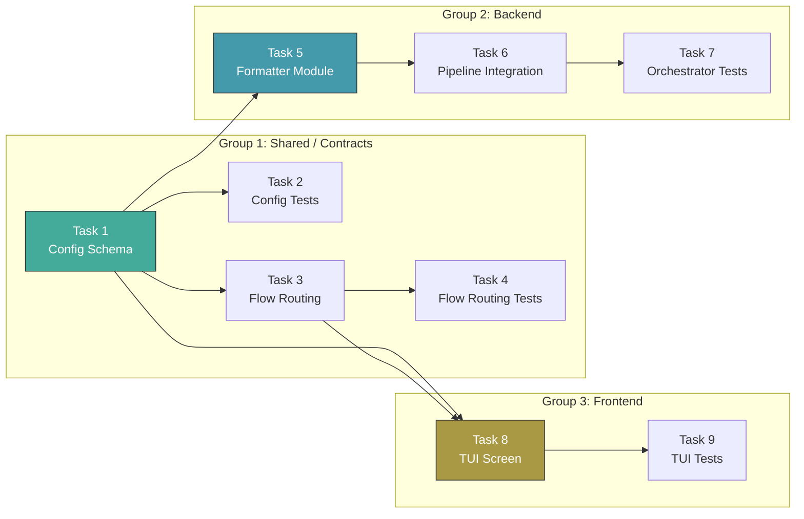

# Tasks: Orchestrator Personality Selector

## Source

- Spec: `orchestrator-personality-selector` spec artifact
- Design: `orchestrator-personality-selector` design artifact
- Capabilities affected: `orchestrator-personality-selection`, `orchestrator-personality-persistence`, `orchestrator-personality-aware-output`, `deck-installation-flow`, `orchestrator-pipeline`

## Task Groups

### Group: Shared / Contracts

#### Task 1: Config schema — personality types, constants, validation, normalization, allow-list

**Owner**: General Apply
**Priority**: P0
**Complexity**: Medium
**Parallel**: Yes
**Depends on**: none

**Description**
Extend the Deck config system in `packages/core/src/config/deck-config.ts` with the orchestrator personality feature. Add the `OrchestratorPersonality` union type (`"guia" | "pragmatica" | "ahorro-extremo"`), the `ORCHESTRATOR_PERSONALITIES` const array, and `DEFAULT_ORCHESTRATOR_PERSONALITY` (value `"pragmatica"`). Extend `DeckConfig` with `orchestratorPersonality?: OrchestratorPersonality`. Extend `NormalizedDeckConfig` with `orchestratorPersonality: OrchestratorPersonality` (required). Add `"orchestratorPersonality"` to the top-level known-field allow-list (`TOP_LEVEL_FIELDS` or equivalent). Add validation that rejects values not in the union and non-string types, throwing `DeckConfigError` with code `DECK_CONFIG_INVALID_SHAPE` and `fieldPath: "orchestratorPersonality"`. Add normalization that defaults missing/absent values to `"pragmatica"`.

**Files**
- `packages/core/src/config/deck-config.ts` — modify

**Verification**
- `npx tsx packages/core/src/config/deck-config.ts` compiles without errors (or workspace build passes)
- Config normalization: missing field → `"pragmatica"`, valid values pass through, invalid value throws `DeckConfigError`
- Covers: REQ-PER-001, REQ-PER-002, REQ-PER-003, REQ-PER-004, REQ-PER-005

---

#### Task 2: Config unit tests — personality validation, defaulting, persistence

**Owner**: General Apply
**Priority**: P0
**Complexity**: Medium
**Parallel**: No — depends on Task 1
**Depends on**: Task 1

**Description**
Add tests to `packages/core/src/config/deck-config.test.ts` covering: (1) `NormalizedDeckConfig.orchestratorPersonality` defaults to `"pragmatica"` when config file is absent, (2) defaults to `"pragmatica"` when field is missing from existing config, (3) all three valid values (`"guia"`, `"pragmatica"`, `"ahorro-extremo"`) validate and normalize correctly, (4) invalid string value throws `DeckConfigError` with `DECK_CONFIG_INVALID_SHAPE`, (5) non-string value throws `DeckConfigError`, (6) write-then-read round-trip preserves personality, (7) write personality does not erase existing `adaptiveMemory` / `packageInstructions` fields (merge behavior).

**Files**
- `packages/core/src/config/deck-config.test.ts` — modify

**Verification**
- `npm test -- packages/core/src/config/deck-config.test.ts` passes
- Covers: REQ-PER-001 through REQ-PER-005 acceptance scenarios

---

#### Task 3: Flow routing — NextScreen extension and personality routing helpers

**Owner**: General Apply
**Priority**: P0
**Complexity**: Low
**Parallel**: No — depends on Task 1
**Depends on**: Task 1

**Description**
Extend `NextScreen` union type in `apps/cli/src/developer-team-flow.ts` with `"personality-selection"`. Add `getNextScreenAfterEnvironmentSelection(context: FlowContext): NextScreen` that returns `"personality-selection"` when selected environments are non-empty, or `"complete"` as defensive fallback. Add `getNextScreenAfterPersonalitySelection(context: FlowContext): NextScreen` that routes to `"pi-preflight-checking"` if Pi is selected, `"opencode-preflight-checking"` if only OpenCode is selected, or `"complete"` as fallback. Preserve current preflight precedence (Pi first when both are selected).

**Files**
- `apps/cli/src/developer-team-flow.ts` — modify

**Verification**
- Existing flow routing tests pass unchanged
- New helper returns `"personality-selection"` after environment selection with environments selected
- Post-personality helper returns correct preflight screen based on selected environments
- Covers: REQ-FLOW-001, REQ-FLOW-002, REQ-FLOW-003

---

#### Task 4: Flow routing unit tests

**Owner**: General Apply
**Priority**: P1
**Complexity**: Low
**Parallel**: No — depends on Task 3
**Depends on**: Task 3

**Description**
Add tests to `apps/cli/src/developer-team-flow.test.ts` covering: (1) `getNextScreenAfterEnvironmentSelection` returns `"personality-selection"` when environments are selected, (2) returns `"complete"` when no environments are selected, (3) `getNextScreenAfterPersonalitySelection` routes to `"pi-preflight-checking"` when Pi is selected (even if OpenCode is also selected), (4) routes to `"opencode-preflight-checking"` when only OpenCode is selected, (5) routes to `"complete"` when no environments are selected (defensive).

**Files**
- `apps/cli/src/developer-team-flow.test.ts` — modify

**Verification**
- `npm test -- apps/cli/src/developer-team-flow.test.ts` passes
- Covers: REQ-FLOW-001, REQ-FLOW-002, REQ-FLOW-003 acceptance scenarios

---

### Group: Backend

#### Task 5: Personality output formatter module

**Owner**: Backend Apply
**Priority**: P0
**Complexity**: Medium
**Parallel**: No — depends on Task 1
**Depends on**: Task 1

**Description**
Create `packages/sdd-runtime/src/orchestrator/personality-output.ts` — a pure formatting module that shapes human-facing explanation strings based on personality. Import `OrchestratorPersonality` and `DEFAULT_ORCHESTRATOR_PERSONALITY` from `@deck/core` (or define a compatible local type if workspace dependency rules require it). Export formatter functions:

- `formatBlockReason(facts: BlockReasonFacts, personality: OrchestratorPersonality): string` — `guia` returns full rationale + "why this matters" context; `pragmatica` returns standard explanation (match current behavior); `ahorro-extremo` returns one-line mandatory summary with critical facts only.
- `formatSkipReason(facts: SkipReasonFacts, personality: OrchestratorPersonality): string` — analogous verbosity scaling for quality skip reasons.
- `formatLoopBreakerMessage(facts: LoopBreakerFacts, personality: OrchestratorPersonality): string` — analogous scaling for loop-breaker messages (if applicable).

Facts types should be structured (e.g., `{ missingFields: string[]; invalidFields: string[]; enforcementMode?: string }`) rather than prebuilt paragraphs. Unknown/undefined personality normalizes to `"pragmatica"` before use.

**Files**
- `packages/sdd-runtime/src/orchestrator/personality-output.ts` — create

**Verification**
- File compiles without errors
- Import from `@deck/core` resolves (or local type is compatible)
- Formatter produces three distinct verbosity levels for the same input facts
- Covers: REQ-OUT-001, REQ-OUT-003, REQ-OUT-004, REQ-OUT-005, REQ-OUT-006

---

#### Task 6: Orchestrator pipeline personality integration

**Owner**: Backend Apply
**Priority**: P1
**Complexity**: Medium
**Parallel**: No — depends on Task 5
**Depends on**: Task 5

**Description**
Modify `runOrchestratorPipeline()` in `packages/sdd-runtime/src/orchestrator/orchestrator-pipeline.ts` to accept personality in `PipelineConfig`. Add `personality?: OrchestratorPersonality` to the `PipelineConfig` interface, defaulting to `DEFAULT_ORCHESTRATOR_PERSONALITY`. Replace inline string construction for `blockReason` and `qualityDecision.skipReason` with calls to the personality formatter from `personality-output.ts`. Ensure all machine-readable fields (`outcome`, `loopAction`, `riskResult`, `qualityDecision.invokeQuality`, `qualityDecision.checksToRun`, etc.) remain structurally identical regardless of personality.

**Files**
- `packages/sdd-runtime/src/orchestrator/orchestrator-pipeline.ts` — modify

**Verification**
- Existing pipeline tests pass unchanged (pragmatica matches current output)
- Pipeline compiles and exports updated `PipelineConfig` with optional `personality`
- Machine-readable fields are invariant across personality values for identical inputs
- Covers: REQ-OUT-001, REQ-OUT-002, REQ-OUT-003, REQ-OUT-004, REQ-OUT-005, REQ-OUT-006, REQ-OUT-007

---

#### Task 7: Orchestrator personality tests

**Owner**: Backend Apply
**Priority**: P1
**Complexity**: Medium
**Parallel**: No — depends on Tasks 5, 6
**Depends on**: Task 5, Task 6

**Description**
Add tests to `packages/sdd-runtime/src/orchestrator/orchestrator-pipeline.test.ts` (and/or a new `personality-output.test.ts`) covering:

1. `pragmatica` output matches current pipeline behavior (baseline regression).
2. `guia` output includes expanded rationale with "why this matters" context for block reasons and skip reasons.
3. `ahorro-extremo` output is a single line, no extended rationale, for block reasons and skip reasons.
4. Critical block conditions still include a mandatory one-line summary in `ahorro-extremo`.
5. Machine-readable fields (`outcome`, `loopAction`, `riskResult.score`, `qualityDecision.invokeQuality`, `qualityDecision.checksToRun`) are structurally identical across all three personalities for the same pipeline input.
6. Undefined/missing personality defaults to `"pragmatica"` and produces standard output.

**Files**
- `packages/sdd-runtime/src/orchestrator/orchestrator-pipeline.test.ts` — modify
- `packages/sdd-runtime/src/orchestrator/personality-output.test.ts` — create

**Verification**
- `npm test -- packages/sdd-runtime/src/orchestrator/` passes
- Covers: REQ-OUT-001 through REQ-OUT-007 acceptance scenarios

---

### Group: Frontend

#### Task 8: TUI PersonalitySelectionScreen — component, state, navigation

**Owner**: Frontend Apply
**Priority**: P1
**Complexity**: High
**Parallel**: No — depends on Tasks 1, 3
**Depends on**: Task 1, Task 3

**Description**
Add `PersonalitySelectionScreen` to `apps/cli/src/tui/app.tsx` following the pattern of existing selection screens (e.g., `EnvironmentSelectionScreen`, `MemoryProviderSelectionScreen`). The screen renders a `MenuList` with three single-select options:

1. `Guía (Teacher)` — hint: "Full explanations with educational context"
2. `Pragmática (Pragmatic)` — hint: "Balanced communication — what you need, nothing more" — pre-selected default
3. `Ahorro extremo (Extreme saver)` — hint: "Minimal output for maximum token savings"

Display a persistent disclaimer: "⚠ Ahorro extremo omits detailed context and rationale to save tokens." (always visible, not only when highlighted). Add `selectedPersonality` to `DeckApp` state initialized from `readDeckConfig(resolveProjectRoot()).orchestratorPersonality` with fallback `"pragmatica"`. Extend the local `Screen` union with `"personality-selection"`. On Enter: update `selectedPersonality`, merge selection into existing normalized config via `readDeckConfig` + `writeDeckConfig`, route to the next screen via the Task 3 routing helper. On Escape/Back: return to `environment-selection`. Add `"personality-selection"` cursor limit (2) to `getCursorLimit()`. Wire navigation: `environment-selection` → `personality-selection` → preflight (using Task 3 helpers).

**Files**
- `apps/cli/src/tui/app.tsx` — modify

**Verification**
- TUI renders three options with labels, hints, and persistent disclaimer
- Pragmática is pre-selected when screen loads
- Arrow keys navigate; Enter confirms and writes to `.deck/config.json`
- Escape returns to environment selection
- Config write merges with existing fields (does not erase `adaptiveMemory`/`packageInstructions`)
- Covers: REQ-SEL-001 through REQ-SEL-007, REQ-PER-001

---

#### Task 9: TUI render and routing tests

**Owner**: Frontend Apply
**Priority**: P1
**Complexity**: Medium
**Parallel**: No — depends on Task 8
**Depends on**: Task 8

**Description**
Add tests to `apps/cli/src/tui/developer-team-flow.test.tsx` covering:

1. Personality screen renders three options with correct labels and hints.
2. Cursor highlighting works through `MenuList` (default position on Pragmática).
3. Disclaimer text is present in the rendered output.
4. Environment selection routes to `personality-selection` (not directly to preflight).
5. Personality continue routes to Pi preflight when Pi is selected (even with OpenCode also selected).
6. Personality continue routes to OpenCode preflight when only OpenCode is selected.
7. Selecting a personality writes the correct value to `.deck/config.json` (mocked).
8. Back navigation returns to environment selection without writing config.

**Files**
- `apps/cli/src/tui/developer-team-flow.test.tsx` — modify

**Verification**
- `npm test -- apps/cli/src/tui/developer-team-flow.test.tsx` passes
- Covers: REQ-SEL-001 through REQ-SEL-007 acceptance scenarios, REQ-FLOW-002, REQ-FLOW-003

---

## Dependency Graph

```
Task 1 (Shared: Config schema)
  ├── Task 2 (Shared: Config tests)
  ├── Task 3 (Shared: Flow routing)
  │   └── Task 4 (Shared: Flow routing tests)
  ├── Task 5 (Backend: Formatter)
  │   ├── Task 6 (Backend: Pipeline integration)
  │   │   └── Task 7 (Backend: Orchestrator tests)
  │   └── Task 7 (Backend: Orchestrator tests)
  └── Task 8 (Frontend: TUI screen)
      └── Task 9 (Frontend: TUI tests)
```

## Parallelization Plan

| Phase | Tasks | Can Run in Parallel |
|---|---|---|
| Shared — Config schema | Task 1 | Yes (no deps) |
| Shared — Config tests + Flow routing | Task 2, Task 3 | Yes (both depend only on Task 1, independent of each other) |
| Shared — Flow routing tests | Task 4 | No — depends on Task 3 |
| Backend — Formatter | Task 5 | Yes with Task 3 (both depend only on Task 1) |
| Backend — Pipeline integration | Task 6 | No — depends on Task 5 |
| Backend — Orchestrator tests | Task 7 | No — depends on Tasks 5, 6 |
| Frontend — TUI screen | Task 8 | Yes with Tasks 4, 5, 6 (depends on Tasks 1, 3) |
| Frontend — TUI tests | Task 9 | No — depends on Task 8 |

## Responsibility Contracts

| Contract / Boundary | Owner | Consumers | Notes |
|---|---|---|---|
| `OrchestratorPersonality` type + `ORCHESTRATOR_PERSONALITIES` + `DEFAULT_ORCHESTRATOR_PERSONALITY` | General Apply (Task 1) | Backend Apply (Tasks 5–7), Frontend Apply (Tasks 8–9) | Core config is the single source of truth; sdd-runtime must import or define compatible local type |
| `NormalizedDeckConfig.orchestratorPersonality` | General Apply (Task 1) | Backend Apply (Task 6), Frontend Apply (Task 8) | Always resolved (non-optional) after normalization |
| `PipelineConfig.personality` field | Backend Apply (Task 6) | Backend Apply (Task 7) | Optional with default; backward compatible |
| `getNextScreenAfterEnvironmentSelection` / `getNextScreenAfterPersonalitySelection` | General Apply (Task 3) | Frontend Apply (Task 8) | Pure functions; TUI calls these to determine navigation |
| `personality-output.ts` formatter API | Backend Apply (Task 5) | Backend Apply (Task 6) | Structured facts in, formatted string out; no side effects |

## Complexity Summary

| Complexity | Count | Task Numbers |
|---|---|---|
| Low | 2 | Task 3, Task 4 |
| Medium | 6 | Task 1, Task 2, Task 5, Task 6, Task 7, Task 9 |
| High | 1 | Task 8 |

## Flagged for Splitting

- **Task 8** (TUI PersonalitySelectionScreen): High complexity, touches `app.tsx` which is a large file. If the Apply agent encounters difficulty, consider splitting into: (8a) Screen component render + state, (8b) Navigation wiring + config write. The component itself is relatively small (~80 lines), but `app.tsx` is a large file requiring careful insertion.

## Review Workload Forecast

| Signal | Value |
|---|---|
| Estimated changed lines | 400-800 |
| 400-line budget risk | Medium |
| Scope reduction recommended | No |
| Sequential work slices recommended | No — tasks are already sliced by domain |
| Decision needed before Apply | No |

**Rationale**: The change spans three domains (config, pipeline, TUI) with well-defined boundaries. Estimated new+modified lines are 450-600 across 8-9 files. Config and formatter are low-risk additions; the TUI screen is the highest-risk piece due to `app.tsx` size. No spec-design conflicts block Apply. Sequential work slices within each domain are natural (schema → tests, formatter → integration → tests).

## Open Questions / Blockers

- **Rollback compatibility caveat** (non-blocking, allowed-with-stub): The design notes that the current strict config validator rejects unknown top-level fields. If this change is rolled back while `.deck/config.json` still contains `orchestratorPersonality`, the old validator will reject the config file. This is a known risk documented in the design; rollback instructions should remove the field. No action needed for forward implementation.

- **sdd-runtime ↔ core dependency** (non-blocking, implementation detail): Task 5 needs `OrchestratorPersonality` type. If `packages/sdd-runtime` does not already have a workspace dependency on `@deck/core`, the formatter either needs a new dependency added or must define a compatible local type union. The Apply agent should check `packages/sdd-runtime/package.json` and follow whichever path the workspace conventions favor.

- **No non-test pipeline callers** (non-blocking, awareness): The design notes that no non-test callers of `runOrchestratorPipeline` were found in the indexed code graph. The personality parameter in `PipelineConfig` is therefore only exercised through tests. This is acceptable for now since the design correctly scopes the feature to the pipeline boundary; actual runner integration will consume the parameter when runners are connected.

> No implementation-blocking questions remain. Tasks are ready for Apply.

## Mermaid Summary Source


