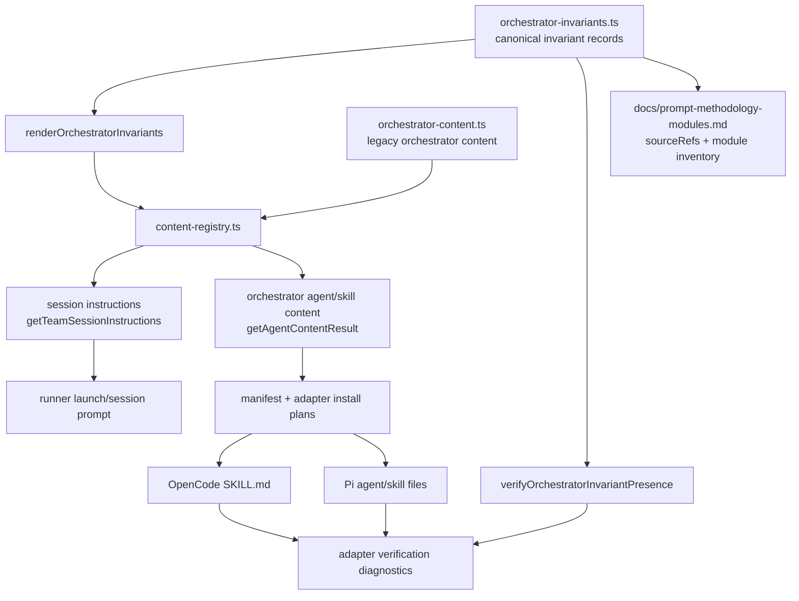

# Design: Persistent Orchestrator Invariants

## Source

- Proposal: `persistent-orchestrator-invariants` proposal artifact
- Exploration: `openspec/changes/persistent-orchestrator-invariants/exploration.md`
- Capabilities affected: `orchestrator-invariant-system`, `prompt-module-documentation`, `orchestrator-content`, `instruction-bundle-composition`
- Spec status: not yet available / parallel phase
- User correction: document the existing **SDD Triage Gate** as one prompt/methodology module; do **not** introduce a separate “documentation triage”.

## Current Architecture Context

- Canonical Developer Team content lives in `packages/core/src/teams/developer/*-content.ts`.
- `packages/core/src/teams/developer/orchestrator-content.ts` currently owns:
  - full orchestrator session prompt via `getOrchestratorSystemPrompt(personality)`,
  - `ORCHESTRATOR_AGENT_BODY`,
  - `ORCHESTRATOR_SKILL_BODY`,
  - embedded gates/rules including pure delegation, SDD Initialization Gate, SDD Triage Gate, Execution Mode, and registry-deferred mode.
- `packages/core/src/teams/developer/content-registry.ts` is the runner-agnostic composition point:
  - `getTeamSessionInstructions()` returns session-level orchestrator rules,
  - `getAgentContentResult()` returns agent/skill content,
  - `applyAgentContentComposition()` appends capability instruction bundles to agent/skill surfaces,
  - context-authority guidance is appended before capability instructions.
- `packages/core/src/teams/developer/instruction-bundles/index.ts` composes configurable package instructions using `PACKAGE_ORDER` (`codebase-memory`, `context-mode`, `rtk`, `adaptive-memory`). These are capability packages, not behavioral invariants.
- `packages/core/src/teams/developer/manifest.ts` builds a runner-neutral `DeveloperTeamManifest` from catalog + content registry output; adapters serialize this manifest or equivalent plans.
- Runner adapters consume core content:
  - OpenCode: `packages/adapter-opencode/src/developer-team-install.ts` builds `SKILL.md` files with `buildSkillFileContent()` and verifies installed files via `verifyOpenCodeDeveloperTeamInstall()`.
  - Pi: `packages/adapter-pi/src/developer-team-install.ts` builds agent and skill files with `buildAgentFileContent()` / `buildSkillFileContent()` and verifies via `verifyDeveloperTeamInstall()`.
- Existing verification checks frontmatter and headings, but not presence/order of critical orchestrator behavioral rules.
- Documentation gap: `docs/developer-team.md` documents roster/workflow, but prompt/methodology modules such as SDD Triage Gate, Artifact Store/Spec Registry, and Return Contracts are mainly embedded in prompts.

## Proposed Architecture

Create a small runner-agnostic invariant layer in core, composed before all other prompt fragments for orchestrator-facing surfaces and verified from the same source registry.

### Design Decisions

1. **Central invariant source in core**
   - Add `packages/core/src/teams/developer/orchestrator-invariants.ts` (or `orchestrator-invariants/index.ts` if split later).
   - Export immutable invariant records and render/verify helpers.
   - Keep invariants adjacent to Developer Team content, not in adapter packages or adaptive memory.

2. **Invariant schema**
   - Use a typed record similar to:

     ```ts
     type OrchestratorInvariantTier = "critical" | "high" | "standard";
     type OrchestratorInvariantSurface = "session" | "agent" | "skill" | "manifest";

     interface OrchestratorInvariant {
       id: `INV-${string}`;
       title: string;
       tier: OrchestratorInvariantTier;
       surfaces: readonly OrchestratorInvariantSurface[];
       sourceRefs: readonly string[];
       condition: string;
       requiredAction: string;
       rationale: string;
       violationConsequence: string;
     }
     ```

   - `sourceRefs` ties each invariant to the original source location(s), reducing semantic drift.

3. **Initial critical invariants**
   - `INV-001` Execution Mode Gate: ask Automatic vs Interactive before first SDD run per session; cache the answer.
   - `INV-002` Pure Delegator: orchestrator delegates all specialist work; it does not implement phase/apply work itself.
   - `INV-003` SDD Initialization Gate: check `openspec/config.yaml` initialized state before SDD work; delegate `deck-init` when required.
   - `INV-004` SDD Triage Gate: classify user request before execution mode; do not infer full SDD only from keywords. This is the existing triage gate, not a new documentation concept.
   - `INV-005` Registry-Deferred Parallelism: parallel phase agents write artifacts only and return registry intent; orchestrator serializes shared `state.yaml`/`events.yaml` updates.

4. **Highest-visibility injection**
    - Add core renderer: `renderOrchestratorInvariants({ surface, tierMin? })`.
    - Add core composer: `prependOrchestratorInvariants(content, surface)`.
    - Composition order for orchestrator outputs:
      1. `## Orchestrator Invariants` block (at VERY START for maximum visibility),
      2. existing orchestrator prompt/body content,
      3. context-authority guidance,
      4. configured capability/package instructions,
      5. adaptive-memory injection performed by adapters where applicable.
    - Apply only to `deck-developer-orchestrator` agent/skill and `developer-team` session instructions by default. Do not inject into phase sub-agents unless a future invariant explicitly targets them.
    - The invariant block includes stable rule IDs and concise required actions, making verification resilient and making the block visible near the top of generated/installed artifacts.
    - NOTE: Updated to match user preference — invariants appear BEFORE context-authority for maximum visibility.

5. **Verification from the same registry**
   - Add `verifyOrchestratorInvariantPresence(content, { surface })` in core.
   - Verification checks:
     - all critical invariants targeting the surface are present by ID,
     - the `## Orchestrator Invariants` section appears before the first legacy orchestrator content heading,
     - critical IDs appear in configured order,
     - no duplicate critical invariant IDs are emitted.
   - Keep matching lightweight and deterministic: normalized text + stable IDs, not an LLM/parser.
   - Expose diagnostics as structured issues: `{ invariantId, surface, code, message }`.

6. **Adapter verification integration**
   - OpenCode: extend `verifyOpenCodeDeveloperTeamInstall()` to run core verification against the installed orchestrator `SKILL.md` content after existing frontmatter/heading checks.
   - Pi: extend `verifyDeveloperTeamInstall()` to run core verification against installed orchestrator agent and skill files.
   - Manifest/core: add unit tests around `getTeamSessionInstructions()`, `getAgentContentResult("deck-developer-orchestrator")`, and `buildDeveloperTeamManifest()` to ensure invariants survive content registry and manifest composition.
   - Avoid adapter-specific invariant text. Adapters only call core verification and surface diagnostics.

7. **Prompt/methodology module documentation**
   - Create `docs/prompt-methodology-modules.md` as a single human-readable inventory.
   - Include one section/table per module category:
     - SDD Triage Gate,
     - SDD Initialization Gate,
     - Execution Mode Gate,
     - Delegation Rules,
     - Artifact Store & Spec Registry,
     - Registry-Deferred Mode,
     - Apply Routing & Batching,
     - Self-Verification Pattern,
     - Return Contracts,
     - Skill Resolution & Injection,
     - Sub-Agent Context Protocol,
     - Adaptive Memory Protocol,
     - Codebase Memory Protocol,
     - Context Authority Guidance,
     - phase/sub-agent prompt modules,
     - new Orchestrator Invariants.
   - Each row must include `Source` path(s) and, where applicable, invariant IDs. This ties docs to source locations without inventing a separate documentation triage workflow.

### Component / Module Boundaries

| Component | Responsibility | Change Type |
|---|---|---|
| `packages/core/src/teams/developer/orchestrator-invariants.ts` | Canonical invariant schema, records, rendering, order, verification helpers | create |
| `packages/core/src/teams/developer/orchestrator-content.ts` | Existing orchestrator prose/content; sourceRefs for extracted invariants | modify |
| `packages/core/src/teams/developer/content-registry.ts` | Prepend invariants to orchestrator session/agent/skill surfaces before other composition layers | modify |
| `packages/core/src/teams/developer/instruction-bundles/index.ts` | Remains capability-package composer; may export types reused by invariant composition only if useful | likely unchanged |
| `packages/core/src/teams/developer/manifest.ts` | Receives already-composed invariant content through content registry; strict-mode may surface invariant verification warnings/errors | modify if diagnostics are added at manifest level |
| `packages/adapter-opencode/src/developer-team-install.ts` | Verify installed orchestrator artifact contains ordered invariants | modify |
| `packages/adapter-pi/src/developer-team-install.ts` | Verify installed orchestrator agent/skill artifacts contain ordered invariants | modify |
| `docs/prompt-methodology-modules.md` | Authoritative prompt/methodology module inventory tied to source paths | create |
| `packages/core/src/teams/developer/*test.ts` | Core composition/verification coverage | modify/create |
| `packages/adapter-opencode/src/developer-team-install.test.ts` | OpenCode verification coverage for invariant presence/order failures | modify |
| `packages/adapter-pi/src/developer-team-install.test.ts` | Pi verification coverage for invariant presence/order failures | modify |

### Data / Control Flow

1. Developer Team content request enters `content-registry.ts`:
   - session: `getTeamSessionInstructions("developer-team", options)`;
   - agent/skill: `getAgentContentResult("deck-developer-orchestrator", options)`.
2. Registry obtains legacy orchestrator content from `orchestrator-content.ts`.
3. Registry prepends `renderOrchestratorInvariants(surface)` for orchestrator-targeted surfaces.
4. Registry appends context-authority guidance.
5. Registry appends configured instruction bundle fragments through `composeCapabilityInstructions()`.
6. Manifest/adapters consume composed content.
7. Adapter-specific builders serialize to runner-native artifacts.
8. Adapter verification reads installed/generated artifacts and calls core `verifyOrchestratorInvariantPresence()`.
9. Diagnostics are surfaced through existing verification result issue arrays.
10. Documentation references invariant IDs and sourceRefs so source and docs remain traceable.

### API / Contract Implications

| Interface | Change | Backward Compatible |
|---|---|---|
| `getTeamSessionInstructions(teamId, options)` | Returned Developer Team session instructions gain a prepended invariant section | Yes; return type unchanged |
| `getAgentContentResult(agentId, options)` / `getAgentContent()` | Orchestrator agent/skill bodies gain a prepended invariant section | Yes; return type unchanged |
| New core invariant helpers | New exports for rendering/verification | Yes |
| `buildDeveloperTeamManifest(options)` | Manifest content contains invariants through existing registry path; optional strict diagnostics may include invariant failures | Yes if diagnostics stay additive |
| OpenCode/Pi verify functions | Existing result shape can retain `issues: string[]`; invariant failures become additional issues | Yes |
| Runner artifact frontmatter | No change required | Yes |

### State / Persistence Implications

- No database or user/project state migration.
- Invariants persist by being source-controlled core content and rendered into generated runner artifacts.
- Do not store invariants in `openspec/config.yaml` or adaptive memory; those are project/advisory surfaces, not canonical prompt behavior sources.

### Migration / Backward Compatibility

- Existing generated runner artifacts lacking the new invariant block will fail/warn on verification after this change and should be refreshed/reinstalled through existing Developer Team install flow.
- Existing adapter serialization remains compatible because invariant text is part of body content, not frontmatter.
- Existing package instruction configuration remains compatible; invariant block is outside `PACKAGE_ORDER` and always precedes configurable bundles.
- Existing orchestrator prose should not be deleted in the first pass unless tests demonstrate equivalent coverage; extraction can be additive initially to reduce semantic drift, then deduplicated later if desired.
- Rollout can be one release with additive core rendering + verification + docs; no feature flag is necessary.

## File Impact Estimate

| File / Path | Action | Rationale |
|---|---|---|
| `packages/core/src/teams/developer/orchestrator-invariants.ts` | create | Canonical invariant schema, records, render/verify helpers |
| `packages/core/src/teams/developer/orchestrator-content.ts` | modify | Add sourceRefs/comments and optionally remove duplicated prose after safe extraction |
| `packages/core/src/teams/developer/content-registry.ts` | modify | Inject invariants before context authority and package instructions |
| `packages/core/src/teams/developer/content-registry.test.ts` | modify | Assert session/agent/skill invariant placement and ordering |
| `packages/core/src/teams/developer/manifest.ts` | modify | Optional strict-mode invariant diagnostics / pass-through remains from registry |
| `packages/core/src/teams/developer/manifest.test.ts` | modify | Assert manifest includes orchestrator invariants and stays runner-neutral |
| `packages/core/src/teams/developer/orchestrator-invariants.test.ts` | create | Unit tests for renderer and verifier |
| `packages/adapter-opencode/src/developer-team-install.ts` | modify | Call core verifier for installed orchestrator skill artifact |
| `packages/adapter-opencode/src/developer-team-install.test.ts` | modify | Cover missing/order invariant diagnostics |
| `packages/adapter-pi/src/developer-team-install.ts` | modify | Call core verifier for installed orchestrator agent/skill artifacts |
| `packages/adapter-pi/src/developer-team-install.test.ts` | modify | Cover missing/order invariant diagnostics |
| `docs/prompt-methodology-modules.md` | create | Prompt/methodology module inventory tied to source paths |

## Testing Strategy

- Core unit tests:
  - render all critical invariants with stable IDs and order;
  - verify missing ID, duplicate ID, and wrong-order failures;
  - assert `getTeamSessionInstructions()` starts with `## Orchestrator Invariants` for Developer Team;
  - assert only orchestrator agent/skill content receives orchestrator invariants;
  - assert package instructions still appear after invariants/context authority according to the chosen composition order.
- Manifest tests:
  - `buildDeveloperTeamManifest()` includes invariants in orchestrator entries;
  - manifest remains runner-neutral (no Pi/OpenCode-specific invariant content).
- Adapter tests:
  - OpenCode verification passes with generated plan content and fails with removed/reordered invariant IDs;
  - Pi verification passes with generated plan content and fails with removed/reordered invariant IDs;
  - diagnostics are included in existing issue arrays.
- Documentation checks:
  - lightweight test or script may assert every invariant `sourceRefs` path appears in `docs/prompt-methodology-modules.md`, or every critical invariant ID appears in docs.
- Regression:
  - run relevant `bun test` suites for core content registry/manifest and adapter install verification; full `bun test` if time permits.

## Observability / Error Handling

- Verification diagnostics should be explicit and actionable, e.g. `Missing orchestrator invariant INV-004 on skill surface` or `Invariant section appears after package instructions`.
- No runtime logging required beyond existing verification surfaces.
- Missing invariant verification should fail install verification for generated/installed artifacts, not silently pass.

## Security / Performance / Accessibility Considerations

- Security: supports workflow safety by making delegation, initialization, triage, and registry concurrency rules harder to omit.
- Performance: negligible; invariant rendering and string verification are small deterministic operations.
- Accessibility: not applicable.

## Tradeoffs

| Decision | Chosen | Rejected Alternative | Rationale |
|---|---|---|---|
| Canonical storage | Core `orchestrator-invariants.ts` | Adaptive memory | Memory is advisory and non-authoritative; invariants must be deterministic and source-controlled |
| Injection model | Prepend invariant block before other content | Append after package instructions | Top placement maximizes visibility and reduces override/burial risk |
| Scope | Orchestrator session/agent/skill surfaces | All agents by default | These are orchestrator behavioral invariants; phase agents should not receive unrelated rules |
| Verification | Stable ID/order string checks | Full Markdown parser or prompt DSL | Lightweight, deterministic, low scope; proposal excludes large prompt DSL rewrite |
| Docs | Single `docs/prompt-methodology-modules.md` | Separate docs per module | Matches exploration recommendation; easier to find and review |
| Runner abstraction | Core render/verify, adapters call helpers | Runner-specific pinned invariant text | Core stays authoritative and avoids drift between Pi/OpenCode |
| Refresh behavior | Existing install/verification detects stale artifacts | Runtime-specific auto-refresh/pinning | Avoids adapter-specific lifecycle behavior; users can refresh through existing install flow |
| Existing prose | Additive first, optional dedupe later | Immediate deletion of all duplicated prose | Reduces semantic drift risk while establishing verification |

## Risks

| Risk | Likelihood | Impact | Mitigation |
|---|---|---|---|
| Duplicate invariant content bloats orchestrator prompt | Medium | Medium | Keep invariant block compact; optionally dedupe legacy prose after tests/review |
| Semantic drift during extraction | Medium | High | Add `sourceRefs`; preserve source prose initially; review INV records against original sections |
| Verification false positives from text formatting | Low | Medium | Match stable IDs and normalized order, not exact full prose |
| Adapter drift | Low | Medium | Adapters call core verifier instead of duplicating invariant definitions |
| Docs become stale | Medium | Medium | Include source paths and invariant IDs; add test/check for critical ID presence in docs |
| Over-enforcement blocks installs due to stale artifacts | Medium | Low | Diagnostics should say refresh/reinstall Developer Team artifacts; verification remains deterministic |

## Open Decisions

- Whether invariant IDs need explicit versions (`INV-001-v1`) now, or whether stable IDs + git history are sufficient.
- Whether manifest strict mode should fail on invariant verification or only adapters should fail installed artifact verification.
- Whether documentation freshness is enforced by tests in this change or by review convention only.
- Whether legacy duplicate prose should be deduplicated in the first implementation or left additive for safety.

## Dependencies

- Existing content registry and adapter install verification APIs remain stable.
- No external dependencies.

## Rollback

1. Remove invariant injection calls from `content-registry.ts`.
2. Remove adapter verifier calls while leaving existing frontmatter/heading checks intact.
3. Delete `orchestrator-invariants.ts` and its tests.
4. Leave or remove `docs/prompt-methodology-modules.md`; it is non-destructive documentation.
5. Existing runner artifacts return to previous content on the next install/regeneration.

## Next Steps

Ready for Task (`deck-developer-task`) to combine this design with Spec and break into implementation tasks.

## Mermaid Summary Source


