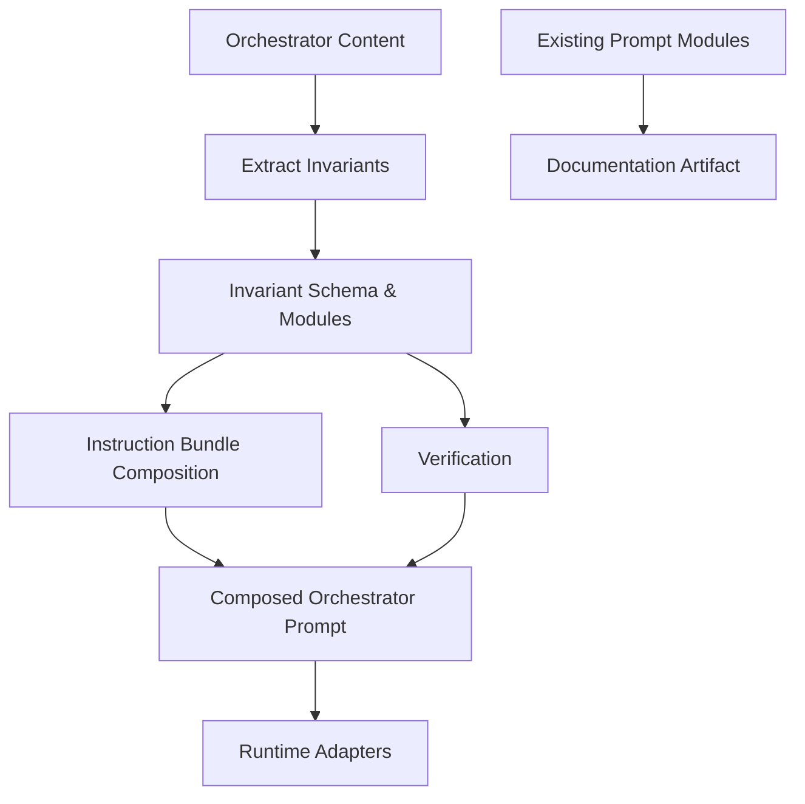

# Proposal: Persistent Orchestrator Invariants

## Intent

Critical orchestrator behavioral rules — such as asking Automatic vs Interactive before the first SDD run, remaining a pure delegator, honoring the SDD Initialization Gate and Triage Gate — are currently embedded as prose inside large prompt strings (`packages/core/src/teams/developer/orchestrator-content.ts`). Across sessions and runners, these rules are deprioritized, buried, or forgotten because they lack explicit structural identity, priority, and persistence. This change extracts the most critical rules into first-class **orchestrator invariants** that are injected with higher priority into the orchestrator prompt, and documents the existing prompt/methodology module ecosystem so the team knows what modules exist and what each governs.

## Goal

Make critical orchestrator behavioral rules structurally explicit, persist with higher priority across sessions and runners, and produce authoritative documentation of the existing prompt/methodology module inventory.

## Scope

### In Scope
- **Invariant rule schema and module**: define a schema for orchestrator invariants (rule ID, priority tier, applicable surface, condition, required action, rationale, violation consequence). Extract the highest-priority rules into invariant modules.
- **Injection and ordering mechanism**: integrate invariant modules into the existing instruction bundle / content registry composition pipeline so invariants are injected at the highest priority (e.g., prepended to the orchestrator system prompt, or composed as a dedicated `## Orchestrator Invariants` section that cannot be overridden by other bundles).
- **Verification and enforcement**: add lightweight verification that the orchestrator prompt output contains all required invariant sections; gate or warn when invariants are missing from composed output.
- **Documentation of prompt/methodology modules**: create authoritative documentation cataloguing the existing prompt module ecosystem, including:
  - **Gate keepers**: SDD Initialization Gate, SDD Triage Gate, Execution Mode Gate.
  - **Per-phase/sub-agent quality rules**: delegation triggers (4-file rule, multi-file write rule, PR rule, incident rule, long-session rule), self-audit validation, enforcement modes.
  - **Task/Apply contracts**: Apply Routing rules, Apply Batching rules, sub-agent context protocol, registry-deferred mode contract.
  - **Phase/sub-agent prompt modules**: existing `*-content.ts` agents and skills (Explorer, Proposal, Spec, Design, Task, Apply-* , Verify, Review, Archive), instruction bundles (adaptive-memory, codebase-memory, context-mode, rtk), and their composition rules.
  - **Orchestrator invariants** (new): the extracted critical behavioral rules and their priority ordering.

### Out of Scope
- Rewriting all agent prompts into a structured DSL or template language.
- Changing runtime adapter serialization logic (Pi, OpenCode) beyond consuming the new invariant content.
- Modifying the self-audit contract schema (`packages/sdd-runtime/src/contracts/self-audit.ts`) — artifact-level invariants remain separate from orchestrator behavioral invariants.
- Implementing automated prompt regression testing or A/B testing infrastructure.
- Changing enforcement mode behavior or risk scorer thresholds.

## Affected Capabilities

### New Capabilities
- `orchestrator-invariant-system`: Extract, compose, verify, and persist critical orchestrator behavioral rules with priority ordering across sessions/runners.
- `prompt-module-documentation`: Authoritative documentation catalog of all existing prompt/methodology modules, their responsibilities, and composition rules.

### Modified Capabilities
- `orchestrator-content`: The orchestrator system prompt and skill body will integrate invariant injection into the existing composition pipeline. No change to the underlying delegation philosophy or SDD workflow.
- `instruction-bundle-composition`: The composition pipeline in `packages/core/src/teams/developer/instruction-bundles/index.ts` and `content-registry.ts` may be extended to support invariant surface targeting and priority ordering.

### Unchanged Capabilities
- `self-audit-contract`: Artifact-level invariants (spec/design/tasks) remain unchanged in schema and validation.
- `enforcement-mode`: Enforcement mode logic and thresholds remain unchanged.
- `adapter-opencode` / `adapter-pi`: Adapters continue to consume composed content from core; no adapter-specific serialization changes unless required to surface new invariant sections.

## Approach

1. **Define invariant schema** in core (e.g., `packages/core/src/teams/developer/invariants/` or adjacent to instruction bundles) with TypeScript types: `OrchestratorInvariant { id, tier: "critical" | "high" | "standard", surfaces: ("session" | "agent" | "skill")[], condition, action, rationale, violationConsequence }`.
2. **Extract critical rules** from `orchestrator-content.ts` into invariant records. Initial critical-tier candidates:
   - `INV-001`: Ask Automatic vs Interactive on first SDD run per session; cache mode.
   - `INV-002`: Remain a pure delegator — never execute tasks a specialist agent can handle.
   - `INV-003`: Honor SDD Initialization Gate — check `openspec/config.yaml` `initialized` flag; delegate `deck-init` if false.
   - `INV-004`: Honor SDD Triage Gate — classify request before asking execution mode; do not infer full SDD from keywords alone.
   - `INV-005`: Registry-deferred mode for parallel phases — do not allow concurrent `state.yaml`/`events.yaml` writes by parallel agents.
3. **Extend composition pipeline** so invariants are composed before other instruction bundles, possibly as a dedicated `## Orchestrator Invariants` section in the session prompt and/or as an invariant fragment appended to the orchestrator skill body. Ensure they are not overridden or dropped by capability instruction bundles.
4. **Add verification** in `content-registry.ts` or a new invariant verifier: given composed orchestrator output, assert that all critical-tier invariants are present in the final string. Return a verification result that adapters can surface as warnings or errors.
5. **Produce documentation artifact** at `docs/prompt-methodology-modules.md` (or similar) cataloguing all modules with a summary table per module category: name, source file, surfaces affected, composition rules, and key behaviors governed.

## Alternatives and Tradeoffs

| Alternative | Why Considered | Why Not Chosen |
|---|---|---|
| Inline invariants in `orchestrator-content.ts` as structured comments/placeholders | Minimal file count, keeps prompt authoring centralized | Does not solve persistence across sessions/runners; still buried in prose |
| New DSL for all prompts (JSON/YAML prompt definitions) | Strong validation, versioning, autocomplete | Too large in scope; would require rewriting all 12 agent prompts and skills |
| Store invariants in OpenSpec config (`openspec/config.yaml`) | Already persisted and versioned | Config is project-scoped, not runner/session-scoped; invariants are agent behavior rules, not project settings |
| Use adaptive memory (Engram/Supermemory) to persist invariants | Cross-session convenience | Memory is advisory and non-authoritative per existing rules; invariants must be authoritative and deterministic |

## Risks

| Risk | Likelihood | Mitigation |
|---|---|---|
| Extracting invariants from prose introduces subtle semantic drift | Medium | Pair each invariant with the exact source paragraph from `orchestrator-content.ts` in a comment/trace field; review with user |
| Composition ordering conflicts with existing instruction bundles | Low | Invariants are appended/prepended at the highest priority tier; bundles already have `PACKAGE_ORDER`; extend with `INVARIANT_ORDER` |
| Verification produces false positives/negatives due to string matching | Low | Use normalized substring search on section headers and rule IDs; keep verification lightweight, not a full parser |
| Documentation becomes stale as prompt modules evolve | Medium | Document near code (e.g., JSDoc or markdown adjacent to `instruction-bundles/`) and require documentation updates in PR checks |

## Rollback Plan

1. Revert the invariant extraction commit. `orchestrator-content.ts` reverts to the previous full-string prompt; no other agent prompts are affected.
2. Remove any new invariant types from the instruction bundle composition pipeline; composition falls back to existing `PACKAGE_ORDER` behavior.
3. Remove verification assertions from content registry or adapter build steps.
4. Documentation can remain as-is (non-destructive) or be removed in the same revert.

## Dependencies

- None external. Internal dependency: existing `instruction-bundles/index.ts` composition pipeline and `content-registry.ts` must remain stable during this change.

## Open Questions

1. Should invariants be versioned independently (e.g., `INV-001-v1`) to support safe evolution, or is the rule ID sufficient with git history?
2. Should the verification step be a unit test in `orchestrator-content.test.ts`, a runtime check in the adapter install pipeline, or both?
3. Does the user prefer the documentation artifact as a single `docs/prompt-methodology-modules.md` file, or split per module category?
4. Are there additional critical rules beyond the five identified that should be in the initial critical tier?

## Acceptance Direction

- [ ] Invariant schema types exist in core with at least `critical` and `high` tiers.
- [ ] At least 5 critical-tier invariants are extracted from `orchestrator-content.ts` and composed into the orchestrator session prompt and skill body.
- [ ] Composed orchestrator output passes verification: all critical-tier invariants are detectable in the final string.
- [ ] Documentation artifact exists and catalogues all existing prompt/methodology modules (gate keepers, quality rules, contracts, phase/sub-agent modules, instruction bundles).
- [ ] No regression in existing tests (`bun test` passes).
- [ ] Rollback instructions are validated by reverting the change in a branch and confirming tests still pass.

## Next Steps

Ready for Spec (`deck-developer-spec`) and Design (`deck-developer-design`) in parallel.

## Mermaid Summary Source

